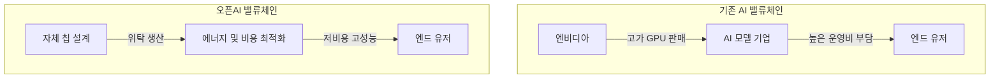

이 파일은 **미검증 원본**이다. `insights/check_frame.py` 로 원문과 대조한 뒤,
원문이 받쳐 주는 것만 카드로 옮긴다.

시니어 경영전략 컨설턴트로서, 이번 오픈AI의 '할라피뇨(Jalapeño)' 칩 발표가 갖는 비즈니스적 파급력을 분석해 드리겠습니다. 기술적 사양을 넘어, 이 사건이 산업의 가치 사슬과 수익 모델을 어떻게 뒤흔들고 있는지 세 가지 핵심 관점에서 짚어보겠습니다.

---

## 1. 돈이 도는 길 (Value Chain & Economics)

지금까지 AI 산업의 자본은 ‘범용 하드웨어(GPU) 구매’에 집중되었습니다. 엔비디아와 같은 실리콘 벤더가 막대한 마진을 챙기고, AI 기업들은 이 엄청난 자본 지출(Capex)을 감당해야만 했습니다. 하지만 할라피뇨의 등장은 이 돈의 흐름을 근본적으로 바꿉니다.

* **투자수익률(ROI) 지표의 변화:** 기존 실리콘 벤더들은 칩 자체의 제작 비용이나 서버 단위의 총소유비용(TCO)을 강조했습니다. 반면, 모델을 직접 서비스하는 오픈AI는 '요청당 에너지(Tokens per Joule)'와 '엔드유저의 체감 지연시간'을 최우선으로 삼았습니다. 이는 비용 절감의 패러다임이 '칩을 싸게 사는 것'에서 '운영비(전력비)를 극단적으로 낮추는 것'으로 이동했음을 의미합니다.
* **원가 구조의 내재화:** 초기 설계(Tape-out)에 약 1억 달러 이상이 들더라도, 장기적으로는 중간 유통 마진 없이 전력 효율이 극대화된 칩을 사용함으로써 추론(Inference) 원가를 획기적으로 낮출 수 있습니다.

---

## 2. 경쟁 구도 (Competitive Landscape)

오픈AI가 AI 기반 EDA(전자설계자동화) 툴을 활용해 단 9개월 만에 테이프아웃(Tape-out)을 완료했다는 것은 경쟁사들에게 재앙에 가까운 소식입니다.

* **엔비디아의 딜레마:** 가장 큰 고객이 1년도 안 되는 시간에 최신 칩(루빈 급)에 필적하는 성능의 칩을 만들어 냈습니다. '우리가 아니면 안 된다'는 엔비디아의 강력한 해자(Moat)가 깨졌으며, 칩 설계의 진입 장벽이 크게 낮아졌음을 의미합니다.
* **AI 모델 경쟁사 (앤스로픽, 구글 등):** 인프라 원가 싸움에서 오픈AI에게 절대적으로 불리해졌습니다. 타사들은 값비싼 엔비디아 GPU를 쓰거나 외부 클라우드에 의존해야 하지만, 오픈AI는 동일한 비용으로 훨씬 더 많은 사용자 트래픽을 감당할 수 있게 됩니다.
* **새로운 무기상들의 부상:** 이 과정에서 엔비디아를 대체할 생태계 파트너들(브로드컴, 셀레스티카, TSMC 등)과 AI 기반 칩 설계 툴을 제공하는 기업들이 새로운 수혜자로 떠오르고 있습니다.

---

## 3. 회사의 다음 수 (Next Strategic Moves)

이제 오픈AI의 경영진 앞에는 이 막강한 무기를 어떻게 활용할 것인가에 대한 전략적 선택지가 놓여 있습니다.

1. **극단적 최적화를 통한 '초격차' 확보 (애플 모델):**
할라피뇨 칩이 범용 오픈소스 모델도 돌릴 수 있다고 밝혔지만, 2세대·3세대 칩은 오직 GPT 모델의 구조에만 완벽하게 맞춤화(Co-design)할 가능성이 높습니다. 소프트웨어와 하드웨어의 극단적 결합을 통해 경쟁사가 도저히 따라올 수 없는 속도와 가격을 엔드유저에게 제공하여 시장을 독식하는 전략입니다.
2. **인프라의 B2B 서비스화 (AWS 모델):**
칩 설계 및 생산에 들어간 막대한 매몰 비용을 회수하기 위해, 남는 컴퓨팅 자원을 타사에 임대하는 네오 클라우드(Neo-cloud) 비즈니스를 전개할 수 있습니다. "가장 저렴하고 빠른 AI 인프라"를 기업 고객에게 제공함으로써, 사실상 클라우드 서비스 제공자(CSP)의 영역까지 침투하는 전략입니다.
3. **AI가 AI 칩을 만드는 '플라이휠' 가속:**
1세대 칩에서 얻은 데이터와 더 똑똑해진 GPT 모델을 활용해 2세대 칩의 설계 기간을 9개월에서 더 단축시킬 것입니다. 전통적인 반도체 기업들의 1~2년 주기 로드맵을 소프트웨어 개발 주기처럼 단축시켜, 하드웨어 혁신 속도 자체를 통제하게 될 것입니다.