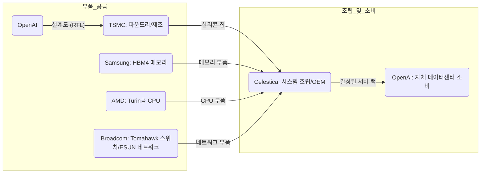

이 파일은 **미검증 원본**이다. `insights/check_frame.py` 로 원문과 대조한 뒤,
원문이 받쳐 주는 것만 카드로 옮긴다.

| 다루는 것 | 묻는 것 |
| --- | --- |
| 돈이 도는 길 | ① 칩을 만들기 위한 가치사슬의 각 단계는 누가 쥐고 있는가?<br>

<br>② 완성된 칩의 최종 수요자는 누구인가? |
| 경쟁 구도 | ① 9개월의 설계 주기가 기존 반도체 벤더들에게 어떤 위협인가?<br>

<br>② 범용 GPU 및 특화 LPU(SRAM)와 비교해 어떤 포지셔닝을 취하는가? |
| 회사의 다음 수 | ① 막대한 칩 개발 비용(약 1억 달러 추정)을 어떻게 회수할 것인가?<br>

<br>② 향후 자사 모델 전용으로 특화할 것인가, 범용성을 유지할 것인가? |
| 한계 | ① 원문에서 추정(Speculation)으로 밝힌 정보는 무엇인가?<br>

<br>② 본문에서 다루지 않거나 알 수 없는 내용은 무엇인가? |

### 1. 돈이 도는 길 (가치사슬)

OpenAI의 Jalapeño 칩은 전통적인 반도체 기업(Nvidia 등)을 거치지 않고, 설계부터 시스템 조립까지 직접 파트너사를 통제하는 다이렉트 밸류체인을 구축했습니다. 완성된 칩은 외부로 판매되지 않고 OpenAI가 자체 데이터센터(인퍼런스)에서 전량 소비합니다.



* **마진 및 교섭력:** 원문에는 각 벤더가 취하는 마진율이나 OpenAI와 파트너사 간의 교섭력(Pricing power)에 대한 언급이 없습니다. 설계 비용(약 1억 달러) 역시 진행자의 예시 값일 뿐 공식적인 재무 데이터는 공개되지 않았습니다.

### 2. 경쟁 구도

**① 속도의 파괴력: 9개월의 설계 주기**
AI(GPT-3급 모델 등)와 소규모 정예 팀을 활용해 백지상태에서 테이프아웃(Tape-out)까지 단 9개월이 걸렸습니다. 통상 2~3년이 걸리던 칩 개발 주기를 1년 미만으로 단축한 것은, AI 랩이 엔비디아와 같은 거대 벤더의 차세대 칩(Blackwell, Rubin 등)에 대항하는 자체 실리콘을 실시간에 가깝게 찍어낼 수 있음을 의미합니다. 이는 실리콘 벤더들의 시장 장악력에 직접적인 위협이 됩니다.

**② 포지셔닝: 다크 실리콘과 범용성**
Jalapeño는 TCO(총 소유비용)나 제조 원가를 낮추는 데 집중하지 않고, 오직 '최종 AI 사용자의 경험(전체 지연시간)'과 '요청당 에너지(전력 효율)'에 집중해 설계되었습니다.
특히 워크로드(Pre-fill, Decode 등)의 비율이 수시로 변하는 환경에서, 기존 GPU 진영이 택하는 '물리적 칩 분할' 대신 단일 칩 내에서 안 쓰는 영역의 전원을 차단하는 **'다크 실리콘'** 전략을 채택해 가동률 손실(대기/휴지 상태)을 막았습니다.

```mermaid
flowchart TB
  subgraph 설계방식 — 워크로드별 칩 분리 배치
    A(워크로드 유입) --> B(Pre-fill 전용 GPU)
    A -. "Decode 요청 감소" .-> C(Decode 전용 GPU)
    B --> D(풀 가동)
    C -.-> E(가동 중단 / 유휴 자원 발생)
  end

  subgraph 설계방식 — 다크 실리콘 적용 단일 칩
    F(워크로드 유입) --> G(Jalapeño 단일 가속기)
    G --> H(Pre-fill 연산 블록 켜짐)
    G -. "Decode 연산 불필요" .-> I(Decode 연산 블록 꺼짐 / 다크 실리콘)
    I --> J(전력 절감 및 자원 낭비 최소화)
  end

```

*결과적으로 Jalapeño는 소형 모델 기준 사용자당 초당 1,000토큰 이상의 처리량을 달성하며, 거대한 랙 단위 하드웨어가 필요한 Groq(SRAM 기반)의 영역까지 효율적으로 커버합니다.*

### 3. 회사의 다음 수

**① 투자비 회수 방안 (수익화 모델)**
수억 달러에 달하는 개발 및 양산 비용을 고려할 때, OpenAI 내부에서도 칩을 외부에 판매하거나 대여할지에 대한 전략적 고민이 따를 것입니다. 경쟁사(Anthropic 등)에는 팔지 않더라도, 온프레미스를 원하는 엔터프라이즈 기업이나 네오클라우드(Neo-cloud)와 파트너십을 맺고 'OpenAI 인퍼런스 서비스' 전용 칩으로 렌탈 수익을 창출하여 개발비를 상각(Amortize)하는 방안이 거론됩니다.

**② 칩의 진화 방향 (특화 vs 범용)**
현재 1세대 칩은 오픈소스 모델(Llama 등)부터 Kimi 모델까지 구동할 수 있는 범용 추론 칩으로 설계되었습니다. 그러나 차세대(Gen 2, Gen 3) 칩에서는 외부 모델 호환성을 포기하더라도, OpenAI 자사 모델에만 극단적으로 맞춤 설계(Co-design)하여 Cerebras급의 압도적인 성능을 끌어내는 방향으로 선회할 가능성이 있습니다. 현재의 범용성은 향후 자사의 새로운 모델 아키텍처를 테스트하기 위한 포석일 수 있습니다.

### 4. 한계

* **원문 내 추정(Speculation) 정보:**
* HBM4 메모리의 공급사가 삼성(Samsung)이라는 점 (SemiAnalysis의 2026년 8월 기준 추정치).
* 시스템 레벨 설계 및 조립 파트너가 **Celestica**라는 점 (SemiAnalysis 추정치).
* 초기 테이프아웃 및 램프업 비용이 "약 1억 달러(100 million)"라는 언급 (진행자의 러프한 예시 값).


* **다루지 않은 내용:** 칩 내부의 NUMA 스타일 HBM 슬라이스 구조, 메모리 병목(Contention) 해결을 위한 하드웨어적 상세 기전, Tomahawk 스위치를 이용한 2단계 Clos 토폴로지(네트워크 구조) 등 기술 전문가가 다뤄야 할 세부 스펙은 경영 관점 분석에서 제외했습니다. 원문은 칩 자체의 정확한 판가나 생산 수율에 대해서도 정보를 제공하지 않습니다.