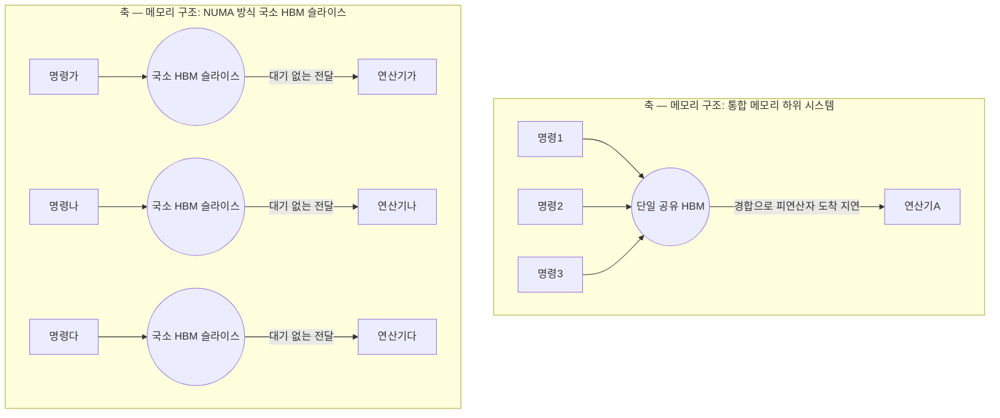
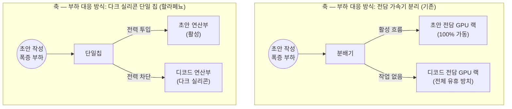

이 파일은 **미검증 원본**이다. `insights/check_frame.py` 로 원문과 대조한 뒤,
원문이 받쳐 주는 것만 카드로 옮긴다.

| 다루는 것 | 묻는 것 |
| --- | --- |
| 사용자 경험과 에너지 | ① 칩 설계의 최우선 목표 지표로 삼은 두 축은 무엇인가? 

 ② 두 지표 간의 상충은 어떻게 투명하게 다루었는가? 

 ③ 기능 목록에서 무엇을 뺄지 결정한 기준은 무엇인가? |
| 국소 HBM 슬라이스 | ① 기존의 단일 공유 메모리 구조가 겪는 병목은 무엇인가? 

 ② NUMA 방식의 메모리 할당이 어떻게 경합을 없애는가? 

 ③ KV 캐시의 위치 이동을 제한한 까닭은 무엇인가? |
| 다크 실리콘 | ① 추론 작업 부하의 성격과 비율은 왜 수시로 변동하는가? 

 ② 작업을 전담 가속기로 나눌 때 발생하는 자원 낭비는 무엇인가? 

 ③ 다크 실리콘을 허용한 단일 균형 칩이 갖는 구조적 이점은 무엇인가? |
| 스케일업 네트워크 | ① 개별 칩의 전력 사양을 낮게 잡은 까닭은 무엇인가? 

 ② 네트워크 계층은 어떤 토폴로지로 얼마나 확장되는가? |
| 한계 | ① 벤치마크 조건에서 아직 검증되지 않은 영역은 어디인가? 

 ② 패널들이 자체적으로 추정한 미공표 사양은 무엇인가? 

 ③ 본 글의 분석에서 제외된 원문 내용은 무엇인가? |

---

## 1. 사용자 경험과 에너지

**① 최우선 목표 지표**
OpenAI의 할라페뇨(Jalapeño) 칩은 팹리스나 실리콘 벤더가 아닌 'AI 모델 랩'이 직접 설계한 칩입니다. 이들은 칩의 구매자가 아닌 '엔드 유저'를 중심에 두었으며, 이에 따라 두 가지 지표를 최우선으로 삼았습니다. 첫째는 사용자 경험(End-to-end latency)으로, 첫 토큰이 나오는 시간이 아니라 마지막 토큰이 완성되는 시간입니다. 둘째는 요청당 에너지(Energy per request, Tokens per Joule)로, 단순히 토큰을 얼마나 빨리 뽑아내느냐가 아니라 그 토큰을 뽑는 데 에너지를 얼마나 썼느냐를 따집니다.

**② 상충 지표의 취급**
속도(사용자 경험)와 전력(에너지)은 태생적으로 상충합니다. 전력을 더 인가하면 칩은 무조건 더 빠르게 동작하기 때문입니다. 설계팀은 단일 성능 수치로 이면을 감추는 대신, **파레토 프론티어(Pareto frontier) 곡선**을 제시했습니다. 한계 곡선을 통해 전력이라는 손잡이(knob)를 돌릴 때 지연 시간이 어떻게 변하는지 그 상충 관계를 투명하게 드러냈습니다.

**③ 기능 취사선택의 기준**
칩 설계 주기는 첫 RTL(레지스터 전송 레벨)부터 테이프아웃까지 9개월 [2026년 8월, 공표치]이라는 이례적으로 짧은 시간에 끝났습니다. 짧은 주기 안에 기능 목록을 쳐내야 할 때, 이들은 '한계 비용(Marginal cost)'과 '기회비용(Opportunity cost)'을 저울질했습니다. 특정 기능을 추가할 때 면적과 트랜지스터가 늘어나는 한계 비용보다, 그 기능이 없어서 사용자 수요를 감당하지 못할 때 겪는 후회(기회비용)가 훨씬 크다고 판단했습니다. 즉, 물리적 칩 면적이라는 한계와 시장의 요구라는 기회비용이 상충하는 지점에서 차세대 칩(Gen 2)으로 미룰 기능을 잘라냈습니다.

---

## 2. 국소 HBM 슬라이스

**① 통합 메모리의 병목**
이 칩의 HBM 총대역폭은 이론상 초당 페타바이트 단위에 달하지만, 이를 100% 활용하는 것은 불가능에 가깝습니다. 연산기들이 거대한 단일 HBM을 공유하는 구조에서는, 스케일업 네트워크의 이웃 칩들과 메모리 자원을 두고 극심한 경합(Contention)이 발생합니다. 대역폭이 아무리 넓어도 데이터가 제때 레지스터에 도착하지 않으면(operands arrive late), 플롭스(Flops)가 낭비되고 메모리 활용률이 추락합니다.

**② NUMA 방식의 해결책**
설계팀은 대역폭 자체를 늘리기보다(예: HBM의 핀당 속도를 무작정 올리는 것), 있는 대역폭의 활용률을 높이는 길을 택했습니다. 이를 위해 **NUMA(Non-Uniform Memory Architecture) 스타일의 국소 HBM 슬라이스 구조**를 채택했습니다.

각 가속기마다 전용 HBM 슬라이스와 지연 시간이 짧고 효율이 높은 전용 버스를 할당했습니다. 메모리를 파편화하여 관리 복잡도가 올라가는 것을 감수하고서라도, 연산 대기 시간을 없애 실제 유효 플롭스를 끌어올리는 절충안입니다.

**③ KV 캐시의 지역성**
LLM 디코딩 과정에서 가장 무거운 작업은 토큰마다 KV 캐시를 옮기는 일입니다. 할라페뇨는 이 KV 캐시 데이터를 이리저리 이동시키는 대신, 메모리 슬라이스 내부에 국소적으로 묶어두는(Keep it local) 아키텍처를 취해 데이터 이동 병목을 원천적으로 억제했습니다.

---

## 3. 다크 실리콘

**① 부하 변동성의 원인**
추론 모델은 '추측성 디코딩(Speculative decoding)' 기법을 씁니다. 작은 모델(초안 모델)이 빠르게 여러 토큰을 흩뿌리듯 생성(Drafting)하면, 큰 모델이 그중 어느 것이 맞는지 검증(Verification)합니다. 사용자가 요청하는 모델의 크기나 작업 성격에 따라 초안 생성에 집중해야 할지, 검증 작업에 자원을 더 쏟아야 할지 그 비율이 실시간으로 요동칩니다.

**② 전담 가속기의 자원 낭비**
일반적인 GPU 시스템은 이 문제를 해결하기 위해 '초안 작성용(Pre-fill) GPU 랙'과 '디코드/검증용 GPU 랙'을 물리적으로 나눠서 대응합니다. 하지만 이는 작업 부하 비율이 한쪽으로 쏠릴 경우, 반대쪽 랙 전체가 아무 일도 하지 않고 방치되는 심각한 유휴 자원 낭비를 낳습니다.

**③ 단일 칩과 다크 실리콘**
할라페뇨는 "다크 실리콘이 유휴 가속기보다 저렴하다(Dark silicon is cheaper than idle accelerators)"는 원칙으로 단일 균형 칩 설계를 채택했습니다.

단일 칩 내부에 연산, 대역폭, IO를 넉넉하게 집어넣고, 당장 쓰지 않는 논리 회로 영역은 전력을 차단(Gating)하여 '다크 실리콘'으로 만듭니다. 특정 알고리즘 비율에 칩을 얽매이지 않게 하여 미래의 모델 변화에도 칩의 수명을 길게 가져가는 유연성을 얻었습니다.

---

## 4. 스케일업 네트워크

**① 전력 사양의 설계 의도**
할라페뇨의 TDP(열 설계 전력)는 700W [2026년 8월, 공표치]입니다. 이는 경쟁 제품인 엔비디아 블랙웰 GB200(약 1200W)에 비해 크게 낮습니다. 절대적인 최대 성능 수치를 경쟁사만큼 끌어올리는 것보다, 와트당 토큰 생성량(에너지 효율)을 극대화하는 쪽으로 사양을 타협한 결과입니다. 소형 모델(GPT OSS 120B) 구동 시 이 700W 칩으로도 사용자당 초당 1,000토큰 이상 [2026년 8월, 공표치]을 달성하며 SRAM 칩(예: Groq) 영역의 성능을 냈습니다.

**② 네트워크 토폴로지 확장**
Broadcom의 ESUN을 활용해 두 계층의 Clos 토폴로지(half flattened two-level Clos topology)를 구성했습니다.

1. **1계층(랙 내부 추정):** 600 Gbps 칩 간 통신(Tomahawk 6 스위치)으로 128개의 할라페뇨를 하나의 대규모 스케일업 도메인으로 묶습니다.
2. **2계층(랙 간 확장):** 200 Gbps 레인 연결로 최대 2,048개의 칩(약 16개 랙)까지 스케일업 도메인을 넓힙니다.

---

## 5. 한계

**① 벤치마크 검증 누락**
Inference X 벤치마크를 통해 칩의 성능을 공개했으나, 입력/출력 컨텍스트 길이가 짧은 조건에서만 테스트되었습니다. 100만 단위의 대규모 입력 컨텍스트 길이나, 에이전트형 작업 부하(AgentX 플랫폼 등)에서의 성능은 아직 검증되지 않았습니다.

**② 패널 추정 미공표 사양**
원문 패널들은 다음 사양을 공식 발표가 아닌 정황 기반으로 추정했습니다. 이 값들은 제조사의 공식 사양과 다를 수 있습니다.

* **CPU:** AMD Turin 급 x86 CPU [추정치]
* **공정 노드:** TSMC N3 (N3P 또는 N3E) [추정치]
* **메모리:** 삼성 HBM4 [추정치]
* **시스템 제조:** Celestica [추정치]

**③ 다루지 않은 내용**
이 글은 할라페뇨 칩이 범용성을 유지함으로써 엔비디아, 구글(TPU), AMD에 미치는 시장 판도 영향, 그리고 AI 툴이 EDA(전자 설계 자동화) 산업과 투자 지형에 미칠 재무적 파급 효과 등 비즈니스 및 전략적 판단은 제외했습니다.