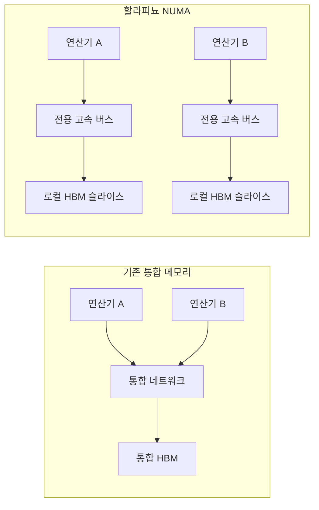
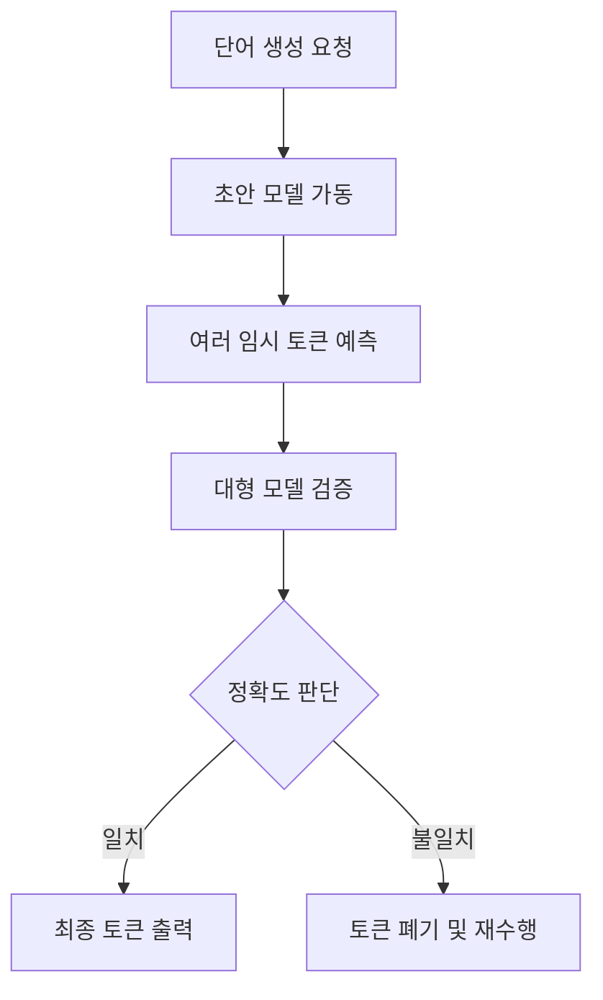

이 파일은 **미검증 원본**이다. `insights/check_frame.py` 로 원문과 대조한 뒤,
원문이 받쳐 주는 것만 카드로 옮긴다.

시니어 기술 전문가로서 OpenAI의 추론 전용 가속기 '할라피뇨(Jalapeño)'의 기술적 아키텍처와 설계 결정의 배경을 해부해 드리겠습니다.

이 칩은 철저히 '모델을 직접 서비스하는 기업'의 시각에서 설계되었습니다. 실리콘 벤더들이 칩의 TCO(총소유비용)나 범용성에 집착할 때, OpenAI는 사용자 경험(최종 토큰 응답 시간)과 요청당 에너지(Tokens per Joule)라는 명확한 두 가지 목표에 아키텍처의 초점을 맞췄습니다.

---

## 1. 핵심 아키텍처: NUMA 스타일 로컬 HBM 슬라이스

현세대 AI 가속기들이 직면한 가장 큰 문제는 "연산기가 아무리 빨라도 데이터가 늦게 도착한다(Operands arrive late)"는 점입니다. 통합 메모리(Unified Memory) 환경에서는 여러 가속기가 동시에 HBM에 접근하며 네트워크 경합이 발생하고, 결국 연산기(Flops)가 데이터를 기다리며 쉬는 유휴 상태가 발생합니다.

이를 해결하기 위해 할라피뇨는 **NUMA(Non-Uniform Memory Access) 스타일의 아키텍처**를 채택했습니다. 모든 가속기가 거대한 메모리 풀을 공유하는 대신, 각 가속기에 '로컬 HBM 슬라이스'와 '전용 저지연 버스'를 할당했습니다.

**[설계 선택의 이유]**
이론적인 최대 연산량(Flops)을 자랑하기보다, 실제로 사용자에게 '전달된 연산량(Delivered Flops)'을 극대화하기 위함입니다. 메모리 경합을 물리적으로 차단하여 캐시 지역성(Cache Locality)을 확보하고, KV 캐시 이동을 최소화해 디코딩 성능을 끌어올렸습니다.

## 2. 동적 워크로드 대응: "다크 실리콘이 더 싸다"

LLM 추론은 크게 모델을 메모리에 올리는 사전 채우기(Pre-fill)와 토큰을 하나씩 생성하는 디코딩(Decode)으로 나뉩니다. 기존에는 효율을 위해 Pre-fill 전용 칩과 Decode 전용 칩을 물리적으로 나누는 방식(예: GPU + Groq LPU 조합)이 제안되었습니다.

하지만 OpenAI는 "단일 칩 내에서 안 쓰는 영역의 전력을 차단(Dark Silicon)하는 것이, 특정 작업 전용 가속기 전체가 통째로 노는 것(Idle)보다 훨씬 저렴하다"는 결론을 내렸습니다.

특히 할라피뇨는 **추측 해독(Speculative Decoding)** 워크로드에 완벽히 대응합니다. 작은 모델이 여러 토큰을 초안(Draft)으로 던지면, 큰 모델이 이를 검증(Verify)하는 비율은 모델 크기와 사용자 요청에 따라 실시간으로 변합니다. 할라피뇨는 이 변화에 맞춰 칩 내부의 연산 및 메모리 자원을 동적으로 할당하고 미사용 영역은 전력을 내립니다.

## 3. 하드웨어 사양 및 스케일업 네트워크

할라피뇨는 전성비와 확장성 면에서 현재 시장의 하이엔드 칩들과 궤를 달리하는 선택을 했습니다.

* **공정 및 전력:** TSMC N3 공정 기반. TDP는 700W로, 1,200W를 훌쩍 넘는 블랙웰(Blackwell) 대비 압도적인 에너지 효율(Tokens per Watt)을 달성했습니다.
* **메모리:** 최신 **HBM4**를 탑재하여 최고 수준의 메모리 대역폭을 확보했습니다. 소형 모델(120B) 구동 시 유저당 초당 1,000토큰 이상을 처리하며 SRAM 기반 칩들의 전유물이었던 영역까지 도달했습니다.
* **스케일업 네트워크 (ESUN):** Broadcom의 Tomahawk 6 스위치를 활용해 칩당 600Gbps 대역폭을 지원합니다. 랙 내 128개 칩을 묶고, 2단계 Clos 토폴로지를 통해 최대 2,048개의 칩을 단일 스케일업 도메인으로 확장할 수 있습니다.

## 4. AI가 주도한 9개월의 초고속 설계 주기

기술적으로 가장 놀라운 부분 중 하나는 **RTL(레지스터 전송 레벨) 설계부터 테이프아웃(Tape-out)까지 단 9개월**이 걸렸다는 점입니다. 통상 2~3년이 소요되는 과정을 GPT-3 클래스 이상의 AI 기반 EDA(전자 설계 자동화) 도구를 활용해 단축했습니다.

이는 단순히 칩이 빨리 나왔다는 것을 넘어, OpenAI가 자사의 최신 알고리즘(S/W) 구조에 정확히 들어맞는 맞춤형 실리콘(H/W)을 1년 주기로 찍어낼 수 있는 파이프라인을 구축했다는 것을 의미합니다.

---

요약하자면, 할라피뇨는 범용성을 핑계로 발생하는 비효율을 걷어내고, LLM 추론 단계의 메모리 병목과 에너지 낭비를 타깃으로 삼아 극단적으로 최적화한 '목적 지향적 엔지니어링의 결정체'라고 평가할 수 있습니다.

추가로 할라피뇨 아키텍처가 기존 X86 호스트 CPU(Turin)와 데이터를 주고받는 I/O 병목 처리 방식에 대해 더 깊이 파고들어 볼까요?