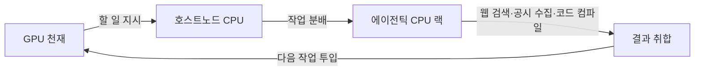
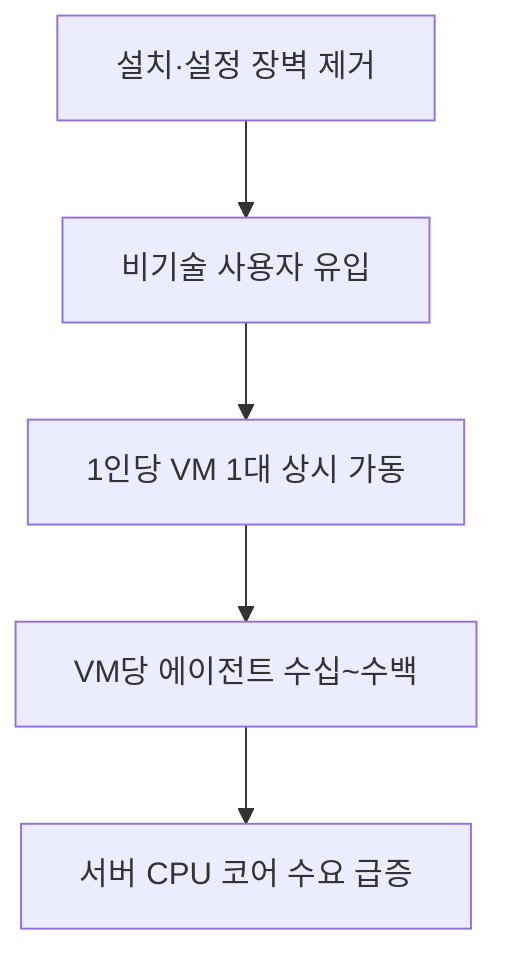
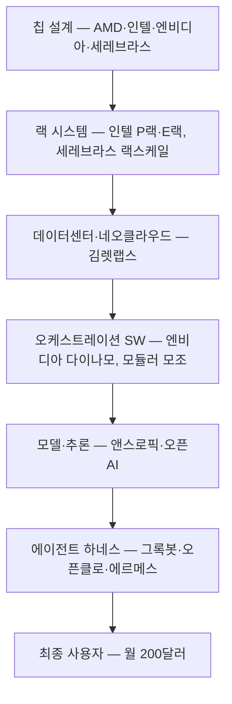
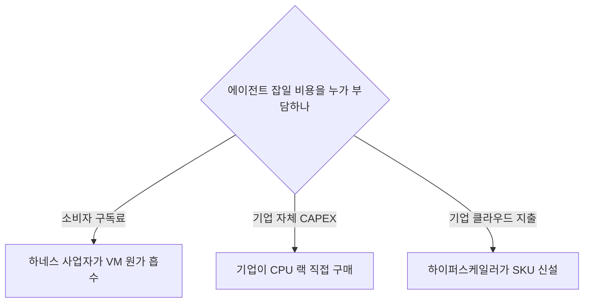

이 파일은 **미검증 원본**이다. `insights/check_frame.py` 로 원문과 대조한 뒤,
원문이 받쳐 주는 것만 카드로 옮긴다.

# 에이전틱 CPU — 경영 관점 해설

## 목차

| 마디 | 꼴 | 절 |
|---|---|---|
| 그록봇이 실제로 판 것 | 문제와 처방 | ① |
| 에이전트를 어디에 태우나 | 대비 — 자가 보유 하드웨어 · 임대 VM | ② |
| 일감이 CPU로 흘러가는 경로 | 인과 사슬 | ③ |
| 수요가 불어나는 증폭 구조 | 인과 사슬 | ④ |
| 밸류체인 — 누가 쥐고 누가 사나 | 부분 나눔 — 단계 순서 | ⑤ |
| 서버 CPU 경쟁 구도 | 대비 — 파는 물건 | ⑥ |
| 비어 있는 층 — 오케스트레이션 | 문제와 처방 | ⑦ |
| 진영별 다음 수 | 조건 갈림 | ⑧ |
| 한계 | — | ⑨ |

---

## ① 그록봇이 실제로 판 것

문제: 에이전트 쓰려면 설치·API 키·MCP 커넥터·보안 격리를 사용자가 직접 해야 했다. 오픈클로·에르메스 경로. 대다수 이탈 지점.

처방: 그록봇은 소프트웨어가 아니라 **클라우드 VM 한 대를 통째로** 판다. 툴 연동(구글 캘린더·드라이브·캔바·피그마)은 설치 시점에 선택만 하면 붙고, 보안 책임은 판매자로 넘어간다. 가격 월 200달러(원문 명시, 2026-08 시점).

경영적 의미는 제품이 아니라 과금 형태다. **일회성 하드웨어 구매가 반복 구독으로 바뀌었다.** 사용자는 토큰만 본다 — 어느 모델을 썼는지, 어느 CPU에 얹혔는지 모른다. 원문의 지적: 통제권과 토큰 최적화 여지를 내주는 대가로 편의를 산다. 판매자 입장에선 그 불투명성이 곧 마진 조절 레버다(원문은 이 마진을 수치로 밝히지 않는다).

## ② 에이전트를 어디에 태우나

작년 12월 에이전트 등장 직후 맥미니 사재기가 있었다. 원문 진단: 메모리도 NPU도 아니고 **격리** 때문이었다. 내 노트북에 에이전트 권한 주기 싫으니 별도 기계를 산다.

자가 보유 쪽 실패 원인은 기술이 아니라 운영 부담이다. UPS, 예비 회선, 테일스케일 설정. 원문 표현대로 "엄마한테 시킬 수 없는" 목록. 이 부담이 곧 클라우드 사업자의 가격 결정력이다.

인텔은 이 전환의 1차 물결조차 예측 못 했다. 원문 인용: 2월 실적 발표에서 "CPU 수요가 많은데 올 줄 몰랐다". 수요 예측 실패가 공급자 쪽에서 이미 한 번 났다는 기록.

## ③ 일감이 CPU로 흘러가는 경로

원문의 핵심 비유. GPU는 천재, CPU는 조수.

챗봇 시대엔 호스트노드 CPU 하나면 됐다. 천재를 놀리지 않는 것이 유일한 임무였고, 그래서 코어 수보다 단일코어 속도와 GPU와의 코히런시(그레이스 블랙웰의 C2C 같은)가 중요했다.

에이전트 시대엔 일이 넘친다. SEC 공시 50곳 긁어오기, 코드 컴파일, 웹 크롤링. 호스트노드가 이 일을 맡으면 GPU가 논다 — 최악의 시나리오. 그래서 **넘치는 일감 전용 CPU 랙**이 필요하다. 이것이 '에이전틱 CPU'라는 신조어의 실체다. 원문은 이를 마케팅 용어라고 스스로 인정한다.

코어를 사무실 평면도로 보는 비유가 구매 기준을 정한다. 코어 4개 = 재무팀, 4개 = 리서치팀. 그러면 질문은 **코어당 획득 비용과 코어 한 개의 역량 사이의 균형**이 된다. 인턴 8명이냐 경력자 8명이냐. 워크로드가 답을 정한다.

## ④ 수요가 불어나는 증폭 구조

원문의 산수(오스틴 추정, 저자 제안치): 사용자 1,000만 명 × VM 1대 = 1,000만 코어. VM당 에이전트 100개면 **10억 코어**. 검증된 수치가 아니라 대화 중 즉석 추산이다.

맥미니 물결과의 차이가 투자 판단의 갈림길이다. 맥미니는 GPU 토큰 수요와 호스트노드 CPU를 늘렸지만, 에이전트 잡일 자체는 사용자 책상 위에서 돌았다 — 서버 매출로 안 잡혔다. 클라우드 VM 경로는 **그 잡일까지 데이터센터로 끌어온다**. 서버 CPU에 유리하다는 결론이 여기서 나온다.

## ⑤ 밸류체인 — 누가 쥐고 누가 사나

단계별로 누가 쥐고 누가 사는지, 원문에서 확인되는 만큼만:

| 단계 | 쥔 쪽 | 사는 쪽 | 원문이 밝힌 것 |
|---|---|---|---|
| 칩 설계 | AMD(256코어), 인텔(288코어), 엔비디아(그레이스 블랙웰), 세레브라스 | 하이퍼스케일러, 네오클라우드, 기업 | 스펙과 사명만. 점유율·단가 없음 |
| 랙 시스템 | 인텔(P랙·E랙, 올여름 출시) | 데이터센터 사업자 | 워크로드별 구성 컨설팅을 인텔이 제공한다는 언급 |
| 데이터센터·네오클라우드 | 하이퍼스케일러, 김렛랩스류 | 모델·하네스 사업자 | 하이퍼스케일러는 워크로드 특화 SKU, 기업은 범용 SKU 구매 |
| 오케스트레이션 | 엔비디아 다이나모(GPU 층), 모듈러(모조) | 클라우드·네오클라우드 | 아직 빈 층이라고 원문이 명시 — ⑦ 참조 |
| 모델·추론 | 앤스로픽(오퍼스), 오픈AI, xAI, 파블 | 하네스 사업자 | 워크로드별 프론티어 모델 필요성만 |
| 라우팅 미들웨어 | 오픈라우터 | 직접 구성 사용자 | 스트라이프 인수설 언급 — 원문도 "maybe"로 처리 |
| 툴 SaaS | 구글(캘린더·드라이브), 캔바, 피그마 | 하네스 사업자가 연동 | 연동 대상으로만 등장 |
| 에이전트 하네스 | 그록봇(xAI), 오픈클로, 에르메스 | 최종 사용자 | 유일한 공표 가격 — 월 200달러 |

**마진과 교섭력은 원문에 없다.** 어느 단계가 이익을 가져가는지, 누가 협상 우위인지 회차가 다루지 않는다. 위 표는 절반짜리 그림이다 — 흐름은 그렸고 배분은 못 그렸다.

## ⑥ 서버 CPU 경쟁 구도

축은 **파는 물건의 모양**이다. 사양이 아니라 어떤 일감 형태를 겨냥해 파느냐.

| 파는 물건 | 겨냥한 일감 | 회차 등장 사례 |
|---|---|---|
| 코히런시 있는 호스트노드 | GPU 옆에 붙어 천재 먹여살리기 | 그레이스 블랙웰 C2C |
| 고코어 저클럭 랙 | 넘치는 잡일 대량 병렬 처리 | 인텔 E랙, AMD 256코어, 인텔 288코어 |
| 고클럭 저코어 랙 | 지연이 중요한 에이전트 작업 | 인텔 P랙 |
| 범용 SKU | VM 호스팅, OS 구동 | 그록봇 VM이 여기 얹힌다는 추정 |

원문 결론이 판매자에게 불편하다: **"최고의 에이전틱 CPU는 없다. 다 옳은 CPU다."** 승부는 코어당 원가와 TCO, 그리고 고객 워크로드에 맞춘 코디자인으로 넘어간다. 즉 **스펙 경쟁이 아니라 컨설팅+원가 경쟁**이다. 인텔이 워크로드별 구성 추천을 제공하는 것은 이 인식의 제품화다.

GPU 쪽도 같은 분화가 진행 중이다. 세레브라스는 웨이퍼 스케일에서 랙 스케일로 판매 단위를 올렸다(녹음 전날 발표). 원문 비유: 속도만 빠르고 기억 못 하는 천재. HBM 기반 가속기는 문맥이 넓은 천재. 그리고 아직 아무도 안 파는 것 — **느려도 싸게 오래 생각하는 천재**. 기상·신약 같은 지연 무관 워크로드용. 원문이 지목한 빈 자리다.

## ⑦ 비어 있는 층 — 오케스트레이션

문제: 빠른 천재 랙, 보통 천재 랙, P코어 랙, E코어 랙이 한 데이터센터에 섞이는데 **일감을 올바른 하드웨어에 배분하는 상위 소프트웨어가 없다.**

엔비디아 다이나모는 GPU를 잘 굴리는 층이지 그 위층이 아니다. 모듈러(모조)는 이기종 하드웨어를 하나의 언어로 다루지만 여전히 추론 쪽에 가깝다. 김렛랩스는 네오클라우드 관점에서 같은 문제를 판다 — 스케줄링을 잘하면 원가가 내려간다.

처방이 곧 사업 기회다. **CPU와 GPU 사이 데이터 이동과 배분을 관장하는 플랫폼 층.** 원문 저자 둘 다 소프트웨어 전문가가 아니라며 존재 여부를 확언하지 않는다 — 즉 이건 검증된 공백이 아니라 제기된 공백이다.

## ⑧ 진영별 다음 수

갈림의 축: **누구 예산에서 하드웨어가 나가느냐.**

**칩 설계사(AMD·인텔).** 코어 수 경쟁은 이미 붙었다. 남은 수는 워크로드 매핑 컨설팅을 제품에 묶어 파는 것 — 인텔 P랙/E랙 분리가 그 방향의 첫 수다. 인텔은 한 번 수요를 놓쳤으므로 예측 체계 자체가 과제다.

**하네스 사업자(xAI).** 월 200달러는 대중가가 아니다. 원문도 "대부분 안 살 것"이라고 본다. 다음 수는 가격 하향과, 그 하향을 감당할 원가 절감 — 즉 값싼 에이전틱 CPU 확보와 모델 라우팅. 사용자가 내부를 모른다는 점이 원가 절감 여지를 만든다.

**클라우드·네오클라우드.** 스케줄링 우위가 곧 가격 우위다. 이기종 랙을 섞어 사고 배분을 잘하는 쪽이 이긴다.

**모델 사업자(앤스로픽·오픈AI).** 원문이 던진 미해결 질문 — 실제로 얼마나 전용 에이전틱 CPU에 얹고 얼마나 범용 CPU에 얹고 있나. 공개되지 않았다. 이 비율이 상류 수요의 실제 크기를 결정한다.

**기업 고객.** 랙을 직접 살지 클라우드에 계속 기댈지 정해지지 않았다. 원문이 결론 없이 남긴 질문이고, ③~⑥의 수요 예측이 전부 여기에 매달려 있다.

## ⑨ 한계

- **마진·교섭력 없음.** 밸류체인 어느 단계에서 이익이 나는지, 누가 가격을 정하는지 회차가 다루지 않는다. ⑤ 표는 흐름만 그린 절반짜리다.
- **10억 코어는 즉석 추산.** 사용자 1,000만·VM당 에이전트 100개 모두 진행자 오스틴이 대화 중 제시한 가정치(2026-08-25). 시장 조사가 아니다.
- **에이전틱 CPU는 마케팅 용어.** 원문 스스로 인정. 호스트노드와 물리적으로 다른 칩이라는 근거는 없고, 코히런시 불필요라는 기능적 차이만 언급된다.
- **오케스트레이션 공백은 미확인.** 저자 둘 다 소프트웨어 비전문가라고 밝히며 모듈러의 실제 역량을 모른다고 했다.
- **오픈라우터 스트라이프 인수는 원문도 "maybe".** 확정 아님.
- **그록봇 실제 인프라 미확인.** 어느 CPU에 얹히는지는 빅의 추정("범용 CPU일 것")이다. xAI 발표 아님.
- **다루지 않은 것.** 칩 내부 구조·사양(기술 전문가 몫), 회차 밖 시장 데이터·재무 수치. 원문에 없는 값은 배경지식으로 채우지 않았다.
