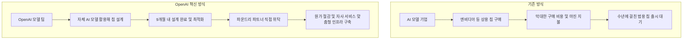
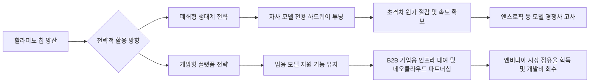

이 파일은 **미검증 원본**이다. `insights/check_frame.py` 로 원문과 대조한 뒤,
원문이 받쳐 주는 것만 카드로 옮긴다.

시니어 경영전략 컨설턴트 관점에서 OpenAI의 '할라피뇨(Jalapeño)' 칩 발표가 가지는 비즈니스적 함의를 분석해 드리겠습니다. 기술적 사양을 배제하고, 철저히 자본의 흐름(Value Chain), 경쟁 역학(Competitive Dynamics), 그리고 OpenAI의 향후 전략(Strategic Moves)에 초점을 맞춥니다.

---

### 1. 돈이 도는 길: 가치 사슬의 재편과 '토큰당 에너지(Cost)'

기존 AI 산업의 돈은 '엔비디아(Nvidia)'라는 거대한 톨게이트를 지나야만 했습니다. 그러나 OpenAI의 할라피뇨는 이 자금 흐름의 경로를 직접 통제하겠다는 선언입니다.

* **TCO(총소유비용)의 패러다임 전환 (운영비 > 도입비):** AI 서비스 사업의 핵심 원가는 칩 구매 비용이 아니라 '전기세와 발열 제어'입니다. 할라피뇨는 철저히 '전력당 토큰 산출량(Tokens per Joule)'에 집중했습니다. 이는 하드웨어 벤더(엔비디아)가 칩 판매 마진을 남기기 위해 설계하는 방식과 달리, 서비스 제공자(OpenAI)가 **최종 유저 경험(대기 시간 최소화)과 서비스 원가 절감**을 위해 칩을 설계했음을 의미합니다.
* **서플라이 체인의 직거래화:** OpenAI는 칩 설계는 자체적으로(AI 툴 활용) 해결하고, 제조 및 패키징은 TSMC, 시스템 인프라는 브로드컴(네트워킹)과 셀레스티카(서버 랙)와 직접 손을 잡았습니다. 이는 칩 벤더에게 지불하던 막대한 마진을 내재화하고, 해당 자금을 TSMC 등 파운드리와 파트너사에 직접 분배하는 새로운 밸류체인을 구축한 것입니다.
* **개발비 회수 구조의 혁신:** 보통 수천억 원이 드는 칩 설계 비용이 'AI를 활용한 9개월의 단기 개발'을 통해 획기적으로 낮아졌습니다. 이는 막대한 자본 투자(CAPEX) 없이도 자체 칩 생태계를 굴릴 수 있는 경제성을 확보했음을 뜻합니다.

### 2. 경쟁 구도: 진입장벽의 붕괴와 다면전(Multi-front War)

이 사건은 실리콘 밸리의 경쟁 구도를 완전히 뒤흔드는 '게임 체인저'입니다. OpenAI는 이제 소프트웨어 경쟁자를 넘어 하드웨어 제국을 직접 위협합니다.

* **vs 상용 실리콘 벤더 (엔비디아, AMD):** 가장 뼈아픈 타격을 입는 곳입니다. "AI가 AI 칩을 설계한다"는 개념이 입증되며, 2~3년이 걸리던 칩 개발 주기가 9개월로 단축되었습니다. 이는 자금력과 목적만 있다면 누구나 엔비디아의 최신 칩(루빈 급)에 필적하는 칩을 1년 안에 만들어낼 수 있다는 것을 의미합니다. 하드웨어의 진입 장벽이 급격히 낮아졌습니다.
* **vs AI 모델 경쟁사 (앤스로픽, 구글):** 자체 칩을 통한 원가 경쟁력 확보는 곧 API 가격 인하 또는 압도적인 B2C 서비스 질(속도) 향상으로 이어집니다. 구글은 이미 TPU를 가지고 있지만, 앤스로픽은 자체 칩이 구체화되지 않았다면 엄청난 압박을 받게 됩니다. 하드웨어 인프라 비용 차이가 모델 서비스의 생존을 가를 것입니다.

### 3. 회사의 다음 수: OpenAI의 전략적 선택지

칩을 손에 쥔 OpenAI 앞에는 이제 중요한 비즈니스 의사결정들이 놓여 있습니다.

* **내부 전용(Captive) 유지 vs 외부 판매/대여(Merchant):**
현재 할라피뇨는 자사 모델뿐 아니라 오픈소스 모델(Kimi 등)도 범용적으로 돌아가게 설계되었습니다.
* *선택 1:* 극한의 효율을 위해 2세대(Gen 2)부터는 철저히 **OpenAI 모델에만 최적화**하여 경쟁사 대비 압도적인 마진율과 속도를 확보하는 폐쇄적 전략을 취할 수 있습니다.
* *선택 2:* 남는 컴퓨팅 파워나 칩 자체를 기업용 온프레미스 시장이나 네오 클라우드에 대여/판매(AIaaS)하여 칩 개발 및 양산 비용을 빠르게 상각하고, 엔비디아의 시장 점유율을 직접 갉아먹는 플랫폼 비즈니스로 확장할 수 있습니다.

* **AI로 가속화되는 칩 설계 플라이휠(Flywheel):**
초대형 AI 모델을 통해 칩 설계(EDA)를 자동화하고, 그렇게 만든 더 좋은 칩으로 다시 더 똑똑한 AI를 학습/추론시키는 선순환 고리를 완성했습니다. 경쟁사가 1세대를 고민할 때 OpenAI는 이미 2세대 테이프아웃(Tape-out)을 앞두고 있습니다. 향후 칩 설계는 레거시 호환성에 얽매인 기존 벤더들보다, 백지상태에서 AI로 뼈대를 짜는 OpenAI가 훨씬 빠르고 유연하게 진화할 것입니다.

---

### 4. 핵심 프로세스 도식화 (Mermaid Flowcharts)

#### [도식 1] 칩 설계 패러다임 및 가치 사슬의 변화 (Before & After)

기존의 칩 구매 방식과 OpenAI가 새롭게 구축한 AI 주도형 칩 설계 및 생산 방식의 차이입니다.

#### [도식 2] 할라피뇨 칩을 활용한 OpenAI의 향후 전략 시나리오

OpenAI가 개발한 칩을 비즈니스적으로 어떻게 활용하여 돈으로 바꿀 것인지에 대한 전략적 갈림길입니다.

