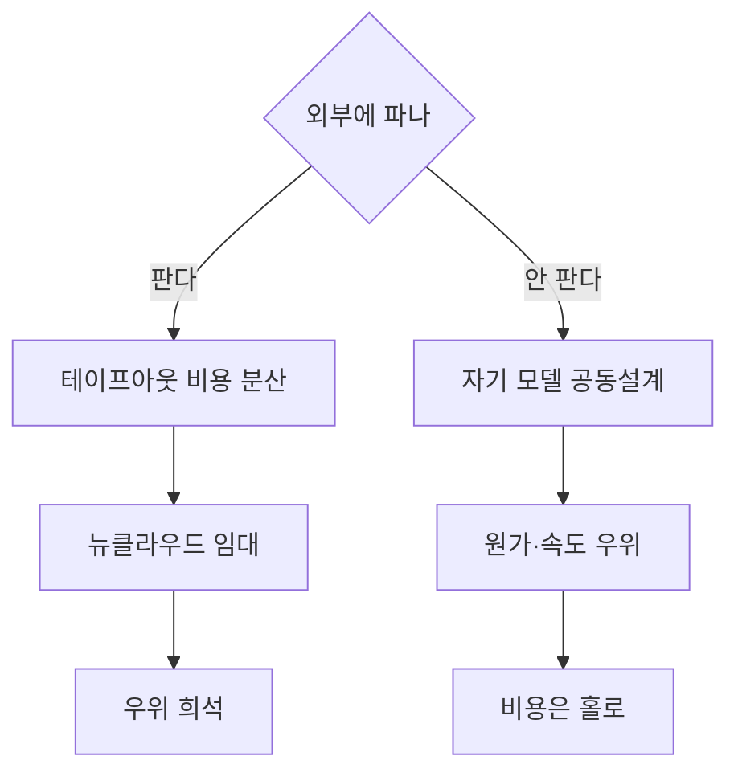
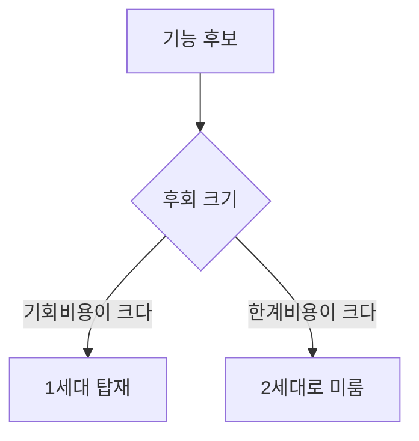
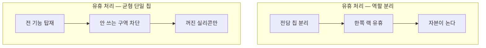
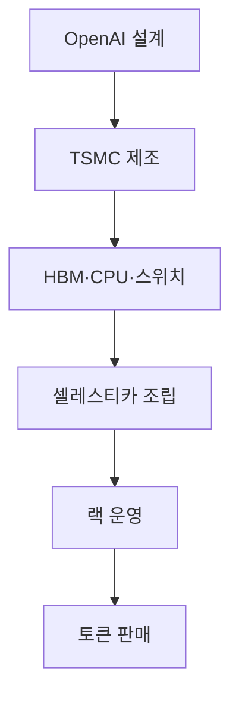
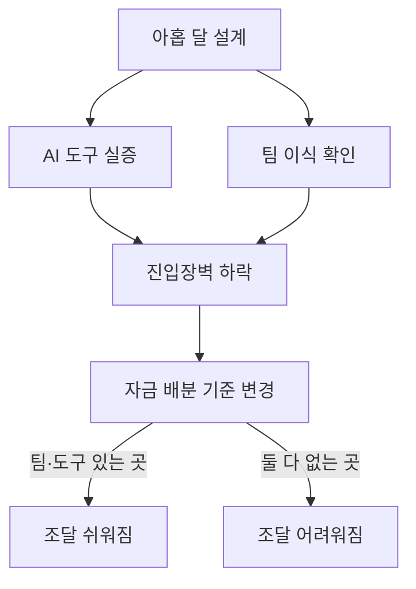
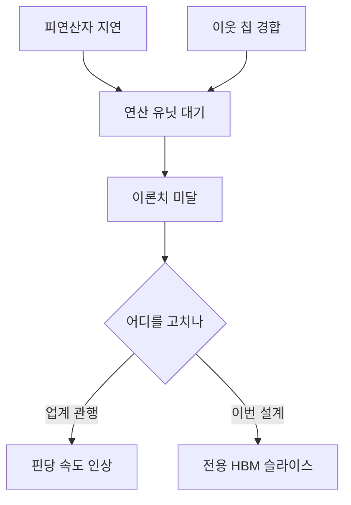

# OpenAI 할라피뇨 — 경영 관점 정리

## 한 줄 요약

모델을 파는 회사가 칩을 직접 설계해 첫 작품부터 경쟁력 있는 물건을 내놨고, 그 일을 아홉 달 만에 해냈다. 여기서 경영이 볼 것은 칩의 성능이 아니라 세 가지다 — 설계 목표가 왜 달라졌나, 이 칩을 팔 것인가 말 것인가, 아홉 달이라는 숫자가 산업의 진입장벽과 자금 흐름을 어떻게 바꾸나.

---

## 1. 설계 목표가 바뀌었다 — 총소유비용이 아니라 사용자 경험

지금까지 칩을 설계해 파는 회사들은 고객이 하이퍼스케일러나 AI 랩이었다. 그래서 발표 첫 장에 늘 총소유비용(TCO)이 나왔다. 사는 쪽이 그 숫자로 결재를 올리기 때문이다.

할라피뇨 팀은 다른 두 지표를 걸었다.

| 지표 | 정의 | 왜 이걸 골랐나 |
|---|---|---|
| 사용자 경험 | 첫 토큰까지가 아니라 **마지막 토큰까지** 걸리는 시간 | 서비스를 쓰는 사람에게 의미 있는 건 끝나는 시점이지 시작하는 시점이 아니다 |
| 요청당 에너지 | 요청 하나를 처리하는 데 든 에너지 | 실제로 돈이 나가는 자리 |

둘이 서로 맞선다는 것도 그 자리에서 밝혔다. 에너지를 더 쓰면 언제나 더 빠르다. 그래서 단일 숫자를 내놓지 않고 파레토 곡선을 보이겠다고 했다. 상대평가에서 유리한 점 하나만 뽑아 자랑하지 않겠다는 선언이다.

경영적으로 이 대목이 중요한 이유는 **설계를 누가 하느냐가 설계 결정을 바꾸기 때문**이다. 칩을 파는 회사는 사는 사람을 보고 설계하고, 모델을 파는 회사는 모델을 쓰는 사람을 보고 설계한다. 수직통합이란 결국 이 시선의 이동이다.

젠슨 황도 비슷한 말을 해 왔다. 칩을 싸게 만들려고 구조를 고르면 나쁜 설계라는 것. 지금 아껴야 할 돈은 만드는 비용이 아니라 **돌리는 비용**이고, 그것은 줄당 토큰 수, 즉 에너지당 토큰 수로 잰다. 두 진영이 서로 다른 길로 같은 결론에 닿았다.

---

## 2. 첫 칩이 곧바로 경쟁권에 들어왔다

숫자로 확인된 것만 적는다.

- **딥시크 R1(6,710억 파라미터)** 기준, 같은 상호작용성에서 처리량이 GPU 대비 높고, GPU가 못 가는 상호작용성 구간까지 뻗는다. 새 파레토 경계를 그었다.
- **GPT OSS 1,200억 파라미터** 기준, 사용자당 초당 1,000토큰을 넘겼다. 이 구간은 원래 SRAM 계열(그록·세레브라스)의 영역이었다.
- **전력 700W TDP.** 블랙웰 GB200은 1,200W대로 언급됐다. 와트당 토큰에서 벌어지는 차이가 크다.

다만 비교 조건에 두 가지 유보가 붙는다.

1. **메모리 세대가 다르다.** 할라피뇨는 HBM4, 비교 대상인 블랙웰·MI355는 HBM3E다. 공정한 맞대결은 베라 루빈, 그리고 헬리오스와 붙였을 때 나온다. 진행자들도 이 칩을 "블랙웰급이라기보다 루빈급"으로 봤다.
2. **문맥 길이가 짧다.** 입력 8K·출력 1K로 측정됐다. 백만 토큰 입력 같은 조건에서 어떻게 되는지는 아직 공개된 것이 없다. 에이전트 작업(AgentX 계열 부하)도 아직 안 돌렸다.

경영 판단에서 이 두 유보는 "그래서 못 믿는다"가 아니라 **"다음 발표에서 확인할 항목"**으로 두는 게 맞다. 첫 칩이 여기까지 왔다는 사실 자체가 이미 판단 근거다.

---

## 3. 팔 것인가 — 수직통합의 고전적 갈림길

이 회차에서 두 진행자가 정면으로 갈린 지점이다. 그리고 이게 이 칩의 가장 큰 경영 쟁점이다.

발단은 이렇다. 할라피뇨는 자기네 모델만 잘 돌리는 칩이 아니었다. GPT OSS 같은 작은 모델부터 Kimi K2.5처럼 생김새가 전혀 다른 모델까지 돌렸다. 심지어 둠(Doom)이 돌아갔다는 이야기까지 나왔다. 추론 전용이고 대규모 언어모델에 초점을 맞췄지만, 그 안에서는 범용이다.

여기서 갈린다.

**오스틴 쪽 — 팔 여지가 있다.**
비유는 파운드리와 종합반도체회사다. 인텔은 오랫동안 자기 공정을 자기 제품팀에만 썼다. 남보다 먼저 신공정에 올라타는 이점을 경쟁사와 나눌 이유가 없었으니까. 그런데 팹 비용이 계속 배로 뛰면서 결국 그 비용을 분산할 방법을 찾아야 했다. 칩도 같다. 팀이 작았고 빨랐다지만 테이프아웃과 양산 준비에 1억 달러 수준은 든다. 그렇다면 **경쟁 우위를 잃지 않는 범위 안에서** 비용을 나눌 길이 있다.

구체적인 경로도 나왔다.
- 앤트로픽 같은 직접 경쟁자에게는 안 판다.
- **기업 고객**에게는? 온프레미스로 돌리고 싶거나 더 싸게 쓰고 싶은 수요가 있다.
- **뉴클라우드와 손잡고** 그쪽이 기업에 빌려주게 한다.
- 굳이 베어메탈 임대가 아니어도 된다. "OpenAI 추론을 서비스로, 대신 싼 버전"이면 충분하다. AWS가 트레이니엄으로 하는 방식이 이것이다. 중간 마진을 걷어내고 30% 싸게 준다는 식.

**빅 쪽 — 자기 모델에만 맞춰야 한다.**
극단적 공동설계에 이 회사의 고유한 무기가 있다는 논리다. 엔비디아는 토큰을 팔지 않기 때문에 **자기 모델이 실제로 어떤 작업 부하로 쓰이는지에 대한 데이터가 없다.** OpenAI와 앤트로픽에는 있다. 그 데이터로 하드웨어를 자기 소프트웨어에 끝까지 맞추면 세레브라스급 성능까지 갈 여지가 있다. 남이 안 가진 정보를 쥐고 있는데 왜 범용으로 희석하나.

**중재점도 회차 안에서 나왔다.** 범용성을 어느 정도 남겨 두면 *자기네 미래 모델*을 그 위에서 개발하기가 쉬워진다. 지금 Kimi를 돌릴 필요는 없지만, 모델 구조가 바뀌었을 때 하드웨어가 도착 즉시 사망하는 사태를 막아 준다. 즉 범용성은 외판을 위한 것이 아니라 **자기 로드맵에 대한 보험**일 수 있다.

이 해석이 맞다면 지금 팔지 안 팔지를 결론 낼 필요가 없다. 옵션을 열어 둔 상태가 그 자체로 설계 결정이다.

---

## 4. 후회 요인 — 칩 설계를 예산 회의처럼 다룬다

발표에서 나온 사고 틀 하나가 경영 쪽에 그대로 쓸 만하다. 설계 시점에 비용이 두 개 있다는 것.

- **한계비용** — 기능 하나를 더 넣으면 트랜지스터와 면적이 얼마나 더 드나.
- **기회비용** — 그 기능이 없어서 못 받는 수요는 얼마인가.

그리고 **기회비용이 한계비용보다 대체로 훨씬 크다.** 그래서 "후회 요인"이라는 말이 나왔다 — 안 넣었을 때 가장 후회할 것부터 넣는다.

문제는 다 넣으면 안 들어간다는 것이다. 청중이 "가장 어려웠던 결정이 뭐였나" 물었을 때 답이 이거였다. 넣을 것을 고르는 게 아니라 **뺄 것을 고르는 게 가장 어려웠다.**

그 뺀 것들이 어디로 가느냐. 로드맵으로 간다. 2세대는 이미 테이프아웃에 근접했고 3세대를 구상 중이라고 했다. 즉 이 회사의 칩 계획은 일회성 실험이 아니라 세대 파이프라인이다.

첫 칩은 버리는 셈 치는 게 업계 통념이었다. 할 수 있다는 증명이고 배우는 과정이라는 것. 그래서 진짜 승부는 2, 3, 4세대에서 난다고들 했다. 그런데 이 회사는 **1세대부터 때리고 나왔다.** 그러면 2세대는 무엇이 되나 — 그게 이 로드맵 슬라이드가 던지는 진짜 질문이다.

---

## 5. 다크 실리콘 논리 — 자산 가동률을 칩 안으로 끌어들였다

경영 관점에서 이 회차의 가장 좋은 대목이다. "다크 실리콘이 유휴 가속기보다 싸다"는 문장은 반도체 이야기가 아니라 **설비 가동률 이야기**다.

지금 GPU 진영이 쓰는 방법은 작업을 쪼개는 것이다. 프리필용 GPU 따로, 디코드용 GPU 따로. 문제는 작업 비율이 계속 변한다는 것이다. 모델 크기마다, 추측 디코딩의 초안·검증 비율마다 다르고, 그 비율은 고정돼 있지 않다.

비율이 어긋나면 **랙 단위로 놀게 된다.** 산 것은 다 샀는데 지금 필요 없는 쪽이 서 있다.

할라피뇨의 답은 반대다. 칩 하나에 연산·메모리 대역폭·입출력을 충분히 넣어 어느 부분이든 맡을 수 있게 하고, **안 쓰는 구역은 전원을 끈다.** 꺼진 실리콘은 자리를 차지하지만 자본은 놀지 않는다. 어차피 그 칩은 다른 일을 하고 있으니까.

여기서 자산 수명 이야기가 따라 나온다. 베라 루빈에 그록 LPU를 붙여 쓰는 구성을 생각해 보자. 그 LPU는 특정 형태의 디코드에 맞춰져 있다. 작업 방식이 바뀌면 효율이 떨어지거나, 더 좁은 범위의 일만 하게 된다. **감가상각 기간이 짧아지는 것이다.** 균형 칩은 반대로 2세대가 나온 뒤에도 오래 쓸 수 있다는 논리다.

비용 비교도 같은 이야기를 한다. 사용자당 초당 1,000토큰 이상은 그록을 붙이면 지금도 낼 수 있다. 단, 몇 개의 랙이 필요한가. NVL72 랙 하나에 그록 랙 아홉 대를 세우는 구성과, 할라피뇨 한두 랙을 세우는 구성. 전력과 자본 지출이 다르다.

---

## 6. 밸류체인 — 어느 자리를 쥐고 어느 자리를 사나

컴퓨트 예산이 자기 칩으로 옮겨 가면 그 돈은 사슬을 타고 흐른다. 이름만 늘어놓으면 누가 수혜를 보는지는 보이는데 **무엇이 바뀌었는지가 안 보인다.** 단계 순서로 펴 놓고 각 자리를 쥐었는지 샀는지를 붙인다.

| 단계 | 누가 | OpenAI | 성격 |
|---|---|---|---|
| 설계 | OpenAI · 브로드컴 | 쥔다 | 공표 — 슬라이드에 파트너로 호명 |
| 제조 | TSMC N3 | 산다 | 추정 — N3P·N3E 변형 |
| 메모리 | 삼성 HBM4 | 산다 | 추정 — 진행자가 추측이라 못박음 |
| CPU | x86 튜린급 | 산다 | 추정 — 인텔 대안도 가능 |
| 스위치·망 | 브로드컴 토마호크 6 · ESUN | 산다 | 공표 — 128칩 도메인, 칩당 600Gb/s |
| 시스템 조립 | 셀레스티카 | 산다 | 이름은 공표, 역할은 추정 |
| 랙 운영 | OpenAI | 쥔다 | 공표 — 128칩 · 2,048칩 |
| 토큰 판매 | OpenAI | 쥔다 | 이 편의 논지 |

**양 끝을 쥐고 가운데를 전부 산다.** 이게 이 회차의 경영적 요지다. 엔비디아가 한 몸으로 팔던 자리 — 칩 설계와 스케일업 망과 시스템 — 이 셋으로 갈렸고, 그중 설계가 OpenAI 로, 망이 브로드컴으로, 조립이 셀레스티카로 갔다.

사슬을 이렇게 펴 놓으면 §1 이 왜 그렇게 되는지도 같이 풀린다. **사슬 끝이 토큰이면 끝에서 재는 지표가 설계까지 거슬러 올라온다.** 칩을 파는 회사는 사슬이 「조립」에서 끊기니 그 앞 자리(사는 회사의 결재)까지만 보면 되고, 끝을 쥔 회사는 끝의 지표로 앞을 설계한다.

**여기서 못 하는 것 하나.** 단계마다 마진이 얼마 남고 누가 교섭력을 쥐는지는 이 회차로 못 판단한다. 원문에 든 금액은 테이프아웃·초기 램프업 어림 1억 달러(Austin, 확정치 아니라고 본인이 밝힘) 하나뿐이다. 밸류체인의 절반 — 누가 어디에 서는가 — 만 그렸고, 나머지 절반 — 어디에 돈이 남는가 — 는 이 원문에 없다.

네트워크 쪽에 한 줄 더. ESUN이 실물 배치에서 대규모로 돌아가는 사례가 생겼다. 규격 경쟁에서 이건 홍보 문구보다 무겁다. UALink 진영이 같은 급의 실물을 아직 못 내놨다면, 이 회차가 그 격차를 기록한 셈이다.

---

## 7. 아홉 달 — 이 회차에서 가장 파급이 큰 숫자

RTL 첫 줄부터 테이프아웃까지 아홉 달. 원래 이런 일은 최소 2~3년이 걸리고 수작업이 많았다.

무엇이 이걸 만들었나. 회차의 답은 세 가지 조합이다.

1. **사람.** TPU를 만들던 팀을 통째로 데려왔다.
2. **AI 도구.** 초기 RTL은 GPT-3급 모델로 만들었고, 개발이 진행되면서 더 좋은 모델로 갈아탔다.
3. **백지.** 레거시 소프트웨어를 어떻게 얹을지 고민할 필요가 없었다.

세 번째가 은근히 크다. 기존 업체가 못 하는 게 이것이다.

두 번째에서 흥미로운 대목 — GPT-3급 모델은 **이미 웬만한 회사가 다 갖고 있다.** 즉 이 결과의 재현 조건에서 모델 접근성은 병목이 아니었다. 그렇다면 나머지 둘, 사람과 백지가 진짜 변수다.

### 이게 왜 자금 흐름을 바꾸나

추론 가속기를 만드는 회사에 이건 경보다. 누군가 1년 안에 블랙웰보다 나은(정확히는 루빈급) 물건을 만들 수 있다면, 질문이 이렇게 바뀐다.

- **적절한 AI 도구와 적절한 사람을 가진 회사가 2년을 쓰면 얼마나 더 나은 칩을 만드나?**
- 그렇다면 **돈은 누구에게 가야 하나?** 누가 이 일을 할 능력이 있나?
- AI가 AI를 만드는 순환 안에서 어떤 하드웨어가 나오나?

여기 붙는 비교가 날카롭다. 구글 출신이 세운 ASIC 스타트업들(d-Matrix와 라이너 포프 사례가 언급됐다)은 **사람과 노하우는 있었지만 AI 도구는 곧바로 갖지 못했다.** 이제는 사람 + 노하우 + AI 도구를 다 가진 팀이 나왔다. 같은 출발선에 섰던 회사들이 속도에서 갈리기 시작한다.

### EDA 쪽 함의

두 방향이 동시에 나온다.

- **긍정.** 작은 팀도 AI를 써서 경쟁력 있는 칩을 빨리 낼 수 있다는 공개 증명이다. 진입장벽이 낮아지면 칩을 만드는 주체가 늘고, 그러면 EDA 사용량 자체가 는다.
- **미해결 질문.** OpenAI가 RTL 작성에 쓴 방법이 케이던스·시놉시스가 하는 일과 같은 것인가, 다른 것인가. 이게 같은 층위의 경쟁이면 EDA 업체에 위협이고, 다른 층위면 보완재다. 회차에서는 답을 못 냈고 EDA 업체 이야기를 들어 봐야 한다고 남겼다.

---

## 8. 경쟁 진영별 다음 수

### 엔비디아

즉시 반박할 카드가 있다. **"규모로 만들어 봐라. 규모로 출하해 봐라. 규모에서 얼마나 안정적인가."** 양산과 신뢰성은 축적된 시간이 필요한 영역이고, 시장 선두는 그 시간을 이미 썼다. 당분간 이 방어는 유효하다.

다만 회차에서 나온 반대 방향의 상상이 재미있다 — 엔비디아가 옆에 소규모 팀을 붙여 **CUDA와 레거시를 잠시 잊고 백지에서 자체 XPU를 1년 안에 세워 보는** 시나리오. 그 팀이 어떤 설계 결정을 내리는지가 궁금하다는 것. 이건 회차 안의 추측이지 관측된 사실이 아니다.

### AMD

정면으로 다뤄지지 않았다. "AMD의 길은 이제 뭔가"라는 질문이 던져졌을 뿐 답은 없다. 비교 대상으로 MI355가 나왔고 헬리오스가 공정한 맞대결 상대로 언급됐다.

### 구글 TPU

가장 미묘한 자리다. TPU는 원래 **GPU보다는 특화됐지만 특정 모델에만 매이지는 않았다**는 위치로 자기를 규정해 왔다. 그런데 할라피뇨가 정확히 그 자리에 들어왔다. 게다가 TPU를 만들던 사람들이 만들었다. 위치 선점의 논리가 겹친다.

### 그록·세레브라스 계열

SRAM 영역이 잠식됐다. 사용자당 초당 1,000토큰 위쪽이 이들의 근거지였는데, 이제 HBM 칩 하나가 그 구간에 닿는다. 물론 세레브라스는 4,000토큰까지 이야기하지만 **시스템 복잡도가 엄청나다**는 지적이 붙었다. 그리고 랙 수 비교에서 불리하다.

### 앤트로픽

회차 끝에 던져진 질문이 이거다. **앤트로픽의 칩은 어디 있나.** 팀은 있다고 했다. 이제 시계가 돌기 시작했고, 아홉 달이라는 벤치마크가 생겼다.

### ASIC 스타트업

"단일 칩으로 높은 처리량과 초고속 디코드를 둘 다"라는 주장은 원래 이들의 논리였다. 그 논리를 자금과 데이터를 다 가진 쪽이 실물로 증명해 버렸다. 논리가 맞았다는 게 확인된 동시에, 그 자리를 누가 차지할지도 정해지는 중이다.

---

## 9. HBM 업계에 던져진 질문

이 대목은 메모리 회사 경영진이 읽어야 한다.

계산이 이렇게 나왔다. 랙에 들어가는 128칩의 HBM4 대역폭을 다 합치면 초당 1페타바이트 수준이다. FP4로 1조 파라미터 모델이면 데이터가 0.5테라바이트쯤 되니 산술적으로는 **초당 2,000토큰이 나와야 한다.** 그런데 실제로는 안 나온다.

왜 안 나오나. 발표의 답은 **"피연산자가 늦게 도착한다"**였다. 대역폭이 없는 게 아니라 필요한 순간에 데이터가 레지스터에 없다. 통합 메모리 체계에서 스케일업 망 이웃들과 HBM을 나눠 쓰다 보니 경합이 생기고, 여기저기 사본이 돌아다닌다. **꺼내는 건 빠른데 제때 제자리에 갖다 놓는 게 문제**라는 것. 그래서 나온 문장이 "장부상 플롭스는 의미 없다, 실제로 전달한 플롭스가 의미다."

여기서 메모리 업계 쪽으로 화살이 돌아간다. 지금 업계의 답은 매년 더 빠르게다. 핀당 10Gb/s에서 16Gb/s로, HBM5는 23~24Gb/s 이야기가 나온다. 그런데 **지금 있는 대역폭도 다 못 쓰고 있다면, 매년 더 빠르게 만드는 게 맞는 방향인가?** 속도를 올리기 전에 있는 걸 다 쓰는 데 집중해야 하는 것 아닌가.

이건 HBM 로드맵 전체에 대한 수요 측 문제 제기다. 속도 경쟁의 값을 치르는 쪽이 "우리는 그거 아직 다 못 쓴다"고 공개적으로 말한 것이기 때문이다. 물론 저 회사 하나의 판단이고 다른 구매자의 사정은 다를 수 있다.

KV 캐시 이야기도 같은 축이다. 디코딩에서 가장 큰 문제가 KV 캐시인데, 토큰 하나씩 처리하면서 그 데이터를 계속 옮겨야 한다. 발표의 주장은 단순하다 — **장기적으로는 옮기지 마라. 안 옮겨도 되게 만들면 문제 여러 개가 한꺼번에 사라진다.**

---

## 10. 스케일업 망 — 랙 경계에 대한 통념이 깨졌다

경영 문서에 굳이 이 이야기를 넣는 이유는 **구매 단위와 배치 단위가 바뀌기 때문**이다.

두 층으로 되어 있다.

| 층 | 규모 | 속도 | 위치 |
|---|---|---|---|
| 1층 | 128칩 | 칩당 600Gb/s | 랙 하나 안으로 추정 |
| 2층 | 2,048칩 | 200Gb/s 인터커넥트 | 16개 랙에 걸침 |

"스케일업은 랙 안, 스케일아웃은 랙 사이"라는 구분이 흔히 쓰이는데 **이 사례가 그게 아님을 보여 준다.** 그건 한 시점의 사정이었을 뿐이고, 스케일업의 진짜 정의는 **메모리를 공유하는 가속기 집합**이다. 랙 열여섯 개가 하나의 스케일업 도메인이면 데이터센터 설계, 전력 배분, 냉각 구획, 조달 단위가 전부 그 경계를 따라간다.

토폴로지는 "절반 평탄화된 2단 클로스"라고 불렸다. 회차에서도 그게 정확히 뭘 뜻하는지 아직 소화 중이라고 했으니 여기서 더 나가지 않는다.

---

## 11. 정리 — 경영이 지켜볼 것 다섯

1. **팔 것인가.** 범용성을 왜 보여 줬는지가 이 질문의 실마리다. 자기 로드맵용 보험인지, 외판 준비인지. 기업·뉴클라우드 경로로 움직임이 나오는지 본다.
2. **2세대가 언제 무엇으로 나오나.** 이미 테이프아웃 근처다. 1세대에서 잘라낸 것 중 무엇이 돌아오는지가 이 팀의 우선순위를 드러낸다.
3. **긴 문맥과 에이전트 작업.** 지금 공개된 성능은 입력 8K·출력 1K다. 이 두 조건이 채워질 때 그림이 완성된다.
4. **컴퓨트 예산의 이동 속도.** 기가와트 단위 예산이 GPU에서 자체 칩으로 얼마나 빨리 옮겨 가는지가 브로드컴·셀레스티카·TSMC·HBM 공급사의 실적으로 나타난다.
5. **아홉 달의 재현.** 앤트로픽이든 다른 누구든 두 번째 사례가 나오면 그때 진입장벽 하락이 확정된다. 나오지 않으면 이건 팀 하나의 특수 사례로 남는다.

---

## 다루지 않은 것

- 칩 내부 구조와 사양 — NUMA 방식 슬라이스, 컬렉티브 망, 온칩 구조의 기술적 세부는 이 문서의 범위 밖이다. 경영 함의가 걸린 대목(가동률·자산 수명·메모리 로드맵)만 끌어왔다.
- 삼성 HBM4, 셀레스티카의 시스템 설계 역할, 튜린급 CPU는 **모두 추정**이다. 발표에서 확정된 것은 브로드컴과 셀레스티카를 파트너로 호명한 것까지다.
- 테이프아웃 비용 1억 달러는 대략의 어림이지 공개 숫자가 아니다.
- 엔비디아가 별도 팀을 꾸릴 것이라는 이야기는 진행자들의 상상이다.
- 회차 자체가 발표 12시간 이내에 녹음된 즉석 해설이고, 포괄적이지 않다고 진행자들이 먼저 밝혔다.
