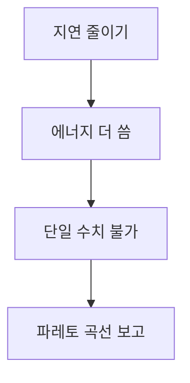
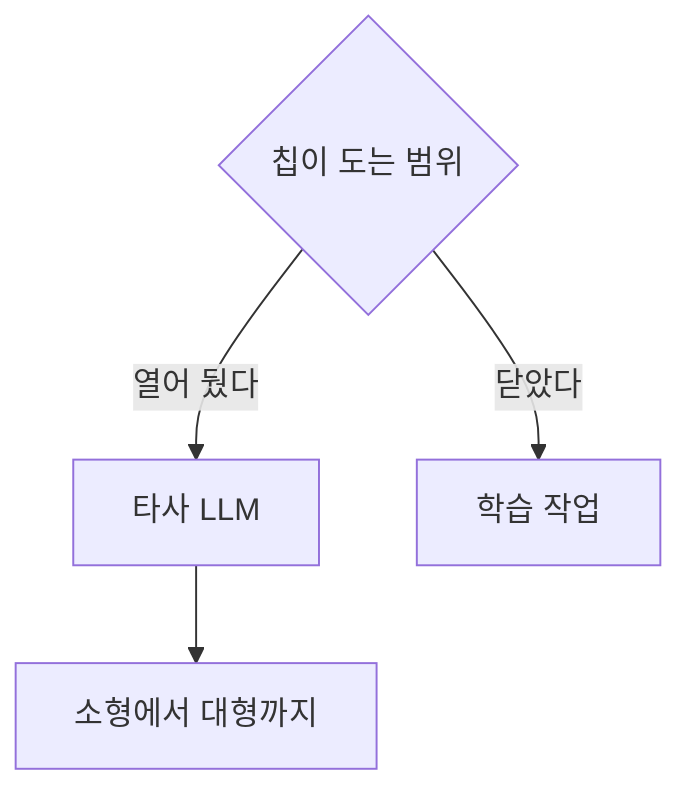
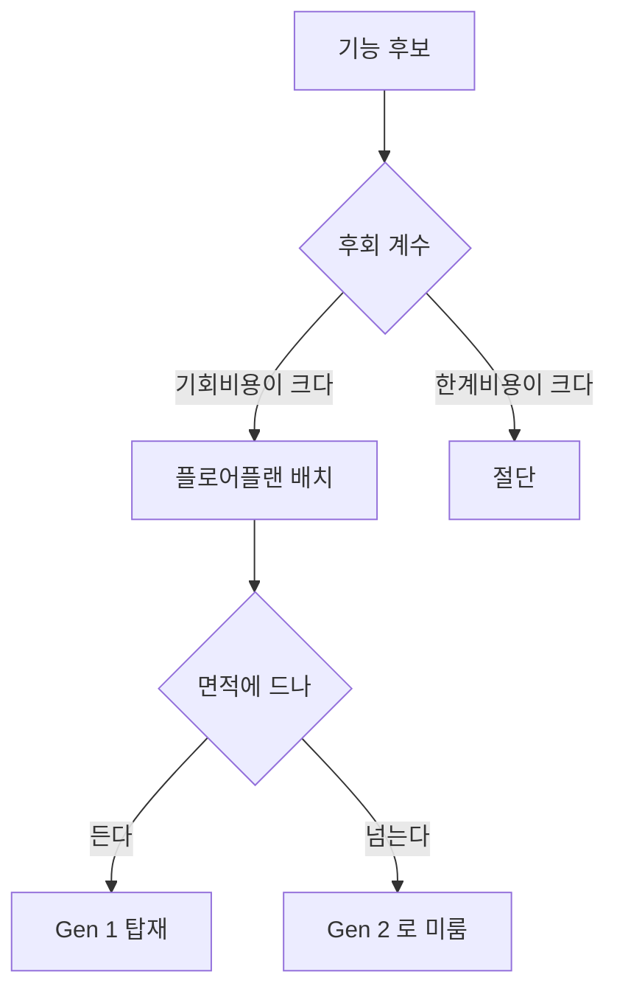
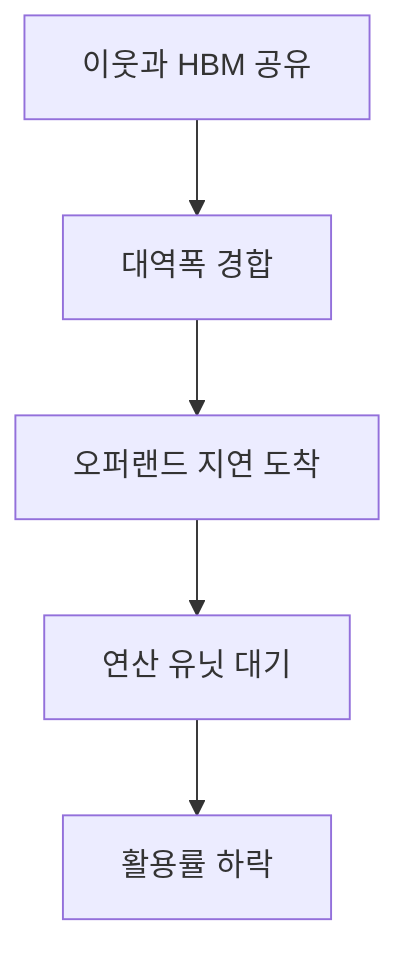
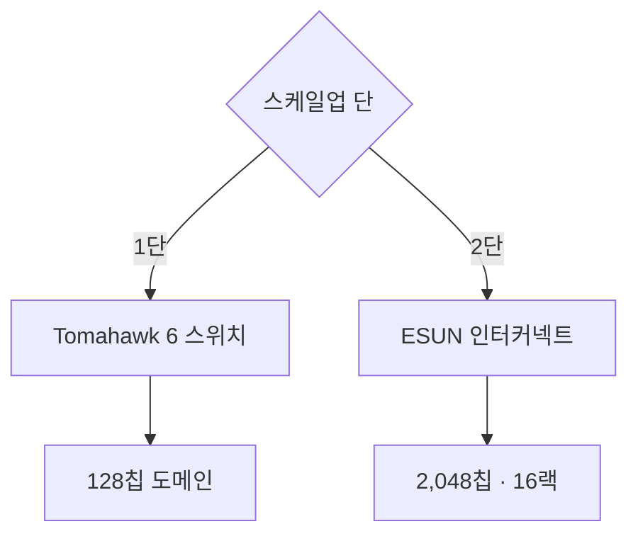
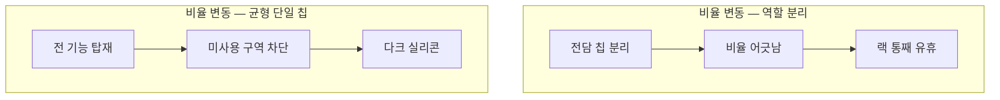
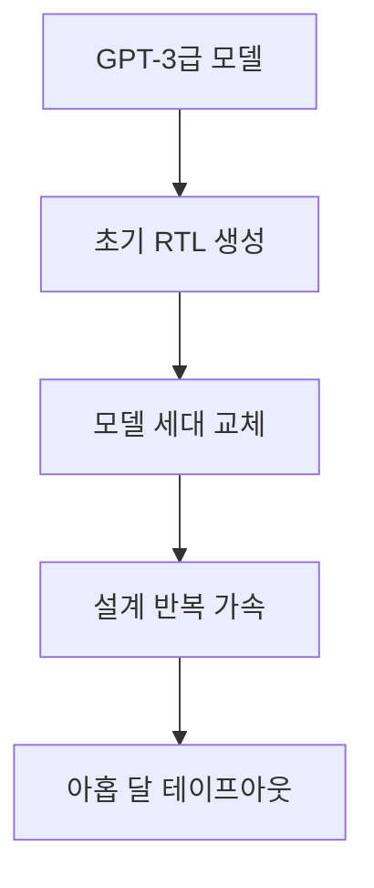
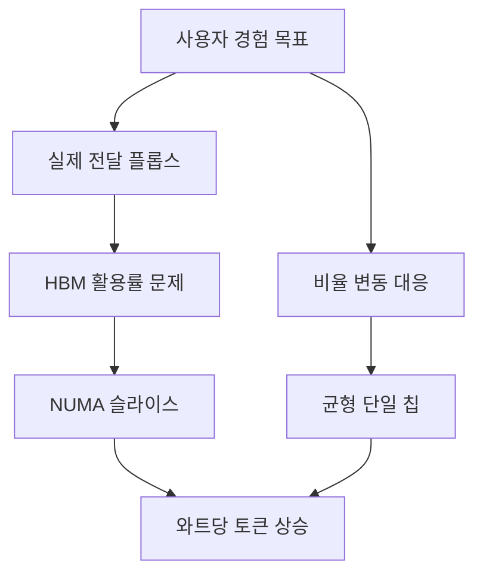

# OpenAI Jalapeño — 구조와 사양, 그 설계를 고른 이유

Hot Chips 발표 직후 녹음된 회차다. 진행자 둘(Austin, Vik)이 발표 슬라이드를 한 장씩 짚으며 설계 결정을 해부한다. 아래는 그 회차에서 드러난 기술적 내용을 아키텍트 관점에서 정리한 것이다.

---

## 1. 설계 목표부터 다르다 — TCO가 아니라 사용자 경험

칩 설계팀은 Richard Ho(전 구글 TPU), 아키텍트 Ravi, 소프트웨어 코디자인 담당 Chris로 구성됐다. 이들이 발표 초반에 못 박은 최적화 목표는 두 개다.

- **사용자 경험** — 단, 첫 토큰까지의 시간(time to first token)이 아니라 **마지막 토큰까지의 시간**, 즉 종단간 지연이다. 언제 시작하느냐가 아니라 언제 끝나느냐를 잰다.
- **요청당 에너지** — 그 답을 뽑는 데 줄(joule)을 얼마나 썼나.

이 둘은 서로 맞물려 있다. 에너지를 더 쓰면 언제든 더 빠르게 갈 수 있다. 그래서 발표팀은 단일 수치를 보고하지 않고 **파레토 프론티어 곡선**으로 보여주겠다고 선언했다 — 한쪽 손잡이를 돌리면 다른 쪽이 어떻게 되는지를 곡선 전체로 드러내겠다는 뜻이다.

여기서 중요한 것은 이 목표 설정이 **누가 칩을 설계하느냐**에서 나왔다는 점이다. 상용 실리콘 벤더는 AI 랩이나 하이퍼스케일러에게 칩을 판다. 그래서 발표 첫 장부터 TCO를 말한다. 그건 합리적이다 — 그들의 고객은 칩을 사는 사람이니까.

Jalapeño는 다르다. 설계 주체가 모델 랩이고, 그 랩의 고객은 AI를 쓰는 최종 사용자다. 그래서 실리콘 구매자가 아니라 **화면 앞에 앉은 사람**을 놓고 설계 결정을 내린다. 수직 통합이 아키텍처 선택에까지 내려온 사례다.

Vik은 여기에 엔비디아 젠슨 황이 이전에 한 말을 겹쳐 놓는다 — 칩을 싸게 만들려고 아키텍처를 고르면 그건 나쁜 설계 결정이다. 지금은 칩을 만드는 데 돈을 아끼는 시대가 아니라 **칩을 돌리는 데** 드는 비용의 시대다. 그 비용의 단위가 토큰당 줄(tokens per joule)이다. 초당 와트당 토큰이라고 쓰면 나눗셈 기호가 너무 많으니, 와트와 초를 묶어 줄로 만든다. 에너지를 넣고 토큰을 뽑는다 — 그게 진짜 총소유비용이다.

다만 Vik은 개념 자체가 새롭지는 않다고 짚는다. 상호작용성 곡선의 Y축에 초당 메가와트당 토큰을 놓고, X축에 사용자당 초당 토큰을 놓는 방식은 이미 널리 쓰인다.

---

## 2. 벤치마크 선택 — Inference X, 그리고 그 한계

OpenAI 팀은 SemiAnalysis의 Inference X로 벤치마크했고, 이를 "공정한 공개 전력 정규화 비교"라고 불렀다. 이 벤치마크를 고른 이유는 세 가지로 정리된다.

| 고른 이유 | 내용 |
| --- | --- |
| 모델 다양성 | 특정 모델 하나를 고르지 않고, 작은 모델·중간·큰 모델 여러 오픈소스 모델로 잰다 |
| 시스템 전체 | 하드웨어·소프트웨어·네트워킹을 다 튜닝한 뒤의 종단간 지연을 본다 |
| 전력 정규화 | 전력을 더 부어 수치를 올리는 편법을 막는다 |

여기서 회차가 스스로 걸어 놓은 단서가 있다. Jalapeño는 **입력 8K, 출력 1K**라는 비교적 짧은 컨텍스트로 측정됐다. Vik은 이 지점을 놓고 "체리 픽인가"를 계속 의심하지만, 다른 조건의 수치가 없어서 판단을 못 하겠다고 인정한다. 백만 토큰 입력 컨텍스트에서 어떻게 되는지가 빈칸으로 남았다.

또 하나의 빈칸 — SemiAnalysis도 밝혔듯 **에이전트 워크로드는 아직 돌리지 않았다**. AgentX 플랫폼으로 재야 할 몫이 남아 있다.

---

## 3. 범용 추론 칩인가 — 무엇을 좁히고 무엇을 열어 뒀나

Jalapeño가 OpenAI 모델에 최적화된 칩이라는 첫인상은 발표에서 반박됐다. GPT-OSS(작고 좁은 모델)부터 Kimi K2.5(형태가 크게 다른 모델)까지 돌려 보였다. SemiAnalysis에 따르면 그 위에서 Doom도 돌렸다.

좁힌 축과 열어 둔 축을 갈라 보면 이렇다.

즉 **워크로드 종류로는 좁히고, 모델 형태로는 열어 뒀다**. 엔지니어링 관점에서 이 선택의 근거는 명확하다 — 앞으로 올 알고리즘 혁신이나 하네스 혁신을 흡수할 여지를 남기려는 것이다. 특정 비율에 하드웨어를 못 박으면 그 비율이 바뀌는 순간 실리콘이 죽는다.

Vik은 여기에 반론을 편다. OpenAI의 고유한 이점은 **극단적 코디자인**이다. 자기 모델이 어떤 워크로드로 어떻게 쓰이는지에 대한 통계와 데이터를 자기만 갖고 있다. 엔비디아는 그 정보가 없다. 그렇다면 하드웨어를 자기 소프트웨어에 정밀하게 맞춰 Cerebras급 성능까지 끌어올리는 길을 왜 안 가느냐는 것이다.

그리고 스스로 반박한다 — 범용성을 유지하면 **앞으로 나올 자기 모델을 그 칩 위에서 개발할 수 있다**. Kimi를 돌릴 필요는 없어도, 일반성 자체가 미래 모델 개발의 여지가 된다.

---

## 4. 무엇을 자를지가 가장 어려웠다 — 한계비용과 기회비용

Ravi가 설계 시점의 비용을 두 갈래로 나눈 대목이 이 칩의 스펙 구성을 설명한다.

- **한계비용** — 기능 하나를 더 넣는 데 드는 비용. 트랜지스터 몇 개, 플로어플랜 면적 얼마.
- **기회비용** — 그 기능이 없어서 못 받아 주는 사용자 수요.

Ravi의 판단은 기회비용이 한계비용보다 대체로 훨씬 크다는 것이었다. 그는 여기에 **후회 계수(regret factor)**라는 이름을 붙였다 — 안 넣었을 때 후회할 기능이 무엇인지로 고른다는 뜻이다.

그런데 기능을 다 넣으면 플로어플랜에 안 들어간다. 그래서 잘라야 하고, 언젠가는 테이프아웃을 해야 한다. 청중이 "가장 어려웠던 결정이 무엇이었나"를 물었을 때 Ravi의 답이 바로 이것이었다 — **무엇을 뺄지 정하는 일**.

잘라 낸 것들은 로드맵으로 간다. Gen 2는 이미 테이프아웃에 근접했고, Gen 3를 구상 중이라고 발표에서 밝혔다.

---

## 5. 핵심 문제 — HBM을 왜 다 못 쓰고 있나

이 회차에서 기술적으로 가장 밀도 높은 대목이다.

Vik이 봉투 뒷면 계산을 한다. 랙에 들어가는 **128개 칩**의 HBM4 대역폭을 다 합치면 초당 1페타바이트 급이 나온다. FP4로 1조 파라미터 모델을 올리면 가중치가 0.5테라바이트쯤 되니, **대역폭만 놓고 보면 초당 2,000토큰**이 나와야 한다. 그런데 실제로는 안 나온다. Cerebras와 LPU가 SRAM을 쓰는 이유가 바로 그 격차다.

업계의 대응은 지금까지 한 방향이었다 — 더 빠르게. 핀당 10Gb/s에서 16Gb/s로, Hot Chips 메모리 세션에서 나온 HBM5 전망은 23~24Gb/s다. OpenAI가 던진 질문은 반대편이다. **그 대역폭을 지금도 다 안 쓰고 있는데, 왜 계속 빠르게만 만드나.**

Chris가 원인으로 지목한 것은 "오퍼랜드가 늦게 도착한다"는 현상이다. 행렬곱을 하려는 순간 레지스터에 데이터가 없다. 그 뒤에 깔린 구조가 통합 메모리 서브시스템이다 — 스케일업 네트워크상의 이웃들과 HBM을 공유하고, 같은 데이터의 사본이 여기저기 흩어져 있고, 그래서 경합이 일어난다. HBM에서 데이터를 빨리 빼는 것 자체는 되는데, **제때 제자리로 보내는 것**이 안 된다. 연산이든 메모리든 전송 중인 데이터를 기다리며 막히면 활용률이 떨어진다.

Chris의 정리 문장이 이것이다 — **장부상 플롭스는 중요하지 않다. 실제로 전달한 플롭스가 중요하다.** 트랜지스터를 잔뜩 깔고 종이 위 계산으로 몇 플롭스가 나온다고 해도, 데이터가 제때 없으면 의미가 없다.

같은 논리가 KV 캐시에도 걸린다. 디코딩에서 가장 큰 문제가 KV 캐시다 — 토큰 하나마다 그 데이터를 앞뒤로 옮겨야 한다. 발표팀의 장기 방침은 **KV 캐시를 옮기지 않는 것**이다. 옮길 필요가 없게 국소에 두면 여러 문제가 한꺼번에 풀린다.

---

## 6. 처방 — NUMA 스타일 로컬 HBM 슬라이스

경합을 없애는 방식으로 고른 것이 가속기마다 **자기 몫의 로컬 HBM 슬라이스**를 붙이고, 그 사이를 고효율·저지연 전용 버스로 잇는 구조다. Chris는 이를 NUMA 스타일 아키텍처라고 불렀다.

NUMA는 비균일 메모리 아키텍처(non-uniform memory architecture)의 약자로, 원래 멀티코어 CPU에서 쓰이던 개념이다 — 메모리를 코어별로 구획해 나눠 준다. 여기서도 같은 발상이다. HBM을 모두가 다투는 공유 자원으로 두는 대신 각자에게 자기 차선을 준다. 경합이 사라지고, 각자 자기 레인에서 계속 돈다.

통신은 세 계층으로 갈렸다.

| 계층 | 성격 | 용도 |
| --- | --- | --- |
| 로컬 HBM 슬라이스 | 전용 버스, 최저 지연 | 가속기가 자기 데이터에 붙는 자리 |
| 컬렉티브 네트워크 | 고대역폭·저지연 | 한 단계 밖과의 집합 통신 |
| 일반 NoC | 상대적으로 느림 | 유연하게 아무 데나 붙는 통로 |

이 선택에는 대가가 따른다. 데이터가 제자리에 있게 만들어야 하고, 워크로드를 이 구조에 어떻게 매핑할지를 새로 생각해야 한다. 발표팀의 판단은 **그 복잡성은 풀 만한 가치가 있다**는 것이었다 — 결과가 더 나은 사용자 경험과 성능이니까.

---

## 7. 스케일업 네트워크 — 두 단, ESUN, 하프 플래튼드 2단 Clos

칩 하나가 아니라 시스템으로 올라가면 스케일업 도메인이 두 단으로 서 있다.

| 단 | 규모 | 링크 속도 | 물리 범위 |
| --- | --- | --- | --- |
| 1단 | Jalapeño 128개 | 칩당 600Gb/s | 랙 하나로 추정 |
| 2단 | Jalapeño 2,048개 | 200Gb/s 인터커넥트 | 16개 랙 |

스위치는 브로드컴 **Tomahawk 6**이고, 프로토콜은 브로드컴이 주도한 스케일업 네트워킹 규격 **ESUN**이다. UALink와는 다른 계열이다. 발표에서 이 구성을 **하프 플래튼드 2단 Clos 토폴로지**라고 불렀다. Vik은 이 표현을 하루도 안 된 시점이라 아직 소화하지 못했다고 솔직히 말한다.

여기서 Austin이 짚는 정정이 하나 있다. 흔히 "스케일업은 랙 안, 스케일아웃은 랙과 랙 사이"라고 말하는데, 이 사례가 그 구분이 틀렸음을 보여 준다. 그건 특정 시점의 우연한 일치였을 뿐이다. **스케일업의 정의는 메모리를 공유하는 가속기들의 범위**이고, 여기서는 그 범위가 랙 16개를 가로지른다.

---

## 8. 다크 실리콘이 노는 가속기보다 싸다

이 회차의 제목 격인 원칙이다. 문제 상황은 이렇다.

추론 워크로드는 프리필, 드래프팅, 투기 디코딩, 검증의 비율이 계속 바뀐다. 어떤 모델을 돌리느냐에 따라, 어떤 사용 패턴이냐에 따라 다르다. **그 비율은 영원히 고정되지 않는다.**

GPU 진영의 해법은 역할 분리다 — 어떤 GPU는 프리필 전담, 어떤 GPU는 디코드 전담. Dynamo로 워크로드를 쪼개 디코드는 Groq나 Cerebras 같은 SRAM 칩에 넘기는 방식도 같은 계열이다.

OpenAI의 질문은 "왜?"였다. 역할을 나누면 비율이 어긋나는 순간 **GPU가, 심하면 GPU 랙 통째가 놀게 된다**. 그래서 고른 길은 반대다 — 칩 하나에 연산도, 메모리 대역폭도, IO도 **충분히** 넣어 균형을 맞추고, 지금 안 쓰는 구역은 전원을 안 켠다.

노는 실리콘 면적은 그냥 어두울 뿐이다. 노는 가속기는 통째로 놀고 있는 자본이다. 전자가 싸다.

### 드래프트와 검증이 왜 비율을 흔드나

Vik이 투기 디코딩을 풀어 설명한 대목이 이 원칙의 근거다.

투기 디코딩은 두 부분으로 나뉜다. **드래프팅**에서는 작은 드래프트 모델이 토큰을 여러 개, 예컨대 여덟 개를 한꺼번에 뽑는다. 작은 모델이라 똑똑하지 않으니 틀릴 수 있다 — 여덟 개 중 맞는 게 하나뿐일 수도 있다. **검증**에서는 그 여덟 개 중 어느 것이 맞는지를 가려낸다.

핵심은 이 배분이 고정되어 있지 않다는 것이다. 드래프트 모델이 더 똑똑하면 두 개만 뽑고 검증도 둘만 하면 된다. 드래프트 모델이 작으면 토큰을 잔뜩 뿌리고, 그만큼 검증 쪽 부하가 커진다.

즉 손잡이가 여러 개 있고, 그 조합마다 칩이 다르게 돌아야 한다. 역할을 못 박아 놓은 실리콘은 이 변동을 흡수하지 못한다.

Austin은 여기서 **실리콘의 수명**이라는 각도를 하나 더 붙인다. Vera Rubin에 Groq LPU를 묶은 구성을 생각해 보면, 그 LPU는 특정 형태의 디코드에 특화되어 있다. 그 형태가 바뀌면 새 워크로드에서 효율이 떨어지거나, 아예 돌릴 수 있는 워크로드 범위가 좁아진다. 균형 칩은 Gen 2가 나온 뒤에도 오래 쓸 수 있다는 것이 설계팀의 주장이다.

---

## 9. 사양과 공급망

회차에서 확인·추정된 스펙을 모으면 이렇다.

| 항목 | 값 | 성격 |
| --- | --- | --- |
| TDP | 700W | 발표 기준 |
| 비교 대상 | GB200은 1,000W 초과, 약 1,200W로 언급 | 진행자 기억 |
| 공정 | TSMC N3 계열, N3P/N3E 변형 | 발표·추정 |
| CPU | x86, Turin급으로 추정 | 업계 추정 |
| 메모리 | 삼성 HBM4 | 상당 부분 추정 |
| 시스템 설계 | Celestica로 추정 | SemiAnalysis 추정 |
| 스위치 | 브로드컴 Tomahawk 6 | 발표 기준 |

메모리 대목은 특히 조심할 필요가 있다. Vik은 삼성 HBM4가 SK하이닉스 대비 핀당 속도가 조금 나을 수 있고 그게 성능에 얹혔을 가능성을 말하면서, **전적으로 추측**이라고 스스로 못 박는다.

전력 효율이 이 칩의 정체성이다. 700W라는 TDP에서 저 성능이 나온다는 것 — Vik이 꼽은 핵심 요약이 **와트당 토큰 처리량**이다. Inference X가 전력 정규화 벤치마크라는 점이 여기서 다시 의미를 갖는다.

---

## 10. 성능 — 무엇이 새 프론티어를 그었나

두 가지 측정이 회차에서 다뤄진다.

**중형 모델 (DeepSeek R1, 671B).** Jalapeño가 새 파레토 프론티어를 그었다. 같은 상호작용성 조건에서 처리량이 훨씬 높고, 상호작용성 자체도 GPU보다 훨씬 멀리 뻗는다.

단, 공정성 단서가 붙는다. Jalapeño는 HBM4이고 비교 대상인 Blackwell은 HBM3E, MI355도 마찬가지다. **제대로 된 비교는 Vera Rubin과 Helios를 상대로 해야 한다.** 이 단서를 붙이고도 남는 사실은 — 이것이 이 팀의 첫 칩인데 즉시 경쟁력이 있다는 점이다.

**소형 모델 (GPT-OSS, 120B).** 사용자당 초당 1,000토큰을 넘겼다. 이 영역은 지금까지 SRAM의 땅이었다. GPU는 여기에 못 온다. 그래서 GPU 진영은 Dynamo로 프리필과 디코드를 쪼개고 디코드를 Groq나 Cerebras에 넘기는 길을 택했다.

Jalapeño의 주장은 **한 칩으로 둘 다** 한다는 것이다 — 낮은 디코드 속도 구간에서는 높은 처리량을, 동시에 초당 수천 토큰 영역까지도. 이건 AI ASIC 스타트업들이 펴 온 논리와 같다.

Vik은 여기에 균형추를 단다. 이 비교 상대는 Blackwell이고, Rubin 시스템에 LPU를 묶으면 그 파레토 곡선도 나온다. 그런 하드웨어가 없는 게 아니라 **다른 형태로 존재한다**. 다만 Austin이 되받는 지점이 물량이다 — Groq로 그 지점에 가려면 LPU 랙이 몇 개나 필요한가. NVL72 랙 하나에 Groq 랙 아홉 개를 세우는 것과 Jalapeño 랙 한두 개를 세우는 것 사이에서 비용과 전력이 갈린다.

---

## 11. 9개월 설계 사이클이 뜻하는 것

첫 RTL부터 테이프아웃까지 **약 9개월**이다. 칩을 해 본 사람이면 이게 얼마나 짧은지 안다 — 보통 최소 2~3년이고 수작업이 대량으로 들어간다.

회차에서 이 속도의 원인으로 꼽힌 것은 세 가지다.

세부가 하나 흥미롭다. 발표자 중 한 명이 **초기 RTL은 GPT-3급 모델로 만들었다**고 밝혔다. 개발이 진행되면서 자기들 모델이 좋아졌고 더 새 모델을 쓸 수 있었다는 것이다. Vik이 여기서 짚는 것은 — GPT-3급 모델이 없는 회사는 지금 거의 없다는 점이다. AI 덕분에만 된 일은 아니지만 일부인 것은 분명하고, 주목할 값어치가 있다.

Richard가 덧붙인 것은 백지에서 시작한 이점이다. 레거시 소프트웨어를 어떻게 끼워 맞출지를 고민하지 않아도 됐다.

Austin은 이 대목에서 EDA 쪽 질문이 열린다고 본다 — OpenAI가 RTL 작성을 돕기 위해 한 일이 케이던스·시놉시스가 하는 것과 같은 종류인가, 다른 종류인가. 이건 회차에서 답을 내지 않고 남겨 둔 물음이다.

---

## 12. 이 칩 설계에서 남는 기술적 시사점

정리하면 Jalapeño의 설계 논리는 하나의 사슬로 이어진다.

첫째, **대역폭 경쟁의 방향 전환**이다. 핀당 속도를 매년 올리는 경주가 계속되는 동안, 이미 있는 대역폭의 활용률은 방치되어 있었다. OpenAI의 답은 아키텍처로 활용률을 되찾는 쪽이다. 메모리 업계 입장에서는 "매년 더 빠르게"가 자명한 요구인지를 다시 묻게 되는 대목이다.

둘째, **경합을 설계로 없앤다**는 접근이다. 통합 메모리의 유연성을 포기하고 구획을 나눴다. 대신 매핑 복잡성을 소프트웨어가 떠안는다. 코디자인 팀이 안에 있으니 낼 수 있는 결정이다.

셋째, **유연성을 시간축에 두는 방식**이다. 역할 분리로 유연성을 얻는 대신, 한 칩에 자원을 넉넉히 넣고 전원 게이팅으로 조절한다. 면적을 낭비하는 대신 자본이 노는 것을 막는다.

넷째, **스케일업의 정의가 물리적 랙 경계에서 풀렸다**. ESUN으로 16개 랙에 걸친 2,048칩 스케일업 도메인을 만든 사례가 그 증거다.

마지막으로 남는 물음들 — 긴 컨텍스트에서의 거동, 에이전트 워크로드 성능, HBM4 세대를 맞춘 Vera Rubin·Helios와의 정면 비교, 그리고 대량 생산과 신뢰성. 진행자들도 인정하듯 마지막 항목은 시장 선도 업체가 오랜 시간을 들여 쌓아 온 영역이고, 첫 칩이 그 시험을 아직 치르지 않았다.
