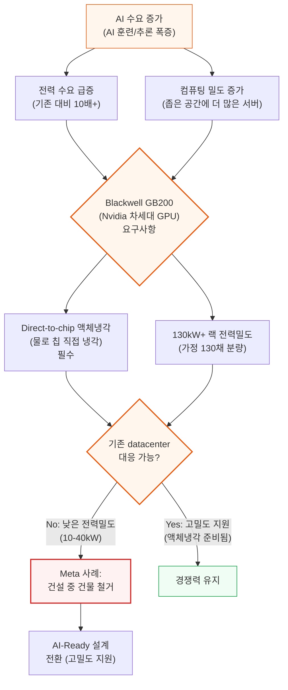
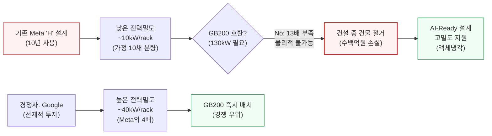
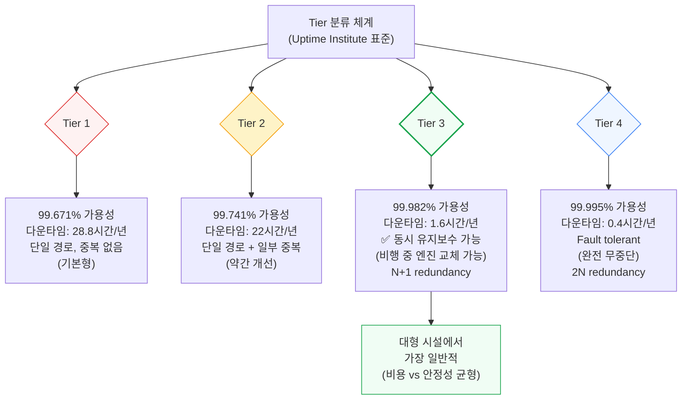
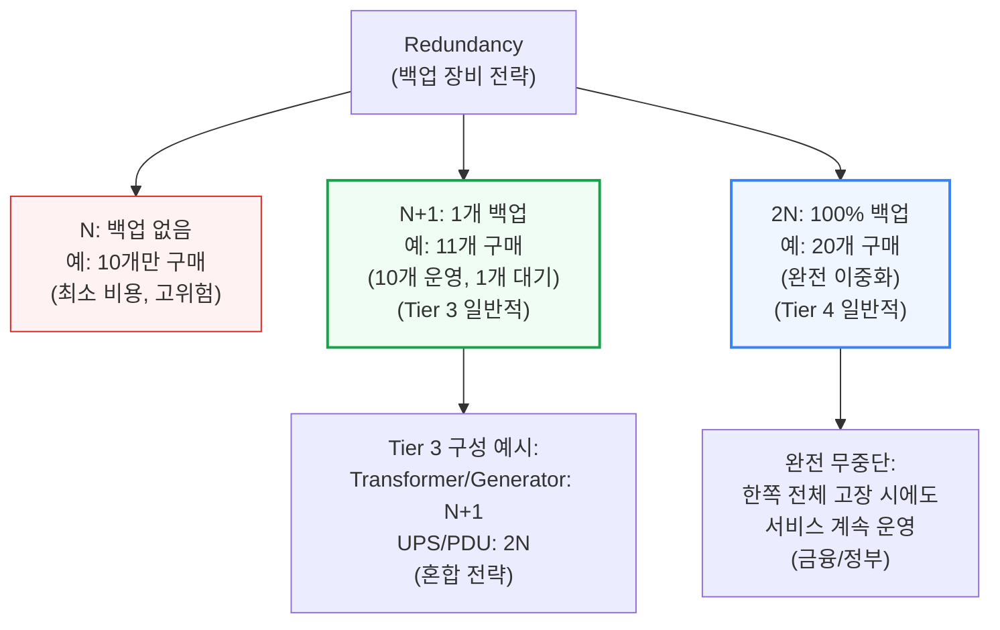
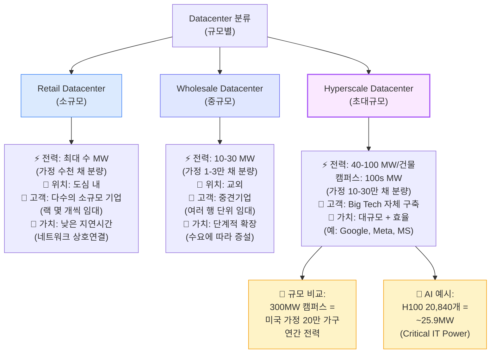
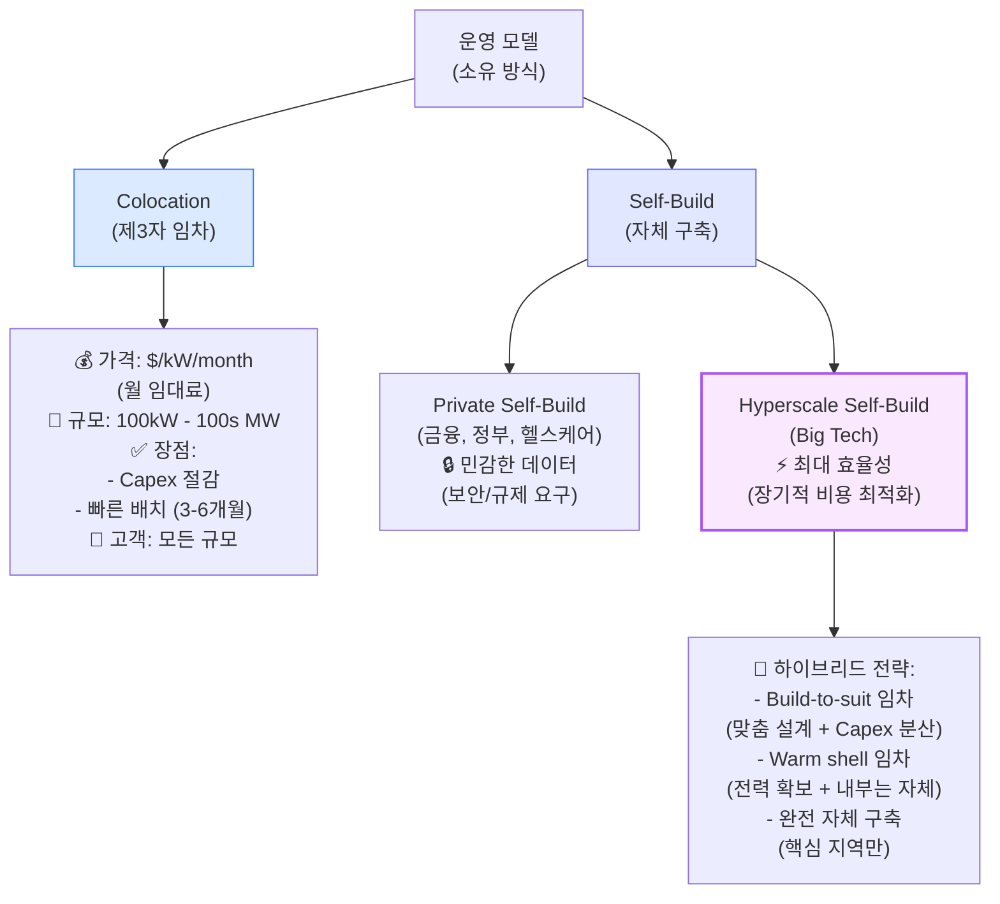
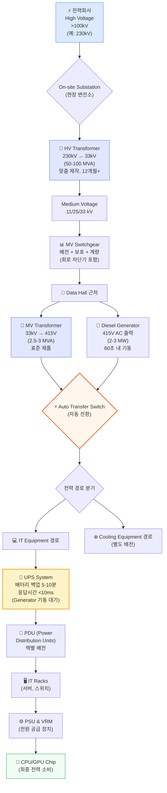
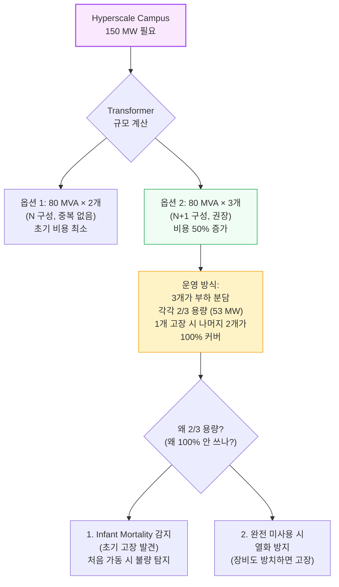
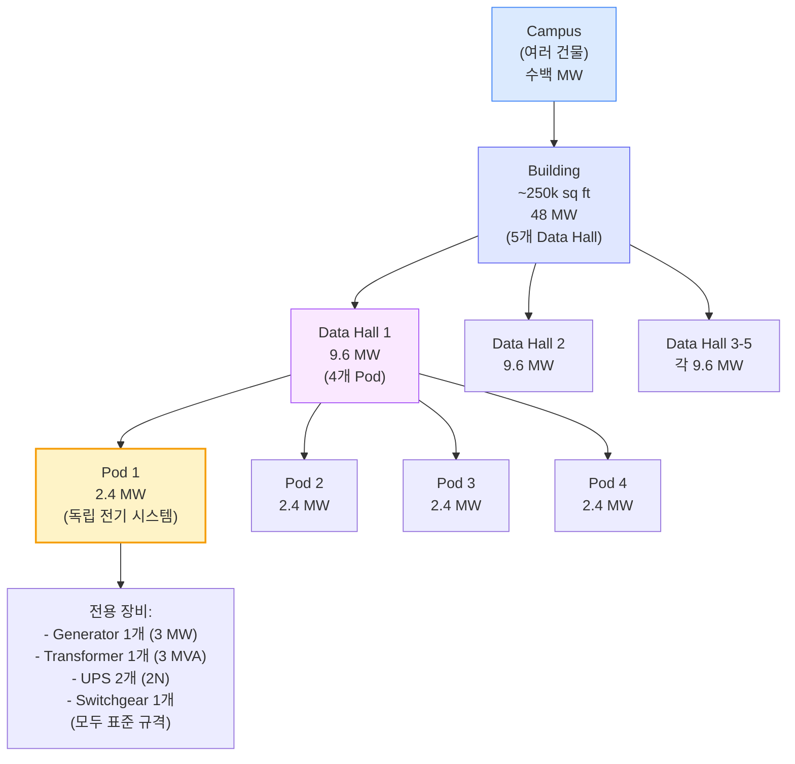
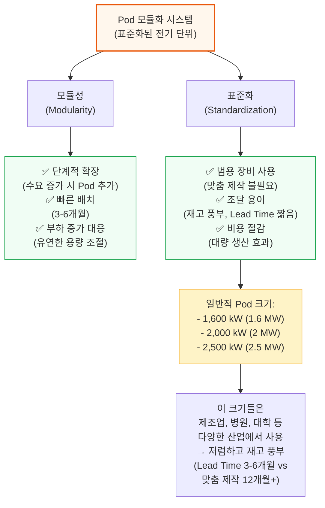

# Datacenter Anatomy Part 1: Electrical Systems

> **출처**: [SemiAnalysis Newsletter](https://newsletter.semianalysis.com/p/datacenter-anatomy-part-1-electrical)
> **저자**: Dylan Patel
> **발행일**: 2024-10-14

---

## 🟡 서론: AI 시대의 Datacenter 변화

**📌 핵심 결론:**
- Blackwell GB200은 130kW+ 전력밀도와 액체냉각을 동시에 요구 → 기존 datacenter(10-40kW) 물리적 대응 불가
- Meta는 건설 중 건물 철거 (수백억원 손실), Google은 40kW/rack로 즉시 배치 가능
- 전력밀도 격차(4배)가 AI 경쟁력의 결정적 차이
- 결론: 고밀도 전력 + 액체냉각 준비가 AI 시대 생존 조건

---

Datacenter 산업이 AI 훈련과 추론의 대규모 수요로 인해 전례 없는 가속화를 경험하고 있습니다. 특히 Nvidia의 Blackwell GB200 출시는 datacenter 설계의 근본적 변화를 요구합니다.

**🎯 이 다이어그램이 설명하는 것:**
- AI 수요 증가가 두 가지 핵심 요구사항(전력 급증 + 밀도 증가)을 만들어냄
- Blackwell GB200은 130kW+ 전력밀도와 액체냉각을 동시에 요구
- 기존 datacenter(10-40kW)는 물리적으로 대응 불가능 → Meta처럼 건물 철거 또는 경쟁력 상실
- 핵심 메시지: 고밀도 전력과 액체냉각 준비가 AI 시대 경쟁력을 결정

### Meta 사례: 전력밀도가 경쟁력을 결정한다

Meta는 건설 중이던 datacenter 건물을 철거했습니다. 이유는 단 하나: 전력밀도가 너무 낮아서 GB200을 수용할 수 없었기 때문입니다.

**🎯 이 다이어그램이 설명하는 것:**
- Meta의 기존 설계(10kW/rack)와 Google의 설계(40kW/rack)는 4배 차이
- GB200은 130kW를 요구 → Meta는 13배 부족, Google은 3배 부족
- Meta: 건물 철거 + 재설계 (수백억원 손실)
- Google: 즉시 배치 가능 (경쟁 우위)
- 결론: 선제적인 고밀도 투자가 AI 시대 경쟁력을 결정

**핵심 인사이트:**
- 전력밀도 격차: Google 40kW vs Meta 10kW (4배 차이)
- GB200 130kW 요구사항을 충족하지 못하면 AI 경쟁에서 뒤처짐
- Meta는 수백억원을 들여 건물을 철거하고 재설계 중

---

## 🟢 Datacenter 기초

**📌 핵심 결론:**
- Tier 3 (99.982% 가용성)가 대형 시설 표준 → 비용과 안정성의 균형점
- Redundancy 전략: N+1 (10% 비용 증가)로 안정성 대폭 향상
- Tier 4 (완전 무중단)는 비용 2배 → 금융/정부만 사용
- 결론: Tier 3 + N+1/2N 혼합 전략이 최적

---

### Datacenter란?
IT 장비에 안전하고 효율적으로 전력을 공급하는 특수 목적 시설. 서버, 네트워크 스위치, 스토리지 장치가 랙에 배치되어 대량의 전력을 소비하고 열을 발생시킵니다.

**📌 용어 풀이: Critical IT Power**
> - IT 장비가 소비하는 최대 전력 (단위: kW 또는 MW)
> - 실제 전력망에서 공급되는 전력 > Critical IT Power (냉각, 조명 등 포함)
> - **Power Utilization Rate**:
>   - 클라우드 컴퓨팅: 50-60%
>   - AI 훈련: 80%+
>   - 엔터프라이즈: <50%

### 규모 비교: Datacenter vs 일반 건물

현대 datacenter는 일반 사무실 대비 50배 이상의 전력 밀도를 가집니다. 30년 전 "사무실 + 강력한 에어컨" 수준에서, 이제는 전용 냉각 인프라를 갖춘 전문 시설로 진화했습니다.

### Tier 분류 체계 (Uptime Institute)

Datacenter의 안정성과 가용성을 평가하는 업계 표준 분류 체계입니다.

**🎯 이 다이어그램이 설명하는 것:**
- Tier 1-4는 가용성(99.671% → 99.995%)과 다운타임(28.8시간 → 0.4시간/년)으로 구분
- Tier 3가 대형 시설에서 가장 일반적으로 사용됨
- 이유: 비용과 안정성의 균형점 (동시 유지보수 가능 + N+1 redundancy)
- Tier 4는 완전 무중단(fault tolerant)이지만 비용이 2배 → 금융/정부 등 미션 크리티컬만 사용
- 핵심: 1.6시간/년 다운타임(Tier 3)과 0.4시간/년(Tier 4) 차이에 2배 비용을 쓸 가치가 있는가?

**참고: CSP의 "Three Nines" vs Datacenter Tier**
- CSP (클라우드 서비스 제공자)의 99.9%/99.999% 가용성은 SLA(서비스 수준 계약)
- 여러 Availability Zone 포함 + 서버/네트워크 가동시간 포함
- Datacenter Tier는 단일 시설의 물리적 인프라 가용성만 측정

### Redundancy: 백업 장비 전략

**🎯 이 다이어그램이 설명하는 것:**
- N, N+1, 2N은 백업 장비 수량 전략
- N+1(1개 백업)은 Tier 3의 표준 → 비용 10% 증가로 안정성 대폭 향상
- 2N(100% 백업)은 Tier 4의 표준 → 비용 2배, 완전 무중단
- Tier 3는 혼합 전략: Transformer/Generator는 N+1, UPS/PDU는 2N
- 핵심: 백업 전략은 비용과 다운타임 리스크의 트레이드오프

---

## 🟡 Datacenter 종류별 비교

**📌 핵심 결론:**
- Hyperscale (40-100 MW/건물)이 AI 시대 필수 → Big Tech만 가능한 규모
- Colocation(임대) vs Self-Build(자체 구축): Capex vs 통제권 트레이드오프
- AI 시대에는 빠른 확장이 중요 → Colocation 수요 증가 (Meta, Microsoft도 사용)
- 결론: 300MW 캠퍼스 = 미국 가정 20만 채 분량 → 엄청난 전력 인프라 필요

---

Datacenter는 규모(전력 용량)에 따라 Retail, Wholesale, Hyperscale로 분류됩니다.

**🎯 이 다이어그램이 설명하는 것:**
- 세 종류의 datacenter는 전력 규모(수 MW → 10-30 MW → 40-100 MW)로 구분
- 각각 다른 비즈니스 모델: Retail(네트워크 생태계), Wholesale(확장성), Hyperscale(대규모 효율)
- Hyperscale 규모 비교: 300MW = 미국 가정 20만 채 = H100 클러스터 약 10개
- 핵심: AI 시대에는 Hyperscale 규모가 필수 → Meta, Google, Microsoft 등만 가능

### 규모별 특징 상세

| 특징 | Retail | Wholesale | Hyperscale |
|------|--------|-----------|------------|
| **Critical IT Power** | 수 MW | 10-30 MW | 40-100 MW/건물 |
| **위치** | 도심 내 | 교외 | 대규모 부지 |
| **임차 단위** | 수 kW (랙 몇 개) | 1-5 MW (여러 행) | >5 MW (건물 전체) |
| **고객 수** | 다수 (수십~수백) | 중간 (수~수십) | 단일 또는 소수 |
| **가치 제안** | 네트워크 상호연결 | 확장 가능성 | 대규모 + 맞춤 설계 |
| **비즈니스 모델** | 부동산 ("location³") | 용량 + 확장성 | 효율성 극대화 |

### 운영 모델 비교

**🎯 이 다이어그램이 설명하는 것:**
- Colocation(임대) vs Self-Build(자체 구축)의 트레이드오프
- Colocation: Capex 절감, 빠른 배치 → 중소기업에 적합
- Self-Build: 초기 투자 크지만 장기적 비용 절감, 완전한 통제권 → Big Tech만 가능
- Hyperscaler는 하이브리드 전략: Build-to-suit, Warm shell, 완전 자체 구축 혼합
- 핵심: AI 시대에는 빠른 확장이 중요 → Colocation 수요 증가 (Meta, Microsoft도 사용)

**📌 용어 풀이: Build-to-Suit & Warm Shell**
> - **Build-to-Suit**: Colocation 업체가 hyperscaler 사양에 맞춰 건설 후 임대
>   - 장점: Capex 분산, 전문가 설계, 빠른 배치
>   - 규모: 100MW+ 임차 계약도 흔함
>   - 예: Equinix, Digital Realty가 Meta, Microsoft에게 제공
> - **Warm Shell**: 전력 연결은 완료, 내부 M&E(기계/전기) 인프라는 임차자가 구축
>   - 장점: 유연성 + 부분적 Capex 절감
>   - 전력 확보는 빠르게, 내부 설계는 자유롭게
> - **Capex vs Opex**:
>   - Capex (자본 지출): 건물, 장비 구매 (초기 투자 큼)
>   - Opex (운영 비용): 전기료, 임대료 (월 지출)

---

## 🔴 Datacenter 전기 시스템

**📌 핵심 결론:**
- 전력은 HV (230kV) → MV (33kV) → LV (415V) 3단계 강압
- 이중 백업: Generator (1분) + UPS (<10ms) → 무중단 전력 공급
- HV Transformer는 맞춤 제작 (Lead Time 12-24개월) → 사전 주문 필수
- Pod 모듈화로 표준 장비 사용 → 조달 용이 + 비용 절감
- 결론: 복잡한 전기 시스템이지만 표준화와 모듈화로 효율 극대화

---

### 핵심 원리: 왜 고전압으로 전달하나?

전력 손실은 전류의 제곱에 비례(P_loss = I² × R)하므로, 고전압을 사용하면 전류가 낮아져 손실이 급격히 감소합니다.

**🎯 이 다이어그램이 설명하는 것:**
- 고전압 사용 시 전류↓ → 손실 = I² × R에서 I가 낮아져 손실 급감
- 예: 전류 1/2로 줄이면 손실은 1/4로 감소 (제곱 관계)
- 하지만 고전압은 위험 → 건물 근처에서는 MV(Medium Voltage)로 강압
- 핵심: 장거리 전송은 HV, 건물 내부는 MV/LV로 단계적 강압

**📌 용어 풀이: 전압 레벨**
> - **High Voltage (HV)**: >100kV (예: 138kV, 230kV, 345kV)
>   - 용도: 장거리 송전선, 수백 km 전송
> - **Medium Voltage (MV)**: 11kV, 25kV, 33kV
>   - 용도: 건물 간 배전, 수 km 전송
> - **Low Voltage (LV)**: 415V (미국 3상)
>   - 용도: IT 장비 근처 배전, 수십 m
> - **쉬운 비유**:
>   - HV = 고속도로 (빠르지만 위험)
>   - MV = 일반도로 (중간 속도, 안전)
>   - LV = 주택가 도로 (느리지만 매우 안전)

### 전력 전달 경로 (Outside-In)

**🎯 이 다이어그램이 설명하는 것:**
- 전력이 전력회사 → 최종 CPU/GPU까지 전달되는 전체 경로와 변환 과정
- 3단계 전압 변환: HV (230kV) → MV (33kV) → LV (415V)
- 이중 백업 시스템: Generator (1분 내 기동) + UPS (<10ms 응답)
- 전력 경로 분기: IT 장비용 vs 냉각 장비용 별도 경로
- 핵심: 각 단계마다 변압기와 백업 시스템이 필요 → 복잡하고 비용이 많이 듦

**핵심 포인트:**
1. **전압 변환**: HV (230kV) → MV (33kV) → LV (415V) 3단계 강압
2. **백업 시스템**: Generator (1분 내 기동) + UPS (<10ms 응답)
3. **이중 경로**: IT 장비용 + 냉각 장비용 별도 경로

---

## 🔴 High Voltage Transformers

### Transformer 작동 원리

Transformer는 100년 이상 된 단순한 기술이지만, datacenter의 핵심 장비입니다. AC 전류가 만드는 변화하는 자기장을 이용해 전압을 변환합니다.

**📌 용어 풀이: MVA vs MW**
> - **MVA (Mega Volt-Ampere)**: "겉보기 전력" = 전압 × 전류
> - **MW (Mega Watt)**: "실제 전력" (유효 전력)
> - **관계**: MW = MVA × Power Factor
> - **Power Factor**: 일반적으로 ~0.95, 여유를 위해 0.9로 설계
> - **예시**: 80 MVA transformer ≈ 72 MW 실제 전력
> - **왜 다른가?**: AC 전력은 전압과 전류의 위상 차이로 인해 실제 전력이 겉보기 전력보다 낮음

### HV Transformer 사양 및 배치

**🎯 이 다이어그램이 설명하는 것:**
- 150 MW 캠퍼스에 80 MVA transformer 2개 vs 3개 비교
- N+1 구성(3개)이 권장되는 이유: Infant Mortality 감지 + 열화 방지
- 3개를 각각 2/3 용량으로 운영 → 1개 고장 시에도 100% 커버
- 핵심: 초기 투자 50% 증가(2개→3개)로 안정성과 수명 크게 향상

**주요 구성 요소:**
- **Copper Coils**: 1차/2차 권선
- **Transformer Core**: GOES (Grain Oriented Electrical Steel)
  - **병목**: GOES 제조사가 제한적 → transformer 공급 부족의 주요 원인
  - 주요 공급사: Nippon Steel, POSCO, ArcelorMittal 등

**📌 Lead Time 주의**
> HV Transformer는 맞춤 제작 (각 송전선마다 특성이 다름)
> - 일반적 Lead Time: **>12개월**
> - 해결책: Datacenter 계획 단계에서 사전 주문
> - AI 붐으로 인한 수요 급증 → 현재 18-24개월까지 증가

---

## 🟡 Data Halls and Pods

**📌 핵심 결론:**
- Pod 모듈화로 단계적 확장 + 빠른 배치 (3-6개월 vs 맞춤 제작 12개월+)
- 표준 크기(1.6/2/2.5 MW)는 다양한 산업에서 사용 → 재고 풍부 + 저렴
- 48 MW 건물 = 5개 Hall = 20개 Pod → 부분 고장 시에도 나머지 운영
- 결론: 모듈화와 표준화가 AI 시대 속도 경쟁의 핵심

---

### 모듈화 구조: Microsoft Datacenter 예시

현대 hyperscale datacenter는 모듈화되어 있습니다. Campus → Building → Data Hall → Pod 계층 구조로, 빠른 확장과 유연성을 제공합니다.

**🎯 이 다이어그램이 설명하는 것:**
- 48 MW 건물은 5개 Data Hall(각 9.6 MW)로 분할
- 각 Data Hall은 4개 Pod(각 2.4 MW)로 분할
- 각 Pod는 독립적인 전기 장비 세트 보유 (Generator, Transformer, UPS, Switchgear)
- 핵심: 모듈화로 인해 부분적 고장 시에도 나머지 Pod는 정상 운영 + 단계적 확장 가능

**구조 계층:**
1. **Campus**: 여러 건물 (100s MW) - 예: Google 300MW 캠퍼스
2. **Building**: 단일 건물 (~50 MW) - 일반적으로 6-12개월 건설
3. **Data Hall**: 건물 내 방 (~10 MW) - 서버가 배치되는 실제 공간
4. **Pod**: Data Hall 내 모듈 (~2-3 MW) - 독립적인 전기 시스템 단위

### Pod 시스템의 장점

**🎯 이 다이어그램이 설명하는 것:**
- Pod 모듈화는 두 가지 핵심 장점: 모듈성 + 표준화
- 모듈성: 단계적 확장 가능 → 수요 예측 실패 리스크 감소
- 표준화: 범용 장비 사용 → 조달 용이 + 비용 절감
- 1.6kW, 2MW, 2.5MW는 다양한 산업에서 사용하는 표준 크기 → 재고 풍부
- 핵심: 맞춤 제작(12개월+) vs 표준 제품(3-6개월) 차이가 AI 시대 속도 경쟁에서 결정적

---

**[섹션 1-4 완료 - 업데이트된 규칙 적용]**

다음 섹션 미리보기:
- 🔴 Generators, MV Transformers, Power Distribution
- 🔴 UPS Systems
- 🟡 OCP Racks and BBUs
- 🔴 AI Impact: Power Density 증가
- 🟡 Winners & Losers
- 🟡 CapEx Forecast

---

*작성 진행률: 약 40% 완료*
*업데이트: 각 다이어그램에 명확한 목적 설명 추가*
