# Datacenter Anatomy Part 1: Electrical Systems

> **출처**: [SemiAnalysis Newsletter](https://newsletter.semianalysis.com/p/datacenter-anatomy-part-1-electrical)
> **저자**: Dylan Patel
> **발행일**: 2024-10-14

---

## 🟡 서론: AI 시대의 Datacenter 변화

### 핵심 변화: AI가 Datacenter 설계를 재정의하다

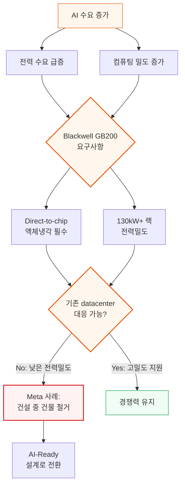

**📌 용어 풀이: Blackwell GB200**
> - Nvidia의 차세대 GPU 제품군
> - 랙당 130kW+ 전력 소비
> - H100 대비 추론 성능 9배, 훈련 성능 3배 향상
> - Direct-to-chip 액체냉각 필수

### Meta 사례: 전력밀도가 경쟁력을 결정한다

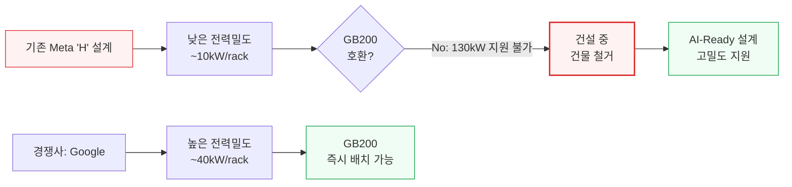

**핵심 인사이트:**
- Meta는 건설 중인 건물을 철거하고 AI-Ready 설계로 전환
- 전력밀도: Google 40kW/rack vs Meta 10kW/rack (4배 차이)
- GB200 130kW 요구사항을 충족하지 못하면 AI 경쟁에서 뒤처짐

---

## 🟢 Datacenter 기초

### Datacenter란?
IT 장비에 안전하고 효율적으로 전력을 공급하는 특수 목적 시설. 서버, 네트워크 스위치, 스토리지 장치가 랙에 배치되어 대량의 전력을 소비하고 열을 발생시킵니다.

**📌 용어 풀이: Critical IT Power**
> - IT 장비가 소비하는 최대 전력 (단위: kW 또는 MW)
> - 실제 전력망에서 공급되는 전력 > Critical IT Power (냉각, 조명 등 포함)
> - **Power Utilization Rate**:
>   - 클라우드 컴퓨팅: 50-60%
>   - AI 훈련: 80%+
>   - 엔터프라이즈: <50%

### 규모 비교: Datacenter vs 일반 건물

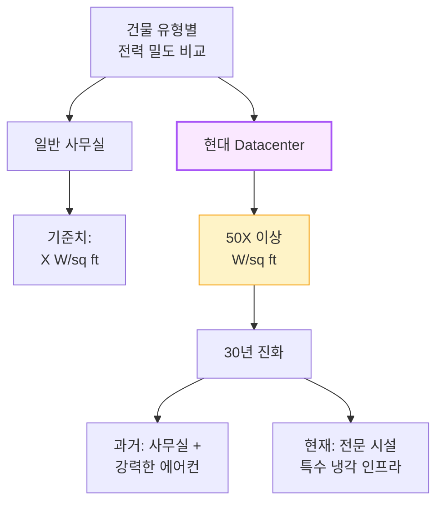

### Tier 분류 체계 (Uptime Institute)

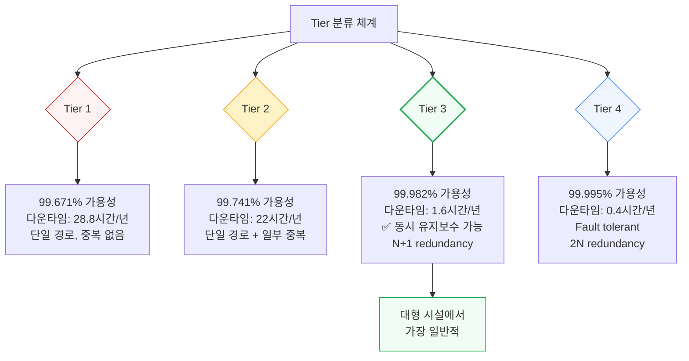

**📌 용어 풀이: Redundancy (중복성)**
> - **N**: 정확히 필요한 수량만 보유
>   - 예: transformer 10개 필요 → 10개 구매
> - **N+1**: 필요한 수량 + 1개 예비
>   - 예: transformer 10개 필요 → 11개 구매 (10개 운영, 1개 대기)
> - **2N**: 필요한 수량의 2배
>   - 예: transformer 10개 필요 → 20개 구매
> - **Tier 3 일반적 구성**:
>   - Transformer/Generator: N+1
>   - UPS/PDU: 2N

**📌 용어 풀이: "Concurrently Maintainable" (동시 유지보수 가능)**
> Tier 3 시설의 핵심 특징. 시스템 중단 없이 장비를 유지보수할 수 있음을 의미합니다.

**참고: CSP의 "Three Nines" vs Datacenter Tier**
- CSP (클라우드 서비스 제공자)의 99.9%/99.999% 가용성은 SLA(서비스 수준 계약)
- 여러 Availability Zone 포함 + 서버/네트워크 가동시간 포함
- Datacenter Tier는 단일 시설의 물리적 인프라 가용성만 측정

---

## 🟡 Datacenter 종류별 비교

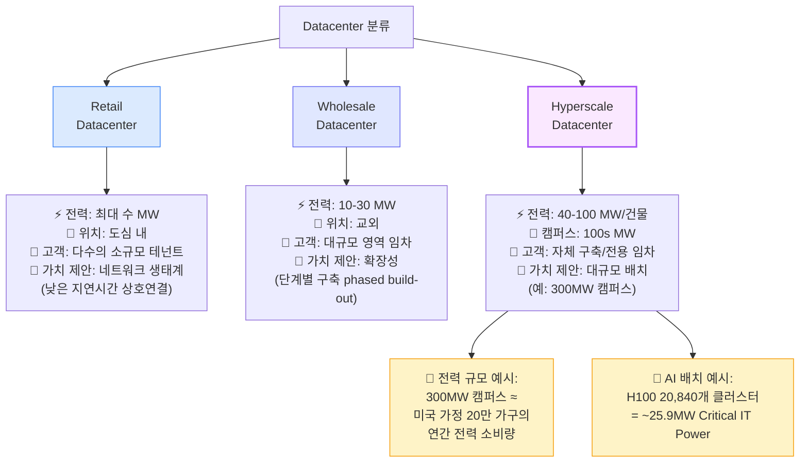

### 규모별 특징 상세

| 특징 | Retail | Wholesale | Hyperscale |
|------|--------|-----------|------------|
| **Critical IT Power** | 수 MW | 10-30 MW | 40-100 MW/건물 |
| **위치** | 도심 내 | 교외 | 대규모 부지 |
| **임차 단위** | 수 kW (랙 몇 개) | 1-5 MW (여러 행) | >5 MW (건물 전체) |
| **고객 수** | 다수 (수십~수백) | 중간 (수~수십) | 단일 또는 소수 |
| **가치 제안** | 네트워크 상호연결 | 확장 가능성 | 대규모 + 맞춤 설계 |
| **비즈니스 모델** | 부동산 ("location³") | 용량 + 확장성 | 효율성 극대화 |

### 운영 모델 비교

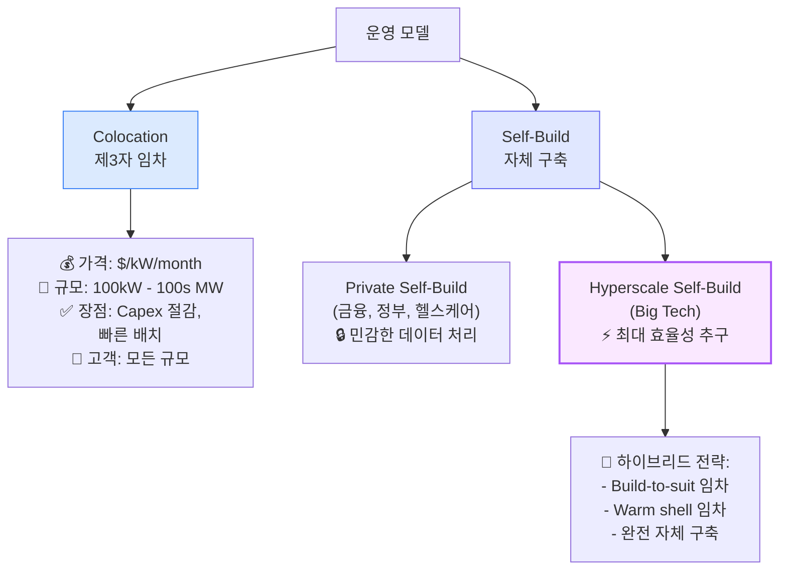

**📌 용어 풀이: Build-to-Suit & Warm Shell**
> - **Build-to-Suit**: Colocation 업체가 hyperscaler 사양에 맞춰 건설 후 임대
>   - 장점: Capex 분산, 전문가 설계
>   - 규모: 100MW+ 임차 계약도 흔함
> - **Warm Shell**: 전력 연결은 완료, 내부 M&E(기계/전기) 인프라는 임차자가 구축
>   - 장점: 유연성 + 부분적 Capex 절감

---

## 🔴 Datacenter 전기 시스템

### 핵심 원리: 왜 고전압으로 전달하나?

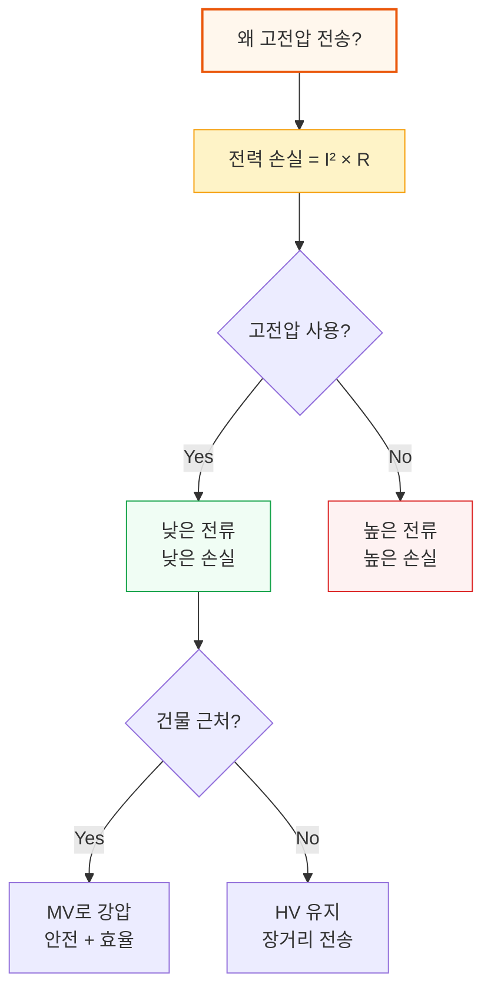

**📌 용어 풀이: 전압 레벨**
> - **High Voltage (HV)**: >100kV
>   - 예: 138kV, 230kV, 345kV
>   - 용도: 장거리 송전선
> - **Medium Voltage (MV)**: 11kV, 25kV, 33kV
>   - 용도: 건물 간 배전
> - **Low Voltage (LV)**: 415V (미국 3상)
>   - 용도: IT 장비 근처 배전

### 전력 전달 경로 (Outside-In)

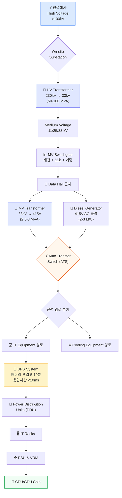

**핵심 포인트:**
1. **전압 변환**: HV (230kV) → MV (33kV) → LV (415V) 3단계 강압
2. **백업 시스템**: Generator (1분 내 기동) + UPS (<10ms 응답)
3. **이중 경로**: IT 장비용 + 냉각 장비용 별도 경로

---

## 🔴 High Voltage Transformers

### Transformer 작동 원리

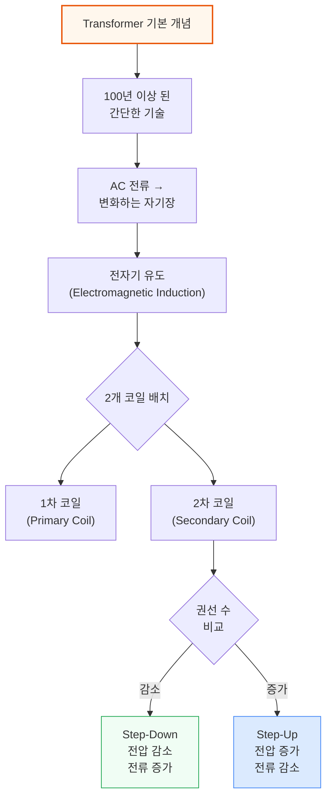

**📌 용어 풀이: MVA vs MW**
> - **MVA (Mega Volt-Ampere)**: "겉보기 전력" = 전압 × 전류
> - **MW (Mega Watt)**: "실제 전력" (유효 전력)
> - **관계**: MW = MVA × Power Factor
> - **Power Factor**: 일반적으로 ~0.95, 여유를 위해 0.9로 설계
> - **예시**: 80 MVA transformer ≈ 72 MW 실제 전력

### HV Transformer 사양 및 배치

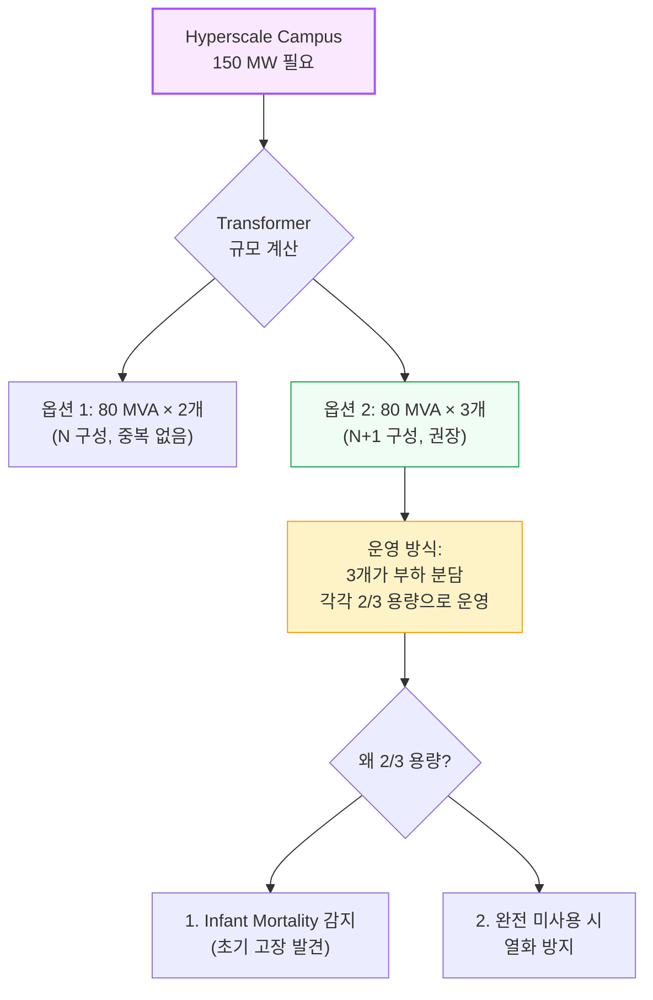

**주요 구성 요소:**
- **Copper Coils**: 1차/2차 권선
- **Transformer Core**: GOES (Grain Oriented Electrical Steel)
  - **병목**: GOES 제조사가 제한적 → transformer 공급 부족의 주요 원인

**📌 Lead Time 주의**
> HV Transformer는 맞춤 제작 (각 송전선마다 특성이 다름)
> - 일반적 Lead Time: **>12개월**
> - 해결책: Datacenter 계획 단계에서 사전 주문

---

## 🟡 Data Halls and Pods

### 모듈화 구조: Microsoft Datacenter 예시

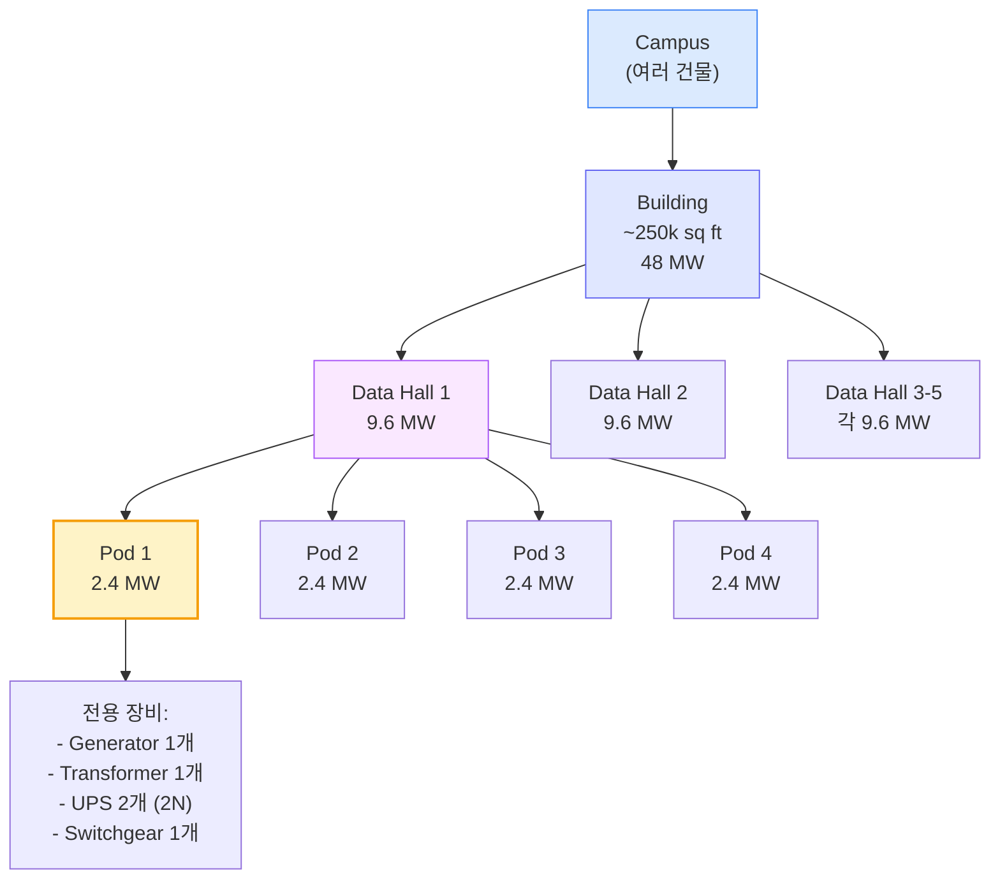

**구조 계층:**
1. **Campus**: 여러 건물 (100s MW)
2. **Building**: 단일 건물 (~50 MW)
3. **Data Hall**: 건물 내 방 (~10 MW)
4. **Pod**: Data Hall 내 모듈 (~2-3 MW)

### Pod 시스템의 장점

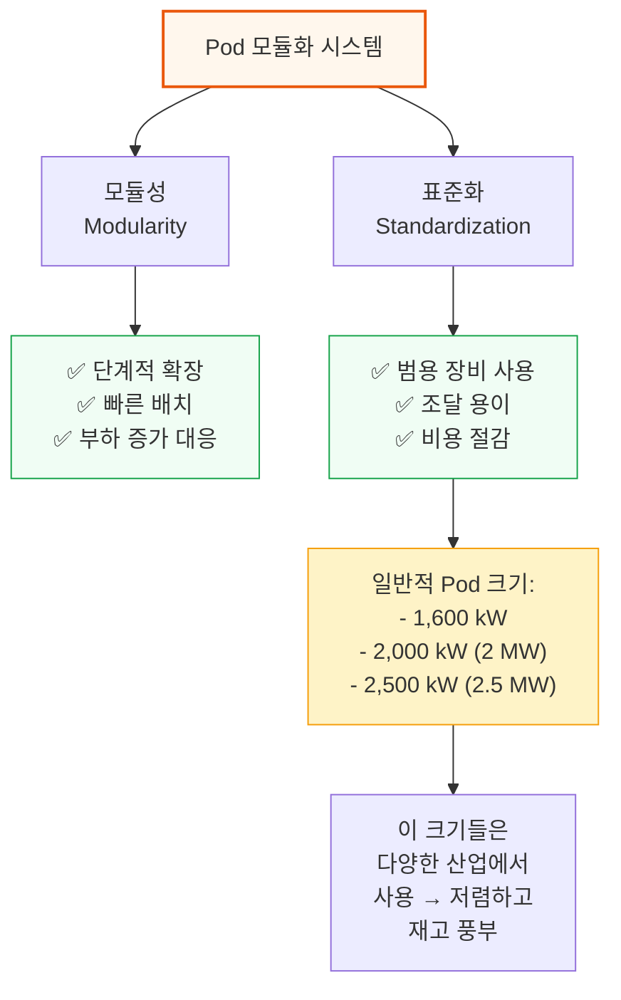

---

**[섹션 1-4 완료]**

다음 섹션 미리보기:
- 🔴 Generators, MV Transformers, Power Distribution
- 🔴 UPS Systems
- 🟡 OCP Racks and BBUs
- 🔴 AI Impact: Power Density 증가
- 🟡 Winners & Losers
- 🟡 CapEx Forecast

---

*작성 진행률: 약 40% 완료*
