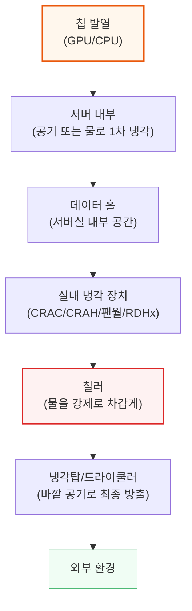
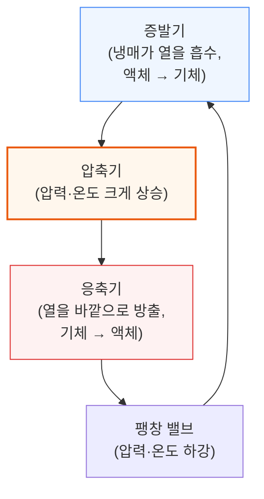
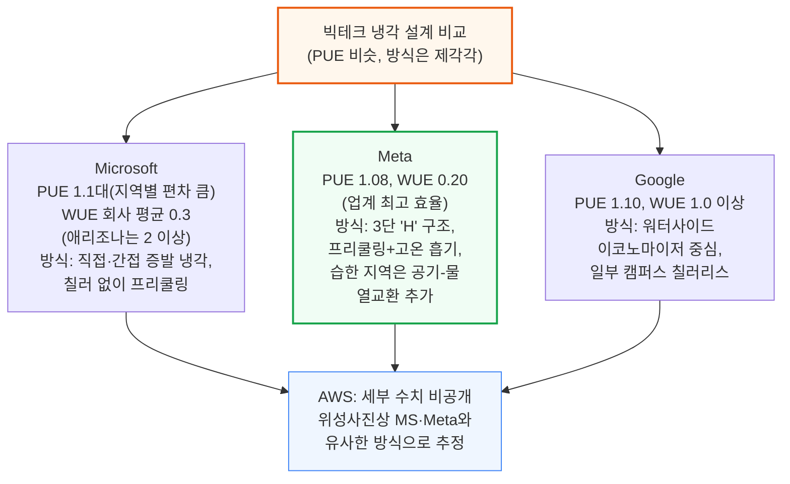
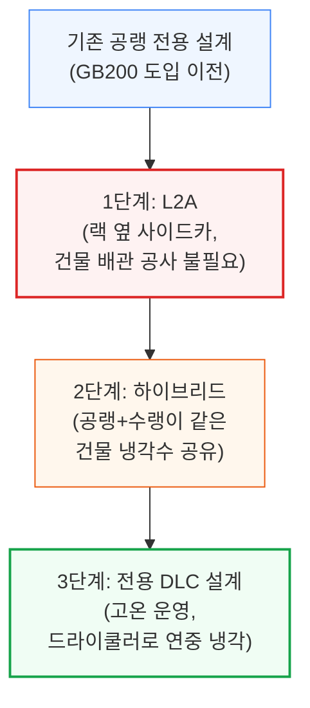

# Datacenter Anatomy Part 2: Cooling Systems

> **출처**: [SemiAnalysis Newsletter](https://newsletter.semianalysis.com/p/datacenter-anatomy-part-2-cooling-systems)
> **저자**: Dylan Patel
> **발행일**: 2025-02-14

---

## 📑 목차

### 전체 섹션
 1. [서론: 냉각이 왜 중요해졌나](#1-서론-냉각이-왜-중요해졌나)
 2. [냉각 기초와 효율 지표 (PUE·WUE)](#2-냉각-기초와-효율-지표-pue-wue)
 3. [공랭식 데이터센터의 열 흐름](#3-공랭식-데이터센터의-열-흐름)
 4. [서버 냉각과 온도차 (Delta T)](#4-서버-냉각과-온도차-delta-t)
 5. [실내 냉각 장치](#5-실내-냉각-장치)
 6. [칠러와 냉각탑](#6-칠러와-냉각탑)
 7. [프리쿨링과 하이퍼스케일러의 초저PUE 설계](#7-프리쿨링과-하이퍼스케일러의-초저pue-설계)
 8. [빅테크 냉각 설계 비교: MS·Meta·Google·AWS](#8-빅테크-냉각-설계-비교-ms-meta-google-aws)
 9. [AI가 바꾼 것: 액체 냉각의 부상](#9-ai가-바꾼-것-액체-냉각의-부상)
10. [냉각 시스템의 미래: L2A·하이브리드·전용 설계](#10-냉각-시스템의-미래-l2a-하이브리드-전용-설계)
11. [빅테크의 차세대 로드맵과 공급업체 지형](#11-빅테크의-차세대-로드맵과-공급업체-지형)

---

## 🔑 용어 정리

본문을 순서대로 읽기 전에 알아두면 좋은 용어들입니다. 자세한 수치와 설명은 본문에서 처음 등장하는 위치에 나옵니다.

- **PUE (전력 사용 효율)**: 서버가 쓰는 전기 1W당, 냉각 등 부가 설비까지 포함해 데이터센터 전체가 실제로 얼마나 더 쓰는지 나타내는 효율 지표. 낮을수록 좋음
- **WUE (물 사용 효율)**: 냉각에 물을 얼마나 쓰는지 나타내는 지표
- **칠러**: 물을 강제로 차갑게 만드는 대형 냉동기. 데이터센터에서 전기를 가장 많이 쓰는 장비 중 하나
- **냉각탑**: 데워진 물을 바깥 공기와 접촉시켜 식히는 옥외 설비
- **Delta T (온도차)**: 냉각 장치에 들어가는 공기·물과 나오는 공기·물의 온도 차이
- **이코노마이저 (프리쿨링)**: 바깥 날씨가 충분히 시원할 때, 칠러를 켜지 않고 바깥 공기나 물만으로 식히는 방식
- **L2A (액체-공기 열교환)**: 서버 내부는 물로 식히되, 그 물 자체는 옆에 놓은 장치가 공기로 식히는 임시방편 방식

---

## 1. 서론: 냉각이 왜 중요해졌나

**📌 핵심:**
- Nvidia GB200은 랙당 120kW 전력을 오직 **칩에 물을 직접 흘려 식히는 방식(DLC)**으로만 냉각 가능 → H100 대비 추론 성능 9배, 학습 성능 3배 향상
- 냉각은 전기 시스템 다음으로 큰 투자비 항목이면서, 완공 후에도 전기요금 대부분을 차지하는 운영비 항목 → 설계 실수는 수년간 비용으로 돌아옴
- 액체 냉각 수요가 과소평가되고 있어 "브릿지"용 임시 냉각 설비 수요가 늘어날 전망
- 결론: Part 1(전기 시스템)에 이어, 이번 편은 데이터센터의 두 번째 핵심 인프라인 냉각 시스템을 다룸

---

지난 Part 1에서는 데이터센터의 전기 시스템을 다뤘습니다. 이번 Part 2에서는 냉각 시스템을 다룹니다. 기가와트(GW)급 클러스터가 예상보다 훨씬 빠르게 늘어나면서, 데이터센터를 새로 짓는 사업자들이 반드시 고려해야 할 설계 변화가 생기고 있습니다.

- Nvidia는 2024년 3월, 차세대 AI 컴퓨팅 플랫폼이 120kW급 72-GPU 랙이며 오직 **DLC(칩 직접 액체 냉각)**로만 냉각 가능하다고 발표
- GB200 NVL72는 대형 언어 모델(LLM) 추론과 학습 모두에서 최고 효율 → H100 대비 추론 성능 9배, 학습 성능 3배 향상 근거
- 냉각 투자비는 데이터센터에서 (IT 장비를 제외하면) 전기 시스템 다음으로 크고, 완공 후에는 냉각용 전기요금이 운영비에서 가장 큰 변동비 항목 중 하나
- 비전문가가 이해하기 쉬운 순서로 정리하면: 냉각 기초 개념 → 실제 장비 → 빅테크 각사 설계 → AI가 만든 변화 → 앞으로의 냉각 로드맵 → 공급업체 지형

**핵심 포인트:** 이 경로의 각 단계마다 전기(그리고 경우에 따라 물)를 쓰는데, 이 경로를 얼마나 짧고 효율적으로 만드느냐가 데이터센터 운영비를 좌우함

---

## 2. 냉각 기초와 효율 지표 (PUE·WUE)

**📌 핵심:**
- 30년 전 데이터센터는 사무실용 에어컨 수준이었지만, 지금은 사무실 대비 50배 넘는 열을 뿜어내는 시설이 됨 (30MW 넘는 전력이 전부 열로 바뀜)
- 업계 평균 PUE는 1.6(전기 1W당 냉각 등에 0.6W 추가로 씀)이지만, 이는 하이퍼스케일러를 뺀 통계라 오해 소지가 큼. Google·Meta는 1.1, MS·AWS는 1.15 수준
- 냉각 외 전력 소비 중 60\~80%가 냉각 장비(칠러·팬·펌프), 15\~30%가 전기 시스템 손실, 5\~20%가 조명 등
- 결론: 실제 업계를 이끄는 하이퍼스케일러의 PUE는 흔히 인용되는 1.6보다 훨씬 낮음 → "업계 평균" 수치만 보고 판단하면 안 됨

---

서버·스위치·스토리지가 꽉 찬 랙은 엄청난 열을 냅니다. 30년 전에는 사무실 건물에 강력한 에어컨을 단 수준이었지만, 지금은 사무실 대비 50배 넘는 열 밀도를 내고 30MW가 넘는 전력이 전부 열로 바뀌는 전용 시설로 진화했습니다. 서버는 보통 5\~30°C 범위에서 가장 오래 씁니다 — 이 범위를 벗어나면 서버 수명이 줄어드는데, 서버 자체가 데이터센터 총소유비용(TCO)에서 가장 큰 항목이라 손해가 큽니다.

**📌 용어 풀이: PUE (Power Usage Effectiveness)**
> - 계산법: (데이터센터 전체 전력) ÷ (IT 장비가 쓰는 전력)
> - PUE 1.5 = IT 장비가 1W 쓸 때마다 냉각·조명 등에 0.5W를 추가로 씀
> - 업계 평균(Uptime Institute 집계): 약 1.6. 다만 이 통계는 하이퍼스케일러를 거의 빼고, 4MW 이상 시설의 단순 평균을 낸 것이라 실제 업계 최전선을 대표하지 못함
> - 하이퍼스케일러 실제 수준: Google·Meta 약 1.1, Microsoft·AWS 약 1.15
> - 함정: 서버 팬 전력은 보통 "IT 장비 전력"에 포함되므로, 똑같은 서버를 공랭 대신 액체 냉각으로 바꾸면 팬을 덜 쓰는 만큼 전체 전력은 줄어도 PUE 숫자만 보면 오히려 나빠 보일 수 있음

냉각 외 전력(non-IT electricity)은 대략 다음과 같이 나뉩니다.
- 60\~80%: 냉각 시스템 (주로 칠러, 그다음 팬·펌프)
- 15\~30%: 전기 시스템 손실 (UPS 변환 손실, 배전 손실, 변압기 손실)
- 5\~20%: 조명 및 기타 (사무 공간 등)

---

## 3. 공랭식 데이터센터의 열 흐름

**📌 핵심:**
- 공랭식 데이터센터의 열은 "서버 팬 → 실내 냉각 장치 → 칠러 → 냉각탑" 4단계를 거쳐 바깥으로 빠져나감
- 실내 냉각 장치(CRAC/CRAH)는 뜨거운 공기의 열을 물로 옮기고, 칠러는 그 물을 다시 차갑게 만드는 별도 역할 분담
- 칠러의 냉동 사이클(증발→압축→응축→팽창)이 전체 과정에서 가장 전기를 많이 씀
- 결론: 열은 "공기→물→냉매→바깥 공기" 순서로 매개체를 바꿔가며 이동하고, 매개체를 바꾸는 각 단계마다 장비와 전기가 필요함

---

콜로케이션(임대) 데이터센터에서 흔히 보는 설계를 살펴보겠습니다. 핵심 냉각 부품은 데이터 홀용 실내 냉각 장치, 칠러, 냉각탑입니다. 경우에 따라 칠러와 냉각탑이 한 장비로 합쳐지기도 합니다. 이 부품들은 서로 분리된 물 순환 회로로 연결되어 열을 효율적으로 옮깁니다.

열이 실제로 빠져나가는 경로는 다음과 같습니다.
- 랙 단계: IT 장비가 열을 내고, 서버 내부 팬이 이 뜨거운 공기를 데이터 홀로 뿜어냄
- 실내 냉각 장치(CRAC 또는 CRAH)가 데이터 홀의 열을 제거함. 장치 내부 냉각 코일에 찬물이 흐르고, 뜨거운 공기가 그 위를 지나가면서 열을 물로 넘겨줌. 데워진 물은 칠러로 다시 펌핑됨
- 칠러가 냉동 사이클을 돌려 물을 다시 차갑게 만듦 — 이 과정이 가장 전기를 많이 씀. 냉매라는 별도 유체로 물의 열을 옮긴 뒤, 냉매를 압축해 온도를 더 올리고, 응축기(공랭식이면 팬, 수랭식이면 냉각탑 연결)에서 열을 밖으로 버림
- 열이 빠져나간 물은 다시 실내 냉각 장치로 돌아가 사이클이 반복됨

이제 각 구성 요소를 하나씩 자세히 보겠습니다.

---

## 4. 서버 냉각과 온도차 (Delta T)

**📌 핵심:**
- 칩 발전소 전기 1kW는 거의 그대로 열 1kW가 됨 → 칩 최대 발열(TDP)은 H100 700W에서 내년 1500W급까지 계속 상승 중
- 팬 속도를 10% 낮추면 에너지 소비는 27% 줄어듦 (팬 에너지는 속도의 세제곱에 비례) → 온도차(Delta T)를 키우는 게 절전의 핵심
- 기존 "비효율" 설계는 7°C 냉각수로 겨우 22°C 서버 흡기온도를 만듦(15°C 손실) → 최신 설계는 서버 흡기온도를 30°C, 심지어 40°C 이상까지 올려 이 손실을 줄임
- 결론: 온도차를 최대한 키우고 유지하는 것이 곧 절전이며, 이를 위해 뜨거운 공기와 찬 공기를 물리적으로 분리하는 격리 설계가 중요함

---

열은 칩에서 시작합니다. 칩 위에 열전도 물질(TIM)이 놓이고, 그 위에 방열판이나 히트싱크가 열을 넓은 면적으로 퍼뜨려 식히기 쉽게 만듭니다. 발열이 클수록 히트싱크도 커져야 해서, H100(700W)처럼 발열이 큰 칩은 서버 크기 자체가 커집니다(H100 서버는 보통 8U, 저전력 CPU 서버는 1\~2U).

서버 팬은 GPU·CPU가 낸 열을 실어 나릅니다. 대략 1kW의 열을 빼내는 데 분당 165\~170 세제곱피트(CFM)의 공기가 필요하다는 경험칙이 있습니다. 팬 전력 소비가 크다 보니, 하이퍼스케일러들은 기성품 서버 대신 자체 설계 서버로 전력을 아낍니다.

**📌 용어 풀이: Delta T (온도차)**
> - 냉각 장치에 들어가는 공기·물과 나오는 공기·물의 온도 차이
> - 온도차가 클수록 같은 열을 빼내는 데 필요한 공기량·펌프 동력이 줄어듦 (선형 관계)
> - 다만 공기량을 줄이는 데 필요한 팬 에너지는 선형이 아니라 세제곱 관계 → 팬 속도를 10% 낮추면 에너지 소비는 27% 줄어듦
> - 칩 사용률이 높을수록 배출 공기 온도가 올라가 온도차가 커지므로, 오히려 에너지 효율이 좋아짐

기존의 "비효율적인" 공랭식 데이터센터는 실내 냉각 장치의 냉각수를 7°C까지 낮춰서 겨우 22°C의 서버 흡기 온도를 만듭니다. 물을 7°C까지 낮추는 데는 막대한 전기가 드는데, 이는 사무용 냉난방(HVAC) 관행을 그대로 물려받은 결과입니다. 업계 표준 단체 ASHRAE는 서버 흡기 온도를 18\~27°C로 권장하고, 30°C 이상 심지어 일부는 45°C까지도 허용합니다.

7°C 냉각수가 22°C 흡기 온도가 되는 15°C 격차는 대부분 공기 흐름 관리 부실 때문입니다. 이 격차는 네 단계로 나눌 수 있습니다.
1. 서버로 들어가는 공기와 나오는 공기의 온도차
2. 데이터 홀 안에서 뜨거운 공기와 찬 공기가 뒤섞여 생기는 손실
3. 실내 냉각 장치 코일의 흡기·배기 온도차
4. 차가운 공급 공기와 뜨거운 배출 공기가 다시 섞이며 생기는 손실

이런 손실을 줄이려고 "격리(Containment)" 설계를 씁니다. 뜨거운 공기 통로 자체를 밀폐하는 "핫 아일 격리"가 신축 데이터센터에서 가장 흔합니다(천장 설계가 필요해 기존 건물 개조는 어려움). "콜드 아일 격리"는 반대로 찬 공기 쪽을 막는 방식으로, 유지보수 시 실내가 매우 더워지는 단점이 있습니다.

---

## 5. 실내 냉각 장치

**📌 핵심:**
- CRAC(개별 에어컨식, 최대 100kW)는 오래되고 작은 시설용, CRAH(중앙 냉각수 방식)는 대형 시설에 유리, 팬월(500\~600kW)은 최신 대형 데이터센터의 표준
- RDHx(랙 뒷문 냉각)는 랙당 30\~40kW(팬 추가 시 50kW+)를 그 자리에서 바로 식혀 실내 공기 관리 부담을 줄임
- 열교환 효율은 RDHx가 약 0.8, 룸 단위 장치(CRAH·팬월)는 0.6\~0.7 수준 → RDHx가 더 효율적이지만 부품이 많아 초기 투자비가 더 큼
- 결론: "실내 공간 전체를 식힐지" vs "랙 옆에서 바로 식힐지"의 트레이드오프이며, 최신 대형 시설은 팬월 + 필요시 RDHx 조합으로 감

---

데이터 홀 안에서 실제로 쓰이는 실내 냉각 장치는 크게 CRAC, CRAH, 팬월 세 가지입니다.

- **CRAC**: 가정용 에어컨과 비슷하게 냉매 사이클을 자체적으로 도는 완결형 2단 장비. 실내기와 실외 응축기가 짝을 이룸. 냉각 용량은 최대 100kW로 낮고 효율도 낮아, 오래되었거나 아주 작은 시설에서 씀
- **CRAH**: 건물 전체의 중앙 냉각수를 끌어와 열을 식힘. 건물 전체에 배관·펌프 시스템이 더 크게 필요하지만, 부품 수가 적고 대형 시설에서는 경제성이 더 좋음
- **팬월**: CRAH보다 용량이 커서(유닛당 500\~600kW) 최신 대형 데이터센터의 표준. 여러 대를 쌓아 5\~10MW급 데이터 홀 전체의 공기 흐름을 감당. 이중 마루(raised floor)가 필요 없어 시공도 간단

CRAC·CRAH·팬월은 보통 Tier 3급 데이터센터 기준 N+1 또는 N+2 여분을 두지만, 이들을 건물 냉각수에 연결하는 배관은 고장·정비 시 격리를 위해 2N(완전 이중화) 구성을 씁니다.

**📌 용어 풀이: RDHx (후면 도어 열교환기)**
> - 랙 뒷면에 라디에이터가 달린 문을 붙여, 그 자리에서 바로 서버가 내뿜은 뜨거운 공기를 식히는 장치. "룸 전체를 식히는 CRAH"를 "랙 하나 단위"로 축소한 것에 가까움
> - 랙당 냉각 용량 30\~40kW, 팬을 추가한 "액티브 RDHx"는 50kW 이상까지 가능
> - 장점: 열원(칩)과 가까워 열교환 효율이 약 0.8 (CRAH·팬월 같은 룸 단위 장치는 0.6\~0.7) → 같은 성능이면 칠러에 들어가는 물 온도를 살짝 더 높게 잡을 수 있어(=칠러 전력 절감) 유리
> - 단점: 부품(작은 팬 다수)이 많아 초기 투자비가 더 높고, 방 일부만 RDHx로 식힐 경우 유량·온도·압력을 조절하는 **CDU(냉각수 분배 장치)**가 추가로 필요해 비용이 더 늘어남

**📌 용어 풀이: CDU (냉각수 분배 장치)**
> - 서버·랙 내부 냉각 회로("안쪽 루프")와 건물 전체 냉각수 시스템("바깥쪽 루프")을 액체-액체 열교환기로 분리해서 연결해주는 장비
> - 핵심 구성: 액체-액체 열교환기, 펌프, 제어 전자장치
> - 일반적으로 1MW 이상 용량, 여러 랙을 동시에 담당

---

## 6. 칠러와 냉각탑

**📌 핵심:**
- 칠러는 IT 장비를 제외하면 데이터센터에서 전기를 가장 많이 쓰는 단일 장비 → 대형 유닛 1대가 15\~20MW급 용량
- 물을 증발시켜 식히는 "습식 냉각탑"은 효율은 좋지만 물을 많이 씀(대형 데이터센터 기준 연간 6억L 이상 가능) → 물이 부족한 지역에서는 물을 안 쓰는 "건식 드라이쿨러"나 "공랭식 칠러"를 씀
- 물을 살짝 증발시켜 주변 공기를 미리 식히는 "단열 냉각" 보조 기법으로 공랭식 칠러의 효율을 끌어올릴 수 있음
- 결론: 물 사용량과 전력 효율은 트레이드오프 관계이며, 지역별 물 사정에 따라 습식·건식 설계를 선택함

---

칠러는 사실상 대형 냉장고입니다. 냉동 사이클의 핵심은 압축기이며, 두 가지 물리 현상을 이용합니다. 첫째, 기체는 액체보다 더 많은 열을 흡수할 수 있습니다. 둘째, 밀폐된 공간에서는 압력이 높을수록 온도도 높아집니다.

냉매는 물보다 훨씬 낮은 온도에서 끓는 특수 유체로, 압축기를 거쳐 뜨거워질수록 열을 더 잘 옮길 수 있고, 응축기에서는 공랭식이면 공기로, 수랭식이면 냉각탑과 연결된 물로 열을 넘깁니다.

수랭식 칠러는 건물 내부 기계실에 있으며, 옥상이나 건물 옆의 냉각탑과 별도 배관으로 연결됩니다. 대형 데이터센터에서는 15MW(약 4,250 냉동톤), 많게는 20MW급 칠러를 씁니다 — 소수의 대형 유닛으로 시설 전체를 감당하는 대신, 건물 전체에 걸친 굵은 배관이 필요합니다. 에너지 효율(COP, 투입 전력 대비 냉각 용량)은 보통 7배 안팎입니다.

냉각탑은 크게 두 종류입니다.
- **습식(증발식) 냉각탑**: 물을 충전재에 뿌려 증발시키며 식힘. 효율은 좋지만 물 소비가 많고 별도 수처리 설비가 필요. 대형 냉각탑 1기가 약 7\~8MW를 감당(분당 약 5,000갤런의 물 흐름)
- **건식 냉각탑(드라이쿨러)**: 물을 증발시키지 않고 팬으로만 식히는 폐쇄 회로. 물을 아예 안 쓰지만 효율이 떨어지고, 대형 유닛도 2MW가 한계이며 팬 20개 이상이 필요

**📌 용어 풀이: WUE와 물 사용량 감**
> - WUE(물 사용 효율) = 1kWh 전력을 처리하는 데 쓰는 물의 리터 수
> - 수랭식 칠러를 쓰는 대형 데이터센터는 WUE가 2L/kWh를 넘기도 함
> - 예시: 50MW 데이터센터, 가동률 60%, PUE 1.25, WUE 2.0 → 연간 약 6억 5,700만 리터(약 1억 7,400만 갤런) 소비. 올림픽 규격 수영장(약 2,500m³) 약 260개 분량
> - 물 부족 지역이나 데이터센터 밀집 지역(미국 버지니아 애시번 등)에서는 이 물 사용량 때문에 인허가가 지연되기도 함

물이 부족한 지역에서는 공랭식 칠러가 대안입니다. 칠러 자체가 실외에 있고 냉각탑 역할까지 겸해 시스템이 단순합니다. 다만 대형 유닛도 2MW가 한계이고(팬 18개, 소비전력 500kW 수준), 수랭식보다 효율이 떨어집니다. 이를 보완하는 기법이 "단열 냉각"입니다 — 공랭식 칠러 앞에 물을 살짝 뿌려 증발시켜(단열 냉각 패드) 주변 공기를 한 번 더 식히는 방식으로, 습도가 낮은 지역일수록 효과가 큽니다.

마지막으로, 데이터센터의 폐열을 인근 도시 난방에 재활용하는 "열 재사용"도 있습니다. Microsoft에 따르면 에너지 재사용률이 겨울 69%, 여름 86%까지 가능하며, 2024년 파리 올림픽 수영장이 인근 Equinix 데이터센터의 폐열로 난방된 사례가 유명합니다. 다만 가정과의 물리적 거리, 인프라 구축 여부 등 현실적 제약이 많습니다.

---

## 7. 프리쿨링과 하이퍼스케일러의 초저PUE 설계

**📌 핵심:**
- 하이퍼스케일러는 자사 전용 설계 덕분에 PUE 1.1\~1.2 수준을 달성 — 콜로케이션(임대) 업체보다 훨씬 낮음
- 핵심 기법은 "프리쿨링"(바깥 공기·물이 충분히 시원하면 칠러를 아예 안 씀)과, 서버 흡기 온도를 30\~40°C 이상까지 올려 프리쿨링이 가능한 날을 늘리는 것
- 덥고 습한 지역(싱가포르·인도 등)은 프리쿨링 효과가 가장 떨어지는 최악의 조건
- 결론: 위치(기후)와 서버가 견디는 온도 범위, 이 두 가지가 하이퍼스케일러 PUE 경쟁력을 좌우함

---

콜로케이션 업체는 다양한 고객의 현재·미래 요구를 두루 만족시켜야 하지만, 하이퍼스케일러는 자기 workload에 맞춘 전용 설계를 쓸 수 있어 PUE 1.1\~1.2를 달성합니다. 핵심은 "프리쿨링(이코노마이저)"과 CFD(전산유체역학) 분석을 활용한 정밀 설계입니다.

- **에어사이드 이코노마이저**: 바깥 공기를 그대로 끌어와 식힘 → 추운 지역에 유리, 칠러 자체가 필요 없어짐
- **워터사이드 이코노마이저**: 칠러 냉매 회로를 건너뛰는 별도 물 루프를 둬서, 물을 곧장 냉각탑·드라이�쿨러로 보냄. 단, 물 온도가 바깥 습구온도보다 높아야 작동

두 방식 모두 바깥 환경이 서버 흡기 온도보다 충분히 시원해야 통합니다. 그래서 하이퍼스케일러는 서버 흡기 온도를 30°C, 때로는 40°C 이상까지 올려 프리쿨링이 가능한 날을 최대한 늘립니다. 반대로 싱가포르·인도처럼 덥고 습한 지역은 프리쿨링에 가장 불리한 환경입니다.

---

## 8. 빅테크 냉각 설계 비교: MS·Meta·Google·AWS

**📌 핵심:**
- Microsoft: "직접 증발 냉각"으로 칠러 자체를 없앰 → 애리조나(건조)에서는 물 없이도 가능하지만, 습한 지역에서는 물 사용량(WUE)이 회사 평균 0.3 대비 2배 이상 뛰기도 함
- Meta "H": PUE 1.08, WUE 0.20으로 업계 최고 효율이지만, 3단 구조 + 완공까지 약 2년(경쟁사의 2\~3배) → 결국 AI 시대엔 이 저밀도 설계를 철거하고 새 설계로 교체
- Google: PUE 1.10, WUE는 1.0 이상으로 물을 더 많이 씀. 워터사이드 이코노마이저 위주, 일부 캠퍼스는 칠러 자체가 없는 "칠러리스" 설계
- 결론: 4개 회사 모두 PUE 1.1 안팎이지만, 그 효율을 어떻게 얻느냐(물 vs 설계 복잡도 vs 건설 기간)의 트레이드오프는 회사마다 다름

---

### Microsoft: 직접 증발 냉각

Microsoft의 대표 설계 "Ballard"(48MW)는 칠러를 아예 쓰지 않는 "직접 증발 냉각" 방식입니다. 바깥 공기를 걸러서 건물 안으로 들여오고, 필요하면 가습해서 온도를 낮춘 뒤, 서버실을 지나 뜨거워진 공기를 그대로 밖으로 배출합니다. 물 증발이 필요 없을 때는 이를 "프리 에어 쿨링"이라 부릅니다.

애리조나 피닉스처럼 건조한 지역에서는 이 방식이 매우 잘 통해 냉각탑이 아예 없는 시설도 있습니다. 다만 30°C가 넘는 날이 많아 물 증발이 필요한 기간이 길어지면서, 이 지역 한 곳의 WUE만 2를 넘기도 합니다(회사 전체 평균은 0.3). 기후가 이 방식에 안 맞는 지역에서는 기계식 냉각 없이 드라이쿨러만 쓰는 "간접 증발 냉각"을 씁니다.

### Meta "H": 효율은 최고, 속도는 아쉬움

Meta의 "H" 설계는 Microsoft의 직접 증발 냉각과 비슷하지만, PUE 1.08·WUE 0.20으로 한 단계 더 높은 효율을 냅니다. 문제는 이 효율을 얻으려고 3층 구조로 건물을 크게 지어 팬을 천천히 돌리는 방식을 쓰다 보니, 골조 완공에만 약 2년이 걸린다는 점입니다(다른 하이퍼스케일러의 2\~3배). 2018년부터는 싱가포르처럼 습한 지역을 위해 바깥 공기로 건물 냉각수를 식히는 공기-물 열교환 방식(필요시 단열 냉각 보조)도 도입했습니다.

낮은 밀도와 긴 공사 기간은 AI 시대에는 약점입니다. 실제로 Meta는 짓고 있던 "H" 건물 여러 채를 철거하고 새로운 AI 전용 설계로 교체하는 결정을 내렸습니다(자세한 내용은 Part 1 참고).

### Google: 물을 더 쓰는 대신 최고 수준의 PUE

Google의 기준 설계는 사뭇 다릅니다. PUE는 1.10으로 최고 수준이지만, WUE는 1.0을 넘어 물을 훨씬 많이 씁니다. 워터사이드 이코노마이저 방식으로, 냉동 사이클을 도는 "칠러 루프"와 기계식 냉각이 없는 "열교환 루프" 두 개를 따로 두고, 바깥 조건이 맞으면 칠러를 건너뛰고 두 번째 루프만 씁니다. 벨기에의 대형 캠퍼스는 아예 칠러 자체가 없는 "칠러리스" 설계로 공개된 바 있습니다. 약 200MW 규모의 캠퍼스 3곳이 냉각탑 28개(유닛당 약 7MW)를 공유해 쓰는 사례도 있습니다.

### AWS: 베일에 싸인 설계

AWS는 정보 공개가 적어 상세 확인이 어렵습니다. 버지니아 매너서스 캠퍼스(최대 건물 기준 IT 전력 50MW)를 보면 외부에 칠러·드라이쿨러·냉각탑이 뚜렷이 보이지 않아, Microsoft·Meta와 비슷하게 배기팬과 통풍구로 바깥 공기를 끌어들이는 방식으로 추정됩니다.

---

## 9. AI가 바꾼 것: 액체 냉각의 부상

**📌 핵심:**
- 액체 냉각이 뜨는 진짜 이유는 "에너지 효율"이 아니라 **GPU 총소유비용(TCO)** — 물은 같은 부피 기준으로 공기보다 약 4,000배 많은 열을 흡수해, GPU를 훨씬 촘촘히 붙여 성능(NVLink로 연결되는 GPU 수)을 극대화할 수 있음
- 물은 공기보다 약 830배 밀도가 높아 옮기기(펌핑)는 더 어렵지만, 이는 감수할 만한 트레이드오프
- 기존 공랭식 데이터센터는 랙 1개에 41kW가 한계라 GPU 랙을 다 채우지 못하고 8개를 비워두는 경우도 있었음 → GB200(120kW)은 물리적으로 공랭 랙 크기에 들어가지 않음
- 결론: 액체 냉각은 "에너지를 아끼려고"가 아니라 "GPU를 더 촘촘히 붙여 AI 성능을 극대화하려고" 쓰는 것

---

Nvidia GB200 NVL72는 Hopper 대비 최대 10배 성능 향상을 내는데, 이는 대부분 GPU 72개를 하나로 묶는 스케일업 네트워크 NVLink 덕분입니다 — 랙 밀도를 높이고 랙 안에 구리 배선을 수천 개 깔아야만 가능한 구조입니다. Nvidia 로드맵은 앞으로도 랙 밀도를 500개 이상 GPU, 1MW 수준까지 계속 높일 계획이며, Amazon Trainium이나 Google TPU 같은 자체 AI 칩도 같은 방향입니다.

Google은 2024년 OCP 서밋에서 1MW 랙 계획을 밝혔는데, 이를 위해 전력 공급 장치를 랙 밖 "파워랙"으로 옮기고, 배전 전압을 48V에서 ±400V로 올릴 계획입니다. Nvidia는 Rubin 세대에서도 48V를 유지할 계획입니다. Meta와 Microsoft도 "Mt. Diablo" 프로젝트로 비슷한 "전원 분리형" 설계를 함께 개발 중입니다.

**📌 용어 풀이: 왜 전압을 올리나 (48V → ±400V)**
> - 같은 전력을 옮길 때, 전압을 올리면 전선(버스바)에 흐르는 전류가 줄어 전선을 훨씬 가늘고 가볍게 만들 수 있음
> - 예시: 500kW 랙에 전력을 공급할 때, 48V 구리 버스바는 지름 56mm·무게 47kg이 필요하지만, ±400V(실효 800V) 버스바는 지름 14mm·무게 3kg이면 충분
> - 랙 밀도를 1MW까지 올리려면 이런 고전압 배전이 사실상 필수

이제 액체 냉각이 실제로 무엇인지 봅니다. 여기서 말하는 "액체 냉각"은 칩이나 서버 자체를 물로 식히는 것을 뜻하며, 건물 냉각수로 공기를 식히는 기존 방식과는 다릅니다. 액체로 칩을 식히는 기술 자체는 1960년대 IBM 메인프레임 시절부터 있었지만, 최근까지는 공랭식이 훨씬 저렴하고 단순해 주류였습니다.

액체 냉각이 뜨는 진짜 이유는 흔히 말하는 "에너지 절감(\~10%, 주로 서버 팬 전력 감소)"이 아니라 GPU의 총소유비용(TCO)입니다 — 물은 같은 부피 기준 공기보다 약 4,000배 많은 열을 흡수할 수 있어, GPU를 훨씬 촘촘하게 붙일 수 있고, 이는 곧 AI 성능으로 직결됩니다. 대신 물은 공기보다 약 830배 밀도가 높아 옮기기(펌핑)가 더 어렵다는 대가가 있습니다.

Nvidia의 H100 공랭식 기준 설계는 랙 1개당 서버 4대(총 41kW)가 최대치입니다. 냉각 여유(오버서브스크립션) 문제로 한 줄(row)에 GPU 랙 8개만 채우고 나머지 8개는 비워두는 설계도 흔했습니다. RDHx나 랙 내부 공기 밀폐 기술로 랙당 50kW 이상까지는 늘릴 수 있지만, GB200(120kW)은 물리적으로 공랭식 랙에 들어가지 않습니다.

Nvidia는 Blackwell 대부분 제품에 "단상(單相) DLC"를 채택했습니다. GPU·CPU처럼 가장 뜨거운 칩 위에 구리판을 직접 얹어 물로 식히는 방식입니다. NIC·스토리지·트랜시버 등 물로 식히지 않는 나머지 부품(랙 전체 발열의 최대 15%)은 여전히 팬으로 식힙니다. 이 구리판에 흐르는 물은 랙 내부 매니폴드(분배관)를 지나 CDU가 관리합니다. CDU는 1MW 이상의 대형 인로(in-row)형과, 4U 크기에 약 100kW급인 인랙(in-rack)형이 있습니다. 대규모 배치에는 부품이 적고 저렴한 인로형이 유리하지만, 시장 초기라 "문제 생기면 책임질 업체가 하나"이길 원하는 고객 심리 때문에 Supermicro 같은 업체의 인랙 일체형도 인기를 얻고 있습니다.

---

## 10. 냉각 시스템의 미래: L2A·하이브리드·전용 설계

**📌 핵심:**
- 앞으로 2년간 세 단계로 냉각 방식이 진화: **L2A(임시방편)** → **하이브리드(공랭+수랭 공용)** → **전용 DLC 설계**
- L2A는 기존 공랭식 건물에 GB200을 급하게 넣기 위한 "브릿지" 방식으로, 가장 비싸고 비효율적 → 건물 배관 공사 없이 랙 옆에 사이드카만 놓으면 되는 게 유일한 장점
- 전용 DLC 설계는 흡기 37°C·배기 47°C처럼 훨씬 높은 온도로 운영 가능해, 드라이쿨러만으로 연중 냉각 가능 → PUE 1.15 vs 1.3의 차이가 200MW 계약 기준으로 IT 장비에 쓸 수 있는 전력을 20MW나 갈라놓음
- 결론: 2025\~2026년은 하이브리드가 대세가 되겠지만, 궁극적으로는 액체 전용 설계로 수렴함

---

### 1단계: L2A (액체-공기 열교환) — 임시방편

Microsoft·AWS처럼 공랭식으로 설계된 건물에 GB200을 급히 넣어야 할 때 쓰는 방식입니다. 건물 배관 공사가 필요 없다는 게 유일한 장점입니다 — 랙의 DLC 냉각 회로와 옆에 놓은 L2A 사이드카 사이를 폐쇄 루프로 연결하고, 사이드카가 라디에이터와 강력한 팬으로 그 물의 열을 다시 실내 공기로 넘깁니다. 이후는 기존 공랭 방식(프리 에어 쿨링 등)으로 열을 마저 제거합니다. Nvidia에 따르면 L2A의 총소유비용은 기존 공랭식보다도 훨씬 높습니다.

### 2단계: 하이브리드 — 2025\~2026년 주류

중앙 냉각수 설비 하나가 공랭(CRAH·팬월)과 수랭(CDU) 양쪽에 열을 모두 공급하는 방식입니다. GB200 기준으로는 GPU와 NVLink 스위치만 DLC로 식히고, 나머지(NIC·CPU 등)는 계속 공랭이라 Nvidia는 냉각의 85%를 DLC, 15%를 공랭으로 요구합니다. 대부분의 콜로케이션 데이터센터가 이미 중앙 냉각수 설비를 갖추고 있어 "개조"가 이론적으로는 쉬워 보이지만, 실제로는 표준화 부족(배관 유량·압력·직경, 냉각액 배합 등이 제각각)으로 개조 비용이 상당합니다.

프랑스 OVHcloud 사례가 이 방식의 문제를 잘 보여줍니다. RDHx(30°C 운영)와 DLC(45°C 운영)가 같은 건물 냉각수를 공유하다 보니, 결국 건물 냉각수 전체를 더 낮은 27°C까지 낮춰야 했습니다. 그래도 PUE 1.26을 유지하는 건 프랑스 북부라는 서늘한 기후 덕분입니다.

### 3단계: 전용 DLC 설계 — 궁극적인 형태

DLC 전용 설비는 훨씬 높은 온도(예: 흡기 37°C·배기 47°C)로 운영할 수 있어, 단열 보조 없이 드라이쿨러만으로 연중 냉각이 가능해질 정도로 전력과 물을 아낍니다. 이 차이는 생각보다 큽니다 — 200MW를 전력망에서 확보한 사업자 기준으로, PUE 1.15면 IT 장비에 174MW를 쓸 수 있지만 PUE 1.3이면 154MW밖에 못 씁니다. 20MW 차이는 곧 그만큼의 GPU를 더 돌릴 수 있다는 뜻입니다. 다만 이런 전용 설비는 액체 냉각 채택이 예상보다 더뎌질 경우의 리스크도 있어, 보통 100MW 시설에 DLC 85MW·공랭 25MW처럼 여유를 둔 설계를 씁니다.

---

## 11. 빅테크의 차세대 로드맵과 공급업체 지형

**📌 핵심:**
- Meta는 저밀도 "H" 건물을 철거하고 공랭식 칠러 + 하이브리드 방식의 새 AI 전용 설계로 전환 → PUE는 기존 1.08에서 1.10대로 다소 상승 예상
- Microsoft·AWS는 기존 공랭 전용 설계를 유지하며 극히 일부 신규 시설에만 초고밀도 설계 도입 → 2025년 GB200 배치 대부분은 L2A로 임시 대응할 전망
- Google은 랙 밀도가 1MW에 가까워지면 CDU 자체를 없애고 건물 냉각수를 랙에 직접 공급하는 방식까지 검토 중 (자체 칩·데이터센터를 모두 설계하는 수직 계열화 덕분에 가능한 접근)
- 공급망에서는 중앙 냉각수 장비(Vertiv·Schneider Electric 등)가 승자, 물을 많이 쓰는 개방형 냉각탑·에어사이드 이코노마이저 전문 업체가 상대적 패자
- 결론: 액체 냉각 채택은 이제 "만약"이 아니라 "속도"의 문제이며, 표준화 부재가 당분간 개별 기업마다 다른 설계를 강제함

---

Meta·Microsoft·AWS는 원래 공랭 전용으로 설계돼, 2025년 GB200 배치는 대부분 L2A로 땜질할 수밖에 없습니다. 다만 앞을 내다본 신규 설계는 이미 움직이고 있습니다.

- **Meta**: 짓던 "H" 건물을 철거하고, 공랭식 칠러 + 하이브리드(공랭·수랭 공용) 방식의 새 AI 전용 설계로 교체. 물 효율은 최고 수준을 유지하겠지만 PUE는 기존 1.08에서 1.10대로 다소 오를 전망
- **Microsoft**: 기존 "Ballard" 설계를 계속 쓰면서, 극히 일부 지역에만 수랭식 칠러 + 단열 보조 드라이�쿨러(공간 효율이 좋은 수직형)를 적용한 초고밀도 설계를 시범 도입. 애리조나 피닉스에는 CDU와 팬월이 중앙 냉각수를 함께 쓰는 하이브리드 변형도 등장
- **AWS**: DLC로 전환하겠다고 발표했지만, 아직 냉각탑·드라이쿨러 등 건물 단위 설비를 갖춘 새 설계는 공개되지 않아 2025년 GB200 배치 대부분은 L2A로 예상
- **Google**: 자체 칩(TPU)부터 데이터센터까지 전부 설계하는 수직 계열화 덕분에, 랙 밀도가 1MW에 가까워지면 CDU 자체를 없애고 건물 냉각수를 랙에 직접 공급하는 방식까지 검토 중 (다른 업체들은 배관 표준화 부재로 이 방식이 어려울 것으로 예상)

**공급업체 지형**

전통 냉각 장비 시장은 Vertiv·Schneider Electric 같은 데이터센터 전문 업체와 Carrier·Johnson Controls·Trane 같은 글로벌 HVAC 업체, Stulz 같은 데이터센터·통신 전문 업체가 각축을 벌이는 경쟁이 치열한 시장입니다. 액체 냉각 장비 시장은 대만의 신규 진입 업체들이 Vertiv 같은 기존 강자에게 도전하는 구도이며, 기술·제품군에서 뒤처진 업체는 인수합병(Schneider Electric의 Motivair 인수 등)으로 따라잡고 있습니다.

- **상대적 승자**: 중앙 냉각수 설비 업체(Vertiv·Schneider Electric 등), L2A 대형 공급업체(초기 단가가 높음)
- **상대적 패자**: 에어사이드 이코노마이저 전문 업체(하이퍼스케일러가 건물 냉각수 방식으로 옮겨가는 중), 개방형(습식) 냉각탑 전문 업체(물 부족으로 입지 제한)

마지막으로 두 가지를 짧게 짚습니다.

**이머전 냉각이 DLC를 대체할까?** 시장에서는 이머전(서버를 액체에 담그는 방식)이나 2상(two-phase) 냉각이 "궁극의 해법"이라는 이야기가 자주 나오지만, 물리적으로는 강제로 물을 순환시키는 DLC가 자연 대류에 의존하는 단상 이머전보다 열전달 성능이 더 좋습니다. 다만 2상 DLC는 앞으로 랙 밀도를 더 끌어올릴 유망한 기술로 꼽힙니다.

**PTC 2025 현장 소식**: 하와이에서 열린 Pacific Telecommunications Conference에서, Oracle은 말레이시아 조호르에서 2025년 상반기 액체 냉각 클러스터 배치를 준비 중이라고 확인했습니다(수출 통제 예외 승인이 전제). 말레이시아의 130kW급 랙 설계는 세계에서 가장 공격적인 수준으로 꼽힙니다. 다만 여러 사업자가 DLC의 높은 비용과 난이도를 우려했고(흡기 온도를 칠러로 낮춰야 해 PUE가 나빠짐), 콜로케이션 업체들은 신생 냉각 부품 업체보다 Schneider Electric·Vertiv 같은 기존 업체를 선호한다고 밝혔습니다. 수출 통제 정책의 향방에 대한 불확실성도 업계의 공통 화두였습니다.

---

*작성 진행률: 100% 완료*
*업데이트: 전체 11개 섹션 완료*
