# Scaling the Memory Wall: The Rise and Roadmap of HBM

> **출처**: [SemiAnalysis Newsletter](https://newsletter.semianalysis.com/p/scaling-the-memory-wall-the-rise-and-roadmap-of-hbm)
> **저자**: Dylan Patel
> **발행일**: 2025-08-12

---

## 📑 목차

### 전체 섹션
 1. [서론: HBM이란 무엇이고 왜 필요한가](#1-서론-hbm이란-무엇이고-왜-필요한가)
 2. [HBM 구조 심화: 배선 밀도와 쉐어라인](#2-hbm-구조-심화-배선-밀도와-쉐어라인)
 3. [폭발하는 HBM 수요와 제조 공정 흐름](#3-폭발하는-hbm-수요와-제조-공정-흐름)
 4. [후공정 패키징 경쟁: MR-MUF vs TC-NCF](#4-후공정-패키징-경쟁-mr-muf-vs-tc-ncf)
 5. [수율의 진실: 전력배선망과 적층 수율](#5-수율의-진실-전력배선망과-적층-수율)
 6. [본딩 장비 전쟁: SK하이닉스와 한미반도체 갈등](#6-본딩-장비-전쟁-sk하이닉스와-한미반도체-갈등)
 7. [중국의 HBM 자립: CXMT와 화웨이](#7-중국의-hbm-자립-cxmt와-화웨이)
 8. [스택 높이 경쟁: 하이브리드 본딩을 할 것인가](#8-스택-높이-경쟁-하이브리드-본딩을-할-것인가)
 9. [AI 가속기가 메모리에 요구하는 것](#9-ai-가속기가-메모리에-요구하는-것)
10. [HBM의 실제 쓰임새: 추론, KV캐시 오프로드, 사전학습](#10-hbm의-실제-쓰임새-추론-kv캐시-오프로드-사전학습)
11. [대역폭이 용량을 이긴다: OpenAI의 역발상](#11-대역폭이-용량을-이긴다-openai의-역발상)
12. [쉐어라인 전쟁: 왜 메모리를 더 못 붙이는가](#12-쉐어라인-전쟁-왜-메모리를-더-못-붙이는가)
13. [HBM4의 혁명: 버스폭 2배와 커스텀 베이스 다이](#13-hbm4의-혁명-버스폭-2배와-커스텀-베이스-다이)
14. [베이스 다이 진화: 더 나은 PHY와 메모리 컨트롤러 오프로드](#14-베이스-다이-진화-더-나은-phy와-메모리-컨트롤러-오프로드)
15. [해안선 확장 전략: LPDDR·HBM 추가 적층과 I/O 확장](#15-해안선-확장-전략-lpddrhbm-추가-적층과-io-확장)
16. [베이스 다이의 미개척지: SRAM과 메모리 내 연산](#16-베이스-다이의-미개척지-sram과-메모리-내-연산)
17. [공급망 재편: 누가 설계하고 누가 마진을 가져가나](#17-공급망-재편-누가-설계하고-누가-마진을-가져가나)
18. [삼성의 분투와 HBM4 삼파전](#18-삼성의-분투와-hbm4-삼파전)

---

## 🔑 용어 정리

본문을 순서대로 읽기 전에 알아두면 좋은 용어들입니다. 자세한 수치와 설명은 본문에서 처음 등장하는 위치에 나옵니다.

- **HBM (고대역폭 메모리, High Bandwidth Memory)**: DRAM 칩을 여러 층으로 쌓아 GPU 바로 옆에 붙여, 좁은 면적에서 훨씬 넓은 통로로 데이터를 주고받게 만든 AI 전용 메모리
- **쉐어라인 (Shoreline)**: 칩 가장자리 중 데이터를 주고받는 배선(입출력)을 붙일 수 있는 면적 — 이 면적이 한정돼 있어 메모리와 다른 통신장치가 서로 자리를 다투게 됨
- **TSV (실리콘관통전극, Through-Silicon Via)**: HBM을 여러 층으로 쌓을 때, 아래층에서 위층으로 전력과 신호를 전달하기 위해 각 칩을 수직으로 뚫어 만드는 미세한 통로
- **베이스 다이 (Base Die)**: HBM 스택의 맨 아래에서 GPU와 DRAM 사이를 중계하는 역할을 하는 칩 — HBM4부터는 이 칩이 단순 중계용에서 첨단 로직 칩으로 격상되며 혁신의 무대가 됨
- **PHY (물리 계층 인터페이스, Physical Layer Interface)**: 칩과 칩 사이에서 실제로 전기 신호를 주고받는 회로 — 같은 배선 면적에서 얼마나 빠르고 효율적으로 신호를 보내는지를 좌우
- **MR-MUF (Mass Reflow Molded Underfill)**: SK하이닉스가 쓰는 HBM 적층 방식 — 여러 층을 한 번에 눌러 붙이고 틈새를 몰딩 재료로 채워, 발열을 더 잘 빼내고 생산 속도도 빠름
- **하이브리드 본딩 (Hybrid Bonding)**: 층과 층 사이에 범프(작은 금속 돌기) 없이 구리 면끼리 직접 붙이는 차세대 적층 기술 — 층을 더 얇고 촘촘하게 쌓을 수 있지만 수율 확보가 훨씬 어려움
- **KV캐시 (KVCache)**: AI 모델이 답변을 생성할 때, 이전 대화 맥락을 다시 계산하지 않도록 메모리에 저장해두는 중간 결과 — 대화가 길어질수록 이 저장량이 커져 메모리를 크게 압박함

---

## 1. 서론: HBM이란 무엇이고 왜 필요한가

**📌 핵심:**
- AI 시스템은 메모리에 **용량·지연시간·대역폭·에너지효율** 네 가지를 동시에 요구하는데, 메모리 종류마다 트레이드오프가 갈려 하나로 다 채우지 못함
- SRAM(초고속·저밀도·고비용), DDR DRAM(고밀도·저가·대역폭 부족) 사이에서 **HBM**이 대역폭·밀도·에너지효율의 균형점을 잡아 오늘날 학습·추론용 주요 AI 가속기 전부가 HBM을 채택
- HBM은 DDR5 대비 가격이 훨씬 비싸지만 수요는 여전히 강세이며, HBM 대신 다른 메모리로 대체를 시도한 아키텍처(Groq 등)는 실제로 성능이 확연히 떨어짐이 확인됨
- 결론: 세대마다 ① HBM 세대 전환 ② 스택당 레이어 수 ③ 패키지당 스택 수, 이 세 축으로 용량·대역폭을 동시에 늘리는 것이 업계 공통 전략이며, 이 리포트는 이 전략이 HBM4부터 어떻게 근본적으로 달라지는지와 삼성의 공급사 생존 가능성까지 추적

---

AI 모델이 복잡해질수록 AI 시스템은 더 큰 용량, 더 낮은 지연시간, 더 높은 대역폭, 더 나은 에너지효율을 가진 메모리를 요구합니다. 메모리마다 트레이드오프가 다릅니다.

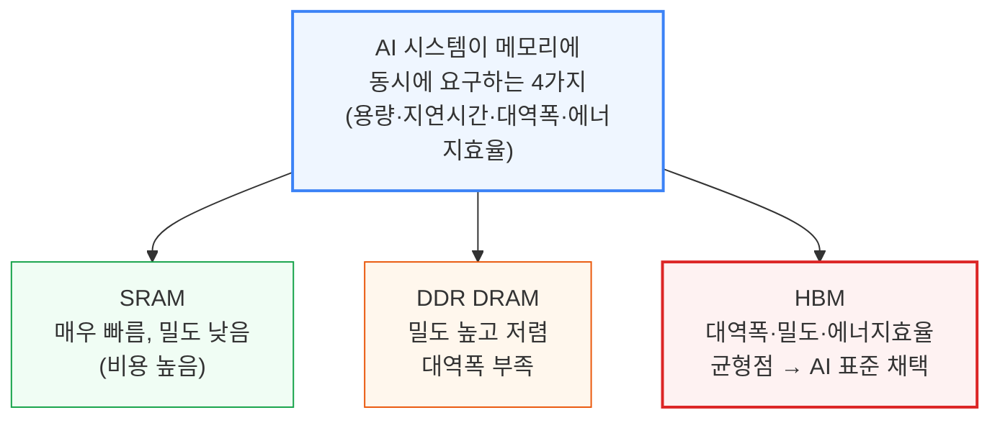

HBM은 DDR5 대비 가격 프리미엄이 훨씬 높은데도 학습·추론용 주요 AI 가속기 전부가 채택할 만큼 수요가 강합니다. 다른 메모리에 의존한 아키텍처는 [성능이 확연히 떨어짐이 이미 확인](https://semianalysis.com/2024/02/21/groq-inference-tokenomics-speed-but/)됐습니다.

가속기 로드맵 전반에서 공통으로 나타나는 흐름은 스택 수를 늘리고, 층수를 높이고, 더 빠른 세대의 HBM을 쓰는 세 가지 방법으로 칩당 메모리 용량·대역폭을 계속 확장하는 것입니다.

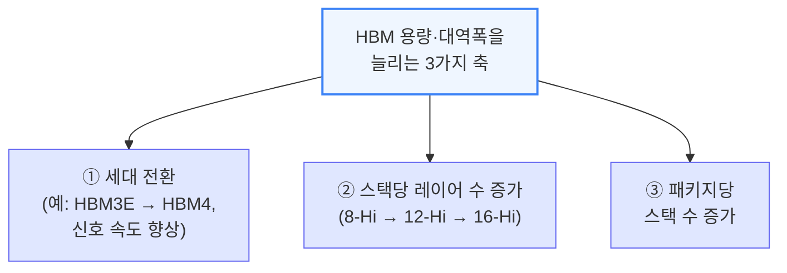

이 리포트는 HBM의 현재 상태, 공급망 이슈, 미래의 획기적 변화를 다루며, 삼성전자의 공급사 생존 가능성과 HBM 용량 증가 추세를 되돌릴 수도 있는 기술 변화까지 짚습니다.

---

## 2. HBM 구조 심화: 배선 밀도와 쉐어라인

**📌 핵심:**
- HBM이 특별한 이유는 DRAM을 3D로 쌓은 것 이상으로, 일반 DRAM보다 **훨씬 넓은 데이터 통로(버스)**를 가졌다는 점 — 통로가 넓을수록 배선(핀) 수가 급증해 HBM3E 스택 하나만 해도 GPU와의 배선이 **1,000개 이상**
- 배선이 너무 촘촘해 일반 회로기판(PCB)에는 얹을 수 없어, 중간에 배선을 정리해주는 **인터포저**를 끼운 2.5D 패키징(CoWoS)이 필수
- HBM은 GPU 가장자리(**쉐어라인**) 중 딱 **2면**에만 붙을 수 있고 나머지 2면은 네트워킹 배선 몫이라 붙일 수 있는 면적이 제한적 → 그래서 용량은 옆이 아니라 **위로 쌓아서** 확보
- 결론: 위로 쌓으려면 층마다 전력·신호를 다음 층까지 전달하는 TSV(관통 전극)를 뚫어야 하는데, 이 통로가 차지하는 면적 때문에 HBM 칩은 같은 용량의 DDR 칩보다 더 큼(SK하이닉스 DDR4가 HBM3보다 단위면적당 용량 85% 더 높음) — 이 TSV 가공 장비가 일반 DRAM 웨이퍼를 HBM 웨이퍼로 "전환"하는 핵심 병목설비

---

HBM은 DRAM을 3D로 쌓은 것 외에, 평범한 신호 속도로도 대역폭을 끌어올리는 **훨씬 넓은 데이터 버스**가 또 다른 핵심 특징입니다 — 이 덕에 패키지당 대역폭에서 다른 어떤 메모리보다 압도적으로 우수합니다.

더 많은 입출력(I/O)을 갖는다는 것은 배선 밀도와 복잡성이 커진다는 뜻입니다. 입출력 하나마다 개별 배선이 필요하고, 전력·제어용 배선도 추가로 필요합니다.

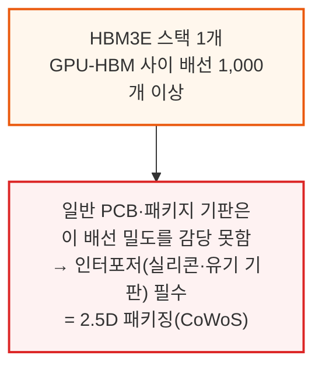

지연시간·에너지 소모를 줄이려면 HBM은 연산 엔진의 **쉐어라인**(칩 가장자리) 바로 옆에 붙어야 하는데, HBM은 SoC의 2면에만 배치할 수 있고 나머지 2면은 패키지 밖 I/O용입니다.

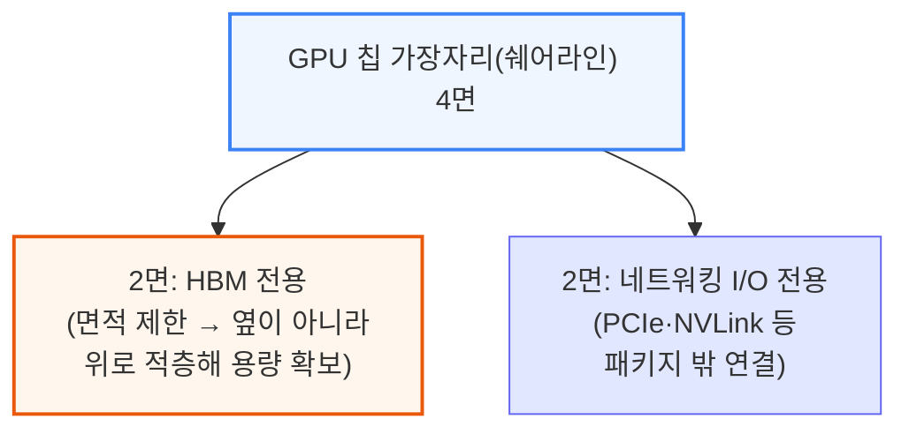

이렇게 면적이 제한되니 충분한 용량을 확보하려면 메모리 다이를 수직으로 쌓아야 합니다. 3DIC 폼팩터를 구현하려면 스택의 각 층(맨 위층 제외)에 다음 층까지 전력과 신호를 전달할 수 있는 TSV가 있어야 합니다.

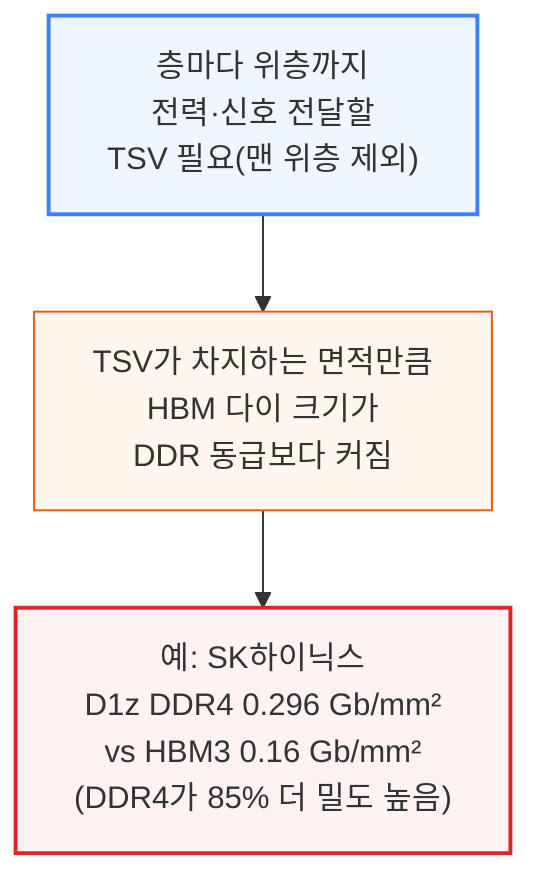

이 TSV 공정이 표준 DRAM과 HBM을 가르는 핵심 차이이자, DDR 웨이퍼를 HBM 웨이퍼로 "전환"할 때의 주된 병목 설비입니다. 후공정에서는 로직 베이스 다이 위에 DRAM을 총 9\~13층까지 쌓는데, CoWoS와 함께 MR-MUF 같은 한때 생소했던 첨단 패키징 기술도 이제는 업계 상식이 됐습니다.

**📌 용어 풀이: 인터포저와 CoWoS**
> - **인터포저**: 칩과 기판 사이에 끼워 넣는 얇은 중간판 — 너무 촘촘해서 기판에 직접 그릴 수 없는 배선을 대신 정리해주는 다리 역할
> - **CoWoS (Chip on Wafer on Substrate)**: TSMC의 2.5D 패키징 기술 — 로직 칩과 HBM을 인터포저 위에 나란히 얹어 하나의 패키지로 묶는 방식
> - **쉬운 비유**: 도로(배선)가 너무 많아 땅(기판)에 다 못 그릴 때, 입체 교차로(인터포저)를 하나 더 놓아 교통을 정리하는 것과 비슷

---

## 3. 폭발하는 HBM 수요와 제조 공정 흐름

**📌 핵심:**
- HBM 비트 수요는 AI 가속기 수요와 함께 폭발적으로 증가 중이며, 커스텀 ASIC이 급성장해도 2027년까지 HBM 수요의 최대 몫은 여전히 **Nvidia**(Rubin Ultra 한 칩만으로 GPU당 용량 1TB까지 확장)가 차지할 전망
- 그 뒤를 TPU·MTIA 물량이 급증하는 **Broadcom**이 잇고, OpenAI·소프트뱅크 프로젝트가 소폭 추가되며, **Amazon**은 설계 파트너를 거치지 않고 HBM을 직접 조달해 원가를 낮추는 전략으로 상위 구매자로 부상
- 일반 DDR 웨이퍼를 HBM 웨이퍼로 "전환"하는 것은 장비를 몇 가지 더 추가하는 문제 — ① TSV(관통 전극) 형성 장비(식각기·증착기·도금기), ② 양면 범프 공정(맨 위층 제외 모든 층에 필요)
- 결론: 그래서 업계는 HBM 생산능력을 아예 **"TSV 생산능력"**이라는 별도 단위로 집계하며, HBM 웨이퍼 공급을 늘리는 진짜 병목은 새 팹이 아니라 이 TSV·범프 전용 장비(식각·증착·도금·그라인더·임시본더 등) 확보 속도

---

AI 가속기 수요와 함께 HBM 비트 수요도 폭발적으로 성장해왔습니다. 커스텀 ASIC이 빠르게 부상해도, 2027년까지 HBM 수요의 최대 비중은 여전히 Nvidia가 차지할 전망입니다.

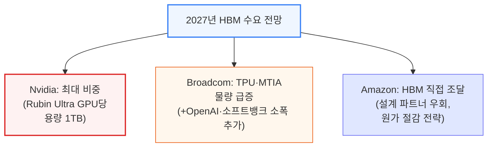

- **참고 자료**: 칩별 상세 비트 수요 전망은 SemiAnalysis **Accelerator Model**에서 확인 가능 — 메모리 공급사별 매출·비트 수요, 웨이퍼 투입량·TSV 생산능력, 세대별 HBM 가격까지 공급사별로 세분화해 추적

DDR 웨이퍼가 HBM 웨이퍼로 "전환"될 때 바뀌는 것은 주로 TSV 형성용 장비 추가와 양면 범프 공정 확대입니다. 다만 맨 위층 웨이퍼는 단면 범프만 필요하고 TSV도 필요 없어 이 두 단계가 생략됩니다.

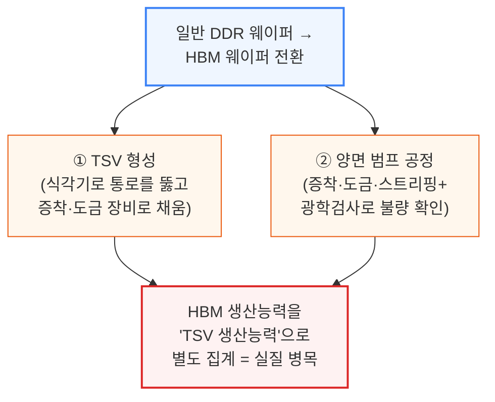

TSV를 만들려면 통로를 뚫는 식각기와 채우는 증착·도금 장비가, 겉으로 드러내려면 그라인더·추가 식각·임시 본더가 필요합니다. 그래서 HBM 생산능력은 "TSV 생산능력"으로 따로 집계됩니다. 범프 공정은 증착·도금·스트리핑이 주이며, Camtek·Onto의 광학 검사 장비로 결함 여부를 확인합니다.

---

## 4. 후공정 패키징 경쟁: MR-MUF vs TC-NCF

**📌 핵심:**
- HBM을 층층이 붙이는 후공정 패키징 방식은 진영이 갈림 — **SK하이닉스는 MR-MUF**, **마이크론·삼성은 TC-NCF**(열압착 본딩+비전도성 필름) 채택
- MR-MUF는 SK하이닉스가 NAMICS와 공동 개발한 몰딩 재료 덕에 마이크론·삼성의 비전도성 필름보다 발열을 더 잘 빼내고, 열압착 본딩(TCB)을 건너뛰어도 되는 뒤틀림(휘어짐) 관리 기법을 확보
- TCB는 힘을 가해 접합부를 눌러 고정하는 방식이라 범프 손상 위험이 있는데, SK하이닉스는 오히려 그 압력을 역이용해 더미 범프를 추가로 넣어 발열 방출을 개선
- 결론: 생산성에서도 MR-MUF가 앞섬 — 여러 층을 한 번에 붙이는 배치 리플로우+단일 오버몰드로 끝나는 반면, TC-NCF는 층마다 완전한 열압착 단계를 반복해야 해서 시간이 더 걸림

---

HBM 적층에서 SK하이닉스는 자사가 오랫동안 밀어온 MR-MUF 방식을 계속 발전시키고 있습니다. MR-MUF는 생산성이 높고 발열 처리 성능이 우수하다는 것이 핵심 장점입니다.

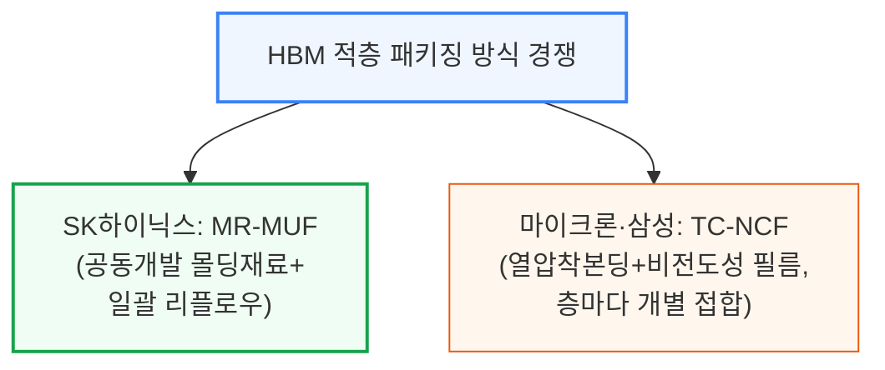

SK하이닉스의 독자 개발(NAMICS와 공동개발) 몰딩 언더필 재료는 경쟁사의 비전도성 필름보다 열을 더 잘 빼내고, 다른 방식의 휘어짐 관리 기법 덕에 열압착 본딩(TCB)도 건너뜁니다.

TCB는 힘을 가해 접합 물질을 안정화하지만 그 힘이 범프 손상 위험을 키우는데, SK하이닉스는 이 스트레스를 역이용해 더미 범프를 더 넣어 발열 방출까지 개선합니다.

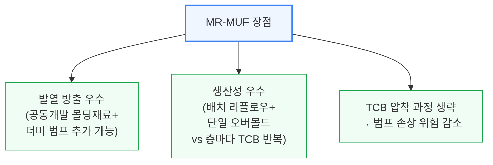

공정 생산성 차이도 뚜렷합니다: MR-MUF는 여러 층을 한 번에 붙이는 배치 리플로우와 단일 오버몰드 단계로 접합을 끝내지만, TC-NCF는 층마다 완전한 열압착 단계를 반복해야 합니다.

---

## 5. 수율의 진실: 전력배선망과 적층 수율

**📌 핵심:**
- HBM은 3DIC 적층 특성상 후공정(패키징) 수율이 기존 DRAM과 비교가 안 될 정도로 낮지만, 실제로는 **전공정(칩 자체) 수율**이 더 큰 문제 — 원인은 TSV로 전력을 위층까지 끌어올리는 **전력배선망(PDN)** 설계
- SK하이닉스는 HBM3E에서 전력용 TSV를 기존 2개 뱅크 구조에서 다이 전체를 둘러싸는 방식으로 바꿔 TSV 수를 **약 6배** 늘렸고, 그 결과 전압강하(IR Drop)를 최대 **75%** 낮춤 — 마이크론도 TSV·PDN 설계에 집중해 전력소비 30% 절감을 주장(미검증)하며 표준 HBM3도 건너뛰고 단숨에 추격
- HBM은 3DIC 특성상 발열도 문제 — DRAM은 열에 특히 취약한데, 실제 하이퍼스케일러 데이터에 따르면 **HBM 고장이 GPU 고장의 1위 원인**(다른 칩보다 훨씬 빈번하게 발생)
- 결론: 절대 수율은 3사 모두 기존 DRAM 대비 낮지만, SK하이닉스·마이크론은 높은 판매가로 수율 손실을 벌충해 오히려 마진에 도움이 되는 반면, 삼성은 수율이 훨씬 나빠 전체 DRAM 웨이퍼 공급까지 조여 가격을 오히려 밀어올리는 역설적 상황

---

HBM은 고난도 3DIC 적층 제품이라 패키징 수율이 기존 DRAM과 비교가 안 되지만, 더 큰 문제는 전공정 수율 쪽입니다. 원인은 TSV로 전력을 위층까지 실어나르는 **전력배선망(PDN)** 설계 — TSV 배치는 제조사별 핵심 차별화 지점입니다.

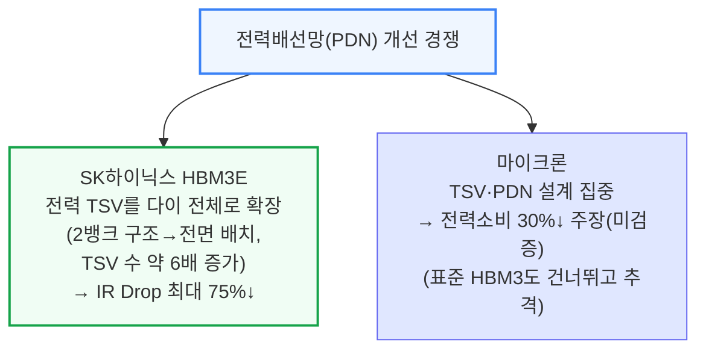

**📌 용어 풀이: 전력배선망(PDN)과 IR Drop**
> - **PDN (Power Distribution Network)**: 칩 전체에 전력을 고르게 공급하는 배선망 — HBM에서는 TSV를 통해 위층까지 전력을 실어날라야 함
> - **IR Drop (전압강하)**: 전력이 배선을 타고 이동하며 저항 때문에 점점 줄어드는 현상 — 낮을수록 위층까지 전력이 안정적으로 도달
> - **쉬운 비유**: 건물 1층에서 전기를 끌어올릴 때 배선이 가늘면 꼭대기 층에 도착할 즈음 전압이 뚝 떨어지는 것과 비슷 — PDN 설계가 좋을수록 이 낙폭이 작음

약속된 속도를 전력·발열 한도 안에서 내는 것도 과제입니다. 3DIC 적층 특성상 발열 방출이 어렵고 DRAM은 특히 열에 취약한데, 하이퍼스케일러 데이터에 따르면 HBM 고장은 데이터센터 내 GPU 고장의 1위 원인이며 다른 칩보다 훨씬 자주 발생합니다.

모든 제조사의 절대 수율은 기존 DRAM 웨이퍼 대비 훨씬 낮지만, 관건은 상대적 수율과 최종 경제성입니다.

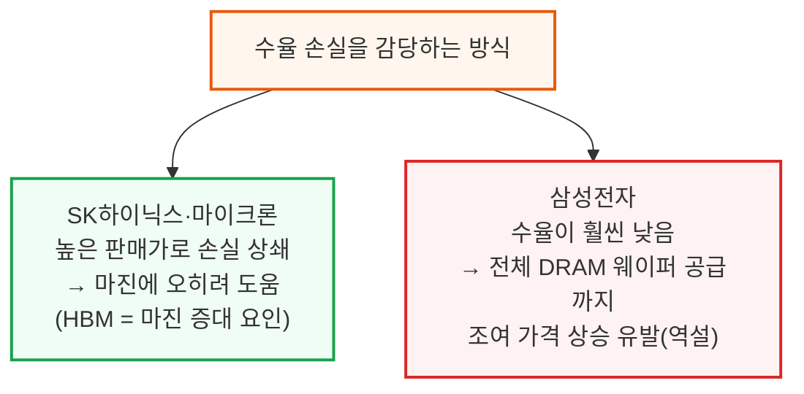

층수가 늘어날수록 수율 확보는 더 어려워집니다. 층 하나의 접합 수율이 x%라면, 전체 스택 수율은 대략 x%의 (총 층수-1)제곱으로 누적됩니다.

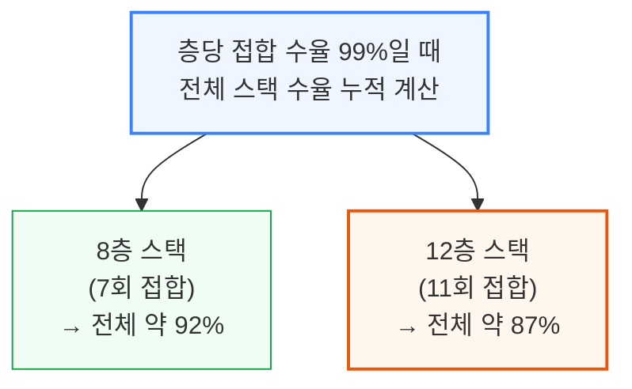

물론 이는 단순화한 계산이며, 실제로는 층수가 늘어날수록 사소한 결함(예: 몇 개 층의 미세한 비평탄도)이 누적되어 상위 층에서는 받아들일 수 없는 수준의 결함으로 커지기 때문에 수율은 이 계산보다 더 나빠집니다.

---

## 6. 본딩 장비 전쟁: SK하이닉스와 한미반도체 갈등

**📌 핵심:**
- 본딩(다이 접합) 공정은 수율을 좌우하는 핵심 단계 — TSV 간격이 약 40마이크로미터라 본더는 서브마이크론급 정렬 정밀도가 필요한데, **한미반도체**가 시장 리더(Besi·ASMPT)가 외면하던 열압착(TC) 본더 시장에 일찍 베팅해 **사실상 독점** 지위를 확보
- SK하이닉스 내 한미반도체 점유율은 작년 가을까지 **100%**였는데, SK하이닉스가 경쟁사 한화(Hanwha) 장비를 대량 발주(그것도 한미보다 더 비싼 가격)하면서 갈등이 폭발
- 한미반도체는 4월 초 SK하이닉스 팹에서 **현장 서비스 인력을 철수**시키는 초강수를 뒀고, 한화 장비는 아직 미납품·기존 ASMPT 본더는 SK하이닉스 HBM3E 12-hi에 작동 안 해 SK하이닉스가 몇 주\~몇 달 안에 대표 제품 출하가 막힐 위기, 장기적으로는 마이크론·삼성도 그 생산 공백을 빠르게 메울 수 없어 전체 가속기 공급망까지 위협받는 상황
- 결론: 결국 SK하이닉스가 최근 한미반도체에 소규모 주문(대량 물량이라기보단 달래기용)을 넣어 현장 서비스를 복구시켰지만, ASMPT·Besi 등 경쟁사들이 HBM 전용 TC 본더 개선에 속도를 내고 있어 한미반도체의 독점적 지위가 오래갈지는 불확실

---

본딩(다이 접합)은 수율을 좌우하는 핵심 단계입니다. TSV 간격이 약 40마이크로미터라 본더는 서브마이크론급 정렬 정밀도가 필요하고, 뒤틀림 누적을 막을 균일한 압력 분배와 원가를 좌우하는 처리량도 중요합니다.

한미반도체는 당시 시장 리더인 Besi·ASMPT가 외면하던 HBM용 열압착(TC) 본더 시장에 일찍 베팅했고, 이 선택이 현재 HBM 공정에서 사실상 독점 지위로 이어졌습니다.

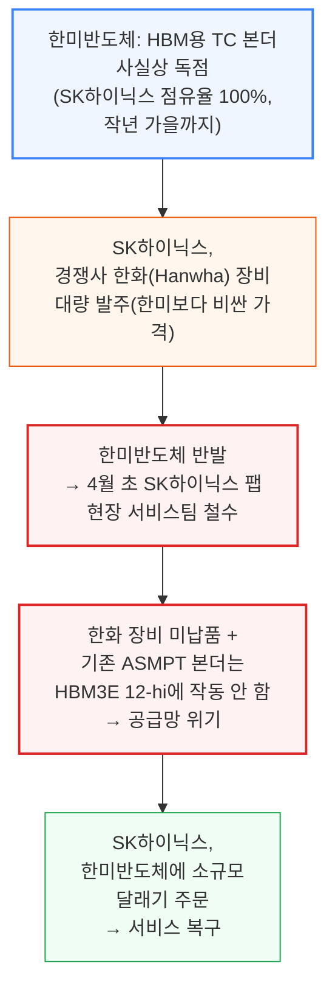

한화가 SK하이닉스 공정 인증조차 안 받았는데 더 비싼 가격에 물량을 따내자, 한미반도체의 반발은 자연스러운 수순이었습니다. 서비스 중단으로 SK하이닉스는 출하 위기, 마이크론·삼성도 공백을 단기간에 메울 수 없어 공급망 전체가 흔들릴 뻔했습니다.

결국 SK하이닉스가 소규모 달래기 주문으로 서비스를 복구시켰지만, ASMPT·Besi가 HBM 전용 TC 본더 개선에 속도를 내고 있어 한미반도체의 독점적 지위가 오래갈지는 불확실합니다.

---

## 7. 중국의 HBM 자립: CXMT와 화웨이

**📌 핵심:**
- 수출 규제는 HBM 원판(스택) 자체의 중국 반입은 금지하지만, FLOPS 규제만 넘지 않으면 HBM이 내장된 완제품 칩은 여전히 반입 가능 — 실제로는 CoAsia Electronics·Faraday·SPIL을 거치는 유통망을 통해 GPU 패키지에서 HBM을 다시 떼어내 재활용하는 우회 유통까지 벌어짐
- 중국은 향후 5년간 자국 반도체에 **2,000억 달러** 보조금을 계획했고 상당 부분이 HBM으로 향할 전망 — DRAM 국가대표 **CXMT**는 수출 규제(2024년 12월 미국, 최근 한국도 강화) 대비용 장비 재고를 대량 확보하며 HBM 생산능력을 공격적으로 확장
- CXMT의 HBM2 8-high는 **2025년 상반기 양산 진입**, 연말까지 TSV 생산능력을 마이크론 수준까지 맞출 계획
- 결론: 화웨이도 자체 HBM 라인(웨이퍼는 XMC, 패키징은 SJSemi)을 갖췄지만 아직 R&D 규모일 뿐 양산 단계는 아니며, 두 회사 모두 미국 규제 대상(Entity List)에 올라 미국산 장비 구매가 제한돼 있음(GlobalFoundries가 무허가로 SJSemi에 1,700만 달러 넘게 판매했다가 경고받은 사례도 있음)

---

수출 규제로 HBM 원판(스택) 자체는 중국에 못 들어가지만, FLOPS 규제 상한만 넘지 않으면 HBM이 내장된 완제품 칩은 반입할 수 있습니다.

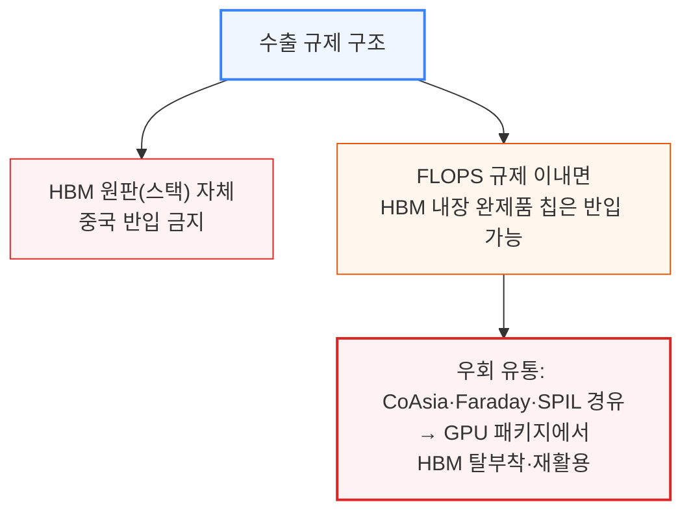

HBM이 가속기의 핵심 재료인 데다 수출 규제가 공급을 끊겠다고 위협하는 만큼, 중국은 자연스럽게 자국 개발에 자원을 쏟아붓고 있습니다.

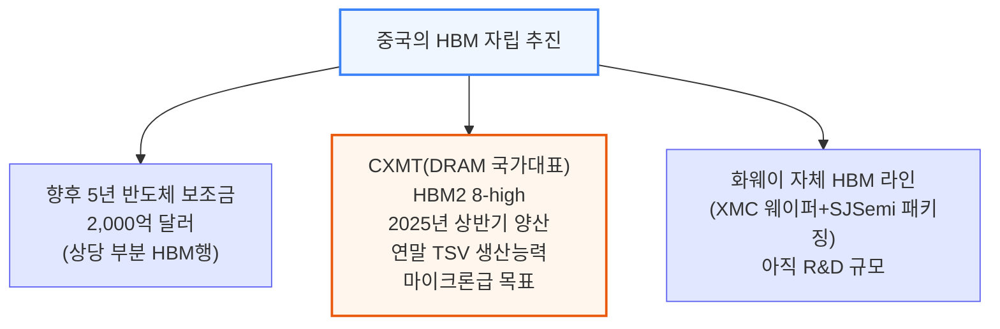

CXMT는 수출 규제 강화(2024년 12월 미국, 최근 한국도 동참)에 대비해 장비 재고를 대량으로 쌓아두고 있습니다. 화웨이 진영의 XMC·SJSemi는 둘 다 미국 Entity List에 올라 있어 미국산 장비 구매가 제한됩니다.

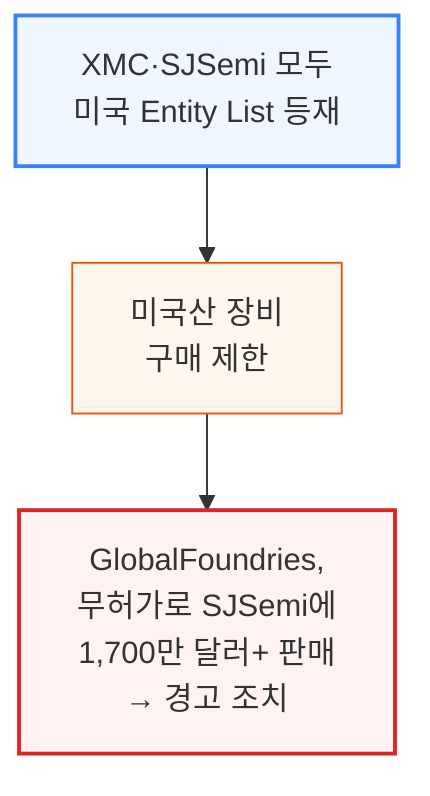

---

## 8. 스택 높이 경쟁: 하이브리드 본딩을 할 것인가

**📌 핵심:**
- HBM 스택은 지금까지 **720마이크로미터** 높이(JEDEC 표준) 안에 층을 욱여넣어 왔는데, 층을 더 넣으려고 다이를 더 얇게 깎고 범프 간격도 더 얇게 만들수록 다루기 어려워져 휘어짐·파손 위험이 커지고 수율이 나빠짐
- 대안인 **하이브리드 본딩**은 범프 자체를 없애 그 공간을 층수 확보에 쓸 수 있지만, HBM은 하이브리드 본딩이 주는 초고밀도 배선이 굳이 필요 없어 "수율·비용 부담 대비 득이 되는가"라는 의문이 계속 제기됨 — SK하이닉스·마이크론은 최근 언급을 줄인 반면 **삼성전자만 가장 목소리를 높이는** 전형적 패턴(추격을 위한 공격적 홍보 → 실행에서 기대에 못 미침)
- 결국 12-hi에서 한계에 부딪힌 업계는 범프 없는 방식 대신 **스택을 더 두껍게** 만드는 쪽을 택함 — JEDEC이 스택 높이 규격을 720마이크로미터에서 **775마이크로미터**로 완화(하이브리드 본딩 도입에는 오히려 악재)
- 결론: 775마이크로미터는 실리콘 웨이퍼 표준 두께라 이보다 더 높이려면 로직 웨이퍼까지 두껍게 만들어야 하는데 현재 장비가 이를 지원하지 않아, **16층이 사실상의 실용적 상한**이 될 가능성 — 20층 이상으로 가려면 범프 간격을 더 줄이거나 웨이퍼를 더 얇게 깎아야 함

---

층을 더 쌓을수록 용량은 늘지만, 지금까지는 720마이크로미터 높이 규격(JEDEC 표준) 안에서 이를 구현해야 했습니다.

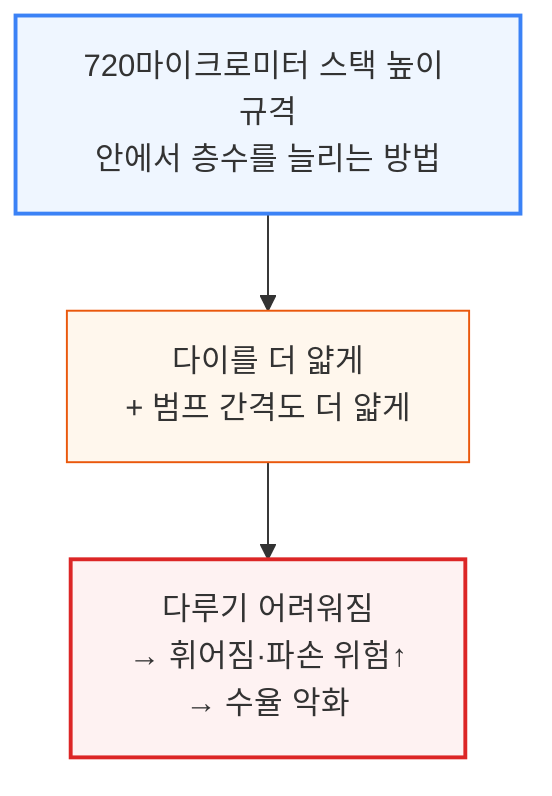

HBM3·HBM3E가 12-hi까지 올라오면서 범프 기반 접합 방식은 720마이크로미터 한도 안에서 한계에 가까워졌습니다. 더 높이 쌓는 방법은 두 가지뿐입니다.

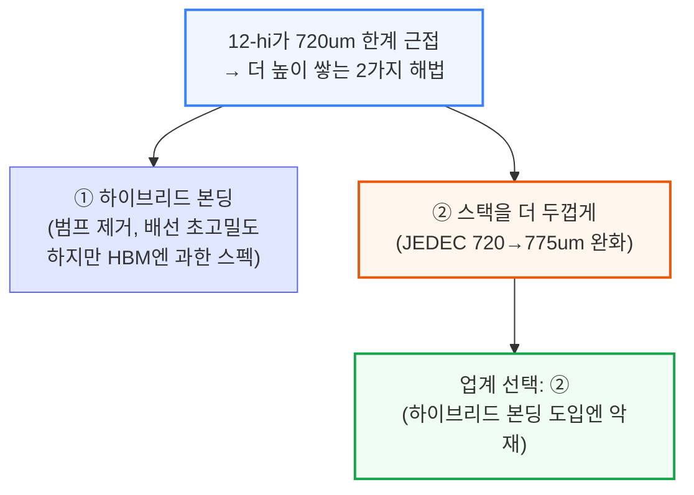

공급사별 태도도 갈립니다.

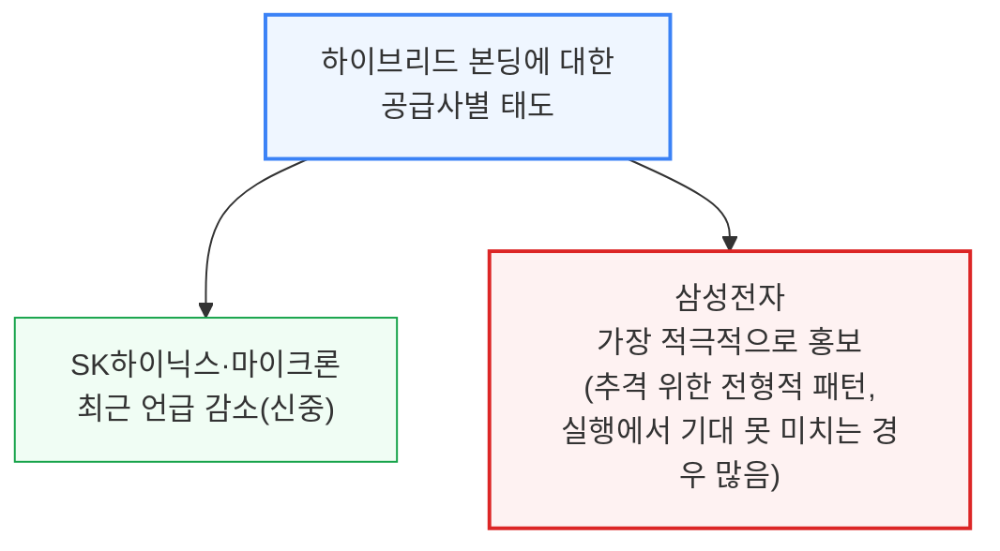

775마이크로미터도 결국 한계에 부딪힙니다 — 이는 실리콘 웨이퍼의 표준 두께라, 이보다 더 높이려면 짝을 이루는 로직 웨이퍼까지 두껍게 만들어야 하는데 현재 장비가 이를 지원하지 않습니다.

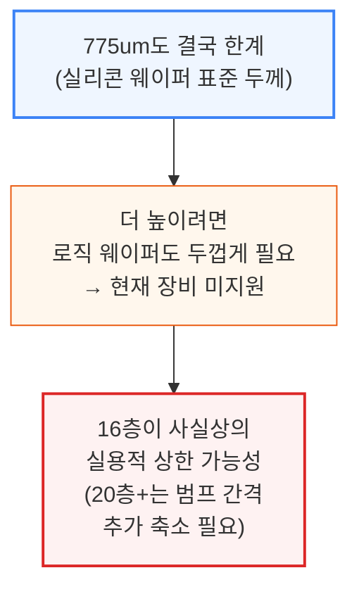

---

## 9. AI 가속기가 메모리에 요구하는 것

**📌 핵심:**
- AI 가속기는 연산의 복잡성을 낮추는 대신 초당 처리량을 극대화하도록 설계됨(CPU는 반대로 복잡한 명령 처리에 최적화, 그만큼 처리량은 낮음) — 그래서 AI 가속기는 메모리·네트워크로의 칩 밖 대역폭이 절대적으로 많이 필요
- 용량·대역폭은 3가지 축(세대 전환·레이어 수·스택 수)으로 함께 확장되는데, Nvidia 로드맵에서 HBM 용량은 A100의 **80GB**(HBM2E)에서 Rubin Ultra의 **1,024GB**(HBM4E)까지 커짐 — Ampere→Blackwell Ultra 구간 설비 구성비(BoM) 증가분 중 절대·상대 기준 모두 **HBM 콘텐츠 증가**가 최대이며 그 수혜는 주로 SK하이닉스가 가져감
- 흥미로운 역설: **"메모리-파킨슨 법칙"** — HBM 용량·대역폭이 세대마다 커져도, 모델 설계자들이 곧바로 파라미터 수·컨텍스트 길이·KV캐시를 늘려 그 여유를 다 써버림(H100의 80GB/3TB\/s → GB200의 192GB/8TB\/s로 늘어나도 여유는 오래가지 않음)
- 결론: 활성화 체크포인팅·옵티마이저 오프로딩·양자화 같은 메모리 절약 기법도 여유가 생기면 완화됐다가 벽에 부딪히면 재동원되는 패턴이 반복 — HBM이 커져도 지속적인 여유는 생기지 않고 "적정 모델 크기"의 기준선만 계속 올라가며 메모리는 항상 다음 병목으로 남음

---

AI 가속기를 정의하는 핵심 특징은 고도의 병렬화와 처리량 최적화입니다. 곱셈·덧셈 연산(GEMM)에 집중해 초당 연산 횟수를 극대화하는 대신 연산 하나하나의 복잡성은 희생합니다.

```mermaid
flowchart TD
    Design["AI 가속기 vs CPU<br/>설계 철학 차이"] --> XPU["AI 가속기<br/>복잡성↓·처리량↑<br/>(GEMM 연산 특화)"]
    Design --> CPU["CPU<br/>'똑똑함'↑·처리량↓<br/>(복잡한 명령 다양하게 처리)"]
    XPU --> Need["결과: AI 가속기는<br/>메모리·네트워크의<br/>칩 밖 대역폭이 절대적으로 필요"]

    style Design fill:#eff6ff,stroke:#3b82f6,stroke-width:2px
    style XPU fill:#fff7ed,stroke:#ea580c,stroke-width:2px
    style CPU fill:#e0e7ff,stroke:#6366f1
    style Need fill:#fef2f2,stroke:#dc2626,stroke-width:2px
```

메모리 용량·대역폭 확장이 얼마나 빠른지는 Nvidia 로드맵에서 뚜렷이 보입니다.

```mermaid
flowchart TD
    Roadmap["Nvidia 로드맵상<br/>HBM 용량 증가"] --> A100["A100: 80GB(HBM2E)"]
    Roadmap --> Rubin["Rubin Ultra: 1,024GB(HBM4E)"]
    A100 --> BomNote["Ampere→Blackwell Ultra 구간<br/>BoM 증가분 중 HBM 콘텐츠가<br/>절대·상대 기준 모두 최대<br/>(주 수혜자: SK하이닉스)"]
    Rubin --> BomNote

    style Roadmap fill:#eff6ff,stroke:#3b82f6,stroke-width:2px
    style A100 fill:#e0e7ff,stroke:#6366f1
    style Rubin fill:#fff7ed,stroke:#ea580c,stroke-width:2px
    style BomNote fill:#f0fdf4,stroke:#16a34a,stroke-width:2px
```

한 메모리 일관성 도메인 안에서 GPU를 더 많이 묶을수록 총 메모리 용량·대역폭이 늘어 더 큰 모델과 더 긴 컨텍스트 길이를 지원할 수 있습니다. 다만 여기엔 "메모리-파킨슨 법칙"이라 부를 만한 역설이 있습니다.

```mermaid
flowchart TD
    Parkinson["메모리-파킨슨 법칙:<br/>HBM이 커지는 만큼<br/>모델도 커져서 채움"] --> Example["H100 80GB/3TB/s →<br/>GB200 192GB/8TB/s<br/>여유는 금방 소진"]
    Example --> Tricks["절약기법(체크포인팅·<br/>옵티마이저 오프로딩·양자화)도<br/>여유 생기면 완화,<br/>벽 부딪히면 재동원"]
    Tricks --> Result["결론: HBM이 커져도<br/>지속적 여유 없음<br/>→ 메모리는 항상 다음 병목"]

    style Parkinson fill:#eff6ff,stroke:#3b82f6,stroke-width:2px
    style Example fill:#fff7ed,stroke:#ea580c
    style Tricks fill:#e0e7ff,stroke:#6366f1
    style Result fill:#fef2f2,stroke:#dc2626,stroke-width:2px
```

---

*작성 진행률: 약 50% 완료*
*업데이트: 7\~9장(중국의 HBM 자립, 스택 높이 경쟁, AI 가속기의 메모리 요구) 작성 완료*

