# EDA Market Primer - Market Dynamics, Cadence, Synopsys, Siemens, China EDA Rise

> **출처**: [SemiAnalysis Newsletter](https://newsletter.semianalysis.com/p/eda-market-primer)
> **저자**: Sravan Kundojjala, Dylan Patel, Gerald Wong
> **발행일**: 2026-02-05

---

## 📑 목차

### 전체 섹션
 1. [서론 - EDA가 존재하는 이유](#1-서론---eda가-존재하는-이유)
 2. [EDA를 사는 사람들 - 7대 고객군](#2-eda를-사는-사람들---7대-고객군)
 3. [RTL에서 실리콘까지 - 설계 파이프라인과 매출 성장 동력](#3-rtl에서-실리콘까지---설계-파이프라인과-매출-성장-동력)
 4. [EDA 시장 규모와 구조](#4-eda-시장-규모와-구조)
 5. [라이선스 모델 - 좌석, 토큰, ELA](#5-라이선스-모델---좌석-토큰-ela)
 6. [하드웨어 라이선스, 지역별 가격, M&A가 미치는 영향](#6-하드웨어-라이선스-지역별-가격-ma가-미치는-영향)
 7. [시놉시스 - 350억 달러 플랫폼 베팅](#7-시놉시스---350억-달러-플랫폼-베팅)
 8. [케이던스 - 벼랑 끝에서 최고 마진으로](#8-케이던스---벼랑-끝에서-최고-마진으로)
 9. [지멘스 EDA - 봉쇄 지위](#9-지멘스-eda---봉쇄-지위)
10. [경쟁 구도 - 2026년 케이던스의 추격](#10-경쟁-구도---2026년-케이던스의-추격)
11. [경쟁 해자 - 락인 구조와 PDK 모트](#11-경쟁-해자---락인-구조와-pdk-모트)
12. [칩 설계 비용과 재무 프로필](#12-칩-설계-비용과-재무-프로필)
13. [IP 사업과 중국 EDA](#13-ip-사업과-중국-eda)
14. [고객 락인 매트릭스와 향후 5대 변수](#14-고객-락인-매트릭스와-향후-5대-변수)
15. [파괴 리스크와 투자 관점 - 결론](#15-파괴-리스크와-투자-관점---결론)

---

## 🔑 용어 정리

본문을 순서대로 읽기 전에 알아두면 좋은 용어들입니다. 자세한 수치와 설명은 본문에서 처음 등장하는 위치에 나옵니다.

- **EDA (Electronic Design Automation, 전자설계자동화)**: 엔지니어가 작성한 회로 설계도를 실제 제조 가능한 칩 레이아웃으로 자동 변환해주는 소프트웨어 — 이 툴 없이는 현대 칩을 설계할 수 없음
- **RTL (Register Transfer Level)**: 엔지니어가 칩이 어떻게 동작해야 하는지를 코드로 적는 설계 언어 수준 — 이 코드가 EDA 툴을 거쳐 실제 트랜지스터 배치로 변환됨
- **PPA (Performance, Power, Area, 성능·전력·면적)**: 모든 칩 설계가 맞닥뜨리는 3중 트레이드오프 — 빠르게 돌리면서 전력을 덜 쓰고 면적도 작게 만드는 균형점을 찾는 작업
- **ELA (Enterprise License Agreement, 전사 라이선스 계약)**: 개별 툴을 하나씩 사는 게 아니라, 여러 툴을 묶어 몇 년 단위로 계약하는 대형 고객 전용 방식
- **토큰 라이선스**: 엔지니어 1명당 1개 좌석을 사는 방식이 아니라, 회사 전체가 쓸 컴퓨트 사용량을 미리 사두고 여러 엔지니어가 풀(pool)에서 나눠 쓰는 과금 방식
- **PDK (Process Design Kit, 공정설계키트)**: 파운드리의 제조 공정과 EDA 툴을 잇는 "번역기" 역할의 데이터 묶음 — 이게 없으면 설계도를 실제 웨이퍼로 만들 수 없음
- **R-squared (결정계수, 락인 지수)**: 한 고객사의 R&D 지출 증가가 EDA 매출 증가를 얼마나 정확히 예측하는지 보여주는 통계 상관도 — 1에 가까울수록 그 고객의 EDA 의존(락인)이 강하다는 뜻
- **COT (Customer-Owned Tooling, 고객 직접 보유 툴)**: 고객사가 EDA 라이선스를 자기 이름으로 직접 보유하고 설계를 스스로 통제하는 방식 — 반대는 벤더나 위탁 설계업체가 라이선스를 대신 들고 있는 방식

---

## 1. 서론 - EDA가 존재하는 이유

**📌 핵심:**
- 지구상 모든 첨단 칩은 시놉시스(Synopsys)·케이던스(Cadence)·지멘스 EDA(Siemens EDA), 단 3개 회사의 소프트웨어로 설계됨 — 이 Big-3가 합산 점유율 85%를 넘고, 10년 넘게 매년 매출이 성장한 업종
- 2025년 기준 매출은 시놉시스 80억 달러(Ansys 포함)·케이던스 53억 달러·지멘스 EDA 추정 22\~25억 달러로, Big-3 합산 약 160억 달러 — 소형 벤더와 중국 EDA까지 더한 전체 EDA+IP 시장은 180억 달러
- EDA 매출은 연 13% 성장하는데 반도체 R&D는 연 7% 성장 — 이 6%p 격차는 2018년 이후 벌어졌고, 하이퍼스케일러 AI 칩 개발과 에뮬레이션 하드웨어, 첨단 공정 검증 비용 급증이 원인
- 결론: EDA는 반도체 R&D 예산의 9\~12%(IP 포함 시 12\~15%)에 불과한 작은 조각이지만, 대체 불가능한 유일한 투입재라서 가격 결정력이 업계 전체를 압도

---

### Big-3 매출 지도 - 160억 달러 과점

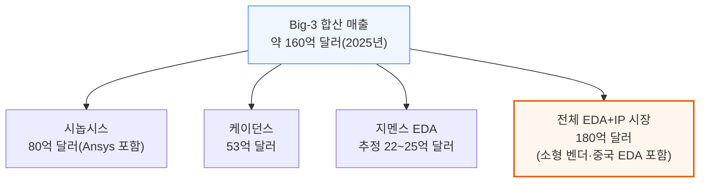

### EDA가 반도체 R&D보다 2배 가까이 빨리 크는 이유

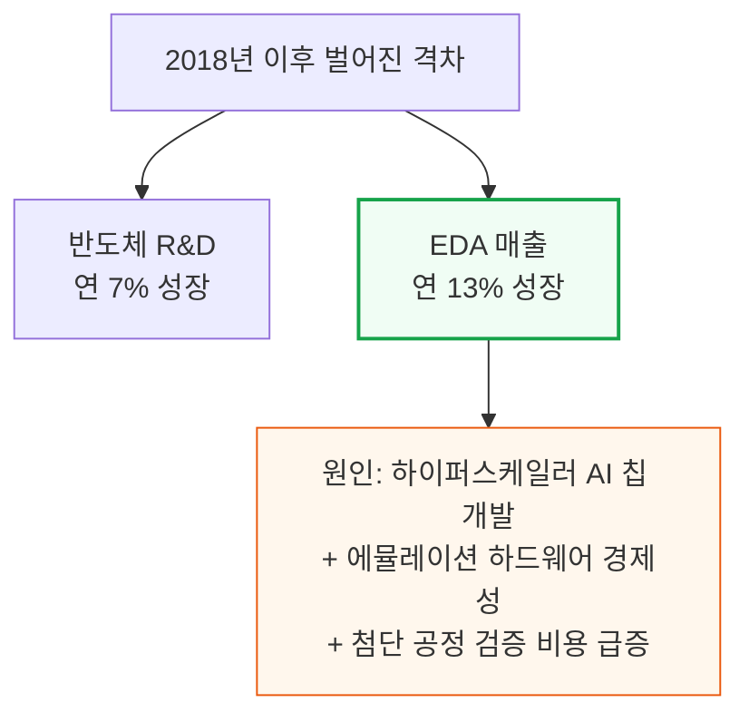

시놉시스 CEO 사신 가지(Sassine Ghazi)는 2025년 초, 반도체 R&D 집약도가 매출 대비 약 6%에서 9%로 높아지고 있다고 언급했습니다. AI 워크로드의 복잡성이 원인입니다.
EDA 벤더는 이 흐름에서 이중으로 수혜를 봅니다 — ① 그들이 파는 R&D 예산 자체가 커지고 ② 검증 강도·AI 툴 프리미엄·공정 전환 가격 정책으로 그 예산에서 차지하는 몫도 함께 커지기 때문입니다.

### EDA가 존재하는 이유 - 4가지 핵심 기능

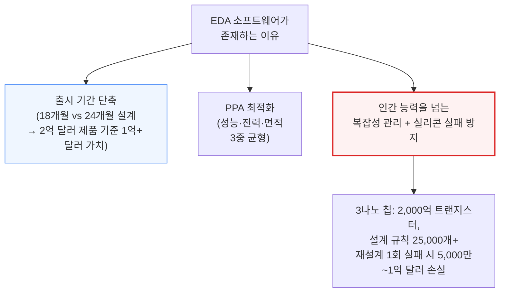

📌 용어 풀이: 왜 EDA 없이는 첨단 칩을 설계할 수 없나
> - 현대 플래그십 칩은 500억\~2,000억 개 트랜지스터를 담고 있고, 3나노 공정에서는 파운드리가 요구하는 설계 규칙만 25,000개가 넘음 — 이 정도 규모는 사람이 수작업으로 검토할 수 있는 범위를 완전히 벗어남(65나노 이후로 수작업 설계는 사실상 불가능해짐)
> - 검증해야 할 공정-전압-온도(PVT) 조합도 28나노에서 5\~7개였던 것이 3나노에서는 20\~30개 이상으로 늘어남 — EDA의 자동 최적화가 유일한 실현 경로

---

## 2. EDA를 사는 사람들 - 7대 고객군

**📌 핵심:**
- 약 180억 달러 EDA+IP 시장을 떠받치는 고객은 7개 유형 — 팹리스 설계사(엔지니어당 연 8\~15만 달러 지출)가 전통적으로 최대 그룹이지만, 이제는 시스템 기업(구글·아마존·MS·메타 등)이 EDA 수요의 45%를 차지하며 가장 빠르게 크는 그룹으로 부상
- 애플은 M시리즈·A시리즈·모뎀 프로그램에 8,000명 이상의 칩 설계 엔지니어를 고용 중이고, 테슬라도 FSD·Dojo 칩을 자체 설계 — 자동차 OEM·1차 협력사(콘티넨탈·보쉬·덴소)까지 처음으로 칩 설계에 뛰어드는 중
- 위탁 ASIC 설계사(브로드컴 ASIC 그룹, 마벨 커스텀 실리콘, Alchip, GUC)는 고객사당 EDA 지출이 가장 큰 그룹 — 브로드컴 ASIC 그룹 한 곳만 연간 2\~5억 달러를 EDA 툴·IP·에뮬레이션 하드웨어에 지출하는 것으로 추정
- 결론: 시스템 기업의 부상이 중요한 이유는 이들의 지출이 기존 반도체 R&D 예산에 얹히는 "순증분"이기 때문 — 전통 팹리스 시장이 정체돼도 EDA 매출은 계속 클 수 있는 구조

---

### 7대 고객군 - 팹리스부터 IP 기업까지

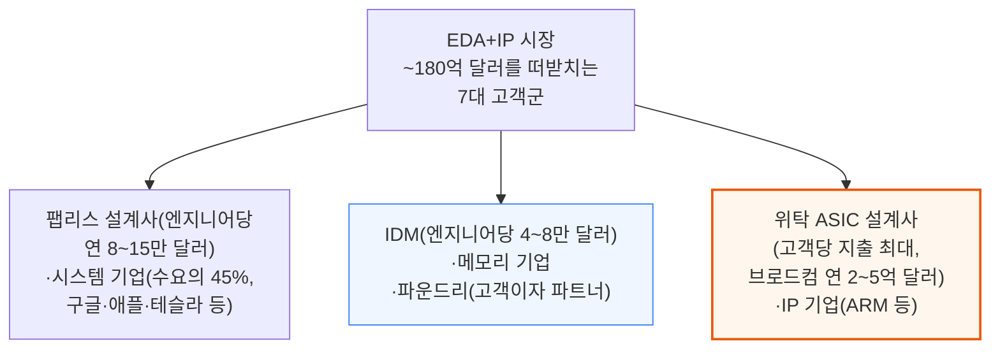

📌 용어 풀이: 시스템 기업 수요가 왜 "순증분"인가
> - 하이퍼스케일러·자동차 OEM 등은 지난 10년 안에 처음 EDA 고객이 된 회사들 — 이들이 없었다면 존재하지 않았을 지출이라, 전통 반도체 R&D 예산이 정체돼도 EDA 시장 전체는 계속 성장할 수 있음
> - 애플 8,000명+ 칩 엔지니어, 테슬라 FSD·Dojo 자체 설계, 자동차 OEM·1차 협력사의 신규 진입이 대표 사례

파운드리(TSMC·삼성 파운드리·인텔 파운드리·글로벌파운드리·라피더스)는 고객이자 파트너이기도 합니다. EDA 벤더와 양산 24개월 전부터 PDK(공정설계키트)를 공동 개발하고, 테이프아웃(설계 확정) 시 고객이 반드시 써야 할 툴까지 지정해 생태계 전체에 특정 서명(signoff) 소프트웨어를 사실상 강제합니다.

---

## 3. RTL에서 실리콘까지 - 설계 파이프라인과 매출 성장 동력

**📌 핵심:**
- 칩 설계는 RTL 코드 작성 → 합성(시놉시스 Design Compiler, 점유율 84\~85%) → 배치·배선(P&R) → 서명(signoff) 검증(시놉시스 PrimeTime 90%+) → 물리 검증(지멘스 Calibre 85%+) → 테이프아웃 순으로 이어지는 순차 파이프라인 — 7/5/3나노 기준 12\~24개월 소요
- 검증(verification)이 설계 시간·예산의 60\~70%를 차지하며 연 15%+씩 성장 — 하드웨어 에뮬레이션만으로도 15억 달러+ 시장이고, PCIe Gen6·HBM4·UCIe 등 신규 프로토콜이 나올 때마다 검증 대상이 계속 늘어남
- EDA 매출 성장을 반도체 R&D 성장보다 끌어올리는 구조적 동력은 4가지 — ① 공정 전환(3나노 툴이 28나노 툴보다 3\~5배 비쌈) ② 검증 강도 증가 ③ AI 가속기 확산(하이퍼스케일러 커스텀 실리콘이 5년 전 거의 없던 150\~200억 달러 규모 신규 수요 창출) ④ 락인에서 나오는 가격 결정력(고객 유지율 95%+ · 연 3\~7% 계약상 인상)
- 결론: 한 툴을 바꾸면 그 뒤 모든 단계(배치·배선·서명·물리 검증)를 다시 돌려야 함 — 개별 툴의 우수성보다 이 순차적 종속 관계 자체가 락인의 본질

---

### 설계 파이프라인 - RTL부터 테이프아웃까지, 한 단계 바꾸면 전부 다시

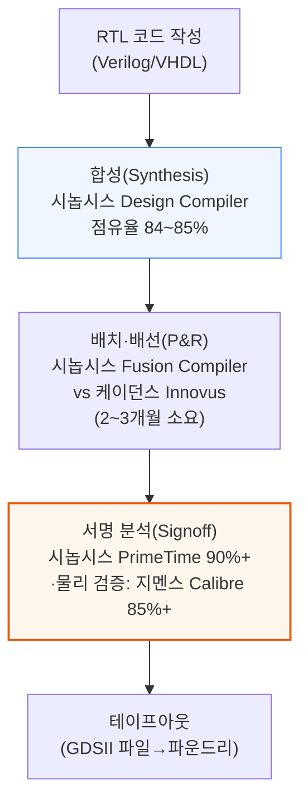

📌 용어 풀이: 왜 "플로우 자체가 락인"인가
> - 합성 툴을 바꾸면 배치·배선, 서명 검증, 물리 검증을 전부 다시 돌려야 함 — 개별 툴 하나의 성능 차이보다, 이 순차 종속 관계를 끊는 비용이 훨씬 크다는 게 핵심
> - 7/5/3나노 기준 전체 파이프라인은 12\~24개월 소요, 그중 검증 단계가 8\~15개월(65%)로 가장 김

### 설계 시간 배분 - 검증이 65%를 먹는다

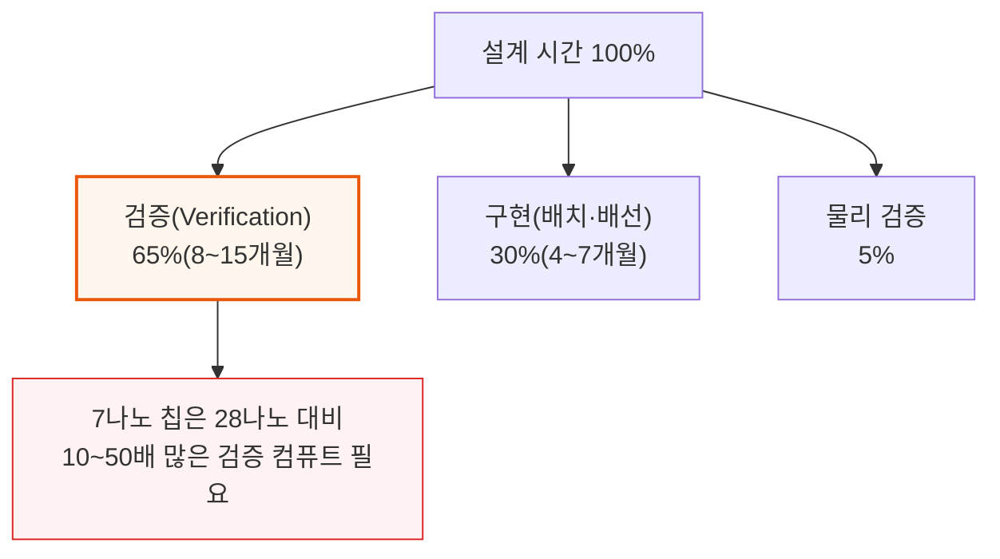

기능 시뮬레이션(시놉시스 VCS 45\~50%, 케이던스 Xcelium 40\~45%)은 수십억 개의 테스트 벡터를 돌리고, 하드웨어 에뮬레이션(케이던스 Palladium 55\~60%, 시놉시스 ZeBu 35\~40%)은 설계를 물리적 하드웨어에 얹어 SoC 전체를 검증합니다.
플래그십 AI 칩 한 개는 6\~12개월간 에뮬레이션을 계속 돌려야 할 정도로 검증 부담이 큽니다.

### EDA 매출이 R&D보다 빨리 크는 4가지 구조적 동력

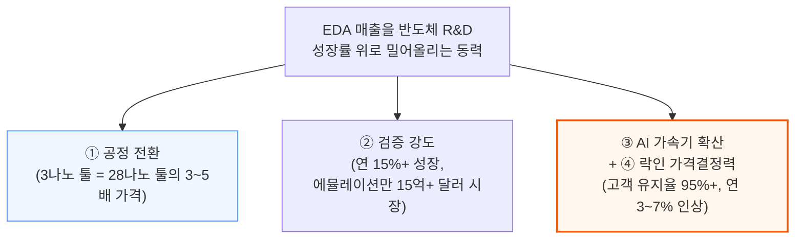

구글 TPU, 아마존 Trainium, 마이크로소프트 Maia, 메타 MTIA 등 하이퍼스케일러 커스텀 실리콘은 5년 전만 해도 거의 없던 150\~200억 달러 규모의 신규 칩 설계 수요를 만들어냈고, 이는 전통 R&D 예산에 완전히 얹히는 순증분입니다.
2020년에 서명한 1,000만 달러짜리 ELA는 엔지니어를 추가하지 않아도 2025년 1,200\~1,400만 달러로 갱신됩니다 — 계약상 인상과 락인이 결합된 결과입니다.

이 격차는 2018년부터 시작됐습니다. 그 전까지 EDA 매출은 파운드리 R&D 지출과 거의 1:1로 움직였지만, 하이퍼스케일러 AI 칩 개발과 에뮬레이션 하드웨어 경제성, 첨단 공정 검증 비용이 모두 설계 복잡성보다 빠르게 늘며 EDA 매출을 R&D 추세선 위로 끌어올렸습니다.
시놉시스의 350억 달러 Ansys 인수로 전체 목표 시장(TAM)은 **310억 달러**(EDA+IP 180억 + 시뮬레이션 100억 + 시스템 소프트웨어 30억)까지 확장됐는데, 이는 이 과점 3사가 유일한 인접 시장까지 흡수했다는 의미입니다.

---

## 4. EDA 시장 규모와 구조

**📌 핵심:**
- 2025년 전체 EDA 시장은 180억 달러, 2030년까지 280\~300억 달러로 성장 전망 — 나머지 10\~15%는 수십 개 벤더에 흩어져 있고, Ansys(Synopsys 편입 전)·Keysight(15억 달러)·Zuken(5억 달러, PCB/IC 패키징)이 독립 벤더 중 최대
- Big-3 바깥에서 핵심 EDA 카테고리 5%를 넘는 벤더는 하나도 없음 — 르네사스는 자사 부품 포트폴리오 판촉·BoM 최적화 목적으로 알티움(Altium, 59억 달러, 2024년)을 인수, 알티움은 PCB 설계 매출만으로 연 2.8억 달러
- 첨단 공정(7나노 이하) 툴별 점유율은 지난 10년간 거의 고정 — 유일하게 움직인 카테고리는 배치·배선(P&R)으로, 케이던스 Innovus가 2015\~2020년 사이 시놉시스 ICC2 대비 10\~15%p를 뺏은 뒤 안정화(시놉시스가 Fusion Compiler를 내놓으면서)
- 결론: 나머지 카테고리는 전부 "잠겨있다(locked)"고 봐도 될 정도로 안정적 — SNPS+CDNS 합산 점유율은 복잡성이 커질수록 상승 추세, 즉 과점이 시간이 갈수록 강화되는 구조

---

### 시장 규모 - 180억에서 280~300억 달러로

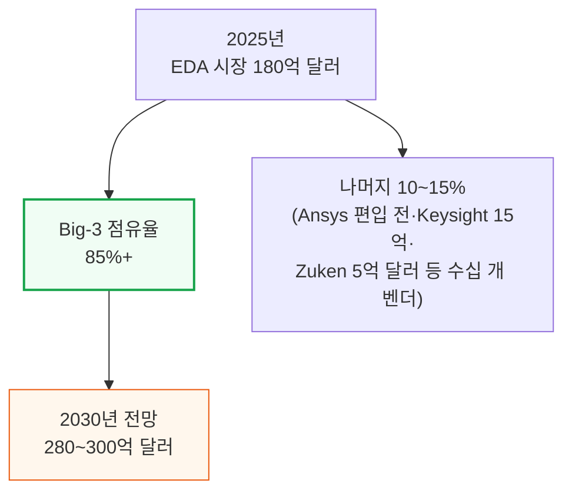

### 첨단 공정 툴별 점유율 - 10년째 거의 고정

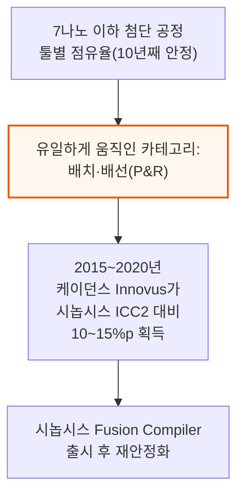

📌 용어 풀이: 왜 "나머지는 전부 잠겨있다"고 하나
> - 합성·서명 검증·물리 검증 등 P&R을 제외한 나머지 카테고리는 지난 10년간 점유율 변화가 사실상 없었음 — 한 번 특정 벤더의 플로우로 설계를 시작하면, 다음 세대·다음 회사에서도 같은 벤더를 계속 쓰게 되는 락인 구조 때문
> - SNPS+CDNS 합산 점유율은 오히려 시간이 갈수록 상승하는 추세 — 설계 복잡성이 커질수록 대형 2사로 수렴

---

## 5. 라이선스 모델 - 좌석, 토큰, ELA

**📌 핵심:**
- EDA 가격은 의도적으로 불투명 — 벤더들은 가격표를 공개하지 않고 모든 계약을 개별 협상함. 좌석(Seat) 기반은 엔지니어 1명이 툴 1개를 쓰는 전통 방식으로, 소규모 고객·특정 툴에 여전히 사용되지만 벤더 매출 상한이 headcount에 묶임
- 토큰(Token) 기반은 좌석이 아니라 컴퓨트 용량 풀을 사고 여러 엔지니어가 나눠 쓰는 최신 모델 — 고객은 피크 사용량 기준으로 사지만 평균 가동률은 60\~70%뿐이라 30\~40%의 여유분이 그대로 벤더의 추가 이익
- 토큰 모델이 성장하는 이유 4가지 — ① 총 지출 증가(사용 안 한 여유분도 이미 지불) ② 좌석 추가 승인 절차 없이 사용량만 늘리면 됨(마찰 없는 확장) ③ AI 툴(DSO.ai·Cerebrus)이 토큰을 3\~5배 빨리 소진 ④ 클라우드 EDA가 컴퓨트 시간당 과금이라 테이프아웃 몰림 구간의 사용 폭증까지 다 잡아냄
- 결론: 시놉시스는 2024년 투자자의 날에서 AI 강화 툴 갱신이 기본 계약가 대비 **약 20% 매출 상승 효과**를 낸다고 밝힘 — headcount는 그대로인데 토큰 소비만 늘어난 결과

---

### 좌석 vs 토큰 - 왜 벤더는 토큰을 밀어붙이나

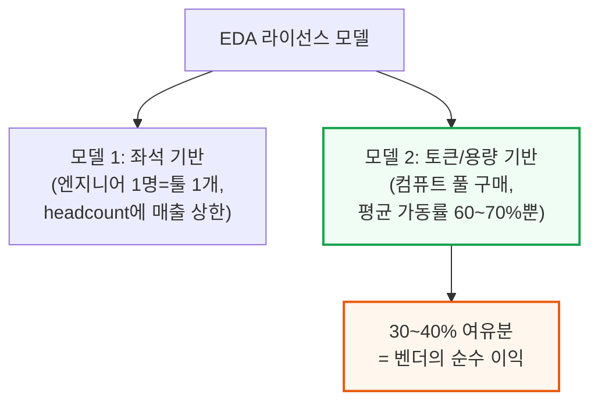

### 토큰 모델이 성장하는 4가지 이유

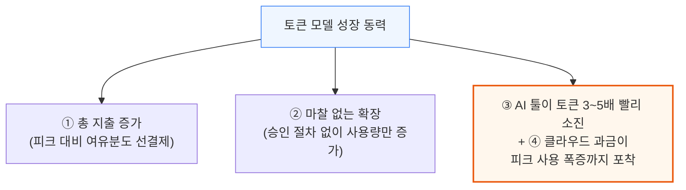

시놉시스 DSO.ai, 케이던스 Cerebrus 같은 AI 툴은 수백 번의 자동 설계 반복을 돌리며 매 반복마다 토큰을 소모합니다. 클라우드 EDA(시놉시스 on AWS, 케이던스 on Azure)는 컴퓨트 시간 단위로 과금하기 때문에, 테이프아웃 몰림 구간의 사용 폭증이 좌석 라이선스라면 절대 못 잡아낼 매출을 만들어냅니다.

### ELA(전사 라이선스 계약) - 상위 50~100개 고객의 실제 거래 단위

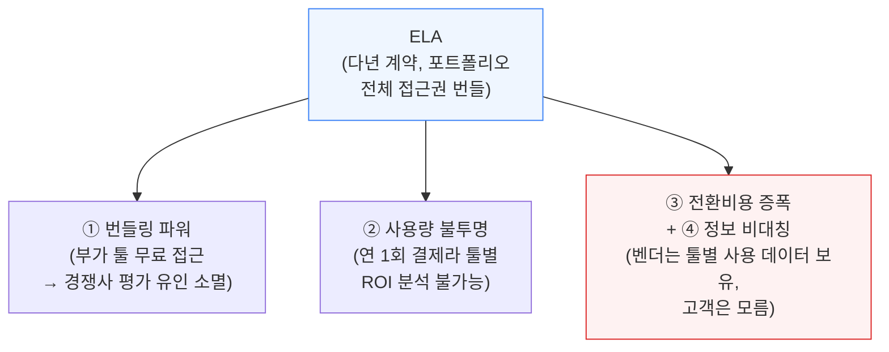

📌 용어 풀이: 번들링이 왜 경쟁을 막나
> - 시놉시스 ELA에 합성·P&R·서명 검증이 다 포함돼 있으면, 이미 무료로 쓸 수 있는 케이던스 Genus를 굳이 따로 평가할 이유가 없어짐 — "무료 부가 기능"이 경쟁 배제 도구로 작동
> - ARM도 비슷한 모델(Flexible Access)을 씀 — 연회비로 전체 IP 포트폴리오를 마음껏 평가하게 해주고, 실제 양산 시에만 칩당 로열티를 받는 방식. 2019년 이후 ARM 신규 계약의 70%+가 이 모델을 채택

---

## 6. 하드웨어 라이선스, 지역별 가격, M&A가 미치는 영향

**📌 핵심:**
- 에뮬레이션 하드웨어(케이던스 Palladium, 시놉시스 ZeBu)는 소프트웨어가 아니라 자본재 경제학을 따름 — 5,000만 달러어치 Palladium 시스템을 한 번 설치하면 감가상각 5\~7년 동안 고객이 사실상 묶임, 시스템당 연 300\~500만 달러 소프트웨어·유지보수료까지 별도 발생
- 고객사 M&A 발생 시 EDA 매출에 미치는 영향은 시나리오별로 다름 — 같은 벤더를 쓰던 회사끼리 합치면 총 지출이 10\~20% 감소(볼륨 할인), 다른 벤더를 쓰던 회사끼리 합치면 이긴 벤더가 좌석을 흡수하고 진 벤더는 2\~3년에 걸쳐 계약이 소멸
- AMD의 자일링스 인수(490억 달러, 2022년)처럼 두 벤더가 통합 계약을 놓고 경쟁이 붙으면, 이긴 벤더는 더 큰 계약을 얻지만 경쟁적 가격 인하로 마진은 눌림 — 반도체 업계 통합의 EDA 매출 순효과는 소폭 마이너스(ELA 개수 감소)지만, 살아남은 회사가 더 복잡한 칩을 더 많이 설계해 상쇄
- 결론: EDA 매출은 헤드카운트가 아니라 6가지 원천에서 성장 — 헤드카운트는 연 3\~5%만 크는데 EDA 매출은 연 12\~15% 성장, 그 차이는 공정 전환·검증 강도·AI 프리미엄 등에서 나옴 — 오래된 시대(perpetual license, 영구 라이선스) 대비 지금은 업데이트가 연회비에 포함돼 있어 결제를 멈추면 접근 자체가 끊김

---

### 하드웨어 라이선스 - 자본재 경제학의 4가지 락인

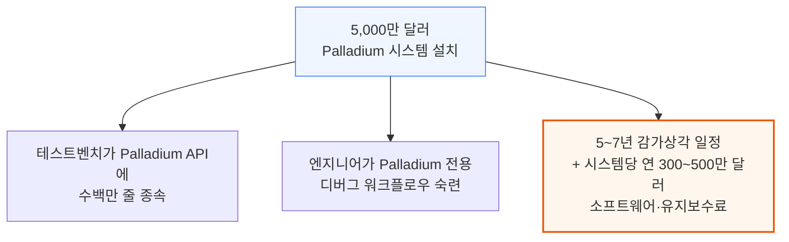

### 고객사 M&A가 EDA 매출에 미치는 영향 - 시나리오 3가지

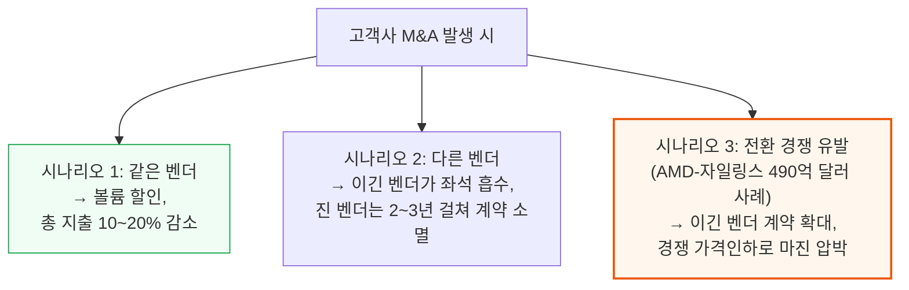

반도체 업계 통합의 EDA 매출 순효과는 소폭 마이너스입니다 — 독립 고객 수가 줄면 별도 ELA 개수도 줄기 때문입니다. 하지만 살아남은 회사는 규모가 더 크고 더 복잡한 칩을 설계하며 엔지니어당 지출도 늘어나, 역사적으로 이 복잡성 증가분이 통합 할인분을 상쇄하고도 남았습니다.

### 헤드카운트를 넘어서는 6가지 매출 성장 원천

EDA 매출은 연 12\~15% 성장하는데 전세계 반도체 설계 인력은 연 3\~5%만 성장합니다. 이 격차는 공정 전환 비용, 검증 강도 증가, AI 프리미엄, 락인 가격결정력 등 앞서 다룬 구조적 동력에서 옵니다.

📌 용어 풀이: 업데이트 요금은 어떻게 받나
> - 과거 영구 라이선스(perpetual license) 시절엔 연 15\~20% 유지보수료를 내고 업데이트를 받았고, 불황기엔 업데이트를 건너뛰고 옛 버전으로 버티는 "메인터넌스 휴가"가 가능했음
> - 지금의 시간 기반(time-based) 모델은 업데이트가 연회비에 포함돼 있어 항상 최신 버전을 쓰지만, 결제를 멈추면 접근 자체가 끊김 — 이 전환(2005\~2015년, 약 10년 소요)이 EDA 벤더의 사업 품질을 영구적으로 개선

시놉시스와 케이던스 모두 현재 매출의 70\~83%가 시간 기반/구독 계약에서 나오고, 나머지는 하드웨어 선납·IP 마일스톤·영구 라이선스에서 발생합니다. 최근 에뮬레이션 하드웨어 판매가 늘면서 선납 비중은 오히려 커지는 추세입니다.

### 갱신 엔진 - 백로그와 계약상 인상이 만드는 자기강화 매출

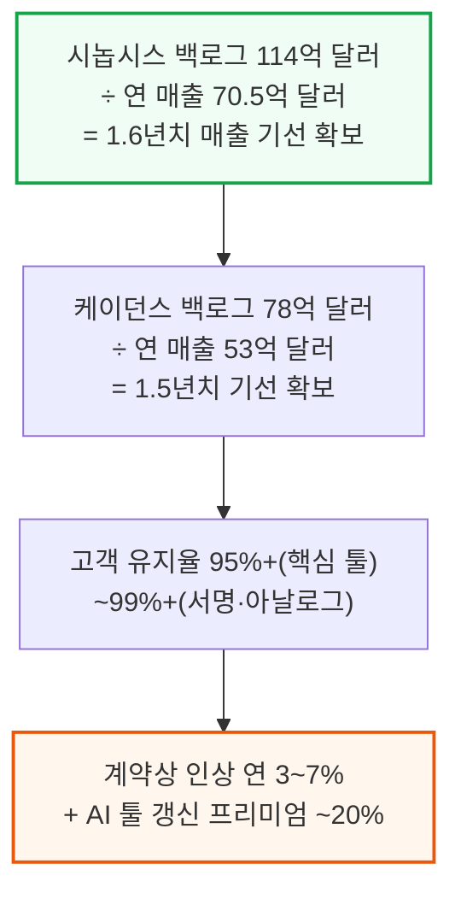

2020년에 서명한 1,000만 달러짜리 연간 ELA는 계약상 인상·AI 프리미엄·검증 확대에 힘입어 2025년 1,200\~1,400만 달러로 갱신됩니다. 경영진은 이를 "가치 창출"로 설명하고 조달팀은 "연례 인플레이션"으로 보는데, 저자들은 둘 다 맞는 말이라고 짚습니다.

대부분의 EDA 경쟁 평가는 실제 전환 시도라기보다 협상 지렛대로 쓰입니다. 고객이 평가를 발표하면 기존 벤더가 15\~25% 할인을 제시하고, 고객은 평가를 끝까지 마치지 않고 그 조건을 수락하는 패턴이 전형적입니다.

---

*작성 진행률: 약 40% 완료*
*업데이트: EDA 시장 규모·구조, 라이선스 모델(좌석·토큰·ELA), 하드웨어 라이선스·M&A 영향까지 작성*
