# The Future of Meta Superintelligence: A 1 Year Progress Update

> **출처**: [SemiAnalysis Newsletter](https://newsletter.semianalysis.com/p/the-future-of-meta-superintelligence)
> **저자**: Max Kan, Julien Martin-Prin, Jeremie Eliahou Ontiveros, Dylan Patel
> **발행일**: 2026-02-05

---

## 📑 목차

### 전체 섹션
1. [서론 - 지난 1년, 프론티어 경쟁 구도와 뮤즈 스파크 데뷔](#1-서론---지난-1년-프론티어-경쟁-구도와-뮤즈-스파크-데뷔)
2. [데이터 - RL 환경 공급망과 스크린 레코딩의 가치](#2-데이터---rl-환경-공급망과-스크린-레코딩의-가치)
3. [메타의 RL 환경 스타트업 - 3,000명 규모 애플리케이션 AI 엔지니어링 조직](#3-메타의-rl-환경-스타트업---3000명-규모-애플리케이션-ai-엔지니어링-조직)
4. [컴퓨트 - 인스타그램 광고가 대주는 무한 확장 자금](#4-컴퓨트---인스타그램-광고가-대주는-무한-확장-자금)
5. [타이탄 연결 - Scale-Across 네트워킹과 AI-Backbone](#5-타이탄-연결---scale-across-네트워킹과-ai-backbone)
6. [인재 - MSL 슈퍼팀 조립](#6-인재---msl-슈퍼팀-조립)
7. [리스크 - 성공은 아직 보장되지 않는다](#7-리스크---성공은-아직-보장되지-않는다)
8. [구글에게 주는 조언 - 3위 자리를 둔 진짜 경쟁 상대](#8-구글에게-주는-조언---3위-자리를-둔-진짜-경쟁-상대)

---

## 🔑 용어 정리

본문을 순서대로 읽기 전에 알아두면 좋은 용어들입니다. 자세한 수치와 설명은 본문에서 처음 등장하는 위치에 나옵니다.

- **MSL (Meta Superintelligence Labs, 메타 슈퍼인텔리전스랩)**: 라마4 실패 이후 저커버그가 앤트로픽·오픈AI를 따라잡기 위해 통째로 새로 꾸린 메타의 프론티어 AI 연구조직
- **RL 환경 (Reinforcement Learning Environment)**: AI 모델이 "과제를 실제로 끝까지 수행"하도록 훈련시킬 때 필요한 가상의 작업 공간 — 과제·도구·정답 확인 장치(검증기)를 한 세트로 갖춘 훈련장
- **프론티어 모델 (Frontier Model)**: 현재 시점에서 가장 앞선 성능을 내는 최상위권 AI 모델 — 오픈AI·앤트로픽·구글 등 소수만 만들 수 있는 수준
- **Scale-Across (스케일 어크로스)**: 한 데이터센터로는 감당 못 하는 초대형 AI 모델 학습을, 여러 지역에 흩어진 데이터센터를 하나로 묶어 처리하는 방식
- **AI-Backbone (AIBB)**: 메타가 여러 데이터센터를 서로 연결하기 위해 만든 초고속 네트워크 설계 — 캠퍼스 안과 캠퍼스 사이를 계층별로 연결
- **Tent(텐트)형 데이터센터**: 메타가 공사 기간을 획기적으로 줄이기 위해 쓰는 초고속·간이 건설 방식 — 완성도는 낮지만 훨씬 빨리 가동 가능
- **RSI (Recursive Self-Improvement, 재귀적 자기개선)**: AI가 스스로 더 나은 AI를 만들도록 개선해나가는 것을 목표로 하는 연구 방향 — 프론티어 연구소 특유의 궁극적 목표

---

## 1. 서론 - 지난 1년, 프론티어 경쟁 구도와 뮤즈 스파크 데뷔

**📌 핵심:**
- 라마4 실패로 저커버그가 AI 조직을 통째로 재건한 지 1년이 지남 — 알렉산더 왕을 영입하려 스케일AI에 143억 달러를 쏟아붓고, 최상급 연구자에게 수억\~10억 달러대 보상 패키지를 제시하며 재건
- 그 사이 프론티어 경쟁은 오픈AI vs 앤트로픽 "2강 구도"로 굳어졌고, 구글은 반짝 주목받다 다시 밀려남 — MSL은 올해 4월 뮤즈 스파크(Muse Spark)로 첫 공식 데뷔
- 뮤즈 스파크 단독 성적만 보면 라마3 세대보다 후퇴로 보이지만(비공개 모델인데도 오픈소스 딥시크 V4 프로·Kimi K2.6에 밀림), 저자들은 "지금 위치"가 아니라 "개선 속도"가 핵심이라고 진단
- 결론: 데이터·인재·컴퓨트 3요소를 모두 세계 최고 수준으로 갖출 궤도에 있는 하이퍼스케일러는 메타뿐 — 앤트로픽·오픈AI를 따라잡을 가능성이 가장 높은 후보로 평가

---

### 지난 1년의 재건 - 143억 달러 인재 영입부터 텐트 데이터센터까지

라마4의 처참한 실패가 저커버그로 하여금 AI 조직 전체를 재건하게 만든 지 1년이 조금 넘었습니다.

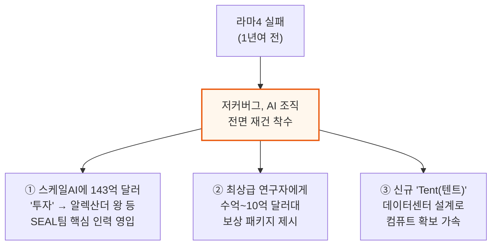

### 프론티어 경쟁 구도 - 2강 체제, 구글은 밀려남

지난 1년 사이 프론티어 AI는 점점 오픈AI 대 앤트로픽의 2강 구도로 굳어졌습니다.

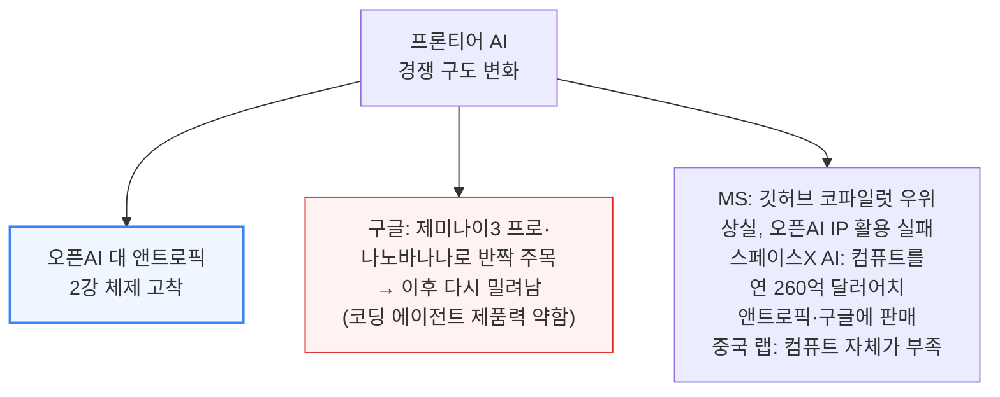

### 뮤즈 스파크 데뷔 - 겉보기 후퇴, 그러나 중요한 건 기울기

MSL은 올해 4월 뮤즈 스파크(Muse Spark) 공개로 첫 공식 데뷔를 했는데, 단독으로 보면 오히려 후퇴처럼 보입니다.

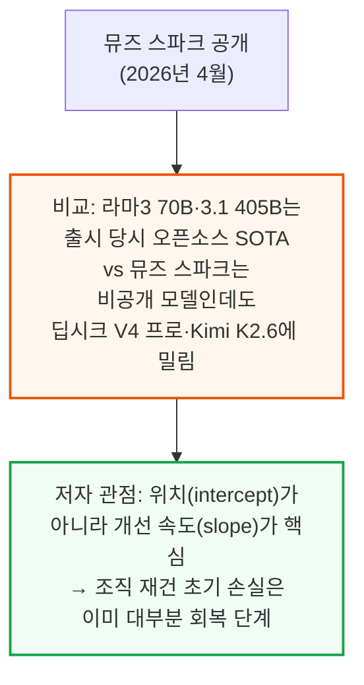

### 3요소 진단 - 데이터·인재·컴퓨트를 동시에 세계 최고 수준으로

프론티어 모델을 만들려면 데이터·인재·컴퓨트 3가지가 모두 필요한데, 저자들은 이 3가지를 동시에 세계 최고 수준으로 갖출 궤도에 있는 하이퍼스케일러는 메타뿐이라고 진단합니다.

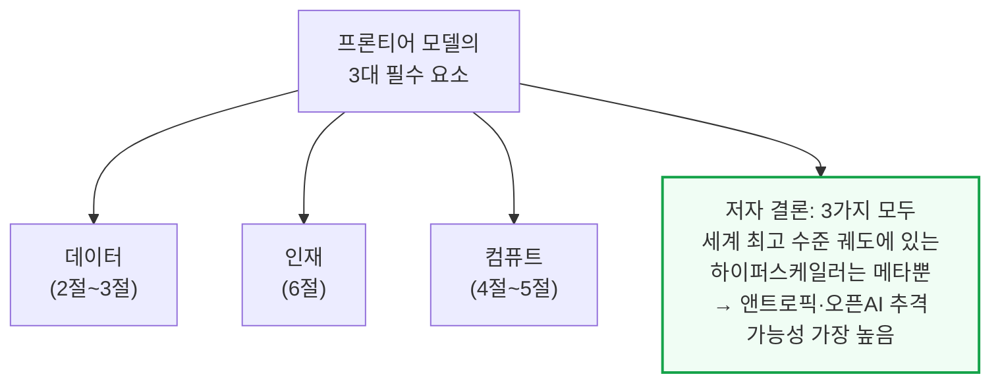

---

## 2. 데이터 - RL 환경 공급망과 스크린 레코딩의 가치

**📌 핵심:**
- "데이터는 AI의 화석연료"라는 일리야 서츠케버의 말은 데이터의 중요성은 맞지만 "좋은 데이터가 유한하다"는 가정은 틀렸다 — 수요가 강하면 시장이 새 공급망을 만들어냄. 실제로 머서·서지·핸드셰이크 3사가 연매출 1억 달러를 넘겼고, 1년도 안 된 신생업체(플릿·메카나이즈·애프터쿼리)도 연매출 1억 달러 안팎에 도달
- RL(강화학습)은 다음 토큰 예측이 아니라 "과제를 끝까지 완수"하도록 훈련하는 방식 — 과제·환경·도구·검증기 4가지가 필요하며, 앤트로픽 리서처 숄토 더글러스는 "지금 알고리즘만으로도 화이트칼라 업무 자동화에 충분하다"고 진단
- 스크린 레코딩(직원의 실제 업무 화면 기록)이 RL 과제 제작에 특히 중요한 이유는 ① 실제 업무를 그대로 반영해 난이도·현실성을 동시에 잡을 수 있고 ② 채점 기준(루브릭) 제작에도 직접 활용 가능하기 때문 — 오픈AI GDPval 같은 벤치마크는 지나치게 인위적으로 설계돼 실제 업무와 괴리가 큼
- 결론: 좋은 RL 과제 하나를 만드는 데 프론티어 랩은 5,000달러 이상을 지불할 용의가 있고, 메카나이즈는 연봉 40만 달러 이상 소프트웨어 엔지니어에게도 주당 1개 과제만 기대할 정도로 난이도 조절이 어려움 — RL 데이터 제작은 이제 지적으로도, 경제적으로도 최상급 직무

---

### "데이터는 유한하다"는 가정의 오류 - 시장이 만든 새 공급망

일리야 서츠케버는 2024년 "데이터는 AI의 화석연료"라 말했지만, 이 비유는 데이터의 중요성은 맞아도 "양이 유한하다"는 전제는 틀렸습니다. 수요가 충분히 강하면 시장이 새로운 공급 경로를 만들어내기 때문입니다.

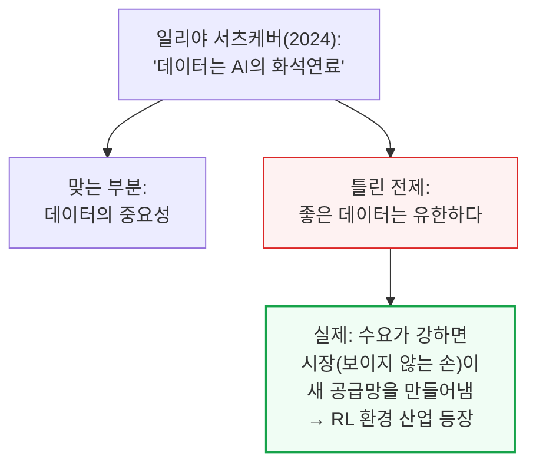

### RL 환경 공급망 - 3강 기업 연매출 1억 달러 돌파, 신생업체도 급성장

머서·서지·핸드셰이크 3사는 이미 연매출(ARR) 1억 달러를 넘겼고, 1년도 안 된 신생업체들도 연매출 1억 달러 안팎에 도달했습니다.

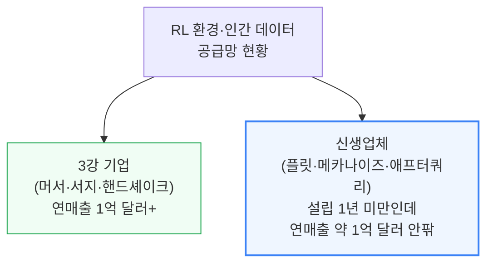

### RL(강화학습)이란 - 다음 토큰 예측을 넘어 "과제 완수"를 가르치는 법

RL(Reinforcement Learning, 강화학습)은 다음 토큰을 예측하는 대신, 버그 수정 같은 과제 하나를 처음부터 끝까지 완수하도록 모델을 훈련하는 방식입니다.

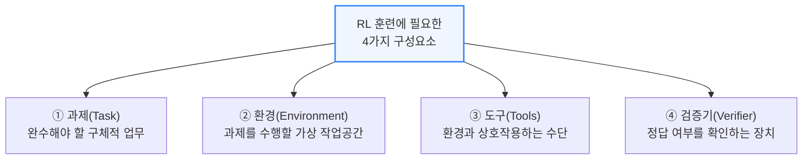

📌 용어 풀이: "지금 알고리즘만으로도 충분하다"는 진단
> - 앤트로픽 리서처 숄토 더글러스는 드워케시 팟캐스트에서 "알고리즘 발전이 멈추더라도, 지금 알고리즘 스위트만으로도 올바른 종류의 데이터만 충분하면 화이트칼라 업무를 자동화하기에 충분하다"고 언급
> - 화이트칼라 업무 전체의 급여 시장(TAM) 규모에 비하면 이 투자는 지극히 사소한 비용이라는 의미

### 스크린 레코딩의 진짜 가치 - 현실성과 채점 기준(루브릭) 양쪽에 기여

스크린 레코딩(직원의 실제 화면·키보드·마우스 기록)은 단순 모방 학습(SFT)용이 아니라, RL 과제 제작에도 결정적으로 중요합니다.

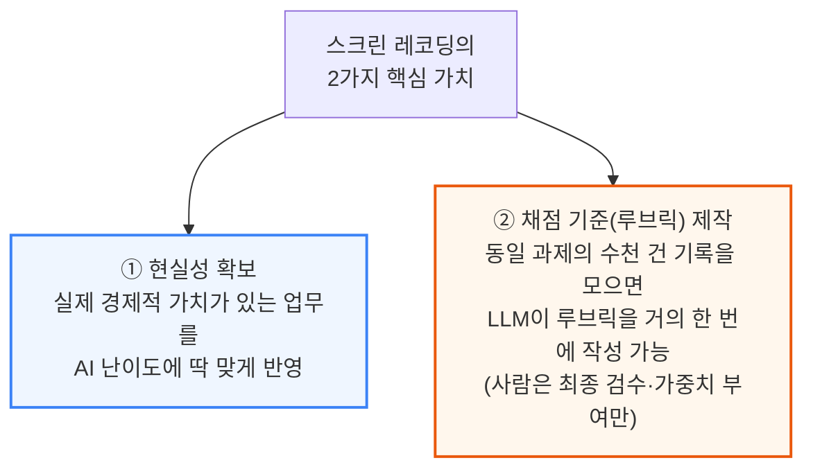

### 기존 벤치마크의 함정 - 오픈AI GDPval의 인위적 설계

오픈AI의 GDPval이나 머서의 Apex 같은 벤치마크(좋은 벤치마크와 좋은 RL 환경은 사실상 동일한 개념)는 실제 업무와 괴리된 인위적 과제로 채워져 있다는 것이 문제입니다.

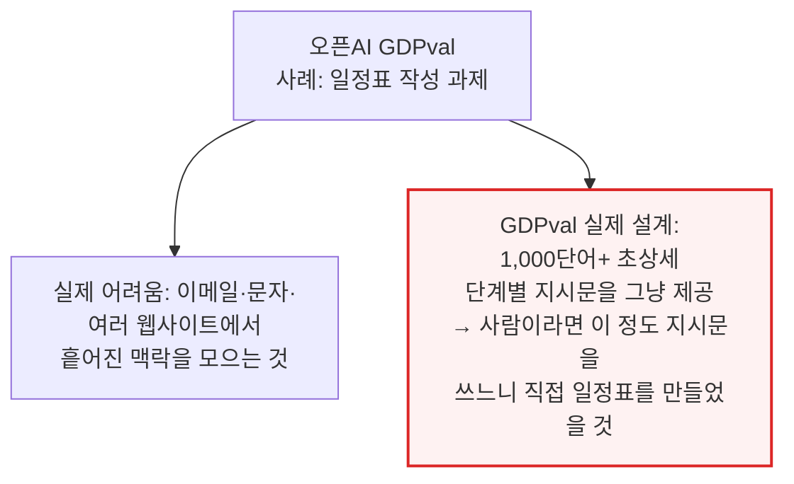

### RL 데이터 제작의 경제적 가치 - 과제 1개당 5,000달러 이상

RL 과제를 만드는 일은 이제 지적으로도 경제적으로도 최상급 직무가 됐습니다. 난이도 조절이 워낙 까다로워, 메카나이즈는 연봉 40만 달러 이상인 소프트웨어 엔지니어에게도 주당 좋은 과제 1개 제작만을 기대합니다.

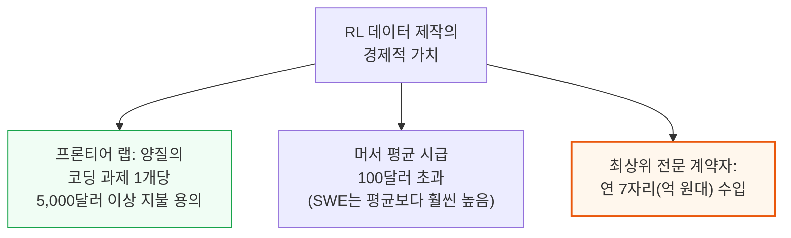

과거처럼 저개발국 저임금 계약자가 경계 상자를 그리거나 텍스트를 분류하던 단순 라벨링 시대는 끝났습니다. 지금은 모델이 이미 충분히 똑똑해져서, 좋은 훈련 데이터 하나를 만드는 일 자체가 실질적인 지적 도전 과제가 됐습니다 — 실패 유형을 깊이 이해하고, 환경이 보상 해킹에 강건하도록 설계하고, 품질 저하 없이 과제 제작을 확장하는 것 모두 만만치 않은 엔지니어링 문제입니다.

---

## 3. 메타의 RL 환경 스타트업 - 3,000명 규모 애플리케이션 AI 엔지니어링 조직

**📌 핵심:**
- 메타가 최근 직원의 화면·키보드·마우스 움직임을 추적하기 시작했다는 뉴스는 세계에서 가장 가치 있는 데이터 중 하나를 확보하는 조치 — 스케일AI 인수를 주도한 알렉산더 왕이 이 전환을 이끈다는 점도 상징적
- 투자은행·법무법인·광고대행사와 제휴하려 애쓰는 다른 데이터 회사들과 달리, 메타는 이 모든 업종에 걸친 사내 대규모 인력을 이미 보유 — PR 타격과 초기 직원 반발에도 밀어붙인 실행력이 인상적(이후 개인정보 보호 강화·30분 추적 일시정지 옵션으로 소폭 후퇴했지만 미미한 양보로 평가)
- 5월 말 구조조정과 함께 신설한 "애플리케이션 AI 엔지니어링 조직"에 약 3,000명 규모 엔지니어(신입의 70%, 다수의 시니어 포함)를 RL 과제·환경 제작 전담으로 배치 — 비교 대상인 머서는 2026년 2분기 251.7만 시간(주 40시간 근무 약 4,800명 상당)을 기록했는데, 메타는 이미 같은 규모이면서 평균 품질은 더 높을 가능성이 있고, 추가로 약 7만 명 풀도 활용 가능
- 결론: 이는 저평가된 MSL의 강점 — 앤트로픽이 지금까지 RL 환경 스타트업으로부터 코딩 데이터를 가장 공격적으로 사들여온 랩이었고, 이것이 앤트로픽 코딩 모델이 뛰어난 핵심 이유 중 하나였는데, 메타는 이제 사내에서 비슷한 규모를 자체 조달할 수 있게 됨

---

### 메타의 데이터 우위 - 사내에 이미 존재하는 업종별 대규모 인력

다른 데이터 회사들은 투자은행·법무법인·광고대행사와 애써 제휴를 맺으려 하지만, 메타는 이 모든 업종에 해당하는 사내 인력을 이미 대규모로 보유하고 있습니다.

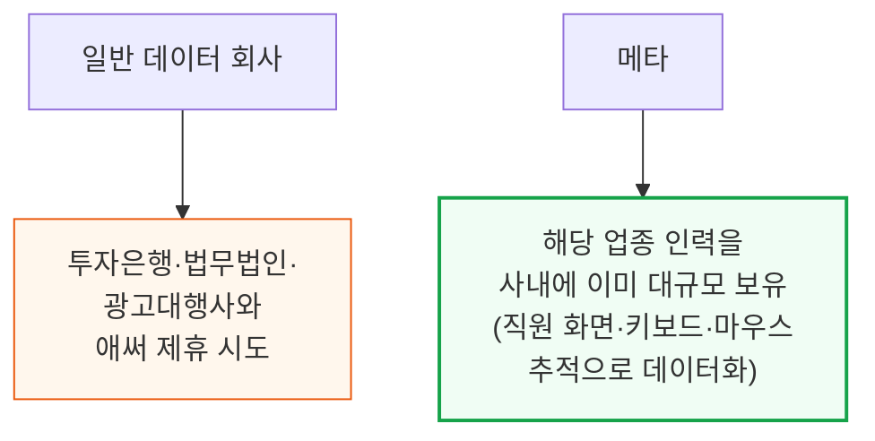

📌 용어 풀이: PR 타격에도 밀어붙인 실행력
> - 메타의 직원 추적 조치는 PR 타격과 초기 직원 반발을 불렀지만, 메타는 이후 개인정보 보호를 강화하고 30분간 추적을 일시정지할 수 있는 옵션을 주는 선에서만 물러섬
> - 저자들은 이를 "매우 미미한 양보"로 평가 — 메타가 여전히 민첩하고 공격적으로 이 데이터 확보를 밀어붙이고 있다는 신호로 해석

### 애플리케이션 AI 엔지니어링 조직 - 3,000명, 신입의 70%

메타는 5월 말 최근 구조조정의 일환으로 새로운 "애플리케이션 AI 엔지니어링 조직"을 발표하며, 약 3,000명 규모 엔지니어(신입의 70%와 다수의 시니어 포함)를 RL 과제·환경 제작 전담으로 배치했습니다.

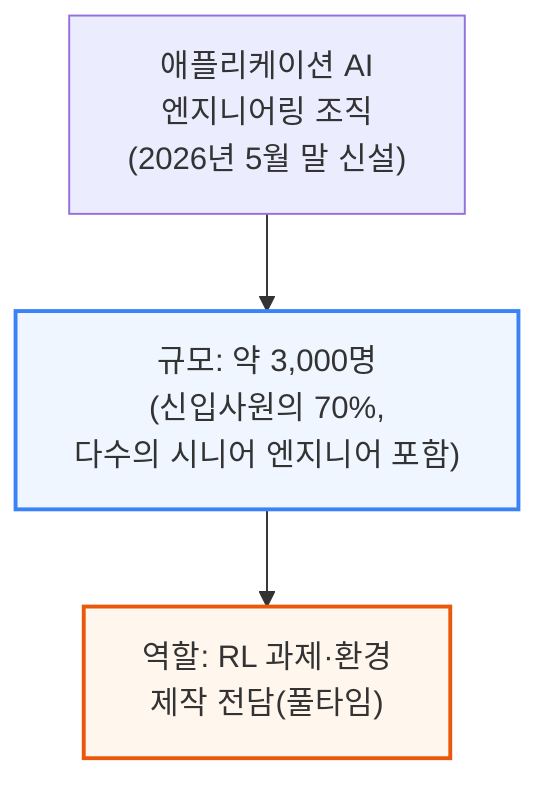

### 규모 비교 - 머서의 251.7만 시간 vs 메타의 3,000명+7만 명 풀

머서는 2026년 2분기 자사 플랫폼에서 251.7만 전문가 시간을 기록했다고 공개했는데, 이는 주 40시간 근무 기준 약 4,800명이 일한 것과 같습니다. 메타는 이미 같은 규모대에 있으면서 평균 품질은 더 높을 가능성이 있습니다.

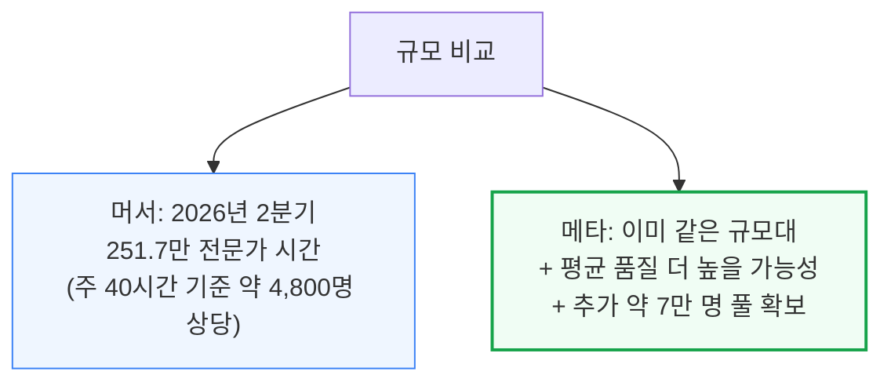

### 왜 저평가된 강점인가 - 앤트로픽의 성공 공식을 사내로 흡수

앤트로픽은 지금까지 RL 환경 스타트업으로부터 코딩 데이터를 가장 공격적으로 사들여온 랩이었고, 이것이 앤트로픽 코딩 모델이 뛰어난 핵심 이유 중 하나였습니다. 메타는 이제 비슷한 규모의 데이터 생산을 사내에서 직접 조달할 수 있게 됐습니다.

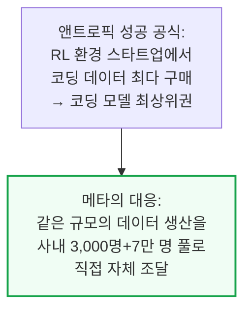

이 3,000명이 단순 무의미한 저수준 데이터 라벨링을 할 것이라는 오해도 짚어볼 필요가 있습니다. 개발도상국 저임금 계약자가 경계 상자를 그리거나 텍스트를 유해물로 분류하던 시대는 이미 끝났고, 지금은 좋은 훈련 데이터 하나를 만드는 일 자체가 실패 유형 이해·보상 해킹 방지·품질 저하 없는 확장까지 요구하는 실질적인 엔지니어링 과제입니다.

---

*작성 진행률: 약 35% 완료*
*업데이트: 서론\~데이터·RL 환경(1\~3절) 변환 완료*
