# Meta Compute: Everyone Wants To Be A Neocloud

> **출처**: [SemiAnalysis Newsletter](https://newsletter.semianalysis.com/p/meta-compute-everyone-wants-to-be)
> **저자**: Jeremie Eliahou Ontiveros, Max Kan, Joey Brookhart
> **발행일**: 2026-02-05

---

## 📑 목차

### 전체 섹션
1. [서론 - 시장의 오해와 메타의 가속](#1-서론---시장의-오해와-메타의-가속)
2. [메타가 노리는 4대 컴퓨트 수익화 카드](#2-메타가-노리는-4대-컴퓨트-수익화-카드)
3. [스페이스X식 딜 - 일론이 만든 새로운 시장의 경제학](#3-스페이스x식-딜---일론이-만든-새로운-시장의-경제학)
4. [메타는 왜 이 게임에 낄 수 있나 - 오라클과 메타만 남은 이유](#4-메타는-왜-이-게임에-낄-수-있나---오라클과-메타만-남은-이유)
5. [메타의 베드락 구상 - 앤트로픽 제휴 3가지 경로](#5-메타의-베드락-구상---앤트로픽-제휴-3가지-경로)
6. [광고 추천 시스템(RecSys) - GEM으로 10배 확장 베팅](#6-광고-추천-시스템recsys---gem으로-10배-확장-베팅)
7. [메타 슈퍼인텔리전스랩(MSL) - 포기 신호인가, 재도전인가](#7-메타-슈퍼인텔리전스랩msl---포기-신호인가-재도전인가)

---

## 🔑 용어 정리

본문을 순서대로 읽기 전에 알아두면 좋은 용어들입니다. 자세한 수치와 설명은 본문에서 처음 등장하는 위치에 나옵니다.

- **네오클라우드 (Neocloud)**: 코어위브·네비우스처럼 GPU 서버를 대량으로 사들여 다른 기업에 임대해주는 것이 주업인 클라우드 사업자
- **Colo (Colocation, 코로케이션)**: 서버 장비는 고객이 소유하고, 건물·전력·냉각 등 인프라만 빌려주는 임대형 데이터센터 방식
- **MSL (Meta Superintelligence Labs, 메타 슈퍼인텔리전스랩)**: 메타가 앤트로픽·오픈AI 같은 프론티어 AI 모델을 따라잡기 위해 만든 자체 연구조직
- **RecSys (Recommendation System, 추천 시스템)**: 어떤 광고·콘텐츠를 어떤 사용자에게 보여줄지 예측하는 모델 — 메타 광고 매출의 핵심 엔진
- **베드락 (Amazon Bedrock)**: 고객이 원하는 LLM(거대언어모델)을 골라 쓸 수 있게 해주는 아마존의 "모델 장터형" 서비스 — 메타가 비슷한 구조를 앤트로픽과 논의 중
- **GEM(HSTU)**: 메타의 생성형 광고 추천모델 — 컴퓨트를 늘릴수록 성능이 좋아지도록 재설계된 차세대 RecSys 엔진
- **ROAS (Return on Ad Spend, 광고비 대비 수익률)**: 광고주가 1달러를 썼을 때 얼마의 매출이 돌아오는지 나타내는 지표
- **TaaS (Token-as-a-Service, 토큰 서비스)**: AI 모델을 직접 운영하지 않고, 모델이 만든 결과물(토큰)을 사용한 만큼 팔아 수익을 내는 방식

---

## 1. 서론 - 시장의 오해와 메타의 가속

**📌 핵심:**
- 블룸버그가 "메타가 네오클라우드(GPU를 임대해주는 사업자)가 될 수 있다"고 보도하자 코어위브·네비우스 같은 네오클라우드 주가는 즉각 급락했고, "공급 과잉" 논쟁까지 재점화됨
- 저자는 두 반응 모두 틀렸다고 판단 — 메타의 데이터센터·컴퓨트 조달은 오히려 가속 중이며, 2027년 초기투자(CapEx)는 놀라울 정도로 높아질 전망
- 올해 상반기 6개월 동안만 메타는 클라우드 임대와 Colo(코로케이션) 계약으로 5GW가 넘는 용량을 확보 — 이는 자체 건설(Self-build) 물량은 아예 포함하지 않은 수치
- 결론: "미국 데이터센터 절반이 지연됐고 겨우 5GW만 건설 중"이라는 항간의 주장은 완전히 틀림 — 메타의 대형 캠퍼스 단 2곳의 건설 물량만 합쳐도 2.5GW로, 그 "5GW"의 절반에 해당

---

### 시장의 오해 - 저자는 왜 둘 다 틀렸다고 보나

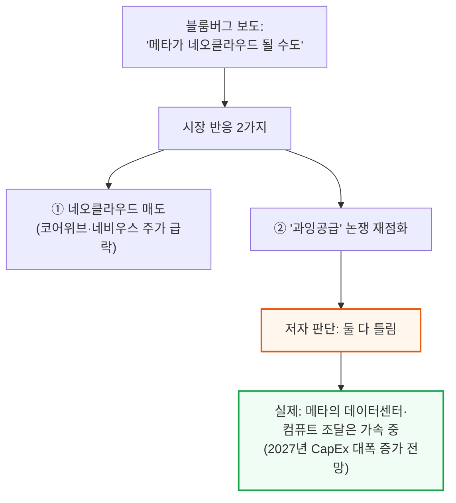

### 상반기 계약 규모 - 5GW+는 자체 건설을 뺀 숫자

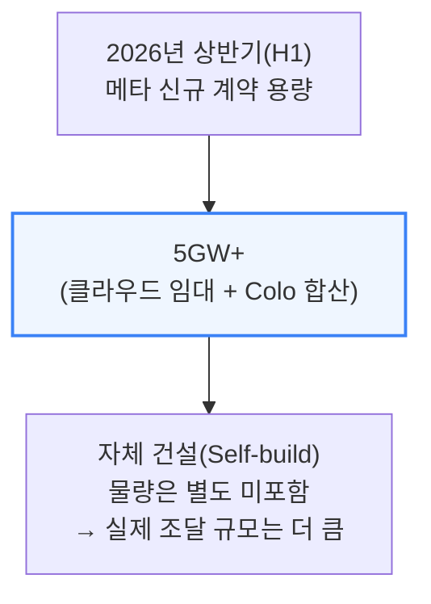

### "美 데이터센터 절반 지연" 주장 반박 - 캠퍼스 2곳=2.5GW

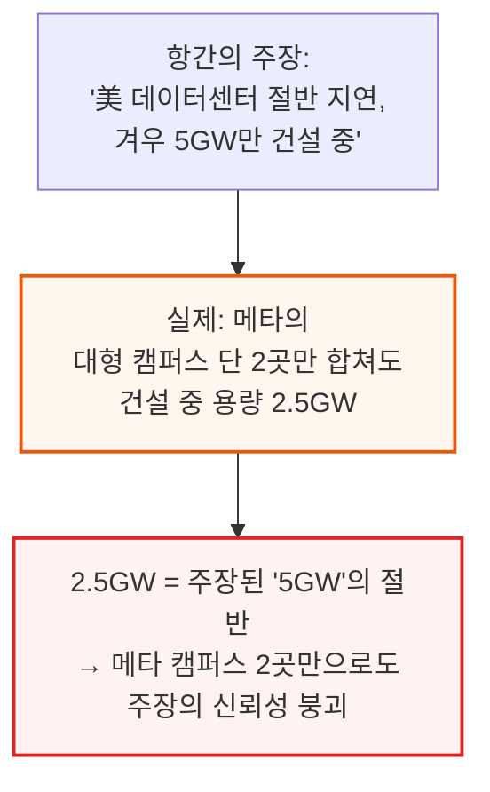

메타의 건설 중인 용량은 계속 가속되고 있습니다. 이 수치는 SemiAnalysis Datacenter Model 추적치이며, 저자들은 "미국 데이터센터 절반이 지연됐다"는 헤드라인이 왜 완전히 잘못됐는지를 별도 리포트("Stop Saying Half of US Datacenters Are Delayed")에서 더 자세히 다뤘다고 언급합니다.

---

## 2. 메타가 노리는 4대 컴퓨트 수익화 카드

**📌 핵심:**
- 메타가 확보한 방대한 컴퓨트를 어디에 쓸지에 대해 저자는 4가지 고부가가치(high-value) 활용법을 제시 — 전통적 네오클라우드의 사업 방식과는 완전히 다른 접근
- ① 프론티어 AI 모델 학습(MSL) ② 광고 추천 시스템(RecSys) 10배 확장 ③ (단독 취재) 앤트로픽과 클로드(Claude) 비공개 인스턴스 제공 논의 ④ 스페이스X식 초고가 온디맨드 컴퓨트 판매
- 이 4가지 선택지 덕분에 메타는 일반 베어메탈 IaaS 임대업체(매출총이익률 약 30%)와 달리, 어느 카드가 실패해도 다른 고마진 대안으로 계속 공격적인 컴퓨트 계약을 이어갈 수 있음 — 옵션이 여러 개라는 점 자체가 최고재무책임자(CFO) 입장에선 이상적인 그림
- 결론: 2024년 초 이후 거의 10GW 규모 계약이 체결됐고, 이제는 신규 용량 확보의 대부분이 자체 건설이 아닌 3자(클라우드·임대) 경로를 통함 — 코어위브·네비우스 등 네오클라우드의 RPO(잔여계약이행의무, 향후 받을 확정 계약금액 잔액) 성장에 메타가 주요 동력이 될 전망

---

### 4대 카드 - 내부 활용 vs 외부 판매

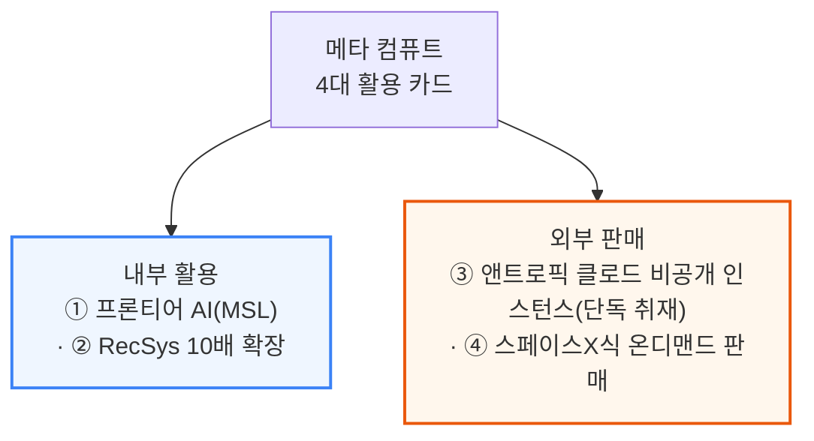

### 옵션 다양성의 경제학 - CFO의 이상적인 그림

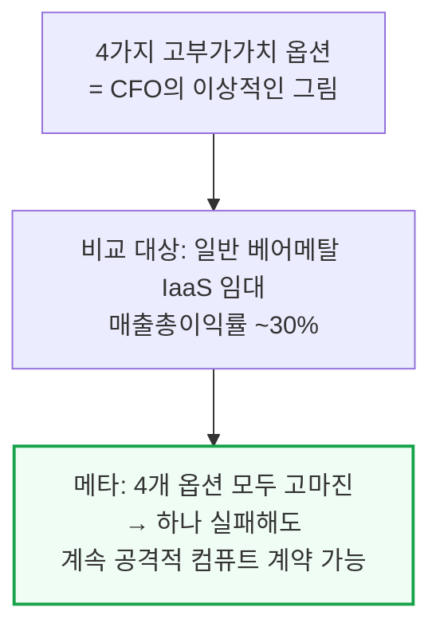

📌 용어 풀이: 왜 "MSL이 실패해도 손해가 아닌"가
> - 메타가 컴퓨트를 프론티어 모델 학습(MSL)에만 쓴다면, MSL이 실패할 경우 그 컴퓨트는 그대로 매몰비용이 됨
> - 하지만 RecSys·베드락형 서비스·스페이스X식 판매라는 3개의 대체 수익원이 있으면, MSL이 실패해도 그 컴퓨트를 다른 고마진 용도로 즉시 돌릴 수 있어 투자 리스크 자체가 줄어듦

### 계약 규모 추이 - 10GW, 그리고 3자 경로로의 전환

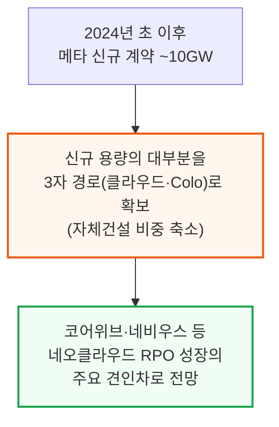

### 분기별 컴퓨트 배분 - MSL vs 기타 AI vs 비AI

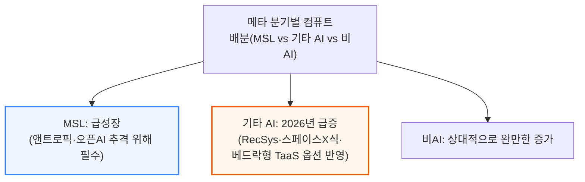

RecSys 확장이 기대보다 덜 되더라도 메타에게는 스페이스X식 판매·베드락형 서비스라는 다른 대안이 남아 있고, 반대로 MSL이 실패하면 그 컴퓨트는 곧바로 Cloud(외부 판매) 용량으로 넘어갈 수 있습니다.

---

## 3. 스페이스X식 딜 - 일론이 만든 새로운 시장의 경제학

**📌 핵심:**
- 일론 머스크는 앤트로픽과의 첫 스페이스X 컴퓨트 딜 발표로 AI 인프라 업계를 놀라게 했고, 구글과의 딜로 다시 한번 놀라게 함 — MW(메가와트)당 매출이 동종업계 대비 각각 3배, 4배에 달함(비용구조가 비슷해 이익/MW 격차는 이보다 더 큼)
- 스페이스X-구글 딜의 단가는 온디맨드·단기 임대 시장가보다도 높음 — 일론이 사실상 완전히 새로운 시장 세그먼트를 만들어낸 것
- 계약 기간은 명목상 3년이지만 양측 모두 90일 내 해지 가능 옵션이 있어, 사실상 "3개월 단위 자동갱신 계약"에 가까움 — 이렇게 크고 짧은 계약은 지금까지 전례가 없었음
- 결론: 대형 클러스터를 지으려면 다년간 확정 매출처(오프테이커)를 미리 확보해야 하는 자금조달 구조 때문에 네오클라우드는 이 시장에 참여할 수 없음 — 이런 유연하면서도 초고가인 단기 계약을 감당할 수 있는 곳은 극소수

---

### MW당 매출 비교 - 동종업계 대비 3\~4배

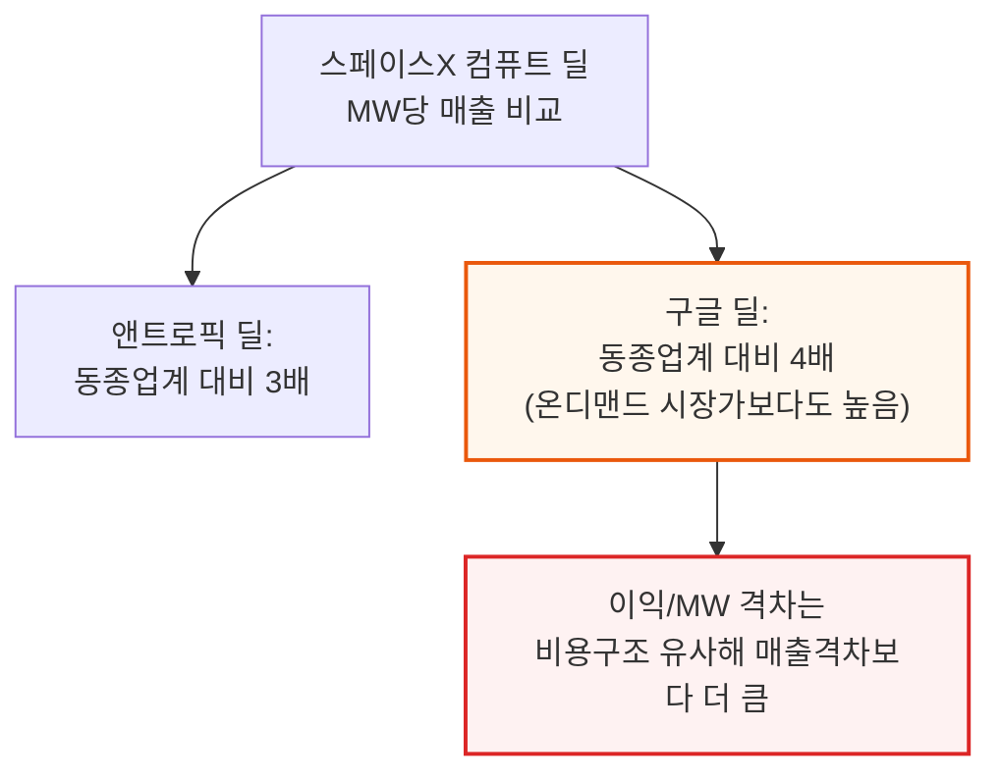

### 딜 구조 - 명목 3년, 실질 3개월

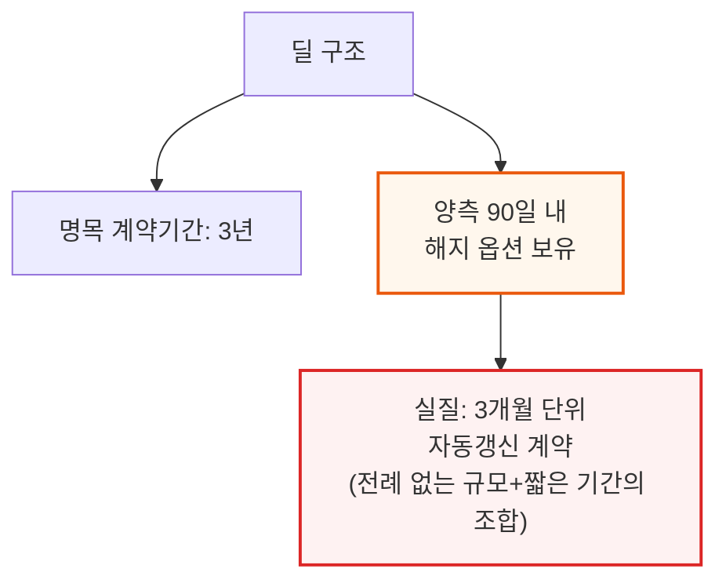

📌 용어 풀이: 네오클라우드는 왜 이 시장에 못 들어오나
> - 대형 GPU 클러스터를 지으려면 은행 대출이 필요한데, 은행은 "이 클러스터가 다년간 확정적으로 임대될 것"이라는 보장(오프테이커 계약)을 요구
> - 코어위브·네비우스 같은 네오클라우드는 이런 자금조달 구조 때문에 3개월 만에 해지될 수 있는 계약을 감당할 재무 여력이 없음 — SemiAnalysis의 AI Cloud TCO Model팀이 매년 수백 건의 GPU 클라우드 계약(SLA·가격·계약기간 등)을 추적한 결과, 이만큼 크면서 이만큼 짧은 계약은 처음 관측됨

---

## 4. 메타는 왜 이 게임에 낄 수 있나 - 오라클과 메타만 남은 이유

**📌 핵심:**
- 상위 3대 하이퍼스케일러(마이크로소프트·아마존·구글)는 이미 각자 더 높은 가치의 장기 옵션을 갖고 있어 스페이스X식 단기 초고가 딜에 뛰어들 유인이 적음 — MS는 오픈AI 지분·IP 확보, 아마존은 베드락·트레이니엄 채택 확대, 구글은 TPU·제미나이 엔터프라이즈(옛 버텍스) 확대에 집중
- 결과적으로 이 신규 시장을 진짜로 활용할 수 있는 회사는 오라클과 메타 단 둘 — 오라클에게는 뼈아픈 신호로, 자사가 보유한 수많은 GW 규모 컴퓨트를 제대로 수익화하지 못했다는 방증. 오라클과 스페이스X의 기업가치 흐름을 비교하면 괴리가 뚜렷하며, 두 회사 모두 GW(기가와트) 보유량이 기업가치에서 차지하는 비중이 최근 1년 새 커지는 중
- 메타 입장에선 계산이 간단함 — GW당 연 500억 달러 매출 기준, 외부 고객에 단 200MW(0.2GW)만 배정해도 연 100억 달러 매출을 초고마진으로 얻을 수 있고, 90일 내 해지 가능 조항 덕분에 MSL에 컴퓨트가 더 필요해지면 즉시 회수 가능
- 결론: 메타의 "텐트(tent)"형 초고속 데이터센터 설계("완성도는 낮지만 빠르게 가동")가 이 스페이스X식 수익화와 궁합이 잘 맞음 — 앤트로픽이 유력 후보지만 오픈AI·구글도 참여할 수 있어, 조만간 유사한 딜 발표가 예상됨

---

### 왜 상위 3사는 안 뛰어드나 - 이미 더 나은 대안 보유

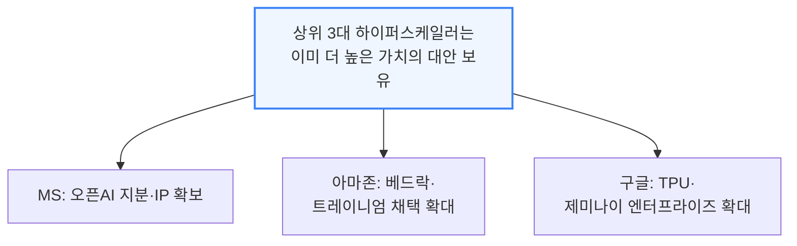

### 남은 2곳 - 오라클의 뼈아픈 신호 vs 메타의 손쉬운 계산

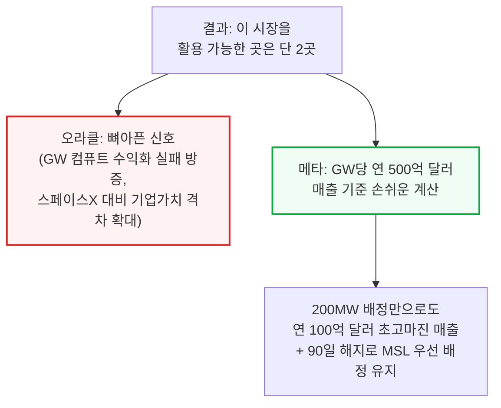

### 텐트형 데이터센터 - 스페이스X식 판매와의 궁합

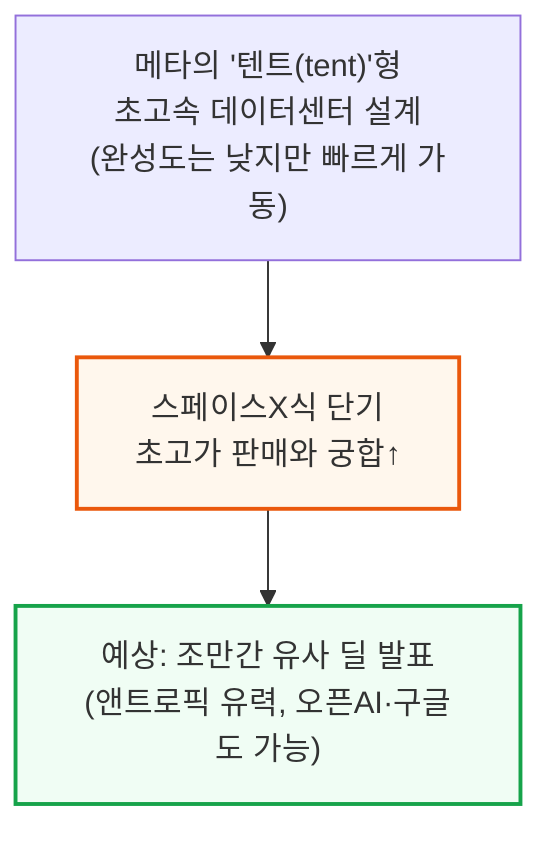

메타는 슈퍼인텔리전스 구축에 워낙 집중해온 터라 클라우드 옵션 자체를 충분히 검토하지 않았을 가능성이 큽니다. 스페이스X와 일론이 그 길을 먼저 닦아준 셈이며, 메타의 "텐트" 데이터센터는 1년 전 저자들이 가장 먼저 포착한 초고속 건설 방식으로, 이후 미국 전역에 계속 늘어나고 있습니다.

---

## 5. 메타의 베드락 구상 - 앤트로픽 제휴 3가지 경로

**📌 핵심:**
- 메타가 컴퓨트를 수익화할 또 다른 방법은 프론티어 AI 랩과 깊은 제휴를 맺어 자사 컴퓨트로 그 모델을 파는 것 — SemiAnalysis 단독 취재에 따르면 메타는 앤트로픽과 클로드(Claude) 비공개 인스턴스 제공을 놓고 막바지 협상 중이며, 이는 아마존이 베드락으로 하는 것과 유사한 구조
- 경로 ①: 순수 내부 사용 — 앤트로픽이 수요를 다 못 맞추는 상황에서 메타 내부에서 클로드 토큰을 쓰는 것. 보안·프라이버시 요건이 있는 JP모건 같은 대형 고객도 자체 데이터센터 안에 비공개 인스턴스가 있어야만 클로드에 전면 베팅할 수 있다는 논리와 같은 맥락
- 경로 ②: 베드락처럼 외부 서비스로 판매 — 메타는 CPU\~GPU\~네트워킹까지 전체 스택과 용량, 높은 보안 수준을 갖췄지만, 신규 진입자로서 AWS가 이미 구축한 기업 고객 관계망을 따라잡기는 쉽지 않음. 다만 광고주 고객 기반을 지렛대 삼아 프론티어 에이전트·LLM을 통합한 새로운 유통 경로를 만들 수 있음
- 결론: 경로 ③은 더 수직적으로 — 세계 최대급 광고 플랫폼이라는 지위를 활용해 프론티어 모델·에이전트를 통합한 영업·마케팅(Sales & Marketing) 애플리케이션 자체를 구축, 성공하면 세계적 수준의 솔루션이 될 가능성. 무료 소셜미디어 사용자·커넥티드 글래스 등 메타 생태계 전체로의 배포 잠재력도 있어, 오픈AI·앤트로픽도 이 제휴를 전략적으로 보고 양보할 유인이 있음

---

### 메타-앤트로픽 제휴 - 3가지 활용 경로

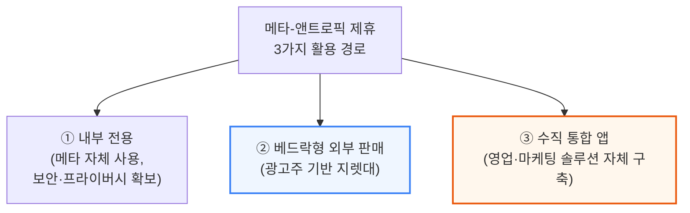

📌 용어 풀이: JP모건 같은 대형 고객이 왜 "비공개 인스턴스"를 원하나
> - 금융사처럼 보안·규제가 엄격한 기업은 자사 데이터가 외부 AI 모델 제공사의 공용 서버를 거치는 것 자체를 꺼림
> - 자체 데이터센터 안에 클로드 전용 인스턴스를 두면 데이터가 회사 경계 밖으로 나가지 않아, 이런 규제산업 고객도 안심하고 프론티어 모델에 전면적으로 베팅할 수 있음

### 추가 유통 잠재력 - 소셜미디어 사용자부터 글래스까지

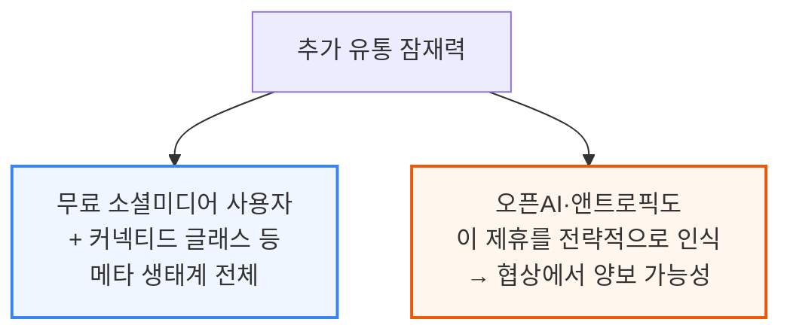

메타는 자사 모델을 우선 배치할 가능성이 높아 보이지만, 옵션 자체는 열어두는 편을 택할 것으로 보입니다. 이 유통력과 네트워크 효과가 워낙 커서, 오픈AI와 앤트로픽 모두 이 제휴를 고도로 전략적인 것으로 보고 있습니다.

---

## 6. 광고 추천 시스템(RecSys) - GEM으로 10배 확장 베팅

**📌 핵심:**
- 2022년 말\~2023년 초만 해도 시장은 메타를 "성숙기에 접어든 저성장 기업"으로 봤지만, 지금은 GPU 투자가 이끈 매출 재가속이 뚜렷 — 학습과 추론 양쪽에서 광고 추천모델(RecSys)이 핵심 동력
- 기존 DLRM(딥러닝 추천모델)은 LLM처럼 컴퓨트를 늘릴수록 성능이 지수적으로 좋아지는 법칙을 따르지 않아 확장에 실패했지만, 메타의 생성형 추천모델 HSTU(계층적 순차 변환 유닛)는 광고 순위 결정을 순차 예측 문제로 재구성해 컴퓨트를 늘릴수록 성능이 좋아지게 만듦 — 기존 대비 순위 지표 약 66% 개선, 메타의 광고 기반 모델 GEM으로 실전 배치됨
- GEM의 효과: ① 광고 성과를 4배 더 잘 끌어올리면서도 성능 향상 단위당 컴퓨트 효율은 오히려 개선 ② 신규 학습 스택은 GPU를 16배 늘려 유효 학습 연산량(FLOPs)을 23배, MFU(연산장치 활용률)도 약 1.4배 끌어올림
- 결론: 저자는 메타가 이 새 모델로 광고 추천 컴퓨트를 10배 이상 늘려도 수익성 있게 흡수할 수 있다고 판단 — GW(기가와트)를 늘릴 때마다 예측 정확도가 직접 개선되는 구조이기 때문. 실제로 2026년 1분기 광고 노출 수는 전년비 19%, 광고 단가는 전년비 12% 증가했고, GEM 학습 GPU를 2배로 늘린 뒤 인스타그램·페이스북 광고 전환율은 각각 5%·3% 상승

---

### 패러다임 전환 - 정체된 DLRM에서 확장되는 HSTU/GEM으로

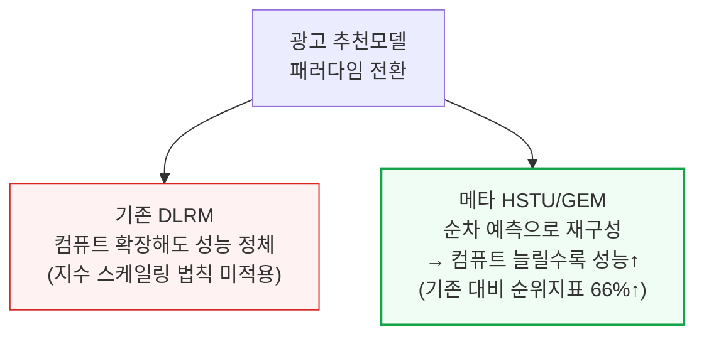

### GEM 모델 효과 - 성과 4배, 학습 효율 대폭 개선

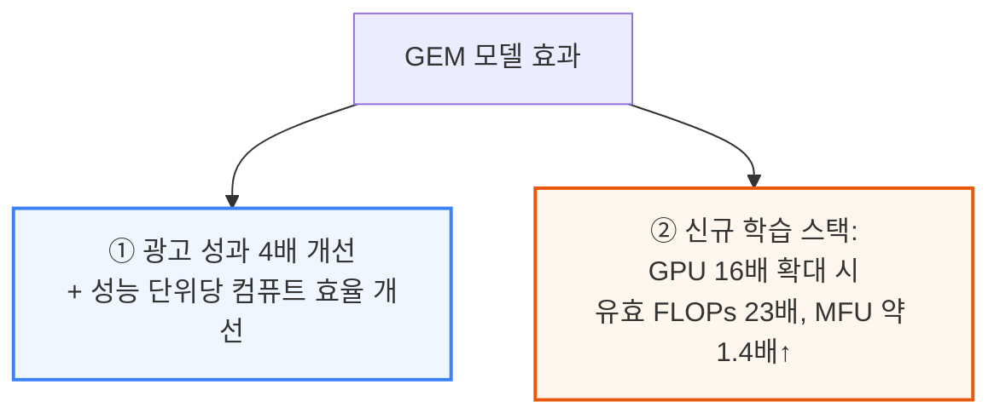

### 실제 성과 - 2026년 1분기 지표

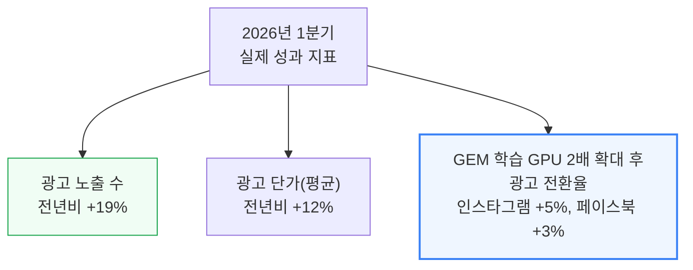

### 매출 성장 경로 2가지 - 노출 확대 vs 단가 인상

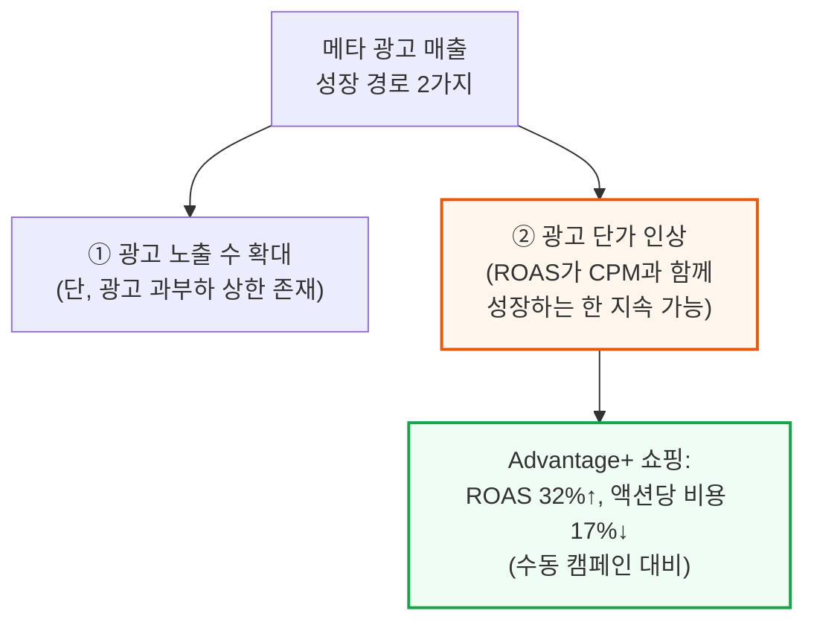

📌 용어 풀이: 왜 "광고 노출을 무한정 늘릴 수 없나"
> - 사용자 피드에 광고를 너무 많이 보여주면 광고 매출은 늘어도 사용자 경험이 나빠져 결국 앱 사용 자체가 줄어드는 역효과가 남 — 이 한계를 "광고 과부하 상한(ad-load ceiling)"이라 부름
> - 그래서 메타는 노출을 늘리는 대신 ROAS(광고비 대비 수익률)가 CPM(광고 단가)과 함께 계속 성장하는 한, 단가를 올리는 방식으로 매출을 늘리는 전략을 병행

---

*작성 진행률: 약 80% 완료*
*업데이트: 4\~6장(오라클과 메타만 남은 이유, 베드락 구상, RecSys 확장) 변환 완료*
