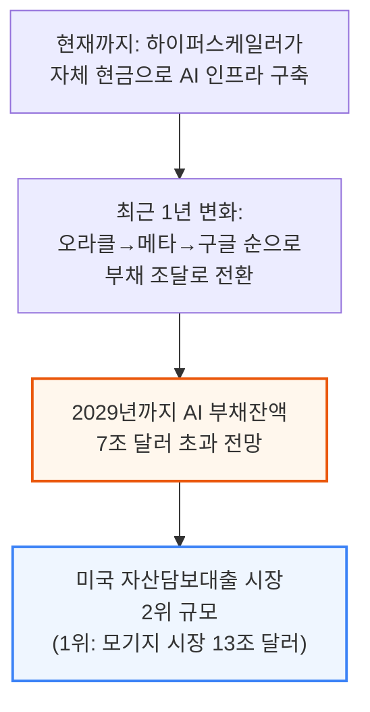
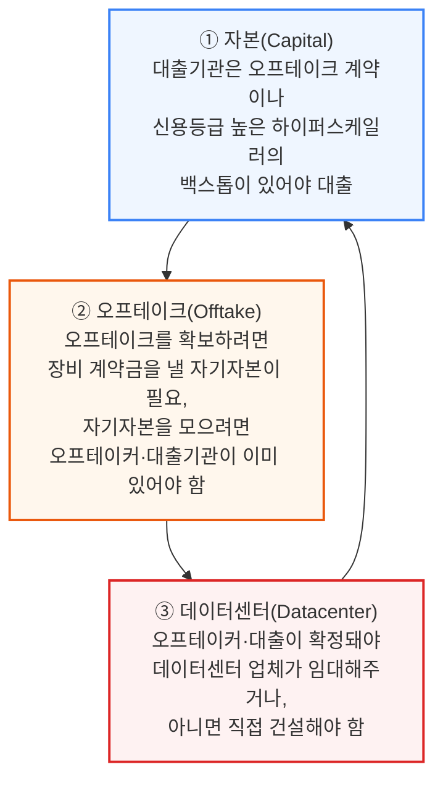
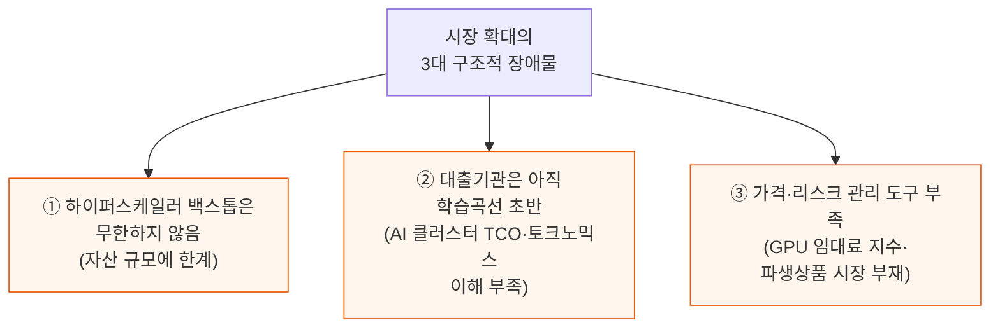
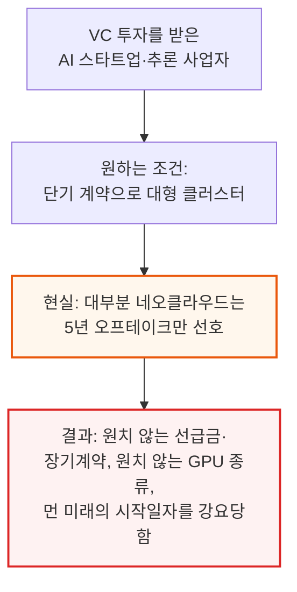
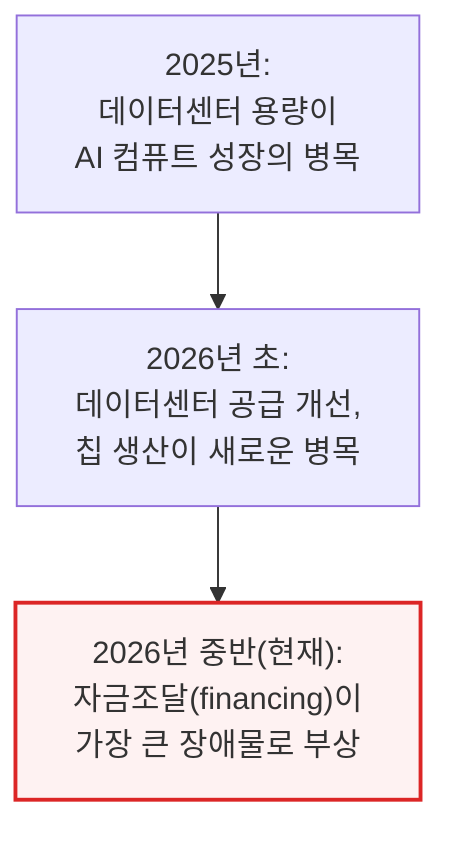
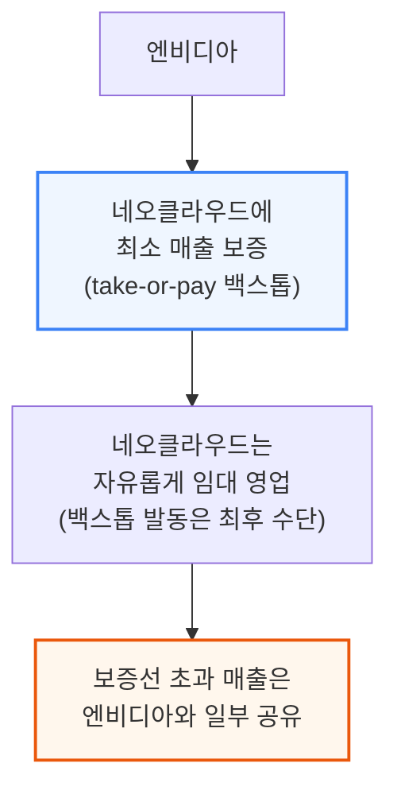
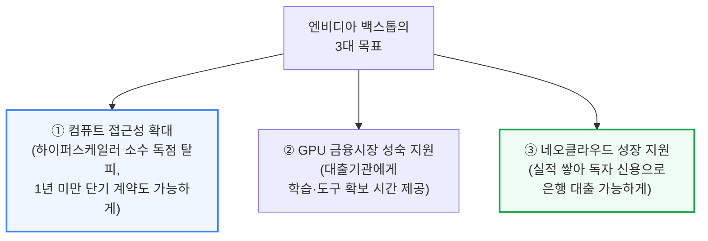
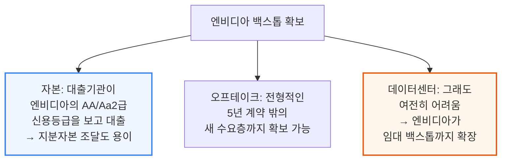

# Nvidia GPU Debt Backstop Unleashes the AI Project Trinity: Capital, Offtake and Datacenters

> **출처**: [SemiAnalysis Newsletter](https://newsletter.semianalysis.com/p/nvidia-gpu-debt-backstop-unleashes)
> **저자**: Daniel Nishball, Cheang Kang Wen, Zane Fong
> **발행일**: 2026-02-05

---

## 📑 목차

### 전체 섹션
 1. [서론 - AI 부채 금융의 부상과 트리니티(자본·오프테이크·데이터센터) 문제](#1-서론---ai-부채-금융의-부상과-트리니티자본오프테이크데이터센터-문제)
 2. [등장: 엔비디아 백스톱](#2-등장-엔비디아-백스톱)
 3. [백스톱은 어떻게 설계되는가](#3-백스톱은-어떻게-설계되는가)
 4. [GPU 대출 가격은 어떻게 매겨지나](#4-gpu-대출-가격은-어떻게-매겨지나)
 5. [대변혁 - GPU 금융시장의 성년기](#5-대변혁---gpu-금융시장의-성년기)
 6. [GPU 대출기관에게 필요한 도구들](#6-gpu-대출기관에게-필요한-도구들)
 7. [현재와 미래의 백스톱 동향](#7-현재와-미래의-백스톱-동향)
 8. [엔비디아 재무제표에 미치는 영향](#8-엔비디아-재무제표에-미치는-영향)
 9. [데이터센터 - 트리니티의 가장 어려운 다리](#9-데이터센터---트리니티의-가장-어려운-다리)
10. [엔비디아의 미국 내 간극 해소 - 직접 데이터센터 임대](#10-엔비디아의-미국-내-간극-해소---직접-데이터센터-임대)
11. [해외 - 소수의 독특한 네오클라우드 성공 사례](#11-해외---소수의-독특한-네오클라우드-성공-사례)

---

## 🔑 용어 정리

본문을 순서대로 읽기 전에 알아두면 좋은 용어들입니다. 자세한 수치와 설명은 본문에서 처음 등장하는 위치에 나옵니다.

- **트리니티 (Trinity)**: AI 데이터센터 하나를 지으려면 반드시 다 갖춰야 하는 3가지 — 자본(대출), 오프테이크(장기 구매 계약), 데이터센터(건물·전력) — 하나라도 없으면 나머지도 구하기 어려운 "닭과 달걀" 구조
- **오프테이크 (Offtake)**: 고객이 향후 수년간 GPU 컴퓨트를 미리 사겠다고 약속하는 장기 구매 계약 — 은행이 대출해줄 때 "이 클러스터가 실제로 팔릴 것"이라는 증거로 요구하는 서류
- **백스톱 (Backstop)**: 신용도 높은 기업(하이퍼스케일러 또는 엔비디아)이 "이 컴퓨트를 아무도 안 빌려가도 우리가 최소한 이만큼은 사주겠다"고 매출 하한선을 보증해주는 계약
- **네오클라우드 (Neocloud)**: 코어위브·네비우스처럼 GPU 서버를 대량으로 사들여 다른 기업에 임대해주는 것이 주업인 클라우드 사업자
- **DSCR (Debt Service Coverage Ratio, 부채상환비율)**: 사업이 벌어들이는 현금이 매 기간 갚아야 할 대출 원리금의 몇 배인지 나타내는 지표 — 은행이 대출 규모를 정할 때 쓰는 핵심 잣대
- **Take-or-pay (테이크 오어 페이)**: "실제로 쓰든 안 쓰든 계약한 금액은 반드시 지불한다"는 조건의 장기 구매 계약 방식
- **콜로케이션 (Colocation, Colo)**: 서버 장비는 고객이 소유하고, 건물·전력·냉각 등 인프라만 데이터센터 업체가 빌려주는 임대 방식
- **IRR (Internal Rate of Return, 내부수익률)**: 투자한 돈이 연평균 몇 %의 수익률로 불어나는지 나타내는 지표 — 프로젝트별 수익성을 비교할 때 쓰는 표준 척도

---

## 1. 서론 - AI 부채 금융의 부상과 트리니티(자본·오프테이크·데이터센터) 문제

**📌 핵심:**
- AI 부채 금융시장은 2029년까지 7조 달러(약 1경 원)를 넘어서는 규모로 성장 — 미국 자산담보대출 시장 중 모기지 시장(13조 달러)에 이어 2위 규모
- 연간 AI 자본지출(GPU·서버·데이터센터 건설비 전체)은 2028년 2조 달러를 돌파하고, 2024\~2029년 누적으로는 약 11.1조 달러에 달할 전망 — 이 거대한 자금은 대부분 은행·사모대출 등 신용시장에서 조달돼야 함
- AI 클러스터 하나를 지으려면 자본(대출)·오프테이크(장기 구매 계약)·데이터센터(건물·전력) 3가지를 동시에 갖춰야 하는데, 이 셋은 서로가 서로의 전제조건이 되는 "닭과 달걀" 구조 — 대출받으려면 구매 계약이 있어야 하고, 구매 계약을 맺으려면 대출과 건물이 있어야 함
- 결론: 지금까지는 대형 사모펀드의 주선과 업계의 위험 감수 덕분에 이 트리니티가 그럭저럭 조립돼 왔지만, 시장 규모가 지금의 수십 배로 커지려면 이 구조적 병목을 근본적으로 풀어야 함

---

### AI 부채시장의 성장 - 모기지 시장 다음가는 규모로

지금까지 대부분의 AI 인프라 구축은 구글·아마존·메타·마이크로소프트·오라클 같은 하이퍼스케일러가 자체 현금(cashflow)으로 지어왔지만, 지난 1년 사이 오라클과 메타에 이어 구글까지 부채(debt) 조달로 방향을 틀기 시작했습니다.

연간 AI 자본지출(GPU·네트워킹·스토리지·부속 CPU 컴퓨트 및 이를 수용할 데이터센터 건설비 포함)은 2028년 2조 달러를 훌쩍 넘어서고, 2024\~2029년 누적 AI 자본지출은 약 11.1조 달러에 이를 전망이며, 신용시장이 이 구축 자금의 주된 조달 창구가 될 것으로 예상됩니다.

### 트리니티(Trinity) - 자본·오프테이크·데이터센터의 순환 의존 구조

AI 컴퓨트 구축을 실행하려면 저자들이 "AI 프로젝트 트리니티"라 부르는 3가지 요소를 모두 갖춰야 하는데, 이 셋은 서로가 서로를 필요로 하는 순환 구조입니다.

📌 용어 풀이: 트리니티가 "불가능한 삼위일체"는 아닌 이유
> - 자본·오프테이크·데이터센터가 서로를 전제조건으로 요구하는 순환 구조이긴 하지만, 실제로는 사모펀드 같은 자본 제공자가 중개자·후원자 역할을 하고, 업계 전체가 어느 정도 위험을 감수하면서 이 고리를 풀어내고 있음
> - 즉 "이론적으로 불가능"해 보여도 영리한 계약 설계와 신용 보강을 통해 실제로는 계속 딜이 성사되고 있다는 뜻

### 3대 구조적 장애물 - 이 시장이 지금 규모의 수십 배로 크려면

부채시장이 2024\~2025년의 수천억 달러 규모에서 2029년 약 7.1조 달러까지 성장하려면, 하이퍼스케일러 외 고객까지 컴퓨트 시장을 넓히는 데 아래 3가지 장애물을 넘어야 합니다.

하이퍼스케일러의 자산 규모는 결국 유한하기 때문에, 5년 만기 하이퍼스케일러 백스톱형 딜이라는 지금의 관행을 벗어나지 못하면 하이퍼스케일러가 백스톱 여력을 소진하는 순간 더는 빌려줄 프로젝트 자체가 사라지는 셈입니다.

### 단기 임대 수요는 외면받는 시장 - 스타트업과 추론 사업자의 딜레마

현재 네오클라우드 시장 구조는 하이퍼스케일러·대형 AI 랩 이외의 고객에게 컴퓨트 접근권을 넓히는 문제와, 단기 임대 공급이 부족한 문제를 동시에 안고 있습니다.

추론(inference) 사업자는 학습(training) 중심의 AI 랩보다 계약기간에 훨씬 민감해서, AI 랩은 3년 이상도 약정하는 반면 추론 사업자는 1년 넘는 계약에는 아예 응하지 않으려 합니다. 1년 임대를 아직 제공하는 몇 안 되는 네오클라우드는 수요가 워낙 많아 계약금 전액 선납(계약 가치의 최대 100%)까지 요구할 수 있고, 이 경우 클러스터 건설비를 선납금만으로 전부 충당해 이론상 무한대의 IRR을 실현하기도 합니다.

---

## 2. 등장: 엔비디아 백스톱

**📌 핵심:**
- AI 컴퓨트 성장의 병목은 2025년 데이터센터 부족 → 2026년 초 칩 생산 부족 → 2026년 중반 금융(파이낸싱) 부족 순으로 이동해왔음
- 엔비디아가 직접 나서서 네오클라우드의 GPU 임대 계약에 백스톱(최소 매출 보증)을 제공하기 시작 — 대가로 보증선 이상 벌어들인 매출의 일부를 나눠 받음
- 엔비디아 백스톱의 3대 목표: ① 컴퓨트 접근성을 하이퍼스케일러 밖으로 확대 ② 대출기관이 학습곡선을 따라잡을 시간 확보 ③ 네오클라우드가 실적을 쌓아 독자적으로 은행 대출을 받을 수 있는 플랫폼으로 성장하도록 지원
- 결론: 이는 저자들이 앞서 "AI의 중앙은행"이라 표현한 역할과 같음 — 다른 대출기관들이 나서길 꺼릴 때 유동성을 공급해 시장이 자립할 때까지 버텨주는 것

---

### 병목의 이동 - 데이터센터에서 칩으로, 다시 자금조달로

### 백스톱 메커니즘 - 최소 매출 보증과 초과수익 공유

엔비디아는 네오클라우드에게 take-or-pay 방식의 최소 매출 보증을 제공하고, 그 대가로 보증 수준 이상으로 벌어들인 매출의 일부를 나눠 받습니다. 네오클라우드는 원하는 다른 고객에게 원하는 기간으로 자유롭게 임대할 수 있고, 실제로는 이 백스톱을 발동시키지 않는 것이 애초의 의도입니다.

### 엔비디아 백스톱의 3대 목표

목표 ③은 하이퍼스케일러 소수만이 아니라 더 많은 구매자 기반을 확보하려는 것이기도 한데, 그 하이퍼스케일러들은 자체 커스텀 칩(실리콘)으로 엔비디아 시스템과 경쟁하려는 유인을 갖고 있기 때문입니다.

### 백스톱으로 트리니티 조립하기

엔비디아가 이 백스톱 프로그램에서 얻는 이득은 단순 증분 매출을 훨씬 넘어섭니다. GPU 시장의 구조 자체를 바꾸려는 것으로, 5년 하이퍼스케일러 백스톱형 딜만이 유일한 구조로 남는다면 엔비디아가 팔 수 있는 시장(TAM) 자체가 곧 병목에 부딪힌다는 점을 저자들은 이미 짚은 바 있습니다.

📌 용어 풀이: 왜 "AI의 중앙은행"인가
> - 2026년 1월 기관 구독자 대상 리포트에서 저자들은 엔비디아를 "AI의 중앙은행"이라 표현
> - 중앙은행은 다른 은행들이 나서길 꺼릴 때 유동성을 공급해 경제 활동을 지탱하다가, 다른 주체들이 준비되면 그 역할을 넘겨주는 존재 — 엔비디아가 지금 네오클라우드 생태계에서 하는 역할이 정확히 이와 같음
> - 대다수 네오클라우드는 대형 하이퍼스케일러에 직접 임대하지 않으면 대규모 GPU 구축 자금을 충분히 조달하지 못함. 소형 구매자들은 GPU를 원하고 값도 치를 수 있지만, 대출기관에게 제시할 신용등급이 없음 — 엔비디아가 2026년 중반 현재 이 역할을 자처하고 나선 것

---

*작성 진행률: 약 18% 완료*
*업데이트: 헤더·목차·용어 정리, 1\~2섹션(서론, 엔비디아 백스톱 등장) 작성 완료*
