# Nvidia GPU Debt Backstop Unleashes the AI Project Trinity: Capital, Offtake and Datacenters

> **출처**: [SemiAnalysis Newsletter](https://newsletter.semianalysis.com/p/nvidia-gpu-debt-backstop-unleashes)
> **저자**: Daniel Nishball, Cheang Kang Wen, Zane Fong
> **발행일**: 2026-02-05

---

## 📑 목차

### 전체 섹션
 1. [서론 - AI 부채 금융의 부상과 트리니티(자본·오프테이크·데이터센터) 문제](#1-서론---ai-부채-금융의-부상과-트리니티자본오프테이크데이터센터-문제)
 2. [등장: 엔비디아 백스톱](#2-등장-엔비디아-백스톱)
 3. [백스톱은 어떻게 설계되는가](#3-백스톱은-어떻게-설계되는가)
 4. [GPU 대출 가격은 어떻게 매겨지나](#4-gpu-대출-가격은-어떻게-매겨지나)
 5. [대변혁 - GPU 금융시장의 성년기](#5-대변혁---gpu-금융시장의-성년기)
 6. [GPU 대출기관에게 필요한 도구들](#6-gpu-대출기관에게-필요한-도구들)
 7. [현재와 미래의 백스톱 동향](#7-현재와-미래의-백스톱-동향)
 8. [엔비디아 재무제표에 미치는 영향](#8-엔비디아-재무제표에-미치는-영향)
 9. [데이터센터 - 트리니티의 가장 어려운 다리](#9-데이터센터---트리니티의-가장-어려운-다리)
10. [엔비디아의 미국 내 간극 해소 - 직접 데이터센터 임대](#10-엔비디아의-미국-내-간극-해소---직접-데이터센터-임대)
11. [해외 - 소수의 독특한 네오클라우드 성공 사례](#11-해외---소수의-독특한-네오클라우드-성공-사례)

---

## 🔑 용어 정리

본문을 순서대로 읽기 전에 알아두면 좋은 용어들입니다. 자세한 수치와 설명은 본문에서 처음 등장하는 위치에 나옵니다.

- **트리니티 (Trinity)**: AI 데이터센터 하나를 지으려면 반드시 다 갖춰야 하는 3가지 — 자본(대출), 오프테이크(장기 구매 계약), 데이터센터(건물·전력) — 하나라도 없으면 나머지도 구하기 어려운 "닭과 달걀" 구조
- **오프테이크 (Offtake)**: 고객이 향후 수년간 GPU 컴퓨트를 미리 사겠다고 약속하는 장기 구매 계약 — 은행이 대출해줄 때 "이 클러스터가 실제로 팔릴 것"이라는 증거로 요구하는 서류
- **백스톱 (Backstop)**: 신용도 높은 기업(하이퍼스케일러 또는 엔비디아)이 "이 컴퓨트를 아무도 안 빌려가도 우리가 최소한 이만큼은 사주겠다"고 매출 하한선을 보증해주는 계약
- **네오클라우드 (Neocloud)**: 코어위브·네비우스처럼 GPU 서버를 대량으로 사들여 다른 기업에 임대해주는 것이 주업인 클라우드 사업자
- **DSCR (Debt Service Coverage Ratio, 부채상환비율)**: 사업이 벌어들이는 현금이 매 기간 갚아야 할 대출 원리금의 몇 배인지 나타내는 지표 — 은행이 대출 규모를 정할 때 쓰는 핵심 잣대
- **Take-or-pay (테이크 오어 페이)**: "실제로 쓰든 안 쓰든 계약한 금액은 반드시 지불한다"는 조건의 장기 구매 계약 방식
- **콜로케이션 (Colocation, Colo)**: 서버 장비는 고객이 소유하고, 건물·전력·냉각 등 인프라만 데이터센터 업체가 빌려주는 임대 방식
- **IRR (Internal Rate of Return, 내부수익률)**: 투자한 돈이 연평균 몇 %의 수익률로 불어나는지 나타내는 지표 — 프로젝트별 수익성을 비교할 때 쓰는 표준 척도

---

## 1. 서론 - AI 부채 금융의 부상과 트리니티(자본·오프테이크·데이터센터) 문제

**📌 핵심:**
- AI 부채 금융시장은 2029년까지 7조 달러(약 1경 원)를 넘어서는 규모로 성장 — 미국 자산담보대출 시장 중 모기지 시장(13조 달러)에 이어 2위 규모
- 연간 AI 자본지출(GPU·서버·데이터센터 건설비 전체)은 2028년 2조 달러를 돌파하고, 2024\~2029년 누적으로는 약 11.1조 달러에 달할 전망 — 이 거대한 자금은 대부분 은행·사모대출 등 신용시장에서 조달돼야 함
- AI 클러스터 하나를 지으려면 자본(대출)·오프테이크(장기 구매 계약)·데이터센터(건물·전력) 3가지를 동시에 갖춰야 하는데, 이 셋은 서로가 서로의 전제조건이 되는 "닭과 달걀" 구조 — 대출받으려면 구매 계약이 있어야 하고, 구매 계약을 맺으려면 대출과 건물이 있어야 함
- 결론: 지금까지는 대형 사모펀드의 주선과 업계의 위험 감수 덕분에 이 트리니티가 그럭저럭 조립돼 왔지만, 시장 규모가 지금의 수십 배로 커지려면 이 구조적 병목을 근본적으로 풀어야 함

---

### AI 부채시장의 성장 - 모기지 시장 다음가는 규모로

지금까지 대부분의 AI 인프라 구축은 구글·아마존·메타·마이크로소프트·오라클 같은 하이퍼스케일러가 자체 현금(cashflow)으로 지어왔지만, 지난 1년 사이 오라클과 메타에 이어 구글까지 부채(debt) 조달로 방향을 틀기 시작했습니다.

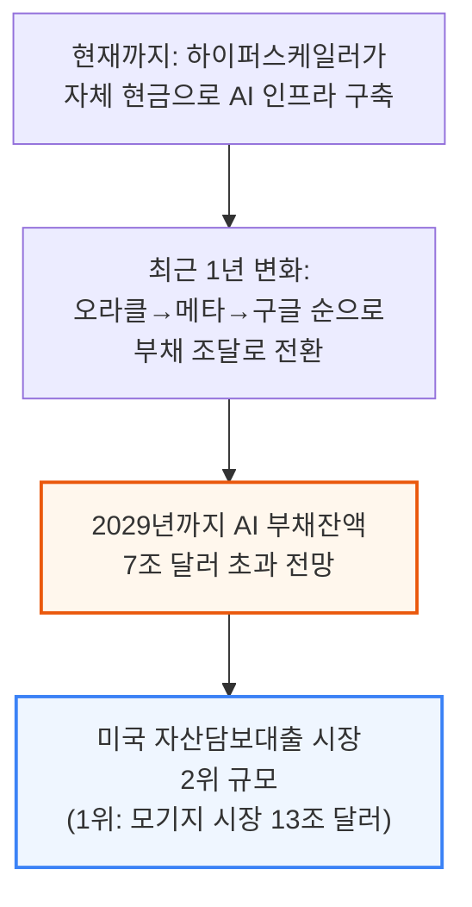

연간 AI 자본지출(GPU·네트워킹·스토리지·부속 CPU 컴퓨트 및 이를 수용할 데이터센터 건설비 포함)은 2028년 2조 달러를 훌쩍 넘어서고, 2024\~2029년 누적 AI 자본지출은 약 11.1조 달러에 이를 전망이며, 신용시장이 이 구축 자금의 주된 조달 창구가 될 것으로 예상됩니다.

### 트리니티(Trinity) - 자본·오프테이크·데이터센터의 순환 의존 구조

AI 컴퓨트 구축을 실행하려면 저자들이 "AI 프로젝트 트리니티"라 부르는 3가지 요소를 모두 갖춰야 하는데, 이 셋은 서로가 서로를 필요로 하는 순환 구조입니다.

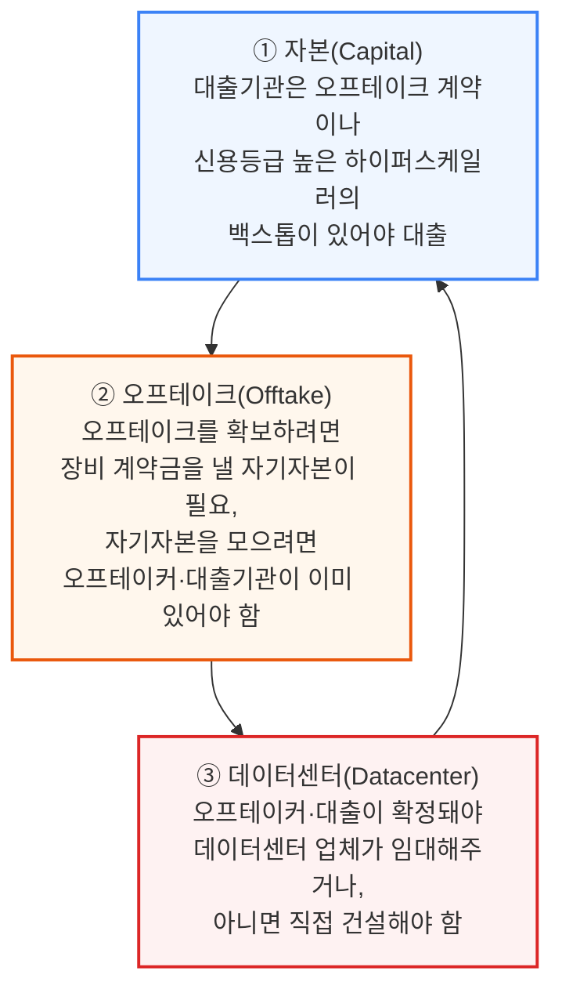

📌 용어 풀이: 트리니티가 "불가능한 삼위일체"는 아닌 이유
> - 자본·오프테이크·데이터센터가 서로를 전제조건으로 요구하는 순환 구조이긴 하지만, 실제로는 사모펀드 같은 자본 제공자가 중개자·후원자 역할을 하고, 업계 전체가 어느 정도 위험을 감수하면서 이 고리를 풀어내고 있음
> - 즉 "이론적으로 불가능"해 보여도 영리한 계약 설계와 신용 보강을 통해 실제로는 계속 딜이 성사되고 있다는 뜻

### 3대 구조적 장애물 - 이 시장이 지금 규모의 수십 배로 크려면

부채시장이 2024\~2025년의 수천억 달러 규모에서 2029년 약 7.1조 달러까지 성장하려면, 하이퍼스케일러 외 고객까지 컴퓨트 시장을 넓히는 데 아래 3가지 장애물을 넘어야 합니다.

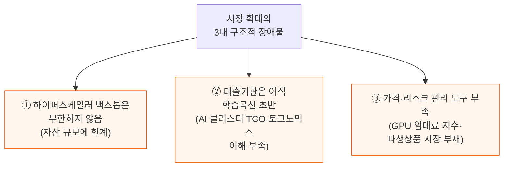

하이퍼스케일러의 자산 규모는 결국 유한하기 때문에, 5년 만기 하이퍼스케일러 백스톱형 딜이라는 지금의 관행을 벗어나지 못하면 하이퍼스케일러가 백스톱 여력을 소진하는 순간 더는 빌려줄 프로젝트 자체가 사라지는 셈입니다.

### 단기 임대 수요는 외면받는 시장 - 스타트업과 추론 사업자의 딜레마

현재 네오클라우드 시장 구조는 하이퍼스케일러·대형 AI 랩 이외의 고객에게 컴퓨트 접근권을 넓히는 문제와, 단기 임대 공급이 부족한 문제를 동시에 안고 있습니다.

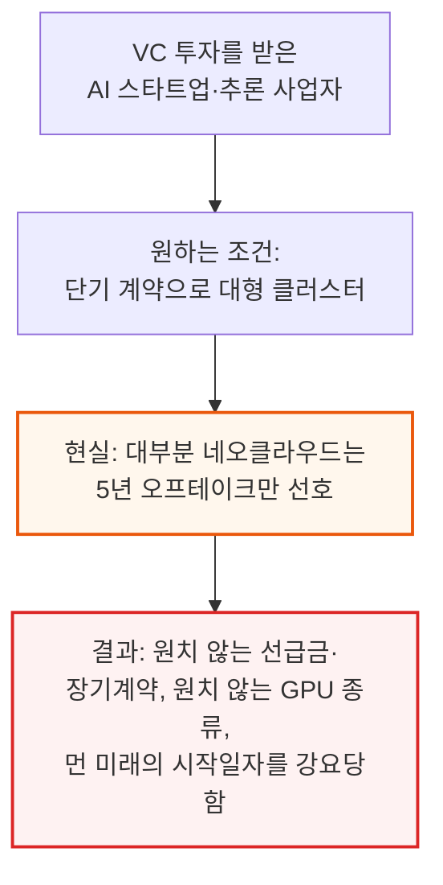

추론(inference) 사업자는 학습(training) 중심의 AI 랩보다 계약기간에 훨씬 민감합니다.
AI 랩은 3년 이상도 약정하는 반면, 추론 사업자는 1년 넘는 계약에는 아예 응하지 않으려 합니다. 1년 임대를 아직 제공하는 몇 안 되는 네오클라우드는 수요가 워낙 많아 계약금 전액 선납(계약 가치의 최대 100%)까지 요구할 수 있고, 이 경우 클러스터 건설비를 선납금만으로 전부 충당해 이론상 무한대의 IRR을 실현하기도 합니다.

---

## 2. 등장: 엔비디아 백스톱

**📌 핵심:**
- AI 컴퓨트 성장의 병목은 2025년 데이터센터 부족 → 2026년 초 칩 생산 부족 → 2026년 중반 금융(파이낸싱) 부족 순으로 이동해왔음
- 엔비디아가 직접 나서서 네오클라우드의 GPU 임대 계약에 백스톱(최소 매출 보증)을 제공하기 시작 — 대가로 보증선 이상 벌어들인 매출의 일부를 나눠 받음
- 엔비디아 백스톱의 3대 목표: ① 컴퓨트 접근성을 하이퍼스케일러 밖으로 확대 ② 대출기관이 학습곡선을 따라잡을 시간 확보 ③ 네오클라우드가 실적을 쌓아 독자적으로 은행 대출을 받을 수 있는 플랫폼으로 성장하도록 지원
- 결론: 이는 저자들이 앞서 "AI의 중앙은행"이라 표현한 역할과 같음 — 다른 대출기관들이 나서길 꺼릴 때 유동성을 공급해 시장이 자립할 때까지 버텨주는 것

---

### 병목의 이동 - 데이터센터에서 칩으로, 다시 자금조달로

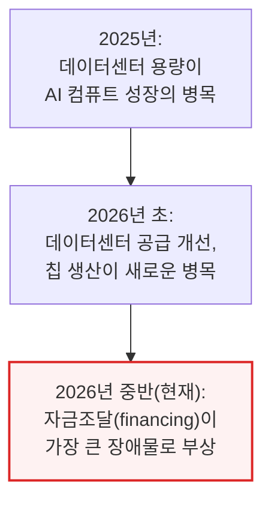

### 백스톱 메커니즘 - 최소 매출 보증과 초과수익 공유

엔비디아는 네오클라우드에게 take-or-pay 방식의 최소 매출 보증을 제공하고, 그 대가로 보증 수준 이상으로 벌어들인 매출의 일부를 나눠 받습니다. 네오클라우드는 원하는 다른 고객에게 원하는 기간으로 자유롭게 임대할 수 있고, 실제로는 이 백스톱을 발동시키지 않는 것이 애초의 의도입니다.

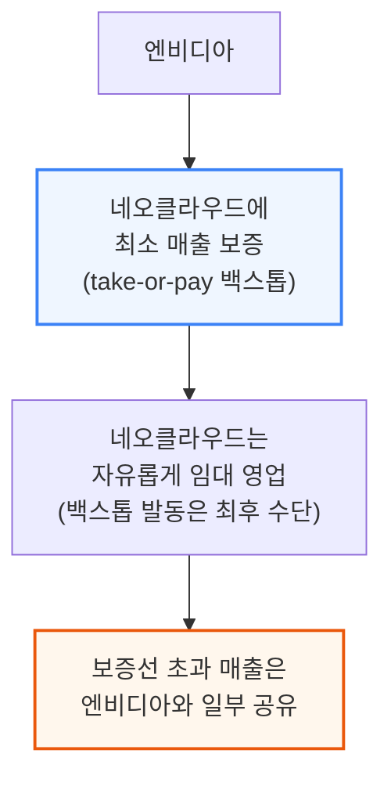

### 엔비디아 백스톱의 3대 목표

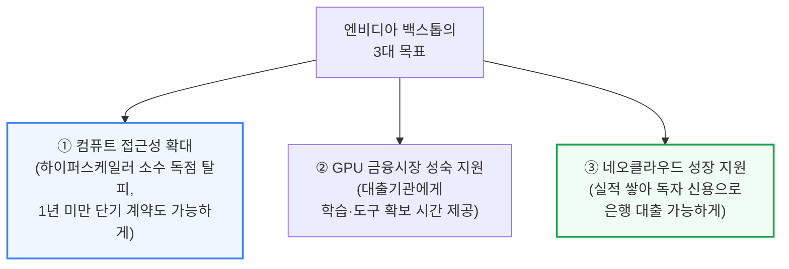

목표 ③은 하이퍼스케일러 소수만이 아니라 더 많은 구매자 기반을 확보하려는 것이기도 한데, 그 하이퍼스케일러들은 자체 커스텀 칩(실리콘)으로 엔비디아 시스템과 경쟁하려는 유인을 갖고 있기 때문입니다.

### 백스톱으로 트리니티 조립하기

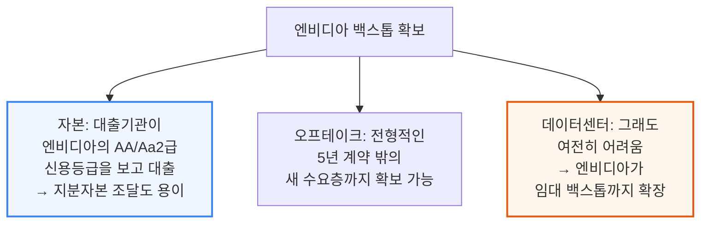

엔비디아가 이 백스톱 프로그램에서 얻는 이득은 단순 증분 매출을 훨씬 넘어섭니다. GPU 시장의 구조 자체를 바꾸려는 것으로, 5년 하이퍼스케일러 백스톱형 딜만이 유일한 구조로 남는다면 엔비디아가 팔 수 있는 시장(TAM) 자체가 곧 병목에 부딪힌다는 점을 저자들은 이미 짚은 바 있습니다.

📌 용어 풀이: 왜 "AI의 중앙은행"인가
> - 2026년 1월 기관 구독자 대상 리포트에서 저자들은 엔비디아를 "AI의 중앙은행"이라 표현
> - 중앙은행은 다른 은행들이 나서길 꺼릴 때 유동성을 공급해 경제 활동을 지탱하다가, 다른 주체들이 준비되면 그 역할을 넘겨주는 존재 — 엔비디아가 지금 네오클라우드 생태계에서 하는 역할이 정확히 이와 같음
> - 대다수 네오클라우드는 대형 하이퍼스케일러에 직접 임대하지 않으면 대규모 GPU 구축 자금을 충분히 조달하지 못함. 소형 구매자들은 GPU를 원하고 값도 치를 수 있지만, 대출기관에게 제시할 신용등급이 없음 — 엔비디아가 2026년 중반 현재 이 역할을 자처하고 나선 것

---

## 3. 백스톱은 어떻게 설계되는가

**📌 핵심:**
- 엔비디아 백스톱은 통상 6년 구조 — 그 기간 엔비디아는 연도별로 미리 합의된 가격에 컴퓨트를 사줄 준비가 돼 있으며, 네오클라우드마다 조건이 개별 협상됨. 예시 커브는 6년 평균 시간당 $2.36로, 저자들은 이를 백스톱 범위 중 낮은 편으로 추정하며 실제 대다수 네오클라우드는 이보다 높은 조건을 받아낼 것으로 예상
- 1년 이하 단기 임대 시나리오 예시: GB300 1년 임대가 시간당 $6.75에서 시작해 시장가 하락에 따라 점차 감소, 6년 고정가 약 $4.00보다 높게 유지되는 것이 정상(단기 임대로 미래 가격 하락 위험을 떠안는 대가)
- 연도별 정산 방식: 네오클라우드는 백스톱 금액까지는 임대료의 100%를 온전히 가져가고, 백스톱을 초과한 부분만 엔비디아와 나눔 — 예시 1년차 계산: 고객 청구가 $6.75, 백스톱 $3.68, 초과분 $3.07 중 40%인 $1.23은 엔비디아, 나머지 $1.84는 네오클라우드가 가져가 네오클라우드는 총 $5.52/hr 실현(백스톱 없었다면 받았을 $6.75보다는 낮음)
- 결론: 6년 전체로 보면 엔비디아의 평균 테이크레이트는 약 18% 수준이지만, 백스톱이 없었다면 애초에 클러스터 자체가 세워지지 못했을 것 — IRR 비교에서도 백스톱이 있는 1년 임대 시나리오가 25.4%로 백스톱 있는 시나리오 중 최고, 백스톱 없는 1년 임대는 그보다 높은 40.7%까지 가능하지만, 백스톱이 실제로 발동돼 엔비디아에 임대하는 상황이 되면 IRR은 0% 또는 마이너스로 떨어짐

---

### 6년 백스톱 커브 - 낮은 편으로 추정되는 평균 $2.36/hr

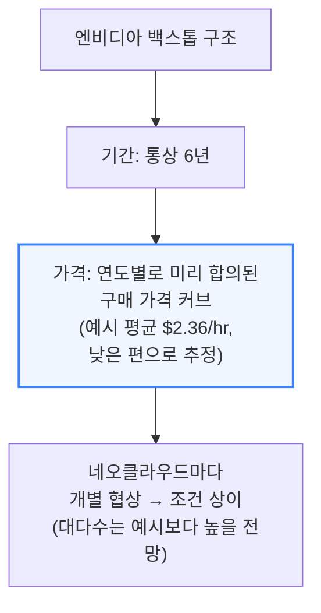

### 시나리오 ① 단기 임대 - 1년 임대가 $6.75에서 하락, 6년 고정가 $4.00 상회

투자 기간은 길고 임대는 짧게 굴리는 "커브 트레이드"를 하는 사업이라면, 단기 임대로 미래 가격 위험을 떠안는 대가로 평균 실현 임대가가 6년 고정가보다 다소 높아야 정상입니다.

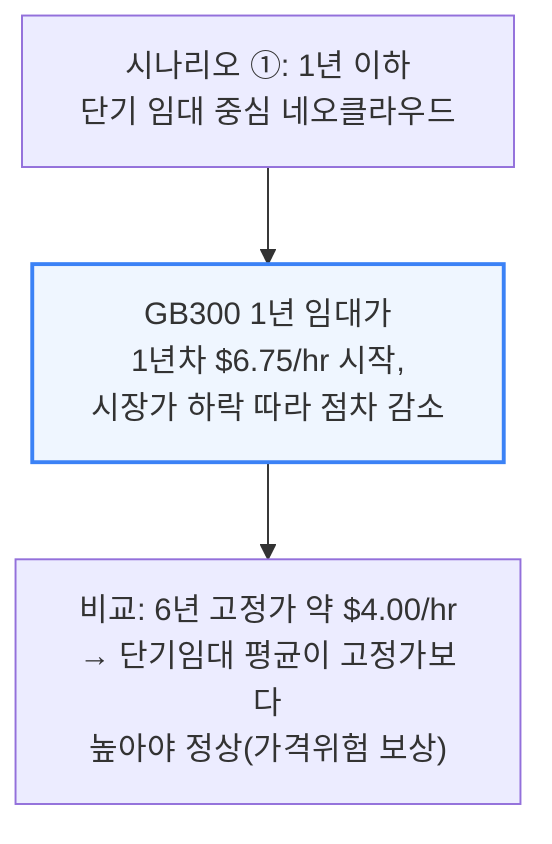

### 수익 배분 계산 예시 - 1년차 $6.75 중 네오클라우드 $5.52 실현

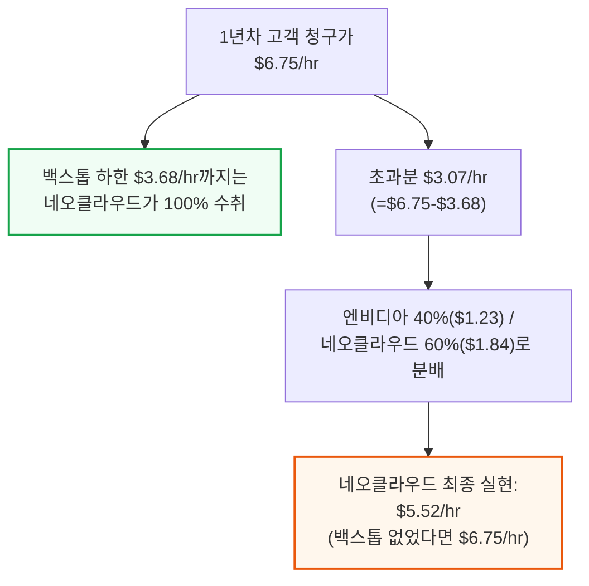

6년 전체 기간으로 계산하면 이 시나리오에서 엔비디아의 평균 테이크레이트는 약 18% 수준이지만, 애초에 백스톱이 없었다면 이 클러스터 자체가 세워지지 못했을 것이라는 점이 핵심입니다.

### 시나리오 ② 6년 고정가 오프테이크 - 사실상 성립하지 않는 모순적 가정

두 번째 시나리오는 6년 고정가 오프테이크를 이미 확보한 경우를 가정하는데, 이는 사실 모순입니다.
6년 고정가 오프테이크를 확보할 수 있다면 애초에 엔비디아 백스톱이 필요 없고, 엔비디아에 수익을 나눠줄 이유도 없기 때문입니다. 이런 컴퓨트를 다시 6년 계약으로 재임대하는 것은 다양한 구매자에게 단기 컴퓨트를 공급한다는 백스톱 프로그램의 취지에도 어긋납니다.

### 시나리오 ③ 백스톱 발동 - 네오클라우드에게는 최후의 안전판

엔비디아도 내부적으로 상당한 컴퓨트 수요가 있지만, 엔비디아와 네오클라우드 모두 실제로 백스톱을 발동시킬 의도는 없습니다. 그래서 백스톱 발동 시나리오에서 네오클라우드의 프로젝트 IRR이 0% 또는 소폭 마이너스로 나오는 것은 놀랍지 않습니다.

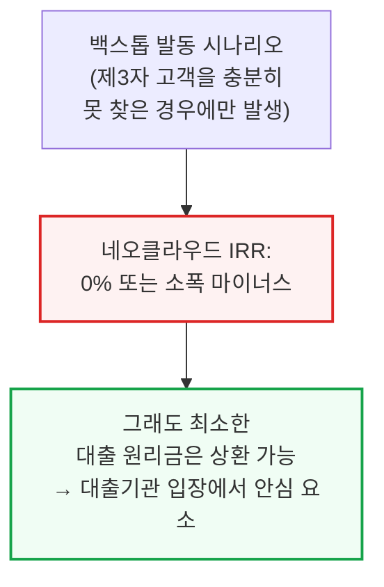

바로 이 지점이 이 구조가 금융조달 가능한 이유입니다 — 이 시나리오의 IRR이 0% 또는 소폭 마이너스라 해도 네오클라우드가 최소한 부채 상환은 계속할 수 있어, 대출기관은 이 구조를 안심하고 받아들입니다. 엔비디아 백스톱이 걸린 클러스터의 대출 심사는 바로 이 "백스톱 발동" 시나리오 기준으로 DSCR(부채상환비율)을 따져 대출 규모를 정합니다.

### 시나리오별 IRR 비교 - 백스톱 있는 1년 임대가 25.4%로 최고

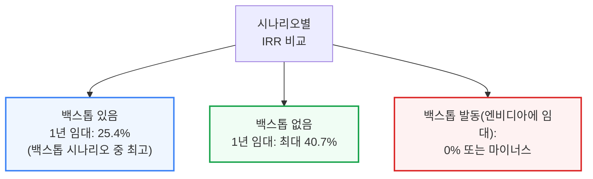

1년 이하 단기 임대 시나리오가 백스톱이 걸린 시나리오 중 가장 높은 IRR(25.4%)을 보입니다.
만약 단기 임대 시장이 예상보다 강해 임대가 하락 폭이 모델보다 작다면 이 IRR은 더 높아질 수 있습니다. 예상대로 백스톱이 없는 경우의 IRR이 더 높지만(1년 임대 무백스톱 최대 40.7%), 백스톱이 실제로 발동돼 그 가격대로 엔비디아에 임대하게 되면 IRR은 0% 또는 마이너스로 떨어집니다.

---

## 4. GPU 대출 가격은 어떻게 매겨지나

**📌 핵심:**
- 장기 오프테이크가 있는 네오클라우드 대출 가격은 네오클라우드 자신의 신용이 아니라 오프테이크를 제공하는 하이퍼스케일러(또는 다른 신용 우량 기업)의 신용 스프레드가 좌우 — 네오클라우드의 실행 리스크(execution risk)만 그 하이퍼스케일러 스프레드 위에 얹혀 추가로 반영됨
- 실제 사례: 코어위브의 5년 무담보 회사채 금리는 약 10%인데, 메타가 백스톱한 85억 달러 규모 DDTL 4.0 대출의 고정금리 트랜치는 5.9%에 불과 — 메타의 5년 채권 금리(약 5.0%)보다 90bp(basis point, 1bp=0.01%p) 높은 수준으로, 이 90bp가 시장이 평가한 코어위브의 실행 리스크
- 네오클라우드가 이 "5년 오프테이크 담보" 공식을 벗어나기 어려운 이유: 무담보로 자금을 조달하면 최상위 네오클라우드조차 금리가 4%p 추가로 붙어, GPU 대출에 흔히 쓰이는 대출채권비율(LTV) 70\~80% 구조에서 수익성에 큰 타격 — 조달금리가 5.62%에서 10%로 오르면 세전이익률(PBT margin)이 14.8%에서 5.4%로 급락
- 결론: 은행이 대출 규모를 정하는 핵심 기준은 DSCR(부채상환비율) — 엔비디아 백스톱이 걸린 대출에서는 백스톱이 실제로 발동됐다고 가정한 매출 기준으로 DSCR을 계산하며, 최소 1.3배를 요구하고 이는 통상 LTV 70\~80% 수준에 대응

---

### 가격 결정 원리 - 네오클라우드가 아닌 오프테이커의 신용이 좌우

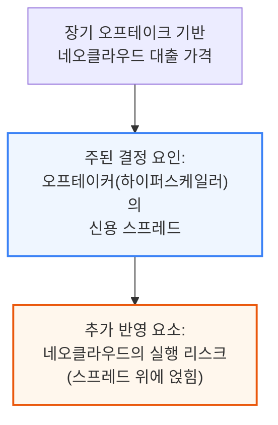

### 코어위브 실제 사례 - 무담보 10% vs 메타백스톱 5.9%

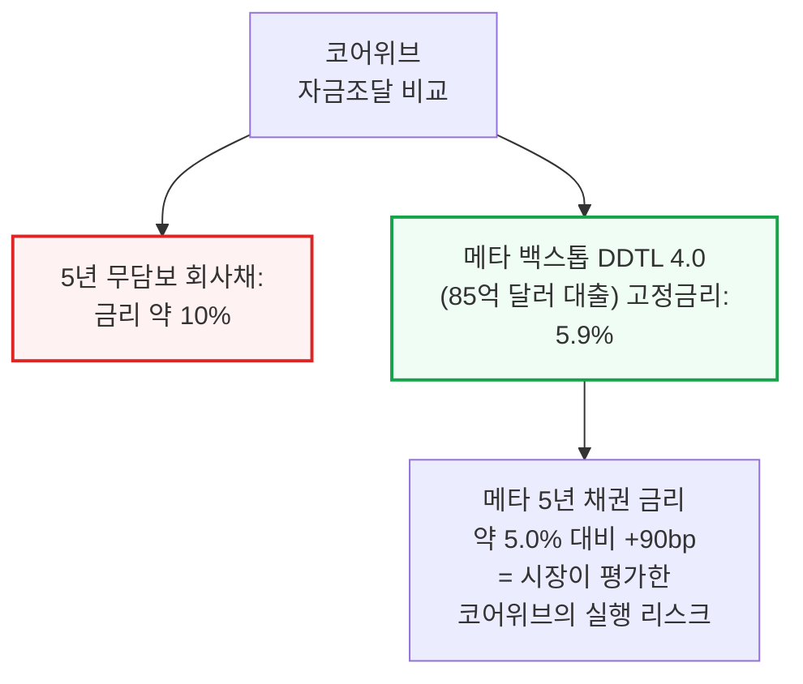

📌 용어 풀이: bp(베이시스 포인트)란
> - 1bp(basis point)는 0.01%p — 금리를 아주 세밀하게 비교할 때 쓰는 단위
> - 90bp는 0.9%p를 의미 — 코어위브의 특정 프로젝트 실행 리스크를 시장이 이 정도 프리미엄으로 가격 매겼다는 뜻

### 왜 금융이 "5년 오프테이크" 틀 밖으로 못 나가나

네오클라우드 금융이 어려운 이유는 복잡하고 생소한 인프라·장비 스택을 다루는 데다, 토큰 수요라는 최종 수요 자체가 아직 낯설고 대출기관 입장에서 리스크 관리에 참고할 축적된 역사도 부족하기 때문입니다.
대출기관 입장에서는 토크노믹스나 AI 모델의 빠른 변화, 스케일업 네트워크 토폴로지의 성능 차이까지 파고들기보다, 하이퍼스케일러의 오프테이크·백스톱에만 집중하는 편이 훨씬 쉽습니다 — 결국 하이퍼스케일러 리스크만 보면 되기 때문입니다.

### 무담보 조달의 비용 - 세전이익률 14.8%→5.4%로 급락

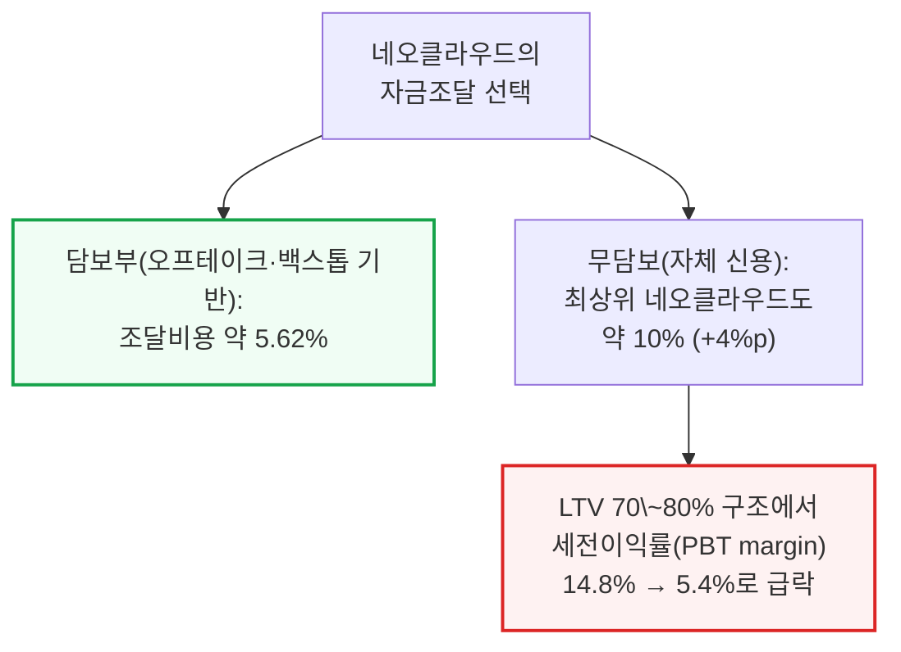

최상위 네오클라우드조차 무담보 조달 시 약 10% 금리를 감수해야 하는데, 실적이 짧은 소형 네오클라우드는 이보다 더 비싼 무담보 조달 비용을 감수해야 할 것으로 예상됩니다.

### 대출 규모 산정 - DSCR 1.3배 기준, LTV 70\~80%

가장 중요한 부채 비율은 DSCR(부채상환비율)로, 사업이 벌어들이는 현금을 매 기간 원리금 상환액으로 나눈 값입니다. 엔비디아 백스톱이 걸린 대출에서 은행은 백스톱이 실제로 발동된 상황을 가정한 매출로 DSCR을 계산하며, 특히 대출 초기 몇 년간 최소 1.3배를 요구합니다.

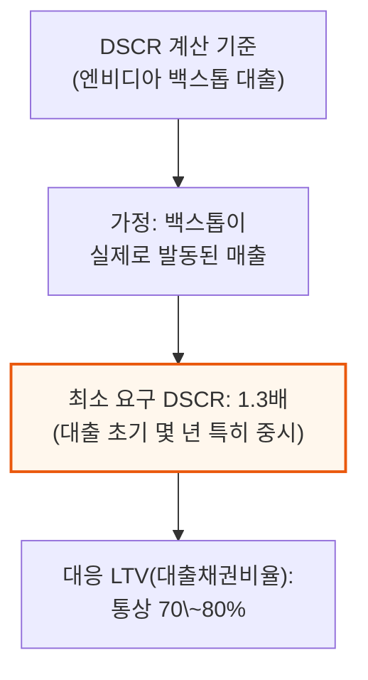

---

## 5. 대변혁 - GPU 금융시장의 성년기

**📌 핵심:**
- GPU 금융시장은 앞서 설명한 막대한 자본 수요를 감당하려면 빠르게 진화해야 하고, 엔비디아 백스톱 클러스터 금융은 바로 이 변화의 선봉
- 과거 대출기관은 가격 위험이 있는 프로젝트에 불편해했고, 장기 오프테이크·잔존가치 쿠션·모회사 보증·벤더 백스톱 등 자산 아래 어떤 형태로든 바닥을 깔아줄 것을 요구했음
- 지금은 SemiAnalysis 같은 자문사의 실사 지원을 받아, 엔비디아 백스톱을 갖고 있는 최상위 대출기관조차 네오클라우드의 운영 품질·시장진출 전략·고객 구성·가격 전략까지 직접 파고들기 시작
- 결론: 초기 대출 금리는 현재의 5년 하이퍼스케일러 백스톱형 딜(SOFR+225bp, 총수익률 약 5.9%)보다는 넓고, 코어위브의 5년 무담보 회사채(약 10%, 제트스프레드 600bp)보다는 좁은 스프레드에서 형성될 것으로 예상 — 궁극적으로는 대출기관이 외부 백스톱 없이도 네오클라우드를 독자 사업으로 평가해 금융을 제공하는 시대로 향하는 과정

---

### 대출기관의 진화 - 자산 뒤 "바닥"에서 사업 자체 평가로

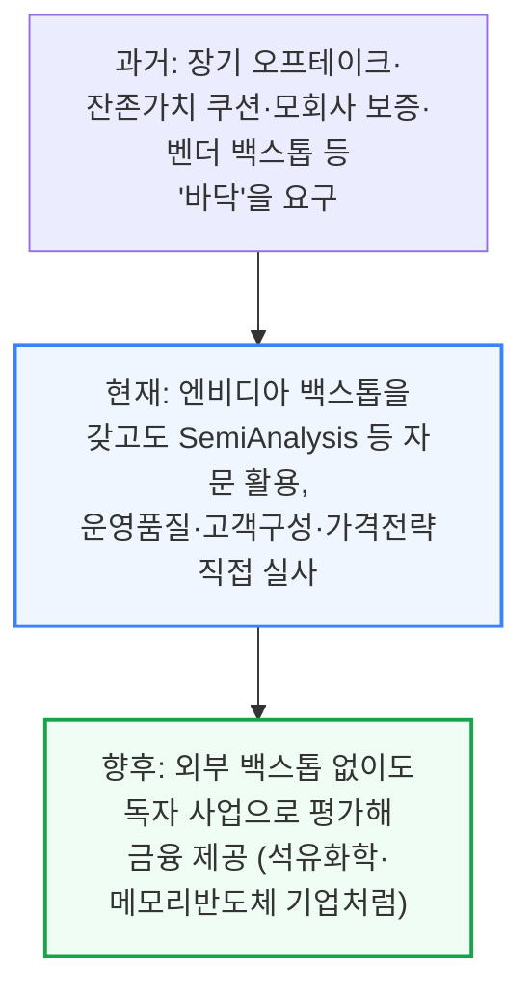

### 초기 스프레드 예상 - 5년 백스톱딜과 무담보채 사이

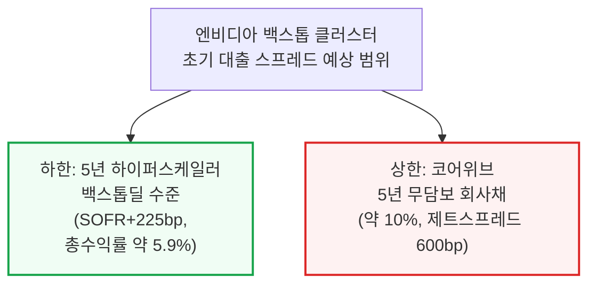

이는 건강한 발전 방향입니다 — 엔비디아 백스톱은 대출기관이 학습곡선을 따라잡고, 궁극적으로 외부 백스톱이나 보증 없이도 네오클라우드를 독립 사업 기반으로 금융할 수 있는 시대를 준비하도록 돕는 지지대 역할을 합니다. 마치 석유화학 기업이나 메모리 반도체 제조사처럼 장기 투자를 하면서도 단기 가격 위험에 노출된 다른 어떤 업종을 평가하듯 말입니다.

---

## 6. GPU 대출기관에게 필요한 도구들

**📌 핵심:**
- 새로운 GPU 대출 질서에서 대출기관은 GPU 임대료 지수, 임대료 전망 모델, 잔존가치(residual value) 추적 모델, 운영사 품질 평가 체계, 최종 수요(토큰 수요→GPU 수요 환산) 모델까지 필요
- SemiAnalysis는 이 필요를 채우는 제품군을 이미 보유 — GPU Rental Pricing Index(전체 기간구조·전 주요 GPU SKU 대상 양자간 계약가 추적, H100 1년물 지수는 무료 공개), AI TCO Model(2023년부터 GPU 임대가 전망, IRR·ROIC·DSCR 등 3대 재무제표 완비)
- ClusterMAX는 업계 유일의 네오클라우드 등급 평가 체계로 신뢰성·네트워킹·가격 등 10개 기준으로 GPU 클라우드 제공사를 평가하며, 토크노믹스 실무는 하이퍼스케일러·AI 랩별 토큰 수요·SKU/모델별 ARR을 추적
- 결론: InferenceX는 실제 GPU 추론 처리량·토큰 효율을 지속 측정해, 대출기관이 담보로 잡은 클러스터의 생산적 산출량(=매출 창출 능력)을 정량화할 수 있게 해주는 핵심 도구

---

### 대출기관에게 필요한 5대 도구

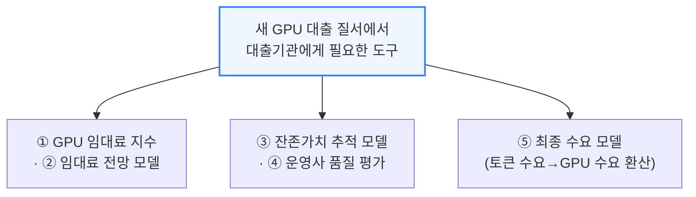

### SemiAnalysis 제품군 - 필요를 채우는 5가지 도구

```mermaid
flowchart TD
    Products["SemiAnalysis 제품군"] --> P1["GPU Rental Pricing Index<br/>(전 SKU 양자간 계약가 추적,<br/>H100 1년물 무료 공개)"]
    Products --> P2["AI TCO Model<br/>(2023년부터 임대가 전망,<br/>IRR·ROIC·DSCR 등<br/>3대 재무제표 완비)"]
    Products --> P3["ClusterMAX<br/>(업계 유일 네오클라우드<br/>등급평가, 10개 기준)"]
    style P1 fill:#f0fdf4,stroke:#16a34a
    style P2 fill:#f0fdf4,stroke:#16a34a
    style P3 fill:#f0fdf4,stroke:#16a34a
```

```mermaid
flowchart TD
    Products2["SemiAnalysis 제품군<br/>(계속)"] --> P4["토크노믹스 실무<br/>(하이퍼스케일러·AI랩별<br/>SKU/모델 ARR 추적)"]
    Products2 --> P5["InferenceX<br/>(실제 GPU 추론 처리량·<br/>토큰 효율 지속 측정)"]
    style P5 fill:#f0fdf4,stroke:#16a34a,stroke-width:2px
```

📌 용어 풀이: 왜 "잔존가치"와 "생산적 산출량"이 대출 심사에 중요한가
> - 잔존가치(residual value)는 GPU가 몇 년 뒤에도 여전히 얼마의 가치를 가질지에 대한 추정 — 대출기관은 담보로 잡은 GPU가 대출 만기 때도 가치를 유지하는지를 알아야 대출 규모를 정할 수 있음
> - InferenceX가 측정하는 "생산적 산출량"은 클러스터가 실제로 얼마나 많은 토큰을 효율적으로 처리하는지를 뜻하며, 이는 곧 그 클러스터가 창출할 수 있는 매출 능력과 직결돼 대출 상환 능력을 가늠하는 실질적 근거가 됨

ClusterMAX는 상업적 목적으로는 SemiAnalysis의 별도 승인 없이 사용할 수 없으며, 이를 활용한 정교한 실사(due diligence)를 통해 자본 제공자에게 거래상대방·담보 위험을 평가할 표준화된 품질 프레임워크를 제공합니다.

---

## 7. 현재와 미래의 백스톱 동향

**📌 핵심:**
- 엔비디아 백스톱 프로그램은 이제 막 시작 단계로, 지금까지 발표된 딜은 전부 아시아태평양(APAC) 지역에 집중 — SharonAI(호주, 72MW→132MW)와 Firmus(인도네시아 바탐, 360MW)가 대표 사례
- SharonAI는 6년 백스톱 아래 최대 GB300 4만 대까지 확대, 총 백스톱 가치 48.8억 달러(6년 평균 GPU당 시간당 내재 플로어 약 $2.33), 2027년 중반까지 누적 5.5만 대 이상의 엔비디아 GPU 확보를 목표
- Firmus는 싱가포르 H100(침수냉각)에서 시작해 호주 멜버른 42MW 자체건설 클러스터(1.8만 대 GB300, 블랙스톤 주도 100억 달러 대출 + Coatue 지원)로 성장했고, 최근 발표된 바탐 360MW 클러스터는 6년간 250\~300억 달러의 고객 매출을 전망하며 군보르(Gunvor)와 600MW 규모 신재생 에너지 딜도 별도 체결
- 결론: 엔비디아만 백스톱을 하는 것은 아님 — AMD도 2025년부터 AWS·OCI·Digital Ocean·Vultr·Tensorwave·Crusoe 등에 백스톱을 제공해왔으며, 앞으로 엔비디아와 파트너십으로 발표되는 클러스터 다수가 실제로는 백스톱을 기반으로 지어진 것으로 추후 확인될 전망

---

### SharonAI(호주) - 72MW에서 132MW로

```mermaid
flowchart TD
    Sharon["SharonAI (호주)<br/>2026년 6월 발표"] --> Scale["72MW AI 팩토리<br/>→ GB300 최대 4만 대,<br/>6년 백스톱"]
    Scale --> Value["총 백스톱 가치 48.8억 달러<br/>(GPU당 시간당 내재 플로어<br/>평균 약 $2.33, 6년 평균)"]
    Value --> Growth["향후: 132MW로 확장<br/>(102MW 계약 확정),<br/>2027년 중반까지<br/>누적 5.5만+ GPU 목표"]
    style Value fill:#eff6ff,stroke:#3b82f6,stroke-width:2px
    style Growth fill:#f0fdf4,stroke:#16a34a,stroke-width:2px
```

### Firmus(인도네시아·호주) - 싱가포르에서 바탐 360MW까지 성장

```mermaid
flowchart TD
    FirmusStart["Firmus 성장 경로"] --> S1["싱가포르: H100,<br/>침수냉각 방식"]
    S1 --> S2["멜버른(호주): 1.8만 대 GB300,<br/>42MW 자체건설<br/>(100억 달러 대출,<br/>블랙스톤 주도+Coatue)"]
    S2 --> S3["바탐(인니) 360MW<br/>(2026-06-29 발표,<br/>DayOne 시설 KITP 입주 예정)"]
    style S2 fill:#eff6ff,stroke:#3b82f6,stroke-width:2px
    style S3 fill:#fff7ed,stroke:#ea580c,stroke-width:2px
```

Firmus는 바탐 360MW 클러스터를 통해 AI 네이티브 기업·엔터프라이즈·추론 사업자 등 다양한 고객에게 다양한 임대기간으로 컴퓨트를 개방할 계획이며, 6년간 250억\~300억 달러의 고객 매출을 예상한다고 발표했습니다.
앞서 설명한 구조대로 백스톱 수준 이상의 매출 일부는 엔비디아와 공유될 것으로 예상됩니다. 이와 별개로 Firmus는 군보르(Gunvor)와 600MW 규모의 확정 에너지(firm-energy) 계약도 체결했는데, 이는 2032년까지 남호주에서 1.2GW 규모 신재생에너지 개발과 1.5GWh 저장 설비를 뒷받침합니다.
다만 GPU를 실제로 배치하려면 Firmus는 여전히 별도의 데이터센터 사업자를 구하거나 직접 건설해야 합니다.

### 엔비디아만의 게임이 아니다 - AMD도 2025년부터 백스톱 제공 중

```mermaid
flowchart TD
    AMDback["AMD 백스톱<br/>(2025년부터 제공)"] --> Clients["대상: AWS·OCI·<br/>Digital Ocean·Vultr·<br/>Tensorwave·Crusoe 등"]
    Clients --> Mechanism["구조: 고객이 AMD GPU<br/>더 많이 구매하는 대가로,<br/>네오클라우드가 다 못 판<br/>용량을 AMD 자체<br/>SW 개발용으로 장기 임차"]
    style Mechanism fill:#fff7ed,stroke:#ea580c,stroke-width:2px
```

이 외에도 아직 공개되지 않은 다수의 네오클라우드 백스톱 딜이 더 있는 것으로 알려져 있으며, 저자들은 앞으로 엔비디아와 파트너십으로 발표되는 클러스터 상당수가 실제로는 엔비디아 백스톱을 기반으로 지어졌다는 사실이 추후 확인될 것으로 전망합니다.

---

## 8. 엔비디아 재무제표에 미치는 영향

**📌 핵심:**
- 백스톱 프로그램은 엔비디아의 대차대조표와 손익계산서 모두에서 점점 뚜렷해질 전망 — 대차대조표에서는 실제 자금이 들어간 자산이 아니라 우발채무(contingent guarantee)로 분류돼 발동 전까지는 부외(off-balance-sheet) 항목으로 남고, 손익계산서에서는 백스톱 하한 이상 매출의 40\~60% 배분(평균 테이크레이트 약 18\~20%)이라는 신규 수익원이 생김 — 이 수익은 거의 순수 마진에 가깝고 계약 기간 내내 반복해서 발생
- 저자들은 엔비디아의 클라우드서비스계약(cloud service agreement) 잔액이 F1/27(2027년 1월 회계연도 말) 775억 달러, F1/29 말에는 1,753억 달러까지 성장할 것으로 모델링 — 이는 F1/27 932MW(이미 발표된 432MW 포함: Firmus 360MW+SharonAI 72MW), F1/28 +1,000MW, F1/29 +1,500MW의 백스톱 대상 용량 가정에 기반하며, 100MW 백스톱마다 약 59억 달러가 우발채무 잔액에 추가되는 셈
- 백스톱 프로그램에서 나오는 엔비디아의 증분 매출은 F1/27 18억 달러에서 F1/29 139억 달러까지 성장할 것으로 전망 — 엔비디아 입장에서는 하이퍼스케일러·네오클라우드·백스톱 네오클라우드 중 어디에 컴퓨트를 배분할지 선택할 수 있는 한, 컴퓨트 플랫폼 매출을 장기적으로 더 키워주는 백스톱 네오클라우드로 배분을 늘릴 유인이 뚜렷함
- 결론: 엔비디아의 구매자 4단계 동심원 구조에서 안쪽으로 갈수록(전체 구매자→네오클라우드→NCP(엔비디아 클라우드 파트너)→백스톱 걸린 NCP) 엔비디아의 경제적 이득은 깊어짐 — 백스톱은 사업자를 더 안쪽 동심원(금융 가능한 풀)으로 끌어올리는 지렛대이자, 동시에 엔비디아가 그 풀에서 반복적 가치를 더 많이 뽑아내는 장치로, 결국 파이 자체를 키우면서 그 파이에서 차지하는 몫도 함께 키우는 구조

---

### 대차대조표·손익계산서 영향

```mermaid
flowchart TD
    Impact["엔비디아 재무제표<br/>영향"] --> BS["대차대조표:<br/>클라우드서비스계약 항목<br/>(우발채무, 발동 전까지<br/>부외 처리)"]
    Impact --> PL["손익계산서:<br/>백스톱 초과분의<br/>40\~60% 배분<br/>(평균 테이크레이트 18\~20%,<br/>거의 순수마진, 반복 매출)"]
    style PL fill:#f0fdf4,stroke:#16a34a,stroke-width:2px
```

### 클라우드서비스계약 잔액 전망 - 775억→1,753억 달러

```mermaid
flowchart TD
    CSAgrowth["클라우드서비스계약<br/>잔액 전망"] --> F27["F1/27 말: 775억 달러<br/>(932MW 기준,<br/>이미 발표 432MW 포함)"]
    F27 --> F28["F1/28: +1,000MW 추가"]
    F28 --> F29["F1/29 말: 1,753억 달러<br/>(+1,500MW 추가 반영)"]
    F29 --> Rate["환산: 100MW 백스톱마다<br/>약 59억 달러<br/>우발채무 잔액 추가"]
    style F29 fill:#eff6ff,stroke:#3b82f6,stroke-width:2px
    style Rate fill:#fff7ed,stroke:#ea580c,stroke-width:2px
```

### 백스톱 증분 매출 전망 - 18억→139억 달러

```mermaid
flowchart TD
    Rev["엔비디아 백스톱<br/>증분 매출 전망"] --> R27["F1/27: 18억 달러"]
    R27 --> R29["F1/29: 139억 달러"]
    style R29 fill:#f0fdf4,stroke:#16a34a,stroke-width:2px
```

엔비디아가 컴퓨트를 하이퍼스케일러·네오클라우드·백스톱 네오클라우드 중 어디에 배분할지 선택할 수 있는 이상, 컴퓨트 플랫폼 매출을 장기적으로 더 높여주는 백스톱 네오클라우드 쪽으로 갈수록 더 많은 용량을 돌리는 것이 합리적입니다.

### 4단계 동심원 구조 - 안쪽으로 갈수록 깊어지는 엔비디아의 이득

컴퓨트 구매자를 안쪽으로 갈수록 좁아지는 4개의 동심원으로 그려볼 수 있으며, 안쪽 원일수록 엔비디아가 벌어들이는 몫이 커집니다.

```mermaid
flowchart TD
    Pool1["① 전체 구매자<br/>일회성 하드웨어 마진만,<br/>가장 넓고 얕은 풀"] --> Pool2["② 네오클라우드<br/>칩을 임대사업으로 전환,<br/>반복 구매자지만<br/>여전히 하드웨어 경제학"]
    Pool2 --> Pool3["③ NCP<br/>(엔비디아 클라우드 파트너)<br/>참조설계·우선배정 등 지원↔<br/>표준화·고착도 확보"]
    Pool3 --> Pool4["④ 백스톱 걸린 NCP<br/>일회성 하드웨어 매출이<br/>반복적 순수마진 매출로 전환,<br/>다운스트림 임대수익 일부 확보"]
    style Pool1 fill:#eff6ff,stroke:#3b82f6
    style Pool4 fill:#f0fdf4,stroke:#16a34a,stroke-width:2px
```

📌 용어 풀이: NCP(엔비디아 클라우드 파트너)란
> - NCP(Nvidia Cloud Partner)는 엔비디아가 공식 인증한 네오클라우드 등급으로, 참조 설계·우선 물량 배정·엔지니어링·시장진출 지원을 받는 대신 엔비디아는 표준화된 고객군과 높은 고착도(stickiness)를 확보
> - 백스톱까지 더해지면 엔비디아는 클러스터에 신용을 지원하고 그 대가로 클라우드 매출의 일부를 받는 관계로 발전 — 일회성 하드웨어 판매가 반복적이고 거의 순수마진인 매출로 바뀌는 지점

풀이 엔비디아 생태계·목표와 더 부합하는 구매자 쪽으로 좁아질수록 경제성은 더 깊어집니다. 백스톱은 사업자를 더 많은 금융 가능한 풀로 끌어올리는 지렛대이면서, 동시에 엔비디아가 바로 그 풀에서 반복적 가치를 더 뽑아내는 장치 — 엔비디아는 파이 자체를 키우면서 동시에 그 파이에서 차지하는 몫도 함께 키우는 셈입니다.

이제 엔비디아의 백스톱 프로그램이 트리니티의 오프테이크·자본 두 다리를 어떻게 개선할 수 있는지 살펴봤으니, 남은 한 다리인 데이터센터로 넘어가 보겠습니다.

---

## 9. 데이터센터 - 트리니티의 가장 어려운 다리

**📌 핵심:**
- 많은 데이터센터 사업자는 마이크로소프트 같은 하이퍼스케일러와 직접 10\~15년 오프테이크를 맺을 수 있는데 굳이 네오클라우드에 임대할 유인을 못 느낌 — 심지어 최종 사용자가 AI 랩인데 중간에 네오클라우드가 끼는 구조는 데이터센터 사업자 입장에서 역설적으로 비칠 정도
- 실제로 네오클라우드向 임대는 하이퍼스케일러·투자적격(IG) 등급 거래 대비 임대수익률(Yield-on-cost, 프로젝트 비용 대비 연간 매출 비율)이 3\~5%p 더 높게 책정 — 가격 차별이 명확히 나타남
- 이렇게 더 비싼 이유: 네오클라우드의 현금흐름 확실성(=사실상의 신용도)이 투자적격 임차인보다 약하다고 평가돼, 콜로케이션 업체에 더 높은 임대료($/kW/월)를 내야 하고, 이는 다시 더 높은 임대수익률로 이어짐 — 이 프리미엄은 ① 콜로 프로젝트 자체의 대출 조달금리가 더 높다는 점 ② 강제 상환 일정·현금소지(cash sweep) 등 더 가혹한 대출 조건(통상 약 3년 내 상환·전액 재융자)을 대출기관이 요구한다는 점 2가지를 보상하기 위함
- 결론: 만약 네오클라우드가 이 웃돈을 내지 않는다면 같은 용량을 하이퍼스케일러에 임대할 수 있는 상황에서 사업자가 굳이 네오클라우드에 임대할 재무적 유인 자체가 사라짐 — 즉 이 웃돈이 데이터센터 다리를 성립시키는 핵심 조건

---

### 데이터센터 업체의 딜레마 - 왜 네오클라우드에 임대하나

```mermaid
flowchart TD
    Operator["데이터센터 사업자"] --> Option["선택지: 마이크로소프트 등<br/>하이퍼스케일러와<br/>직접 10\~15년 오프테이크"] --> Q["질문: 왜 굳이<br/>네오클라우드를<br/>사이에 끼워주나?"]
    style Q fill:#fff7ed,stroke:#ea580c,stroke-width:2px
```

### 임대수익률 격차 - 네오클라우드가 3\~5%p 더 높음

```mermaid
flowchart TD
    YoC["임대수익률(Yield-on-cost)<br/>비교"] --> Hyper["하이퍼스케일러·IG등급 거래"]
    YoC --> Neo["네오클라우드向 거래:<br/>+3\~5%p 더 높음"]
    Neo --> Why["이유: 네오클라우드의<br/>현금흐름 확실성이<br/>더 약하다고 평가"]
    style Neo fill:#fff7ed,stroke:#ea580c,stroke-width:2px
    style Why fill:#fef2f2,stroke:#dc2626,stroke-width:2px
```

### 웃돈의 구조 - 대출금리·상환조건 2가지를 보상

```mermaid
flowchart TD
    Premium["네오클라우드가<br/>더 내는 임대료 웃돈"] --> Reason1["① 콜로 프로젝트 자체의<br/>대출 조달금리가 더 높음<br/>(불확실한 현금흐름 반영)"]
    Premium --> Reason2["② 더 가혹한 대출 조건<br/>(강제상환·현금소지,<br/>통상 약 3년 내 상환·재융자)"]
    Reason2 --> Result["웃돈이 있어야<br/>사업자가 그 조건으로<br/>대출을 상환·상각 가능"]
    style Result fill:#eff6ff,stroke:#3b82f6,stroke-width:2px
```

이 웃돈이 없다면 같은 용량을 하이퍼스케일러에 임대할 수 있는 상황에서 사업자가 네오클라우드에 임대할 재무적 유인이 아예 사라집니다. 미국 내 데이터센터 임대 계약을 임대료($/kW/월)와 임대수익률 기준으로 동일선상에서 비교하면, 이 가격 차별 구조가 거래 형태별로 뚜렷하게 나타납니다.

---

## 10. 엔비디아의 미국 내 간극 해소 - 직접 데이터센터 임대

**📌 핵심:**
- 엔비디아 GPU 백스톱만으로는 이 "닭과 달걀" 문제가 완전히 풀리지 않아, 엔비디아는 콜로케이션 업체로부터 데이터센터 용량을 직접 임차한 뒤 이를 네오클라우드에 재임대하는 방식까지 나섬
- GTC 직후 미국에서 이런 정책 변화가 확인됐으며, 최근 2개 분기 동안에만 700MW 이상이 체결됐고, 올해 여러 GW(기가와트) 규모가 추가로 임차될 것으로 전망 — 여러 GW 규모의 캠퍼스가 협상 막바지 단계에 있는 것으로도 추적됨
- 논리는 GPU 클러스터 백스톱과 같음 — 오프테이커(대개 IG등급)가 이미 확보돼야 임대가 성사되는데, 오프테이커는 데이터센터 용량이 이미 확보된 걸 보고 싶어함. 엔비디아가 이 간극을 직접 메워, 3자(임대인·임차인·백스톱 제공자) 구조를 임대인·엔비디아 2자 구조로 단순화
- 결론: 이는 트리니티의 데이터센터 다리를 크게 진전시키지만, 동시에 엔비디아는 구글의 TPU 외부 판매(역시 백스톱 방식)와도 경쟁해야 하는 처지 — 다만 구글은 주로 Fluidstack·앤트로픽과만 거래하는 반면 엔비디아는 지원해야 할 네오클라우드 수 자체가 훨씬 많아 상황이 더 도전적

---

### 왜 직접 임대까지 나섰나 - 백스톱만으론 안 풀린 간극

```mermaid
flowchart TD
    Gap["엔비디아 GPU 백스톱만으로는<br/>여전히 안 풀리는 간극"] --> Chicken["오프테이커는 데이터센터<br/>확보를 먼저 보고 싶어하고,<br/>임대인은 오프테이커<br/>확보를 먼저 보고 싶어함"]
    Chicken --> Solution["엔비디아가 직접 임차 후<br/>네오클라우드에 재임대<br/>(3자→2자 구조로 단순화)"]
    style Solution fill:#f0fdf4,stroke:#16a34a,stroke-width:2px
```

### 직접 임대 규모 - 최근 2개 분기 700MW+

```mermaid
flowchart TD
    Direct["엔비디아 직접<br/>데이터센터 임대"] --> Recent["최근 2개 분기:<br/>700MW+ 체결"]
    Recent --> Outlook["올해 전망:<br/>여러 GW 추가 임차<br/>+ 여러 GW 캠퍼스<br/>막바지 협상 중"]
    style Outlook fill:#eff6ff,stroke:#3b82f6,stroke-width:2px
```

### 경쟁 구도 - 구글의 TPU 외부 백스톱 판매와 정면 경쟁

```mermaid
flowchart TD
    Compete["백스톱 전쟁"] --> NvidiaSide["엔비디아: 지원해야 할<br/>네오클라우드 다수<br/>(상황 더 도전적)"]
    Compete --> GoogleSide["구글: 주로 Fluidstack·<br/>앤트로픽 소수와만 거래<br/>(TPU 외부 백스톱 판매)"]
    style NvidiaSide fill:#fff7ed,stroke:#ea580c,stroke-width:2px
    style GoogleSide fill:#eff6ff,stroke:#3b82f6
```

미국 시장에서는 이런 전략이 계속돼 수백억 달러가 네오클라우드 생태계로 유입될 것으로 예상되는 반면, 해외 네오클라우드들은 조용히 어려움을 겪어온 것으로 파악됩니다.

---

## 11. 해외 - 소수의 독특한 네오클라우드 성공 사례

**📌 핵심:**
- Firmus의 초기 사례: 싱가포르 사업을 촉발한 최초 투자는 데이터센터 사업자인 STT GDC로부터 나왔는데, STT GDC가 자본과 데이터센터 2개 다리를 동시에 제공하고 Firmus가 나머지 오프테이크 다리를 찾는 리스크를 감수해준 독특한 구조 — 이후 블랙스톤 투자를 받아 멜버른·태즈메이니아 론서스턴 자체건설 프로젝트로 확장
- 인도네시아 바탐에서는 BW Digital이 한 네오클라우드와 120MW 계약을 최근 체결한 것으로 추정 — 이 부지는 2025년 7월 투기적으로(사전 확정 임차인 없이) 착공됐는데, 네오클라우드의 등장이 그 투기적 리스크 상당 부분을 해소하며 딜 성사의 결정적 요인이 됨
- 결론: 엔비디아 백스톱은 이미 이 지역을 재편 중 — 네오클라우드는 아시아태평양에서 가장 빠르게 성장하는 데이터센터 고객군으로 부상했고, DayOne 같은 사업자들은 네오클라우드가 앞으로 주요 시장 참여자가 될 것이라 보고 지금이 이 성장 시장에 대응할 시점이라는 쪽으로 입장을 바꾸는 중

---

### Firmus 초기 구조 - STT GDC가 2개 다리를 동시 제공

```mermaid
flowchart TD
    STT["STT GDC<br/>(데이터센터 사업자)"] --> TwoLegs["자본+데이터센터<br/>2개 다리 동시 제공<br/>(싱가포르 초기 사업)"]
    TwoLegs --> Risk["Firmus가 나머지<br/>오프테이크 다리를<br/>찾는 리스크 감수"]
    Risk --> Expand["이후 블랙스톤 투자로<br/>멜버른·론서스턴(태즈메이니아)<br/>자체건설로 확장"]
    style TwoLegs fill:#eff6ff,stroke:#3b82f6,stroke-width:2px
    style Expand fill:#f0fdf4,stroke:#16a34a,stroke-width:2px
```

### BW Digital(바탐) - 투기적 착공이 네오클라우드로 리스크 해소

```mermaid
flowchart TD
    Speculative["BW Digital 바탐 부지<br/>2025년 7월 투기적 착공<br/>(확정 임차인 없이)"] --> NeoEntry["네오클라우드와<br/>120MW 계약 체결(추정)"]
    NeoEntry --> RiskGone["투기적 리스크<br/>상당 부분 해소<br/>→ 딜 성사 결정 요인"]
    style RiskGone fill:#f0fdf4,stroke:#16a34a,stroke-width:2px
```

### 지역 재편 - 네오클라우드, APAC 최고속 성장 고객군으로

```mermaid
flowchart TD
    Reshape["엔비디아 백스톱의<br/>지역 재편 효과"] --> Fastest["네오클라우드:<br/>APAC 데이터센터 고객군 중<br/>가장 빠른 성장세"]
    Fastest --> Ops["DayOne 등 사업자들:<br/>'네오클라우드가 주요<br/>시장 참여자 될 것'으로<br/>입장 전환 중"]
    style Fastest fill:#eff6ff,stroke:#3b82f6,stroke-width:2px
    style Ops fill:#f0fdf4,stroke:#16a34a,stroke-width:2px
```

AI 수요에 대응하는 것의 장점 하나는 수요 램프업(ramp)이 빨라, 데이터센터 사업자가 공간을 더 빨리 채우고 더 일찍 현금을 창출할 수 있다는 점입니다. 이런 이유로 다수의 데이터센터 운영사가 네오클라우드를 미래의 핵심 고객군으로 받아들이는 쪽으로 움직이고 있습니다.

---

*작성 진행률: 100% 완료*
*업데이트: 원문 전체 섹션(서론\~해외 네오클라우드 사례) 변환 완료*
