# Nvidia GPU Debt Backstop Unleashes the AI Project Trinity: Capital, Offtake and Datacenters

> **출처**: [SemiAnalysis Newsletter](https://newsletter.semianalysis.com/p/nvidia-gpu-debt-backstop-unleashes)
> **저자**: Daniel Nishball, Cheang Kang Wen, Zane Fong
> **발행일**: 2026-02-05

---

## 📑 목차

### 전체 섹션
 1. [서론 - AI 부채 금융의 부상과 트리니티(자본·오프테이크·데이터센터) 문제](#1-서론---ai-부채-금융의-부상과-트리니티자본오프테이크데이터센터-문제)
 2. [등장: 엔비디아 백스톱](#2-등장-엔비디아-백스톱)
 3. [백스톱은 어떻게 설계되는가](#3-백스톱은-어떻게-설계되는가)
 4. [GPU 대출 가격은 어떻게 매겨지나](#4-gpu-대출-가격은-어떻게-매겨지나)
 5. [대변혁 - GPU 금융시장의 성년기](#5-대변혁---gpu-금융시장의-성년기)
 6. [GPU 대출기관에게 필요한 도구들](#6-gpu-대출기관에게-필요한-도구들)
 7. [현재와 미래의 백스톱 동향](#7-현재와-미래의-백스톱-동향)
 8. [엔비디아 재무제표에 미치는 영향](#8-엔비디아-재무제표에-미치는-영향)
 9. [데이터센터 - 트리니티의 가장 어려운 다리](#9-데이터센터---트리니티의-가장-어려운-다리)
10. [엔비디아의 미국 내 간극 해소 - 직접 데이터센터 임대](#10-엔비디아의-미국-내-간극-해소---직접-데이터센터-임대)
11. [해외 - 소수의 독특한 네오클라우드 성공 사례](#11-해외---소수의-독특한-네오클라우드-성공-사례)

---

## 🔑 용어 정리

본문을 순서대로 읽기 전에 알아두면 좋은 용어들입니다. 자세한 수치와 설명은 본문에서 처음 등장하는 위치에 나옵니다.

- **트리니티 (Trinity)**: AI 데이터센터 하나를 지으려면 반드시 다 갖춰야 하는 3가지 — 자본(대출), 오프테이크(장기 구매 계약), 데이터센터(건물·전력) — 하나라도 없으면 나머지도 구하기 어려운 "닭과 달걀" 구조
- **오프테이크 (Offtake)**: 고객이 향후 수년간 GPU 컴퓨트를 미리 사겠다고 약속하는 장기 구매 계약 — 은행이 대출해줄 때 "이 클러스터가 실제로 팔릴 것"이라는 증거로 요구하는 서류
- **백스톱 (Backstop)**: 신용도 높은 기업(하이퍼스케일러 또는 엔비디아)이 "이 컴퓨트를 아무도 안 빌려가도 우리가 최소한 이만큼은 사주겠다"고 매출 하한선을 보증해주는 계약
- **네오클라우드 (Neocloud)**: 코어위브·네비우스처럼 GPU 서버를 대량으로 사들여 다른 기업에 임대해주는 것이 주업인 클라우드 사업자
- **DSCR (Debt Service Coverage Ratio, 부채상환비율)**: 사업이 벌어들이는 현금이 매 기간 갚아야 할 대출 원리금의 몇 배인지 나타내는 지표 — 은행이 대출 규모를 정할 때 쓰는 핵심 잣대
- **Take-or-pay (테이크 오어 페이)**: "실제로 쓰든 안 쓰든 계약한 금액은 반드시 지불한다"는 조건의 장기 구매 계약 방식
- **콜로케이션 (Colocation, Colo)**: 서버 장비는 고객이 소유하고, 건물·전력·냉각 등 인프라만 데이터센터 업체가 빌려주는 임대 방식
- **IRR (Internal Rate of Return, 내부수익률)**: 투자한 돈이 연평균 몇 %의 수익률로 불어나는지 나타내는 지표 — 프로젝트별 수익성을 비교할 때 쓰는 표준 척도

---

## 1. 서론 - AI 부채 금융의 부상과 트리니티(자본·오프테이크·데이터센터) 문제

**📌 핵심:**
- AI 부채 금융시장은 2029년까지 7조 달러(약 1경 원)를 넘어서는 규모로 성장 — 미국 자산담보대출 시장 중 모기지 시장(13조 달러)에 이어 2위 규모
- 연간 AI 자본지출(GPU·서버·데이터센터 건설비 전체)은 2028년 2조 달러를 돌파하고, 2024\~2029년 누적으로는 약 11.1조 달러에 달할 전망 — 이 거대한 자금은 대부분 은행·사모대출 등 신용시장에서 조달돼야 함
- AI 클러스터 하나를 지으려면 자본(대출)·오프테이크(장기 구매 계약)·데이터센터(건물·전력) 3가지를 동시에 갖춰야 하는데, 이 셋은 서로가 서로의 전제조건이 되는 "닭과 달걀" 구조 — 대출받으려면 구매 계약이 있어야 하고, 구매 계약을 맺으려면 대출과 건물이 있어야 함
- 결론: 지금까지는 대형 사모펀드의 주선과 업계의 위험 감수 덕분에 이 트리니티가 그럭저럭 조립돼 왔지만, 시장 규모가 지금의 수십 배로 커지려면 이 구조적 병목을 근본적으로 풀어야 함

---

### AI 부채시장의 성장 - 모기지 시장 다음가는 규모로

지금까지 대부분의 AI 인프라 구축은 구글·아마존·메타·마이크로소프트·오라클 같은 하이퍼스케일러가 자체 현금(cashflow)으로 지어왔지만, 지난 1년 사이 오라클과 메타에 이어 구글까지 부채(debt) 조달로 방향을 틀기 시작했습니다.

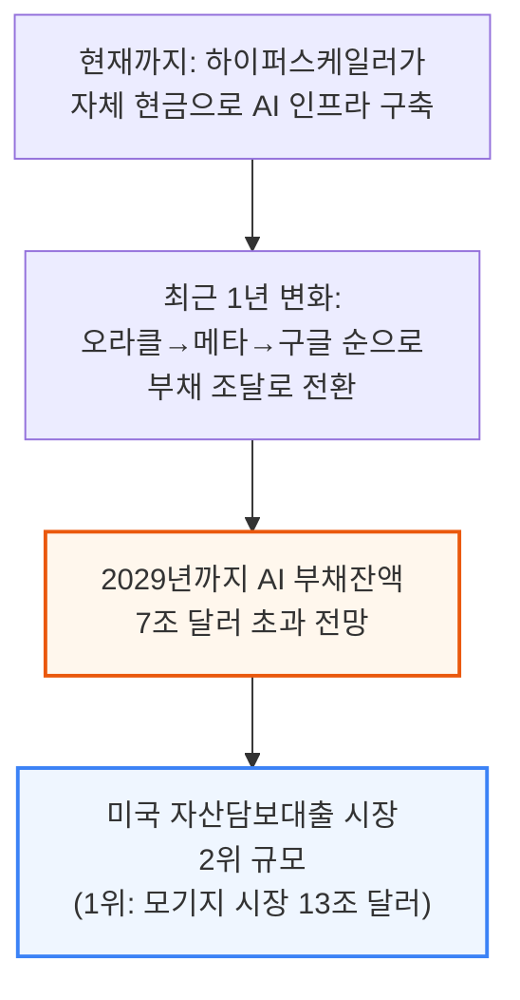

연간 AI 자본지출(GPU·네트워킹·스토리지·부속 CPU 컴퓨트 및 이를 수용할 데이터센터 건설비 포함)은 2028년 2조 달러를 훌쩍 넘어서고, 2024\~2029년 누적 AI 자본지출은 약 11.1조 달러에 이를 전망이며, 신용시장이 이 구축 자금의 주된 조달 창구가 될 것으로 예상됩니다.

### 트리니티(Trinity) - 자본·오프테이크·데이터센터의 순환 의존 구조

AI 컴퓨트 구축을 실행하려면 저자들이 "AI 프로젝트 트리니티"라 부르는 3가지 요소를 모두 갖춰야 하는데, 이 셋은 서로가 서로를 필요로 하는 순환 구조입니다.

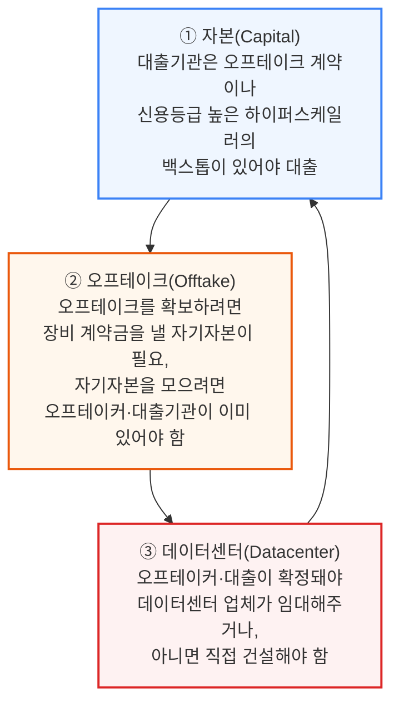

📌 용어 풀이: 트리니티가 "불가능한 삼위일체"는 아닌 이유
> - 자본·오프테이크·데이터센터가 서로를 전제조건으로 요구하는 순환 구조이긴 하지만, 실제로는 사모펀드 같은 자본 제공자가 중개자·후원자 역할을 하고, 업계 전체가 어느 정도 위험을 감수하면서 이 고리를 풀어내고 있음
> - 즉 "이론적으로 불가능"해 보여도 영리한 계약 설계와 신용 보강을 통해 실제로는 계속 딜이 성사되고 있다는 뜻

### 3대 구조적 장애물 - 이 시장이 지금 규모의 수십 배로 크려면

부채시장이 2024\~2025년의 수천억 달러 규모에서 2029년 약 7.1조 달러까지 성장하려면, 하이퍼스케일러 외 고객까지 컴퓨트 시장을 넓히는 데 아래 3가지 장애물을 넘어야 합니다.

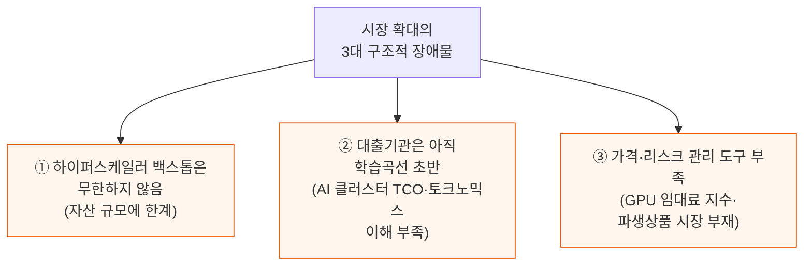

하이퍼스케일러의 자산 규모는 결국 유한하기 때문에, 5년 만기 하이퍼스케일러 백스톱형 딜이라는 지금의 관행을 벗어나지 못하면 하이퍼스케일러가 백스톱 여력을 소진하는 순간 더는 빌려줄 프로젝트 자체가 사라지는 셈입니다.

### 단기 임대 수요는 외면받는 시장 - 스타트업과 추론 사업자의 딜레마

현재 네오클라우드 시장 구조는 하이퍼스케일러·대형 AI 랩 이외의 고객에게 컴퓨트 접근권을 넓히는 문제와, 단기 임대 공급이 부족한 문제를 동시에 안고 있습니다.

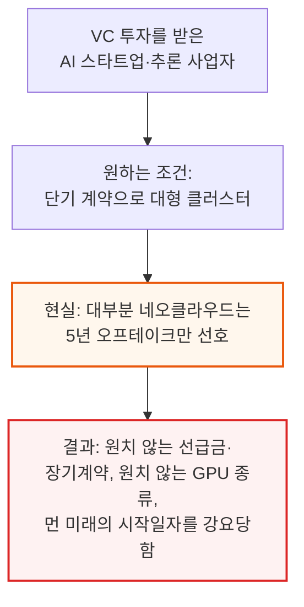

추론(inference) 사업자는 학습(training) 중심의 AI 랩보다 계약기간에 훨씬 민감해서, AI 랩은 3년 이상도 약정하는 반면 추론 사업자는 1년 넘는 계약에는 아예 응하지 않으려 합니다. 1년 임대를 아직 제공하는 몇 안 되는 네오클라우드는 수요가 워낙 많아 계약금 전액 선납(계약 가치의 최대 100%)까지 요구할 수 있고, 이 경우 클러스터 건설비를 선납금만으로 전부 충당해 이론상 무한대의 IRR을 실현하기도 합니다.

---

## 2. 등장: 엔비디아 백스톱

**📌 핵심:**
- AI 컴퓨트 성장의 병목은 2025년 데이터센터 부족 → 2026년 초 칩 생산 부족 → 2026년 중반 금융(파이낸싱) 부족 순으로 이동해왔음
- 엔비디아가 직접 나서서 네오클라우드의 GPU 임대 계약에 백스톱(최소 매출 보증)을 제공하기 시작 — 대가로 보증선 이상 벌어들인 매출의 일부를 나눠 받음
- 엔비디아 백스톱의 3대 목표: ① 컴퓨트 접근성을 하이퍼스케일러 밖으로 확대 ② 대출기관이 학습곡선을 따라잡을 시간 확보 ③ 네오클라우드가 실적을 쌓아 독자적으로 은행 대출을 받을 수 있는 플랫폼으로 성장하도록 지원
- 결론: 이는 저자들이 앞서 "AI의 중앙은행"이라 표현한 역할과 같음 — 다른 대출기관들이 나서길 꺼릴 때 유동성을 공급해 시장이 자립할 때까지 버텨주는 것

---

### 병목의 이동 - 데이터센터에서 칩으로, 다시 자금조달로

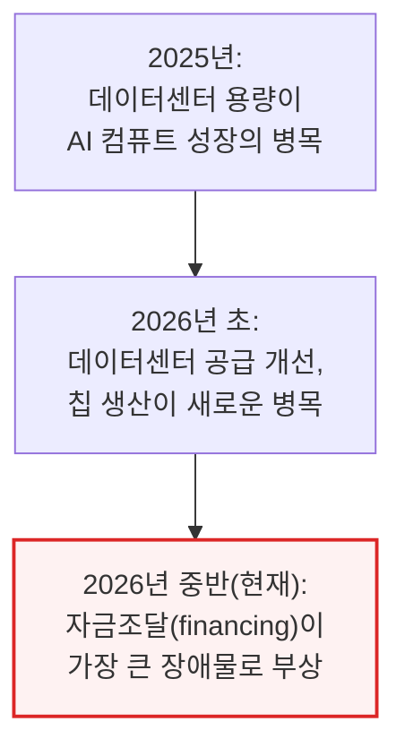

### 백스톱 메커니즘 - 최소 매출 보증과 초과수익 공유

엔비디아는 네오클라우드에게 take-or-pay 방식의 최소 매출 보증을 제공하고, 그 대가로 보증 수준 이상으로 벌어들인 매출의 일부를 나눠 받습니다. 네오클라우드는 원하는 다른 고객에게 원하는 기간으로 자유롭게 임대할 수 있고, 실제로는 이 백스톱을 발동시키지 않는 것이 애초의 의도입니다.

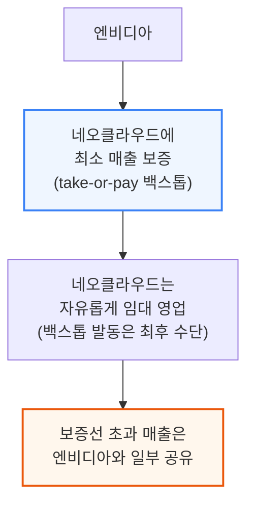

### 엔비디아 백스톱의 3대 목표

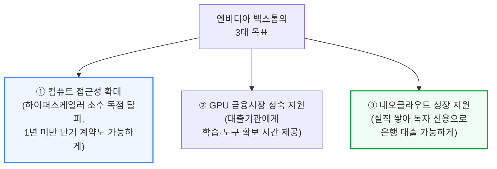

목표 ③은 하이퍼스케일러 소수만이 아니라 더 많은 구매자 기반을 확보하려는 것이기도 한데, 그 하이퍼스케일러들은 자체 커스텀 칩(실리콘)으로 엔비디아 시스템과 경쟁하려는 유인을 갖고 있기 때문입니다.

### 백스톱으로 트리니티 조립하기

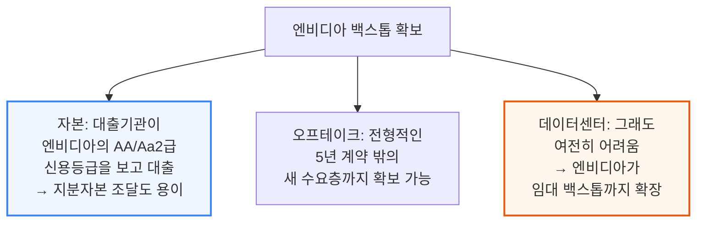

엔비디아가 이 백스톱 프로그램에서 얻는 이득은 단순 증분 매출을 훨씬 넘어섭니다. GPU 시장의 구조 자체를 바꾸려는 것으로, 5년 하이퍼스케일러 백스톱형 딜만이 유일한 구조로 남는다면 엔비디아가 팔 수 있는 시장(TAM) 자체가 곧 병목에 부딪힌다는 점을 저자들은 이미 짚은 바 있습니다.

📌 용어 풀이: 왜 "AI의 중앙은행"인가
> - 2026년 1월 기관 구독자 대상 리포트에서 저자들은 엔비디아를 "AI의 중앙은행"이라 표현
> - 중앙은행은 다른 은행들이 나서길 꺼릴 때 유동성을 공급해 경제 활동을 지탱하다가, 다른 주체들이 준비되면 그 역할을 넘겨주는 존재 — 엔비디아가 지금 네오클라우드 생태계에서 하는 역할이 정확히 이와 같음
> - 대다수 네오클라우드는 대형 하이퍼스케일러에 직접 임대하지 않으면 대규모 GPU 구축 자금을 충분히 조달하지 못함. 소형 구매자들은 GPU를 원하고 값도 치를 수 있지만, 대출기관에게 제시할 신용등급이 없음 — 엔비디아가 2026년 중반 현재 이 역할을 자처하고 나선 것

---

## 3. 백스톱은 어떻게 설계되는가

**📌 핵심:**
- 엔비디아 백스톱은 통상 6년 구조 — 그 기간 엔비디아는 연도별로 미리 합의된 가격에 컴퓨트를 사줄 준비가 돼 있으며, 네오클라우드마다 조건이 개별 협상됨. 예시 커브는 6년 평균 시간당 $2.36로, 저자들은 이를 백스톱 범위 중 낮은 편으로 추정하며 실제 대다수 네오클라우드는 이보다 높은 조건을 받아낼 것으로 예상
- 1년 이하 단기 임대 시나리오 예시: GB300 1년 임대가 시간당 $6.75에서 시작해 시장가 하락에 따라 점차 감소, 6년 고정가 약 $4.00보다 높게 유지되는 것이 정상(단기 임대로 미래 가격 하락 위험을 떠안는 대가)
- 연도별 정산 방식: 네오클라우드는 백스톱 금액까지는 임대료의 100%를 온전히 가져가고, 백스톱을 초과한 부분만 엔비디아와 나눔 — 예시 1년차 계산: 고객 청구가 $6.75, 백스톱 $3.68, 초과분 $3.07 중 40%인 $1.23은 엔비디아, 나머지 $1.84는 네오클라우드가 가져가 네오클라우드는 총 $5.52/hr 실현(백스톱 없었다면 받았을 $6.75보다는 낮음)
- 결론: 6년 전체로 보면 엔비디아의 평균 테이크레이트는 약 18% 수준이지만, 백스톱이 없었다면 애초에 클러스터 자체가 세워지지 못했을 것 — IRR 비교에서도 백스톱이 있는 1년 임대 시나리오가 25.4%로 백스톱 있는 시나리오 중 최고, 백스톱 없는 1년 임대는 그보다 높은 40.7%까지 가능하지만, 백스톱이 실제로 발동돼 엔비디아에 임대하는 상황이 되면 IRR은 0% 또는 마이너스로 떨어짐

---

### 6년 백스톱 커브 - 낮은 편으로 추정되는 평균 $2.36/hr

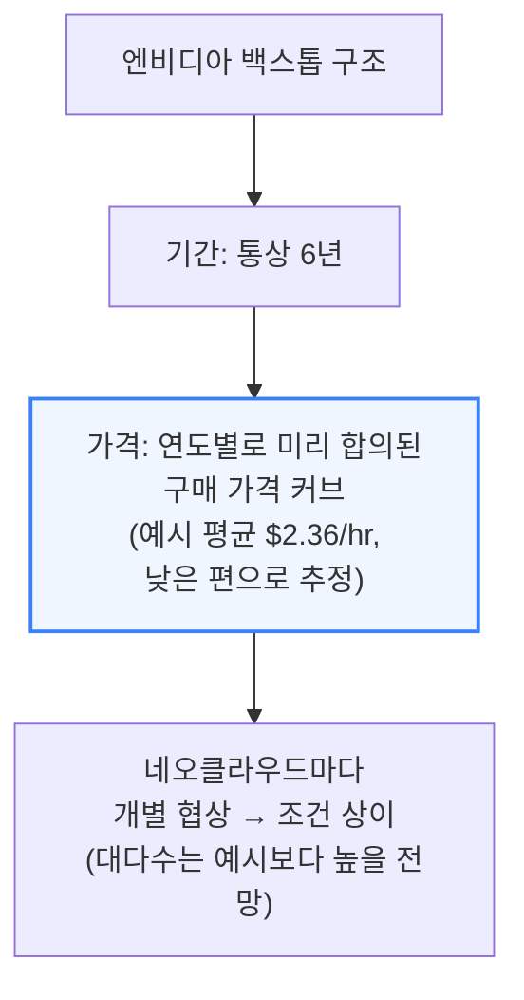

### 시나리오 ① 단기 임대 - 1년 임대가 $6.75에서 하락, 6년 고정가 $4.00 상회

투자 기간은 길고 임대는 짧게 굴리는 "커브 트레이드"를 하는 사업이라면, 단기 임대로 미래 가격 위험을 떠안는 대가로 평균 실현 임대가가 6년 고정가보다 다소 높아야 정상입니다.

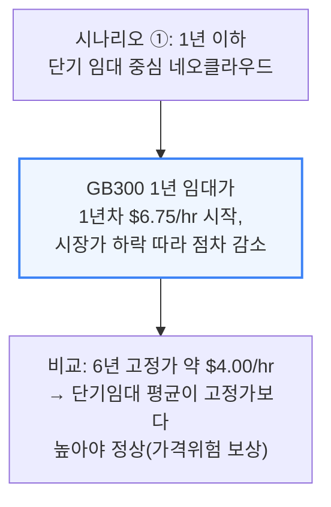

### 수익 배분 계산 예시 - 1년차 $6.75 중 네오클라우드 $5.52 실현

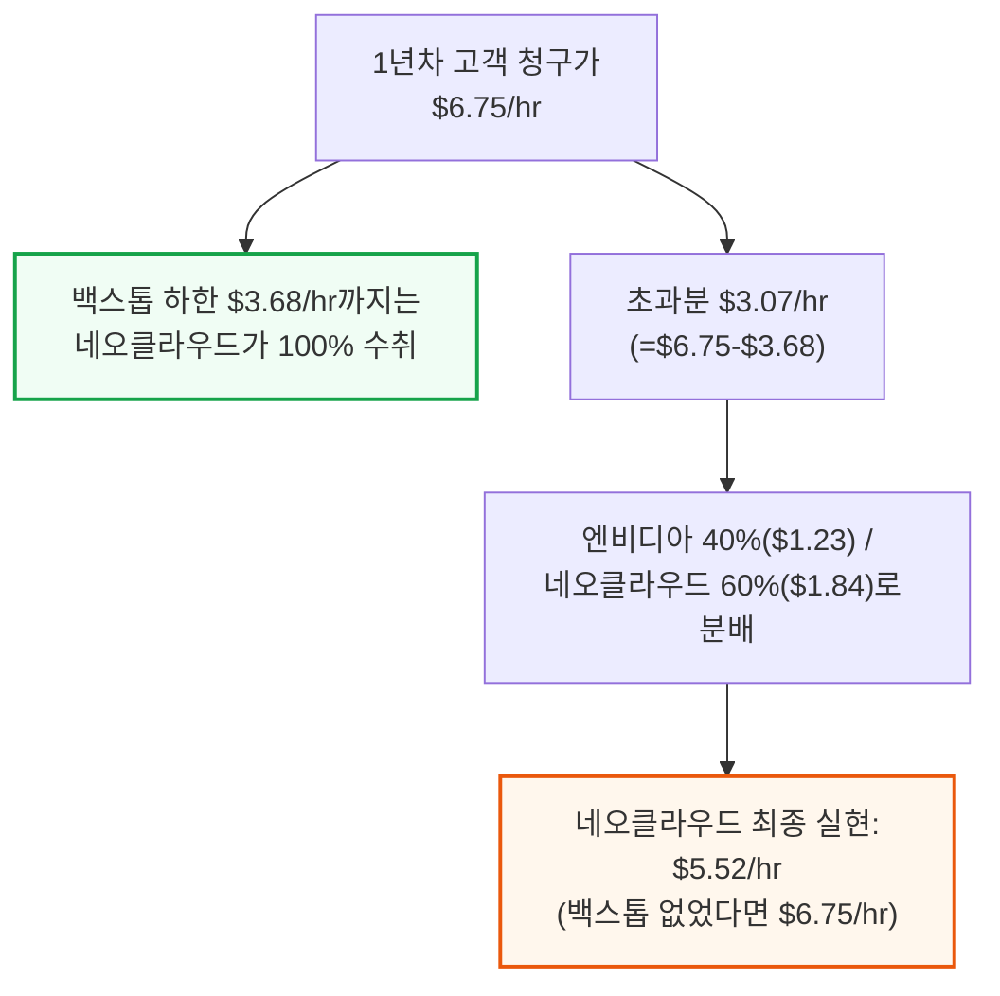

6년 전체 기간으로 계산하면 이 시나리오에서 엔비디아의 평균 테이크레이트는 약 18% 수준이지만, 애초에 백스톱이 없었다면 이 클러스터 자체가 세워지지 못했을 것이라는 점이 핵심입니다.

### 시나리오 ② 6년 고정가 오프테이크 - 사실상 성립하지 않는 모순적 가정

두 번째 시나리오는 6년 고정가 오프테이크를 이미 확보한 경우를 가정하는데, 이는 사실 모순입니다 — 6년 고정가 오프테이크를 확보할 수 있다면 애초에 엔비디아 백스톱이 필요 없고, 엔비디아에 수익을 나눠줄 이유도 없기 때문입니다. 이런 컴퓨트를 다시 6년 계약으로 재임대하는 것은 다양한 구매자에게 단기 컴퓨트를 공급한다는 백스톱 프로그램의 취지에도 어긋납니다.

### 시나리오 ③ 백스톱 발동 - 네오클라우드에게는 최후의 안전판

엔비디아도 내부적으로 상당한 컴퓨트 수요가 있지만, 엔비디아와 네오클라우드 모두 실제로 백스톱을 발동시킬 의도는 없습니다. 그래서 백스톱 발동 시나리오에서 네오클라우드의 프로젝트 IRR이 0% 또는 소폭 마이너스로 나오는 것은 놀랍지 않습니다.

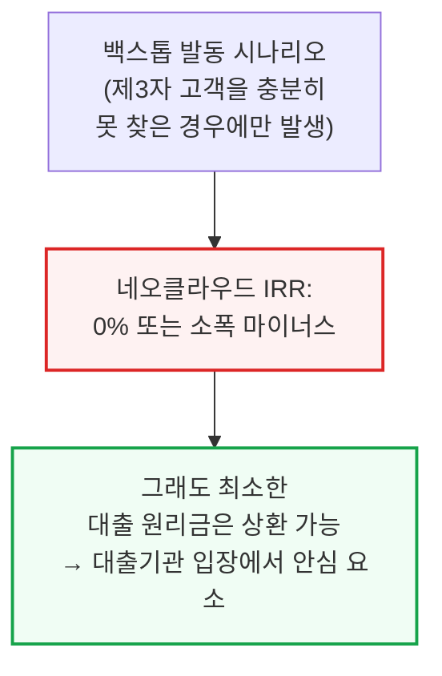

바로 이 지점이 이 구조가 금융조달 가능한 이유입니다 — 이 시나리오의 IRR이 0% 또는 소폭 마이너스라 해도 네오클라우드가 최소한 부채 상환은 계속할 수 있어, 대출기관은 이 구조를 안심하고 받아들입니다. 엔비디아 백스톱이 걸린 클러스터의 대출 심사는 바로 이 "백스톱 발동" 시나리오 기준으로 DSCR(부채상환비율)을 따져 대출 규모를 정합니다.

### 시나리오별 IRR 비교 - 백스톱 있는 1년 임대가 25.4%로 최고

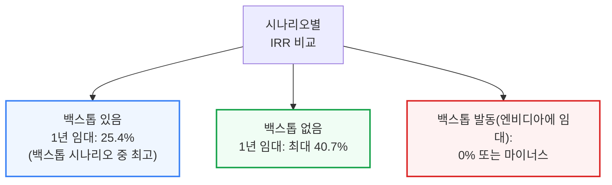

1년 이하 단기 임대 시나리오가 백스톱이 걸린 시나리오 중 가장 높은 IRR(25.4%)을 보이며, 만약 단기 임대 시장이 예상보다 강해 임대가 하락 폭이 모델보다 작다면 이 IRR은 더 높아질 수 있습니다. 예상대로 백스톱이 없는 경우의 IRR이 더 높지만(1년 임대 무백스톱 최대 40.7%), 백스톱이 실제로 발동돼 그 가격대로 엔비디아에 임대하게 되면 IRR은 0% 또는 마이너스로 떨어집니다.

---

## 4. GPU 대출 가격은 어떻게 매겨지나

**📌 핵심:**
- 장기 오프테이크가 있는 네오클라우드 대출 가격은 네오클라우드 자신의 신용이 아니라 오프테이크를 제공하는 하이퍼스케일러(또는 다른 신용 우량 기업)의 신용 스프레드가 좌우 — 네오클라우드의 실행 리스크(execution risk)만 그 하이퍼스케일러 스프레드 위에 얹혀 추가로 반영됨
- 실제 사례: 코어위브의 5년 무담보 회사채 금리는 약 10%인데, 메타가 백스톱한 85억 달러 규모 DDTL 4.0 대출의 고정금리 트랜치는 5.9%에 불과 — 메타의 5년 채권 금리(약 5.0%)보다 90bp(basis point, 1bp=0.01%p) 높은 수준으로, 이 90bp가 시장이 평가한 코어위브의 실행 리스크
- 네오클라우드가 이 "5년 오프테이크 담보" 공식을 벗어나기 어려운 이유: 무담보로 자금을 조달하면 최상위 네오클라우드조차 금리가 4%p 추가로 붙어, GPU 대출에 흔히 쓰이는 대출채권비율(LTV) 70\~80% 구조에서 수익성에 큰 타격 — 조달금리가 5.62%에서 10%로 오르면 세전이익률(PBT margin)이 14.8%에서 5.4%로 급락
- 결론: 은행이 대출 규모를 정하는 핵심 기준은 DSCR(부채상환비율) — 엔비디아 백스톱이 걸린 대출에서는 백스톱이 실제로 발동됐다고 가정한 매출 기준으로 DSCR을 계산하며, 최소 1.3배를 요구하고 이는 통상 LTV 70\~80% 수준에 대응

---

### 가격 결정 원리 - 네오클라우드가 아닌 오프테이커의 신용이 좌우

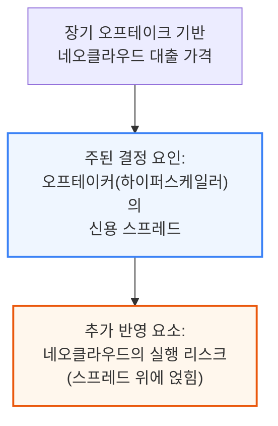

### 코어위브 실제 사례 - 무담보 10% vs 메타백스톱 5.9%

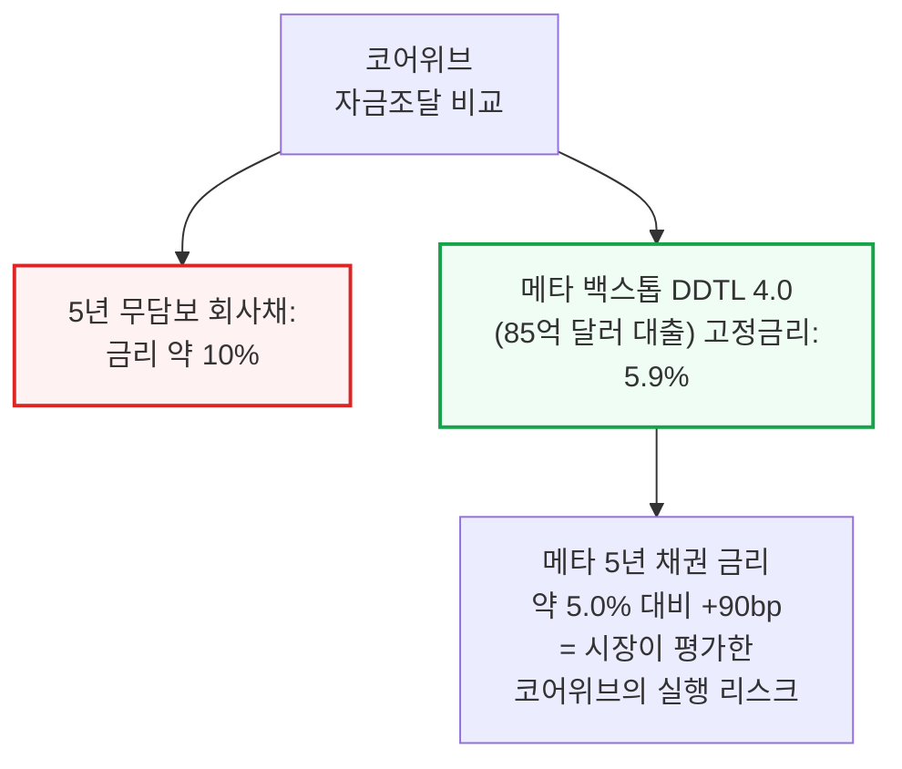

📌 용어 풀이: bp(베이시스 포인트)란
> - 1bp(basis point)는 0.01%p — 금리를 아주 세밀하게 비교할 때 쓰는 단위
> - 90bp는 0.9%p를 의미 — 코어위브의 특정 프로젝트 실행 리스크를 시장이 이 정도 프리미엄으로 가격 매겼다는 뜻

### 왜 금융이 "5년 오프테이크" 틀 밖으로 못 나가나

네오클라우드 금융이 어려운 이유는 복잡하고 생소한 인프라·장비 스택을 다루는 데다, 토큰 수요라는 최종 수요 자체가 아직 낯설고 대출기관 입장에서 리스크 관리에 참고할 축적된 역사도 부족하기 때문입니다. 대출기관 입장에서는 토크노믹스나 AI 모델의 빠른 변화, 스케일업 네트워크 토폴로지의 성능 차이까지 파고들기보다, 하이퍼스케일러의 오프테이크·백스톱에만 집중하는 편이 훨씬 쉽습니다 — 결국 하이퍼스케일러 리스크만 보면 되기 때문입니다.

### 무담보 조달의 비용 - 세전이익률 14.8%→5.4%로 급락

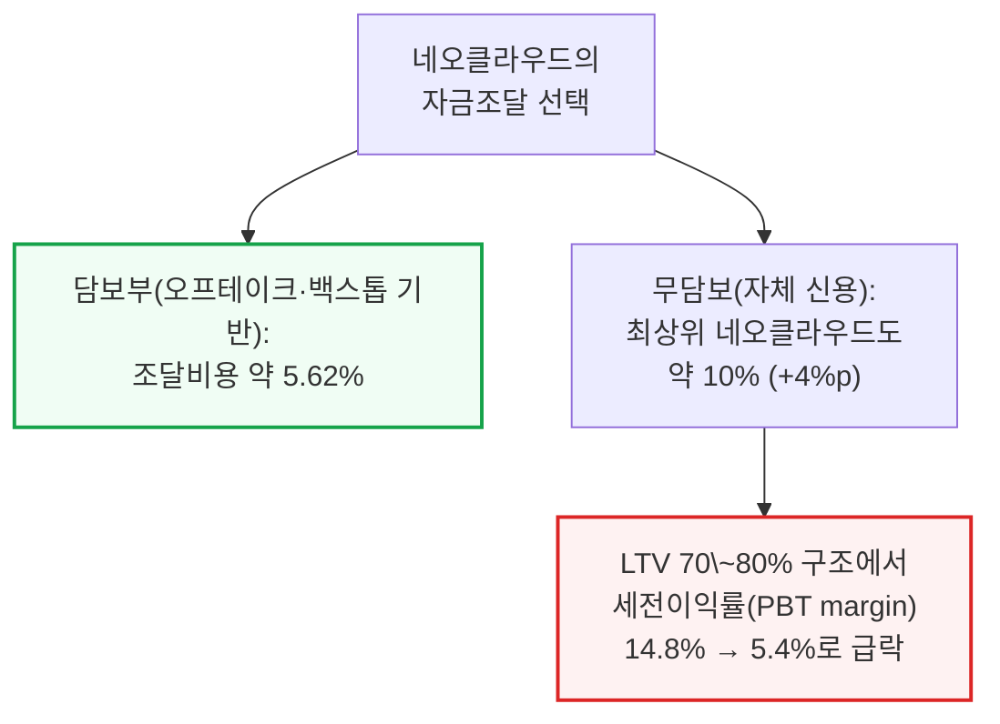

최상위 네오클라우드조차 무담보 조달 시 약 10% 금리를 감수해야 하는데, 실적이 짧은 소형 네오클라우드는 이보다 더 비싼 무담보 조달 비용을 감수해야 할 것으로 예상됩니다.

### 대출 규모 산정 - DSCR 1.3배 기준, LTV 70\~80%

가장 중요한 부채 비율은 DSCR(부채상환비율)로, 사업이 벌어들이는 현금을 매 기간 원리금 상환액으로 나눈 값입니다. 엔비디아 백스톱이 걸린 대출에서 은행은 백스톱이 실제로 발동된 상황을 가정한 매출로 DSCR을 계산하며, 특히 대출 초기 몇 년간 최소 1.3배를 요구합니다.

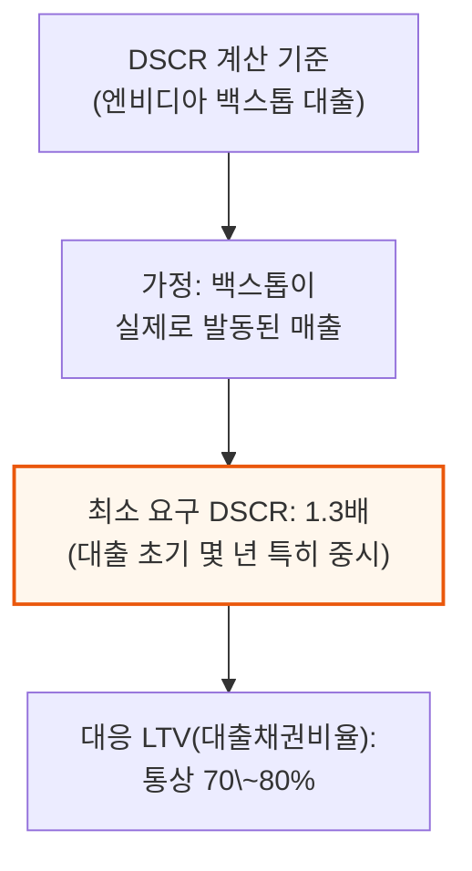

---

## 5. 대변혁 - GPU 금융시장의 성년기

**📌 핵심:**
- GPU 금융시장은 앞서 설명한 막대한 자본 수요를 감당하려면 빠르게 진화해야 하고, 엔비디아 백스톱 클러스터 금융은 바로 이 변화의 선봉
- 과거 대출기관은 가격 위험이 있는 프로젝트에 불편해했고, 장기 오프테이크·잔존가치 쿠션·모회사 보증·벤더 백스톱 등 자산 아래 어떤 형태로든 바닥을 깔아줄 것을 요구했음
- 지금은 SemiAnalysis 같은 자문사의 실사 지원을 받아, 엔비디아 백스톱을 갖고 있는 최상위 대출기관조차 네오클라우드의 운영 품질·시장진출 전략·고객 구성·가격 전략까지 직접 파고들기 시작
- 결론: 초기 대출 금리는 현재의 5년 하이퍼스케일러 백스톱형 딜(SOFR+225bp, 총수익률 약 5.9%)보다는 넓고, 코어위브의 5년 무담보 회사채(약 10%, 제트스프레드 600bp)보다는 좁은 스프레드에서 형성될 것으로 예상 — 궁극적으로는 대출기관이 외부 백스톱 없이도 네오클라우드를 독자 사업으로 평가해 금융을 제공하는 시대로 향하는 과정

---

### 대출기관의 진화 - 자산 뒤 "바닥"에서 사업 자체 평가로

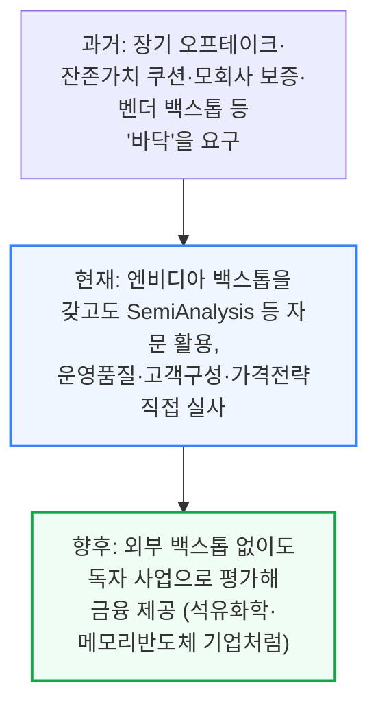

### 초기 스프레드 예상 - 5년 백스톱딜과 무담보채 사이

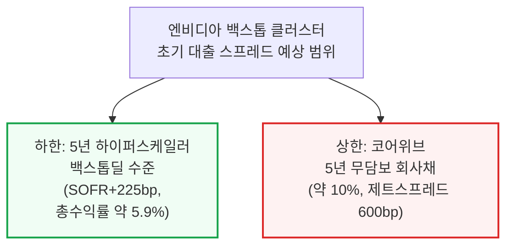

이는 건강한 발전 방향입니다 — 엔비디아 백스톱은 대출기관이 학습곡선을 따라잡고, 궁극적으로 외부 백스톱이나 보증 없이도 네오클라우드를 독립 사업 기반으로 금융할 수 있는 시대를 준비하도록 돕는 지지대 역할을 합니다. 마치 석유화학 기업이나 메모리 반도체 제조사처럼 장기 투자를 하면서도 단기 가격 위험에 노출된 다른 어떤 업종을 평가하듯 말입니다.

---

*작성 진행률: 약 46% 완료*
*업데이트: 3\~5섹션(백스톱 설계, GPU 대출 가격, GPU 금융시장 성년기) 작성 완료*
