# TokenBudgeting: Our Conversations with Enterprises on Token Spend

> **출처**: [SemiAnalysis Newsletter](https://newsletter.semianalysis.com/p/tokenbudgeting-our-conversations)
> **저자**: Crystal Huang, Joey Brookhart, Dylan Patel
> **발행일**: 2026-02-05

---

## 📑 목차

### 전체 섹션
1. [토큰맥싱의 부상과 몰락 - 메타·우버 사례](#1-토큰맥싱의-부상과-몰락---메타우버-사례)
2. [데이터로 본 진짜 그림 - 헤드라인은 과장됐다](#2-데이터로-본-진짜-그림---헤드라인은-과장됐다)
3. [예산 책정 - 정해진 숫자는 없다](#3-예산-책정---정해진-숫자는-없다)
4. [토큰 절약의 기술 - 직원들의 생존 전략](#4-토큰-절약의-기술---직원들의-생존-전략)
5. [AI를 헤드카운트 지렛대로 - 항공사·아마존 사례](#5-ai를-헤드카운트-지렛대로---항공사아마존-사례)
6. [예산제는 이제 상수다 - 앤트로픽 실측 데이터](#6-예산제는-이제-상수다---앤트로픽-실측-데이터)
7. [기업별 대화 요약 - 14개 사례 모음](#7-기업별-대화-요약---14개-사례-모음)

---

## 🔑 용어 정리

본문을 순서대로 읽기 전에 알아두면 좋은 용어들입니다. 자세한 수치와 설명은 본문에서 처음 등장하는 위치에 나옵니다.

- **토큰맥싱 (Tokenmaxxing)**: 직원들이 AI 토큰을 최대한 많이 쓰도록 회사가 장려하거나, 직원 스스로 경쟁적으로 토큰을 소비하는 현상
- **토큰버짓팅 (Token Budgeting)**: 직원 1인당 AI 토큰(사용료) 지출에 월 단위 예산 상한을 두고 관리하는 방식
- **하드 캡 vs 소프트 리밋**: 하드 캡은 넘으면 사용이 실제로 막히는 강제 상한, 소프트 리밋은 넘어도 차단 없이 관리자와 대화만 하는 가이드라인성 상한
- **퍼센타일 고객 구조 (90th/99th Percentile)**: 지출액 기준으로 고객을 줄 세웠을 때 상위 10%(90th), 상위 1%(99th)에 해당하는 최상위 지출 고객군 — 소수의 최상위 고객이 전체 매출 대부분을 차지하는 구조를 설명할 때 사용
- **TaaS (Token-as-a-Service)**: 자체 모델을 만들지 않고, 이미 있는 AI 모델을 토큰(사용량) 단위로 과금해 되파는 사업 방식
- **모델 티어 (Opus vs Sonnet vs Fast-Mode)**: 같은 AI 제품군 안에서도 성능·가격이 다른 등급 — Opus는 프리미엄(고성능·고가), Sonnet은 보급형(준수한 성능·저가), Fast-Mode는 속도 우선 저비용 옵션

---

## 1. 토큰맥싱의 부상과 몰락 - 메타·우버 사례

**📌 핵심:**
- 토큰맥싱은 올해 초 메타·세일즈포스가 직원 AI 토큰 소비를 독려하며 시작 — 메타 직원은 사내 랭킹 대시보드까지 만들어 30일간 전 직원 60조 토큰을 소비(개인 최고 기록 약 2,800억 토큰)
- 우버는 클로드 코드·코덱스 연간 예산을 단 4개월 만에 다 써버려 $1,500/월/직원 상한을 도입(초과 요청은 사안별 승인)
- SemiAnalysis 팀은 이런 헤드라인이 실제인지 확인하려고 데이터브릭스 AI 서밋 현장과 슬랙·전화로 50개 이상 기업과 직접 대화
- 결론: 올 상반기 화제였던 "토큰맥싱"(과잉소비 경쟁)에서 지금은 "토큰버짓팅"(예산 관리)으로 기업들의 초점이 옮겨가는 중

---

### 메타 사내 토큰맥싱 - "클로데코노믹스" 대시보드와 30일 60조 토큰

메타에서는 한 직원이 사내 상위 250명 파워유저를 순위 매기는 "클로데코노믹스" 대시보드를 직접 만들었습니다. 이 대시보드는 더 인포메이션의 보도 이후 이틀 만에 폐쇄됐습니다.

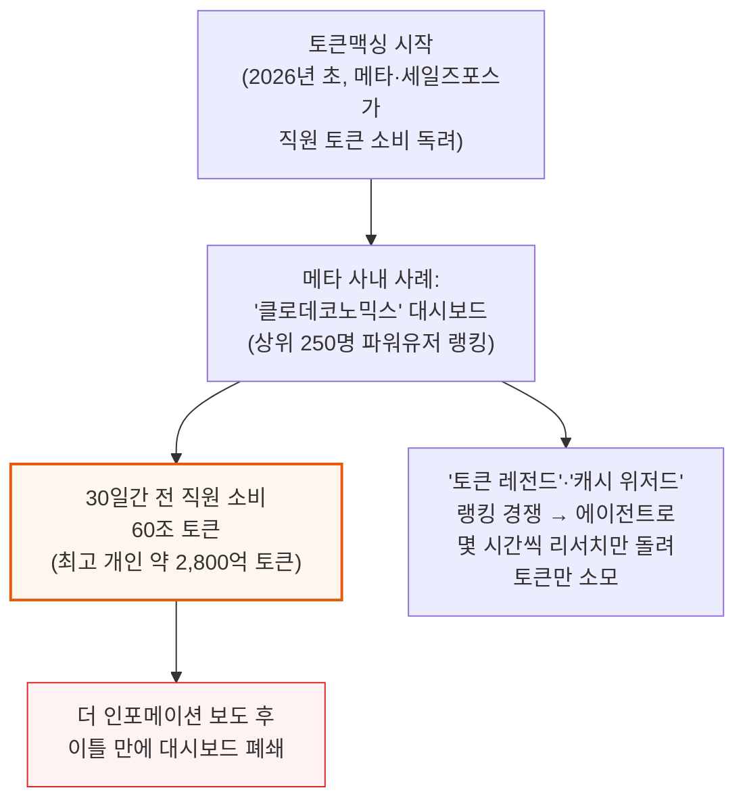
```mermaid
flowchart TD
    Start["토큰맥싱 시작<br/>(2026년 초, 메타·세일즈포스가<br/>직원 토큰 소비 독려)"] --> MetaCase["메타 사내 사례:<br/>'클로데코노믹스' 대시보드<br/>(상위 250명 파워유저 랭킹)"]
    MetaCase --> Volume["30일간 전 직원 소비<br/>60조 토큰<br/>(최고 개인 약 2,800억 토큰)"]
    MetaCase --> Game["'토큰 레전드'·'캐시 위저드'<br/>랭킹 경쟁 → 에이전트로<br/>몇 시간씩 리서치만 돌려<br/>토큰만 소모"]
    Volume --> Shutdown["더 인포메이션 보도 후<br/>이틀 만에 대시보드 폐쇄"]
    style Volume fill:#fff7ed,stroke:#ea580c,stroke-width:2px
    style Shutdown fill:#fef2f2,stroke:#dc2626
```

### 우버 사례 - 연간 예산 4개월 소진, SemiAnalysis의 현장 검증

우버는 최근 클로드 코드·코덱스의 연간 예산을 단 4개월 만에 소진해 화제가 됐습니다. 회사는 곧바로 $1,500/월/직원 상한을 도입했고(초과 요청은 사안별 승인), SemiAnalysis 팀은 이 흐름이 업계 전반에 실제로 퍼져 있는지 직접 검증에 나섰습니다.

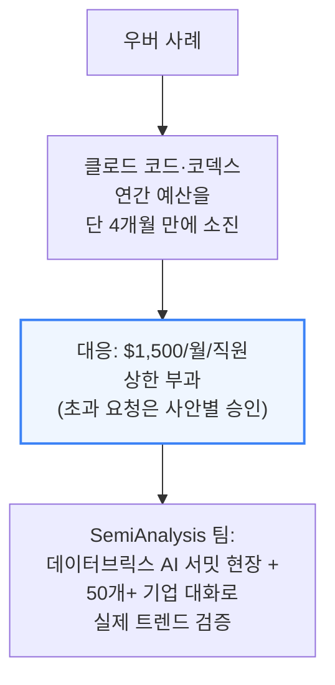
```mermaid
flowchart TD
    Uber["우버 사례"] --> Burn["클로드 코드·코덱스<br/>연간 예산을<br/>단 4개월 만에 소진"]
    Burn --> Cap["대응: $1,500/월/직원<br/>상한 부과<br/>(초과 요청은 사안별 승인)"]
    Cap --> Verify["SemiAnalysis 팀:<br/>데이터브릭스 AI 서밋 현장 +<br/>50개+ 기업 대화로<br/>실제 트렌드 검증"]
    style Cap fill:#eff6ff,stroke:#3b82f6,stroke-width:2px
```

---

## 2. 데이터로 본 진짜 그림 - 헤드라인은 과장됐다

**📌 핵심:**
- SemiAnalysis의 Tokenomics Model 추정으로는 90번째 백분위 이상 고객이 매출 대부분을 차지 — 메타조차 앤트로픽 매출의 3\~5%에 불과(월 70조 토큰, 직원당 정가 기준 연 $50,000 이상 소비인데도)
- Ramp 데이터: 99th 백분위 고객은 연 $90,000/직원, 90th 백분위는 $7,300, 중위값은 단 $136 — 일반 포춘500은 직원당 연 $100도 안 됨
- 기술 선도 포춘500 다수도 직원당 연 $2,000 미만을 지출(엔지니어링·데이터사이언스에 집중) → 아직 S자 곡선 초입, 성장 여력이 크다는 뜻
- 결론: 코딩 vertical이 지금 시장을 견인 중이며, 다음은 사이버보안·화이트칼라 지식노동 순으로 같은 패턴이 반복될 전망 — 헤드라인은 과장, 기업 지출은 계속 늘어나는 중

---

### 퍼센타일 고객 구조 - Ramp 데이터로 본 극단적 쏠림

Ramp Economics Lab 데이터를 보면 소수의 최상위 고객이 전체 지출의 대부분을 차지하는 구조가 뚜렷합니다. Ramp 고객은 원래 기술 친화적인 기업이 많아 이미 상향 편향된 표본이라는 점도 참고할 부분입니다.

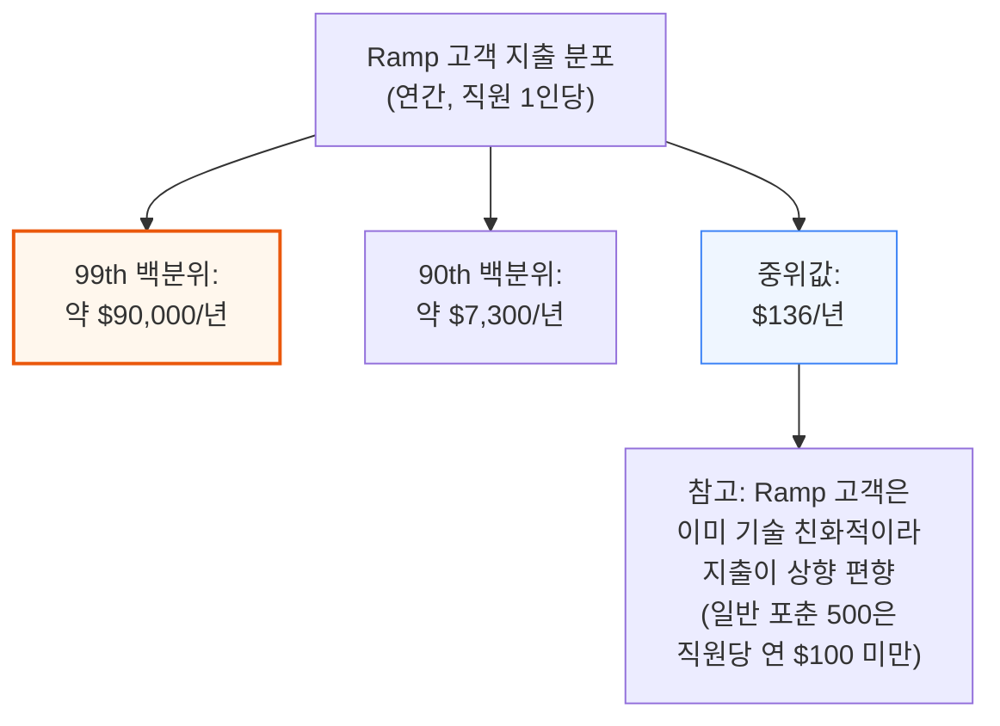
```mermaid
flowchart TD
    Ramp["Ramp 고객 지출 분포<br/>(연간, 직원 1인당)"] --> P99["99th 백분위:<br/>약 $90,000/년"]
    Ramp --> P90["90th 백분위:<br/>약 $7,300/년"]
    Ramp --> Median["중위값:<br/>$136/년"]
    Median --> Note["참고: Ramp 고객은<br/>이미 기술 친화적이라<br/>지출이 상향 편향<br/>(일반 포춘 500은<br/>직원당 연 $100 미만)"]
    style P99 fill:#fff7ed,stroke:#ea580c,stroke-width:2px
    style Median fill:#eff6ff,stroke:#3b82f6
```

### 메타의 역설 - 월 70조 토큰을 써도 앤트로픽 매출의 3\~5%뿐

메타는 2월 한 달에만 70조 토큰을 소비했고 직원당 정가 기준 연 $50,000 이상을 쓴 것으로 추정되지만, 이는 앤트로픽 전체 매출의 3\~5%에 불과합니다. 이 격차가 바로 90번째 백분위 이상 고객이 매출 대부분을 차지한다는 구조를 보여줍니다.

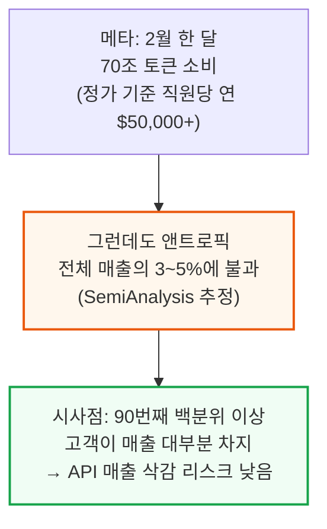
```mermaid
flowchart TD
    MetaSpend["메타: 2월 한 달<br/>70조 토큰 소비<br/>(정가 기준 직원당 연 $50,000+)"] --> AnthShare["그런데도 앤트로픽<br/>전체 매출의 3~5%에 불과<br/>(SemiAnalysis 추정)"]
    AnthShare --> Implication["시사점: 90번째 백분위 이상<br/>고객이 매출 대부분 차지<br/>→ API 매출 삭감 리스크 낮음"]
    style AnthShare fill:#fff7ed,stroke:#ea580c,stroke-width:2px
    style Implication fill:#f0fdf4,stroke:#16a34a,stroke-width:2px
```

### 다음 확산 패턴 - 코딩 다음은 사이버, 그다음은 화이트칼라

오늘의 시장은 코딩 vertical의 폭발적 성장과, 앤트로픽·오픈AI 모델 위에 제품을 쌓아 올린 VC 투자 AI 기업들이 이끌고 있습니다. 코딩 시장이 AI 랩 ARR에 해온 역할은 사이버보안(미토스 재출시 여부에 달려 있으나 더 빠른 속도로 예상), 그다음은 화이트칼라 지식노동(코워크·코파일럿·코덱스·컴퓨터형 제품)에서 반복될 전망입니다.

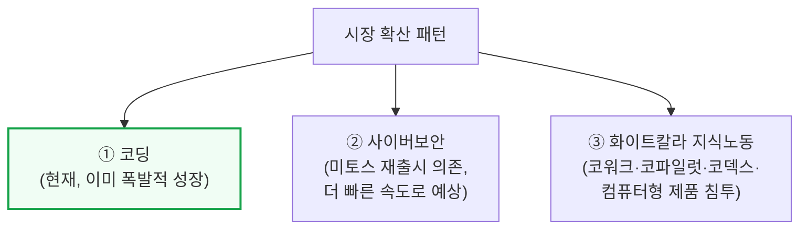
```mermaid
flowchart TD
    Pattern["시장 확산 패턴"] --> V1["① 코딩<br/>(현재, 이미 폭발적 성장)"]
    Pattern --> V2["② 사이버보안<br/>(미토스 재출시 의존,<br/>더 빠른 속도로 예상)"]
    Pattern --> V3["③ 화이트칼라 지식노동<br/>(코워크·코파일럿·코덱스·<br/>컴퓨터형 제품 침투)"]
    style V1 fill:#f0fdf4,stroke:#16a34a,stroke-width:2px
```

### ARR 구성과 TaaS 시장 - 코딩이 70%+, TaaS는 연 40억 달러+

Tokenomics Model 추정으로 오픈AI·앤트로픽 ARR의 70% 이상이 코딩 관련 사용(1자·3자 합산)에서 나오며, 앤트로픽의 지출 규모가 더 큰 이유는 B2B 비중 차이(앤트로픽 90%+ vs 오픈AI 60%) 때문입니다. 한편 값싼 토큰 수요도 계속 늘어, Together·Fireworks·Baseten 같은 TaaS 사업자들은 이미 연매출 40억 달러 이상을 기록 중입니다.

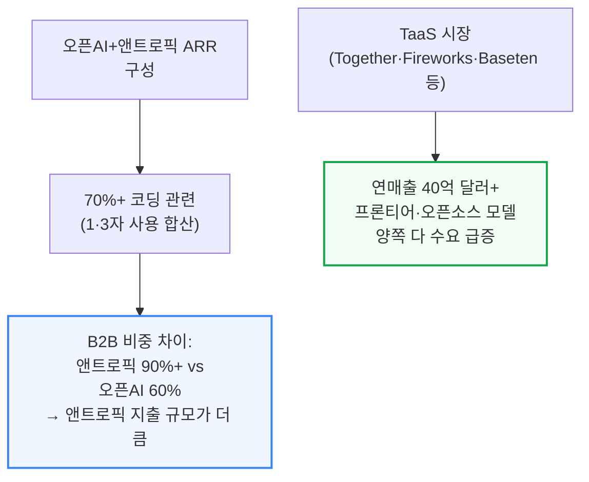
```mermaid
flowchart TD
    ARR["오픈AI+앤트로픽 ARR<br/>구성"] --> Coding["70%+ 코딩 관련<br/>(1·3자 사용 합산)"]
    Coding --> BMix["B2B 비중 차이:<br/>앤트로픽 90%+ vs<br/>오픈AI 60%<br/>→ 앤트로픽 지출 규모가 더 큼"]
    TaaS["TaaS 시장<br/>(Together·Fireworks·Baseten 등)"] --> TaaSRev["연매출 40억 달러+<br/>프론티어·오픈소스 모델<br/>양쪽 다 수요 급증"]
    style BMix fill:#eff6ff,stroke:#3b82f6,stroke-width:2px
    style TaaSRev fill:#f0fdf4,stroke:#16a34a,stroke-width:2px
```

이를 종합하면 헤드라인은 과장돼 있고, 기업들의 실제 지출은 계속 늘고 있으며, 새로운 vertical·사용 사례가 계속 나타나 AI 시장 성장세를 이어가고 있다는 것이 저자들의 결론입니다.

---

## 3. 예산 책정 - 정해진 숫자는 없다

**📌 핵심:**
- 50개 이상 대화 기업 대부분이 하드 캡(강제 상한)을 부과 — 그러나 수렴된 숫자는 없음: 하한 $250\~500/월(항공방산·제약), 상한 약 $2,000/월(워크데이·스트라이프)
- 한도를 아직 안 정한 기업은 ① 접근 자체가 제한적이라 비용이 문제 안 되거나 ② 산출 증가가 이미 지출을 정당화하는 경우 — 금융업이 ①의 전형적 사례
- ROI가 확실한 곳은 극적: 아마존 리크루터는 채용 기간이 6\~9개월에서 절반으로, 한 데이터분석 기업은 1주 걸리던 작업이 몇 시간으로 단축
- 결론: 가장 성숙한 기업은 하드 캡 대신 소프트 리밋(가이드라인)을 사용 — 초과해도 차단이 아니라 관리자와의 대화로 유도

---

### 예산 스펙트럼 - 하한 $250부터 상한 $2,000까지

세계 3위권 항공우주방산 기업은 직원당 $250/월, 세계 최대급 제약회사 중 한 곳은 $500/월로 하한을 두고 있습니다. 반대로 워크데이·스트라이프 같은 기업은 직원 예산이 약 $2,000/월에 달합니다.

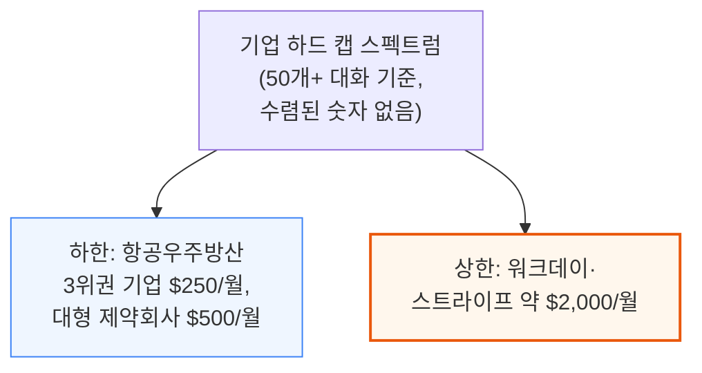
```mermaid
flowchart TD
    Spectrum["기업 하드 캡 스펙트럼<br/>(50개+ 대화 기준,<br/>수렴된 숫자 없음)"] --> Low["하한: 항공우주방산<br/>3위권 기업 $250/월,<br/>대형 제약회사 $500/월"]
    Spectrum --> High["상한: 워크데이·<br/>스트라이프 약 $2,000/월"]
    style Low fill:#eff6ff,stroke:#3b82f6
    style High fill:#fff7ed,stroke:#ea580c,stroke-width:2px
```

### 한도가 없는 이유 2가지 - 접근 제한 vs 이미 증명된 ROI

일부 기업은 아직 어떤 한도도 두지 않고 있는데, 이유는 크게 두 가지로 나뉩니다. 금융업은 그중 ①의 전형적 사례로, AI 도입 자체가 느리고 대화한 자산운용사·지역은행·오토파이낸스 기업 대부분에서 직원들이 마이크로소프트 플랫폼이 제공하는 도구 안에 갇혀 있는 동일한 패턴이 나타났습니다.

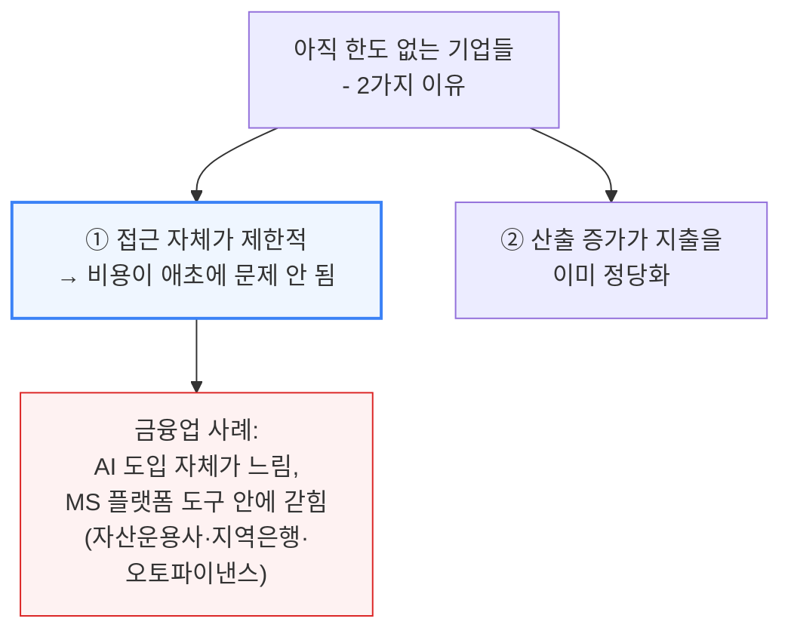
```mermaid
flowchart TD
    NoLimit["아직 한도 없는 기업들<br/>- 2가지 이유"] --> R1["① 접근 자체가 제한적<br/>→ 비용이 애초에 문제 안 됨"]
    NoLimit --> R2["② 산출 증가가 지출을<br/>이미 정당화"]
    R1 --> Finance["금융업 사례:<br/>AI 도입 자체가 느림,<br/>MS 플랫폼 도구 안에 갇힘<br/>(자산운용사·지역은행·<br/>오토파이낸스)"]
    style R1 fill:#eff6ff,stroke:#3b82f6,stroke-width:2px
    style Finance fill:#fef2f2,stroke:#dc2626
```

### 극적인 ROI 사례 - 채용 기간 절반, 업무 시간 1주에서 몇 시간으로

ROI가 확실한 곳의 성과는 매우 극적입니다. 아마존에서 수석 엔지니어 채용을 담당하는 리크루터는 초기 스크리닝부터 팀 배치까지 걸리던 6\~9개월이 AI 도구(인터뷰 노트 작성·리포트 생성)로 절반까지 단축됐다고 설명했습니다. 포춘500의 85%를 고객사로 둔 한 데이터·분석 기업 직원도 1주일 걸리던 작업이 이제 몇 시간이면 끝난다고 밝혔습니다.

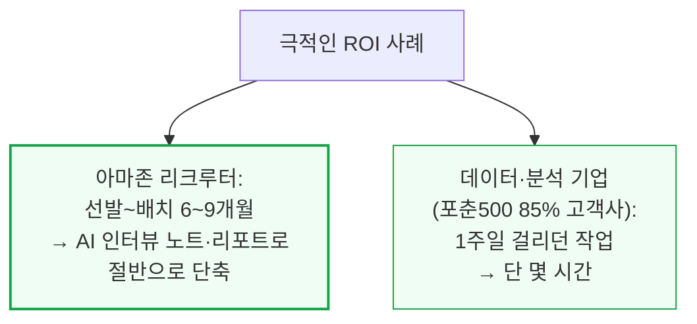
```mermaid
flowchart TD
    ROI["극적인 ROI 사례"] --> Amazon1["아마존 리크루터:<br/>선발~배치 6~9개월<br/>→ AI 인터뷰 노트·리포트로<br/>절반으로 단축"]
    ROI --> DataCo["데이터·분석 기업<br/>(포춘500 85% 고객사):<br/>1주일 걸리던 작업<br/>→ 단 몇 시간"]
    style Amazon1 fill:#f0fdf4,stroke:#16a34a,stroke-width:2px
    style DataCo fill:#f0fdf4,stroke:#16a34a
```

### 가장 성숙한 방식 - 소프트 리밋(가이드라인)

가장 성숙한 기업들은 소프트 리밋을 도입하고 있습니다. 한 상장 사이버보안 기업의 애널리틱스 총괄은 전체 개발자·데이터사이언티스트를 관리하며 주니어에게는 월 $800, 시니어급에는 월 $1,600\~4,000의 "한도"를 뒀다고 밝혔습니다. 데이터사이언티스트는 대용량 데이터셋을 다뤄 토큰이 더 많이 필요하기 때문에 가장 큰 예산을 받는 패턴이 유연한 예산제를 쓰는 기업들 사이에서 반복적으로 나타납니다.

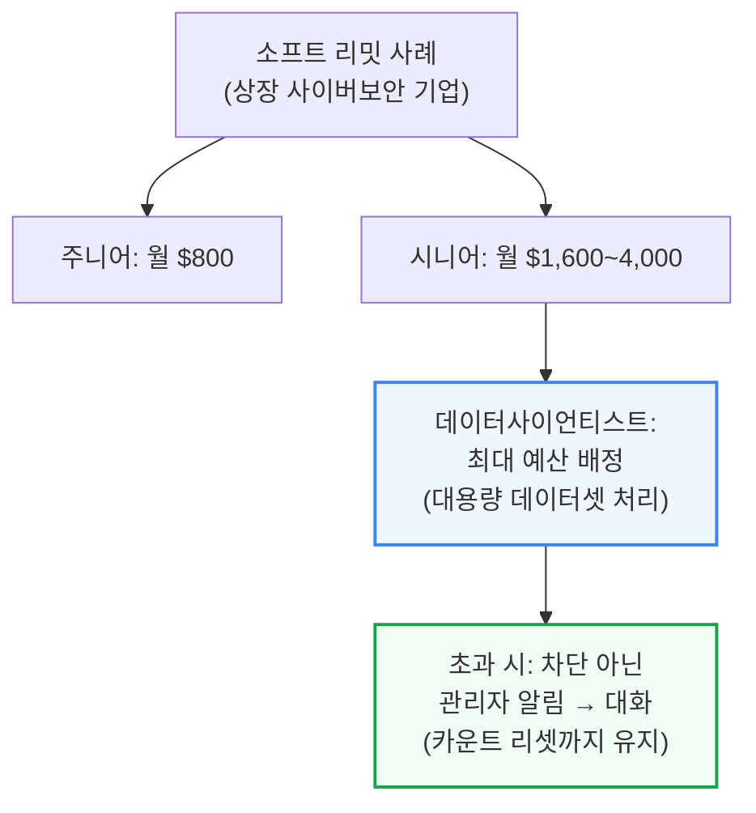
```mermaid
flowchart TD
    Soft["소프트 리밋 사례<br/>(상장 사이버보안 기업)"] --> Junior["주니어: 월 $800"]
    Soft --> Senior["시니어: 월 $1,600~4,000"]
    Senior --> DS["데이터사이언티스트:<br/>최대 예산 배정<br/>(대용량 데이터셋 처리)"]
    DS --> Overage["초과 시: 차단 아닌<br/>관리자 알림 → 대화<br/>(카운트 리셋까지 유지)"]
    style DS fill:#eff6ff,stroke:#3b82f6,stroke-width:2px
    style Overage fill:#f0fdf4,stroke:#16a34a,stroke-width:2px
```

---

## 4. 토큰 절약의 기술 - 직원들의 생존 전략

**📌 핵심:**
- 항공우주방산 기업이 $250/월 한도를 처음 도입했을 때 일부 파워유저는 단 4일 만에 소진 — 지금은 상향 요청이 가능하지만 예전엔 그렇지 않았음. 회사는 Opus 4.8과 Fast-Mode를 아예 꺼뒀고, 저자들은 이 "역자동화" 시각을 순진하다고 평가(이메일·슬랙도 결국 AI 네이티브화될 것)
- 글로벌 여행테크 기업(직원 1,500명 중 엔지니어 800명, 연 AI 지출 약 $1,000만에 근접)은 기본 모델을 Opus에서 Sonnet으로 전환 — Opus는 여전히 쓸 수 있지만 의식적 선택이 필요해짐, 기본 예산은 $200/월(직급별로 수만 달러까지 확대 가능)
- 많은 직원은 한도 근처에도 안 가 신경 쓰지 않음 — SemiAnalysis 사내에서도 일부는 하루 4\~5자리 금액을 쓰고 다른 이들은 거의 0에 가까운 극단적 편차가 존재(최고 퍼포머가 최대 소비자라 한도 자체를 두지 않음)
- 결론: MS365 엔터프라이즈 구독자는 표준 코파일럿 챗봇을 무제한 무료로 쓸 수 있는데 이 사용량은 월 예산에 안 잡힘 — 직원들은 코파일럿으로 먼저 초안을 만들고 유료 토큰(클로드·코덱스)은 다듬는 데만 써서 예산을 "게임"함

---

### 항공방산 기업 사례 - 4일 소진, 그리고 Opus·Fast-Mode 차단

이 기업은 $250/월 한도를 처음 도입했을 때 파워유저 일부가 단 4일 만에 다 써버렸습니다. 지금은 예산 상향 요청이 가능하지만 예전에는 그런 선택지가 없었습니다. 회사는 클로드 접근권은 유지하되 Opus 4.8과 Fast-Mode를 "불필요하다"며 꺼둔 상태입니다.

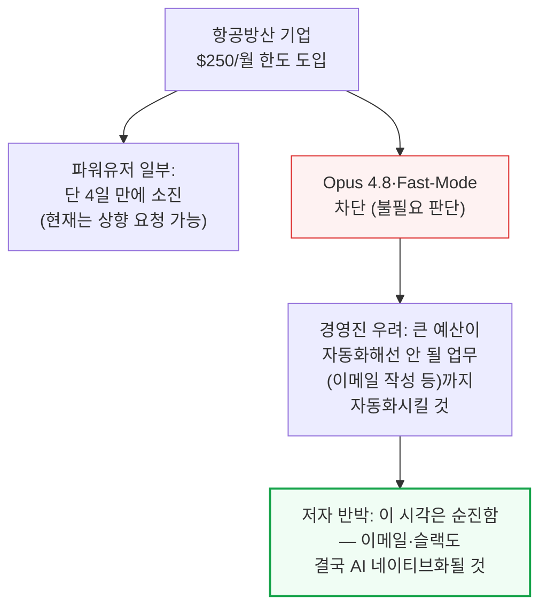
```mermaid
flowchart TD
    Aero["항공방산 기업<br/>$250/월 한도 도입"] --> Burn4["파워유저 일부:<br/>단 4일 만에 소진<br/>(현재는 상향 요청 가능)"]
    Aero --> Block["Opus 4.8·Fast-Mode<br/>차단 (불필요 판단)"]
    Block --> Fear["경영진 우려: 큰 예산이<br/>자동화해선 안 될 업무<br/>(이메일 작성 등)까지<br/>자동화시킬 것"]
    Fear --> Rebut["저자 반박: 이 시각은 순진함<br/>— 이메일·슬랙도<br/>결국 AI 네이티브화될 것"]
    style Block fill:#fef2f2,stroke:#dc2626
    style Rebut fill:#f0fdf4,stroke:#16a34a,stroke-width:2px
```

### 여행테크 기업 사례 - Opus에서 Sonnet으로 기본값 전환

이 글로벌 여행테크 기업은 직원 1,500명 중 800명이 엔지니어이며, 연 AI 지출은 약 $1,000만에 근접합니다. 최근 전 직원 기본 모델을 Opus에서 Sonnet으로 전환했고, Opus는 여전히 쓸 수 있지만 의식적으로 선택해야만 합니다.

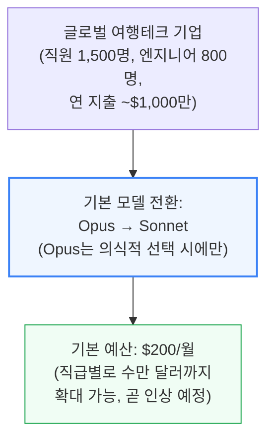
```mermaid
flowchart TD
    Travel["글로벌 여행테크 기업<br/>(직원 1,500명, 엔지니어 800명,<br/>연 지출 ~$1,000만)"] --> Switch["기본 모델 전환:<br/>Opus → Sonnet<br/>(Opus는 의식적 선택 시에만)"]
    Switch --> Budget2["기본 예산: $200/월<br/>(직급별로 수만 달러까지<br/>확대 가능, 곧 인상 예정)"]
    style Switch fill:#eff6ff,stroke:#3b82f6,stroke-width:2px
    style Budget2 fill:#f0fdf4,stroke:#16a34a
```

### 한도 무관심층과 MS365 코파일럿 게이밍

많은 직원은 한도 근처에도 가지 않아 신경 쓰지 않습니다. SemiAnalysis 사내에서도 일부는 하루 4\~5자리 금액을 쓰고 다른 이들은 거의 0에 가까운 극단적 편차가 있어 한도 자체를 두지 않았습니다. 반면 MS365 엔터프라이즈 구독자는 표준 코파일럿 챗봇을 무제한 무료로 쓸 수 있는데, 이 사용량은 월 예산에 안 잡히기 때문에 직원들은 코파일럿으로 먼저 아이디어를 초안·종합한 뒤 클로드·코덱스 같은 유료 토큰은 다듬는 데만 써서 할당량을 늘려 씁니다.

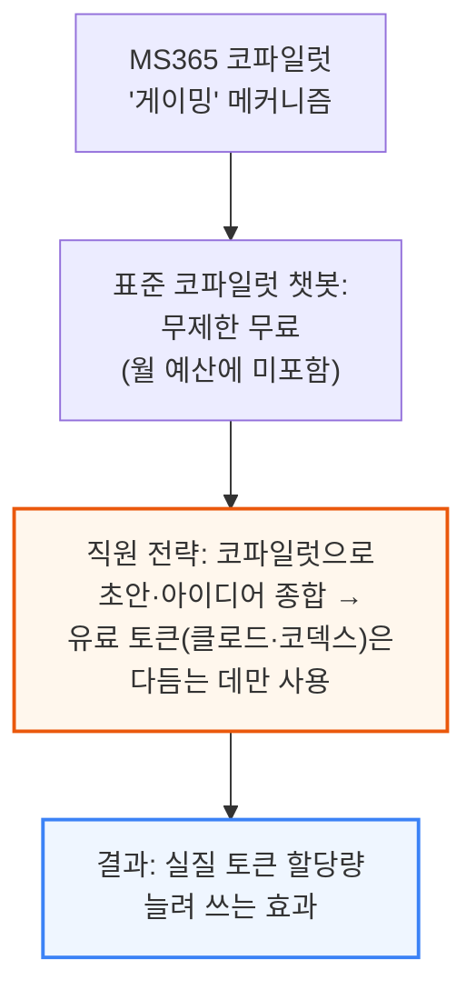
```mermaid
flowchart TD
    Gaming["MS365 코파일럿<br/>'게이밍' 메커니즘"] --> Free["표준 코파일럿 챗봇:<br/>무제한 무료<br/>(월 예산에 미포함)"]
    Free --> Draft["직원 전략: 코파일럿으로<br/>초안·아이디어 종합 →<br/>유료 토큰(클로드·코덱스)은<br/>다듬는 데만 사용"]
    Draft --> Stretch["결과: 실질 토큰 할당량<br/>늘려 쓰는 효과"]
    style Draft fill:#fff7ed,stroke:#ea580c,stroke-width:2px
    style Stretch fill:#eff6ff,stroke:#3b82f6,stroke-width:2px
```

---

## 5. AI를 헤드카운트 지렛대로 - 항공사·아마존 사례

**📌 핵심:**
- 미국 3대 항공사 중 한 곳은 토큰 예산을 개별 프로젝트와 그 프로젝트가 낼 것으로 기대되는 매출에 직접 연동 — 재무팀이 프로젝트 매출의 일정 비율을 여행비·계약자 비용 같은 지출 항목에 배정하고, 이제 토큰 사용도 같은 예산 안에 포함
- AI 비용은 회사가 지지만 그 혜택도 회사가 가져감 — 관대한 예산을 주는 회사는 직원이 더 빨리 일할 것이라는 기대가 깔려 있고, 실제로 산출 기대치가 지출과 함께 올라가 근무시간이 오히려 늘어난 사례도 다수
- 50개 이상 기업 대화를 종합하면 우버·메타 등 헤드라인을 장식한 사례는 ROI 높은 활동이 없어서가 아니라, 부실한 인센티브 설계와 느슨한 관리감독 때문이었다는 점이 뚜렷
- 결론: ROI 역학이 가장 뚜렷하게 드러나는 곳은 아마존 — 널리 보도된 정리해고에도 불구하고 AI 도구가 만든 효율 덕분에 오히려 더 빠른 속도로 채용을 이어가고 있음

---

### 항공사 사례 - 토큰 예산을 프로젝트 매출에 직접 연동

미국 3대 항공사 중 한 곳은 토큰 배분 방식에서 다른 기업들과 확연히 다릅니다. 프로젝트가 시작되면 재무팀이 그 프로젝트의 기대 매출 중 몇 %를 여행비·계약자 비용 같은 지출로 배정하는데, 이제는 토큰 사용도 이 예산 안에 포함시킵니다.

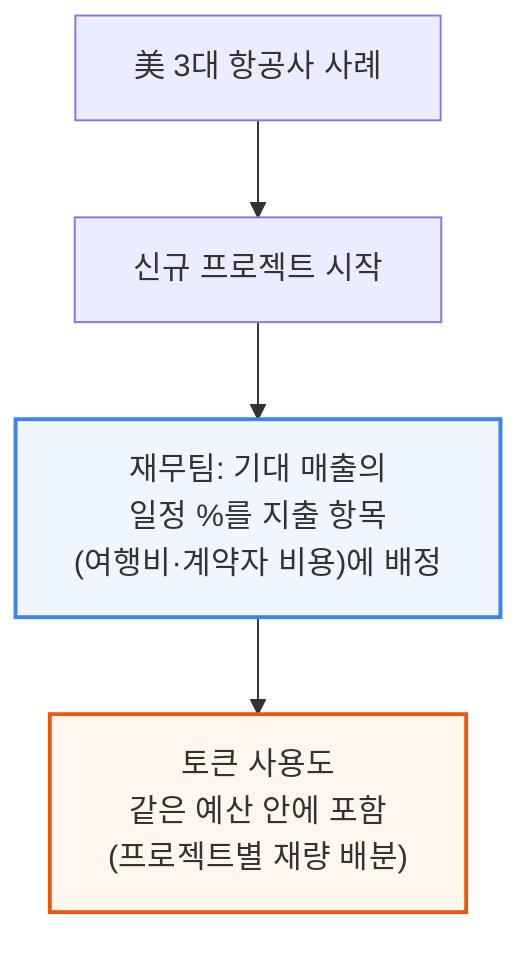
```mermaid
flowchart TD
    Airline["美 3대 항공사 사례"] --> Project["신규 프로젝트 시작"] --> Alloc["재무팀: 기대 매출의<br/>일정 %를 지출 항목<br/>(여행비·계약자 비용)에 배정"]
    Alloc --> TokenIn["토큰 사용도<br/>같은 예산 안에 포함<br/>(프로젝트별 재량 배분)"]
    style Alloc fill:#eff6ff,stroke:#3b82f6,stroke-width:2px
    style TokenIn fill:#fff7ed,stroke:#ea580c,stroke-width:2px
```

### 관대한 예산의 이면 - 산출 기대치도 함께 상승

이 구조는 AI 지출을 완전히 새로운 틀로 바꿉니다. 관대한 예산을 주는 회사는 직원이 더 빨리 일할 것이라는 기대에서 그렇게 하는 것이며, 실제로 산출 기대치가 지출과 함께 올라가 많은 직원이 예전보다 더 긴 시간 일하게 된 경우가 많습니다.

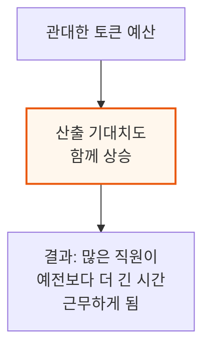
```mermaid
flowchart TD
    Generous["관대한 토큰 예산"] --> Expect["산출 기대치도<br/>함께 상승"]
    Expect --> Longer["결과: 많은 직원이<br/>예전보다 더 긴 시간<br/>근무하게 됨"]
    style Expect fill:#fff7ed,stroke:#ea580c,stroke-width:2px
```

### 헤드라인의 진짜 원인 - ROI 부재가 아니라 인센티브 설계 실패

50개 이상 기업과의 대화를 종합하면, 우버·메타를 비롯한 여러 포춘500 기업의 토큰맥싱 헤드라인은 고ROI 활동이 없어서가 아니라 부실한 인센티브 설계와 느슨한 관리감독의 결과였다는 점이 뚜렷합니다. ROI 역학이 가장 선명하게 드러나는 곳은 아마존으로, 널리 보도된 정리해고에도 불구하고 AI 도구가 만든 효율 덕분에 오히려 더 빠른 속도로 채용을 이어가고 있습니다.

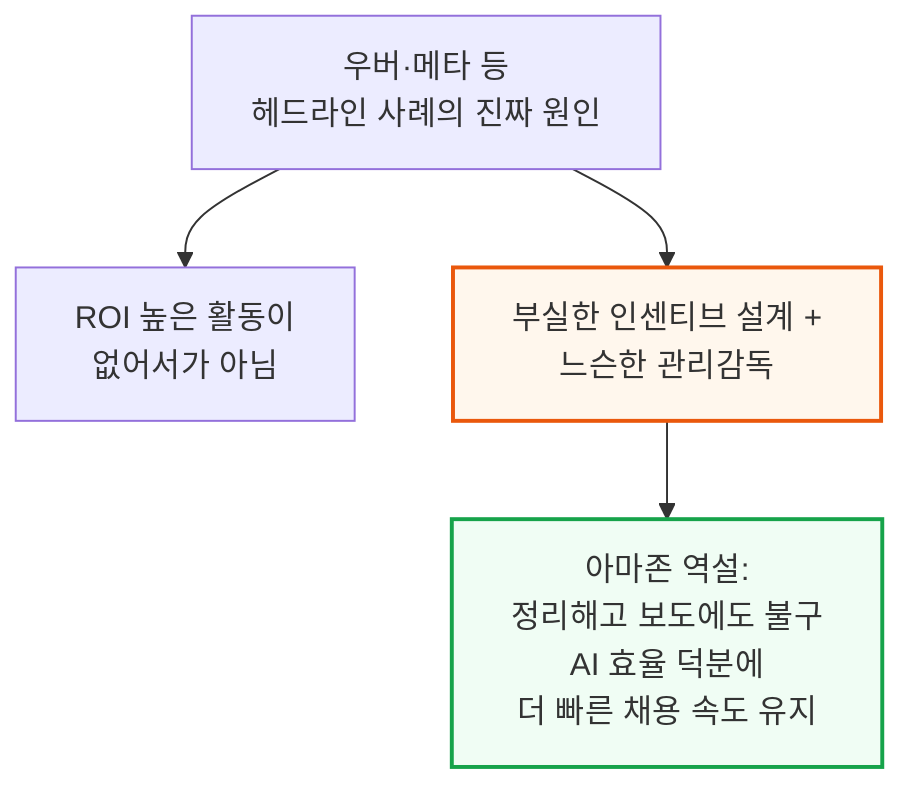
```mermaid
flowchart TD
    RealCause["우버·메타 등<br/>헤드라인 사례의 진짜 원인"] --> NotROI["ROI 높은 활동이<br/>없어서가 아님"]
    RealCause --> Incentive["부실한 인센티브 설계 +<br/>느슨한 관리감독"]
    Incentive --> AmazonPara["아마존 역설:<br/>정리해고 보도에도 불구<br/>AI 효율 덕분에<br/>더 빠른 채용 속도 유지"]
    style Incentive fill:#fff7ed,stroke:#ea580c,stroke-width:2px
    style AmazonPara fill:#f0fdf4,stroke:#16a34a,stroke-width:2px
```

---

## 6. 예산제는 이제 상수다 - 앤트로픽 실측 데이터

**📌 핵심:**
- 상한, 소프트 리밋, 토큰 절약 요령은 결국 모두 월말 청구서를 관리하는 수단일 뿐 — 뉴스에 나온 높은 지출 수치와 대조적으로, 앤트로픽 자체 문서는 클로드 코드의 개발자 1인당 평균 사용료가 월 $150\~250이라고 밝힘
- 사용자의 단 10%만 하루 $30 이상을 지출 — 즉 언론에 보도된 극단적 사례는 전체 사용자 기준으로 보면 예외적인 소수
- SemiAnalysis 팀의 현장 대화 결론은 명확: 2H26(2026년 하반기) AI 예산에 실질적 리스크는 없음
- 결론: 앤트로픽·오픈AI의 API 사업은 현재의 월간 신규 순증 속도(m/m net new rate)를 당분간 그대로 유지하며 계속 성장할 것으로 전망

---

### 뉴스 헤드라인 vs 앤트로픽 실측 데이터 - 극단치가 아닌 평균

뉴스에 보도된 높은 지출 수치와 달리, 앤트로픽 자체 문서에 따르면 클로드 코드 개발자 1인당 평균 사용료는 월 $150\~250에 불과합니다. 사용자의 단 10%만 하루 $30 이상을 지출하고 있어, 언론이 다룬 극단적 사례는 전체 사용자 기준으로는 예외적인 소수에 해당합니다.

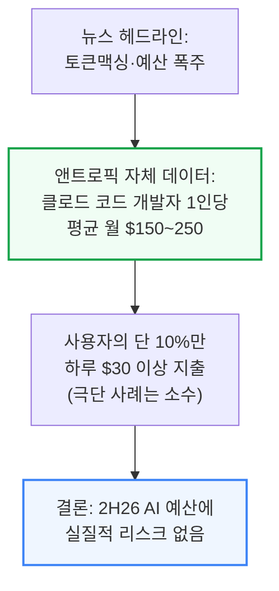
```mermaid
flowchart TD
    News["뉴스 헤드라인:<br/>토큰맥싱·예산 폭주"] --> Reality["앤트로픽 자체 데이터:<br/>클로드 코드 개발자 1인당<br/>평균 월 $150~250"]
    Reality --> Top10["사용자의 단 10%만<br/>하루 $30 이상 지출<br/>(극단 사례는 소수)"]
    Top10 --> Verdict["결론: 2H26 AI 예산에<br/>실질적 리스크 없음"]
    style Reality fill:#f0fdf4,stroke:#16a34a,stroke-width:2px
    style Verdict fill:#eff6ff,stroke:#3b82f6,stroke-width:2px
```

### 향후 전망 - API 사업 성장세는 그대로 유지

SemiAnalysis 팀의 현장 대화를 종합한 최종 결론은, 앤트로픽·오픈AI의 API 사업이 현재의 월간 신규 순증 속도를 당분간 그대로 유지하며 계속 성장하리라는 것입니다. 상한·소프트 리밋·절약 요령은 모두 결국 월말 청구서를 관리하는 수단일 뿐, 성장 자체를 꺾는 요인은 아니라는 뜻입니다.

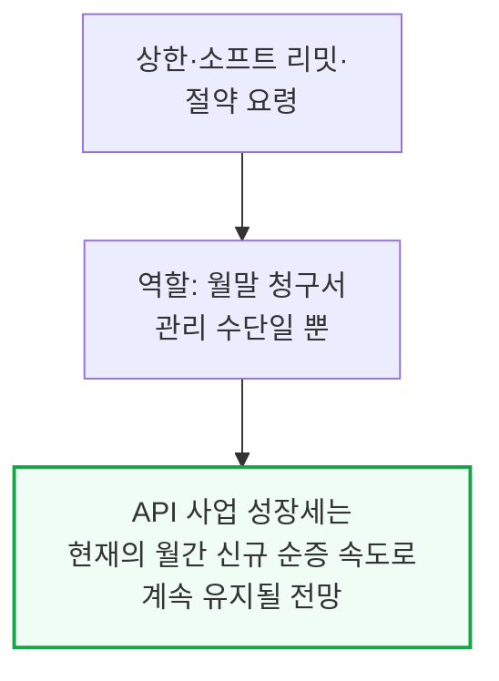
```mermaid
flowchart TD
    Tools["상한·소프트 리밋·<br/>절약 요령"] --> Purpose["역할: 월말 청구서<br/>관리 수단일 뿐"]
    Purpose --> Growth["API 사업 성장세는<br/>현재의 월간 신규 순증 속도로<br/>계속 유지될 전망"]
    style Growth fill:#f0fdf4,stroke:#16a34a,stroke-width:2px
```

---

*작성 진행률: 약 75% 완료*
*업데이트: 4\~6장(토큰 절약의 기술, AI를 헤드카운트 지렛대로, 예산제는 이제 상수다) 작성 완료*
