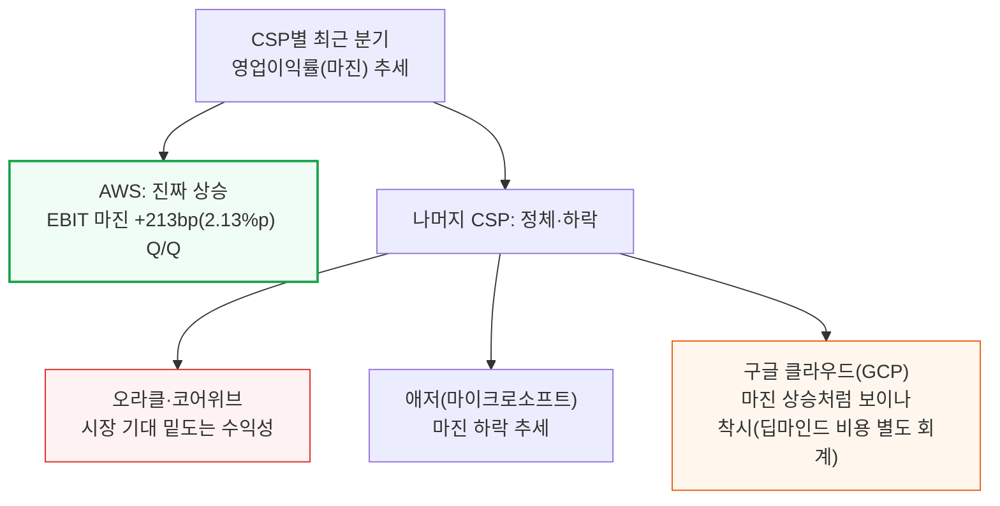
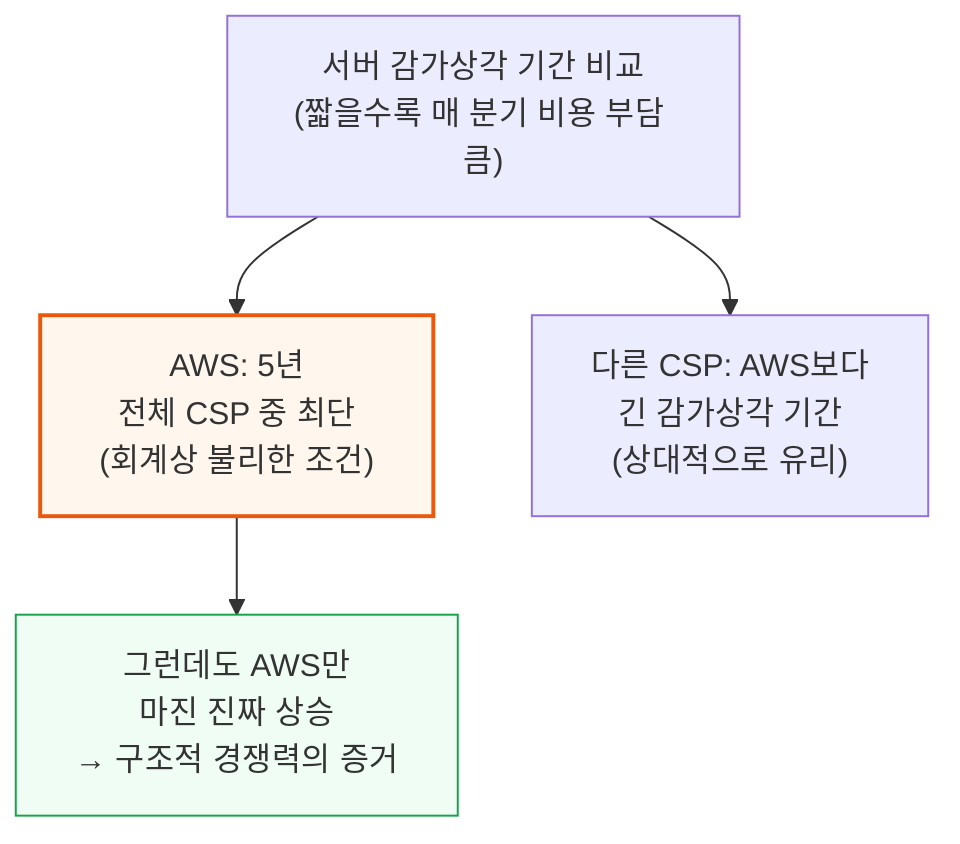
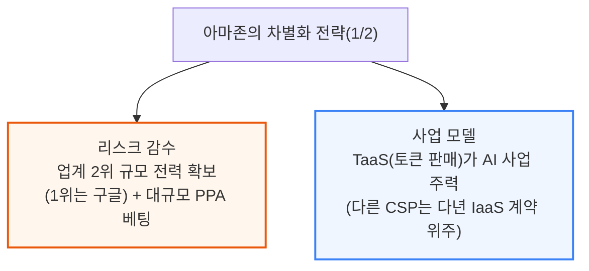
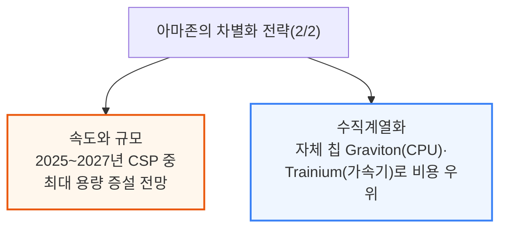
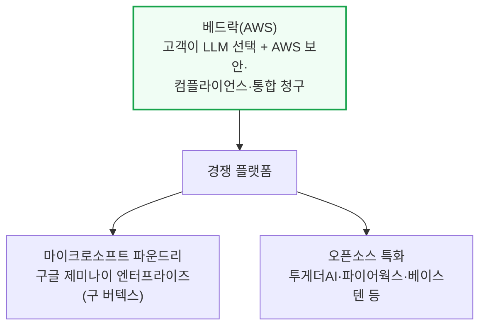
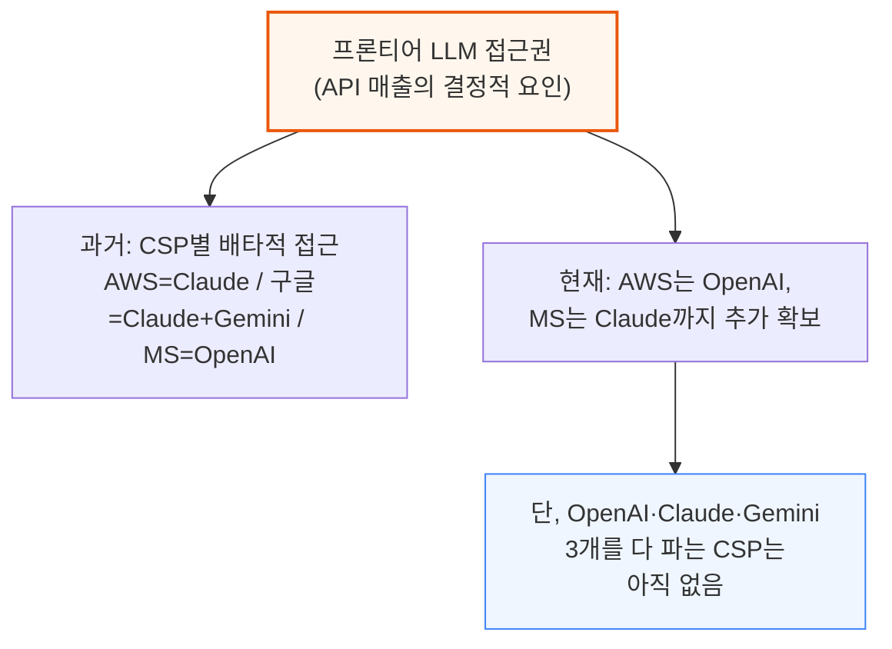

# Anthropic Growth and Bedrock Mix Drive AWS Margins Higher While Peers Lag

> **출처**: [SemiAnalysis Newsletter](https://newsletter.semianalysis.com/p/anthropic-growth-and-bedrock-mix)
> **저자**: Dylan Patel
> **발행일**: 2026-05-28

---

## 📑 목차

### 전체 섹션
 1. [서론: 나머지는 정체인데 AWS만 마진 상승](#1-서론-나머지는-정체인데-aws만-마진-상승)
 2. [아마존의 반전 스토리와 차별화 전략](#2-아마존의-반전-스토리와-차별화-전략)
 3. [아마존 베드락 딥다이브](#3-아마존-베드락-딥다이브)
 4. [토큰 서비스(TaaS) 플랫폼의 경제학](#4-토큰-서비스taas-플랫폼의-경제학)
 5. [수직계열화가 AWS를 업계 최고 마진으로 이끄는 이유](#5-수직계열화가-aws를-업계-최고-마진으로-이끄는-이유)
 6. [AWS 베드락 믹스, 숫자로 보기](#6-aws-베드락-믹스-숫자로-보기)
 7. [베드락-앤트로픽 딜 구조](#7-베드락-앤트로픽-딜-구조)
 8. [앤트로픽의 깜짝 1분기 실적](#8-앤트로픽의-깜짝-1분기-실적)
 9. [하이퍼스케일러 시사점 - 수요를 용량으로 뒷받침한 아마존](#9-하이퍼스케일러-시사점---수요를-용량으로-뒷받침한-아마존)
10. [구글의 반론과 그 실체](#10-구글의-반론과-그-실체)
11. [클라우드·AI 랩·하드웨어 삼중고 - 구글은 모든 수요를 감당할 수 있나](#11-클라우드ai-랩하드웨어-삼중고---구글은-모든-수요를-감당할-수-있나)
12. [하이퍼스케일러와 AI 랩에 대한 시사점](#12-하이퍼스케일러와-ai-랩에-대한-시사점)

---

## 🔑 용어 정리

본문을 순서대로 읽기 전에 알아두면 좋은 용어들입니다. 자세한 수치와 설명은 본문에서 처음 등장하는 위치에 나옵니다.

- **베드락 (Amazon Bedrock)**: AWS가 운영하는 서비스로, 고객이 원하는 LLM(거대언어모델)을 골라 AWS의 보안·과금 체계 위에서 쓸 수 있게 해주는 "모델 장터"
- **TaaS (Token-as-a-Service, 토큰 서비스)**: AI 모델을 직접 운영하지 않고, 모델이 만든 결과물(토큰)을 사용한 만큼 요금을 받는 판매 방식 — 베드락이 대표 사례
- **IaaS (Infrastructure-as-a-Service, 인프라 서비스)**: GPU 서버 등 컴퓨트 자원 자체를 다년 계약으로 빌려주는 전통적 클라우드 임대 방식
- **하이퍼스케일러 (Hyperscaler)**: 아마존·마이크로소프트·구글처럼 전 세계 규모의 데이터센터를 직접 짓고 운영하는 초대형 클라우드 업체
- **CSP (Cloud Service Provider, 클라우드 서비스 제공업체)**: 클라우드 인프라·서비스를 파는 회사를 통칭하는 표현 — 하이퍼스케일러보다 넓은 개념으로, 오라클·코어위브 같은 업체도 포함
- **ARR (Annual Recurring Revenue, 연환산매출)**: 현재 계약·매출 흐름이 1년간 유지된다고 가정했을 때의 매출 규모 — 성장 속도를 가늠하는 지표
- **EBIT 마진 (영업이익률)**: 이자·세금을 빼기 전 영업이익이 매출에서 차지하는 비율 — 이 문서에서 "마진"은 대부분 이 지표를 뜻함
- **PPA (Power Purchase Agreement, 전력구매계약)**: 발전사업자로부터 장기간 정해진 가격에 전력을 사기로 미리 맺는 계약 — 데이터센터용 전력 확보의 핵심 수단

---

## 1. 서론: 나머지는 정체인데 AWS만 마진 상승

**📌 핵심:**
- 지난 몇 분기 동안 다른 CSP(클라우드 서비스 제공업체)들의 영업이익률은 정체되거나 하락한 반면, AWS(아마존 클라우드 부문)만 이번 분기 영업이익률(EBIT 마진)이 전분기 대비 2.13%포인트(213bp) 상승 — 주된 원인은 앤트로픽의 Claude 모델을 베드락으로 쓰는 고객 지출 증가
- 오라클과 코어위브는 클라우드 부문 수익성이 시장 기대치를 밑돌아 실망감을 안겼고, 애저(마이크로소프트)도 마진 하락 추세이며, 구글 클라우드는 마진이 상승했지만 딥마인드 학습 비용이 GCP 사업부 회계에서 빠져 있어 실제보다 부풀려진 착시(10장에서 상세)
- AWS는 서버 감가상각 기간이 5년으로 전체 CSP 중 가장 짧음 — 감가상각 기간이 짧을수록 매 분기 비용 부담이 커지는데도, 이런 불리한 회계 조건에서 유일하게 진짜 상승 추세를 보임
- 결론: AWS의 마진 반전은 일시적 현상이 아니라 베드락 사업 구조와 앤트로픽 딜 조건이 만든 구조적 결과 — 이 리포트는 SemiAnalysis의 Tokenomics 2.0 모델(하이퍼스케일러·AI 랩 각 사업부의 분기 매출·이익·투하자본이익률(ROIC)·컴퓨트 수요를 추정하는 자체 모델)을 근거로 함

---

---

## 2. 아마존의 반전 스토리와 차별화 전략

**📌 핵심:**
- SemiAnalysis는 2023년 가장 먼저 아마존의 AI 리더십 상실을 지적했고, 2년 뒤에는 시장이 아직 아마존을 "AI 패자"로 낙인찍던 시점에 가장 먼저 반전 조짐(매출 가속)을 짚어냄
- 지금은 매출 성장 가속과 마진 개선이 동시에 나타나는 새로운 국면 — 아마존은 리스크 감수, 사업 모델, 속도·규모, 수직계열화 네 가지를 동시에 갖춘 유일한 CSP
- 리스크 감수 측면에서 아마존은 구글 다음으로 많은 전력을 확보 — 에너지 확보가 시장점유율을 좌우한다는 점을 먼저 파악해 대규모 전력구매계약(PPA)에 공격적으로 베팅
- 결론: 사업 모델 측면에서는 아마존만 유일하게 토큰 서비스(TaaS)가 AI 사업의 주력이고, 다른 CSP는 여전히 다년 계약형 인프라 임대(IaaS)에 집중 — 이 차이가 이후 마진 격차의 핵심 원인(4장에서 상세)

---

---

## 3. 아마존 베드락 딥다이브

**📌 핵심:**
- 베드락은 고객이 원하는 LLM을 골라 AWS의 보안·컴플라이언스·통합 청구 위에서 쓸 수 있게 해주는 서비스 — 이 시장을 업계는 "API 엔드포인트" 시장이라 부르며, 마이크로소프트 파운드리·구글 제미나이 엔터프라이즈(옛 버텍스)·투게더AI·파이어웍스·베이스텐 등이 경쟁
- 업체들은 보통 "모델 종류 수", "가격", "응답 속도(토큰당 처리량, 첫 토큰 응답 시간)"로 차별화를 내세우지만, SemiAnalysis Tokenomics 모델 분석 결과 진짜 결정적 요인은 "최상위 모델(프론티어 LLM) 접근권" — API 매출 대부분이 이런 프론티어 모델에서 나옴
- 프론티어 모델 접근권은 AWS·마이크로소프트·구글만 가진 압도적 우위: AWS는 원래 Claude만, 구글은 Claude와 Gemini, 마이크로소프트는 OpenAI만 팔 수 있었는데, 최근 AWS가 OpenAI 접근권까지 확보하고 마이크로소프트도 Claude를 확보 — 다만 OpenAI·Claude·Gemini 세 모델을 동시에 파는 CSP는 아직 없음
- 결론: 모델 접근권을 갖는 것과 그걸로 실제 사업을 키우는 것은 별개 문제 — AI 추론은 막대한 컴퓨트가 필요해, 다음 절에서 베드락·버텍스·파운드리의 실제 수익 구조를 파헤침

---

---

*작성 진행률: 약 25% 완료*
*업데이트: 헤더·목차·용어 정리 및 1~3장(서론, 아마존의 반전 스토리, 베드락 딥다이브) 작성 완료*
