# Anthropic Growth and Bedrock Mix Drive AWS Margins Higher While Peers Lag

> **출처**: [SemiAnalysis Newsletter](https://newsletter.semianalysis.com/p/anthropic-growth-and-bedrock-mix)
> **저자**: Dylan Patel
> **발행일**: 2026-05-28

---

## 📑 목차

### 전체 섹션
 1. [서론: 나머지는 정체인데 AWS만 마진 상승](#1-서론-나머지는-정체인데-aws만-마진-상승)
 2. [아마존의 반전 스토리와 차별화 전략](#2-아마존의-반전-스토리와-차별화-전략)
 3. [아마존 베드락 딥다이브](#3-아마존-베드락-딥다이브)
 4. [토큰 서비스(TaaS) 플랫폼의 경제학](#4-토큰-서비스taas-플랫폼의-경제학)
 5. [수직계열화가 AWS를 업계 최고 마진으로 이끄는 이유](#5-수직계열화가-aws를-업계-최고-마진으로-이끄는-이유)
 6. [AWS 베드락 믹스, 숫자로 보기](#6-aws-베드락-믹스-숫자로-보기)
 7. [베드락-앤트로픽 딜 구조](#7-베드락-앤트로픽-딜-구조)
 8. [앤트로픽의 깜짝 1분기 실적](#8-앤트로픽의-깜짝-1분기-실적)
 9. [하이퍼스케일러 시사점 - 수요를 용량으로 뒷받침한 아마존](#9-하이퍼스케일러-시사점---수요를-용량으로-뒷받침한-아마존)
10. [구글의 반론과 그 실체](#10-구글의-반론과-그-실체)
11. [클라우드·AI 랩·하드웨어 삼중고 - 구글은 모든 수요를 감당할 수 있나](#11-클라우드ai-랩하드웨어-삼중고---구글은-모든-수요를-감당할-수-있나)
12. [하이퍼스케일러와 AI 랩에 대한 시사점](#12-하이퍼스케일러와-ai-랩에-대한-시사점)

---

## 🔑 용어 정리

본문을 순서대로 읽기 전에 알아두면 좋은 용어들입니다. 자세한 수치와 설명은 본문에서 처음 등장하는 위치에 나옵니다.

- **베드락 (Amazon Bedrock)**: AWS가 운영하는 서비스로, 고객이 원하는 LLM(거대언어모델)을 골라 AWS의 보안·과금 체계 위에서 쓸 수 있게 해주는 "모델 장터"
- **TaaS (Token-as-a-Service, 토큰 서비스)**: AI 모델을 직접 운영하지 않고, 모델이 만든 결과물(토큰)을 사용한 만큼 요금을 받는 판매 방식 — 베드락이 대표 사례
- **IaaS (Infrastructure-as-a-Service, 인프라 서비스)**: GPU 서버 등 컴퓨트 자원 자체를 다년 계약으로 빌려주는 전통적 클라우드 임대 방식
- **하이퍼스케일러 (Hyperscaler)**: 아마존·마이크로소프트·구글처럼 전 세계 규모의 데이터센터를 직접 짓고 운영하는 초대형 클라우드 업체
- **CSP (Cloud Service Provider, 클라우드 서비스 제공업체)**: 클라우드 인프라·서비스를 파는 회사를 통칭하는 표현 — 하이퍼스케일러보다 넓은 개념으로, 오라클·코어위브 같은 업체도 포함
- **ARR (Annual Recurring Revenue, 연환산매출)**: 현재 계약·매출 흐름이 1년간 유지된다고 가정했을 때의 매출 규모 — 성장 속도를 가늠하는 지표
- **EBIT 마진 (영업이익률)**: 이자·세금을 빼기 전 영업이익이 매출에서 차지하는 비율 — 이 문서에서 "마진"은 대부분 이 지표를 뜻함
- **PPA (Power Purchase Agreement, 전력구매계약)**: 발전사업자로부터 장기간 정해진 가격에 전력을 사기로 미리 맺는 계약 — 데이터센터용 전력 확보의 핵심 수단

---

## 1. 서론: 나머지는 정체인데 AWS만 마진 상승

**📌 핵심:**
- 지난 몇 분기 동안 다른 CSP(클라우드 서비스 제공업체)들의 영업이익률은 정체되거나 하락한 반면, AWS(아마존 클라우드 부문)만 이번 분기 영업이익률(EBIT 마진)이 전분기 대비 2.13%포인트(213bp) 상승 — 주된 원인은 앤트로픽의 Claude 모델을 베드락으로 쓰는 고객 지출 증가
- 오라클과 코어위브는 클라우드 부문 수익성이 시장 기대치를 밑돌아 실망감을 안겼고, 애저(마이크로소프트)도 마진 하락 추세이며, 구글 클라우드는 마진이 상승했지만 딥마인드 학습 비용이 GCP 사업부 회계에서 빠져 있어 실제보다 부풀려진 착시(10장에서 상세)
- AWS는 서버 감가상각 기간이 5년으로 전체 CSP 중 가장 짧음 — 감가상각 기간이 짧을수록 매 분기 비용 부담이 커지는데도, 이런 불리한 회계 조건에서 유일하게 진짜 상승 추세를 보임
- 결론: AWS의 마진 반전은 일시적 현상이 아니라 베드락 사업 구조와 앤트로픽 딜 조건이 만든 구조적 결과 — 이 리포트는 SemiAnalysis의 Tokenomics 2.0 모델(하이퍼스케일러·AI 랩 각 사업부의 분기 매출·이익·투하자본이익률(ROIC)·컴퓨트 수요를 추정하는 자체 모델)을 근거로 함

---

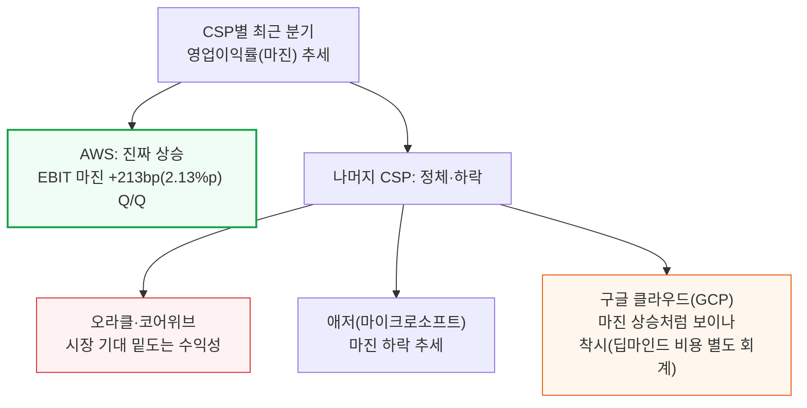

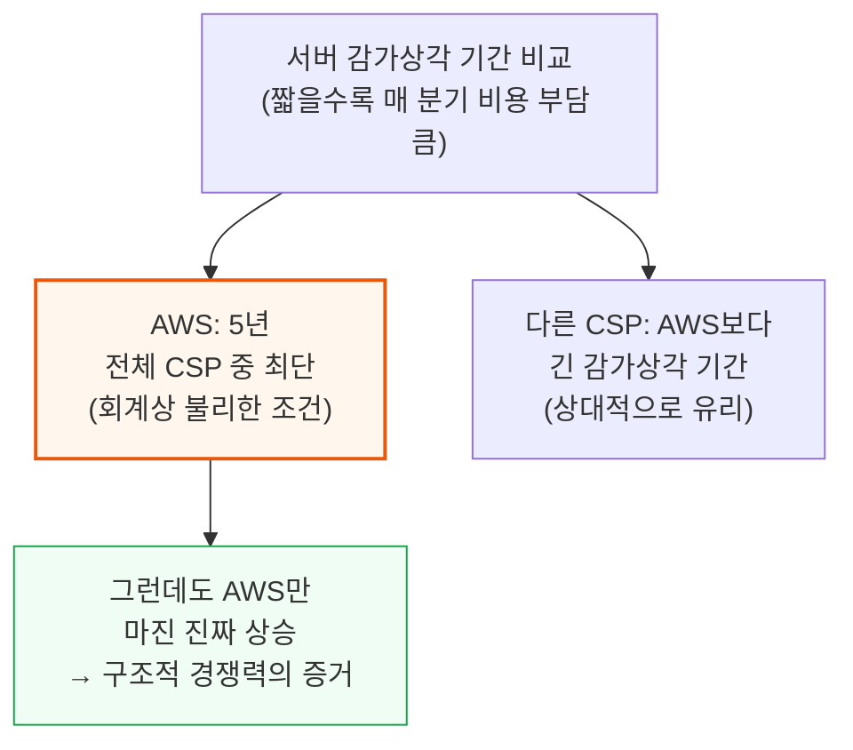

---

## 2. 아마존의 반전 스토리와 차별화 전략

**📌 핵심:**
- SemiAnalysis는 2023년 가장 먼저 아마존의 AI 리더십 상실을 지적했고, 2년 뒤에는 시장이 아직 아마존을 "AI 패자"로 낙인찍던 시점에 가장 먼저 반전 조짐(매출 가속)을 짚어냄
- 지금은 매출 성장 가속과 마진 개선이 동시에 나타나는 새로운 국면 — 아마존은 리스크 감수, 사업 모델, 속도·규모, 수직계열화 네 가지를 동시에 갖춘 유일한 CSP
- 리스크 감수 측면에서 아마존은 구글 다음으로 많은 전력을 확보 — 에너지 확보가 시장점유율을 좌우한다는 점을 먼저 파악해 대규모 전력구매계약(PPA)에 공격적으로 베팅
- 결론: 사업 모델 측면에서는 아마존만 유일하게 토큰 서비스(TaaS)가 AI 사업의 주력이고, 다른 CSP는 여전히 다년 계약형 인프라 임대(IaaS)에 집중 — 이 차이가 이후 마진 격차의 핵심 원인(4장에서 상세)

---

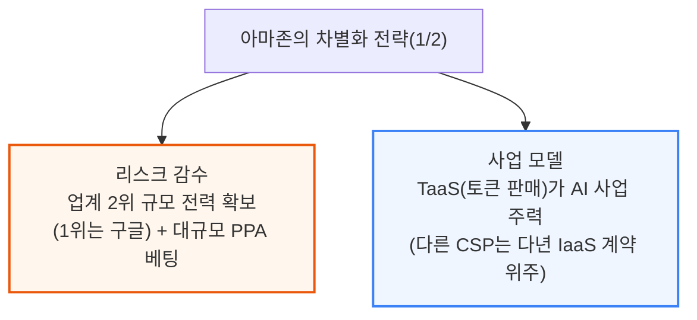

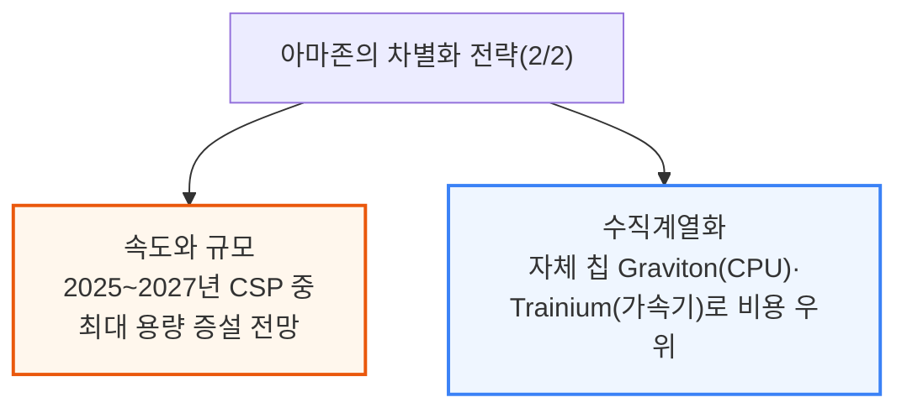

---

## 3. 아마존 베드락 딥다이브

**📌 핵심:**
- 베드락은 고객이 원하는 LLM을 골라 AWS의 보안·컴플라이언스·통합 청구 위에서 쓸 수 있게 해주는 서비스 — 이 시장을 업계는 "API 엔드포인트" 시장이라 부르며, 마이크로소프트 파운드리·구글 제미나이 엔터프라이즈(옛 버텍스)·투게더AI·파이어웍스·베이스텐 등이 경쟁
- 업체들은 보통 "모델 종류 수", "가격", "응답 속도(토큰당 처리량, 첫 토큰 응답 시간)"로 차별화를 내세우지만, SemiAnalysis Tokenomics 모델 분석 결과 진짜 결정적 요인은 "최상위 모델(프론티어 LLM) 접근권" — API 매출 대부분이 이런 프론티어 모델에서 나옴
- 프론티어 모델 접근권은 AWS·마이크로소프트·구글만 가진 압도적 우위: AWS는 원래 Claude만, 구글은 Claude와 Gemini, 마이크로소프트는 OpenAI만 팔 수 있었는데, 최근 AWS가 OpenAI 접근권까지 확보하고 마이크로소프트도 Claude를 확보 — 다만 OpenAI·Claude·Gemini 세 모델을 동시에 파는 CSP는 아직 없음
- 결론: 모델 접근권을 갖는 것과 그걸로 실제 사업을 키우는 것은 별개 문제 — AI 추론은 막대한 컴퓨트가 필요해, 다음 절에서 베드락·버텍스·파운드리의 실제 수익 구조를 파헤침

---

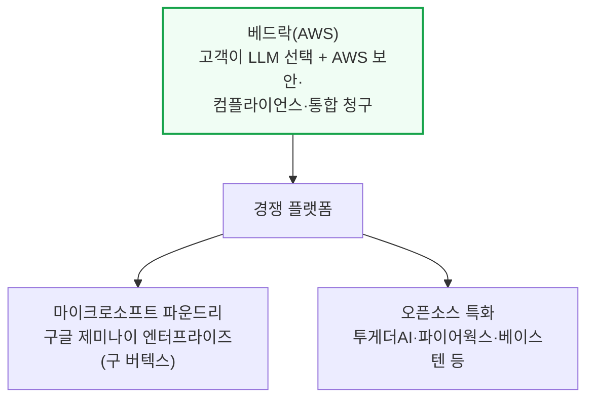

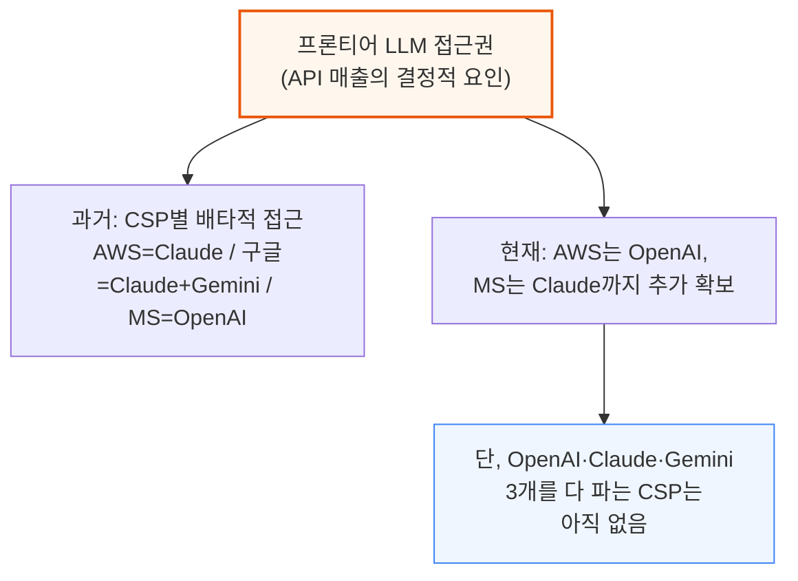

---

## 4. 토큰 서비스(TaaS) 플랫폼의 경제학

**📌 핵심:**
- 토큰 서비스(TaaS)의 수익 구조는 두 가지로 갈림: ① IP(모델)를 직접 소유(또는 오픈소스로 자유롭게 이용)하는 경우, ② 다른 AI 랩의 모델을 "유통"만 하는 경우
- IP 소유형은 AI 랩과 똑같은 구조 — GPU 감가상각, CSP 마진, 데이터센터 비용, 전기료 등 고정비를 토큰 판매 매출로 회수해야 하므로, 가격과 가동률이 모두 충분히 높아야 이익이 남음
- 유통형(베드락 방식)은 다름: 예를 들어 아마존이 고객에게 Claude 토큰을 팔아도 매출 계상 주체(seller of record)는 앤트로픽 — 고객은 AWS에 요금을 내지만, AWS는 ① EC2식 인프라 사용료와 ② 유통·매출 배분 수수료 두 가지를 받음. 이 ②번이 베드락 마진을 끌어올리는 핵심
- 결론: AI 랩 입장에선 CSP의 방대한 고객 기반에 접근하고 다년 계약 없이 컴퓨트를 확보(단, 단가는 더 비쌈)한다는 이득이 있고, CSP 입장에선 매출이 5년 확정계약(테이크오어페이)만큼 보장되지 않는 리스크가 있지만 마진은 훨씬 높음 — 아마존이 이 구조를 가장 잘 활용해 경쟁 플랫폼을 압도

---

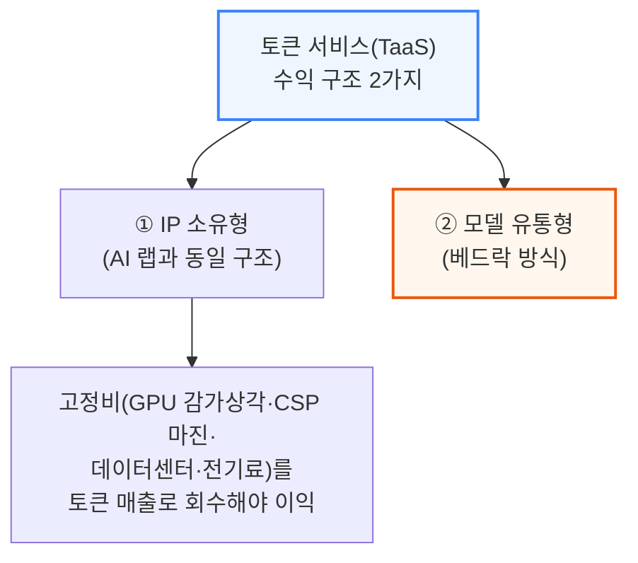

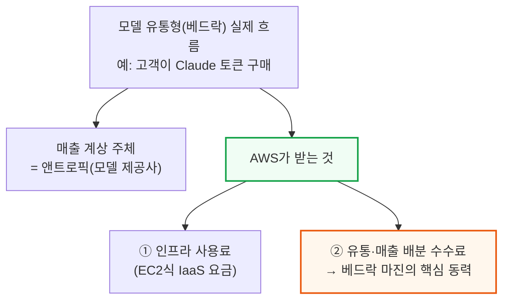

앤트로픽은 이 구조를 아마존·구글과 처음 도입했고, 최근에는 OpenAI도 아마존과 같은 방식을 시작했습니다. 보안이 매우 중요한데, CSP가 모델 가중치에 접근하지 않거나 매우 제한적으로만 접근하면서도 자사 인프라에서 모델을 돌릴 수 있어야 합니다.

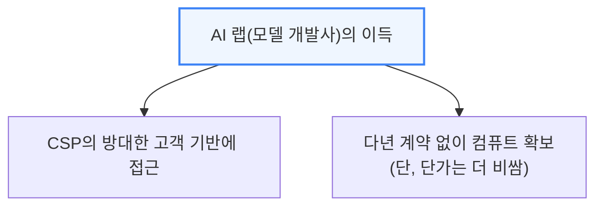

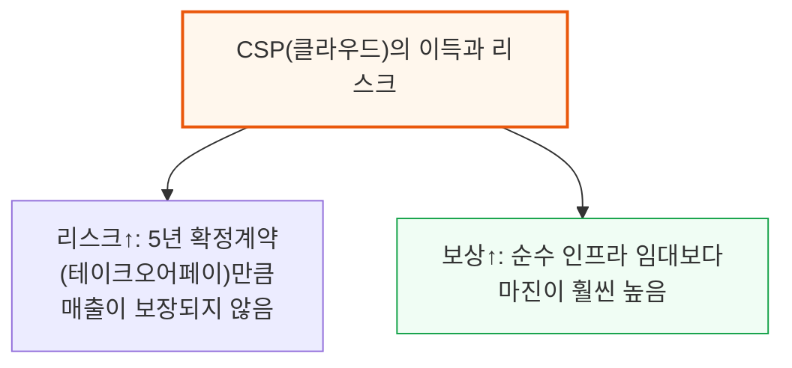

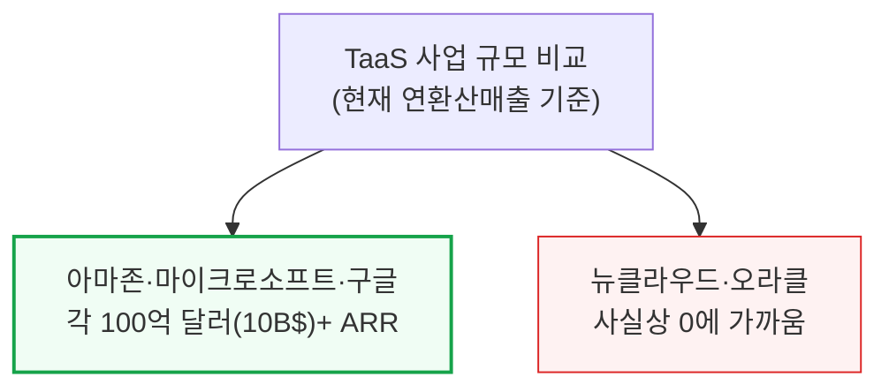

이처럼 마진 구조와 유통 우위가 상위 하이퍼스케일러와 나머지 CSP 사이의 격차를 계속 벌리고 있습니다.

---

## 5. 수직계열화가 AWS를 업계 최고 마진으로 이끄는 이유

**📌 핵심:**
- 베드락에서는 고객에게 하드웨어가 보이지 않고 토큰만 보임 — 그래서 추론에 최적화된 자체 칩(Trainium)을 쓰기에 최적의 조건이며, 모델 이식에 며칠 더 걸릴 뿐 큰 걸림돌은 아님
- 2025년 11월 AWS CEO 매트 가먼(Matt Garman) 발언: "자체 설계한 AWS Trainium 칩이 이제 아마존 베드락 토큰 사용량의 50% 이상을 처리" — 자체 칩과 베드락이 서로를 밀어주는 선순환
- CPU에서는 수직계열화 효과가 더 크게 나타남 — 5세대 자체 칩 Graviton은 성능 대비 총소유비용(TCO)에서 업계 최고 수준이고, Graviton4는 3세대 Trainium(Trn3)의 헤드노드로 통합되는 동시에 강화학습·에이전트 워크로드용으로 별도 활용
- 결론: 아마존은 앤트로픽·OpenAI·메타와 대규모 CPU/Graviton 계약을 이미 확보했고, 베드락 고객에게 Graviton을 얹어 파는 것(업셀)도 다른 CSP보다 훨씬 쉬움 — 칩과 서비스가 서로를 강화하는 구조

---

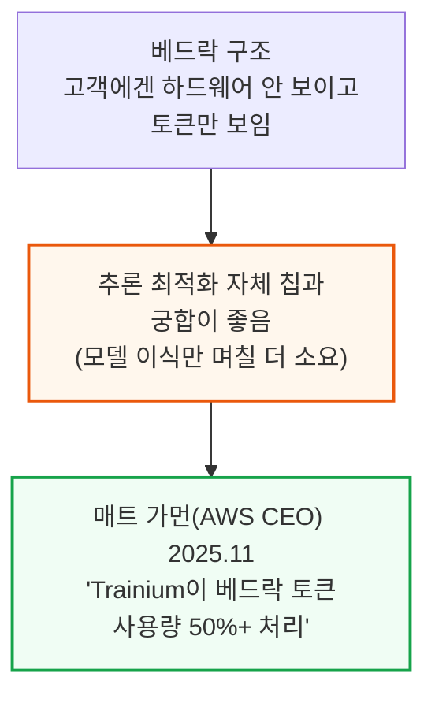

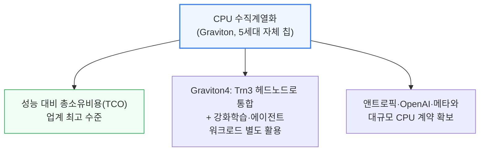

---

## 6. AWS 베드락 믹스, 숫자로 보기

**📌 핵심:**
- AWS 매출 중 AI 비중은 2%(2024년 1분기)에서 10%(2026년 1분기)로 상승 — 그런데 같은 시점 구글 클라우드(GCP)는 36%, 애저는 27%로 AWS보다 AI 비중 자체는 훨씬 높음
- 그런데도 AWS 마진이 앞서는 이유는 비중의 "질" — 베드락(토큰 서비스, TaaS)이 AWS AI 매출에서 차지하는 비중이 9%(2025년 1분기)에서 37%(현재)로 급등한 반면, 애저·GCP는 여전히 AI 매출의 80% 이상이 순수 인프라 임대(IaaS)
- 베드락 매출은 분기 성장률 170%(2026년 1분기), 60%(2025년 4분기)를 기록 — SemiAnalysis 추정 연환산 매출(런레이트) 55억 달러, 이 중 80\~90% 이상이 앤트로픽 모델 사용 고객
- 결론: 마이크로소프트는 여전히 IaaS 위주이고 Copilot(365·깃허브)류 자체 AI 서비스는 이렇다 할 성과를 못 냈으며, 구글은 제미나이 API로 선전했지만 앤트로픽의 코딩 시장 특수(API 매출 전년 대비 약 13배 증가)와 같은 효과는 누리지 못함

---

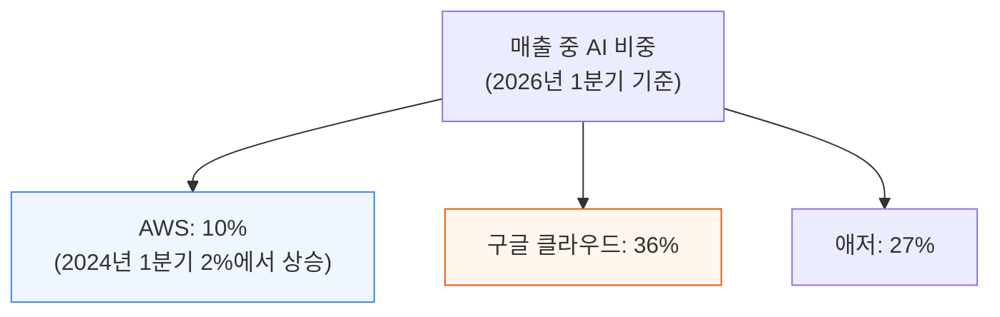

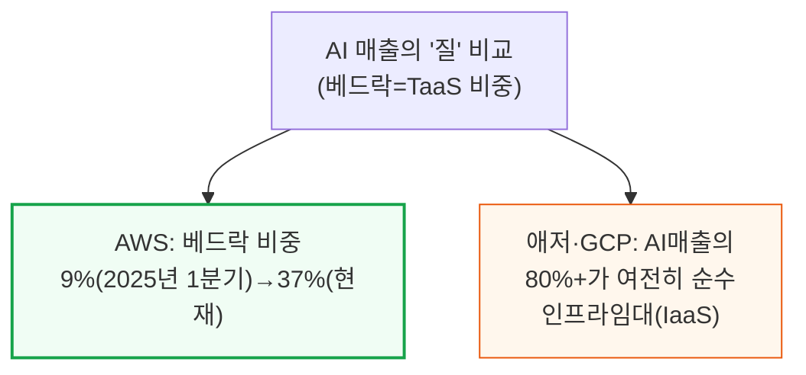

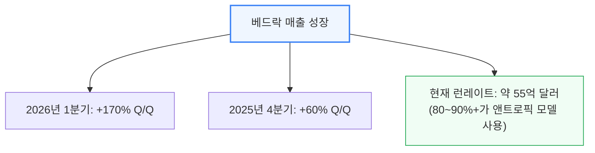

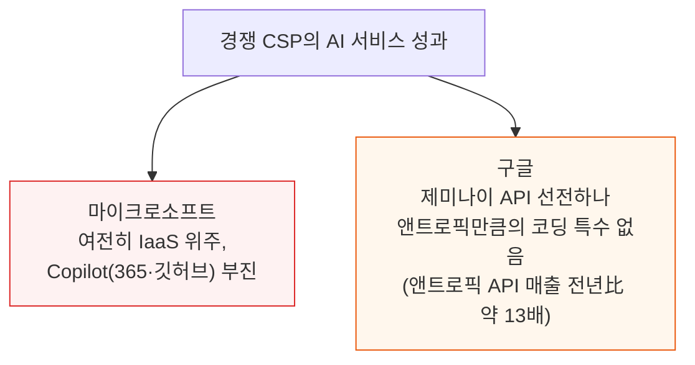

---

## 7. 베드락-앤트로픽 딜 구조

**📌 핵심:**
- 앤트로픽-베드락 딜 구조는 3층: ① 고정 인프라 사용료(IaaS 요금), ② 매출 배분 수수료, ③ 특정 토큰량·매출 규모를 넘기면 추가로 받는 성과 보너스(허들)
- SemiAnalysis 추정: 2026년 1분기 기준 앤트로픽의 베드락 매출은 컴퓨트 1MW(메가와트)당 약 2,600만 달러 — 이 수준에서 베드락 영업이익률(EBIT 마진)은 약 55%로 추정
- 2026년 1분기 AWS의 전년 대비 영업이익 증가분(총이익 달러 증가분)의 30%를 베드락이 차지 — 그런데 베드락은 AWS 전체 매출의 4%에 불과, 즉 매출 비중은 작아도 이익 기여는 압도적으로 큼
- 결론: 2분기 전망은 앤트로픽 ARR가 컴퓨트 MW당 약 4,200만 달러로 더 오르고 베드락이 AWS AI 매출의 53%까지 확대돼 AWS 전체 매출 성장률에 9%포인트를 추가 기여할 전망 — 다만 앤트로픽의 회계(총액 기준 ARR 인식) 특성상 베드락 마진 자체는 앤트로픽의 현재 평균 추론 매출총이익률(60%대 초반)보다는 약간 낮은 믹스

---

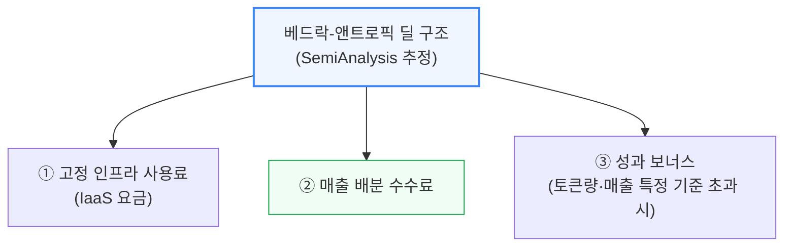

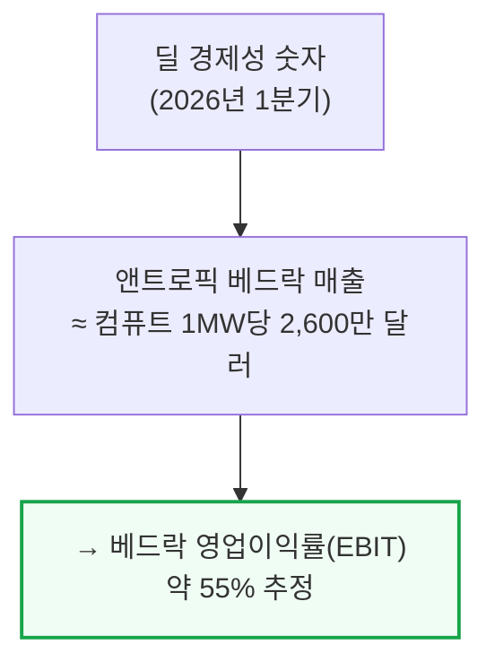

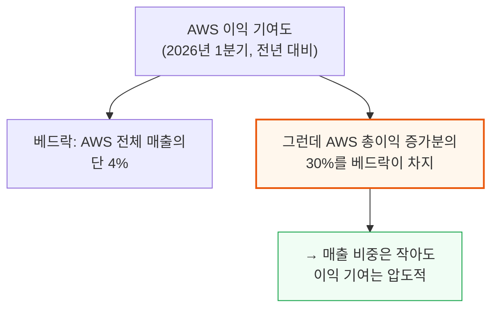

```mermaid
flowchart TD
    Forecast2Q["2분기(2026년) 전망"] --> F1["앤트로픽 ARR<br/>MW당 약 4,200만 달러로 상승"]
    Forecast2Q --> F2["베드락 비중<br/>AWS AI매출의 53%까지 확대"]
    F2 --> F3["→ AWS 전체 매출 성장률에<br/>9%포인트 추가 기여"]

    style Forecast2Q fill:#eff6ff,stroke:#3b82f6,stroke-width:2px
    style F3 fill:#f0fdf4,stroke:#16a34a
```

---

## 8. 앤트로픽의 깜짝 1분기 실적

**📌 핵심:**
- 앤트로픽은 2026년 1분기에만 신규 ARR 210억 달러를 추가해 총 ARR 300억 달러를 달성 — 성장 엔진은 기업들이 몰려든 코딩 에이전트 Claude Code이며, 일반 소비자 수요도 함께 증가
- 앤트로픽은 매출 대부분이 API·기업(엔터프라이즈) 기반인 반면, OpenAI는 소비자 비중이 높아 무료 사용자의 추론 비용 부담이 상대적으로 큼 — SemiAnalysis는 카드결제 데이터 기준 앤트로픽의 신규 고객 점유율이 OpenAI를 앞서기 시작했고 평균 결제 금액도 더 높다고 확인
- 앤트로픽의 추론 컴퓨트 매출총이익률은 2024년 -94%(적자) → 2025년 38% → 현재 60%대 중반까지 급상승 — 월스트리트저널 2026년 5월 20일 보도에 따르면 주식보상비용을 제외한 기준으로 앤트로픽은 2분기 영업이익 흑자 전환이 예상됨
- 결론: SemiAnalysis Tokenomics 모델은 연말까지 앤트로픽 ARR이 1,000억 달러를 훌쩍 넘어설 잠재력이 있다고 추정 — 이 성장이 그대로 베드락 매출·AWS 마진으로 이어지는 구조

---

```mermaid
flowchart TD
    Anthropic1Q["앤트로픽 2026년 1분기 실적"] --> ARR1["신규 ARR +210억 달러<br/>→ 총 ARR 300억 달러"]
    ARR1 --> Driver["성장 동력: 코딩 에이전트<br/>Claude Code 기업 채택 확산<br/>+ 소비자 수요 증가"]

    style Anthropic1Q fill:#eff6ff,stroke:#3b82f6,stroke-width:2px
    style Driver fill:#f0fdf4,stroke:#16a34a
```

```mermaid
flowchart TD
    MarginTrend["앤트로픽 추론 컴퓨트<br/>매출총이익률 추이"] --> Y2024["2024년: -94%(적자)"]
    MarginTrend --> Y2025["2025년: 38%"]
    MarginTrend --> Y2026b["2026년 현재: 60%대 중반"]

    style Y2024 fill:#fef2f2,stroke:#dc2626
    style Y2026b fill:#f0fdf4,stroke:#16a34a,stroke-width:2px
```

```mermaid
flowchart TD
    WSJ["WSJ 2026년 5월 20일 보도"] --> Profit["앤트로픽, 2분기 영업이익<br/>흑자 전환 예상<br/>(주식보상비용 제외 기준)"]
    Profit --> Forecast3["SemiAnalysis 전망:<br/>연말 ARR 1,000억 달러<br/>훌쩍 상회 가능"]

    style WSJ fill:#fff7ed,stroke:#ea580c,stroke-width:2px
    style Forecast3 fill:#f0fdf4,stroke:#16a34a,stroke-width:2px
```

---

## 9. 하이퍼스케일러 시사점 - 수요를 용량으로 뒷받침한 아마존

**📌 핵심:**
- 토큰 서비스(TaaS)를 경쟁사보다 큰 규모로 운영하려면 결국 컴퓨트 용량 자체가 더 많아야 함 — AI 추론은 컴퓨트 소모가 매우 크기 때문. 아마존은 2025\~2026년엔 마이크로소프트와 비슷한 속도지만 2027년엔 압도적으로 앞서는 용량 증설을 계획 중
- 총용량만으로는 부족 — 실제 외부 고객이 쓸 수 있는 용량인지가 중요함. 마이크로소프트는 자체 AI(내부용)에 배정하는 용량이 아마존보다 커서 외부 고객에게 돌아갈 몫이 줄어들고, 그마저 대부분 OpenAI와의 장기 계약으로 묶여 있음(OpenAI 수주잔고가 애저 연매출의 2.5배)
- 아마존은 발전사업자(Talen·Vistra·NiSource 등)와 대규모 전력구매계약(PPA)을 공격적으로 체결해 전력 파이프라인을 키웠고, 인디애나·미시시피에 약 2GW 규모 클러스터를 빠르게 건설 — 반면 마이크로소프트는 위스콘신 건설이 느렸고 1년간 데이터센터 신규 착공을 멈춘 적도 있어 2027년 용량 전망이 크게 낮아짐
- 결론: 마이크로소프트가 따라잡으려면 결국 더 비싼 뉴클라우드(중소형 GPU 임대업체) 용량을 계약해야 하는데, 이는 마진 우위를 스스로 깎아먹는 선택 — 아마존은 이 격차를 더 벌리기 위해 모듈화·프리팹(사전 조립) 비중을 높인 신규 데이터센터 설계까지 새로 도입 중

---

```mermaid
flowchart TD
    Capacity["신규 용량 증설 전망<br/>(2025~2027년)"] --> AWS4["아마존: 2025~26년<br/>MS와 비슷, 2027년<br/>압도적 1위"]
    Capacity --> MS5["마이크로소프트:<br/>2027년 크게 뒤처짐<br/>(데이터센터 일시 중단 영향)"]

    style AWS4 fill:#f0fdf4,stroke:#16a34a,stroke-width:2px
    style MS5 fill:#fef2f2,stroke:#dc2626
```

```mermaid
flowchart TD
    UsableCapacity["실제 외부 고객이<br/>쓸 수 있는 용량"] --> MSInternal["마이크로소프트<br/>내부 AI용 배정이 아마존보다 큼<br/>→ 외부 고객 몫 축소"]
    MSInternal --> OpenAILock["대부분 OpenAI 장기계약으로 묶임<br/>(OpenAI 수주잔고=애저<br/>연매출의 2.5배)"]

    style MSInternal fill:#fff7ed,stroke:#ea580c,stroke-width:2px
    style OpenAILock fill:#fef2f2,stroke:#dc2626
```

```mermaid
flowchart TD
    AWSSpeed["아마존의 속도 우위"] --> Power2["IPP(Talen·Vistra·NiSource)와<br/>대규모 PPA(전력구매계약) 체결"]
    AWSSpeed --> Build2["인디애나·미시시피<br/>약 2GW 클러스터<br/>초고속 건설"]
    AWSSpeed --> Design["모듈화·프리팹 강화한<br/>신규 데이터센터 설계 도입"]

    style AWSSpeed fill:#eff6ff,stroke:#3b82f6,stroke-width:2px
    style Build2 fill:#f0fdf4,stroke:#16a34a
```

```mermaid
flowchart TD
    MSSlow["마이크로소프트의 지연"] --> Freeze["1년간 데이터센터<br/>신규 착공 중단"]
    MSSlow --> Wisconsin["위스콘신 대규모<br/>AI 클러스터 건설 지연"]
    Freeze --> Catch["따라잡으려면 더 비싼<br/>뉴클라우드 용량 계약 불가피<br/>→ 마진 우위 훼손"]

    style MSSlow fill:#fef2f2,stroke:#dc2626,stroke-width:2px
    style Catch fill:#fff7ed,stroke:#ea580c
```

---

## 10. 구글의 반론과 그 실체

**📌 핵심:**
- AWS 우위론에 대한 가장 자연스러운 반론은 "구글 클라우드(GCP)도 마진이 오르고 있고, 수직계열화는 AWS 못지않으며, 최근 분기 매출 성장률은 전년 대비 60% 이상으로 오히려 AWS를 능가한다"는 것 — 실제로 GCP 마진은 사상 최고치
- 그러나 SemiAnalysis는 이 마진 상승을 "EBTIT(학습비용·이자·세금을 빼기 전 이익)" 착시로 봄 — 딥마인드·제미나이 모델 학습 비용이 GCP 사업부가 아니라 "알파벳 레벨 활동"이라는 별도 회계 항목에 잡히기 때문
- 구글 최신 10-Q(분기보고서)에 따르면 알파벳 레벨 활동 비용(주로 공유 AI 연구개발 비용)이 2025년 1분기 30억 달러에서 2026년 1분기 54억 달러로 증가 — 즉 제미나이 API 매출은 전부 GCP 마진에 잡히는데, 연환산 100억 달러 이상의 관련 비용은 GCP 밖 다른 계정에 숨어 있는 셈
- 결론: 여기에 더해 구글이 브로드컴을 통해 앤트로픽에 TPU를 판매하며 IP 사용료(로열티)를 일회성으로 인식했을 가능성도 있어, GCP의 마진 개선분 중 상당액이 지속 가능한 구조적 개선이 아닐 수 있음

---

```mermaid
flowchart TD
    Pushback["AWS 우위론에 대한 반론"] --> GCP5["GCP도 마진 상승<br/>매출 성장률 전년比 60%+<br/>(AWS 능가)"]
    GCP5 --> Verdict["SemiAnalysis 판단:<br/>'EBTIT' 착시<br/>(학습비용 별도 회계)"]

    style GCP5 fill:#eff6ff,stroke:#3b82f6
    style Verdict fill:#fef2f2,stroke:#dc2626,stroke-width:2px
```

```mermaid
flowchart TD
    Illusion["마진 상승의 실체"] --> Cost1["딥마인드·제미나이 학습비용은<br/>GCP가 아니라<br/>'알파벳 레벨 활동'에 계상"]
    Cost1 --> Growth3["이 비용: 30억 달러(2025년 1분기)<br/>→ 54억 달러(2026년 1분기)"]
    Growth3 --> Hidden["→ 제미나이 API 매출은<br/>GCP 마진에 반영되지만<br/>관련 비용 100억+ 달러는 GCP 밖"]

    style Cost1 fill:#fff7ed,stroke:#ea580c,stroke-width:2px
    style Hidden fill:#fef2f2,stroke:#dc2626,stroke-width:2px
```

```mermaid
flowchart TD
    Extra["추가 요인(가능성)"] --> Royalty["브로드컴 경유<br/>앤트로픽向 TPU 판매<br/>일회성 로열티 수익 가능성"]

    style Extra fill:#fff7ed,stroke:#ea580c
```

---

## 11. 클라우드·AI 랩·하드웨어 삼중고 - 구글은 모든 수요를 감당할 수 있나

**📌 핵심:**
- 구글은 동시에 여러 전선에서 싸우는 유일한 회사 — 클라우드에서 AWS, 하드웨어에서 엔비디아, 모델에서 앤트로픽·OpenAI, 광고에서 메타, 자율주행에서 테슬라와 경쟁 — 그만큼 "공급 제약"을 가장 크게 받는 사업 구조
- 구글의 용량 증설 규모를 뜯어보면 이 모든 수요를 다 감당할 만큼 크지 않음 — 내부용(자체 AI 랩 운영)으로는 충분하지만, 그러고 나면 클라우드 사업(하드웨어 판매 제외)을 AWS만큼 키울 여력이 부족
- 앤트로픽(그리고 향후 OpenAI 가능성)을 위한 유통 플랫폼인 제미나이 엔터프라이즈(옛 버텍스)는 베드락보다 뚜렷이 적은 용량 증설을 받고 있음 — 즉 구글은 GCP를 독립 성장 엔진이 아니라 다른 사업(하드웨어·광고)을 팔기 위한 "업셀 창구"로 쓰는 모습
- 결론: 메타가 대표 사례 — 대규모 GPU 임대 계약이 제미나이 대규모 채택으로 이어지고, 이어서 대형 TPU 하드웨어 계약으로까지 확대되는 패턴, 즉 구글은 클라우드 자체보다 하드웨어·모델 밀어팔기에 GCP 용량을 우선 배정

---

```mermaid
flowchart TD
    Google6["구글의 동시다발 경쟁 구도"] --> G1["클라우드: AWS와 경쟁"]
    Google6 --> G2["하드웨어: 엔비디아와 경쟁"]
    Google6 --> G3["모델: 앤트로픽·OpenAI와 경쟁<br/>(+광고 메타, 자율주행 테슬라)"]

    style Google6 fill:#fef2f2,stroke:#dc2626,stroke-width:2px
```

```mermaid
flowchart TD
    Capacity2["구글 용량 배분 우선순위"] --> Internal2["1순위: 내부 AI 랩<br/>(자체 모델 운영에 충분)"]
    Internal2 --> Cloud3["2순위: 클라우드 사업<br/>→ AWS만큼 키울 여력 부족"]
    Cloud3 --> Vertex["제미나이 엔터프라이즈(구 버텍스)<br/>베드락보다 용량 증설<br/>뚜렷이 적음"]

    style Internal2 fill:#eff6ff,stroke:#3b82f6
    style Vertex fill:#fff7ed,stroke:#ea580c,stroke-width:2px
```

```mermaid
flowchart TD
    MetaCase["메타 사례로 본<br/>구글의 실제 우선순위"] --> Step1b["① 대규모 GPU 임대 계약"]
    Step1b --> Step2b["② 제미나이 대규모 채택으로 연결"]
    Step2b --> Step3b["③ 대형 TPU 하드웨어 계약으로 확대"]
    Step3b --> Verdict2["→ GCP는 하드웨어·모델을<br/>밀어파는 '업셀 창구'"]

    style Verdict2 fill:#fef2f2,stroke:#dc2626,stroke-width:2px
```

---

## 12. 하이퍼스케일러와 AI 랩에 대한 시사점

**📌 핵심:**
- SemiAnalysis 전망: 향후 2\~3년간 선두 인프라 임대(IaaS) CSP들의 마진은 계속 개선될 것 — 대규모 용량 증설과 설비투자(캐펙스) 급증이 동시에 벌어지는 시기에도 AWS가 마진 상승을 보여준 것은 이례적 성과이며 전략적 의사결정의 결과
- 장기적으로는 AI 랩들이 자체 추론 스택을 점점 더 수직계열화해 순수 IaaS 벤더의 마진을 압박할 것으로 예상 — AI 랩이 직접 인프라를 갖추면 CSP를 거칠 이유가 줄어듦
- 동시에 CSP들도 자체 칩(커스텀 실리콘)과 전략적 파트너십을 통해 수직계열화를 강화할 전망 — 대규모·다각화된 고객 기반이라는 CSP만의 강점을 살려 가치를 더할 수 있는 영역
- 결론: 결국 승자는 컴퓨트를 가장 많이, 가장 빨리, 가장 유리한 조건(자체 칩+독점적 유통 딜)으로 확보하는 업체 — 지금까지는 그 조합을 가장 잘 갖춘 곳이 아마존

---

```mermaid
flowchart TD
    Outlook["향후 2~3년 전망"] --> O1["선두 IaaS CSP<br/>마진 지속 개선 전망"]
    Outlook --> O2["AI 랩의 추론 스택<br/>수직계열화 심화<br/>→ 순수 IaaS 마진 압박"]
    Outlook --> O3["CSP도 자체 칩+파트너십으로<br/>수직계열화 강화"]

    style Outlook fill:#eff6ff,stroke:#3b82f6,stroke-width:2px
    style O2 fill:#fff7ed,stroke:#ea580c
```

```mermaid
flowchart TD
    Winner["최종 승자 조건"] --> W1["컴퓨트를 가장 많이,<br/>가장 빨리 확보"]
    W1 --> W2["+ 자체 칩·독점 유통딜로<br/>가장 유리한 조건 확보"]
    W2 --> W3["현재까지 이 조합을<br/>가장 잘 갖춘 곳: 아마존"]

    style W3 fill:#f0fdf4,stroke:#16a34a,stroke-width:2px
```

---

*작성 진행률: 100% 완료*
*업데이트: 10~12장(구글의 반론, 클라우드·AI 랩·하드웨어 삼중고, 하이퍼스케일러·AI 랩 시사점) 작성 완료 — 원문 전체 12개 섹션 번역 완료*
