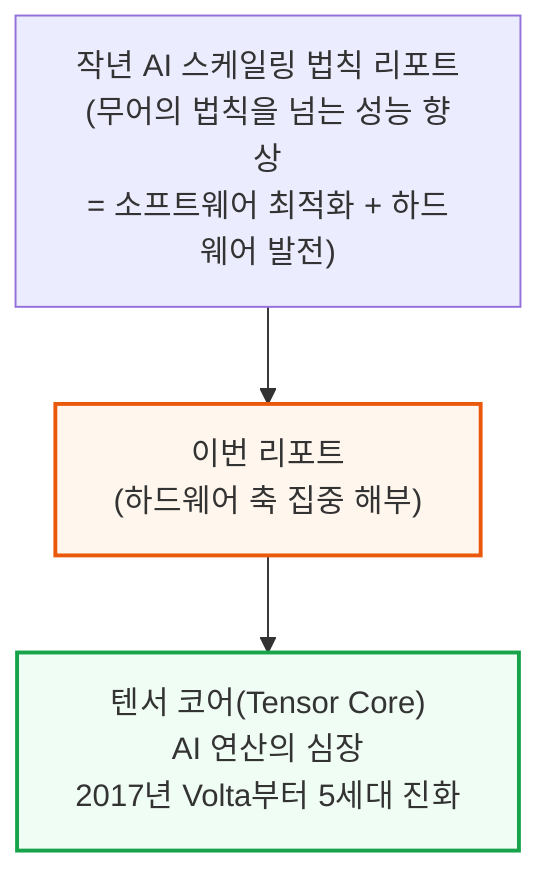
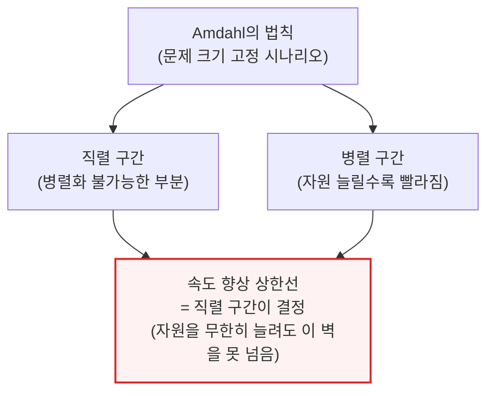
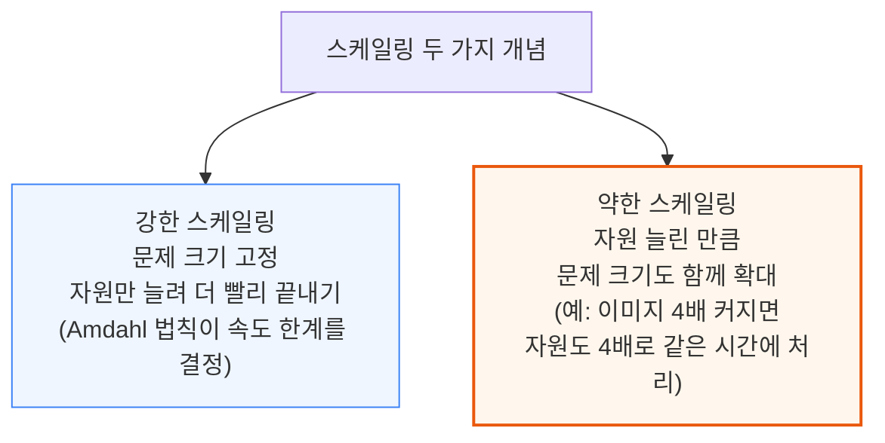
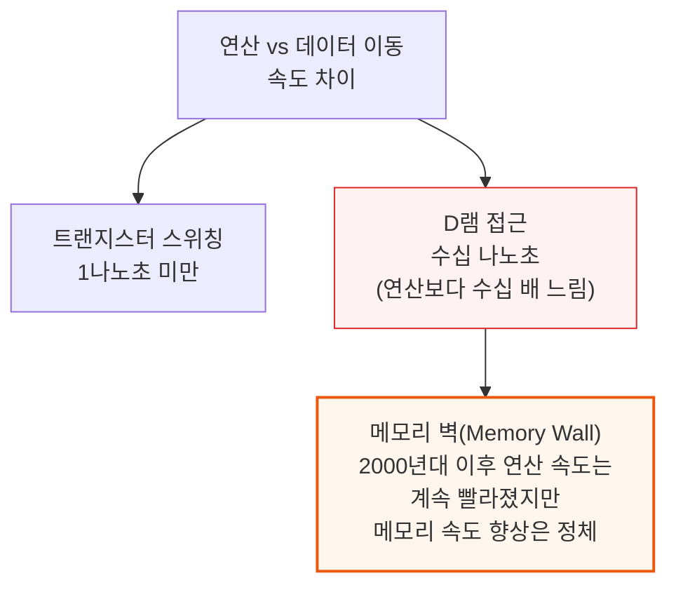
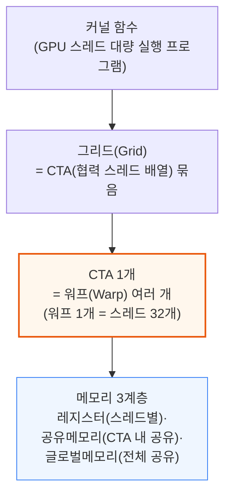
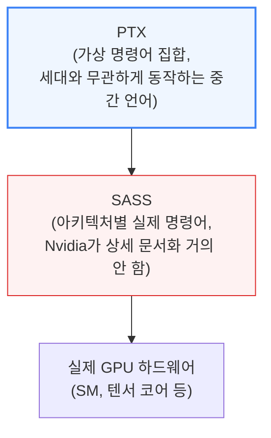

# NVIDIA Tensor Core Evolution: From Volta To Blackwell

> **출처**: [SemiAnalysis Newsletter](https://newsletter.semianalysis.com/p/nvidia-tensor-core-evolution-from-volta-to-blackwell)
> **저자**: Dylan Patel
> **발행일**: 2025-06-23

---

## 📑 목차

### 전체 섹션
 1. [서론: 텐서 코어를 알아야 하는 이유](#1-서론-텐서-코어를-알아야-하는-이유)
 2. [성능 공학의 기본 원칙: Amdahl의 법칙과 데이터 이동](#2-성능-공학의-기본-원칙-amdahl의-법칙과-데이터-이동)
 3. [텐서 코어 이전: CUDA 프로그래밍 모델의 기초](#3-텐서-코어-이전-cuda-프로그래밍-모델의-기초)
 4. [Volta: 텐서 코어의 탄생 (1세대)](#4-volta-텐서-코어의-탄생-1세대)
 5. [Turing: 2세대 텐서 코어와 정수 연산](#5-turing-2세대-텐서-코어와-정수-연산)
 6. [Ampere: 3세대 텐서 코어와 비동기 데이터 복사](#6-ampere-3세대-텐서-코어와-비동기-데이터-복사)
 7. [Hopper: 4세대 텐서 코어와 TMA](#7-hopper-4세대-텐서-코어와-tma)
 8. [Blackwell: 5세대 텐서 코어와 텐서 전용 메모리](#8-blackwell-5세대-텐서-코어와-텐서-전용-메모리)
 9. [곁다리 이야기: 구조적 희소성이 약속을 못 지킨 이유](#9-곁다리-이야기-구조적-희소성이-약속을-못-지킨-이유)
10. [텐서 코어 진화의 3대 트렌드: 코어 크기, 메모리, 데이터 타입](#10-텐서-코어-진화의-3대-트렌드-코어-크기-메모리-데이터-타입)
11. [MMA 명령어의 비동기화 여정](#11-mma-명령어의-비동기화-여정)
12. [프로그래밍 모델의 전환: 강한 스케일링을 위한 설계](#12-프로그래밍-모델의-전환-강한-스케일링을-위한-설계)

---

## 🔑 용어 정리

본문을 순서대로 읽기 전에 알아두면 좋은 용어들입니다. 자세한 수치와 설명은 본문에서 처음 등장하는 위치에 나옵니다.

- **텐서 코어 (Tensor Core)**: GPU 안에서 행렬 곱셈(딥러닝 연산의 핵심)만 전담하는 별도의 전용 회로. 범용 연산 코어보다 훨씬 적은 전력으로 훨씬 많은 곱셈을 처리
- **Amdahl의 법칙**: 문제 크기를 고정한 채 컴퓨팅 자원을 아무리 늘려도, 병렬화가 안 되는 부분(직렬 구간)이 전체 속도 향상의 상한선을 정한다는 원리
- **강한 스케일링 vs 약한 스케일링**: 강한 스케일링은 "같은 크기의 작업을 자원만 늘려 더 빨리 끝내기", 약한 스케일링은 "자원을 늘린 만큼 더 큰 작업을 처리하기"
- **SM(스트리밍 멀티프로세서)과 워프(Warp)**: SM은 GPU 내부의 연산 단위 블록, 워프는 SM이 한 번에 같은 명령어로 실행하는 스레드 32개 묶음
- **PTX와 SASS**: PTX는 GPU 세대가 바뀌어도 그대로 쓸 수 있는 중간 단계 가상 명령어, SASS는 그 밑에서 칩마다 다르게 번역되는 실제 기계어(Nvidia가 상세 공개를 안 함)
- **MMA 명령어 (Multiply-Accumulate)**: "D = A×B+C" 형태의 행렬 곱셈+누적을 한 번에 처리하는 텐서 코어의 핵심 명령어
- **TMA / TMEM (텐서 메모리 가속기 / 텐서 전용 메모리)**: TMA는 대용량 데이터를 메모리 간에 자동으로 옮겨주는 전용 하드웨어, TMEM은 텐서 코어 연산 결과를 담아두는 Blackwell의 신설 전용 메모리 공간
- **구조적 희소성 (Structured Sparsity)**: 행렬 값 중 일정 비율을 0으로 만들어(가지치기) 계산량을 줄이는 기법 — 이론상 연산 속도를 2배 높일 수 있음

---

## 1. 서론: 텐서 코어를 알아야 하는 이유

**📌 핵심:**
- SemiAnalysis는 작년 "AI 스케일링 법칙" 리포트에서, AI 산업이 무어의 법칙보다 빠른 성능 향상을 이어온 배경에는 학습·추론 소프트웨어 최적화뿐 아니라 하드웨어(연산 능력) 발전도 있다고 짚었음 — 이번 리포트는 그 하드웨어 축, 특히 AI 연산의 심장인 텐서 코어(Tensor Core)를 집중 해부
- 텐서 코어는 2017년 Volta GPU에 처음 탑재된 이후 8년간 5세대(Volta→Turing→Ampere→Hopper→Blackwell)를 거치며 AI 학습·추론 성능의 핵심 동력이 되어 왔지만, 진화 속도가 워낙 빨라 숙련된 실무자조차 최신 세대의 변화를 따라가기 어려운 상태
- 이 리포트는 각 세대를 단순 스펙 비교가 아니라 "왜 그렇게 설계를 바꿨는가"라는 동기까지 설명하는 것이 목표 — Colfax Research, Stanford Hazy Research, Princeton, Together AI, Modal 등 CUDA 커널 전문가와 Nvidia CUDA 발명자 Ian Buck, GPU 아키텍처 총괄 Jonah Alben의 자문을 받아 작성
- 결론: 텐서 코어 아키텍처의 진화 논리를 이해하면, Nvidia가 왜 매 세대 압도적 성능 향상을 만들어내는지, 그리고 이 설계 철학이 향후 GPU 로드맵에 어떻게 이어질지 가늠할 수 있음

---

이 리포트가 다루는 범위는 다음과 같습니다.
- 성능 공학의 기본 원칙(Amdahl의 법칙, 스케일링, 데이터 이동)
- Volta부터 Blackwell까지 5세대 텐서 코어 아키텍처의 핵심 변화와 그 동기
- CUDA 프로그래밍 모델이 텐서 코어 발전에 맞춰 어떻게 함께 진화했는지

CUDA·GPU 아키텍처에 대한 기초 지식이 없으면 일부 설명이 어려울 수 있으나, 이 리포트는 처음 접하는 개념도 가능한 한 비유와 그림으로 풀어 설명합니다.

---

## 2. 성능 공학의 기본 원칙: Amdahl의 법칙과 데이터 이동

**📌 핵심:**
- Amdahl의 법칙: 문제 크기가 고정된 상태에서는 컴퓨팅 자원(GPU 코어 수 등)을 아무리 늘려도 속도 향상에 한계가 있음 — 병렬화가 안 되는 직렬 구간의 실행 시간이 전체 속도 향상의 상한선을 결정
- 강한 스케일링(같은 작업을 자원만 늘려 더 빨리 끝내기)과 약한 스케일링(자원을 늘린 만큼 더 큰 작업을 처리하기)은 서로 다른 성능 개선 곡선을 그림 — 이 구분이 이후 텐서 코어·CUDA 프로그래밍 모델 설계 전체를 관통하는 핵심 축
- 데이터 이동은 GPU 설계자들이 "죄악"이라 부를 만큼 비쌈 — 트랜지스터 연산은 1나노초 미만인데 D램 접근은 수십 나노초 걸려, 계산 자체보다 데이터를 옮기는 데 시간·에너지가 훨씬 많이 소모됨(메모리 벽)
- 결론: 이 세 가지 원칙이 이후 모든 텐서 코어 세대의 설계 변화(코어 크기 확대, 메모리 계층 신설, 비동기 실행 확대)를 관통하는 이론적 뼈대

---

강한 스케일링과 약한 스케일링은 GPU 코어 수를 늘렸을 때 어떤 방식으로 성능이 개선되는지를 구분하는 개념입니다.

강한 스케일링은 문제 크기와 무관하게 항상 속도가 빨라지지만, 약한 스케일링은 "자원을 늘린 만큼 더 큰 문제를 푼다"는 조건에서만 성능 향상이 보장됩니다.

**📌 용어 풀이: 데이터 이동이 "죄악"인 이유**
> - 연산(계산)은 저렴하고 데이터 이동은 비싸다는 것이 GPU 설계의 대전제 — 최신 트랜지스터는 1나노초도 안 걸려 스위칭하지만, D램 셀 접근에는 수십 나노초가 걸림
> - 2000년대 이후 연산 속도 향상은 계속 둔화됐지만, 메모리 속도 향상은 그보다도 더 느려 격차(메모리 벽)가 점점 벌어지는 중
> - 이 때문에 GPU 설계자들은 "얼마나 빨리 계산하는가"보다 "얼마나 데이터 이동을 줄이는가"에 갈수록 더 공을 들이게 됨 — 뒤에 나올 텐서 코어의 메모리 계층 신설(공유메모리·TMEM 등)이 모두 이 원칙에서 출발

---

## 3. 텐서 코어 이전: CUDA 프로그래밍 모델의 기초

**📌 핵심:**
- PTX(병렬 스레드 실행)는 GPU 세대가 바뀌어도 같은 프로그램이 그대로 동작하도록 해주는 가상 명령어 집합 — 실제 하드웨어에 종속되지 않는 중간 언어 역할
- GPU 하드웨어는 SM(스트리밍 멀티프로세서) 여러 개로 구성되고, 스레드 32개를 워프(Warp)라는 단위로 묶어 한 번에 같은 명령어를 실행하는 "SIMT" 방식으로 동작
- PTX 밑에는 SASS라는 아키텍처별 실제 명령어 집합이 있는데, Nvidia가 경쟁사에 설계 노하우를 숨기려고 상세 문서화를 거의 하지 않아 외부에 잘 알려지지 않음
- 결론: 이후 모든 텐서 코어 세대 변화는 이 PTX↔SASS 2계층 구조, 그리고 SM·워프·CTA(협력 스레드 배열)라는 스레드 위계 안에서 일어남 — 이 기본 틀을 알아야 세대별 차이가 왜 생겼는지 이해 가능

---

SM은 여러 개의 스칼라 연산 코어(CUDA 코어), 스레드를 관리하는 명령어 유닛, 칩 내장 공유 메모리로 구성됩니다. 명령어 유닛이 워프 하나를 골라 그 워프에 속한 32개 스레드 전체에 같은 명령어를 동시에 내리는 방식이 SIMT(단일 명령어, 다중 스레드)입니다.

**📌 용어 풀이: SIMT와 SIMD의 차이**
> - SIMD(단일 명령어, 다중 데이터)는 한 명령어로 여러 데이터를 동시에 처리하되, 벡터 폭(한 번에 몇 개를 처리할지)을 프로그래머가 직접 지정
> - SIMT(단일 명령어, 다중 스레드)는 벡터 폭 대신 "스레드 하나가 어떻게 동작하는지"만 지정하고, 나머지 병렬 처리는 하드웨어(워프 스케줄러)가 알아서 관리
> - 이 차이 덕분에 CUDA 프로그래밍은 SIMD보다 직관적인 "스레드 단위 사고"로 병렬 프로그램을 짤 수 있음

---

*작성 진행률: 약 25% 완료*
*업데이트: 헤더·목차·용어 정리 및 1\~3장(서론, 성능 공학 기본 원칙, CUDA 프로그래밍 모델 기초) 작성 완료*
