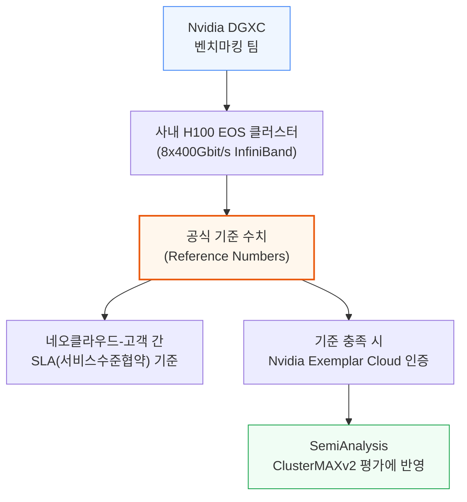
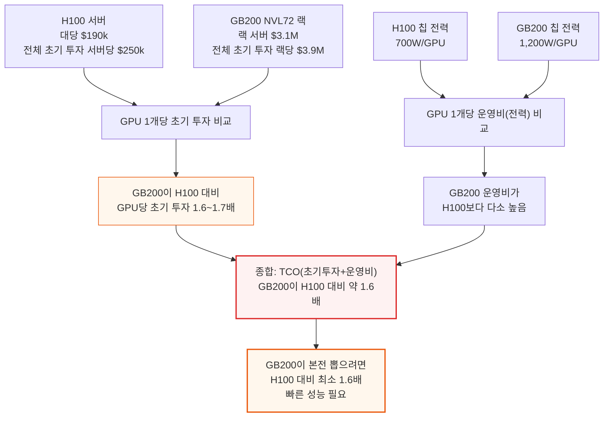
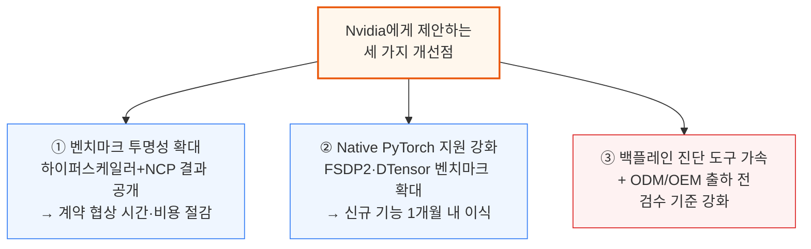
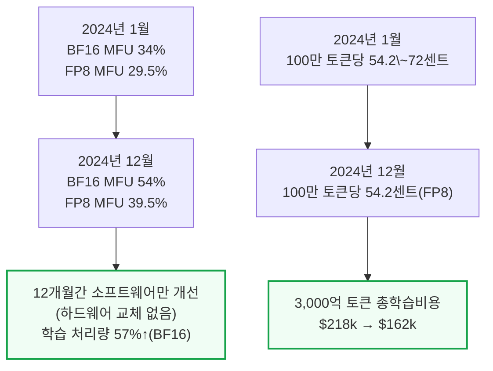
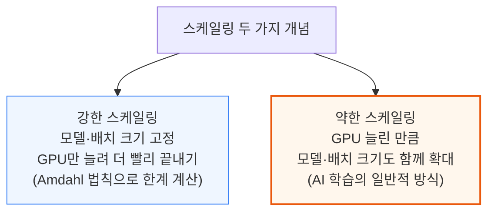

# H100 vs GB200 NVL72 Training Benchmarks: Power, TCO, and Reliability Analysis, Software Improvement Over Time

> **출처**: [SemiAnalysis Newsletter](https://newsletter.semianalysis.com/p/h100-vs-gb200-nvl72-training-benchmarks)
> **저자**: Dylan Patel
> **발행일**: 2025-08-20

---

## 📑 목차

### 전체 섹션
 1. [서론: Hopper vs Blackwell, 왜 비교가 간단하지 않은가](#1-서론-hopper-vs-blackwell-왜-비교가-간단하지-않은가)
 2. [벤치마크 방법론](#2-벤치마크-방법론)
 3. [H100 vs GB200 NVL72 총소유비용(TCO) 비교](#3-h100-vs-gb200-nvl72-총소유비용tco-비교)
 4. [Nvidia에게 제안하는 세 가지 개선점](#4-nvidia에게-제안하는-세-가지-개선점)
 5. [GPT-3 175B 학습 성능·전력 — 2024년 소프트웨어 개선 추이](#5-gpt-3-175b-학습-성능전력--2024년-소프트웨어-개선-추이)
 6. [약한 스케일링과 강한 스케일링](#6-약한-스케일링과-강한-스케일링)
 7. [Llama3 405B 학습 성능 (약한 스케일링)](#7-llama3-405b-학습-성능-약한-스케일링)
 8. [Llama3 70B 학습 성능 (약한 스케일링)](#8-llama3-70b-학습-성능-약한-스케일링)
 9. [Llama3 8B 학습 성능 — 시간에 따른 변화](#9-llama3-8b-학습-성능--시간에-따른-변화)
10. [GB200 NVL72 vs H100 종합 성능 전망](#10-gb200-nvl72-vs-h100-종합-성능-전망)
11. [DeepSeek 670B MoE 벤치마크 — GB200 vs H100](#11-deepseek-670b-moe-벤치마크--gb200-vs-h100)
12. [Llama4 Maverick 400B MoE 벤치마크 — GB200 vs H100](#12-llama4-maverick-400b-moe-벤치마크--gb200-vs-h100)
13. [GB200 NVL72 신뢰성 문제 — 백플레인과 진단 도구](#13-gb200-nvl72-신뢰성-문제--백플레인과-진단-도구)
14. [신뢰성을 반영한 실제 성능·비용 우위 재계산](#14-신뢰성을-반영한-실제-성능비용-우위-재계산)

---

## 🔑 용어 정리

본문을 순서대로 읽기 전에 알아두면 좋은 용어들입니다. 자세한 수치와 설명은 본문에서 처음 등장하는 위치에 나옵니다.

- **MFU (모델 연산 활용률)**: GPU가 이론적으로 낼 수 있는 최대 연산 성능 중 실제 학습에 쓰인 비율. 높을수록 GPU를 낭비 없이 쓰고 있다는 뜻
- **TCO (총소유비용)**: 장비 구매비(초기 투자)와 전기요금 등 운영비를 합쳐, GPU 한 대를 실제로 쓰는 데 드는 전체 비용
- **강한 스케일링 vs 약한 스케일링**: 강한 스케일링은 "같은 작업을 GPU만 늘려 더 빨리 끝내기", 약한 스케일링은 "GPU를 늘린 만큼 더 큰 작업(더 큰 모델)을 처리하기"
- **MoE (전문가 혼합 모델)**: 모델 전체 파라미터 중 일부(전문가)만 골라 쓰는 구조로, 전체 크기는 크지만 매 순간 실제로 계산하는 양은 적어 추론 비용을 낮춤
- **백플레인**: GB200 NVL72 랙에서 서버(연산 트레이)와 스위치를 연결하는 구리 케이블 뭉치 — 신호가 이 구간을 통과하지 못하면 GPU 간 통신 자체가 끊김
- **MTBI (평균 장애 간격)**: GPU 하루 가동시간을 다 더한 값(GPU-day) 기준으로, 평균 몇 GPU-day마다 한 번씩 장애가 나는지를 나타내는 신뢰성 지표. 클수록 안정적
- **NVLink 스케일업 월드사이즈**: 케이블로 직접 묶여 서로 초고속 통신하는 GPU 묶음의 크기(H100은 8개, GB200 NVL72는 72개)
- **줄(Joule)과 전력량**: 줄은 에너지의 기본 단위, 킬로와트시(kWh)는 "1kW짜리 장비를 1시간 켰을 때 쓰는 에너지"로 둘 다 같은 에너지를 표현하는 다른 단위

---

## 1. 서론: Hopper vs Blackwell, 왜 비교가 간단하지 않은가

**📌 핵심:**
- 최전선 AI 모델 학습은 GPU와 시스템을 한계까지 밀어붙이고 있어, 비용·효율·전력·성능 대비 TCO(총소유비용)·신뢰성이 학습 경쟁력을 가르는 핵심 변수가 됨
- Nvidia가 제시하는 Hopper(H100) vs Blackwell(GB200 NVL72) 비교는 스펙만 보면 단순해 보이지만, 실제로는 소프트웨어 성숙도와 신뢰성 문제까지 함께 봐야 정확한 그림이 나옴
- 2025년 8월 현재 GB200 NVL72로 완결된 대규모(메가스케일) 학습 사례는 아직 없음 — H100·H200과 Google TPU가 여전히 최전선 학습을 실제로 완주하는 유일한 칩
- 결론: 이 리포트는 2,000개 이상 H100 GPU 실측 벤치마크와 GB200 NVL72 초기 벤치마크를 함께 분석해, 소프트웨어 개선 추이와 신뢰성 이슈까지 반영한 실제 비교를 제공함

---

이 리포트는 H100 GPU 2,000개 이상 규모의 실측 벤치마크로 시작해 MFU(모델 연산 활용률), TCO(총소유비용), 100만 토큰당 학습 비용을 분석합니다.

- 학습한 토큰 1개당 실제 소비 전력(줄 단위)을 미국 가정의 연간 전력 소비량과 비교
- GPU 클러스터를 128개→2,048개로 늘렸을 때(스케일링), Nvidia 소프트웨어 버전이 바뀌었을 때 각각 성능 변화 분석

후반부 분석 대상은 다음과 같습니다.
- Llama4 400B MoE, DeepSeek 670B MoE를 GB200 NVL72에서 학습한 벤치마크 결과를 H100과 비교
- GB200 NVL72의 성능 대비 비용(TCO) 우위가 신뢰성 문제까지 반영해도 유지되는지 검증

- 신뢰성 저하로 인한 다운타임과 엔지니어링 시간 손실은 성능 대비 TCO 계산에 반영되는 핵심 요소 중 하나
- 소프트웨어가 계속 성숙 중이고 신뢰성 문제가 해결되는 과정이라, GB200 NVL72로 완결된 대규모 학습 사례는 아직 없음
- 새 아키텍처는 원래 생태계가 소프트웨어를 따라잡는 데 시간이 필요 — GB200 NVL72의 소프트웨어 성숙 속도는 이전 세대보다 다소 느리지만 크게 뒤처지지는 않음. 연말까지 소프트웨어가 상당히 개선되고, 최전선 모델 아키텍처 자체가 GB200의 넓어진 스케일업 규모에 맞춰 설계되면서 효율이 크게 개선될 것으로 전망
- 신뢰성 측면에서는 Nvidia가 파트너사와 더 긴밀히 협력해 문제를 빠르게 풀어야 하지만, 생태계 전체가 빠르게 자원을 결집할 것으로 예상

---

## 2. 벤치마크 방법론

**📌 핵심:**
- 이 리포트의 벤치마크는 Nvidia DGXC 팀이 만든 표준 스크립트를 Nvidia 사내 H100 EOS 클러스터(8×400Gbit/s InfiniBand)에서 돌린 결과 — 네오클라우드와 고객 간 SLA(서비스수준협약)를 정할 때 쓰는 공식 기준점 역할
- 이 기준을 충족하는 클라우드는 "Nvidia Exemplar Cloud" 인증을 받고, SemiAnalysis의 ClusterMAXv2 평가에서도 이 인증 여부를 크게 반영
- 현재 벤치마크는 NeMo Megatron-LM 기반이지만, 실제로는 Native PyTorch(DTensor·TorchTitan) 사용자도 많아 앞으로 이 프레임워크로도 확대될 계획
- 결론: 이 리포트 수치는 임의 추정이 아니라 업계 SLA 기준으로 쓰이는 공식 벤치마크에 근거함

---

- 현재 벤치마크는 NeMo Megatron-LM 기반이지만, Native Torch DTensor 프레임워크(예: TorchTitan) 사용자도 많아 향후 그쪽으로도 범위 확대 예정
- Nvidia DGCX 벤치마킹 팀이 이런 벤치마크 세트를 만들고 기준 수치를 공개해 GPU 클라우드 업계 전체의 신뢰도를 끌어올린 점은 평가할 만함

---

## 3. H100 vs GB200 NVL72 총소유비용(TCO) 비교

**📌 핵심:**
- H100 서버 가격은 지난 18개월간 다소 하락해 대당 약 $190k, 스토리지·네트워킹 등을 포함한 하이퍼스케일러 기준 전체 초기 투자는 서버당 약 $250k
- GB200 NVL72는 랙 서버 자체만 $3.1M, 네트워킹·스토리지 포함 전체 초기 투자는 랙당 약 $3.9M → GPU 1개당 초기 투자로 환산하면 H100 대비 1.6\~1.7배
- 운영비(전력요금 등)는 GB200 GPU 1개가 1,200W를 쓰는 반면 H100은 700W만 써서, GPU당 운영비도 GB200이 더 높음
- 결론: 초기 투자와 운영비를 합친 TCO는 GB200 NVL72가 H100 대비 약 1.6배 높음 → GB200이 "본전을 뽑으려면" H100 대비 최소 1.6배 빠른 성능이 필요

---

- 하이퍼스케일러·네오클라우드 자이언트·신생 네오클라우드 세 구매자 유형 모두, GPU당 전체 초기 투자는 GB200이 H100 대비 1.6\~1.7배로 일관되게 나타남
- 운영비 격차가 초기 투자 격차만큼 크지 않은 이유: GB200 GPU당 전력 소비(1,200W)가 H100(700W)보다 높긴 하지만 그 차이가 초기 투자 차이보다는 작기 때문

---

## 4. Nvidia에게 제안하는 세 가지 개선점

**📌 핵심:**
- 첫째, 벤치마크 범위를 하이퍼스케일러뿐 아니라 Nvidia Cloud Partner(NCP)까지 확대하고 결과를 공개해, 수백억원대 계약을 맺기 전 업계 전체가 참고할 수 있게 해야 함
- 둘째, NeMo Megatron-LM 외에 Native PyTorch(FSDP2·DTensor) 벤치마크도 늘리고, 신규 기능은 한 달 이내에 PyTorch 본체로 이식해야 함
- 셋째, GB200 NVL72 백플레인 진단·디버깅 도구 개발을 가속하고, ODM·OEM 파트너사에 더 엄격한 출하 전 검수 기준을 강제해야 함
- 결론: 세 제안 모두 "성능은 이미 검증됐지만, 이를 실제 계약·운영에 활용하기 위한 투명성과 도구가 부족하다"는 공통 문제의식에서 나옴

---

**📌 용어 풀이: 왜 벤치마크 공개가 협상력을 높이나**
> - 실제 사례: SemiAnalysis의 초기 ClusterMAX 평가에서 GCP의 구형 a3-mega H100이 Llama 70B급 학습에서 평균보다 MFU 10% 낮고, 8x7B급 MoE 모델에서는 15\~20% 낮은 것으로 확인됨
> - 즉 사용자는 시장 평균과 같은 성능/비용을 얻으려면 GCP에 10\~20% 낮은 임대료를 요구해야 정당함
> - 이런 벤치마크가 공개되어 있으면 값비싸고 시간이 오래 걸리는 사전 검증(PoC) 없이도 공정한 계약가를 빠르게 협상할 수 있음

두 번째 제안과 관련해, Nvidia의 신규 NeMo AutoModel 라이브러리는 Native PyTorch FSDP2 백엔드를 지원해 올바른 방향으로 가고 있지만, 아직 Native PyTorch 3D+ 병렬화(DTensor)와 프리트레이닝 기능 다수가 빠져 있고 대부분 파인튜닝용 기능에 머물러 있습니다.

세 번째 제안과 관련해, GB200 NVL72의 NVLink 구리 백플레인은 충분한 번인(burn-in) 과정을 거쳐도 여전히 신뢰성이 낮고, 문제를 진단·디버깅하는 도구조차 부족해 문제가 이중으로 겹칩니다(자세한 내용은 13장 참고).

---

## 5. GPT-3 175B 학습 성능·전력 — 2024년 소프트웨어 개선 추이

**📌 핵심:**
- H100 128개로 GPT-3 175B를 학습할 때, 소프트웨어만 개선해도(하드웨어 교체 없이) 2024년 1월\~12월 사이 BF16 MFU가 34%→54%로 올라 학습 처리량이 57% 향상됨
- 같은 기간 100만 토큰당 학습 비용은 FP8 기준 72센트→54.2센트로 하락, 3,000억 토큰 학습(GPT-3 원 논문 기준) 총비용은 $218k→$162k로 감소
- 토큰 1개를 학습하는 데 드는 실제 전력(줄 단위)은 FP8 2.46줄, BF16 3.63줄(2024년 12월 기준) — 미국 가정 연간 전력 소비량(1만 791kWh)과 같은 에너지로 FP8 기준 158억 개 토큰을 학습할 수 있는 양
- 결론: GPT-3 175B를 3,000억 토큰까지 완주하려면 미국 가정 19채(FP8) 또는 28채(BF16)의 연간 전력 소비량과 맞먹는 에너지가 필요 — 순수 학습 비용($162k)만 보면 크지 않아 보이지만, 실패한 실험까지 다 더하면 미국 AI 학습 전력 수요 급증의 실체가 보임

---

이 개선은 Nvidia CuDNN·CuBLAS 엔지니어들이 더 최적화된 fused wgmma 커널을 짜고, NCCL 엔지니어들이 통신에 쓰는 SM(스트리밍 멀티프로세서) 수를 줄인 더 효율적인 집합통신(collective)을 만든 결과입니다. 결국 전체 소프트웨어 스택 최적화가 실제 성능을 좌우한다는 뜻입니다.

**📌 용어 풀이: 줄(Joule)과 미국 가정 전력 소비**
> - 줄은 에너지의 기본 단위 — 백열전구 60W를 1초 켜면 60줄, 1시간 켜면 216킬로줄(kJ) 소비
> - 킬로와트시(kWh)는 같은 에너지를 "1kW 장비를 1시간 켰을 때" 기준으로 표현한 단위
> - 미국 가정 평균 연간 전력 소비량(2022년 기준): 10,791kWh = 약 388억 줄, 연중 평균으로 환산하면 약 1,232W — 공교롭게도 GB200 GPU 1개(1,200W)와 비슷한 수준
> - 이 지표 덕분에 "GPU 몇 개가 몇 kW를 쓴다"는 추상적 숫자를, "가정 몇 채 분량의 전력"이라는 체감 가능한 비유로 바꿔볼 수 있음

GPT-3 175B의 학습 비용 $162k와 가정 19채 분량 전력 소비 자체는 그리 커 보이지 않지만, 실전에서는 여러 차례의 실험과 실패한 학습 시도가 누적되어 지금 미국에서 목격되는 AI 학습발 전력 수요 급증으로 이어집니다.

---

## 6. 약한 스케일링과 강한 스케일링

**📌 핵심:**
- 강한 스케일링은 모델 크기·배치 크기를 그대로 두고 GPU만 늘려 "같은 작업을 더 빨리 끝내는" 방식 — Amdahl의 법칙으로 속도 향상 한계를 계산
- 약한 스케일링은 GPU를 늘린 만큼 모델 크기·배치 크기도 함께 키워 "더 큰 작업을 같은 시간에 처리하는" 방식
- AI 학습은 태생적으로 약한 스케일링 — GPU를 늘리면 (수렴 여건이 맞는 한) 모델 크기와 배치 크기를 함께 키우는 것이 일반적
- 결론: 이어지는 Llama3 벤치마크(7\~9장)는 모두 약한 스케일링 관점에서 GPU 수를 늘렸을 때 성능이 어떻게 변하는지를 다룸

---

---

*작성 진행률: 약 45% 완료 (1\~6장 작성)*
