# 1,000 CFETs, SK Hynix Next-Gen NAND, Interconnects Beyond Copper, 2D Materials, and More

> **출처**: [https://newsletter.semianalysis.com/p/interconnects-beyond-copper-1000](https://newsletter.semianalysis.com/p/interconnects-beyond-copper-1000)
> **저자**: [[Dylan Patel]]
> **발행일**: 2026-01-14

📑 목차
1. [서론: 무어의 법칙은 벽에 부딪혔는가](#1-서론-무어의-법칙은-벽에-부딪혔는가)
2. [3D 낸드 스케일링의 귀환](#2-3d-낸드-스케일링의-귀환)
3. [차세대 배선: 구리를 넘어 루테늄으로](#3-차세대-배선-구리를-넘어-루테늄으로)
4. [2D 소재(TMD)의 도전과 한계](#4-2d-소재tmd의-도전과-한계)
5. [CFET: TSMC의 링 오실레이터와 SRAM 돌파](#5-cfet-tsmc의-링-오실레이터와-sram-돌파)
6. [CFET: IMEC 모놀리식 집적 기술](#6-cfet-imec-모놀리식-집적-기술)
7. [CFET: A7에서 A3까지, 얼마나 더 스케일링할 수 있나](#7-cfet-a7에서-a3까지-얼마나-더-스케일링할-수-있나)

🔑 용어 정리
- **CFET (Complementary FET, 상보형 전계효과 트랜지스터)**: N형과 P형 트랜지스터를 옆으로 나란히 두지 않고 위아래로 쌓아, 같은 면적에 훨씬 많은 트랜지스터를 넣는 차세대 구조
- **GAA (Gate-All-Around)**: 게이트(전류를 여닫는 스위치 부분)가 채널을 사방에서 완전히 감싸는 현재 최첨단 트랜지스터 구조로, CFET 바로 직전 세대
- **3D 낸드 (3D NAND)**: 저장 셀을 평면에 늘어놓는 대신 수직으로 쌓아 올려, 한 장의 웨이퍼에 더 많은 데이터를 담는 플래시 메모리 구조
- **워드라인 (Word Line)**: 3D 낸드에서 각 층의 저장 셀에 전압을 걸어 켜고 끄는 배선으로, 층수가 늘수록 연결 난도가 커짐
- **루테늄 (Ru)**: 회로 폭이 나노미터 단위로 좁아지면서 저항이 급증하는 구리를 대체할 차세대 배선 금속
- **2D 소재 / TMD (전이금속 디칼코게나이드)**: 원자 한두 층 두께로 만들 수 있는 반도체 재료로, 실리콘이 너무 얇아지면 생기는 누설전류 문제를 줄일 후보
- **링 오실레이터 (Ring Oscillator)**: 인버터(신호를 반전시키는 회로)를 여러 개 고리 모양으로 연결해 공정의 속도와 안정성을 측정하는 표준 테스트 회로
- **SRAM**: 데이터를 저장하는 최소 단위 회로로, 모든 칩에 들어가며 트랜지스터 집적도를 가늠하는 척도로도 쓰임

---

## 1. 서론: 무어의 법칙은 벽에 부딪혔는가

**📌 핵심:**
- 반도체 업계는 첨단 로직·D램·낸드 수요가 폭발하는 초호황과, 미세공정 성능 개선 속도가 눈에 띄게 둔화되는 상황을 동시에 겪는 중
- 연구개발 투자는 계속 늘지만 성능 개선 폭은 점점 작아지는 현상이 뚜렷해 "무어의 법칙이 무어의 벽이 됐다"는 자조 섞인 평가가 나옴
- 그럼에도 낸드 적층, 구리를 대체할 배선 금속, 2D 소재, 차세대 트랜지스터 CFET 등 향후 10년을 이끌 후보 기술들이 IEDM 2025(국제전자소자학회)에서 대거 공개
- 결론: 미세화 둔화 속에서도 적층·신소재·신구조라는 세 방향의 돌파구가 동시에 진행 중

---

반도체 업계는 역대 최대 슈퍼사이클에 올라탄 동시에, 공정 스케일링 속도는 눈에 띄게 느려지는 모순적인 시기를 지나고 있습니다. 반도체 업계는 나쁜 소식만 있는 것은 아니며, 과거에도 회의론자들을 여러 번 틀리게 만든 전례가 있습니다. IEDM 2025(국제전자소자학회, 반도체 업계 최대 연구 발표 학회)에서 공개된 내용을 아래 세 갈래로 정리합니다.

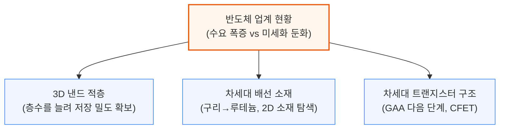

메모리 쪽에서는 SK하이닉스의 최신 V9 낸드와 삼성전자의 몰리브덴 워드라인 개선을, 로직 쪽에서는 구리를 넘어서는 배선 금속과 실리콘을 대체할 2D 소재, 그리고 GAA 다음 단계인 CFET 진행 상황을 순서대로 다룹니다.

---

## 2. 3D 낸드 스케일링의 귀환

**📌 핵심:**
- 메모리 가격 급등으로 신규 공장 증설보다 기존 라인의 적층 수를 늘리는 업그레이드가 더 시급한 선택지로 부상
- SK하이닉스는 238단(V8)에서 321단(V9)으로 늘려 웨이퍼당 저장 용량을 **44% 확대**했지만, 층 묶음(덱)이 3개로 늘어나며 공정이 복잡해져 경쟁사 대비 밀도는 오히려 열위
- 삼성전자는 워드라인 금속을 텅스텐(W)에서 몰리브덴(Mo)으로 바꿔 접촉 저항을 **40% 감소**, 읽기 속도를 **30% 이상 개선**
- 결론: 층수 증가(수직 스케일링)가 가장 저렴한 확장 경로지만, 한계에 부딪힌 기업들은 재료 교체·셀 구조 혁신까지 동시에 추진 중

---

낸드 스케일링은 지금 이 순간 가장 절박한 과제입니다. 수요는 급증하는데 새 공장을 지을 클린룸 공간이 없어, 메모리 업체들은 기존 라인을 업그레이드하는 것 말고는 공급을 늘릴 방법이 없기 때문입니다. 최선단 공장 기준으로는 3xx단 3D 낸드 공정이 웨이퍼 1mm²당 20\~30Gb(기가비트) 밀도를 내며, 12인치 웨이퍼 한 장에 30TB(테라바이트) 이상을 담습니다.

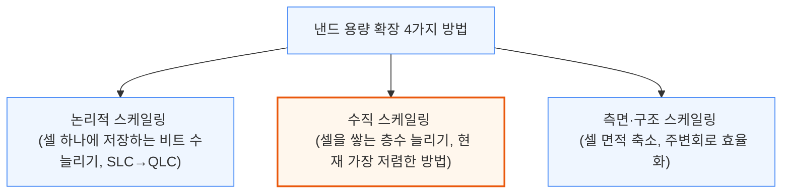

3D 낸드는 저장 셀을 나무처럼 촘촘히 세운 수직 원통(채널)으로 만들고, 전도성 층과 절연층을 번갈아 쌓아 각 교차점마다 메모리 셀 하나를 형성하는 구조입니다. 셀은 채널을 감싸는 전하 트랩 층에 전하를 가둬 켜짐/꺼짐 상태(문턱 전압)를 바꾸는 방식으로 읽고 씁니다. 4가지 확장 방법 중 층수를 늘리는 수직 스케일링이 가장 저렴해, 현재 업계가 가장 집중하는 방법입니다.

### SK하이닉스 321단 V9: 층수는 늘었지만 밀도는 밀림

238단 V8에서 321단 V9으로 넘어가며 SK하이닉스가 추가한 것은 층 묶음(덱) 하나와 그 연결 통로(플러그)입니다. 한 덱 안에서 층수를 더 늘릴 수 없는 한계(SK하이닉스 기준 약 120층)에 부딪히면, 덱 개수 자체를 늘리는 수밖에 없습니다.

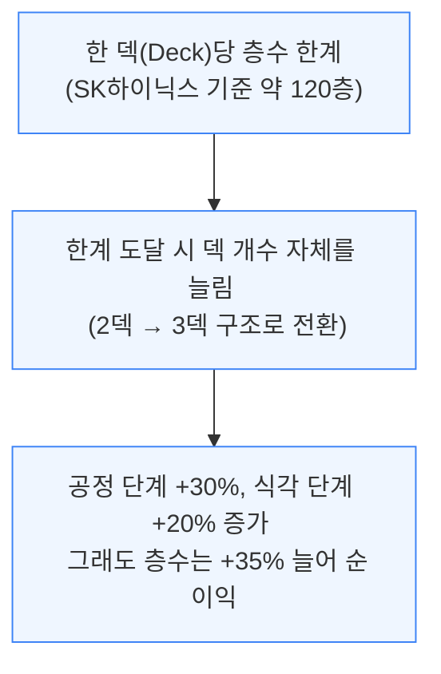

문제는 이렇게 층수를 늘려도 상업적 밀도 경쟁에서는 밀린다는 점입니다.

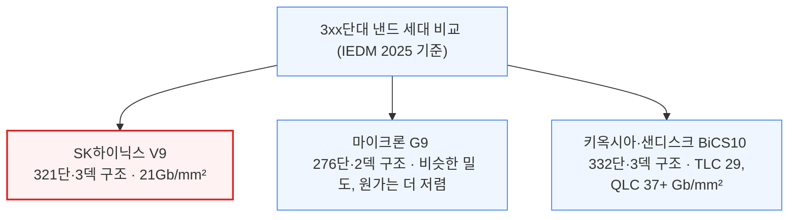

마이크론은 SK하이닉스와 비슷한 밀도를 2덱만으로 달성해 원가에서 우위에 있고, 키옥시아·샌디스크의 차기 332단 제품은 3덱임에도 밀도 자체가 더 높습니다. 삼성전자는 아예 3xx단 세대를 건너뛰어 286단 2덱(V9)에서 곧바로 43x단 3덱(V10)으로 넘어가는 전략을 택했습니다.

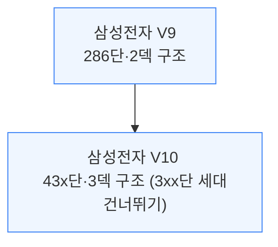

### 삼성 몰리브덴 워드라인: 재료 교체로 성능 확보

삼성전자는 기존 286단 V9 공정 자체는 유지한 채, 워드라인(각 층의 셀을 여닫는 배선) 금속을 5세대(V5)부터 써온 텅스텐(W)에서 몰리브덴(Mo)으로 교체하는 개선안을 공개했습니다.

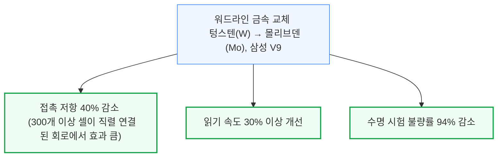

다만 몰리브덴은 화학적·기계적으로 텅스텐보다 다루기 까다로운 재료입니다. 증착 공정(ALD)이 아직 덜 성숙했고 산화가 잘 되며, 응력 편차가 커서 웨이퍼가 휘거나 갈라질 위험도 있습니다. 삼성전자는 몰리브덴을 직접 증착하는 대신 질화몰리브덴(MoN) 씨앗층을 먼저 키운 뒤 순수 몰리브덴으로 변환하는 방식으로, 별도의 보호막(라이너) 없이도 고품질 층을 얻는 공정을 택했습니다.

### SK하이닉스 멀티사이트 셀: 채널 하나를 둘로 쪼개 5비트 저장

셀 하나에 몇 비트를 저장하느냐(SLC 1비트, MLC 2비트, TLC 3비트, QLC 4비트)는 칩 면적을 늘리지 않고 용량을 키우는 방법입니다. 5비트 저장(32단계 구분)은 지금까지 상용화된 적이 없을 만큼 어려운데, SK하이닉스가 이를 우회하는 구조를 제시했습니다.

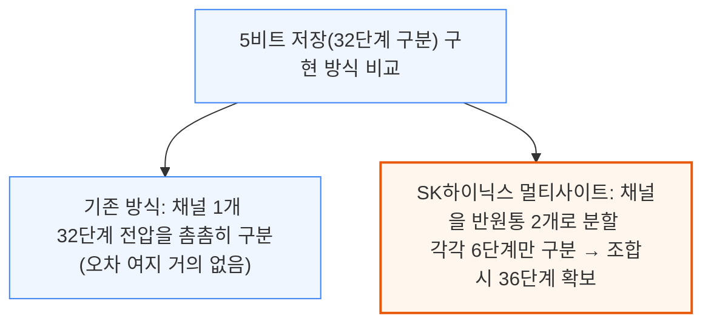

채널을 둘로 나누면 각 사이트가 좁아져 성능은 다소 떨어지지만, 한 사이트당 6단계만 정확히 구분하면 되므로 전체적으로는 32단계를 한 채널에서 구분하는 것보다 훨씬 여유가 생깁니다. 다만 구멍 하나를 정밀하게 둘로 나누고 비대칭 형태로 여러 박막을 증착해야 해서, 연구 단계에서는 성공했지만 아직 양산 원가에는 맞지 않는 수준입니다.

---

## 3. 차세대 배선: 구리를 넘어 루테늄으로

**📌 핵심:**
- 회로 폭이 10nm 이하로 좁아지면서, 배선 재료인 구리(Cu)는 전체 부피에서 장벽막·라이너가 차지하는 비중이 커져 저항이 급증하는 "사이즈 효과"에 부딪힘
- 삼성전자는 루테늄(Ru) 원자층을 특정 방향(001)으로 99% 정렬시켜, 300nm² 단면의 극미세 배선에서 저항을 **46% 낮추는** 결과 확보
- IMEC(벨기에 반도체 연구소)은 A14\~A10 노드부터 M0(최하단 배선층)를 구리에서 루테늄으로 교체하는 로드맵 제시, 16nm 피치까지 양쪽 배선층에 비아를 자동 정렬시키는 공정으로 수율 **80% 이상** 달성
- 결론: 루테늄은 2030년대 초반 노드부터 구리를 밀어내고 최하단 배선층의 표준 금속이 될 전망

---

10nm 이하 노드에서는 배선 자체보다 배선을 감싸는 장벽막·라이너가 차지하는 비중이 커지면서, 구리의 저항이 예상보다 훨씬 빠르게 치솟는 "사이즈 효과"가 발생합니다. 이를 해결할 대안으로 업계는 루테늄(Ru)에 주목하고 있습니다.

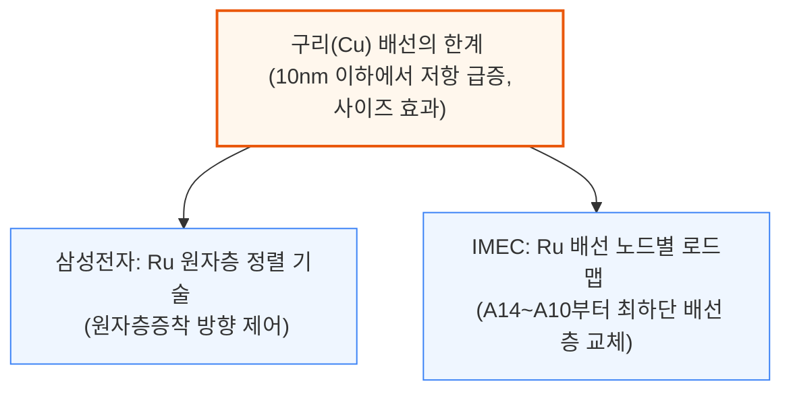

### 삼성전자: 루테늄 결정 방향을 정렬해 저항을 낮추다

일반적인 스퍼터링(PVD)이나 기존 원자층증착(ALD) 공정은 루테늄 결정 알갱이(그레인)가 제각각의 방향으로 자라, 전자가 알갱이 경계에서 튕겨 나가며 저항이 커집니다. 삼성전자는 이 방향을 99% (001) 방향으로 맞추는 "그레인 방향 엔지니어링" 기법을 발표했습니다.

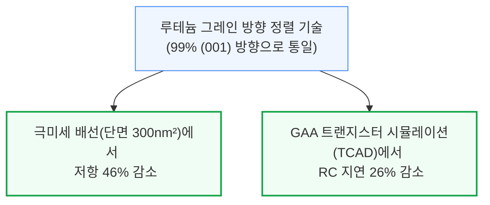

미세 구조와 극미세 비아를 채우기 위해 불필요한 씨앗 입자를 오존 식각으로 제거하는 "억제제 없는" 선택적 증착 공정도 함께 적용했습니다. 열처리 후에는 증착된 루테늄이 거의 단결정에 가까운 구조로 재결정화되어, 전류가 저항이 낮은 결정축(c축) 방향과 평행하게 흐르도록 만들어 전도 성능을 극대화합니다.

### IMEC: 16nm 피치 루테늄 2층 배선

IMEC의 로드맵에는 두 번의 전환점이 있습니다. A14\~A10 노드에서는 적어도 M0(최하단 배선층)부터 구리를 루테늄으로 교체하고, A7 노드에서는 18nm 또는 16nm 배선 피치를 도입합니다. 16nm 피치는 한 번의 노광으로 패턴을 새기는 하이-NA(고개구수) EUV 노광 장비가 현실적으로 도달할 수 있는 한계로 꼽힙니다.

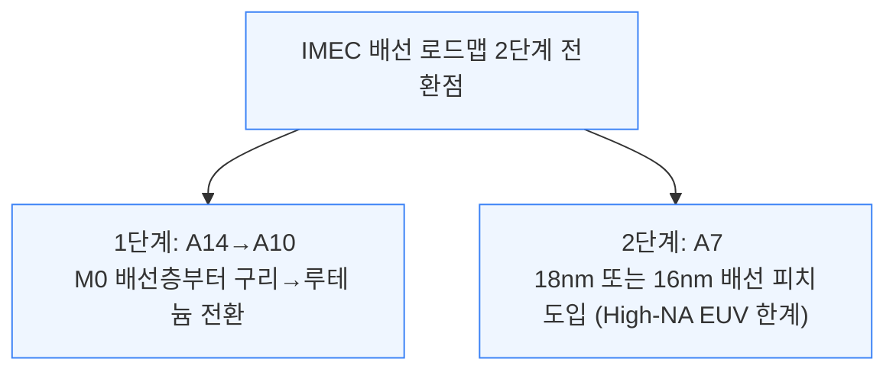

16nm 피치에서는 비아(층간 연결 구멍)의 폭과 간격이 각각 약 8nm에 불과해, 아주 작은 정렬 오차도 치명적입니다. 이 때문에 IMEC은 비아가 저절로 정확한 위치에 맞춰지는 "완전 자기정렬 비아" 공정을 개발했습니다.

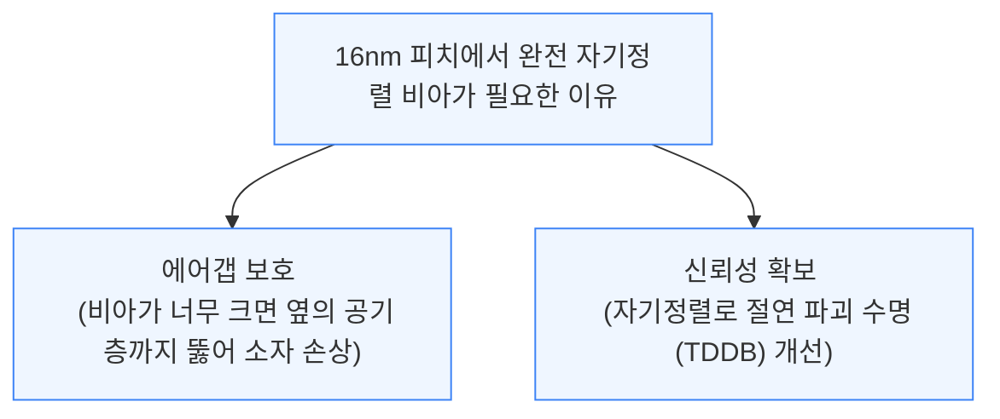

공정 순서는 저-NA EUV 노광으로 패턴을 새긴 뒤, 건식·습식 식각으로 실리콘층에 전사하고, 스페이서 증착·식각으로 2중 패터닝을 완성한 다음 화학적기계연마(CMP)로 평탄화하는 방식입니다. 2층 배선 공정에서는 M1층을 루테늄 식각 후 산화막으로 채워 평탄화하고, 5nm 두께의 티타늄나이트라이드(TiN) 하드마스크로 비아를 뚫은 뒤, 약한 산화와 습식 세정으로 자기정렬 비아를 만들고 약 15nm 두께의 루테늄을 증착해 M2층을 형성합니다. 이 공정으로 IMEC은 16nm 피치 2층 루테늄 배선에서 **수율 80% 이상**을 달성했습니다.

---

## 4. 2D 소재(TMD)의 도전과 한계

**📌 핵심:**
- 트랜지스터 게이트 길이가 10nm 이하로 좁아지면 실리콘은 소스-드레인 사이로 전자가 그냥 새어나가는 터널링 누설전류 문제에 부딪히는데, 2D 소재(TMD)는 큰 밴드갭과 무거운 유효질량으로 이 누설을 억제할 후보
- 다만 300mm 웨이퍼 양산이 가능한 합성 공정이 없고(800°C 이상 고온이 필요), 접촉 저항이 실사용 조건(저전압)에서는 여전히 목표치(100Ω·µm 미만)에 못 미치는 게 현실
- P형(양공을 옮기는) 트랜지스터 성능이 N형보다 크게 뒤처지는 비대칭 문제가 핵심 병목으로 남아있어, TSMC는 계면층(IL) 삽입으로 접촉 특성을 2\~3배 개선했지만 여전히 실리콘 성능(약 60mV/dec)에는 못 미침
- 결론: 2D 소재는 실리콘의 물리적 한계를 우회할 유력한 후보지만, 양산성·접촉저항·P형 성능·소자 편차라는 4중 장벽을 동시에 넘어야 제품화 가능

---

게이트 길이가 10nm 이하로 좁아지면 실리콘 트랜지스터는 소스와 드레인 사이로 전자가 그냥 터널링해 새어나가는 누설전류 문제에 부딪힙니다. 2D 소재인 전이금속 디칼코게나이드(TMD)는 밴드갭이 크고 전자의 유효질량이 무거워 이 터널링을 억제할 수 있는 몇 안 되는 후보 물질입니다.

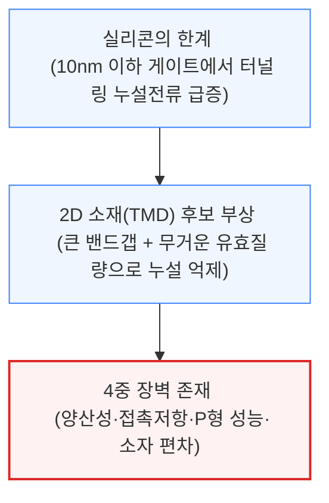

### 첫 번째 장벽: 양산 가능한 합성 공정이 없다

이론적으로 매력적인 물성도 300mm 웨이퍼에서 반복 재현되지 않으면 의미가 없습니다. 고품질 2D 박막을 얻는 합성 조건은 대부분 800°C를 넘는 고온을 요구해, 기존 반도체 라인에 통합하기 어렵습니다. 그래서 업계는 낮은 온도에서 미리 성장시킨 막을 옮겨 붙이는 "전사(transfer)" 방식에 무게를 두고 있으며, IMEC은 빈 공간(보이드) 생성을 줄인 300mm 호환 건식 전사 공정을 공개했습니다. 다만 전사 방식은 양산 규모로 키우기 어려워, 목표 웨이퍼 위에 직접 성장시키는 방식이 여전히 장기 목표로 남아있습니다.

### 두 번째 장벽: 저전압에서 접촉 저항이 목표치에 못 미침

접촉 저항은 소자 성능이 접촉부에 의해 제한되는지를 가르는 핵심 변수입니다. 기존 연구들은 N형 접촉 저항이 낮다고 보고했지만, 대부분 실제 제품 조건보다 훨씬 높은 전압에서 측정된 결과입니다.

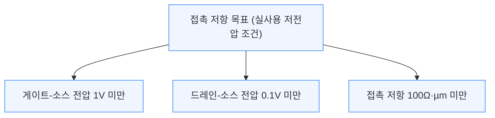

과전압을 걸지 않은 실사용 조건에서 이 목표를 달성하려면, 낮은 전압에서도 높은 전하 농도를 유지해야 접촉 저항을 양자역학적 한계 근처까지 낮출 수 있습니다.

### 세 번째 장벽: P형 트랜지스터가 N형을 따라가지 못함

CMOS(N형과 P형을 함께 쓰는 회로) 구현의 관건은 P형(양공을 운반) 트랜지스터 성능인데, 이는 공정 결함과 계면 물리 문제로 N형에 크게 못 미칩니다. 공정 중 도입된 결함으로 P형 특성이 N형 쪽으로 밀리는 "페르미 준위 고정" 현상이 주요 원인으로 지목되며, 이는 양공이 주입되는 문턱(쇼트키 장벽)을 더 높입니다.

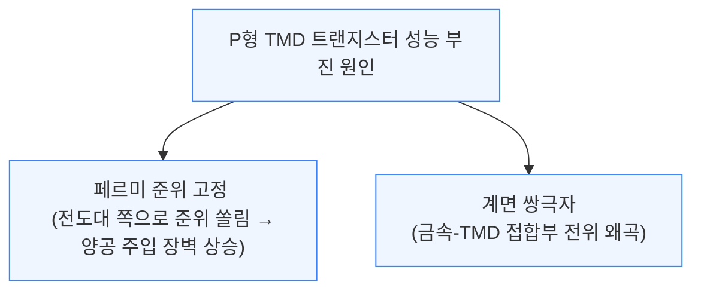

TSMC는 2025년 IEDM 발표에서 채널과 게이트 절연막 사이에 계면층(IL)을 삽입해 이 문제를 완화했습니다. 등가산화막두께(EOT)를 약 2nm에서 1nm로 줄이자 켜짐 전류(ON전류)가 2\~3배 늘고 히스테리시스(이력 현상)가 30\~40% 줄었지만, 문턱전압 이하 기울기(S.S.)는 여전히 100mV/dec대에 머물러 실리콘의 약 60mV/dec 기준에는 못 미쳤습니다. 질소 기반 계면층과 표면 전처리를 함께 적용하면 단층 WSe₂에서 양공 이동도가 100cm²/V·s를 넘는 결과도 확인됐습니다.

### 네 번째 장벽: 층수·결함에 따른 소자 편차

전사와 제조 과정에서 생기는 결함(적층 결함, 공공 등)은 소자 간 편차를 키우는 주요 원인입니다. 층수가 늘어날수록 밴드갭이 좁아지고 단층에서의 직접 밴드갭이 다층에서는 간접 밴드갭으로 바뀌어 전기적 특성이 크게 달라지는데, 다층은 기계적으로는 더 튼튼하지만 균일한 이중층·삼중층을 만드는 공정 자체가 아직 어려워 오히려 편차를 키우는 역설이 있습니다.

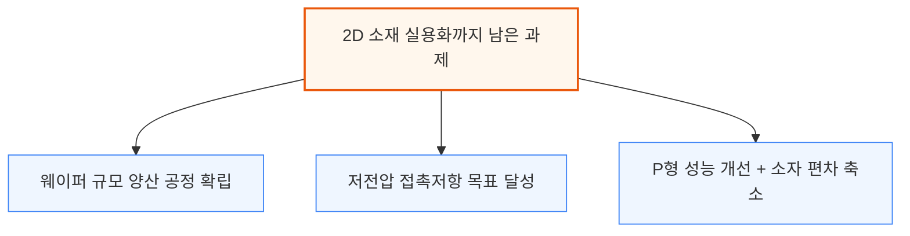

접촉부 형태(상부접촉 vs 측면접촉)에 대한 논쟁도 진행형이며, 실리콘용 시뮬레이션 도구(TCAD)를 그대로 쓸 수 없어 2D 소재 전용 물리 모델 구축도 병행되어야 합니다. 결국 다음 이정표는 화려한 단일 소자 기록이 아니라, 웨이퍼 전체에서 저전압 조건으로 통계적으로 신뢰할 수 있는 수준까지 양산성·접촉·P형 성능·편차가 동시에 개선되는 시점입니다.

---

*작성 진행률: 약 55% 완료*
*업데이트: 3장(차세대 배선, 루테늄), 4장(2D 소재) 작성 완료*
