# AMD Advancing AI: MI350X and MI400 UALoE72, MI500 UAL256

> **출처**: [SemiAnalysis Newsletter](https://newsletter.semianalysis.com/p/amd-advancing-ai-mi350x-and-mi400-ualoe72-mi500-ual256)
> **저자**: Kimbo Chen, Dylan Patel, Daniel Nishball
> **발행일**: 2026-02-05

---

## 📑 목차

### 전체 섹션
 1. [개요 - AMD Advancing AI 2025 발표 요약](#1-개요---amd-advancing-ai-2025-발표-요약)
 2. [MI350X·MI355X 스펙 - CDNA4 기반 신제품](#2-mi350x·mi355x-스펙---cdna4-기반-신제품)
 3. [MI355X vs HGX B200 - 성능당비용(TCO) 경쟁력](#3-mi355x-vs-hgx-b200---성능당비용tco-경쟁력)
 4. [엔비디아 DGX Lepton과 뉴클라우드의 반발](#4-엔비디아-dgx-lepton과-뉴클라우드의-반발)
 5. [MI355X는 랙 스케일 솔루션이 아니다 - 마케팅 과장 논란](#5-mi355x는-랙-스케일-솔루션이-아니다---마케팅-과장-논란)
 6. [하이퍼스케일러·AI 랩의 AMD 신제품 채택 현황](#6-하이퍼스케일러·ai-랩의-amd-신제품-채택-현황)
 7. [AMD 뉴클라우드 렌탈 시장의 구조적 약점](#7-amd-뉴클라우드-렌탈-시장의-구조적-약점)
 8. [AMD의 뉴클라우드 생태계 육성 전략](#8-amd의-뉴클라우드-생태계-육성-전략)
 9. [ROCm 소프트웨어 개선과 엔지니어링 우선순위 이슈](#9-rocm-소프트웨어-개선과-엔지니어링-우선순위-이슈)
10. [MI355X 제조 - 칩렛 아키텍처 리파인](#10-mi355x-제조---칩렛-아키텍처-리파인)
11. [CDNA4 마이크로아키텍처(UArch) 상세](#11-cdna4-마이크로아키텍처uarch-상세)
12. [AMD AI 엔지니어 보상 현실화 움직임](#12-amd-ai-엔지니어-보상-현실화-움직임)
13. [MI400 시리즈 Flexible I/O와 UALoE72 - 진짜 UALink는 아니다](#13-mi400-시리즈-flexible-io와-ualoe72---진짜-ualink는-아니다)
14. [MI400 Helios 랙 아키텍처 상세](#14-mi400-helios-랙-아키텍처-상세)
15. [MI500 UAL256 - 2027년 차세대 랙 컨셉](#15-mi500-ual256---2027년-차세대-랙-컨셉)
16. [MI350X·MI355X·MI400 BOM과 TCO 비교](#16-mi350x·mi355x·mi400-bom과-tco-비교)

---

## 🔑 용어 정리

본문을 순서대로 읽기 전에 알아두면 좋은 용어들입니다. 자세한 수치와 설명은 본문에서 처음 등장하는 위치에 나옵니다.

- **TCO(총소유비용, Total Cost of Ownership)**: 장비 구매 비용뿐 아니라 운영·전력·유지보수까지 합친 전체 비용 — 이 문서 전반에서 AMD와 Nvidia 제품을 비교하는 핵심 잣대
- **랙 스케일(Rack Scale) 솔루션**: 랙 안의 모든 GPU가 하나의 초고속 네트워크로 묶여 마치 GPU 1개처럼 작동하는 설계 — 몇 개의 서버를 그냥 한 랙에 모아놓은 것과는 다름
- **뉴클라우드(Neocloud)**: 하이퍼스케일러(Google·AWS 등 대형 클라우드)가 아니면서 GPU를 임대해주는 전문 GPU 클라우드 업체(예: CoreWeave, Tensorwave, Crusoe)
- **ROCm**: AMD GPU를 위한 오픈소스 소프트웨어 스택 — Nvidia의 CUDA에 대응하는 개념
- **UALink vs UALoE**: UALink는 여러 업체가 공동 개발 중인 GPU 스케일업(랙 내부 초고속 연결) 표준 규격 자체, UALoE(UALink over Ethernet)는 그 규격을 이더넷 스위치 위에 얹어 흉내만 낸 것 — 이 문서의 핵심 논쟁거리
- **BOM(부품 명세서, Bill of Materials)**: 시스템 하나를 만드는 데 들어가는 모든 부품과 그 원가를 나열한 목록
- **CU(컴퓨트 유닛, Compute Unit)**: AMD GPU 내부의 연산 처리 단위 — Nvidia의 SM(Streaming Multiprocessor)에 대응하는 개념
- **DGX Lepton**: Nvidia가 내놓은 GPU 임대 마켓플레이스 — 여러 클라우드의 GPU를 하나의 표준화된 창구로 묶어 파는 서비스

---

## 1. 개요 - AMD Advancing AI 2025 발표 요약

**📌 핵심:**
- MI350X·MI355X는 소형\~중형 모델 추론에서 Nvidia HGX B200과 경쟁 가능하지만, **랙 스케일 솔루션이 아니며** GB200 NVL72(프런티어 모델 추론·학습)와는 급이 다름
- 진짜 랙 스케일 제품은 **MI400 시리즈** — 2026년 하반기 Nvidia VR200 NVL144와 경쟁 가능할 전망이나, 스케일업 네트워크는 진짜 UALink가 아니라 이더넷 위에 얹은 **UALoE(UALink over Ethernet)**
- Nvidia의 GPU 임대 마켓플레이스 DGX Lepton이 뉴클라우드(전문 GPU 임대업체)들의 불만을 사면서, AMD가 뉴클라우드 생태계를 파고들 기회의 창이 열림
- 결론: AWS는 신규 대형 고객으로 합류했지만 Microsoft는 여전히 소극적 — AMD의 하드웨어 경쟁력 개선이 뉴클라우드·소프트웨어 격차라는 두 숙제와 함께 진행 중

---

지난 6개월간 AMD는 전시(Wartime) 태세로 Nvidia와의 경쟁력 확보에 총력을 기울여 왔습니다. Advancing AI 2025 행사에서 MI350X/MI355X GPU를 공개했는데, 소형\~중형 LLM 추론에서 성능당비용(TCO) 기준으로 Nvidia HGX B200과 경쟁할 만한 수준입니다.
다만 MI355X는 랙 스케일 제품이 아니며, 프런티어 모델 추론·학습에서는 GB200 NVL72의 상대가 되지 못합니다.

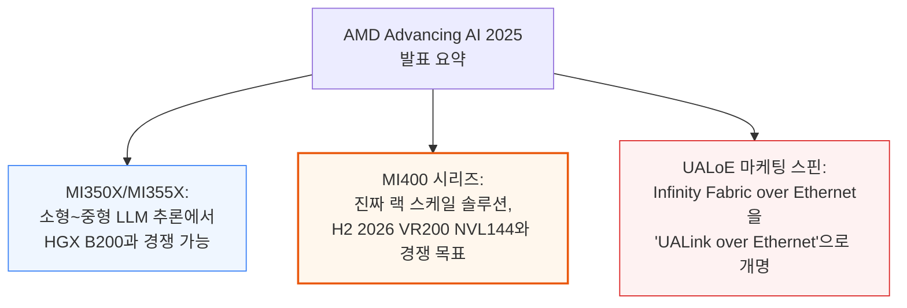

이번 리포트는 AMD 신제품의 상대적 경쟁력과 총소유비용을 분석하고, 신규 하이퍼스케일 고객 AWS와 반대로 후속 주문이 계속 실망스러운 기존 고객 Microsoft를 다룹니다.
또한 Nvidia의 DGX Lepton Marketplace 출시로 뉴클라우드 파트너들의 불만이 커지면서 AMD에게 열린 기회의 창, AMD가 뉴클라우드에 투자하는 금융공학적 기법, 내부 연구개발 클러스터 투자까지 살펴봅니다.

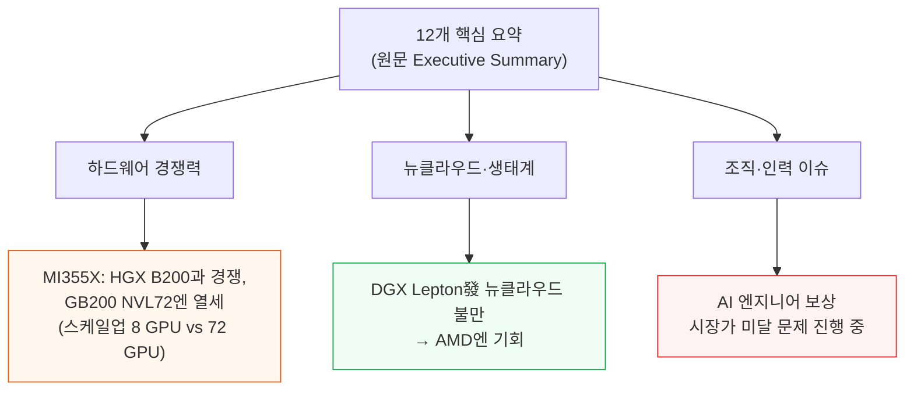

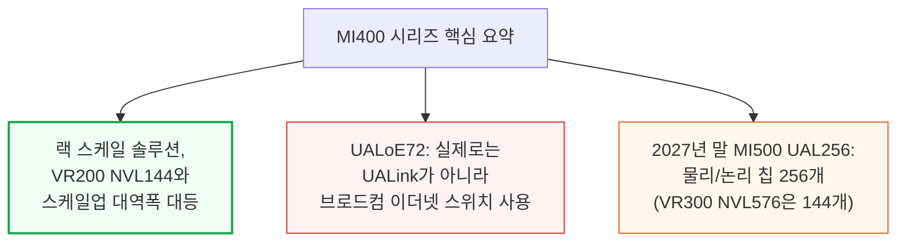

---

## 2. MI350X·MI355X 스펙 - CDNA4 기반 신제품

**📌 핵심:**
- MI350X(1,000W, 공랭)와 MI355X(1,400W, 공랭+물 냉각 지원) 두 버전 — MI355X가 전력을 1.4배 더 쓰지만 공식 스펙상 TFLOPS는 10% 미만 향상, 다만 실제로는 전력 제약 탓에 공식 스펙 자체가 실전에서 잘 안 나오므로 격차가 더 클 것으로 예상
- FP4 포맷에서 MI355X는 OCP MX4만 지원(32개 원소 블록 단위 보정)하는 반면, Nvidia Blackwell은 MX4와 NVFP4(16개 원소 블록, 정확도 더 좋음)를 모두 지원 — 정밀도 열세는 런타임 양자화 기법으로 일부 보완 가능
- HBM 용량은 288GB로 B200(180GB)보다 많아 단일 노드 추론에 유리하지만, 스케일업 네트워크(XGMI, 76.8GB/s)는 Nvidia의 스위치형 전체연결 방식보다 1.6배 느림 — GB200/GB300 NVL72(72개 GPU 스케일업)와는 비교 자체가 무의미(MI350/355는 8개 GPU만 연결)
- 결론: MI350X/MI355X는 스펙상 HGX B200과 경쟁 가능한 수준이지만, 스케일아웃 네트워킹(400Gbit/s, AMD 800GbE NIC는 2H 2026 양산)도 Nvidia 대비 뒤처짐

---

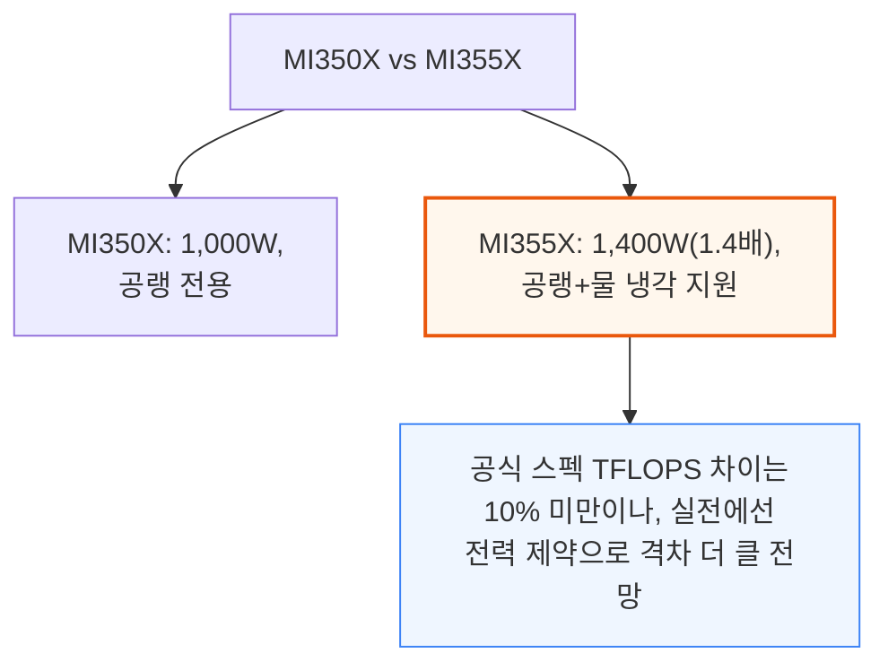

📌 용어 풀이: 왜 공식 스펙이 실전에서 안 나오나
> - 공식 스펙(피크 TFLOPS)은 "최고 클럭 속도를 계속 유지할 수 있다"고 가정하지만, 실제로는 전력·발열 제약 때문에 클럭이 계속 떨어짐
> - AMD·Nvidia 모두 겪는 문제 — 그래서 저자는 MI355X의 실제 성능이 공식 스펙상 "10% 미만 향상"보다 더 클 것으로 추정

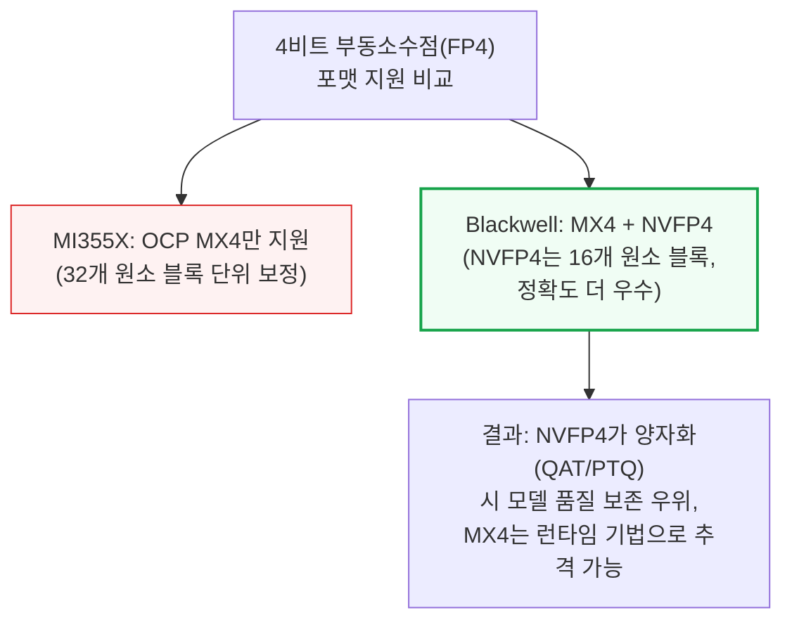

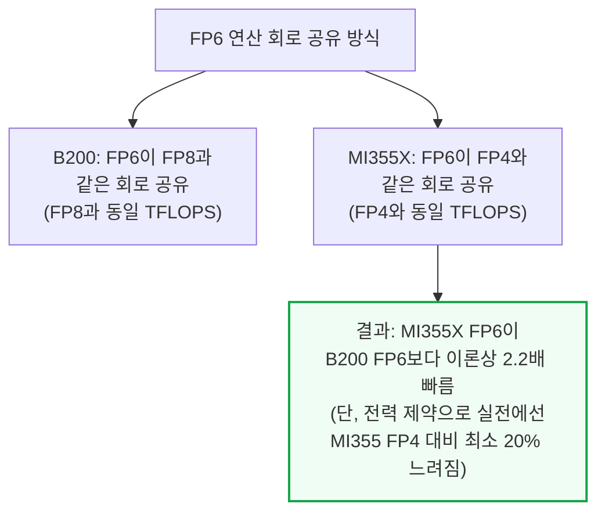

B300 HGX NVL8은 FP64·int8 텐서 코어 대부분을 제거하고 그 자리에 FP4 텐서 코어 회로를 1.4배 늘렸습니다. 이 최적화 덕에 B300의 FP4 TFLOPS는 MI355X보다 1.3배 빠르면서도 소비 전력은 200W 적습니다(MI350/355는 이 최적화를 쓰지 않음).

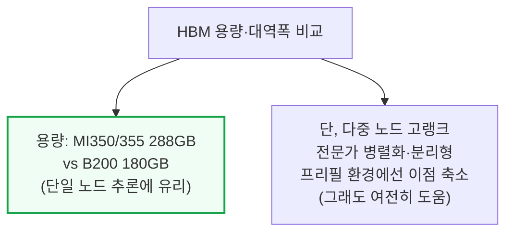

메모리 대역폭이 용량보다 훨씬 중요한 지표라, 8-Hi HBM4를 서로 다른 2개의 대형 ASIC 프로그램용으로 두 HBM 벤더가 서둘러 개발 중입니다(자세한 내용은 SemiAnalysis 가속기·HBM 모델 참고).

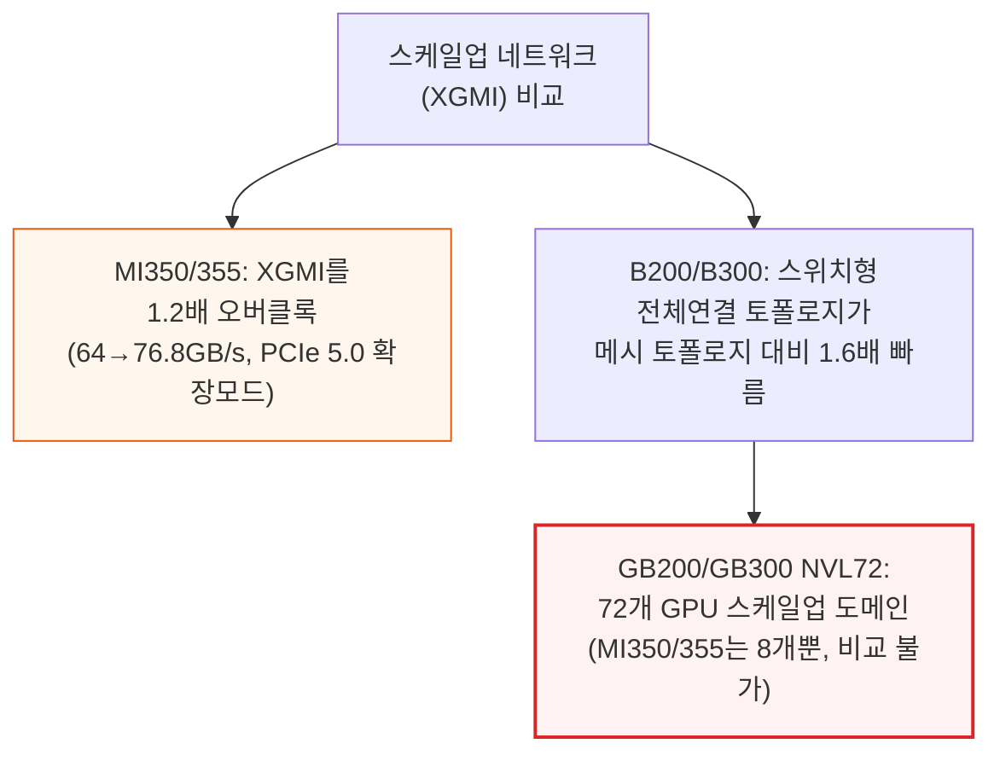

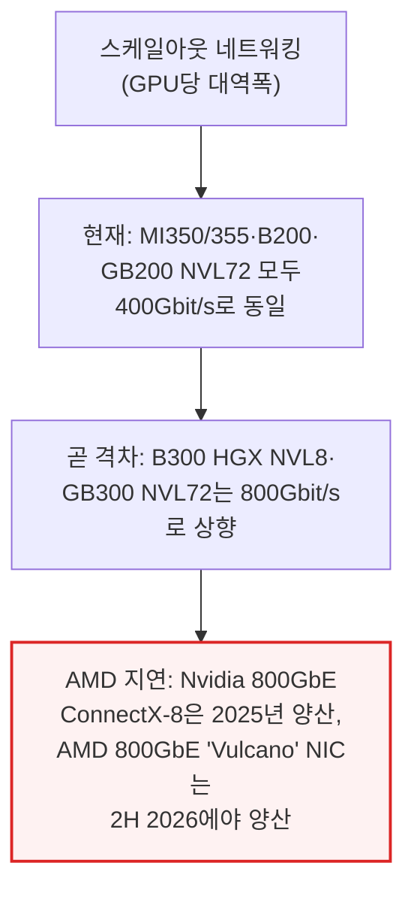

---

## 3. MI355X vs HGX B200 - 성능당비용(TCO) 경쟁력

**📌 핵심:**
- MI355X는 소형\~중형 LLM 프로덕션 추론에서 HGX B200 대비 TCO가 33% 낮으면서 HBM 용량은 더 많고, FP8·FP4 TFLOPS는 소폭 우위, FP6 TFLOPS는 2배 — AMD 소프트웨어(ROCm) 개선이 이어지면 이 우위는 더 커질 전망
- AMD의 핵심 세일즈 포인트는 "칩에 직접 물을 공급하는 냉각 방식(DLC)이 필요 없다"는 점이지만, 정작 비교 대상은 이미 시장에 나온 지 오래된 Nvidia의 "보급형" HGX 제품군 — GB200 NVL72(플래그십)과는 애초에 체급이 다름
- MI355X는 스케일업 세계 크기가 작아(8 GPU) GB200 NVL72와 정면 승부가 불가능 → 대신 공랭형 HGX B200 NVL8·HGX B300 NVL8을 겨냥하는 포지셔닝
- 결론: 대규모 스케일업 네트워크의 이점을 못 받는 소형\~중형 모델 사용자에게는 MI355X가 매력적이지만, 대규모 분리형 서빙이나 혼합 전문가(MoE) 모델을 쓰는 추론 환경에서는 GB200 NVL72가 성능·성능당비용 모두 압도

---

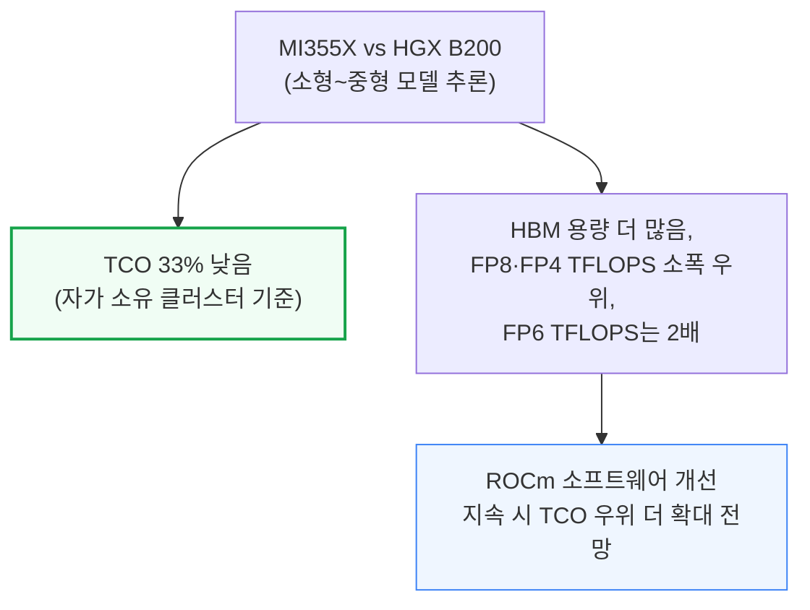

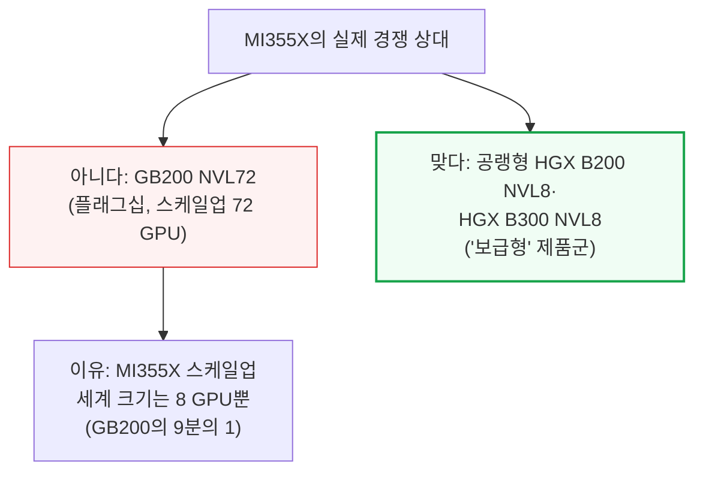

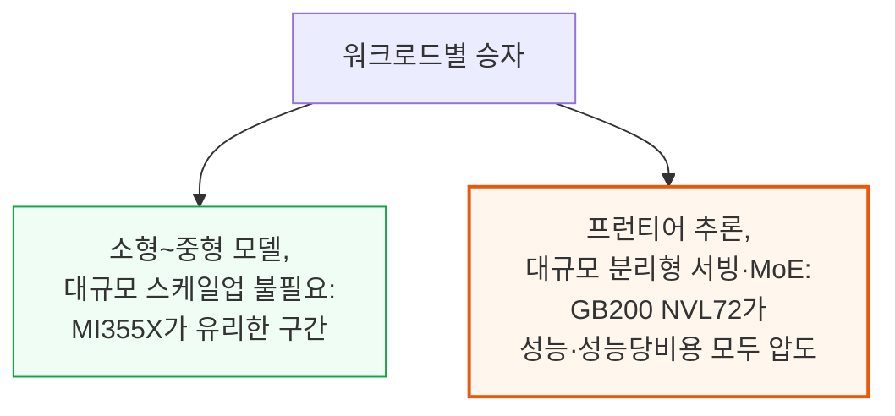

이 제품 구간은 MI355X의 소프트웨어 품질과 AMD가 책정할 가격에 따라 의미 있는 물량이 출하될 전망입니다.

---

*작성 진행률: 약 25% 완료 (1\~3장 작성)*
*업데이트: 개요, MI350X/MI355X 스펙, MI355X vs HGX B200 TCO 섹션 작성 완료*

