# AWS Trainium3 Deep Dive: A Potential Challenger Approaching

> **출처**: [SemiAnalysis Newsletter](https://newsletter.semianalysis.com/p/aws-trainium3-deep-dive-a-potential)
> **저자**: Dylan Patel, Daniel Nishball, Wega Chu
> **발행일**: 2026-02-05

---

## 📑 목차

### 전체 섹션
 1. [개요: Trainium3 발표와 AWS의 하드웨어 및 소프트웨어 전략](#1-개요-trainium3-발표와-aws의-하드웨어-및-소프트웨어-전략)
 2. [스펙 업그레이드: HBM3E, 스케일업, 스케일아웃 대역폭 확대](#2-스펙-업그레이드-hbm3e-스케일업-스케일아웃-대역폭-확대)
 3. [랙 아키텍처 2종 개관 - NL32x2 Switched vs NL72x2 Switched](#3-랙-아키텍처-2종-개관---nl32x2-switched-vs-nl72x2-switched)
 4. [실리콘과 패키징 - N3P 공정과 CoWoS-R, 이중 테이프아웃](#4-실리콘과-패키징---n3p-공정과-cowos-r-이중-테이프아웃)
 5. [Trainium4 로드맵 - UALink와 NVLink 이중 트랙](#5-trainium4-로드맵---ualink와-nvlink-이중-트랙)
 6. [레거시 토러스에서 스위치드로 - 전환 이유](#6-레거시-토러스에서-스위치드로---전환-이유)
 7. [NL32x2 Switched 상세 - 랙과 JBOG 트레이 구조](#7-nl32x2-switched-상세---랙과-jbog-트레이-구조)
 8. [NL72x2 Switched 상세 - 컴퓨트 트레이와 스케일아웃 네트워킹](#8-nl72x2-switched-상세---컴퓨트-트레이와-스케일아웃-네트워킹)
 9. [스케일업 네트워크 대역폭 구성 - 백플레인, PCB, 크로스랙](#9-스케일업-네트워크-대역폭-구성---백플레인-pcb-크로스랙)
10. [스위치 세대 진화 - Gen1에서 Gen3(UALink)까지](#10-스위치-세대-진화---gen1에서-gen3ualink까지)
11. [구리 케이블, 전력 예산, BOM과 수익화 속도 전략](#11-구리-케이블-전력-예산-bom과-수익화-속도-전략)
12. [스케일아웃 네트워킹 - EFA, ENA와 고radix 전략](#12-스케일아웃-네트워킹---efa-ena와-고radix-전략)
13. [마이크로아키텍처 - 4대 엔진과 숫자 포맷](#13-마이크로아키텍처---4대-엔진과-숫자-포맷)
14. [소프트웨어 대전환 - PyTorch 네이티브, NKI, MFU](#14-소프트웨어-대전환---pytorch-네이티브-nki-mfu)
15. [LNC(논리적 뉴런코어)와 Megacore, 성능 프로파일링 툴](#15-lnc논리적-뉴런코어와-megacore-성능-프로파일링-툴)
16. [데이터센터 램프업과 공랭 베팅, TCO 비교](#16-데이터센터-램프업과-공랭-베팅-tco-비교)

---

## 🔑 용어 정리

본문을 순서대로 읽기 전에 알아두면 좋은 용어들입니다. 자세한 수치와 설명은 본문에서 처음 등장하는 위치에 나옵니다.

- **JBOG (Just a Bunch of GPUs)**: XPU(가속기)만 여러 개 꽂아넣은 단순한 트레이 구조 — CPU 없이 가속기 전용으로 구성
- **NeuronLink(v4)**: AWS가 자체 설계한 스케일업(같은 랙 내부 칩 간) 연결 규격 — Nvidia NVLink와 달리 범용 PCIe 신호 규격 위에 구현
- **HBM3E 핀 속도 vs 스택 층수**: 메모리 대역폭은 스택을 얼마나 높이 쌓느냐(용량)와는 별개로, 신호를 얼마나 빨리 주고받느냐(핀 속도)로도 결정됨
- **N3P·CoWoS-R**: N3P는 TSMC 3나노 공정의 개선판(속도·전력 소폭 개선), CoWoS-R은 실리콘이 아닌 유기 재질 인터포저로 저비용에 칩을 묶는 패키징 방식
- **LNC(논리적 뉴런코어)·Megacore**: 칩 안의 물리적 연산 코어를 프로그래머에게 몇 개씩 묶어서 노출할지 정하는 방식 — 잘게 쪼갤수록 세밀한 제어가 가능하지만 진입장벽이 높아짐
- **EFA vs ENA**: EFA는 AI 훈련·추론용 고성능 후방(east-west) 네트워크, ENA는 일반 클라우드 서비스용 전방(north-south) 네트워크
- **Perf per TCO (총소유비용 대비 성능)**: 장비 가격만이 아니라 전력·운영까지 합친 총비용 대비 실제로 뽑아내는 성능 — AWS 설계 철학의 핵심 기준
- **스위치드 vs 토러스 토폴로지**: 칩들을 연결하는 두 가지 배선 방식 — 토러스는 이웃 칩끼리만 격자로 연결(홉 수 많음), 스위치드는 중앙 스위치를 거쳐 사실상 모든 칩이 직접 연결(홉 수 적음)

---

## 1. 개요: Trainium3 발표와 AWS의 하드웨어 및 소프트웨어 전략

**📌 핵심:**
- AWS는 re:Invent에서 **Trainium3(Trn3) 양산 출하**와 차세대 **Trainium4(Trn4) 로드맵**을 함께 발표 — 구글 TPUv7 심층분석 발표 직후라 경쟁 구도상 타이밍이 중요
- AWS 하드웨어 철학은 "**최저 총소유비용(TCO)에 최단 기간 출시**" — 특정 기술에 몰빵하지 않고 스위치 대역폭(12.8T/25.6T/51.2T)과 냉각 방식(공랭/수랭)을 상황에 맞춰 섞어 씀
- 스케일업(같은 랙 내부 칩 간) 네트워크를 기존 토러스 방식에서 **스위치 방식**(Nvidia GB200 NVL36x2와 유사)으로 전환 — 최신 MoE(전문가 혼합) 모델은 모든 칩이 서로 통신하는 all-to-all 방식이 많아 토러스보다 스위치가 유리하기 때문
- 결론: 소프트웨어도 사내 전용(Bedrock·Anthropic)에서 PyTorch 오픈소스화로 전환 — Nvidia CUDA 생태계의 장벽을 외부 개발자 저변 확대로 맞서겠다는 전략이며, Google TPUv7·AMD MI450X와 함께 Nvidia를 다각도로 압박하는 구도가 완성됨

---

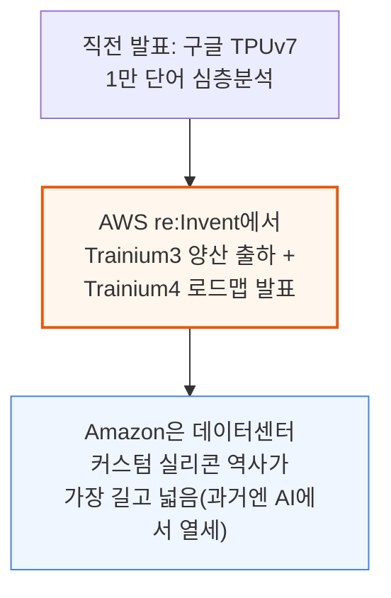
```mermaid
flowchart TD
    Context["직전 발표: 구글 TPUv7<br/>1만 단어 심층분석"] --> ReInvent["AWS re:Invent에서<br/>Trainium3 양산 출하 +<br/>Trainium4 로드맵 발표"]
    ReInvent --> History["Amazon은 데이터센터<br/>커스텀 실리콘 역사가<br/>가장 길고 넓음(과거엔 AI에서 열세)"]

    style ReInvent fill:#fff7ed,stroke:#ea580c,stroke-width:2px
    style History fill:#eff6ff,stroke:#3b82f6
```

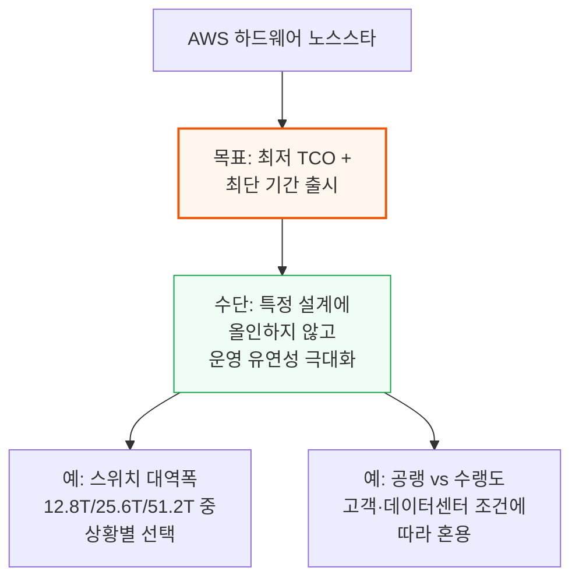
```mermaid
flowchart TD
    Goal["AWS 하드웨어 노스스타"] --> Star["목표: 최저 TCO +<br/>최단 기간 출시"]
    Star --> Flex["수단: 특정 설계에<br/>올인하지 않고<br/>운영 유연성 극대화"]
    Flex --> Ex1["예: 스위치 대역폭<br/>12.8T/25.6T/51.2T 중<br/>상황별 선택"]
    Flex --> Ex2["예: 공랭 vs 수랭도<br/>고객·데이터센터 조건에<br/>따라 혼용"]

    style Star fill:#fff7ed,stroke:#ea580c,stroke-width:2px
    style Flex fill:#f0fdf4,stroke:#16a34a
```

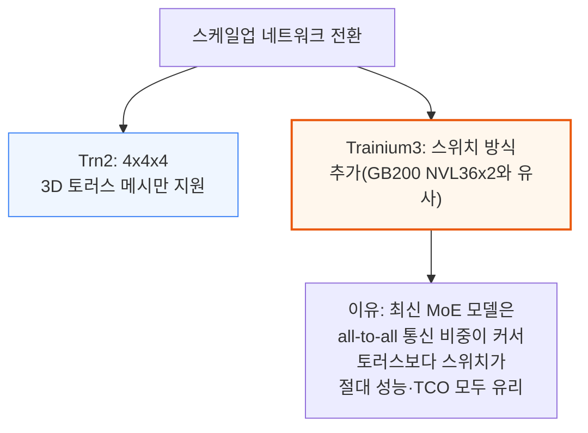
```mermaid
flowchart TD
    Topo["스케일업 네트워크 전환"] --> Old["Trn2: 4x4x4<br/>3D 토러스 메시만 지원"]
    Topo --> New["Trainium3: 스위치 방식<br/>추가(GB200 NVL36x2와 유사)"]
    New --> Why["이유: 최신 MoE 모델은<br/>all-to-all 통신 비중이 커서<br/>토러스보다 스위치가<br/>절대 성능·TCO 모두 유리"]

    style Old fill:#eff6ff,stroke:#3b82f6
    style New fill:#fff7ed,stroke:#ea580c,stroke-width:2px
```

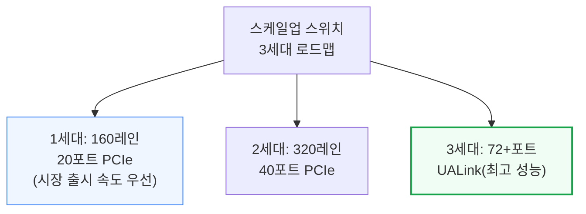
```mermaid
flowchart TD
    SwGen["스케일업 스위치<br/>3세대 로드맵"] --> G1["1세대: 160레인<br/>20포트 PCIe<br/>(시장 출시 속도 우선)"]
    SwGen --> G2["2세대: 320레인<br/>40포트 PCIe"]
    SwGen --> G3["3세대: 72+포트<br/>UALink(최고 성능)"]

    style G1 fill:#eff6ff,stroke:#3b82f6
    style G3 fill:#f0fdf4,stroke:#16a34a,stroke-width:2px
```

소프트웨어 쪽에서도 전략 전환이 큽니다. AWS의 "소프트웨어 노스스타"는 내부 Bedrock 워크로드(DeepSeek·Qwen 등 vLLM v1 자체 포크 사용)와 Anthropic 훈련·추론 전용 최적화를 넘어, 훨씬 더 넓은 개발자층을 겨냥합니다.

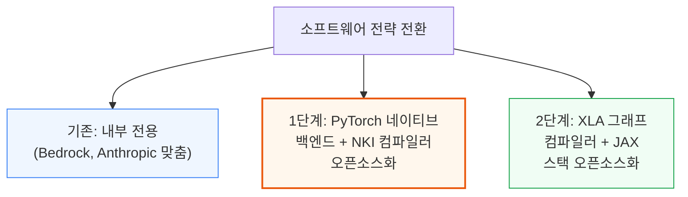
```mermaid
flowchart TD
    SWStrat["소프트웨어 전략 전환"] --> Before["기존: 내부 전용<br/>(Bedrock, Anthropic 맞춤)"]
    SWStrat --> P1["1단계: PyTorch 네이티브<br/>백엔드 + NKI 컴파일러<br/>오픈소스화"]
    SWStrat --> P2["2단계: XLA 그래프<br/>컴파일러 + JAX<br/>스택 오픈소스화"]

    style Before fill:#eff6ff,stroke:#3b82f6
    style P1 fill:#fff7ed,stroke:#ea580c,stroke-width:2px
    style P2 fill:#f0fdf4,stroke:#16a34a
```

AWS는 "CUDA 해자(moat)는 Nvidia 엔지니어가 아니라 그 주위에 참호를 파는 수백만 외부 개발자가 만든다"고 보고, 똑같은 전략을 그대로 따라갑니다. 다만 Trainium3는 출시일(Day 0)에 LNC(논리적 뉴런코어, 15장 참고)=1 또는 2만 지원하며, 폭넓은 연구자 커뮤니티가 선호하는 LNC=8은 2026년 중반까지 지원 예정이 없습니다.

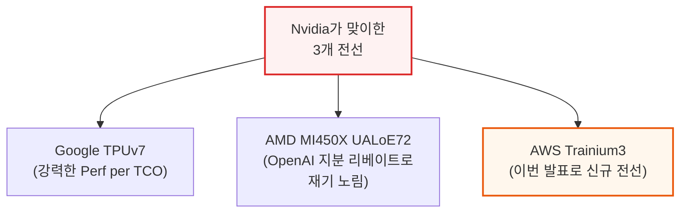
```mermaid
flowchart TD
    Battle["Nvidia가 맞이한<br/>3개 전선"] --> B1["Google TPUv7<br/>(강력한 Perf per TCO)"]
    Battle --> B2["AMD MI450X UALoE72<br/>(OpenAI 지분 리베이트로<br/>재기 노림)"]
    Battle --> B3["AWS Trainium3<br/>(이번 발표로 신규 전선)"]

    style Battle fill:#fef2f2,stroke:#dc2626,stroke-width:2px
    style B3 fill:#fff7ed,stroke:#ea580c,stroke-width:2px
```

저자들은 Nvidia가 계속 개발 속도를 가속하는 한 "정글의 왕" 자리를 지킬 것으로 보되, 과거 인텔이 CPU 시장에서 안주하다 AMD·ARM에 추격당한 사례처럼, Nvidia가 안주하면 선두 자리를 더 빨리 잃을 것이라고 경고합니다.

이 리포트는 스위치 스케일업을 지원하는 두 랙 SKU — **공랭 Trainium3 NL32x2 Switched(코드네임 "Teton3 PDS")**와 **수랭 Trainium3 NL72x2 Switched(코드네임 "Teton3 Max")** — 를 중심으로, 실리콘 설계·랙 아키텍처·BOM·전력 예산·네트워크 아키텍처·마이크로아키텍처·소프트웨어 전략·데이터센터 램프업·TCO까지 순서대로 다룹니다.

---

## 2. 스펙 업그레이드: HBM3E, 스케일업, 스케일아웃 대역폭 확대

**📌 핵심:**
- 연산 성능: OCP MXFP8 처리량이 전세대 대비 **2배**로 늘고 신규 지원되는 MXFP4는 MXFP8과 동일한 성능 — 반면 FP16·FP32 같은 고정밀 포맷 성능은 전세대(Trn2)와 동일하게 유지(13장에서 트레이드오프 상세)
- 메모리: HBM3E를 12층으로 쌓아 칩당 용량 144GB 확보, 스택 수는 4개로 그대로인데도 핀 속도를 5.7Gbps(Trn2)에서 9.6Gbps(Trn3, 업계 최고 수준)로 올려 **대역폭 70% 증가** — 공급사를 삼성에서 SK하이닉스·마이크론으로 전환한 덕분(Trn2의 5.7Gbps는 사실상 HBM3급 속도였음)
- 네트워크: 스케일업 대역폭은 PCIe Gen6 전환(레인당 64Gbps, Gen5의 32Gbps 대비 2배)으로 칩당 1.2TB/s(단방향) 확보, 스케일아웃 대역폭도 최대 400Gb/s까지 가능(2배 확대)하나 실제 생산 물량 대다수는 Trn2와 같은 200Gb/s를 유지
- 결론: Trainium4는 HBM4 8스택 채택으로 Trainium3 대비 **대역폭 4배, 용량 2배**를 예고 — HBM 세대 전환이 이 아키텍처의 다음 성장축임을 시사

---

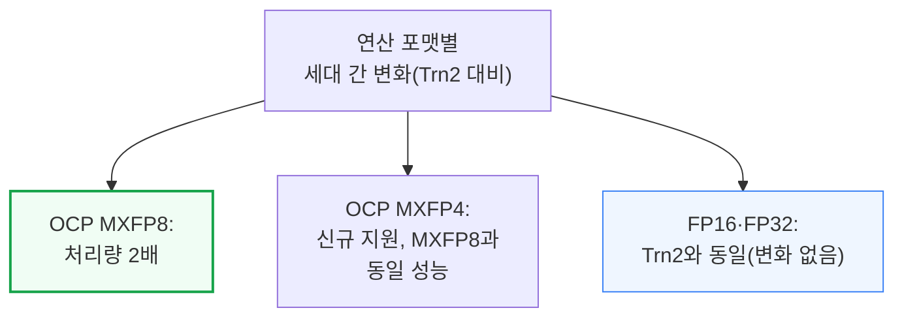
```mermaid
flowchart TD
    Compute["연산 포맷별<br/>세대 간 변화(Trn2 대비)"] --> F1["OCP MXFP8:<br/>처리량 2배"]
    Compute --> F2["OCP MXFP4:<br/>신규 지원, MXFP8과<br/>동일 성능"]
    Compute --> F3["FP16·FP32:<br/>Trn2와 동일(변화 없음)"]

    style F1 fill:#f0fdf4,stroke:#16a34a,stroke-width:2px
    style F3 fill:#eff6ff,stroke:#3b82f6
```

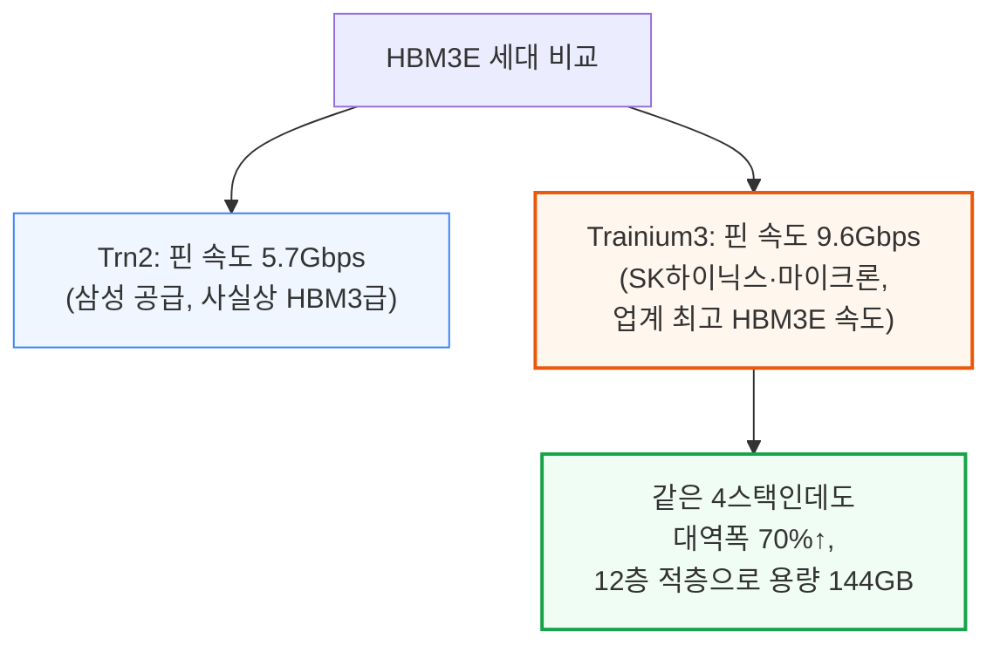
```mermaid
flowchart TD
    HBM["HBM3E 세대 비교"] --> Trn2h["Trn2: 핀 속도 5.7Gbps<br/>(삼성 공급, 사실상 HBM3급)"]
    HBM --> Trn3h["Trainium3: 핀 속도 9.6Gbps<br/>(SK하이닉스·마이크론,<br/>업계 최고 HBM3E 속도)"]
    Trn3h --> Result["같은 4스택인데도<br/>대역폭 70%↑,<br/>12층 적층으로 용량 144GB"]

    style Trn2h fill:#eff6ff,stroke:#3b82f6
    style Trn3h fill:#fff7ed,stroke:#ea580c,stroke-width:2px
    style Result fill:#f0fdf4,stroke:#16a34a,stroke-width:2px
```

**📌 용어 풀이: 핀 속도가 대역폭을 좌우하는 이유**
> - 메모리 대역폭 = 신호선 개수 × 신호선 하나당 속도(핀 속도) — 스택을 더 쌓는다고 대역폭이 느는 게 아니라, 신호선당 속도가 얼마나 빠른지가 관건
> - Trn2의 HBM3E는 공급사(삼성)의 속도 한계 탓에 이름만 HBM3E일 뿐 실제로는 HBM3급 속도(5.7Gbps)에 머물렀고, Trainium3는 공급사를 SK하이닉스·마이크론으로 바꿔 9.6Gbps까지 끌어올림

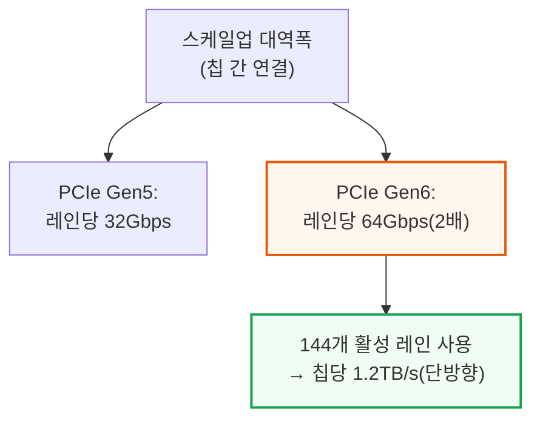
```mermaid
flowchart TD
    ScaleUp["스케일업 대역폭<br/>(칩 간 연결)"] --> Gen5["PCIe Gen5:<br/>레인당 32Gbps"]
    ScaleUp --> Gen6["PCIe Gen6:<br/>레인당 64Gbps(2배)"]
    Gen6 --> Lane["144개 활성 레인 사용<br/>→ 칩당 1.2TB/s(단방향)"]

    style Gen6 fill:#fff7ed,stroke:#ea580c,stroke-width:2px
    style Lane fill:#f0fdf4,stroke:#16a34a,stroke-width:2px
```

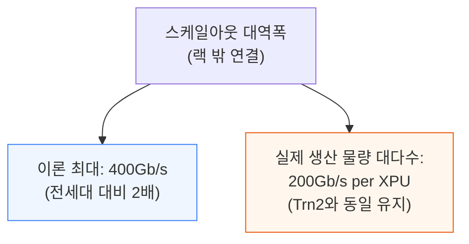
```mermaid
flowchart TD
    ScaleOut["스케일아웃 대역폭<br/>(랙 밖 연결)"] --> Max["이론 최대: 400Gb/s<br/>(전세대 대비 2배)"]
    ScaleOut --> Actual["실제 생산 물량 대다수:<br/>200Gb/s per XPU<br/>(Trn2와 동일 유지)"]

    style Max fill:#eff6ff,stroke:#3b82f6
    style Actual fill:#fff7ed,stroke:#ea580c
```

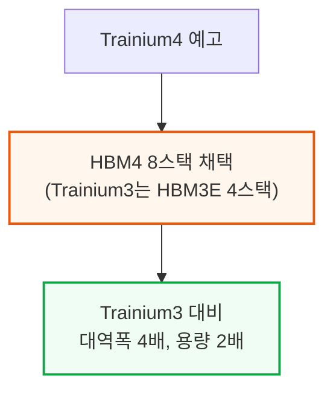
```mermaid
flowchart TD
    Trn4["Trainium4 예고"] --> Stack["HBM4 8스택 채택<br/>(Trainium3는 HBM3E 4스택)"]
    Stack --> Gain["Trainium3 대비<br/>대역폭 4배, 용량 2배"]

    style Stack fill:#fff7ed,stroke:#ea580c,stroke-width:2px
    style Gain fill:#f0fdf4,stroke:#16a34a,stroke-width:2px
```

---

## 3. 랙 아키텍처 2종 개관 - NL32x2 Switched vs NL72x2 Switched

**📌 핵심:**
- Trn2·Trn3 세대를 합쳐 랙 SKU가 총 4종 존재하는데, AWS 공식 브랜드명과 ODM·공급망이 쓰는 코드네임이 서로 달라 업계에서도 혼선이 큼 — 저자들은 Nvidia·AMD처럼 "제품명 뒤에 스케일업 기술+월드사이즈"(예: NVL72)를 붙이는 명명법으로 통일할 것을 AWS에 공개 요청
- Trn2는 NL16 2D 토러스·NL32x2 3D 토러스 2종만 존재했지만, **Trainium3는 4종 SKU를 모두 지원** — 다만 2026년 생산 물량 대다수는 공랭 NL32x2 Switched에 집중될 전망
- 두 스위치드 랙의 핵심 차이는 냉각 방식과 스케일업 월드사이즈: NL32x2 Switched(공랭, 랙당 32칩·전체 64칩)와 NL72x2 Switched(수랭, 랙당 72칩 구성·전체 144칩, CPU를 컴퓨트 트레이에 통합)
- 결론: 두 SKU는 경쟁 관계가 아니라 상호 보완 — 액체 냉각 준비가 안 된 데이터센터는 공랭 SKU로 우선 배치하고, 준비된 곳은 고밀도 수랭 SKU로 확장하는 유연한 전개가 가능(자세한 랙 구조는 7·8장)

---

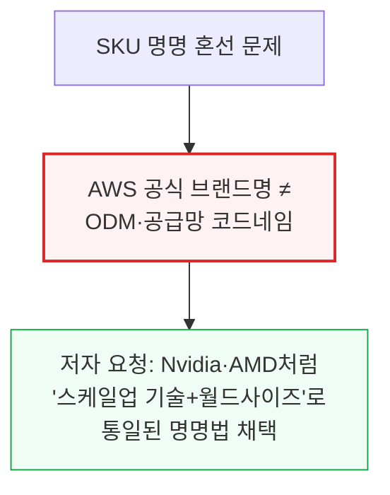
```mermaid
flowchart TD
    Naming["SKU 명명 혼선 문제"] --> Issue["AWS 공식 브랜드명 ≠<br/>ODM·공급망 코드네임"]
    Issue --> Ask["저자 요청: Nvidia·AMD처럼<br/>'스케일업 기술+월드사이즈'로<br/>통일된 명명법 채택"]

    style Issue fill:#fef2f2,stroke:#dc2626,stroke-width:2px
    style Ask fill:#f0fdf4,stroke:#16a34a
```

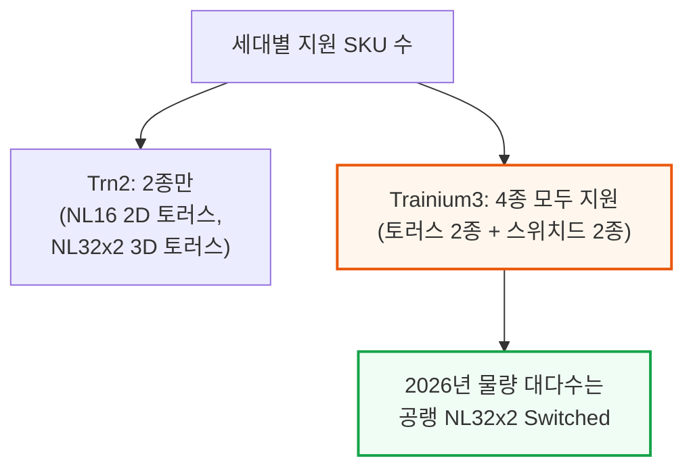
```mermaid
flowchart TD
    Evo["세대별 지원 SKU 수"] --> Trn2s["Trn2: 2종만<br/>(NL16 2D 토러스,<br/>NL32x2 3D 토러스)"]
    Evo --> Trn3s["Trainium3: 4종 모두 지원<br/>(토러스 2종 + 스위치드 2종)"]
    Trn3s --> Volume["2026년 물량 대다수는<br/>공랭 NL32x2 Switched"]

    style Trn3s fill:#fff7ed,stroke:#ea580c,stroke-width:2px
    style Volume fill:#f0fdf4,stroke:#16a34a,stroke-width:2px
```

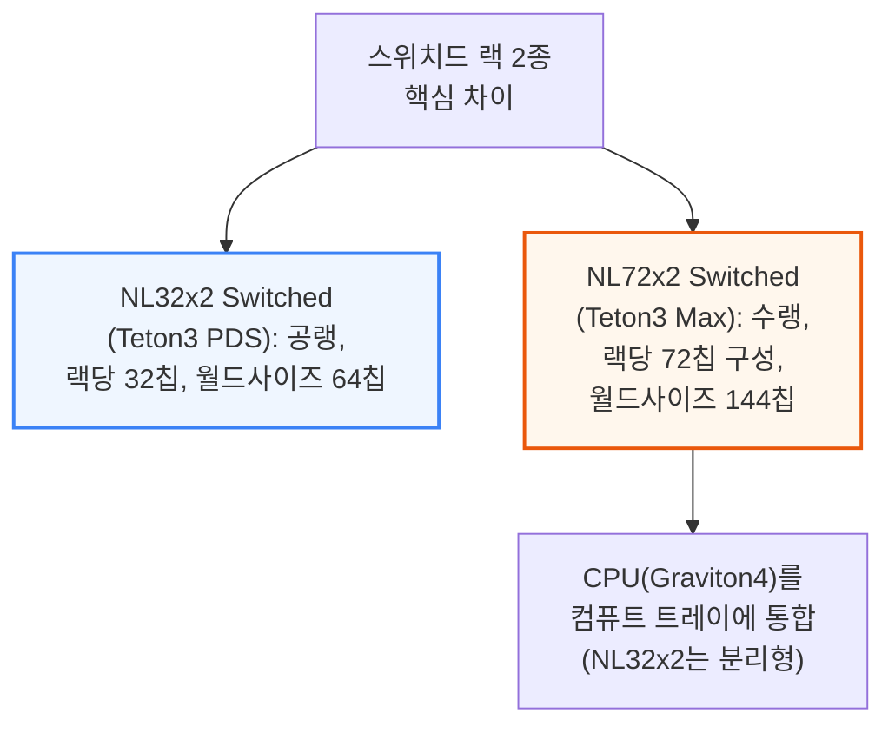
```mermaid
flowchart TD
    Compare["스위치드 랙 2종<br/>핵심 차이"] --> A["NL32x2 Switched<br/>(Teton3 PDS): 공랭,<br/>랙당 32칩, 월드사이즈 64칩"]
    Compare --> B["NL72x2 Switched<br/>(Teton3 Max): 수랭,<br/>랙당 72칩 구성,<br/>월드사이즈 144칩"]
    B --> CPU["CPU(Graviton4)를<br/>컴퓨트 트레이에 통합<br/>(NL32x2는 분리형)"]

    style A fill:#eff6ff,stroke:#3b82f6,stroke-width:2px
    style B fill:#fff7ed,stroke:#ea580c,stroke-width:2px
```

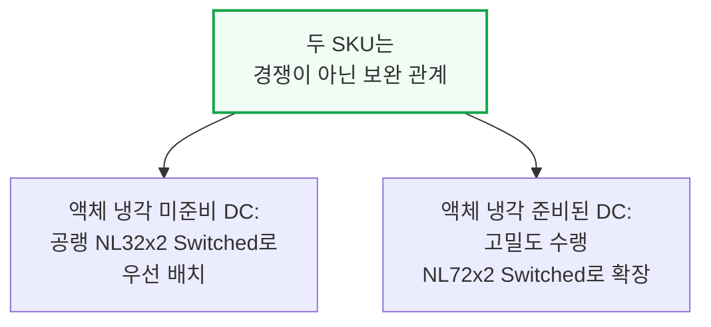
```mermaid
flowchart TD
    Comp["두 SKU는<br/>경쟁이 아닌 보완 관계"] --> Case1["액체 냉각 미준비 DC:<br/>공랭 NL32x2 Switched로<br/>우선 배치"]
    Comp --> Case2["액체 냉각 준비된 DC:<br/>고밀도 수랭<br/>NL72x2 Switched로 확장"]

    style Comp fill:#f0fdf4,stroke:#16a34a,stroke-width:2px
```

---

## 4. 실리콘과 패키징 - N3P 공정과 CoWoS-R, 이중 테이프아웃

**📌 핵심:**
- Trainium3는 Trn2의 N5 공정에서 **TSMC N3P**로 이전 — Vera Rubin, AMD MI450X의 AID(Active Interposer Die)와 함께 N3P 최초 채택 사례 중 하나이며, N3P 특유의 누설전류 이슈로 일정이 밀릴 가능성도 있음
- N3P는 N3E 대비 완전히 새로운 설계 규칙 없이 **같은 누설전류 기준 속도 5% 향상, 또는 같은 클럭 기준 전력 5\~10% 절감**, 밀집 로직·SRAM·아날로그 혼합 설계에서 밀도 4% 향상 정도의 점진적 개선("HPC 다이얼") — 거대 AI ASIC이 원하는 딱 그 수준의 저마찰 개선
- 패키징은 실리콘 인터포저 1장이 아니라 **CoWoS-R 어셈블리 2개**로 구성 — 저비용 유기 인터포저 기반이라 실리콘 인터포저 대비 기계적 유연성도 좋음
- 결론: 설계는 Annapurna(프론트엔드)+Alchip(백엔드) 분담 체제, 마스크셋도 Alchip 소유("Anita")와 Annapurna 소유("Mariana") 이중 테이프아웃으로 나뉘며 물량 대다수는 Mariana — 이 과정에서 전세대 설계사였던 Marvell은 소켓 자체를 잃음

---

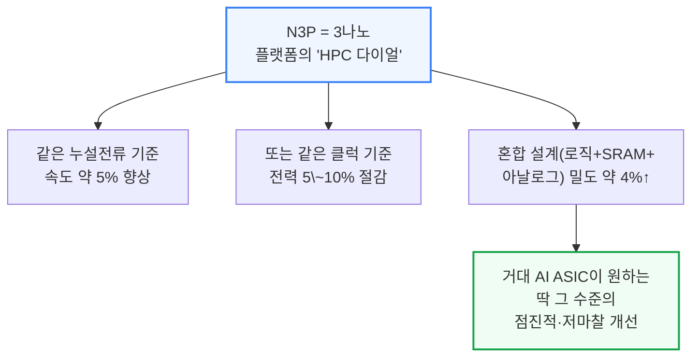
```mermaid
flowchart TD
    N3P["N3P = 3나노<br/>플랫폼의 'HPC 다이얼'"] --> Opt1["같은 누설전류 기준<br/>속도 약 5% 향상"]
    N3P --> Opt2["또는 같은 클럭 기준<br/>전력 5\~10% 절감"]
    N3P --> Opt3["혼합 설계(로직+SRAM+<br/>아날로그) 밀도 약 4%↑"]
    Opt3 --> Fit["거대 AI ASIC이 원하는<br/>딱 그 수준의<br/>점진적·저마찰 개선"]

    style N3P fill:#eff6ff,stroke:#3b82f6,stroke-width:2px
    style Fit fill:#f0fdf4,stroke:#16a34a,stroke-width:2px
```

N3P는 단일 돌파구가 아니라 여러 DTCO(설계-공정 공동 최적화) 미세 조정이 쌓인 결과입니다. N3 세대 FinFlex 라이브러리로 블록 안에서 넓은 핀·좁은 핀을 섞어 구동력과 면적·누설전류를 미세 조정하고, 하위 금속층의 라이너·배리어 공정을 개선해 배선·비아 저항을 낮췄습니다. 이 개선분이 모여 긴 글로벌 배선에서 더 높은 클럭이나 더 낮은 최소 동작전압(Vmin)을 지원할 여유를 만들어냅니다.

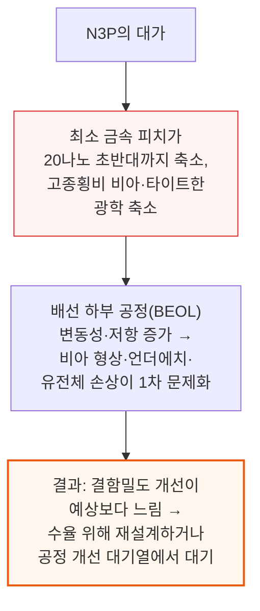
```mermaid
flowchart TD
    Challenge["N3P의 대가"] --> Pitch["최소 금속 피치가<br/>20나노 초반대까지 축소,<br/>고종횡비 비아·타이트한<br/>광학 축소"]
    Pitch --> Variability["배선 하부 공정(BEOL)<br/>변동성·저항 증가 →<br/>비아 형상·언더에치·<br/>유전체 손상이 1차 문제화"]
    Variability --> Yield["결과: 결함밀도 개선이<br/>예상보다 느림 →<br/>수율 위해 재설계하거나<br/>공정 개선 대기열에서 대기"]

    style Pitch fill:#fef2f2,stroke:#dc2626
    style Yield fill:#fff7ed,stroke:#ea580c,stroke-width:2px
```

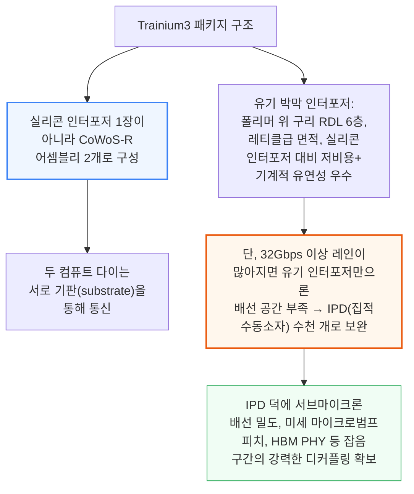
```mermaid
flowchart TD
    Package["Trainium3 패키지 구조"] --> NoMono["실리콘 인터포저 1장이<br/>아니라 CoWoS-R<br/>어셈블리 2개로 구성"]
    NoMono --> Sub["두 컴퓨트 다이는<br/>서로 기판(substrate)을<br/>통해 통신"]
    Package --> Organic["유기 박막 인터포저:<br/>폴리머 위 구리 RDL 6층,<br/>레티클급 면적, 실리콘<br/>인터포저 대비 저비용+<br/>기계적 유연성 우수"]
    Organic --> IPD["단, 32Gbps 이상 레인이<br/>많아지면 유기 인터포저만으론<br/>배선 공간 부족 → IPD(집적<br/>수동소자) 수천 개로 보완"]
    IPD --> Detail["IPD 덕에 서브마이크론<br/>배선 밀도, 미세 마이크로범프<br/>피치, HBM PHY 등 잡음<br/>구간의 강력한 디커플링 확보"]

    style NoMono fill:#eff6ff,stroke:#3b82f6,stroke-width:2px
    style IPD fill:#fff7ed,stroke:#ea580c,stroke-width:2px
    style Detail fill:#f0fdf4,stroke:#16a34a
```

칩 하단에는 20층 빌드업의 고층 ABF 기판이 자리해, 전력과 XSR 신호를 모듈 경계의 130\~150마이크로미터 C4 범프까지 팬아웃한 뒤 보드와 연결합니다.

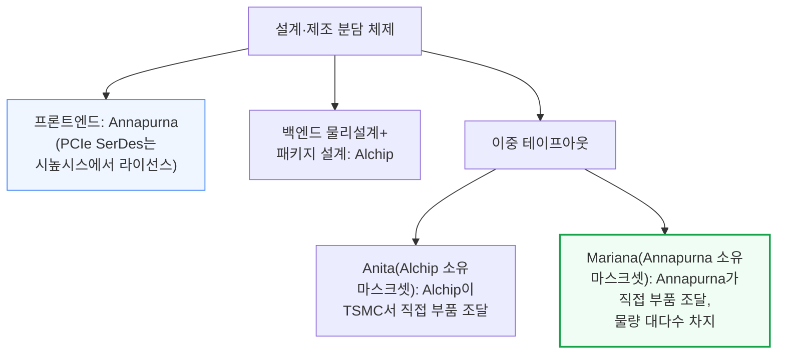
```mermaid
flowchart TD
    Design["설계·제조 분담 체제"] --> Front["프론트엔드: Annapurna<br/>(PCIe SerDes는<br/>시높시스에서 라이선스)"]
    Design --> Back["백엔드 물리설계+<br/>패키지 설계: Alchip"]
    Design --> Tape["이중 테이프아웃"]
    Tape --> Anita["Anita(Alchip 소유<br/>마스크셋): Alchip이<br/>TSMC서 직접 부품 조달"]
    Tape --> Mariana["Mariana(Annapurna 소유<br/>마스크셋): Annapurna가<br/>직접 부품 조달,<br/>물량 대다수 차지"]

    style Front fill:#eff6ff,stroke:#3b82f6
    style Mariana fill:#f0fdf4,stroke:#16a34a,stroke-width:2px
```

Amazon·Annapurna는 원가에 극도로 민감해 공급업체를 강하게 압박합니다. Broadcom의 ASIC 거래와 비교하면 Trainium 프로젝트는 설계 파트너(Alchip·Marvell)에게 돌아가는 이익 풀 자체가 훨씬 작으며, Perf per TCO 관점에서도 Annapurna는 TCO(분모)를 낮추는 쪽에 훨씬 무게를 둡니다.

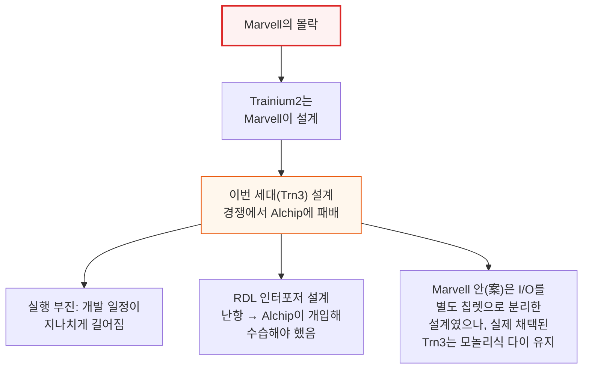
```mermaid
flowchart TD
    Marvell["Marvell의 몰락"] --> Was["Trainium2는<br/>Marvell이 설계"]
    Was --> Lost["이번 세대(Trn3) 설계<br/>경쟁에서 Alchip에 패배"]
    Lost --> Why1["실행 부진: 개발 일정이<br/>지나치게 길어짐"]
    Lost --> Why2["RDL 인터포저 설계<br/>난항 → Alchip이 개입해<br/>수습해야 했음"]
    Lost --> Chiplet["Marvell 안(案)은 I/O를<br/>별도 칩렛으로 분리한<br/>설계였으나, 실제 채택된<br/>Trn3는 모놀리식 다이 유지"]

    style Marvell fill:#fef2f2,stroke:#dc2626,stroke-width:2px
    style Lost fill:#fff7ed,stroke:#ea580c
```

---

## 5. Trainium4 로드맵 - UALink와 NVLink 이중 트랙

**📌 핵심:**
- Trainium4는 스케일업 프로토콜이 다른 **두 트랙**으로 복수 설계사가 참여 — 1트랙은 UALink 224G, 2트랙은 Nvidia NVLink 448G BiDi 프로토콜 채택(양쪽 모두 백엔드 설계는 Alchip이 주도)
- Nvidia의 VR NVL144와 NVLink Fusion 제품(Trainium4 포함) 사이에는 상당한 출시 시차가 예상 — NVLink Fusion 트랙은 퓨전 칩렛이 요구하는 추가 통합·검증 작업 때문에 더 밀릴 수 있고, Nvidia의 혼합신호 엔지니어 대다수가 우선 자사 VR NVL144 신제품 출시에 매달려 있기 때문
- Trainium4의 NVLink Fusion 출시가 늦더라도 AWS는 Nvidia의 통상 총마진(약 75%)보다 유리한 조건을 확보했을 가능성이 큼 — Nvidia 입장에서도 AWS와의 상호운용성 허용이 시스템 차원의 록인(lock-in) 유지에 도움이 되므로 가격을 더 매력적으로 제시할 유인이 있음
- 결론: VR NVL144가 72패키지 고정 NVLink 도메인에 묶인 것과 달리, Trainium4는 랙 간 AEC로 NVLink 스케일업을 확장해 **144개 이상**의 일관성(coherent) 도메인을 구성 가능 — NVLink 6는 400G 양방향(BiDi) SerDes로 같은 선에서 200G 송신·200G 수신을 동시에 수행하며 이미 구리 배선의 실용적 한계에 근접, 일부 벤더는 600G BiDi로의 절반 세대 도약도 시도할 전망

---

```mermaid
flowchart TD
    Trn4["Trainium4<br/>스케일업 프로토콜 2트랙"] --> T1["1트랙: UALink 224G"]
    Trn4 --> T2["2트랙: Nvidia NVLink<br/>448G BiDi"]
    T1 --> Backend["양쪽 모두 백엔드 설계는<br/>Alchip이 주도"]
    T2 --> Backend

    style Trn4 fill:#eff6ff,stroke:#3b82f6,stroke-width:2px
    style Backend fill:#f0fdf4,stroke:#16a34a
```

```mermaid
flowchart TD
    Timing["출시 시차 리스크"] --> Gap["Nvidia VR NVL144 vs<br/>NVLink Fusion(Trainium4 등)<br/>사이 상당한 시차 예상"]
    Gap --> Reason1["퓨전 칩렛은 추가 통합·<br/>검증 요구사항 있음"]
    Gap --> Reason2["Nvidia 혼합신호<br/>엔지니어 대다수가<br/>VR NVL144 신제품 출시에<br/>우선 투입됨"]

    style Gap fill:#fff7ed,stroke:#ea580c,stroke-width:2px
```

```mermaid
flowchart TD
    Deal["상업 조건 전망"] --> Margin["Nvidia 통상 총마진<br/>약 75%보다 AWS는<br/>유리한 조건 확보 추정"]
    Margin --> Incentive["Nvidia도 AWS와의<br/>상호운용 허용이<br/>자사 시스템 록인 유지에<br/>도움되므로 가격 유인 존재"]

    style Margin fill:#f0fdf4,stroke:#16a34a,stroke-width:2px
```

```mermaid
flowchart TD
    Scale["스케일업 도메인 크기 비교"] --> VR["Nvidia VR NVL144:<br/>72패키지 고정<br/>NVLink 도메인"]
    Scale --> T4["Trainium4: 랙 간 AEC로<br/>확장 → 144개 이상<br/>일관성 도메인 구성 가능"]
    T4 --> Signal["NVLink 6: 400G BiDi<br/>SerDes(같은 선에서<br/>200G 송신+200G 수신<br/>동시), 구리 실용 한계 근접"]

    style VR fill:#eff6ff,stroke:#3b82f6
    style T4 fill:#fff7ed,stroke:#ea580c,stroke-width:2px
```

---

## 6. 레거시 토러스에서 스위치드로 - 전환 이유

**📌 핵심:**
- Trn2는 NL16 2D 토러스(반 랙, 4x4 메시로 칩 16개 스케일업 월드)와 NL32x2 3D 토러스(NL16 반 랙 4개를 AEC로 연결, 랙 2개·칩 64개 4x4x4 구조) 2종만 존재 — 스위치 방식은 아예 없었음
- Trn2 물량 대다수는 NL64 3D 토러스로 쏠렸는데, 이는 Anthropic의 Project Rainier가 최대 수요처였고 그 추론 모델이 더 큰 스케일업 토폴로지를 요구했기 때문
- Nvidia가 GB200 NVL72(Oberon 아키텍처, all-to-all 스위치·72칩 월드사이즈)를 선보이자 업계 전체가 로드맵을 이 방식으로 전환 — AMD가 Oberon 유사 설계(MI400 Helios)를 가장 먼저 "발표"했지만, 실제로 이런 all-to-all 스위치 스케일업을 Nvidia 밖에서 처음 "출하"하는 곳은 Trainium3를 앞세운 AWS(AMD MI450X UALoE72는 1년 늦게, 연말 목표; Meta도 AMD보다 먼저 스위치드 아키텍처 출하 예정)
- 결론: re:Invent에서 공개된 "Trainium3 UltraServer"는 NL72x2 Switched를 가리키며, 스위치드 SKU는 이것과 공랭·저전력밀도인 NL32x2 Switched 2종으로 나뉨(7·8장에서 각각 상세 구조를 다룸)

---

```mermaid
flowchart TD
    Trn2Topo["Trn2 토폴로지 2종<br/>(스위치 방식 없음)"] --> NL16["NL16 2D 토러스:<br/>반 랙, 4x4 메시,<br/>칩 16개 스케일업 월드"]
    Trn2Topo --> NL32["NL32x2 3D 토러스:<br/>NL16 반 랙 4개를 AEC 연결,<br/>랙 2개·칩 64개(4x4x4)"]

    style NL16 fill:#eff6ff,stroke:#3b82f6
    style NL32 fill:#fff7ed,stroke:#ea580c
```

```mermaid
flowchart TD
    Demand["Trn2 물량이<br/>NL64 3D 토러스로 쏠린 이유"] --> Anthropic["Anthropic Project Rainier가<br/>최대 수요처"]
    Anthropic --> Need["Anthropic 추론 모델은<br/>더 큰 스케일업<br/>토폴로지가 필요"]

    style Anthropic fill:#fff7ed,stroke:#ea580c,stroke-width:2px
```

```mermaid
flowchart TD
    Pivot["업계 전체의<br/>스위치 방식 전환"] --> Nvidia_["Nvidia GB200 NVL72<br/>(Oberon, all-to-all,<br/>72칩 월드사이즈) 선도"]
    Nvidia_ --> AMDann["AMD: MI400 Helios로<br/>Oberon 유사 설계<br/>가장 먼저 '발표'"]
    Nvidia_ --> AWSship["AWS: Trainium3로<br/>Nvidia 외 최초 실제<br/>'출하'(AMD보다 1년 빠름)"]
    AWSship --> AMDlate["AMD MI450X UALoE72:<br/>1년 늦게, 연말 목표<br/>(Meta도 AMD보다 먼저 출하)"]

    style AWSship fill:#f0fdf4,stroke:#16a34a,stroke-width:2px
    style AMDlate fill:#fef2f2,stroke:#dc2626
```

```mermaid
flowchart TD
    Ultra["re:Invent 공개<br/>'Trainium3 UltraServer'"] --> Is["= NL72x2 Switched"]
    Is --> Other["다른 스위치드 SKU:<br/>NL32x2 Switched<br/>(공랭, 저전력밀도)"]

    style Is fill:#fff7ed,stroke:#ea580c,stroke-width:2px
```

---

## 7. NL32x2 Switched 상세 - 랙과 JBOG 트레이 구조

**📌 핵심:**
- 랙 구조는 기존 NL32x2 3D 토러스와 거의 동일 — JBOG(가속기 전용 트레이) 16개 + 호스트 CPU 트레이 2개, JBOG 하나당 칩 2개로 랙당 32칩, 전체 스케일업 월드는 랙 2개(64칩)로 구성
- 핵심 차이는 랙 중앙에 추가된 **NeuronLink 스위치 트레이**(4개, 무중단 교체용 스페어 포함 시 5개) — Nvidia GB200/300 NVL72·VR NVL144는 스위치 트레이 교체 전 워크로드를 전부 빼내야 하는 반면, AWS는 예비 회선 설계 덕에 **무중단 핫스왑**이 가능 — AWS는 현장 서비스성·신뢰성을 최우선하는 반면 Nvidia는 판매 상품 특성상 성능을 최우선하는 철학 차이가 드러남
- JBOG는 PCIe 6.0으로 업그레이드(Trn2는 PCIe 5.0)되면서 PCB 소재도 M8에서 M8.5 등급으로 상향 — 케이블 없는(케이블리스) 설계라 신호가 전부 PCB를 타고 흐르는데, PCB 손실이 커 PCIe 6.0 x16 리타이머 4개로 신호를 보강
- 결론: EFAv4 백엔드 네트워크는 칩당 200Gbps(JBOG당 NIC 1개, 물량 대다수)와 400Gbps(NIC 2개) 두 옵션 중 200Gbps가 주력 — 대형 추론 모델의 프리필-디코드 간 KV캐시 전송에도 충분하고, 훈련은 AWS 철학상 소수 정예 개발자가 파이프라인 병렬화(PP)로 네트워크 부담을 줄이는 방식을 전제로 함

---

```mermaid
flowchart TD
    Layout["NL32x2 Switched<br/>랙 구성"] --> JBOG["JBOG 16개 + 호스트<br/>CPU 트레이 2개/랙"]
    JBOG --> PerJBOG["JBOG 1개당 칩 2개<br/>→ 랙당 32칩"]
    PerJBOG --> World["전체 스케일업 월드<br/>= 랙 2개(칩 64개)"]

    style JBOG fill:#eff6ff,stroke:#3b82f6,stroke-width:2px
    style World fill:#f0fdf4,stroke:#16a34a,stroke-width:2px
```

```mermaid
flowchart TD
    Switch["NeuronLink 스위치<br/>트레이 배치"] --> Mid["랙 중앙 배치<br/>(SerDes 최장 도달거리<br/>최소화, Nvidia와 동일 이유)"]
    Mid --> Move["CPU·전원·BBU·ToR<br/>스위치도 상하단으로<br/>재배치해 거리 단축"]
    Switch --> HotSwap["예비 스위치 트레이<br/>1개 추가(총 5개) →<br/>무중단 핫스왑 가능"]
    HotSwap --> VsNvidia["Nvidia GB200/300<br/>NVL72·VR NVL144는<br/>교체 전 워크로드<br/>전부 배출 필요"]

    style HotSwap fill:#f0fdf4,stroke:#16a34a,stroke-width:2px
    style VsNvidia fill:#fef2f2,stroke:#dc2626
```

**📌 용어 풀이: AWS와 Nvidia의 철학 차이**
> - AWS는 직접 데이터센터를 운영하는 입장이라 "현장에서 고장 나도 서비스 중단 없이 고칠 수 있는가"를 최우선 — 그래서 예비 회선·핫스왑 설계에 투자
> - Nvidia는 시스템을 판매하는 입장이라 "최고 성능"이 곧 상품 가치 — 서비스성보다 성능 극대화를 우선하는 설계 철학

```mermaid
flowchart TD
    PCB["JBOG PCB 업그레이드"] --> Gen["PCIe 5.0(Trn2)<br/>→ PCIe 6.0(Trn3)"]
    Gen --> CCL["PCB 소재도<br/>M8 → M8.5 등급 CCL로<br/>상향(저손실 유리섬유+<br/>구리박 개선)"]
    PCB --> Cableless["케이블리스 설계:<br/>신호는 전부 PCB로 전송"]
    Cableless --> Loss["PCB 손실이 플라이오버<br/>케이블보다 훨씬 큼"]
    Loss --> Retimer["→ PCIe 6.0 x16<br/>리타이머 4개로<br/>신호 보강"]

    style Gen fill:#eff6ff,stroke:#3b82f6
    style Retimer fill:#fff7ed,stroke:#ea580c,stroke-width:2px
```

```mermaid
flowchart TD
    NIC["EFAv4 백엔드 NIC<br/>구성 옵션(JBOG당 칩 2개 기준)"] --> Opt1["옵션1: Nitro-v6 NIC 1개<br/>→ 칩당 200Gbps<br/>(물량 대다수)"]
    NIC --> Opt2["옵션2: Nitro-v6 NIC 2개<br/>→ 칩당 400Gbps"]
    Opt1 --> Enough["AWS 판단: 최대 규모<br/>추론 모델도 200Gbps면<br/>프리필→디코드 KV캐시<br/>전송을 충분히 오버랩"]
    Opt1 --> Train["훈련은 Anthropic 같은<br/>소수 정예 개발자가<br/>PP(파이프라인 병렬화)로<br/>네트워크 부담 자체를 감축"]

    style Opt1 fill:#f0fdf4,stroke:#16a34a,stroke-width:2px
    style Train fill:#fff7ed,stroke:#ea580c
```

ENA(전방 네트워크)는 CPU 트레이 안에 전용 Nitro-v6 400Gbps NIC 모듈을 따로 두고, JBOG 트레이와 CPU 트레이는 서버 전면을 따라 이어지는 PCIe 6.0 x16 DAC 케이블(128GB/s 단방향)로 연결합니다(Trn2 NL16 2D 토러스와 동일 방식).

```mermaid
flowchart TD
    AirCool["NL32x2 Switched는<br/>공랭 랙"] --> Density["전력밀도는 낮게 유지<br/>(NL32x2 3D 토러스와<br/>동일 프로필,<br/>스위치 트레이만 추가)"]
    AirCool --> TTM["시장 출시 속도 이점:<br/>액체 냉각 준비된<br/>데이터센터가 아직도<br/>배치의 핵심 병목"]
    TTM --> Sidecar["액체 냉각 랙을 공랭 DC에<br/>억지로 넣으려면 비효율적인<br/>Liquid-to-Air 사이드카 필요"]
    TTM --> Majority["결과: 2026년 배치되는<br/>Trainium3 칩 대다수는<br/>NL32x2 Switched"]

    style TTM fill:#fff7ed,stroke:#ea580c,stroke-width:2px
    style Majority fill:#f0fdf4,stroke:#16a34a,stroke-width:2px
```

---

## 8. NL72x2 Switched 상세 - 컴퓨트 트레이와 스케일아웃 네트워킹

**📌 핵심:**
- NL72x2 Switched는 Nvidia GB200 NVL72(Oberon)와 가장 유사한 구조 — 둘 다 수랭이며, CPU(Graviton4)를 GPU와 같은 컴퓨트 트레이에 통합(NL32x2 Switched는 CPU가 분리된 노드)한다는 점도 같음. 다만 Oberon과 달리 **랙 간 연결로 스케일업 월드사이즈를 2개 랙에 걸쳐 확장**하는 것이 결정적 차이
- 랙 2개로 총 144 XPU 월드사이즈 구성 — 랙마다 컴퓨트 트레이 18개(각 트레이에 Trainium3 4개+Graviton4 1개)와 NeuronLink 스위치 트레이 10개가 들어가 랙당 72칩+18 CPU, 전체 144칩+36 CPU
- 컴퓨트 트레이 안에서도 냉각 방식이 갈림: **수랭**은 Trainium3 모듈·NeuronLinkv4 32레인 PCIe 6.0 스위치·Graviton4 CPU, **공랭(팬)**은 리타이머·NIC·AEC 케이지·DIMM·로컬 NVMe 드라이브
- 결론: 스케일아웃도 NL32x2 Switched와 동일하게 칩당 200Gbps(주력)·400Gbps 옵션 중 200Gbps가 대다수 — NL72x2 Switched는 Nvidia Oberon에 대한 AWS의 정면 대응이지만, 전력밀도가 높고 액체 냉각 데이터센터가 필요해 실제 배치 물량은 여전히 NL32x2 Switched가 다수를 차지할 전망

---

```mermaid
flowchart TD
    Compare["NL72x2 Switched<br/>vs Nvidia Oberon"] --> Same1["공통점: 수랭 냉각"]
    Compare --> Same2["공통점: CPU를 컴퓨트<br/>트레이에 통합<br/>(NL32x2 Switched는<br/>CPU 분리형)"]
    Compare --> Diff["차이점: 랙 간(cross-rack)<br/>연결로 스케일업 월드사이즈를<br/>2개 랙에 걸쳐 확장<br/>(Oberon은 랙 1개 안에 고정)"]

    style Diff fill:#fff7ed,stroke:#ea580c,stroke-width:2px
```

```mermaid
flowchart TD
    Rack2["랙 2개 구성<br/>(총 144 XPU 월드)"] --> PerRack["랙당: 컴퓨트 트레이 18개<br/>+ NeuronLink 스위치<br/>트레이 10개"]
    PerRack --> PerTray["트레이 1개당:<br/>Trainium3 4개 +<br/>Graviton4 CPU 1개"]
    PerTray --> Total["전체: Trainium3 144개<br/>+ Graviton4 36개<br/>(busbar로 전력 공급)"]

    style PerTray fill:#eff6ff,stroke:#3b82f6,stroke-width:2px
    style Total fill:#f0fdf4,stroke:#16a34a,stroke-width:2px
```

```mermaid
flowchart TD
    Cooling["컴퓨트 트레이<br/>냉각 방식 분리"] --> Liquid["수랭: Trainium3 모듈,<br/>NeuronLinkv4 32레인<br/>PCIe 6.0 스위치,<br/>Graviton4 CPU"]
    Cooling --> Air2["공랭(팬): 리타이머,<br/>Nitro-v6 NIC, AEC 케이지,<br/>DIMM, 로컬 NVMe 2x8TB"]

    style Liquid fill:#fff7ed,stroke:#ea580c,stroke-width:2px
    style Air2 fill:#eff6ff,stroke:#3b82f6
```

컴퓨트 트레이 연결은 대부분 PCIe 6.0 기반(NL32x2 Switched와 같은 PCB 소재)이며, 칩 간·전면 I/O 포트 간 신호 도달거리를 늘리기 위해 PCIe 6.0 x16 리타이머 6개를 사용합니다(NL32x2 Switched의 4개보다 많음). 케이블리스 설계로 제조 속도를 높이는 대신, 시장 출시 초기에는 리스크를 낮추려 저가 리타이머를 다소 여유 있게 배치했고, 초기 양산이 안정되면 일부를 제거해 최적화할 계획입니다.

호스트 CPU는 출시 시점에 Graviton4만 지원하며(추후 세대 업그레이드 가능), 이론상 x86도 PCIe로 연결 가능하지만 x86 SKU는 NL32x2 Switched 쪽에만 낼 계획입니다. Trainium3(PCIe 6.0)와 Graviton4(PCIe 5.0)의 세대 차이를 메우기 위해 CPU 옆에 PCIe 기어박스 2개를 배치합니다. CPU 메모리는 DDR5 DIMM 슬롯 12개(64GB·128GB 모듈), 로컬 저장은 트레이당 8TB NVMe 드라이브 2개를 사용합니다.

```mermaid
flowchart TD
    ScaleOut2["NL72x2 Switched<br/>스케일아웃(JBOG당 칩 4개 기준)"] --> Opt1_["옵션1: Nitro-V6 NIC 2개<br/>→ 칩당 200Gbps<br/>(물량 대다수, NL32x2와 동일)"]
    ScaleOut2 --> Opt2_["옵션2: Nitro-V6 NIC 4개<br/>→ 칩당 400Gbps"]
    ScaleOut2 --> CPUNic["호스트 CPU도 이제<br/>컴퓨트 트레이 안에 위치,<br/>전용 NIC로 외부 통신"]

    style Opt1_ fill:#f0fdf4,stroke:#16a34a,stroke-width:2px
```

NL72x2 Switched는 Nvidia Oberon 랙 아키텍처에 대한 AWS의 정면 대응이며 전세대보다 전력밀도가 훨씬 높습니다. 다만 액체 냉각 준비가 된 데이터센터가 필요하다는 제약 때문에, 일부 물량은 NL72x2 Switched로 가더라도 대다수는 여전히 NL32x2 Switched로 배치될 전망입니다.

---

## 9. 스케일업 네트워크 대역폭 구성 - 백플레인, PCB, 크로스랙

**📌 핵심:**
- 토러스에서 스위치로 전환한 이유: 조밀한 모델(dense model)은 all-to-all 통신을 많이 쓰지 않아 스위치 방식이 이득이 없는 반면(TCO만 높아짐), 최신 MoE(전문가 혼합) 모델은 all-to-all 집단통신이 필수라 토러스 방식이 배치 크기(메시지 크기 16KB→1MB)가 커질수록 회선 과다사용(오버서브스크립션)으로 대역폭 병목에 부딪힘 — Trainium3의 스위치 방식은 1세대(멀티 티어 구조)에서도 이 병목이 발생하지 않음
- 프리필은 연산 집약적이라 랙 크기(72 vs 32칩)가 커도 큰 이득이 없지만, **디코드 단계에서 넓은 전문가 병렬화(EP)**가 필요할 때는 랙 크기가 중요 — MoE 총 파라미터 2\~3조 규모는 NL32x2 Switched로 충분하고, 4조 파라미터를 넘으면 NL72x2 Switched의 더 큰 스케일업 월드가 의미 있는 이득을 줌
- 칩 1개당 NeuronLinkv4 회선(레인) 총 160개를 세 경로로 분배: **백플레인 80개**(활성 64+예비 16), **PCB 64개**(이웃 칩 직결), **크로스랙 16개**(OSFP-XD 케이지 경유 인접 랙 연결)
- 결론: 예비 16개 회선을 추가 대역폭으로 안 쓰는 이유는 두 가지 — 디코드처럼 지연시간이 중요한 워크로드는 회선을 늘려도 체감 속도가 안 변하고(파이프가 굵어져도 물 한 방울의 이동 속도는 그대로), 훈련처럼 통신량이 많은 워크로드도 낙오자 효과(straggler effect) 때문에 랙 하나만 회선 고장이 나도 전체 작업이 가장 느린 랙에 맞춰지기 때문

---

```mermaid
flowchart TD
    Why["토러스→스위치<br/>전환 이유"] --> Dense["조밀 모델: all-to-all<br/>거의 안 씀 →<br/>스위치 이득 없이<br/>TCO만 상승"]
    Why --> MoE["최신 MoE 모델: all-to-all<br/>집단통신 필수 →<br/>토러스는 배치 크기↑시<br/>회선 과다사용으로<br/>대역폭 병목 발생"]
    MoE --> Solve["Trainium3 스위치 방식:<br/>1세대(멀티 티어)에서도<br/>이 병목 미발생"]

    style MoE fill:#fff7ed,stroke:#ea580c,stroke-width:2px
    style Solve fill:#f0fdf4,stroke:#16a34a,stroke-width:2px
```

```mermaid
flowchart TD
    Phase["프리필 vs 디코드,<br/>랙 크기 중요도"] --> Prefill["프리필: 연산 집약적 →<br/>랙 크기(72 vs 32칩)<br/>영향 미미"]
    Phase --> Decode["디코드: 넓은 전문가<br/>병렬화(EP) 필요"]
    Decode --> Small["MoE 2\~3조 파라미터:<br/>NL32x2 Switched로 충분"]
    Decode --> Big["MoE 4조 파라미터 초과:<br/>NL72x2 Switched의<br/>더 큰 월드사이즈 필요"]

    style Small fill:#eff6ff,stroke:#3b82f6
    style Big fill:#fff7ed,stroke:#ea580c,stroke-width:2px
```

```mermaid
flowchart TD
    Lane["칩 1개당<br/>NeuronLinkv4 160레인 분배"] --> BP["백플레인 80개<br/>(활성 64 + 예비 16)"]
    Lane --> PCB2["PCB 64개<br/>(이웃 칩 직결)"]
    Lane --> Cross["크로스랙 16개<br/>(OSFP-XD 케이지 경유<br/>인접 랙 연결)"]

    style BP fill:#eff6ff,stroke:#3b82f6,stroke-width:2px
    style PCB2 fill:#f0fdf4,stroke:#16a34a
    style Cross fill:#fff7ed,stroke:#ea580c
```

백플레인 회선은 Strada Whisper 백플레인 커넥터 1개(칩당 160개 차동쌍, 80Tx+80Rx)로 연결되며, 예비 16개는 백플레인 케이블·스위치 트레이·포트 트레이 단위 장애에 대비한 이중화입니다.

```mermaid
flowchart TD
    Redundant["예비 16레인을<br/>추가 대역폭으로<br/>안 쓰는 이유"] --> R1["지연시간 중심 워크로드<br/>(디코드): 회선 늘려도<br/>체감 속도 불변<br/>(파이프 굵기 ≠ 물방울 속도)"]
    Redundant --> R2["통신 집약 워크로드<br/>(훈련): 낙오자 효과 —<br/>랙 1개만 회선 고장 나도<br/>전체가 가장 느린 랙에 맞춰짐"]

    style R1 fill:#eff6ff,stroke:#3b82f6
    style R2 fill:#fff7ed,stroke:#ea580c,stroke-width:2px
```

PCB 경로는 NL32x2 Switched의 경우 이웃 칩에 직결되지만, NL72x2 Switched는 8개의 32레인(또는 4개의 64레인, 2개의 128레인) PCIe 6.0 스위치를 거칩니다 — 제조 시점에 레인당 비용이 가장 낮은 옵션을 AWS가 자유롭게 고를 수 있는 구조입니다. PCB 경로는 백플레인보다 장애율이 훨씬 낮아 예비 회선이 필요 없습니다.

---

## 10. 스위치 세대 진화 - Gen1에서 Gen3(UALink)까지

**📌 핵심:**
- Trainium3 수명 주기 동안 스케일업 스위치는 3세대로 진화 — **Gen1(160레인·20포트, 빠른 출시용)** → **Gen2(320레인·40포트)** → **Gen3(72+포트 UALink, 최고 성능)** — 뒤로 갈수록 홉 수가 줄어 지연시간이 개선됨
- Gen1은 포트 수 제약 때문에 NL32x2 Switched도 최대 3홉, NL72x2 Switched는 최대 4홉이 필요 — Gen2에서 NL32x2는 전 칩 1홉(all-to-all) 완성, NL72x2도 스위치 평면이 4개→2개로 축소
- Gen3(UALink)에서는 NL72x2 Switched까지 랙 내 완전 all-to-all(모든 칩이 모든 스위치와 직결) 달성 — 컴퓨트 트레이 내 32레인 PCIe 스위치는 이제 여유 대역폭 역할로 격하
- 결론: AWS는 PCIe 스위치·리타이머 공급사 **Astera Labs**와 지분 워런트 계약(행사가 $20.34)을 맺어 구매량 목표 달성 시 자사주를 받는 구조 — 2025년 9월 25일 기준 벡터화된 워런트 가치로 환산하면 실질 약 **23% 할인** 효과, OpenAI·Anthropic·Nvidia 간 지분 연계 파트너십과 같은 패턴

---

```mermaid
flowchart TD
    Gen["스케일업 스위치 3세대"] --> G1["Gen1: 160레인·20포트<br/>Scorpio X PCIe 6.0<br/>(빠른 시장 출시 우선)"]
    Gen --> G2["Gen2: 320레인·40포트<br/>Scorpio X PCIe 6.0"]
    Gen --> G3["Gen3: 72+포트 UALink<br/>(최저 지연시간·최고 성능)"]

    style G1 fill:#eff6ff,stroke:#3b82f6
    style G3 fill:#f0fdf4,stroke:#16a34a,stroke-width:2px
```

```mermaid
flowchart TD
    Gen1["Gen1 홉 수 제약<br/>(포트 부족 → 다단 경유)"] --> NL32g1["NL32x2 Switched:<br/>랙당 2개 평면×8스위치,<br/>같은 평면 내 1홉,<br/>랙 간 최대 3홉"]
    Gen1 --> NL72g1["NL72x2 Switched:<br/>랙당 4평면×10스위치(40개)<br/>+ 트레이당 32레인 스위치8개×18<br/>=144개 → 랙당 총 184개<br/>스위치, 최대 4홉"]

    style NL72g1 fill:#fff7ed,stroke:#ea580c,stroke-width:2px
```

Gen1이 부족할 경우를 대비해 AWS는 브로드컴 PEX90144(144레인, 최대 72포트)를 백업 옵션으로 준비했습니다. 포트당 레인 수를 8레인(36포트) 또는 4레인(18포트)으로 나눠 쓸 수 있어, 극단적 저지연이 필요하면 포트당 2레인으로 세분화하지 않는 방식을 택합니다.

```mermaid
flowchart TD
    Gen2["Gen2(320레인·40포트)<br/>업그레이드 효과"] --> NL32g2["NL32x2 Switched:<br/>랙당 스위치 8개로 충분<br/>→ 전 칩 1홉 all-to-all 완성"]
    Gen2 --> NL72g2["NL72x2 Switched:<br/>스위치 평면 4개→2개로 축소<br/>(트레이 내 인접 칩은<br/>여전히 로컬 스위치 경유)"]

    style NL32g2 fill:#f0fdf4,stroke:#16a34a,stroke-width:2px
```

```mermaid
flowchart TD
    Gen3["Gen3(72+포트 UALink)<br/>최종 목표 구조"] --> NL72g3["NL72x2 Switched:<br/>스위치 1개가 랙 내 모든 칩과<br/>직결 → 완전 all-to-all 달성"]
    NL72g3 --> Surplus["컴퓨트 트레이 내<br/>32레인 PCIe 스위치는<br/>여유 대역폭 역할로 격하"]

    style NL72g3 fill:#f0fdf4,stroke:#16a34a,stroke-width:2px
```

```mermaid
flowchart TD
    Astera["Astera Labs 지분<br/>연계 리베이트 구조"] --> Deal["구매량 목표 달성 시<br/>ALAB 주식 워런트 지급<br/>(행사가 $20.34)"]
    Deal --> Effect["2025-09-25 기준<br/>벡터화 가치 환산 시<br/>실질 약 23% 할인 효과"]
    Effect --> Pattern["OpenAI·Anthropic·Nvidia<br/>지분 연계 파트너십과<br/>같은 패턴(구매량↑ → 절감폭↑)"]

    style Effect fill:#f0fdf4,stroke:#16a34a,stroke-width:2px
```

---

## 11. 구리 케이블, 전력 예산, BOM과 수익화 속도 전략

**📌 핵심:**
- 구리 케이블 사용량은 스케일업 토폴로지와 레인 수에 비례 — Trn2 NL32x2 3D 토러스(백플레인 4개, 케이블 약 6,100개) 대비 **Trainium3 NL32x2 Switched는 비슷한 백플레인 구성에 케이블 약 5,100개**, 스케일업 월드가 144칩으로 커지는 **NL72x2 Switched는 케이블 11,520개**로 급증
- 전력: 칩당 전력(TDP)이 랙 전체 전력의 최대 변수 — 랙당 칩 수는 NL72x2(64칩/랙)가 NL32x2(32칩/랙)의 2배라 랙 전력밀도는 NL72x2가 훨씬 높지만, **칩 1개당 전력으로 정규화하면 두 SKU가 거의 동일**(칩 TDP가 지배적 요인이기 때문)
- 수익화 속도 전략: **케이블리스(PCB 신호 전송) 설계**로 조립 속도를 높이고, 백플레인 예비 레인 16개로 무중단 핫스왑을 가능케 해 GB200 사례처럼 배선 결함으로 인한 배치 지연을 원천 차단 — 액체 냉각 미준비 데이터센터엔 공랭 NL32x2 Switched로 즉시 배치해 특정 시설 지연이 전체 매출 지연으로 번지지 않게 함(CoreWeave Denton 사례와 대비)
- 결론: AWS는 팹 출고에서 랙 출하까지 걸리는 시간을 1년 전보다 크게 단축(현재 분기 이내 수준)했고, 계속 단축 중 — Nvidia는 GB200 NVL72·Vera Rubin Kyber로 갈수록 칩 출고~고객 매출 발생까지의 시차가 오히려 길어지는 추세라 OEM·클라우드의 운전자본 부담과 TCO가 상대적으로 불리해지는 구도

---

```mermaid
flowchart TD
    Cable["구리 케이블<br/>사용량 비교"] --> Trn2c["Trn2 NL32x2 3D 토러스:<br/>백플레인 4개, 약 6,100개"]
    Cable --> NL32c["Trainium3 NL32x2 Switched:<br/>비슷한 백플레인,<br/>약 5,100개(오히려 감소)"]
    Cable --> NL72c["Trainium3 NL72x2 Switched:<br/>월드 144칩으로 확장 →<br/>11,520개(약 2.3배)"]

    style NL72c fill:#fff7ed,stroke:#ea580c,stroke-width:2px
```

```mermaid
flowchart TD
    Power["전력밀도 vs<br/>칩당 전력 구분"] --> RackDense["랙 전력밀도:<br/>NL72x2(64칩/랙)가<br/>NL32x2(32칩/랙)보다 훨씬 높음"]
    Power --> PerChip["칩당 전력(정규화):<br/>두 SKU 거의 동일<br/>(칩 TDP가 지배 변수)"]

    style PerChip fill:#f0fdf4,stroke:#16a34a,stroke-width:2px
```

```mermaid
flowchart TD
    TTM["수익화 속도<br/>전략 3가지"] --> Cableless["케이블리스 PCB 설계:<br/>조립 결함 리스크 최소화<br/>(GB200은 내부 배선<br/>결함으로 조립 지연 경험)"]
    TTM --> HotSwap2["백플레인 예비 레인 16개:<br/>워크로드 중단 없이<br/>스위치 트레이 교체"]
    TTM --> Flex2["공랭 SKU 병행 배치:<br/>액체 냉각 미준비 시설도<br/>즉시 가동(단일 시설 지연이<br/>전체 매출 지연으로 안 번짐)"]

    style Cableless fill:#f0fdf4,stroke:#16a34a
    style Flex2 fill:#f0fdf4,stroke:#16a34a,stroke-width:2px
```

```mermaid
flowchart TD
    Timeline["팹→랙 출하<br/>소요 시간 추세"] --> AWS_["AWS: 1년 전 대비<br/>대폭 단축, 현재 분기 이내<br/>수준까지 압축·계속 개선 중"]
    Timeline --> Nvidia2["Nvidia: GB200 NVL72→<br/>Vera Rubin Kyber로 갈수록<br/>출고~매출 시차 오히려 증가"]
    Nvidia2 --> Capital["결과: OEM·클라우드의<br/>운전자본 부담·TCO 악화"]

    style AWS_ fill:#f0fdf4,stroke:#16a34a,stroke-width:2px
    style Capital fill:#fef2f2,stroke:#dc2626
```

---

## 12. 스케일아웃 네트워킹 - EFA, ENA와 고radix 전략

**📌 핵심:**
- **EFA(Elastic Fabric Adapter, AI 훈련·추론용 후방 네트워크)**는 SRD(Scalable Reliable Datagram)라는 AWS 자체 전송 계층으로 지연시간·혼잡 제어·부하분산을 처리 — RoCEv2·InfiniBand의 대안이며 VPC 보안·AES-256 종단간 암호화가 기본 내장, **ENA(전방 네트워크)**는 일반 클라우드 서비스(스토리지·인터넷 연결 등)를 담당
- Nvidia GPU 기반 AWS 인스턴스에서는 EFA가 Spectrum-X·InfiniBand 대비 뚜렷한 성능 우위를 보이지 못했지만, **Trainium에서는 AWS가 스택 전체를 통제**할 수 있어 사용 경험이 훨씬 낫다는 평가
- 고radix(포트를 잘게 쪼개는) 전략: 업계 표준은 스위치 논리 포트를 400G/800G로 크게 잡지만, AWS는 처음부터 **100G 논리 포트를 기본값**으로 사용 — 2계층 네트워크 기준 12.8T 스위치만으로도 최대 GPU 연결 수가 512개(400G 포트)에서 8,192개(100G 포트)로 16배 증가, 25.6T·51.2T 스위치를 섞으면 3계층에서 최대 524,288개까지 확장 가능(오늘날 최대급 멀티빌딩 클러스터 규모)
- 결론: 100G 포트는 배선 복잡도가 급증하는 단점이 있어 AWS는 전용 광케이블 설비(ViaPhoton)로 이를 상쇄 — 스케일아웃은 건물 간(FR 광학, 수km \~ ZR 광학, 수백km)까지 딥버퍼 스위치 없이 스파인 계층을 직접 연결해 확장, OpenAI의 AWS 클러스터는 예외적으로 EFA 대신 자체 프로토콜(MRC)을 쓰는 GB300 기반이라는 점도 업계 혼선의 원인

---

```mermaid
flowchart TD
    Net["AWS 네트워크<br/>2계층 구분"] --> ENA["ENA(전방/north-south):<br/>스토리지·인터넷 연결 등<br/>일반 클라우드 서비스"]
    Net --> EFA["EFA(후방/east-west):<br/>AI 훈련·추론 전용,<br/>SRD 전송계층 사용"]

    style EFA fill:#fff7ed,stroke:#ea580c,stroke-width:2px
```

```mermaid
flowchart TD
    EFAFeat["EFA 핵심 기능 3가지"] --> Sec["보안: VPC 제어면 상속,<br/>AES-256 종단간 암호화"]
    EFAFeat --> Scale2["확장성: 다중 경로 혼잡 회피<br/>(대형 버퍼 스위치 불필요,<br/>Nvidia Spectrum-XGS와 유사)"]
    EFAFeat --> Univ["범용성: Libfabric API로<br/>NCCL 등과 연동<br/>(다만 실제 범용성은 제한적)"]

    style Sec fill:#eff6ff,stroke:#3b82f6
```

```mermaid
flowchart TD
    Radix["논리 포트 크기 전략"] --> Default["업계 표준: NIC 대역폭에<br/>맞춘 400G/800G 논리 포트"]
    Radix --> AWSway["AWS: 100G 논리 포트<br/>기본값(고radix)"]
    AWSway --> Result1["12.8T 스위치만으로<br/>2계층 최대 GPU 수<br/>512개→8,192개(16배)"]
    AWSway --> Result2["25.6T·51.2T 혼용 시<br/>3계층 최대 524,288개<br/>(최대급 멀티빌딩 클러스터급)"]

    style AWSway fill:#fff7ed,stroke:#ea580c,stroke-width:2px
    style Result2 fill:#f0fdf4,stroke:#16a34a,stroke-width:2px
```

```mermaid
flowchart TD
    Tradeoff["100G 포트의<br/>대가와 해법"] --> Con["단점: 배선 복잡도 급증<br/>(패치패널·문어케이블 필요)"]
    Con --> Sol["해법: 전용 광케이블<br/>설비 ViaPhoton으로<br/>복잡도 상쇄"]
    Radix2["스케일아웃 범위"] --> Building["건물 간: FR광학(수km)~<br/>ZR광학(수백km),<br/>딥버퍼 스위치 없이<br/>스파인 직접 연결"]

    style Sol fill:#f0fdf4,stroke:#16a34a,stroke-width:2px
```

---

*작성 진행률: 약 69% 완료 (16개 섹션 중 12개 완료)*
*업데이트: 10\~12장(스위치 세대 진화, 구리 케이블·전력·BOM·수익화 속도, EFA·ENA 스케일아웃) 작성 완료*
