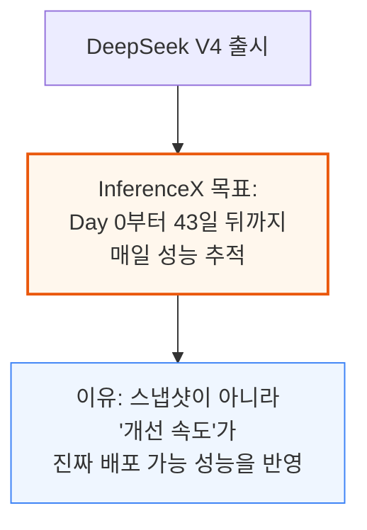
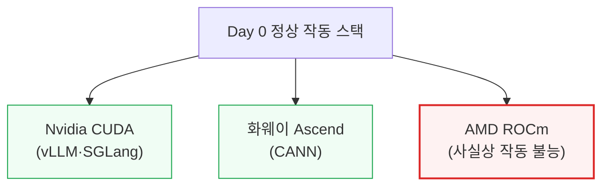
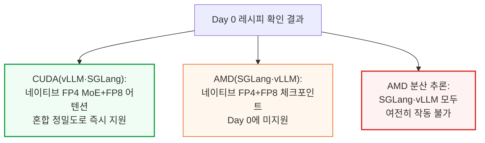
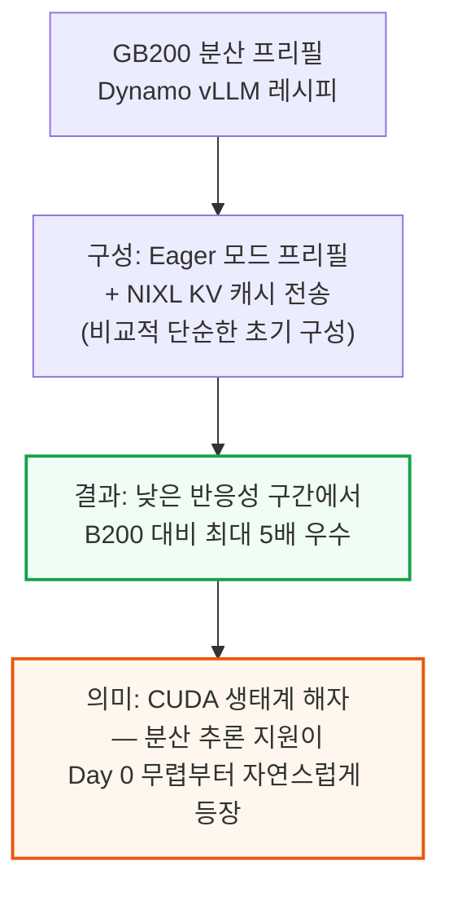
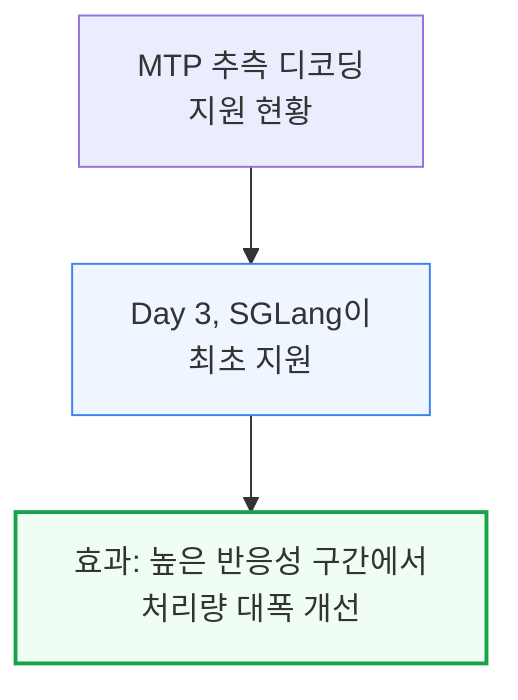
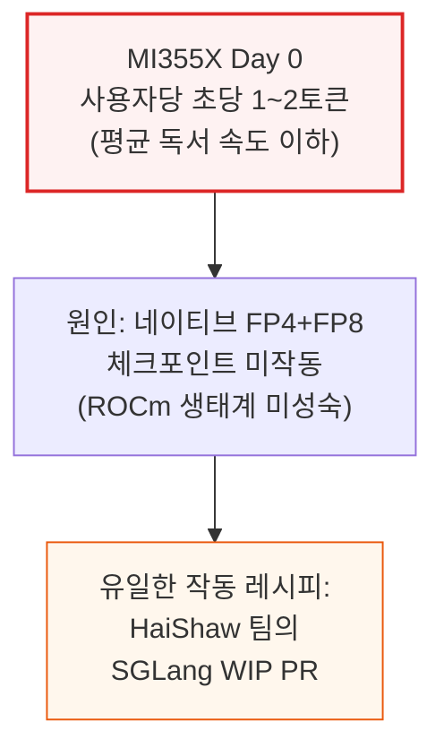
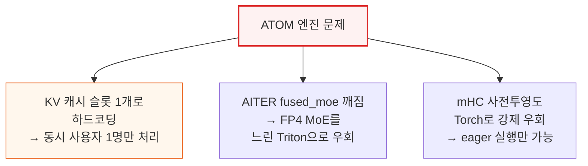
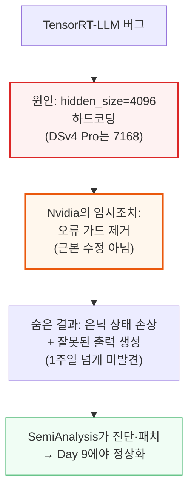
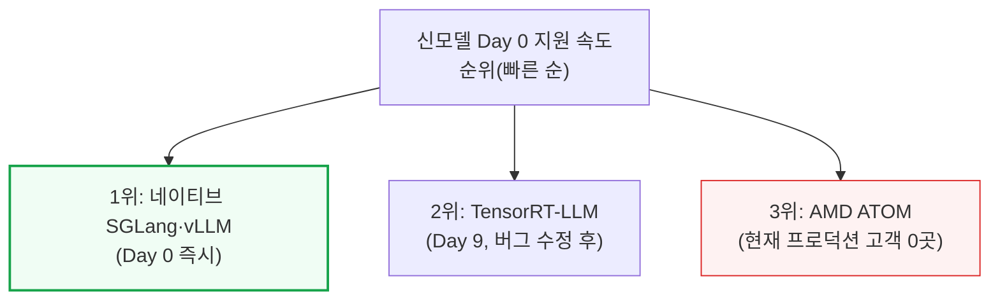

# DeepSeekV4 1.6T Day 0 to Day 43 Performance Over Time - Huawei, GB300 NVL72, MI355X, B200

> **출처**: [SemiAnalysis Newsletter](https://newsletter.semianalysis.com/p/deepseekv4-16t-day-0-to-day-43-performance)
> **저자**: Bryan Shan, Cam Quilici, Kimbo Chen
> **발행일**: 2026-02-05

---

## 📑 목차

### 전체 섹션
 1. [개요: DeepSeek V4와 InferenceX Day 0 추적 프로젝트](#1-개요-deepseek-v4와-inferencex-day-0-추적-프로젝트)
 2. [Day 0 처리량-반응성 곡선 개관 - 엔진별 초기 지원 현황](#2-day-0-처리량-반응성-곡선-개관---엔진별-초기-지원-현황)
 3. [GB200 NVL72 분산 프리필과 MTP 추론 디코딩(Day 0\~3)](#3-gb200-nvl72-분산-프리필과-mtp-추론-디코딩day-03)
 4. [AMD MI355X와 ATOM 엔진의 Day 0 참사](#4-amd-mi355x와-atom-엔진의-day-0-참사)
 5. [NVIDIA TensorRT-LLM 버그와 뒤늦은 Day 0 지원](#5-nvidia-tensorrt-llm-버그와-뒤늦은-day-0-지원)
 6. [43일간의 성능 진화 - MI355X 100배 개선](#6-43일간의-성능-진화---mi355x-100배-개선)
 7. [B300·B200·GB300 NVL72의 성능 진화](#7-b300b200gb300-nvl72의-성능-진화)
 8. [MW당 토큰 처리량 - 전력 효율의 진짜 척도](#8-mw당-토큰-처리량---전력-효율의-진짜-척도)
 9. [2026년 6월 6일 기준 현재 성능과 ROCm vLLM 부진](#9-2026년-6월-6일-기준-현재-성능과-rocm-vllm-부진)
10. [vLLM과 SGLang의 다음 로드맵](#10-vllm과-sglang의-다음-로드맵)
11. [Huawei Ascend 950 - CANN 스택의 Day 0 지원](#11-huawei-ascend-950---cann-스택의-day-0-지원)
12. [DeepSeek V4 아키텍처 딥다이브 - CSA·HCA와 MegaMoE](#12-deepseek-v4-아키텍처-딥다이브---csahca와-megamoe)
13. [GB200 vs H200 비용 비교와 결론](#13-gb200-vs-h200-비용-비교와-결론)

---

## 🔑 용어 정리

본문을 순서대로 읽기 전에 알아두면 좋은 용어들입니다. 자세한 수치와 설명은 본문에서 처음 등장하는 위치에 나옵니다.

- **InferenceX**: SemiAnalysis가 운영하는 오픈소스 추론 성능 추적 프로젝트 — 신모델 출시 직후부터 매일 여러 칩·엔진 조합의 실제 배포 가능 성능을 측정해 공개
- **Day 0**: 모델이 공개된 바로 그날 기록한 최초 성능 스냅샷 — 이후 개선폭을 재는 기준선(베이스라인) 역할
- **MTP (Multi-Token Prediction, 다중 토큰 예측)**: 한 번에 여러 토큰을 미리 예측해 검증만 하는 추측 디코딩 기법 — 메모리 대역폭이 남는 소규모 배치 상황에서 속도를 높임
- **분산 프리필 (Disaggregated Prefill)**: 입력을 처리하는 프리필 단계와 답을 생성하는 디코드 단계를 서로 다른 GPU 그룹에 나눠 맡기는 서빙 구조
- **광역 전문가 병렬화 (Wide Expert Parallelism, WideEP)**: MoE(전문가 혼합) 모델의 여러 전문가를 더 많은 GPU에 넓게 흩어 배치하는 기법 — 랙 안 GPU 수가 많을수록 유리
- **CSA·HCA (Compressed/Heavily Compressed Attention)**: DeepSeek V4가 KV 캐시(대화 기억 저장 공간) 크기를 줄이기 위해 도입한 두 가지 압축 어텐션 방식
- **MegaMoE**: DeepSeek V4가 새로 도입한 융합 MoE 커널 — 통신과 연산을 잘게 쪼개 겹쳐 실행해 통신 대기시간을 최대한 숨김
- **CANN (Compute Architecture for Neural Networks)**: 화웨이가 자사 Ascend 칩용으로 만든 AI 연산 소프트웨어 스택 — 2025년 8월부터 오픈소스로 전환

---

## 1. 개요: DeepSeek V4와 InferenceX Day 0 추적 프로젝트

**📌 핵심:**
- 중국계 오픈모델 DeepSeek V4(1.6조 파라미터 MoE)가 출시되자, SemiAnalysis의 오픈소스 **InferenceX** 팀이 출시 당일(Day 0)부터 43일 뒤까지 매일 성능을 측정 — 스냅샷이 아니라 **시간에 따른 개선 곡선** 자체를 추적하는 것이 목표
- 출시 당일 정상 동작한 스택은 단 2곳뿐: **Nvidia CUDA(vLLM·SGLang)**와 **화웨이 Ascend(CANN)** — AMD ROCm은 사실상 작동 불능 수준이었으나, 이후 43일 만에 AMD 팀이 **100배 이상 성능 개선**을 달성
- CoreWeave가 예비 GB300 NVL72 랙 2대를 긴급 지원해 GB300 결과 측정이 가능해짐 — OpenAI·오라클·마이크로소프트·Weka·PyTorch재단·vLLM·SGLang 등도 InferenceX를 후원
- 결론: 모델 출시 당일 성능만으로 칩·소프트웨어 스택을 평가하면 오판하기 쉬움 — 실제 배포 가능 성능은 출시 후 몇 주간의 엔지니어링 노력에 좌우되며, 이 개선 속도 자체가 각 생태계의 성숙도를 보여주는 핵심 지표

---

DeepSeek V3/R1이 나왔던 작년에는 Day 0에 정상 동작한 스택이 Nvidia CUDA 하나뿐이었습니다. 이번엔 화웨이 CANN까지 Day 0 지원에 성공해 스택이 2곳으로 늘었지만, AMD는 여전히 뒤처졌습니다.

GB200 NVL72로 분산 프리필 재현 실험을 하던 중 SemiAnalysis 자체 GB300 클러스터가 하필 다운됐는데, CoreWeave가 예비 GB300 NVL72 랙 2대를 긴급 지원해 이번 GB300 측정치를 확보할 수 있었습니다. 이 결과는 이후 개선 작업에도 24시간 내내 활용되고 있습니다.

또한 Nvidia의 자체 추론 엔진 TensorRT-LLM은 DeepSeek V4에서 제대로 작동하지 않아, SemiAnalysis가 직접 오픈소스 mHC 커널 실행 코드를 고쳐 패치를 제출했고, Nvidia 엔지니어들이 이를 리베이스·병합해줬습니다. 반면 ROCm은 초기 며칠간 거의 작동하지 않았으나, HaiShaw가 이끄는 AMD SGLang 엔지니어링 팀이 첫 한 달 만에 100배 이상 성능을 끌어올렸습니다 — 이 과정은 곧 발행될 별도의 "State of AMD 2026" 종합 리포트에서 더 자세히 다룰 예정입니다.

---

## 2. Day 0 처리량-반응성 곡선 개관 - 엔진별 초기 지원 현황

**📌 핵심:**
- **처리량-반응성 곡선**은 "초당 처리하는 전체 토큰 수(처리량)"와 "사용자 한 명이 체감하는 초당 토큰 수(반응성)" 사이의 트레이드오프를 보여주는 기준 그래프 — 동시 처리 요청 수(concurrency)를 늘리면 처리량은 오르지만 반응성은 떨어짐
- Nvidia CUDA에서는 **SGLang·vLLM 모두 모델 공개 즉시 네이티브 지원**을 완료 — 특히 B200·B300 같은 신형 칩은 별다른 문제 없이 공개된 레시피 그대로 작동
- 반면 **AMD SGLang·vLLM의 분산 추론은 여전히 작동하지 않음** — MI355X는 네이티브 FP4+FP8 체크포인트도 Day 0에 못 써서 성능이 떨어지는 완전 FP8 체크포인트로 대체해야 했음(H200도 동일 사례)
- 결론: 같은 "Day 0 지원"이라도 실제로는 편차가 커서, 정상 동작 여부만이 아니라 어떤 정밀도·체크포인트로 작동했는지까지 함께 봐야 진짜 성능을 알 수 있음

---

이 기사에서는 같은 하드웨어 SKU에 대해 vLLM과 SGLang 결과를 한 그래프에 같이 넣지 않습니다 — 두 오픈소스 엔진 커뮤니티 간의 소모적인 비교 논쟁(과거 한 차례 SNS에서 벌어진 설전)을 다시 촉발하지 않기 위한 조치입니다.

MI355X의 경우 네이티브 FP4+FP8 체크포인트가 Day 0에 사용 불가능했기 때문에, 상대적으로 성능이 떨어지는 완전 FP8 방식(non-native checkpoint)만 쓸 수 있었습니다 — 이는 이후 6\~7장에서 다룰 43일간의 극적인 개선폭을 이해하는 출발점이 됩니다.

---

## 3. GB200 NVL72 분산 프리필과 MTP 추론 디코딩(Day 0\~3)

**📌 핵심:**
- vLLM과 Nvidia는 **GB200 분산 추론(Dynamo vLLM) 레시피를 Day 0에 즉시 배포** — Eager 모드 프리필 + NIXL 기반 KV 캐시 전송이라는 비교적 단순한 초기 구성으로도, 낮은 반응성 구간에서 B200 대비 **최대 5배 우수한 결과**를 재현
- 이는 **CUDA 생태계 해자(moat)**를 보여주는 사례 — 최신 오픈모델이 나오면 분산 추론 지원이 Day 0 무렵부터 자연스럽게 따라붙음
- **MTP(다중 토큰 예측) 추측 디코딩**은 SGLang이 Day 3에 최초 지원 — 높은 반응성 구간에서 처리량을 크게 끌어올림
- 결론: CUDA 생태계는 신모델 공개 직후 며칠 안에 분산 추론·추측 디코딩 같은 고급 최적화 기법까지 따라붙는 반면, 다른 스택은 이 속도를 아직 따라가지 못함

---

---

## 4. AMD MI355X와 ATOM 엔진의 Day 0 참사

**📌 핵심:**
- MI355X의 Day 0 결과는 **사용자당 초당 1\~2 토큰**에 불과 — 일반적인 사람의 평균 독서 속도보다도 느려 사실상 사용 불가능한 수준
- 유일하게 작동한 레시피는 AMD HaiShaw 팀이 만든 SGLang PR 기반 미완성(WIP) 버전 — 네이티브 FP4+FP8 체크포인트가 작동하지 않아 ROCm 생태계 미성숙이 원인으로 지목됨
- AMD 자체 추론 엔진 **ATOM**은 코드에 KV 캐시 슬롯이 **1개로 하드코딩**돼 있어 동시에 사용자 1명만 처리 가능(배칭 기능 자체가 미비) — AITER의 `fused_moe`가 GFX950에서 깨져 FP4 MoE를 느린 Triton 경로로 강제 우회, mHC 사전 투영도 Torch로 강제 우회되며 즉시 실행(eager execution)만 가능
- 결론: MI355X 하드웨어 자체는 동작했지만, 소프트웨어 스택(ROCm·ATOM)이 여러 겹으로 미성숙해 Day 0엔 사실상 데모 수준에 그침 — 이후 6장에서 다룰 100배 개선의 출발선이 바로 이 지점

---

ATOM은 반응성 지표에서는 다소 나았지만, 동시 처리 1건을 넘어서면 성능이 급격히 떨어졌습니다. `kv_cache[:1,...]`로 하드코딩된 부분 때문에 KV 캐시가 단일 시퀀스 슬롯에 고정돼, 두 번째 동시 요청이 들어와도 저장할 공간 자체가 없었습니다. 이는 배칭(여러 요청을 묶어 처리)을 가능하게 하는 인프라가 아직 갖춰지지 않았기 때문으로, 배치 크기 1(사용자 1명)만 실행할 수 있었습니다.

---

## 5. NVIDIA TensorRT-LLM 버그와 뒤늦은 Day 0 지원

**📌 핵심:**
- Nvidia 자체 추론 엔진 **TensorRT-LLM은 Day 0에 DeepSeek V4를 지원하지 못함** — 코드에 은닉 크기(hidden size)가 **4096으로 하드코딩**돼 있었는데, DeepSeek V4 Pro는 은닉 크기가 **7168**이라 가드 오류(`hidden_size=7168 not supported`)가 발생
- Nvidia 엔지니어들이 이 오류를 해결하는 대신 **가드 자체를 제거**하는 임시방편을 적용 — 그 결과 오류는 사라졌지만, 실제로는 7168 텐서가 4096으로 고정된 커널에 잘못 들어가면서 **은닉 상태가 손상되고 잘못된 출력이 생성**되는 숨은 문제가 1주일 넘게 방치됨
- SemiAnalysis가 직접 문제를 진단해 PR을 제출·병합했지만, 이 문제를 진단해 고치기까지 걸린 시간만 이미 **Day 9**에 도달 — 반면 네이티브 SGLang·vLLM은 모델 공개 당일 정상 작동
- 결론: 이 사례는 CUDA 생태계 안에서도 네이티브 오픈소스 엔진(SGLang·vLLM)이 Nvidia 자체 상용 엔진(TensorRT-LLM)이나 AMD ATOM보다 신모델 지원 속도가 훨씬 빠르다는 것을 보여줌 — ATOM은 현재 실제 프로덕션 고객이 0곳

---

이 문제를 정확히 짚어내기까지 걸린 시간을 보면, 은닉 크기 불일치라는 비교적 단순한 문제가 발견되는 데 1주일, PR이 승인되는 데 다시 며칠이 더 걸렸다는 점이 다소 의외입니다. 현재 그래프를 보면 배치 크기가 큰 구간에서는 TRT-LLM 성능이 더 우수하지만, 반응성이 높은 구간(사용자 체감 속도가 중요한 구간)에서는 뒤처지는 경향을 보입니다.

---

*작성 진행률: 약 40% 완료*
*업데이트: 1\~5장(개요, Day 0 처리량-반응성 곡선, GB200 분산 프리필·MTP, AMD MI355X·ATOM 참사, TensorRT-LLM 버그) 작성 완료*
