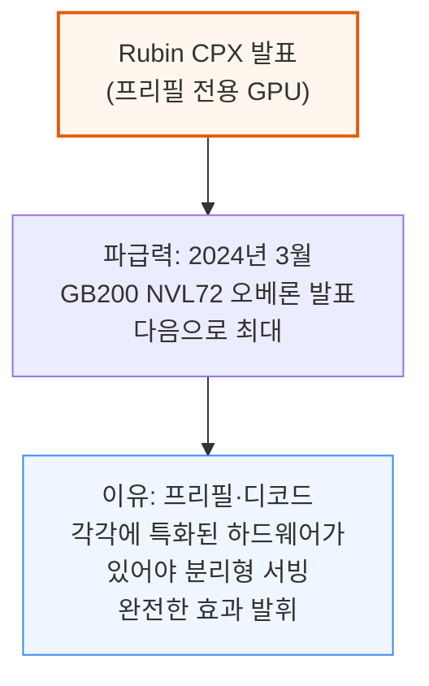
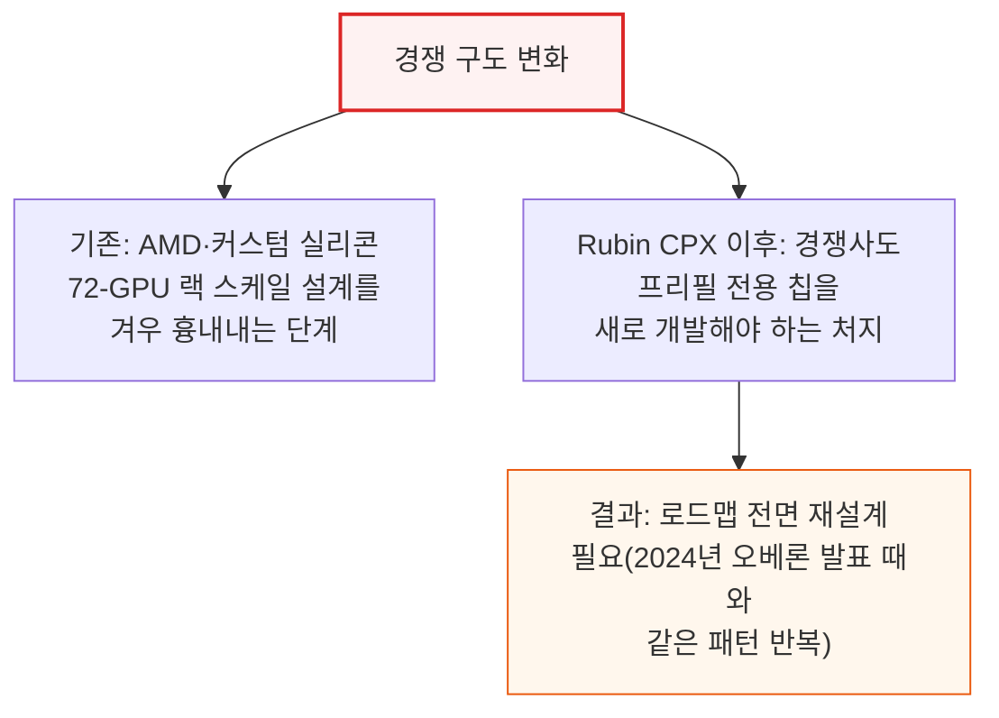
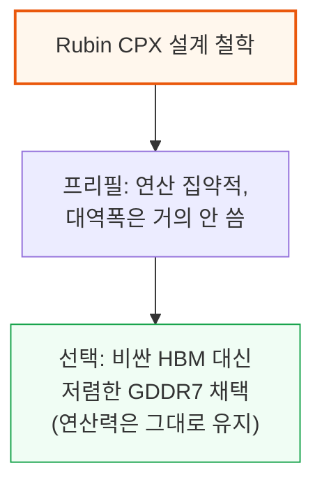
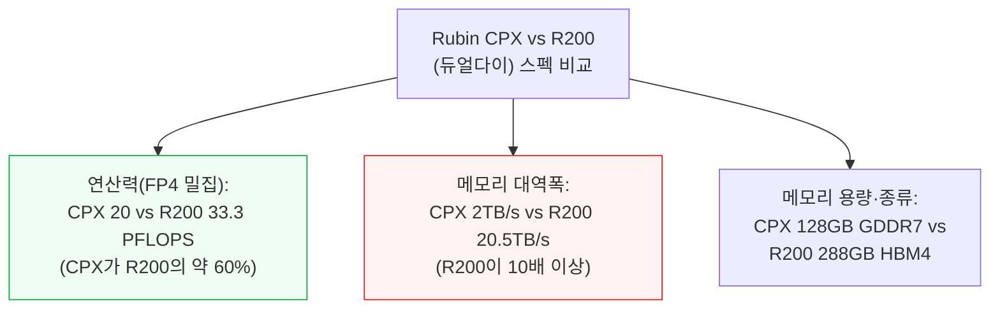
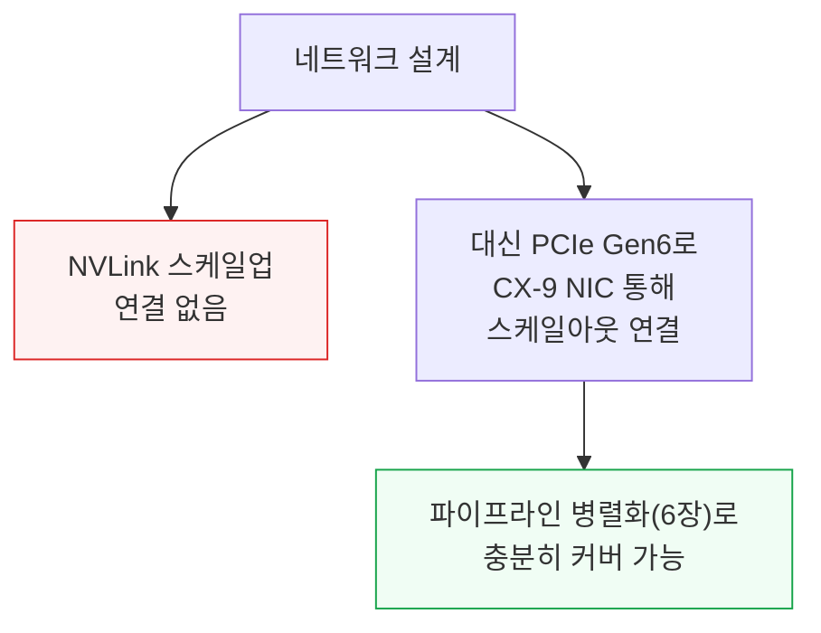
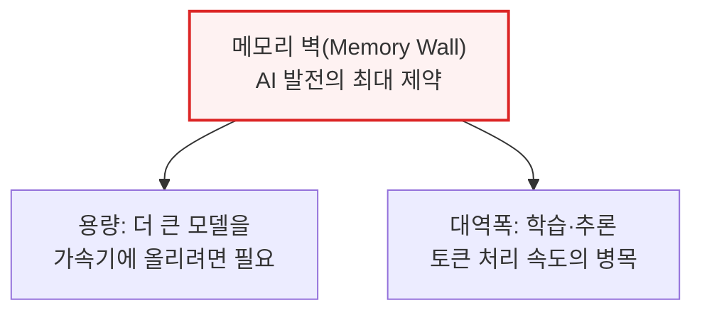
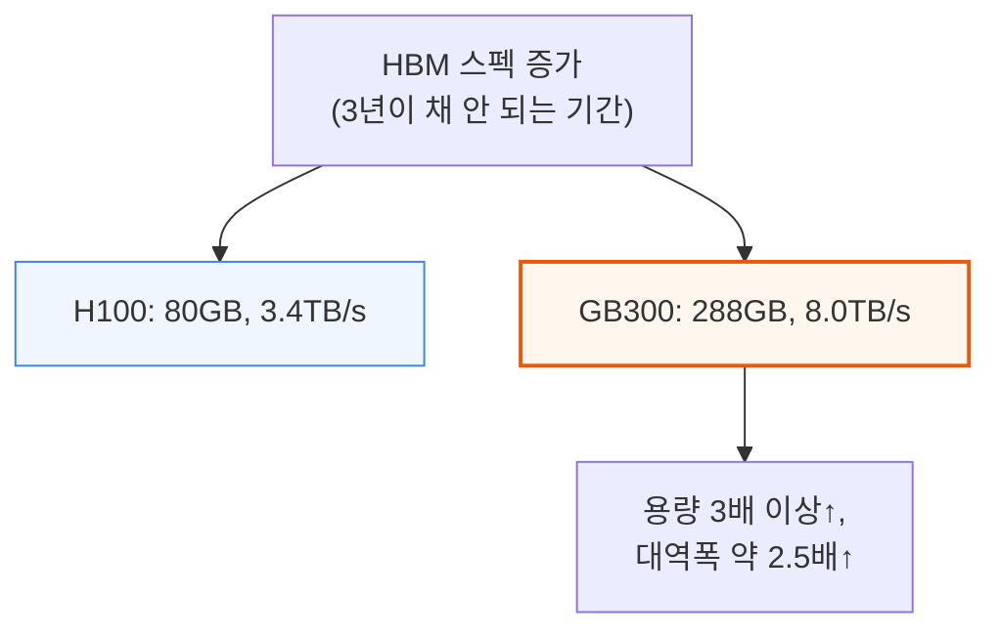
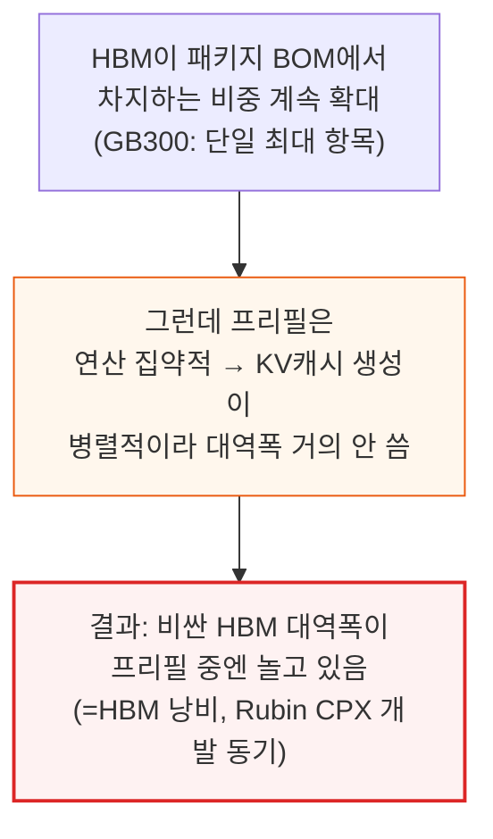

# Another Giant Leap: The Rubin CPX Specialized Accelerator & Rack

> **출처**: [SemiAnalysis Newsletter](https://newsletter.semianalysis.com/p/another-giant-leap-the-rubin-cpx-specialized-accelerator-rack)
> **저자**: Dylan Patel, Daniel Nishball, Kimbo Chen
> **발행일**: 2026-02-05

---

## 📑 목차

### 전체 섹션
 1. [개요: Rubin CPX 발표의 의미](#1-개요-rubin-cpx-발표의-의미)
 2. [Rubin CPX 칩 - 프리필 전용 가속기 설계](#2-rubin-cpx-칩---프리필-전용-가속기-설계)
 3. [메모리 이야기 - HBM 벽에 부딪히다](#3-메모리-이야기---hbm-벽에-부딪히다)
 4. [대역폭과 연산력 격차 - R200 vs Rubin CPX](#4-대역폭과-연산력-격차---r200-vs-rubin-cpx)
 5. [새로운 랙 아키텍처 - VR NVL144, VR NVL144 CPX, VR CPX 듀얼랙](#5-새로운-랙-아키텍처---vr-nvl144-vr-nvl144-cpx-vr-cpx-듀얼랙)
 6. [거대한 도약 - 분리형 서빙(Disaggregated Serving)의 진화](#6-거대한-도약---분리형-서빙disaggregated-serving의-진화)
 7. [하드웨어 특화 분리형 서빙의 한계](#7-하드웨어-특화-분리형-서빙의-한계)
 8. [경쟁 구도 변화 - Google TPU, AWS, Meta, AMD](#8-경쟁-구도-변화---google-tpu-aws-meta-amd)
 9. [Nvidia의 다음 수 - 디코드 전용 칩 가능성](#9-nvidia의-다음-수---디코드-전용-칩-가능성)
10. [부품 명세서(BOM)와 총소유비용(TCO)](#10-부품-명세서bom와-총소유비용tco)

---

## 🔑 용어 정리

본문을 순서대로 읽기 전에 알아두면 좋은 용어들입니다. 자세한 수치와 설명은 본문에서 처음 등장하는 위치에 나옵니다.

- **프리필(Prefill)·디코드(Decode)**: LLM이 답변을 생성하는 두 단계 — 프리필은 사용자 입력 전체를 한꺼번에 처리해 첫 토큰을 만드는 연산 집약적 단계, 디코드는 토큰을 하나씩 순차 생성하며 이전 토큰 기록(KV캐시)을 계속 불러오는 메모리 집약적 단계
- **분리형 서빙(Disaggregated Serving)**: 프리필과 디코드를 같은 칩에서 번갈아 처리하지 않고, 서로 다른 연산 유닛(또는 서로 다른 칩)에 나눠 맡기는 서빙 방식 — 두 단계의 자원 요구가 정반대라 섞어 쓰면 서로 성능을 갉아먹기 때문
- **HBM vs GDDR7**: 둘 다 D램이지만 HBM은 칩 옆에 쌓아 올려 대역폭을 극대화한 고가 메모리, GDDR7은 기존 방식대로 기판에 배치하는 상대적으로 저렴한 메모리 — Rubin CPX는 대역폭이 덜 중요한 프리필용이라 GDDR7을 채택
- **BOM(부품 명세서, Bill of Materials)**: 시스템 하나를 만드는 데 들어가는 모든 부품과 그 원가를 나열한 목록
- **TCO(총소유비용, Total Cost of Ownership)**: 장비 구매 비용뿐 아니라 운영·전력·유지보수까지 포함한 전체 비용
- **파이프라인 병렬화(PP)·전문가 병렬화(EP)**: 모델을 여러 칩에 나눠 돌리는 두 방식 — PP는 모델을 층(layer) 단위로 쪼개 칩마다 순서대로 넘기는 방식(통신 단순), EP는 전문가(Expert) 모듈별로 쪼개 모든 칩이 서로 주고받는 방식(통신 복잡)
- **NVLink vs PCIe**: 둘 다 칩 간 연결 규격이지만 NVLink는 Nvidia 전용 초고속 스케일업(같은 랙 내부) 연결, PCIe는 범용 저속 연결 — Rubin CPX는 NVLink 없이 PCIe만으로 충분하도록 설계됨

---

## 1. 개요: Rubin CPX 발표의 의미

**📌 핵심:**
- Nvidia는 추론의 프리필(입력 처리) 단계에만 최적화된 신규 GPU **Rubin CPX**를 발표 — 메모리 대역폭보다 연산력(FLOPS)에 극단적으로 치우친 설계
- 이 발표의 파급력은 2024년 3월 GB200 NVL72 오베론 랙 발표 이후 최대 — 프리필·디코드 두 단계에 각각 특화된 하드웨어가 갖춰져야 분리형 서빙이 완전한 효과를 낼 수 있기 때문
- AMD·커스텀 실리콘 진영은 이제 막 Nvidia의 72-GPU 랙 스케일 설계를 흉내 내는 데 성공했는데, Nvidia가 프리필 전용 칩이라는 새로운 축으로 또 한 번 도약하면서 격차가 협곡 수준으로 벌어짐
- 결론: 경쟁사들은 이제 프리필 전용 칩까지 새로 개발해야 하는 처지에 놓여, 2024년 오베론 발표가 업계 로드맵을 뒤흔든 것과 같은 패턴이 반복됨

---

이 리포트는 먼저 프리필과 디코드 단계에서 메모리 역할이 왜 다른지부터 살펴본 뒤, Rubin CPX 칩과 이를 탑재하는 랙 아키텍처를 상세히 다룹니다. 이어서 분리형 서빙이 경쟁사(범용 가속기·커스텀 실리콘 진영) 로드맵에 미치는 영향을 짚고, 마지막으로 두 랙의 부품 명세서(BOM)와 전력 예산을 정리합니다.

---

## 2. Rubin CPX 칩 - 프리필 전용 가속기 설계

**📌 핵심:**
- 프리필 단계는 연산(FLOPS)은 많이 쓰지만 메모리 대역폭은 거의 안 씀 — 비싼 고대역폭 HBM을 얹은 칩으로 프리필을 돌리는 건 낭비이므로, Nvidia는 대역폭은 줄이고 연산력은 살린 전용 칩 **Rubin CPX**를 만듦
- Rubin CPX는 FP4 기준 연산력 20PFLOPS(밀집)를 내면서 메모리는 GDDR7 128GB·대역폭 2TB/s에 그침 — 같은 세대의 범용 칩 R200(듀얼다이)은 연산력 33.3PFLOPS(밀집)에 HBM4 288GB·대역폭 20.5TB/s로, 대역폭이 Rubin CPX의 10배
- 전력은 칩 자체가 약 800W(GDDR7 모듈 포함 시 880W)로 제한돼 있어, 이론상 최대 연산력을 실전에서 꾸준히 내기는 어려움 — 전력밀도가 1W/mm²를 넘기 힘든 샌드위치형 실장 구조이기 때문
- 결론: NVLink 없이 PCIe Gen6 + CX-9 NIC로만 다른 GPU와 통신 — 프리필은 파이프라인 병렬화로 처리 가능해 저속 네트워크로도 충분(6장에서 상세)

---

Rubin CPX는 단일 다이 모놀리식 SoC로, 첨단 패키징(CoWoS) 없이 일반적인 플립칩 BGA 패키지를 씁니다. 이 설계는 차세대 RTX 5090·RTX PRO 6000 Blackwell(둘 다 대형 모놀리식 다이+512비트 GDDR7 인터페이스)과 닮았습니다.

다만 소비자용 칩은 HBM 탑재 플래그십(B200) 대비 연산력 20%에 그치는 반면, Rubin CPX는 R200 대비 60%에 달합니다 — 소비자용 다이를 재활용하지 않고 R200 연산 다이에 더 가까운 별도 테이프아웃을 만들었기 때문입니다.

**📌 용어 풀이: 왜 전력밀도가 발목을 잡는가**
> - 전력밀도(1mm²당 소비 전력)가 높을수록 칩이 뜨거워져 냉각이 어려워지고, 결국 클럭(속도)을 낮춰야 함
> - Rubin CPX는 TDP 약 800W(모듈 전체 880W)로 제한되고, 기판이 샌드위치 형태로 조밀하게 실장돼 1W/mm²를 넘기기 어려움 — 그 결과 발표된 이론상 최대 FLOPS를 실전에서 꾸준히 내기는 쉽지 않음

---

## 3. 메모리 이야기 - HBM 벽에 부딪히다

**📌 핵심:**
- 메모리는 AI 발전의 가장 큰 제약("메모리 벽") — 용량은 더 큰 모델을 가속기에 올리기 위해, 대역폭은 학습·추론 토큰 처리 속도를 위해 계속 커져야 했음
- 3년이 채 안 되는 기간에 HBM 용량은 H100의 80GB에서 GB300의 288GB로 3배 이상, 대역폭은 3.4TB/s에서 8.0TB/s로 약 2.5배 증가
- HBM이 가속기 패키지 원가(BOM)에서 차지하는 비중은 세대를 거듭할수록 커져, GB300 기준으로는 패키지 BOM 내 단일 항목 중 가장 비쌈 — 그런데 프리필 단계는 연산 집약적이라 KV캐시 생성이 병렬적으로 이뤄져 대역폭을 거의 안 씀
- 결론: 비싼 HBM 대역폭이 프리필 중엔 놀고 있다는 뜻 — 이 "낭비"가 갈수록 커지는 게 Rubin CPX 개발의 직접적 동기

---

---

*작성 진행률: 약 30% 완료*
*업데이트: 헤더·목차·용어 정리, 1\~3장(개요, Rubin CPX 칩 설계, 메모리 이야기) 작성 완료*
