# Another Giant Leap: The Rubin CPX Specialized Accelerator & Rack

> **출처**: [SemiAnalysis Newsletter](https://newsletter.semianalysis.com/p/another-giant-leap-the-rubin-cpx-specialized-accelerator-rack)
> **저자**: Dylan Patel, Daniel Nishball, Kimbo Chen
> **발행일**: 2026-02-05

---

## 📑 목차

### 전체 섹션
 1. [개요: Rubin CPX 발표의 의미](#1-개요-rubin-cpx-발표의-의미)
 2. [Rubin CPX 칩 - 프리필 전용 가속기 설계](#2-rubin-cpx-칩---프리필-전용-가속기-설계)
 3. [메모리 이야기 - HBM 벽에 부딪히다](#3-메모리-이야기---hbm-벽에-부딪히다)
 4. [대역폭과 연산력 격차 - R200 vs Rubin CPX](#4-대역폭과-연산력-격차---r200-vs-rubin-cpx)
 5. [새로운 랙 아키텍처 - VR NVL144, VR NVL144 CPX, VR CPX 듀얼랙](#5-새로운-랙-아키텍처---vr-nvl144-vr-nvl144-cpx-vr-cpx-듀얼랙)
 6. [거대한 도약 - 분리형 서빙(Disaggregated Serving)의 진화](#6-거대한-도약---분리형-서빙disaggregated-serving의-진화)
 7. [하드웨어 특화 분리형 서빙의 한계](#7-하드웨어-특화-분리형-서빙의-한계)
 8. [경쟁 구도 변화 - Google TPU, AWS, Meta, AMD](#8-경쟁-구도-변화---google-tpu-aws-meta-amd)
 9. [Nvidia의 다음 수 - 디코드 전용 칩 가능성](#9-nvidia의-다음-수---디코드-전용-칩-가능성)
10. [부품 명세서(BOM)와 총소유비용(TCO)](#10-부품-명세서bom와-총소유비용tco)

---

## 🔑 용어 정리

본문을 순서대로 읽기 전에 알아두면 좋은 용어들입니다. 자세한 수치와 설명은 본문에서 처음 등장하는 위치에 나옵니다.

- **프리필(Prefill)·디코드(Decode)**: LLM이 답변을 생성하는 두 단계 — 프리필은 사용자 입력 전체를 한꺼번에 처리해 첫 토큰을 만드는 연산 집약적 단계, 디코드는 토큰을 하나씩 순차 생성하며 이전 토큰 기록(KV캐시)을 계속 불러오는 메모리 집약적 단계
- **분리형 서빙(Disaggregated Serving)**: 프리필과 디코드를 같은 칩에서 번갈아 처리하지 않고, 서로 다른 연산 유닛(또는 서로 다른 칩)에 나눠 맡기는 서빙 방식 — 두 단계의 자원 요구가 정반대라 섞어 쓰면 서로 성능을 갉아먹기 때문
- **HBM vs GDDR7**: 둘 다 D램이지만 HBM은 칩 옆에 쌓아 올려 대역폭을 극대화한 고가 메모리, GDDR7은 기존 방식대로 기판에 배치하는 상대적으로 저렴한 메모리 — Rubin CPX는 대역폭이 덜 중요한 프리필용이라 GDDR7을 채택
- **BOM(부품 명세서, Bill of Materials)**: 시스템 하나를 만드는 데 들어가는 모든 부품과 그 원가를 나열한 목록
- **TCO(총소유비용, Total Cost of Ownership)**: 장비 구매 비용뿐 아니라 운영·전력·유지보수까지 포함한 전체 비용
- **파이프라인 병렬화(PP)·전문가 병렬화(EP)**: 모델을 여러 칩에 나눠 돌리는 두 방식 — PP는 모델을 층(layer) 단위로 쪼개 칩마다 순서대로 넘기는 방식(통신 단순), EP는 전문가(Expert) 모듈별로 쪼개 모든 칩이 서로 주고받는 방식(통신 복잡)
- **NVLink vs PCIe**: 둘 다 칩 간 연결 규격이지만 NVLink는 Nvidia 전용 초고속 스케일업(같은 랙 내부) 연결, PCIe는 범용 저속 연결 — Rubin CPX는 NVLink 없이 PCIe만으로 충분하도록 설계됨

---

## 1. 개요: Rubin CPX 발표의 의미

**📌 핵심:**
- Nvidia는 추론의 프리필(입력 처리) 단계에만 최적화된 신규 GPU **Rubin CPX**를 발표 — 메모리 대역폭보다 연산력(FLOPS)에 극단적으로 치우친 설계
- 이 발표의 파급력은 2024년 3월 GB200 NVL72 오베론 랙 발표 이후 최대 — 프리필·디코드 두 단계에 각각 특화된 하드웨어가 갖춰져야 분리형 서빙이 완전한 효과를 낼 수 있기 때문
- AMD·커스텀 실리콘 진영은 이제 막 Nvidia의 72-GPU 랙 스케일 설계를 흉내 내는 데 성공했는데, Nvidia가 프리필 전용 칩이라는 새로운 축으로 또 한 번 도약하면서 격차가 협곡 수준으로 벌어짐
- 결론: 경쟁사들은 이제 프리필 전용 칩까지 새로 개발해야 하는 처지에 놓여, 2024년 오베론 발표가 업계 로드맵을 뒤흔든 것과 같은 패턴이 반복됨

---

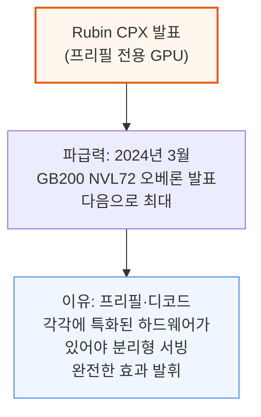

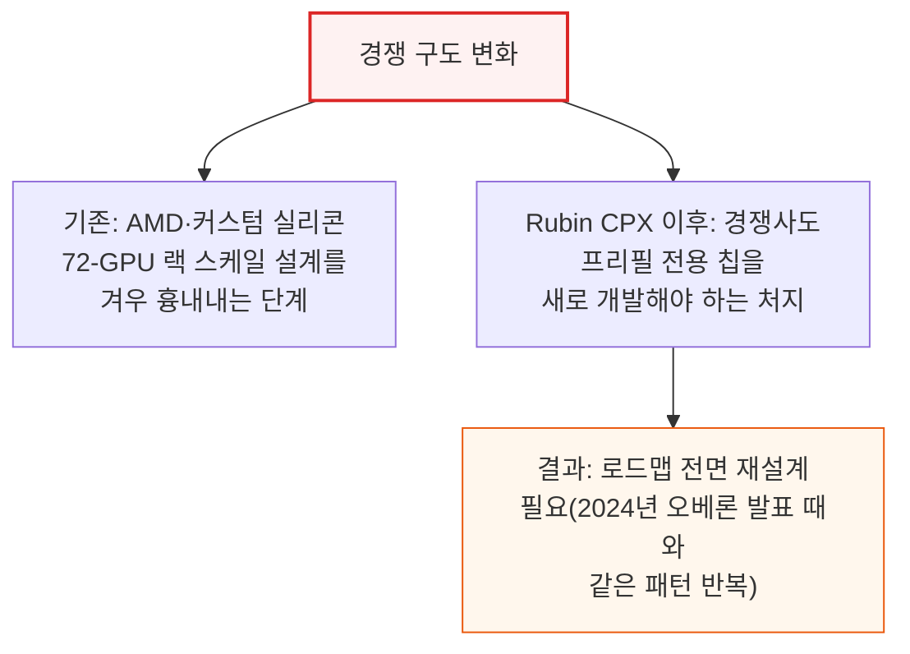

이 리포트는 먼저 프리필과 디코드 단계에서 메모리 역할이 왜 다른지부터 살펴본 뒤, Rubin CPX 칩과 이를 탑재하는 랙 아키텍처를 상세히 다룹니다. 이어서 분리형 서빙이 경쟁사(범용 가속기·커스텀 실리콘 진영) 로드맵에 미치는 영향을 짚고, 마지막으로 두 랙의 부품 명세서(BOM)와 전력 예산을 정리합니다.

---

## 2. Rubin CPX 칩 - 프리필 전용 가속기 설계

**📌 핵심:**
- 프리필 단계는 연산(FLOPS)은 많이 쓰지만 메모리 대역폭은 거의 안 씀 — 비싼 고대역폭 HBM을 얹은 칩으로 프리필을 돌리는 건 낭비이므로, Nvidia는 대역폭은 줄이고 연산력은 살린 전용 칩 **Rubin CPX**를 만듦
- Rubin CPX는 FP4 기준 연산력 20PFLOPS(밀집)를 내면서 메모리는 GDDR7 128GB·대역폭 2TB/s에 그침 — 같은 세대의 범용 칩 R200(듀얼다이)은 연산력 33.3PFLOPS(밀집)에 HBM4 288GB·대역폭 20.5TB/s로, 대역폭이 Rubin CPX의 10배
- 전력은 칩 자체가 약 800W(GDDR7 모듈 포함 시 880W)로 제한돼 있어, 이론상 최대 연산력을 실전에서 꾸준히 내기는 어려움 — 전력밀도가 1W/mm²를 넘기 힘든 샌드위치형 실장 구조이기 때문
- 결론: NVLink 없이 PCIe Gen6 + CX-9 NIC로만 다른 GPU와 통신 — 프리필은 파이프라인 병렬화로 처리 가능해 저속 네트워크로도 충분(6장에서 상세)

---

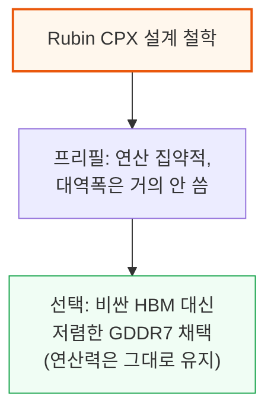

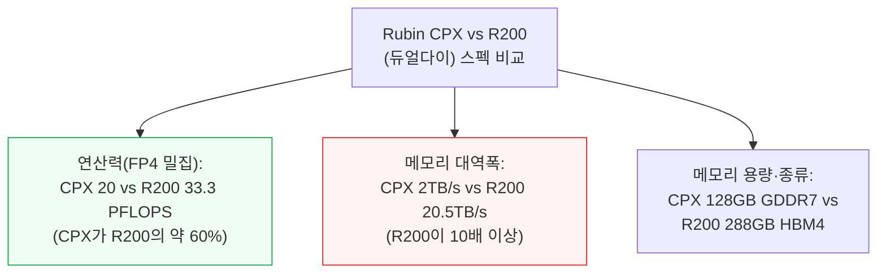

Rubin CPX는 단일 다이 모놀리식 SoC로, 첨단 패키징(CoWoS) 없이 일반적인 플립칩 BGA 패키지를 씁니다. 이 설계는 차세대 RTX 5090·RTX PRO 6000 Blackwell(둘 다 대형 모놀리식 다이+512비트 GDDR7 인터페이스)과 닮았습니다.

다만 소비자용 칩은 HBM 탑재 플래그십(B200) 대비 연산력 20%에 그치는 반면, Rubin CPX는 R200 대비 60%에 달합니다 — 소비자용 다이를 재활용하지 않고 R200 연산 다이에 더 가까운 별도 테이프아웃을 만들었기 때문입니다.

**📌 용어 풀이: 왜 전력밀도가 발목을 잡는가**
> - 전력밀도(1mm²당 소비 전력)가 높을수록 칩이 뜨거워져 냉각이 어려워지고, 결국 클럭(속도)을 낮춰야 함
> - Rubin CPX는 TDP 약 800W(모듈 전체 880W)로 제한되고, 기판이 샌드위치 형태로 조밀하게 실장돼 1W/mm²를 넘기기 어려움 — 그 결과 발표된 이론상 최대 FLOPS를 실전에서 꾸준히 내기는 쉽지 않음

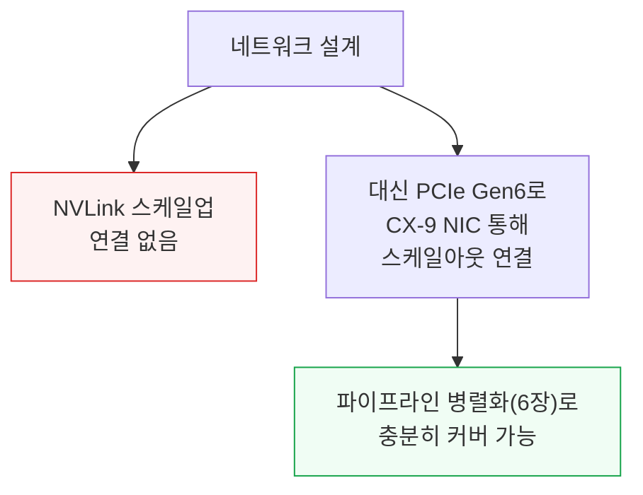

---

## 3. 메모리 이야기 - HBM 벽에 부딪히다

**📌 핵심:**
- 메모리는 AI 발전의 가장 큰 제약("메모리 벽") — 용량은 더 큰 모델을 가속기에 올리기 위해, 대역폭은 학습·추론 토큰 처리 속도를 위해 계속 커져야 했음
- 3년이 채 안 되는 기간에 HBM 용량은 H100의 80GB에서 GB300의 288GB로 3배 이상, 대역폭은 3.4TB/s에서 8.0TB/s로 약 2.5배 증가
- HBM이 가속기 패키지 원가(BOM)에서 차지하는 비중은 세대를 거듭할수록 커져, GB300 기준으로는 패키지 BOM 내 단일 항목 중 가장 비쌈 — 그런데 프리필 단계는 연산 집약적이라 KV캐시 생성이 병렬적으로 이뤄져 대역폭을 거의 안 씀
- 결론: 비싼 HBM 대역폭이 프리필 중엔 놀고 있다는 뜻 — 이 "낭비"가 갈수록 커지는 게 Rubin CPX 개발의 직접적 동기

---

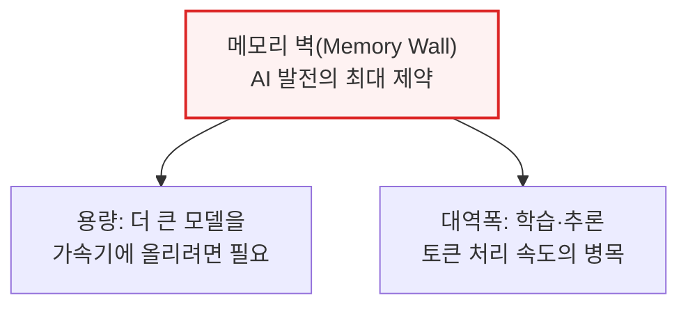

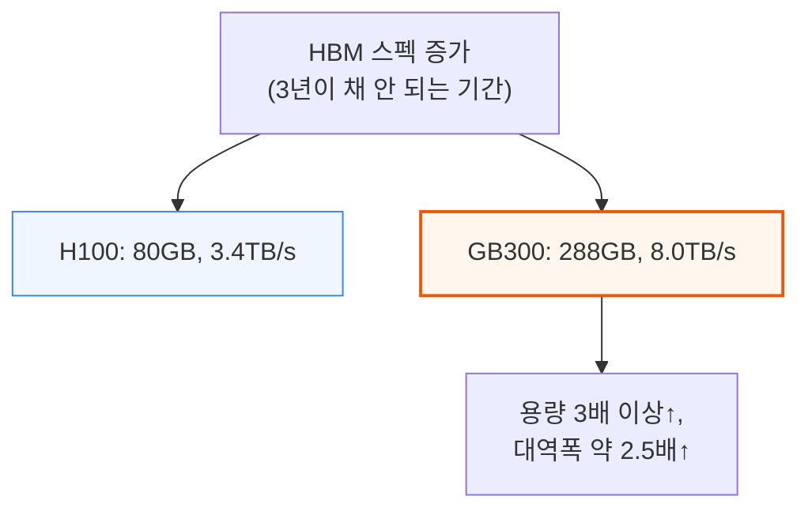

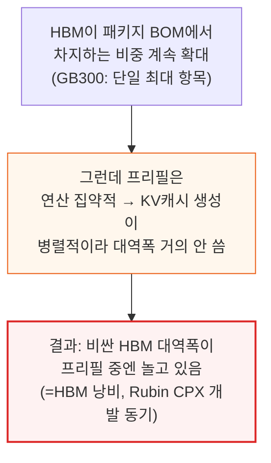

---

## 4. 대역폭과 연산력 격차 - R200 vs Rubin CPX

**📌 핵심:**
- Rubin CPX 메모리는 32Gbps 속도·512비트 버스로 동작해 칩당 대역폭 2TB/s를 냄 — 이번 발표에서 R200(범용 칩)의 HBM4도 함께 대폭 상향돼, 애초 공개했던 6.4Gbps·13TB/s에서 10Gbps·20.5TB/s로 상승
- 랙 하나(VR NVL144 CPX)에 CPX 144개(각 2TB/s)와 R200 72개(각 20.5TB/s)를 합치면 시스템 전체 메모리 대역폭은 1.7PB/s에 달함
- 연산력은 CPX가 FP4 기준 희소 30PFLOPS(밀집 20PFLOPS), R200이 희소 50PFLOPS(밀집 33.3PFLOPS) — 두 칩 모두 같은 3:2 희소:밀집 비율을 쓰는데, Rubin CPX가 R200과 유사한 텐서 코어 아키텍처를 물려받았기 때문
- 결론: 메모리 규모를 줄이고 GDDR7로 전환한 덕에 메모리 원가는 GB당 50% 이상 절감 — 총 생산원가 절감 효과는 10장(BOM)에서 상세히 다룸

---

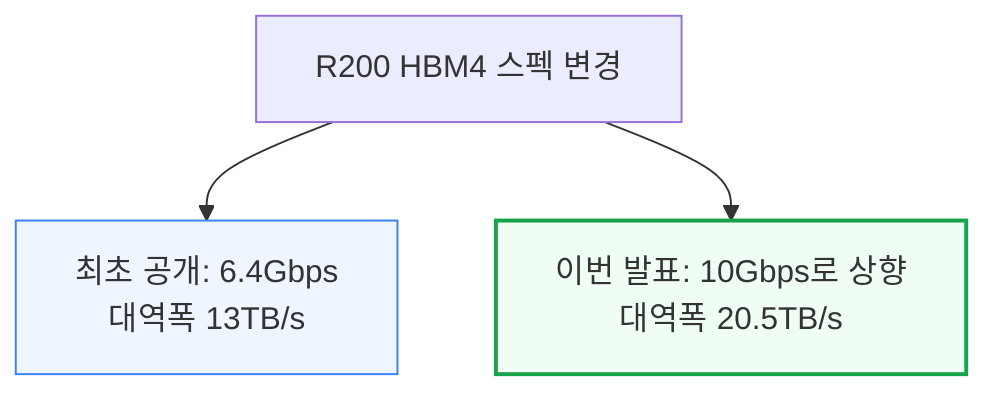

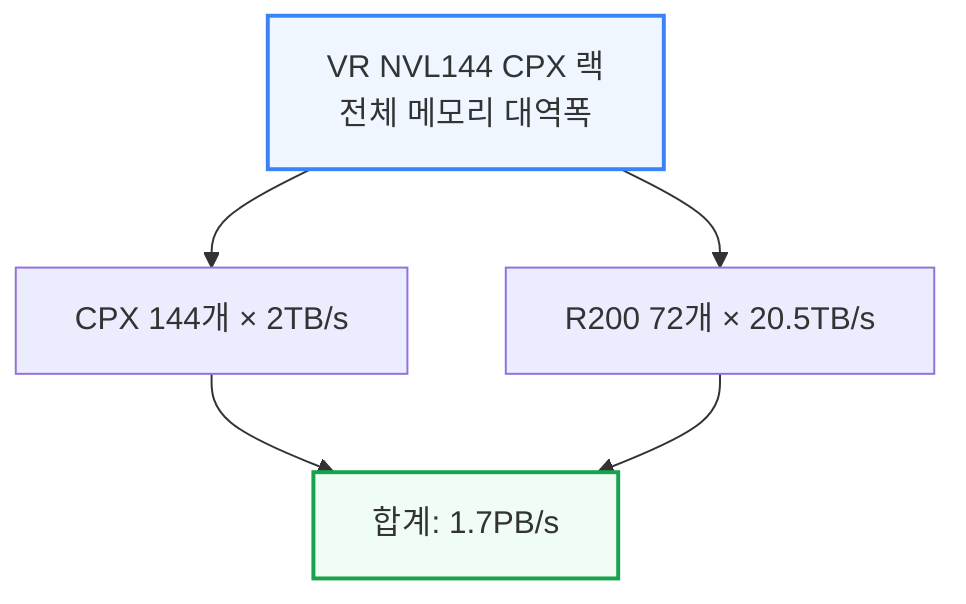

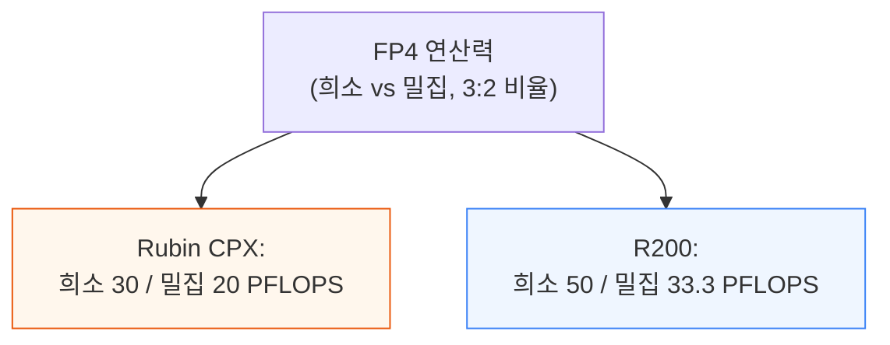

GDDR7로 전환하면서 메모리 원가는 GB당 50% 이상 낮아졌습니다. 이는 메모리 용량 자체를 줄인 효과와는 별개로, 같은 용량이라도 GDDR7이 HBM보다 원래 저렴하기 때문입니다.

---

## 5. 새로운 랙 아키텍처 - VR NVL144, VR NVL144 CPX, VR CPX 듀얼랙

**📌 핵심:**
- Oberon 랙 아키텍처는 GB200 NVL72(1세대, 2024년)→GB300 NVL72(2세대)→Vera Rubin(3세대, 이번 발표)으로 진화 — 3세대에서 전력밀도가 한계까지 올라가 배전·냉각 설계가 대폭 바뀜
- 컴퓨트 트레이 SKU 3종(R200 전용/CPX 전용/혼합)을 조합해 랙 3종(VR NVL144 단독, VR NVL144 CPX 단일랙, 듀얼랙)을 구성 — 트레이 하나에 R200 4개+Vera CPU 2개+Rubin CPX 최대 8개까지 담김
- VR NVL144 CPX 단일랙은 전력 예산이 약 370kW로 VR NVL144 단독(약 190kW)의 거의 2배 — CPX 144개의 발열(모듈당 880W, 트레이당 7,040W)을 감당하려면 공랭에서 수랭으로 전환 필수
- 결론: 듀얼랙(VR NVL144 + VR CPX 별도 랙) 방식은 전력 인프라가 부족한 고객도 우선 배치 가능하고 PD 비율(프리필:디코드)을 자유롭게 설계할 수 있어 유연성이 더 크며, 단일랙 대비 장애 영향 범위도 작음

---

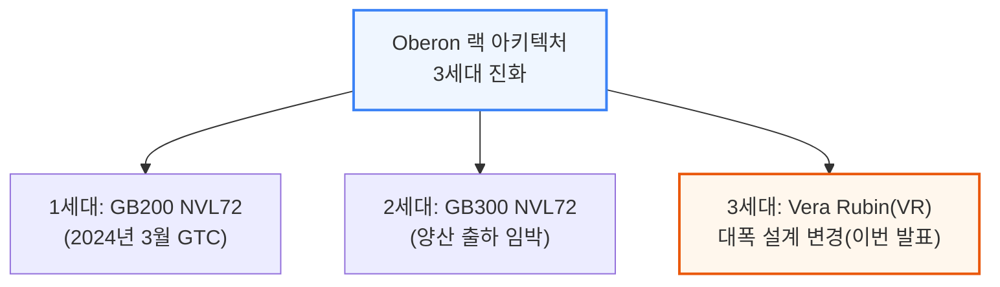

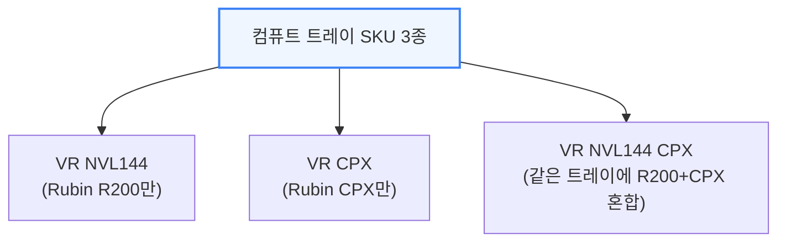

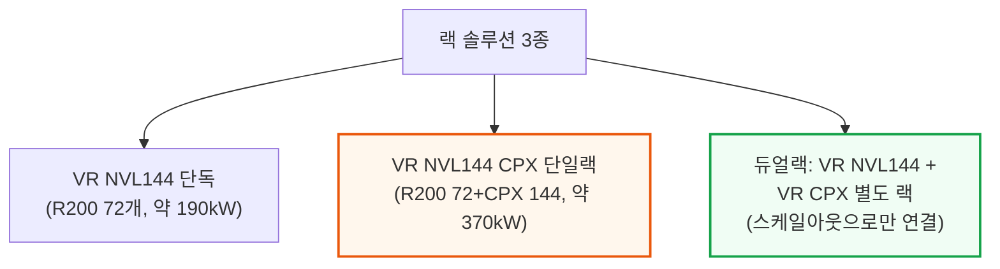

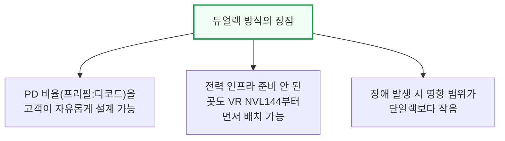

VR NVL144 CPX 컴퓨트 트레이 하나에는 Nvidia 칩이 총 22개(그중 XPU 14개) 들어가며, 트레이 18개로 구성된 랙 전체로는 396개 칩이 담깁니다.

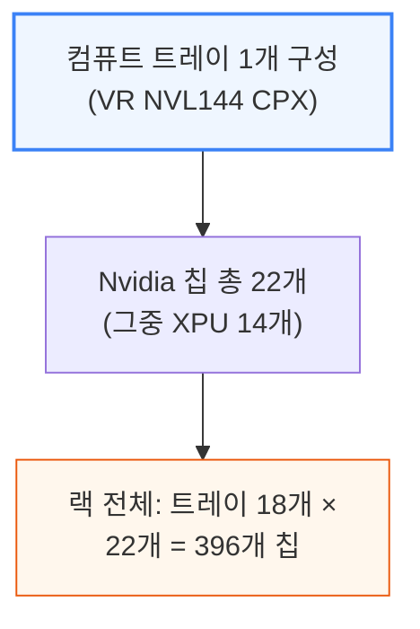

이 많은 칩을 1U 트레이에 욱여넣기 위해 Nvidia는 케이블 없는(케이블리스) 모듈형 설계를 택했습니다.

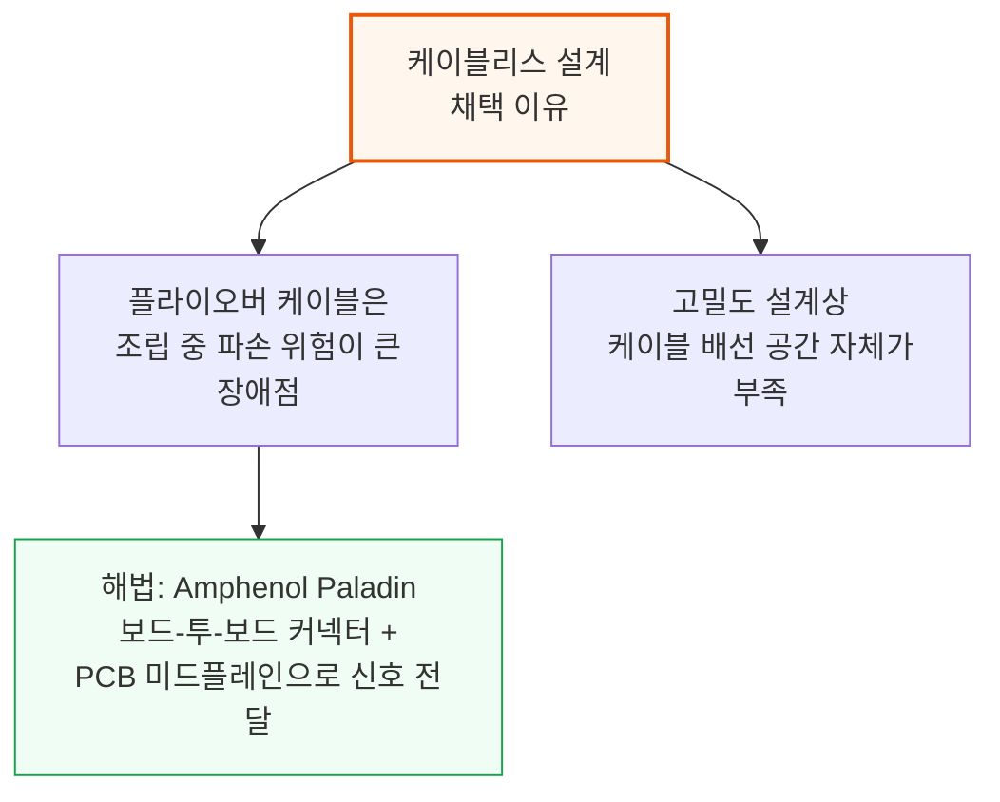

트레이 앞부분은 도터카드(daughter card) 모듈 7장으로 구성되며, 서비스 편의를 위해 각 모듈이 레일 킷을 따라 개별적으로 슬라이드 인/아웃됩니다.

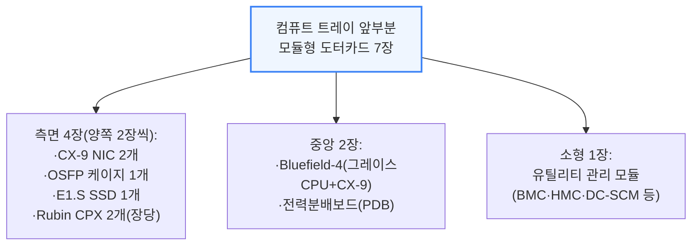

**📌 용어 풀이: PDB·Bluefield-4·관리 모듈**
> - PDB(전력분배보드, Power Delivery Board): 랙 뒤 버스바에서 들어오는 48\~54V 전원을 컴퓨트 트레이 내부에서 쓰는 12\~13.5V로 낮춰주는 보드
> - Bluefield-4: 그레이스 CPU 1개와 CX-9 NIC 1개를 담은 모듈로, 스토리지·네트워크 관리를 전담하는 데이터처리장치(DPU)
> - BMC·HMC·DC-SCM: 서버 하드웨어를 원격으로 감시·제어하는 관리 칩들 — 연산 자체가 아니라 "트레이가 잘 작동하는지 감시하는" 역할

Rubin CPX 모듈 하나는 GDDR7 메모리까지 포함하면 소비전력이 880W에 달해, 트레이 앞부분(CPX 8개)의 발열 합계는 7,040W에 이릅니다. 이를 식히기 위해 Nvidia는 2009년 GTX 295에 쓰였던 샌드위치형 콜드플레이트 설계를 부활시켰습니다.

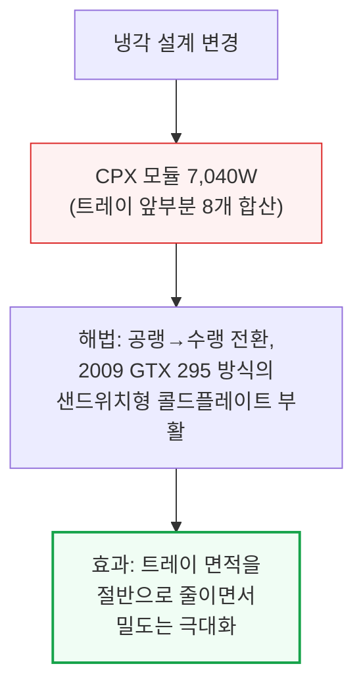

---

## 6. 거대한 도약 - 분리형 서빙(Disaggregated Serving)의 진화

**📌 핵심:**
- 분리형 서빙은 프리필과 디코드를 다른 자원에 맡겨 서로의 간섭을 없애는 방식 — 짧은 입력은 대역폭이, 긴 입력(32K 토큰 초과)은 연산력이 병목이 되는 정반대 특성 때문에 필요
- 1단계(동일 하드웨어로만 분리)는 간섭 문제는 해결하지만 "잘못된 크기" 문제(순수 프리필의 HBM 대역폭 낭비)는 그대로 남음
- Rubin CPX는 메모리 자체를 줄이고 저가화해 낭비 규모를 축소 — 같은 프리필 워크로드 기준 R200은 시간당 $0.90 TCO를 낭비하지만 CPX는 그 손실이 훨씬 작음
- 결론: 저속 PCIe 네트워크로도 파이프라인 병렬화를 쓰면 프리필 처리에 전혀 부족하지 않아, NVLink 스케일업 비용(GPU당 약 $8,000)까지 통째로 절감 가능

---

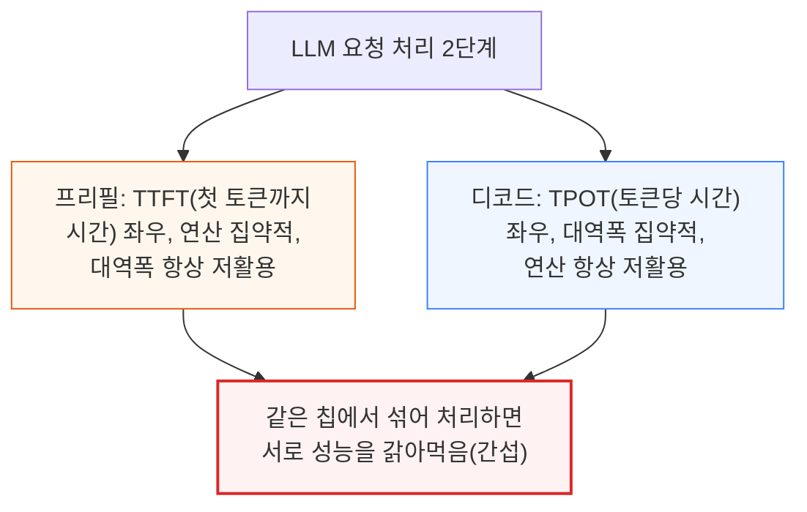

```mermaid
flowchart TD
    Seq["입력 시퀀스 길이 증가"] --> Short["짧은 시퀀스: FLOPS<br/>미포화 → 대역폭이 병목"]
    Seq --> Long["긴 시퀀스(32K 토큰 초과):<br/>FLOPS 활용률 100% 도달,<br/>대역폭 활용률은 급감"]

    style Long fill:#fff7ed,stroke:#ea580c,stroke-width:2px
```

### 초기 단계: 동일 하드웨어로 분리형 서빙

```mermaid
flowchart TD
    Step1["1단계: 동일 하드웨어로<br/>프리필·디코드 분리"] --> Benefit["장점: 성능 예측 쉬워짐,<br/>SLA(토큰/초/사용자) 관리 용이"]
    Step1 --> Catch["한계: 특정 입출력 비율에서만<br/>효과, 순수 프리필은 여전히<br/>R200의 비싼 HBM 대역폭 낭비"]

    style Catch fill:#fef2f2,stroke:#dc2626,stroke-width:2px
```

### 다음 단계: 특화 하드웨어로 분리형 서빙 - Rubin CPX 등장

```mermaid
flowchart TD
    Approach["해법: 메모리 자체를<br/>줄이고 저가화(GDDR7)"] --> Result1["같은 프리필 워크로드 기준<br/>R200은 시간당 $0.90 TCO<br/>낭비 발생"]
    Approach --> Result2["Rubin CPX는 대역폭<br/>활용률은 여전히 낮지만<br/>낭비되는 메모리 자체가<br/>더 적고 훨씬 저렴"]

    style Result1 fill:#fef2f2,stroke:#dc2626
    style Result2 fill:#f0fdf4,stroke:#16a34a,stroke-width:2px
```

```mermaid
flowchart TD
    Impact["시스템 지출 구조 변화"] --> Share["CPX 도입 시스템은<br/>총 지출 중 HBM 비중↓"]
    Share --> Demand["결과: 총 AI 시스템 지출이<br/>고정이라면, 지출액당<br/>HBM 수요는 감소"]

    style Demand fill:#fff7ed,stroke:#ea580c,stroke-width:2px
```

### 메모리를 더 줄이면 안 되나?

```mermaid
flowchart TD
    Question["의문: 메모리를 10분의 1로<br/>더 줄이면 안 되나?"] --> Answer["답: 토큰 경제 작동 —<br/>토큰 원가↓ → 수요↑ →<br/>디코드 수요까지 함께 증가"]
    Answer --> NetEffect["순효과: 단가 하락을<br/>수요 증가가 상쇄하고도 남아<br/>전체 시장 규모는 오히려 확대"]

    style Question fill:#eff6ff,stroke:#3b82f6
    style NetEffect fill:#f0fdf4,stroke:#16a34a,stroke-width:2px
```

```mermaid
flowchart TD
    Supply["GDDR7 공급망 파급 효과"] --> RTX["RTX Pro 6000도 GDDR7<br/>(28Gbps) 사용,<br/>Nvidia 대량 주문"]
    Supply --> Samsung["주문 대부분 삼성行<br/>(SK하이닉스·마이크론은<br/>HBM 생산에 웨이퍼 묶여<br/>대응 못함)"]
    Samsung --> Beneficiary["결과: Rubin CPX 확산도<br/>삼성에 추가 수혜"]

    style Samsung fill:#fff7ed,stroke:#ea580c
    style Beneficiary fill:#f0fdf4,stroke:#16a34a
```

### 프리필 파이프라인 병렬화의 이점

```mermaid
flowchart TD
    IO["오프칩 I/O 대역폭 비교"] --> CPXio["Rubin CPX: PCIe Gen6<br/>x16 = 약 1Tbit/s"]
    IO --> R200io["R200: NVLink<br/>14.4Tbit/s(14배 이상)"]
    R200io --> Enough2["그래도 프리필에는<br/>파이프라인 병렬화(PP)로<br/>충분히 커버 가능"]

    style CPXio fill:#fff7ed,stroke:#ea580c
    style Enough2 fill:#f0fdf4,stroke:#16a34a,stroke-width:2px
```

```mermaid
flowchart TD
    Case["DeepSeek V3 사례<br/>(NVFP4 기준)"] --> Need["모델 가중치 적재에<br/>335GB 필요"]
    Need --> Limit["CPX 칩 1개 용량<br/>128GB로는 부족"]
    Limit --> PP["해법: 파이프라인<br/>병렬화(PP)로<br/>여러 칩에 층 분할"]

    style Need fill:#fef2f2,stroke:#dc2626
    style PP fill:#f0fdf4,stroke:#16a34a,stroke-width:2px
```

```mermaid
flowchart TD
    Tradeoff["PP vs EP<br/>병렬화 방식 비교"] --> PPside["PP: 칩당 처리량↑,<br/>TTFT(첫토큰시간)는 불리<br/>(통신은 단순 송수신)"]
    Tradeoff --> EPside["EP: 통신 복잡(전체-전체<br/>교환) → 저속 네트워크와<br/>궁합 나쁨"]

    style PPside fill:#f0fdf4,stroke:#16a34a
    style EPside fill:#fef2f2,stroke:#dc2626
```

```mermaid
flowchart TD
    Bound["Rubin CPX 프리필<br/>통신 vs 연산 병목 비교"] --> Comm["통신 상한(PCIe Gen6<br/>완전 포화 기준):<br/>초당 1,830만 토큰"]
    Bound --> Compute2["연산 상한(FP4 처리량÷<br/>토큰당 0.074TFLOP):<br/>초당 26.76만 토큰"]
    Compute2 --> Verdict["결론: 연산이 통신보다<br/>먼저 병목 → PCIe로도<br/>네트워크는 절대 부족하지 않음"]

    style Comm fill:#eff6ff,stroke:#3b82f6
    style Verdict fill:#f0fdf4,stroke:#16a34a,stroke-width:2px
```

```mermaid
flowchart TD
    Saving["Rubin CPX의<br/>추가 절감 요인"] --> NVLcost["NVLink 스케일업 비용<br/>약 $8,000/GPU 회피<br/>(전체 클러스터 원가의 10%대)"]
    Saving --> EPpenalty["단, EP 방식을 쓰면<br/>top_k×레이어 수에 비례해<br/>통신량 급증<br/>(DeepSeek V3 기준 PP 대비 약 488배)"]

    style NVLcost fill:#f0fdf4,stroke:#16a34a,stroke-width:2px
    style EPpenalty fill:#fef2f2,stroke:#dc2626
```

### 스케일링과 황의 법칙(Huang's Law)

```mermaid
flowchart TD
    Huang["황의 법칙 지속 여부"] --> Precision["정밀도 하락(FP4)은<br/>거의 한계 도달<br/>(더 낮출 여지 적음)"]
    Huang --> Sparsity["희소성(Sparsity)이<br/>다음 레버이지만,<br/>약속된 2배 효과는<br/>아직 못 냄"]
    Sparsity --> NewScheme["Rubin 신규 희소성 방식<br/>(Hopper 2:4, Blackwell 4:8과<br/>다른 새 구조) 도입"]

    style Precision fill:#fef2f2,stroke:#dc2626
    style NewScheme fill:#fff7ed,stroke:#ea580c,stroke-width:2px
```

---

*작성 진행률: 약 60% 완료*
*업데이트: 4\~6장(대역폭·연산력 격차, 새로운 랙 아키텍처, 분리형 서빙의 진화) 작성 완료*
