# InferenceX v2: NVIDIA Blackwell Vs AMD vs Hopper - Formerly InferenceMAX

> **출처**: [SemiAnalysis Newsletter](https://newsletter.semianalysis.com/p/inferencex-v2-nvidia-blackwell-vs)
> **저자**: Dylan Patel, Cam Quilici, Bryan Shan
> **발행일**: 2026-02-05

---

## 📑 목차

### 전체 섹션
 1. [개요 - InferenceX v2란 무엇인가](#1-개요---inferencex-v2란-무엇인가)
 2. [핵심 관찰 결과 요약](#2-핵심-관찰-결과-요약)
 3. [핵심 개념 정리 - 상호작용성·프리필/디코드·TP·EP·DP](#3-핵심-개념-정리---상호작용성프리필디코드tpepdp)
 4. [시간 경과에 따른 소프트웨어 개선 추적](#4-시간-경과에-따른-소프트웨어-개선-추적)
 5. [분리형 서빙 프레임워크와 DeepSeek Disagg+WideEP 심층분석](#5-분리형-서빙-프레임워크와-deepseek-disaggwideep-심층분석)
 6. [Nvidia TensorRT-LLM과 NVL72의 압도적 성능](#6-nvidia-tensorrt-llm과-nvl72의-압도적-성능)
 7. [Nvidia vs AMD Disagg Prefill 성능 비교](#7-nvidia-vs-amd-disagg-prefill-성능-비교)
 8. [추론 제공업체 단위경제 분석](#8-추론-제공업체-단위경제-분석)
 9. [Jensen의 과소약속·과잉이행 - Hopper vs Blackwell vs 랙스케일 NVL72](#9-jensen의-과소약속과잉이행---hopper-vs-blackwell-vs-랙스케일-nvl72)
10. [AMD 조합성(Composability) 문제와 ATOM 엔진 비판](#10-amd-조합성composability-문제와-atom-엔진-비판)
11. [MTP(멀티토큰예측)와 Anthropic Fast Mode 경제학](#11-mtp멀티토큰예측와-anthropic-fast-mode-경제학)
12. [Wide EP와 분리형 프리필 - 심화 원리와 최적 전략 선택](#12-wide-ep와-분리형-프리필---심화-원리와-최적-전략-선택)
13. [단일노드 벤치마크 결과 - DeepSeek R1과 GPT-OSS 120B](#13-단일노드-벤치마크-결과---deepseek-r1과-gpt-oss-120b)
14. [InferenceX 인프라 변화와 향후 계획](#14-inferencex-인프라-변화와-향후-계획)
15. [세대별 TCO 비교 - 자본비용과 운영비용](#15-세대별-tco-비교---자본비용과-운영비용)

---

## 🔑 용어 정리

본문을 순서대로 읽기 전에 알아두면 좋은 용어들입니다. 자세한 수치와 설명은 본문에서 처음 등장하는 위치에 나옵니다.

- **Wide EP(광역 전문가 병렬화)**: MoE 모델의 전문가(Expert) 계층을 노드 여러 개에 걸쳐 넓게 분산 배치하는 기법 — 전문가 하나당 처리하는 토큰 수를 늘려 연산 효율(산술강도)을 높이고, 여러 칩의 HBM 대역폭을 동시에 활용
- **분리형 프리필/서빙(Disaggregated Prefill/Serving)**: 추론의 프리필(입력 처리, 연산 집약적)과 디코드(출력 생성, 메모리 대역폭 집약적)를 서로 다른 GPU 풀에 나눠 맡기는 방식 — 두 단계가 자원을 놓고 다투지 않아 지연시간 변동(지터)이 줄어듦
- **MTP(Multi-Token Prediction, 멀티 토큰 예측)**: 한 번의 순전파로 토큰을 여러 개 동시에 예측·검증하는 기법(추측 디코딩의 일종) — 별도 초안 모델 없이 본 모델에 예측 헤드만 추가해 처리량을 크게 늘림
- **조합성(Composability)**: 여러 최적화 기법(FP4·분리형 서빙·Wide EP 등)을 개별적으로 쓸 때는 잘 작동하지만, 한꺼번에 결합했을 때도 성능이 유지되는지를 가리키는 개념 — 이 리포트에서 AMD가 겪는 핵심 약점으로 지목됨
- **TP·EP·DP(텐서·전문가·데이터 병렬화)**: 모델을 여러 GPU에 나누는 세 가지 기본 전략 — TP는 모든 계층의 가중치를 쪼개 매 계층 통신이 필요하지만 저배치에서 균등 부하, EP는 전문가 단위로 쪼개 통신은 저렴하지만 저배치에서 부하 불균형, DP는 모델 전체를 복제해 가장 단순하지만 가중치 중복 로딩이 낭비
- **NVLink 도메인 vs 스케일아웃(InfiniBand/이더넷) 대역폭 격차**: 랙 내부 GPU끼리는 NVLink로 GPU당 900GB/s(단방향)까지 연결되는 반면, 랙 밖 GPU와는 InfiniBand·이더넷으로 GPU당 400\~800Gbit/s(약 50\~100GB/s)만 연결 — 약 7\~10배 차이가 나 스케일업 도메인 크기가 성능에 큰 영향을 줌

---

## 1. 개요 - InferenceX v2란 무엇인가

**📌 핵심:**
- **InferenceX v2**(구 InferenceMAX)는 InferenceMAX v1의 오픈소스 자동 벤치마크를 확장한 후속판 — 지난 4년간 출시된 **Nvidia 서방향 GPU 6종 전체**와 지난 3년간 출시된 **AMD 서방향 GPU 전 SKU**로 대상 범위를 넓혀, 벤치마크 1회 전체 실행에 거의 **1,000개에 달하는 프론티어 GPU**를 투입
- 이번 릴리스로 **Blackwell Ultra(GB300 NVL72·B300)**를 전체 파레토 프론티어 곡선으로 벤치마크한 최초의 벤치마크 스위트가 됐고, **분리형 서빙+Wide EP 조합의 다중노드 FP4·FP8 MI355X 성능**을 테스트한 최초의 제3자 벤치마크가 됨
- 대상 확대 범위는 대규모 DeepSeek MoE **분리형 추론(prefill 분리, "disagg")**과 **Wide EP(광역 전문가 병렬화)** 최적화 — 이는 OpenAI·Anthropic·xAI·Google DeepMind·DeepSeek 등 프론티어 AI랩과 TogetherAI·Baseten·Fireworks 같은 API 제공업체가 실제 프로덕션에서 쓰는 기법
- 결론: 완전 오픈소스(Apache 2.0)로 소프트웨어 생태계와 같은 속도로 계속 갱신되며, 무료 데이터 시각화 도구(inferencex.com)도 함께 제공 — 향후 몇 달 내 DeepSeek V4를 출시 당일부터 지원하고, TPUv7 Ironwood·Trainium3까지 벤치마크 대상에 추가할 계획

---

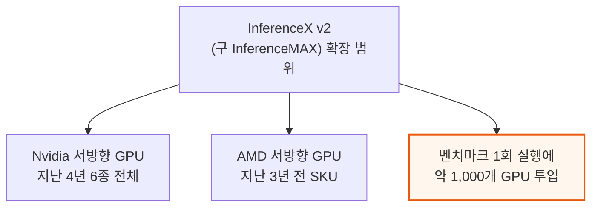

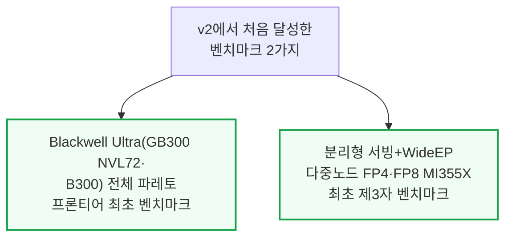

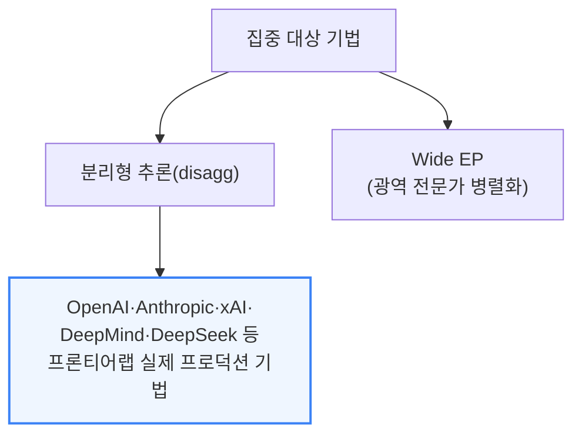

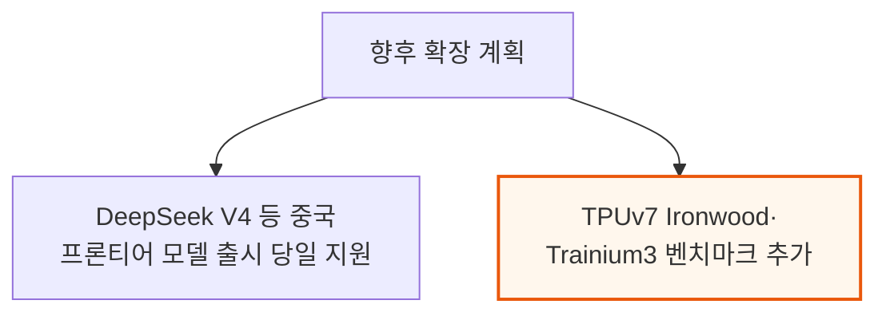

---

## 2. 핵심 관찰 결과 요약

**📌 핵심:**
- FP8 조건에서 **AMD의 MI355X(SGLang, 분리형+WideEP)는 Nvidia B200(SGLang)과 견줄 만한 성능당비용**을 달성 — 다만 Nvidia의 주력 엔진인 TRT-LLM(Dynamo)과 비교하면 여전히 격차가 큼. 단일노드(비분리형) 서빙에서는 AMD SGLang이 오히려 Nvidia SGLang보다 나은 성능당비용을 보이는 경우도 확인
- 그러나 프론티어 랩들이 실제로 쓰는 **"FP4 + 분리형 서빙 + Wide EP" 3종 최적화를 동시에 결합**하면 AMD 성능이 Nvidia와 경쟁이 안 될 정도로 급락 — 개별 최적화는 각각 잘 작동하지만 여러 개를 합치면 성능이 기대에 못 미치는 **조합성(Composability)** 문제가 AMD의 핵심 약점으로 지목됨
- Nvidia는 최신 추론 기법(분리형 프리필+WideEP+FP4)이 모두 걸린 조건에서 SGLang·TRT-LLM 양쪽 엔진 모두, B200·B300은 물론 랙스케일 GB200/GB300 NVL72까지 압도적 우위 — 에너지 효율(토큰당 피코줄) 면에서도 전 워크로드에 걸쳐 Nvidia가 크게 앞섬
- 결론: **GB300 NVL72는 강력한 H100 분리형+WideEP+MTP 기준선 대비 FP8 대 FP4 비교에서 최대 100배**, FP8 대 FP8 비교에서도 최대 65배 성능 우위 — H100 대 GB200 NVL72 비교에서도 상호작용성 75 tok/s/user 기준 최대 55배 격차가 확인돼, 랙스케일 Blackwell이 Hopper 세대를 완전히 압도

---

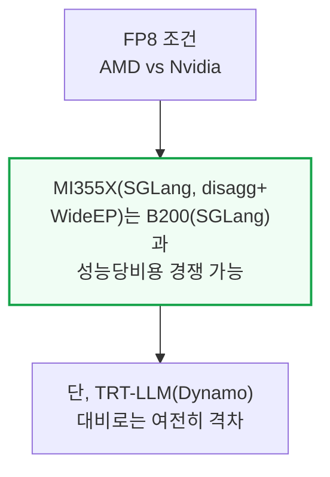

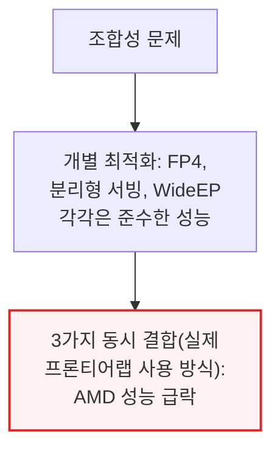

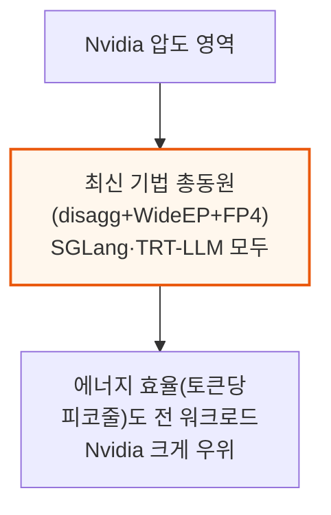

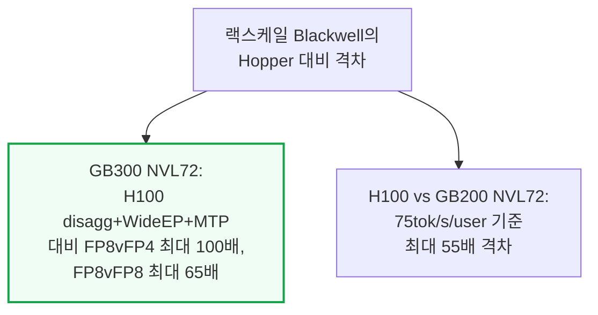

---

## 3. 핵심 개념 정리 - 상호작용성·프리필/디코드·TP·EP·DP

**📌 핵심:**
- **상호작용성(tok/s/user)**은 사용자 한 명이 토큰을 받는 속도(출력 토큰당 시간의 역수), **처리량(tok/s)**은 시스템 전체가 만드는 총 토큰 수 — 요청을 배치로 묶을수록 처리량은 늘지만 요청 하나당 배정되는 연산은 줄어 속도가 느려짐(지하철버스 vs 레이싱카 비유: 버스는 승객 다수에게 비용을 나눠 저렴하지만 정차가 잦고, 레이싱카는 1\~2명에게 빠르지만 훨씬 비쌈)
- 추론은 **프리필**(요청의 첫 순전파, 모든 토큰을 병렬 처리하는 연산 집약 단계, KV캐시를 채움)과 **디코드**(토큰을 하나씩 생성, 매번 KV캐시 전체를 HBM에서 불러오는 메모리 대역폭 집약 단계)로 구성 — 같은 엔진에서 두 단계를 같이 처리하면 프리필이 디코드 배치를 계속 방해해 전체 성능이 떨어짐
- **분리형 프리필(Disaggregated Prefill)**은 프리필과 디코드를 서로 다른 GPU 풀에 배정해 각각 독립적으로 튜닝·확장할 수 있게 하는 기법
- 결론: 모델을 여러 GPU에 나누는 3대 기본 전략 — **TP(텐서 병렬)**는 저배치에서 상호작용성을 극대화하지만 매 계층 all-reduce 통신 필요, **EP(전문가 병렬)**는 MoE의 희소성을 활용해 통신은 저렴(all-to-all)하지만 저배치에서 부하 불균형 발생, **DP(데이터 병렬)**는 모델(또는 어텐션 등 일부)을 복제해 여러 GPU 그룹에 나누는 가장 단순한 방식이지만 대규모에서는 가중치 중복 로딩이 낭비

---

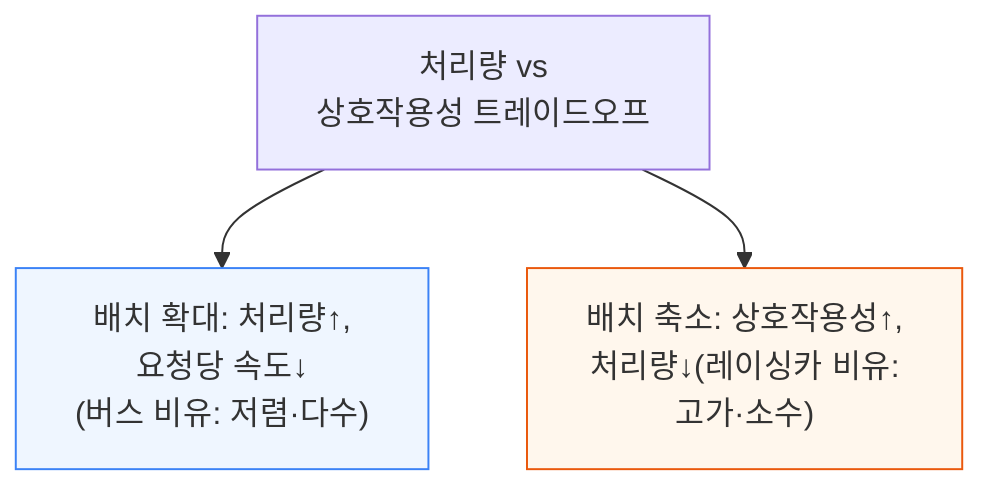

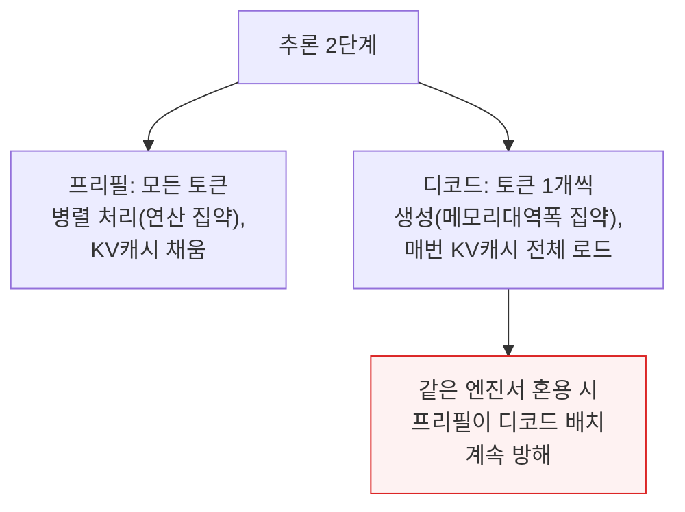

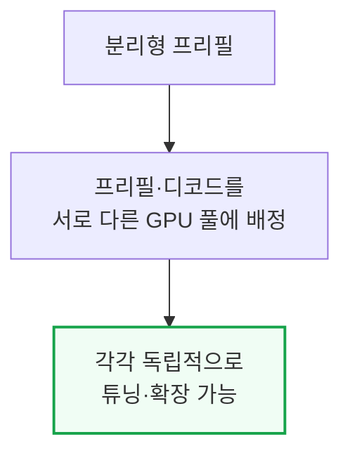

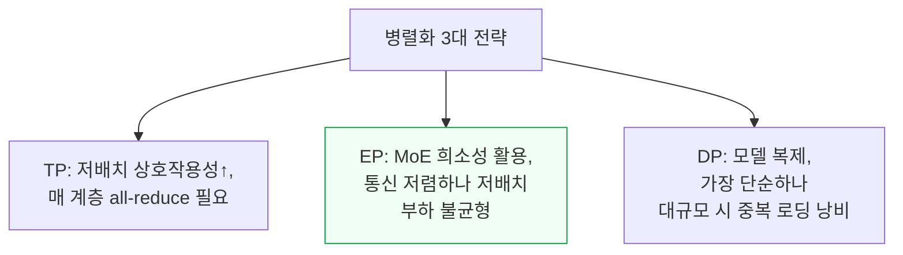

---

## 4. 시간 경과에 따른 소프트웨어 개선 추적

**📌 핵심:**
- InferenceX의 핵심 목적 중 하나는 **소프트웨어 개선 속도를 시각화**하는 것 — 칩은 연 단위로 출시되지만 소프트웨어는 주 단위로 갱신되므로, 최신 레시피를 지속 반영해 재벤치마크
- **AMD의 개선 속도가 가장 극적** — SGLang 기반 DeepSeek R1 FP4는 동일 상호작용성 기준 2개월도 안 되는 기간(2025년 12월\~2026년 1월)에 처리량이 거의 2배로 향상, 이는 AMD가 포크한 SGLang 이미지의 개선 사항을 공식 SGLang 이미지로 업스트림하도록 SemiAnalysis가 압박한 결과이기도 함
- **Nvidia는 상대적으로 안정적** — B200 SGLang은 같은 기간 소폭 개선에 그쳤고, H200 TRT-LLM 단일노드는 4개월간(10월 이후) 성능 변화가 거의 없었는데, 이는 Hopper 지원이 출시 첫날부터 우수해 이미 이론적 피크치에 근접했기 때문(개선 여지가 원래 적음)
- 결론: **GB200 Dynamo TRT-LLM 분리형 서빙**은 한 달 조금 넘는 기간 동안 최대 처리량이 20% 증가(중간 상호작용성 구간의 개선은 Wide EP 커널이 성숙해진 결과로 추정) — **MI355X는 AMD의 신규 통신 라이브러리 MoRI 도입**으로 20\~45 tok/s/user 구간에서 GPU당 처리량이 한 달여 만에 20% 이상 향상

---

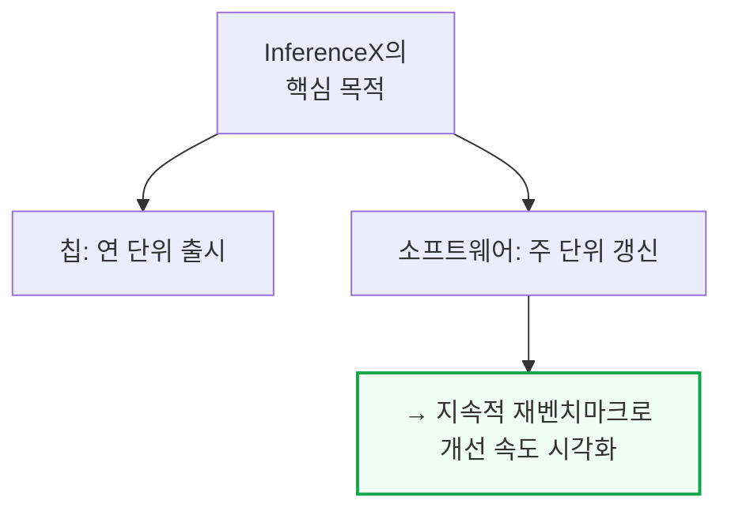

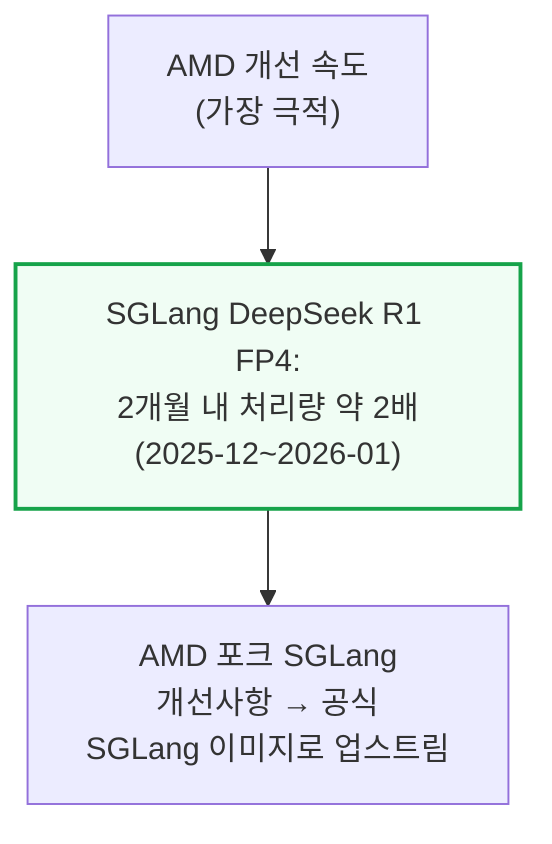

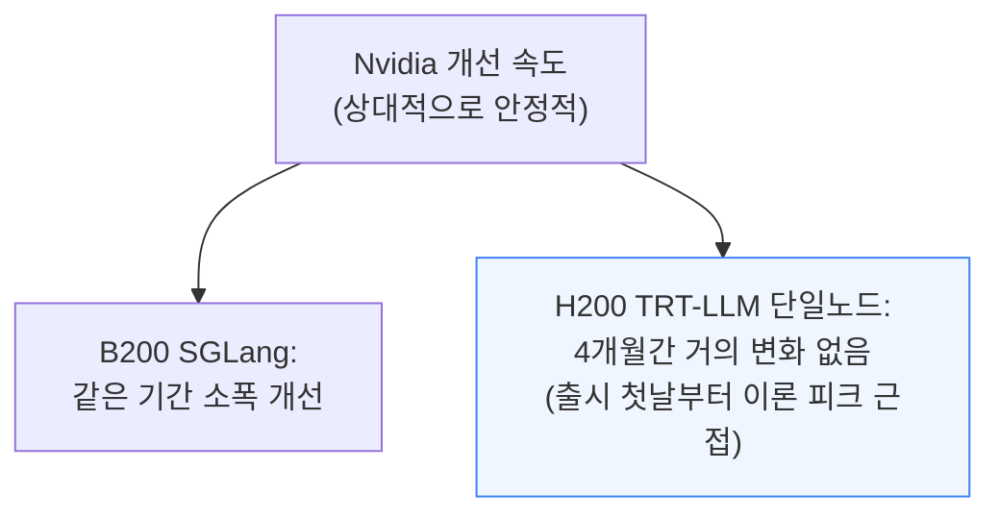

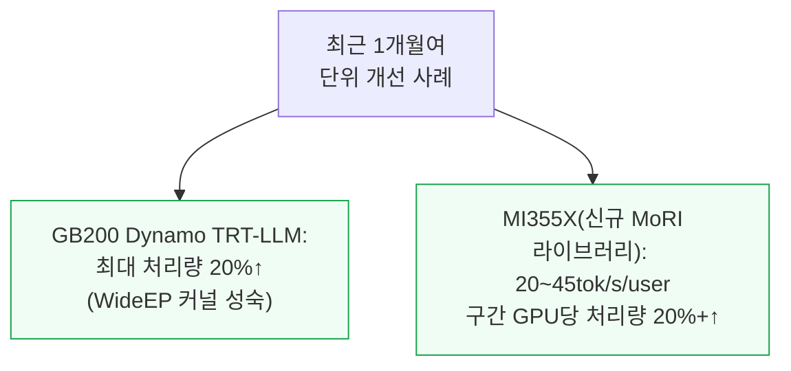

---

## 5. 분리형 서빙 프레임워크와 DeepSeek Disagg+WideEP 심층분석

**📌 핵심:**
- **Nvidia는 Dynamo**를 분리형 추론 프레임워크로 사용 — 다중노드 분산 추론에 특화된 엔진 독립적(agnostic) 프레임워크로, 프리필-디코드 분리·요청 라우팅·KV캐시 오프로딩을 지원하며 SGLang·TRT-LLM을 백엔드로 자유롭게 조합
- **AMD는 SGLang 기반에 두 가지 KV캐시 전송 프레임워크**를 사용 — **MoRI**(AMD의 RDMA·GPU 통합 특화 고성능 통신 인터페이스, 중국 기반 엔지니어링 팀이 처음부터 새로 설계, 기존처럼 Nvidia NCCL을 포크한 RCCL과 다른 접근)와 최근 PyTorch 생태계에 합류한 **Mooncake**(프리필-디코드 분리와 장애 허용 다중노드 기능 지원)
- 거의 모든 상호작용성 구간에서 **분리형 추론이 집계형(단일노드) 추론보다 GPU당 총 토큰 처리량이 높음** — 다만 **MI355X는 저상호작용성·고배치 구간에서만 분리형이 집계형을 능가**(FP4 전반에 걸쳐 나타나는 패턴으로, ROCm 커널 최적화 부족이 원인으로 추정)
- 결론: FP4에서 분리형+WideEP를 결합하면 **이론상 MI355X가 단일노드보다 훨씬 나아야 하지만, 실제로는 고상호작용성 구간에서 오히려 더 나쁜 성능**을 보임 — 여러 최신 최적화를 동시에 조합했을 때 ROCm 소프트웨어 스택의 커널·집단통신 최적화가 따라가지 못하는 조합성 문제의 구체적 사례

---

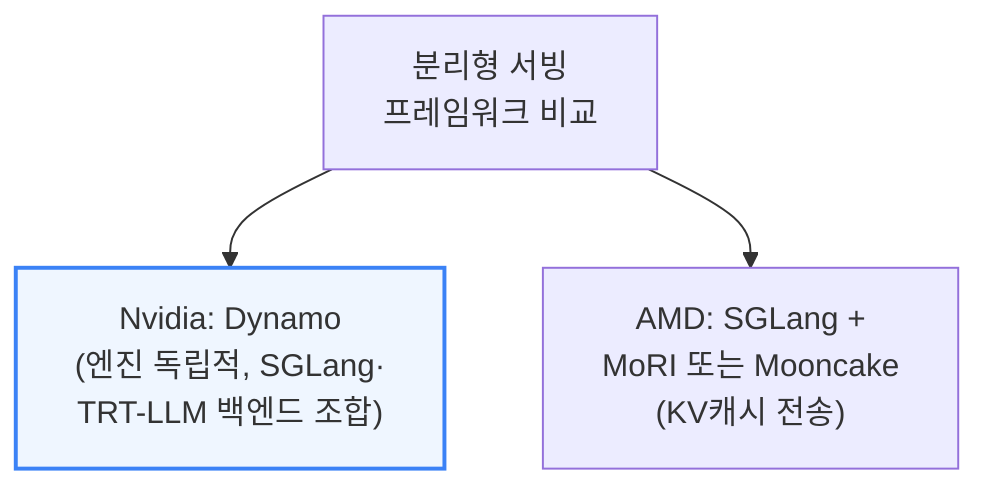

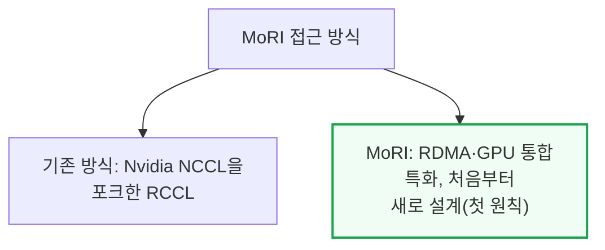

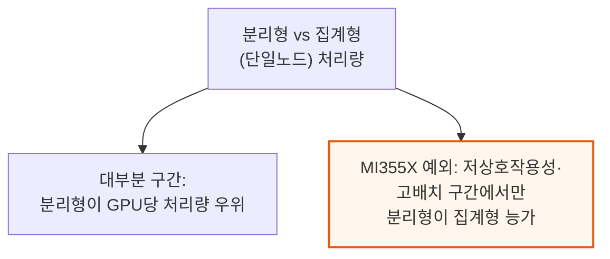

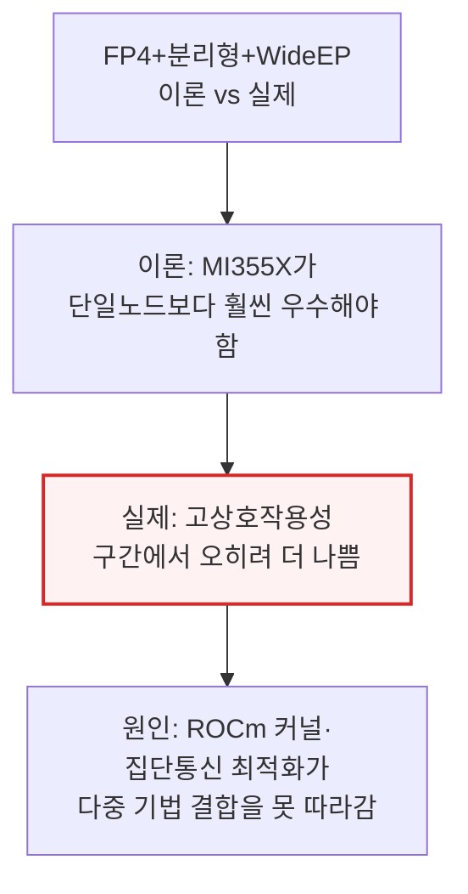

---

## 6. Nvidia TensorRT-LLM과 NVL72의 압도적 성능

**📌 핵심:**
- **TensorRT-LLM은 이미 TogetherAI 등 프로바이더에서 시간당 수십억 토큰**을 서빙하는 검증된 엔진 — GB200·GB300 NVL72에서 특히 강점을 발휘해 고처리량 구간에서 **2배 이상의 성능**을 이끌어내고, MTP를 켜면 칩의 잠재력을 한층 더 끌어냄
- NVL72의 넓은 스케일업 월드사이즈(72 GPU)가 주는 이점은 상호작용성이 낮을 때(고배치) 가장 크게 나타남 — 상호작용성 60 tok/s/user 고정 시 **GB200 NVL72의 GPU당 토큰생성 속도가 B200(8 GPU 스케일업)의 거의 3배**
- 다만 이 격차는 상호작용성이 높아질수록(배치가 작아질수록) 줄어듦 — **130 tok/s/user에서는 GB200 NVL72의 이점이 거의 사라지고, 오히려 백만토큰당 비용은 B200보다 비싸짐**(워크로드가 작아지면 단일 HGX 노드(8 GPU)의 NVLink 도메인 안에 다 들어가버려 NVL72의 대규모 스케일업 이점이 무의미해지기 때문)
- 결론: 랙스케일 아키텍처의 이점은 **모든 상호작용성 구간에서 균일하지 않고, 저상호작용성·고배치 워크로드에서 가장 강력** — 고상호작용성 워크로드에서는 오히려 소형 노드가 비용 효율적일 수 있어, "무조건 큰 랙이 유리하다"는 통념과 다른 결론

---

```mermaid
flowchart TD
    TRT2["TensorRT-LLM 실전 검증"] --> Volume["TogetherAI 등에서<br/>시간당 수십억 토큰 서빙"]
    Volume --> NVL72Boost["GB200·GB300 NVL72에서<br/>고처리량 구간 2배 이상<br/>성능(+MTP로 추가 향상)"]

    style NVL72Boost fill:#f0fdf4,stroke:#16a34a,stroke-width:2px
```

```mermaid
flowchart TD
    WorldSize["NVL72 스케일업<br/>이점의 상호작용성별 변화"] --> Low2["60tok/s/user(저상호작용성,<br/>고배치): GB200이<br/>B200 대비 거의 3배"]
    WorldSize --> High2["130tok/s/user(고상호작용성):<br/>이점 거의 소멸,<br/>오히려 GB200이 더 비쌈"]

    style Low2 fill:#f0fdf4,stroke:#16a34a,stroke-width:2px
    style High2 fill:#fff7ed,stroke:#ea580c,stroke-width:2px
```

```mermaid
flowchart TD
    WhyShrink["격차가 줄어드는 이유"] --> SmallBatch2["고상호작용성 = 소배치<br/>→ 워크로드가 단일<br/>HGX 노드(8GPU) 안에 다 들어감"]
    SmallBatch2 --> Irrelevant["NVL72의 72GPU<br/>스케일업 이점이<br/>무의미해짐"]

    style Irrelevant fill:#fff7ed,stroke:#ea580c,stroke-width:2px
```

```mermaid
flowchart TD
    Lesson2["랙스케일 이점의<br/>비균일성"] --> LowBest["저상호작용성·고배치:<br/>랙스케일이 압도적 유리"]
    Lesson2 --> HighBest["고상호작용성·소배치:<br/>소형 노드가 오히려<br/>비용 효율적일 수 있음"]

    style HighBest fill:#eff6ff,stroke:#3b82f6,stroke-width:2px
```

---

## 7. Nvidia vs AMD Disagg Prefill 성능 비교

**📌 핵심:**
- **FP8 분리형 프리필**에서는 MI355X(MoRI SGLang)가 B200(Dynamo SGLang)과 상당히 경쟁력 있는 성능 — 두 구성 모두 Wide EP는 안 쓰고 최대 EP8까지만 사용, 곡선 양 끝단에서는 B200이 살짝 앞서지만 중간 구간 일부에서는 MI355X가 오히려 근소 우위, 양쪽 모두 MTP를 켜면 비슷한 폭의 성능 향상을 얻음
- 다만 **출력(디코드) 토큰 처리량만 따로 보면 저상호작용성 구간에서 B200이 MI355X보다 훨씬 빠름** — 디코드 GPU 수 기준으로 정규화한 결과이며, 실제 배정된 GPU 수 차이가 있을 수 있지만 결론적으로 어떤 구성이든 B200이 디코드를 더 빨리 처리
- **FP4로 넘어가면 격차가 극적으로 벌어짐** — AMD 단일노드 FP4는 준수하지만 분리형 프리필로 가면 Nvidia에 크게 못 미쳐, 1k1k 시나리오에서는 MTP를 켠 MI355X(MoRI SGLang)가 MTP를 끈 B200(Dynamo SGLang)을 겨우 넘어서는 수준
- 결론: **Dynamo TRT-LLM까지 가세하면 격차가 더 벌어져**, MTP를 켠 MI355X조차 MTP를 켠 B200(Dynamo TRT-LLM)을 이기지 못함 — MI355X가 (MTP 없는) B200을 따라잡는 구간은 상호작용성 약 60\~120 tok/s/user의 좁은 범위뿐이며, TRT-LLM의 성숙한 분리형 프리필 구현이 AMD SGLang·MoRI 조합보다 한 수 위라는 결론

---

```mermaid
flowchart TD
    FP8Disagg["FP8 분리형 프리필<br/>(EP8까지만, WideEP 미사용)"] --> Compete2["MI355X(MoRI SGLang) vs<br/>B200(Dynamo SGLang):<br/>상당히 경쟁력 있음"]
    Compete2 --> Middle2["중간 구간 일부는<br/>MI355X가 근소 우위,<br/>양 끝단은 B200 우위"]

    style Compete2 fill:#f0fdf4,stroke:#16a34a,stroke-width:2px
```

```mermaid
flowchart TD
    DecodeOnly["디코드 전용 처리량<br/>(저상호작용성 구간)"] --> B200Fast["B200이 MI355X보다<br/>훨씬 빠름(디코드 GPU<br/>수 기준 정규화)"]

    style B200Fast fill:#fff7ed,stroke:#ea580c,stroke-width:2px
```

```mermaid
flowchart TD
    FP4Gap["FP4 분리형 프리필<br/>격차 확대"] --> Single["AMD 단일노드 FP4:<br/>준수한 성능"]
    Single --> DisaggBad["AMD 분리형 FP4:<br/>Nvidia에 크게 열세"]
    DisaggBad --> Barely["1k1k 시나리오: MTP<br/>MI355X가 MTP 없는<br/>B200을 겨우 상회"]

    style DisaggBad fill:#fef2f2,stroke:#dc2626,stroke-width:2px
```

```mermaid
flowchart TD
    TRTGap["Dynamo TRT-LLM<br/>합류 시 격차"] --> Wider["MTP MI355X도<br/>MTP B200(TRT-LLM)을<br/>못 이김"]
    Wider --> Narrow["MI355X가 (MTP 없는)<br/>B200 추월 구간:<br/>약 60~120tok/s/user뿐"]

    style Wider fill:#fef2f2,stroke:#dc2626,stroke-width:2px
```

---

## 8. 추론 제공업체 단위경제 분석

**📌 핵심:**
- OpenRouter에 등록된 DeepSeek R1 0528 FP8 제공업체들의 실제 서빙 가격과 상호작용성 데이터를 InferenceX 실측치와 대조해 **실제 원가·마진을 역산**할 수 있음 — 예를 들어 Crusoe가 36 tok/s/user·백만 입력토큰당 $1.35·백만 출력토큰당 $5.40에 서빙한다면, H200급 SOTA 기법(MTP·분리형·WideEP) 기준으로 원가는 입력토큰 $0.226·출력토큰 $2.955를 넘지 않아 **입력토큰 총마진 최대 83%, 출력토큰 총마진 최대 45%**로 추정
- Nebius AI Studio(Fast)처럼 상호작용성 167 tok/s/user급 고속 서빙은 추측 디코딩(MTP) 없이는 경제성을 맞추기 어려운 구간 — 다행히 MTP는 모델 정확도에 미치는 영향이 적으면서 처리량을 크게 늘려주는 기법
- 상호작용성 35 tok/s/user(OpenRouter 중간값)를 고정하면, **B200에 MTP를 켠 구성이 성능당비용 최적** — 대규모 스케일업 도메인을 가진 GB300·GB200 NVL72는 총처리량(GPU당) 자체에서는 여전히 압도적
- 결론: 125 tok/s/user 같은 저지연 워크로드에서도 MTP를 켠 구성이 경제성을 결정적으로 좌우 — 다만 이 모든 분석은 InferenceX가 무작위 데이터·프리픽스 캐싱 비활성 조건에서 측정한 **최소 기준선(하한)**이라는 점에 유의(실제로는 이보다 더 좋은 성능/비용이 나올 수 있음)

---

```mermaid
flowchart TD
    Reverse["단위경제 역산 방법"] --> Data["OpenRouter 실제 가격·<br/>상호작용성 데이터"]
    Data --> Compare3["InferenceX 실측치와<br/>대조 → 원가·마진 추정"]
    Compare3 --> Example["예: Crusoe 36tok/s/user<br/>→ 입력토큰 마진 최대 83%,<br/>출력토큰 마진 최대 45%"]

    style Example fill:#f0fdf4,stroke:#16a34a,stroke-width:2px
```

```mermaid
flowchart TD
    HighInt["고속 서빙(167tok/s/user급)<br/>경제성"] --> Need["MTP(추측 디코딩)<br/>없이는 경제성 확보 어려움"]
    Need --> Safe["MTP는 정확도 영향 적으면서<br/>처리량 대폭 향상"]

    style Need fill:#fff7ed,stroke:#ea580c,stroke-width:2px
```

```mermaid
flowchart TD
    Fixed35["상호작용성<br/>35tok/s/user 고정 비교"] --> Best["B200+MTP:<br/>성능당비용 최적"]
    Fixed35 --> Total["GB300·GB200 NVL72:<br/>GPU당 총처리량 자체는<br/>여전히 압도적"]

    style Best fill:#f0fdf4,stroke:#16a34a,stroke-width:2px
```

```mermaid
flowchart TD
    Caveat2["분석의 한계"] --> Baseline["InferenceX는 무작위<br/>데이터·프리픽스 캐싱<br/>비활성 조건"]
    Baseline --> Floor["→ 실측치는 최소<br/>기준선(하한),<br/>실제는 더 좋을 수 있음"]

    style Floor fill:#eff6ff,stroke:#3b82f6
```

---

## 9. Jensen의 과소약속·과잉이행 - Hopper vs Blackwell vs 랙스케일 NVL72

**📌 핵심:**
- 2024년 GTC에서 Jensen Huang이 "H100 대비 GB200 NVL72가 최대 30배 성능"이라 발표했을 때 업계는 전형적인 과장 마케팅으로 치부(이른바 "Jensen Math" 농담의 소재가 됨) — 그러나 약 2년 뒤 실측 결과, **실제로는 오히려 과소약속이었음**이 드러남
- 강력한 H100 분리형+WideEP+FP8 기준선과 비교해도, **116 tok/s/user 기준 GB200 NVL72 FP4는 최대 98배, GB300 NVL72 FP4는 최대 100배**의 성능 우위를 기록 — Blackwell·Blackwell Ultra 세대에서 총소유비용 상승분을 반영해도 **토큰당 비용 기준 Hopper 대비 9.7배(40 tok/s/user)\~65배(116 tok/s/user)** 개선
- **Blackwell vs Blackwell Ultra** 비교에서는 스펙상 메모리 대역폭 동일·FP8 성능 동일·FP4만 1.5배인데, 실측에서는 **FP8 성능이 오히려 최대 1.5배 더 좋고 FP4는 1.1배**에 그침(Blackwell Ultra가 신제품이라 소프트웨어 최적화가 아직 완전하지 않은 탓으로 추정)
- 결론: B300(스케일업 8 GPU 한계)은 8 GPU를 넘는 구성에서 InfiniBand XDR(GPU당 800Gbit/s)로 폴백해야 하는 반면, **GB300 NVL72는 72 GPU를 NVLink(GPU당 900GB/s)로 묶어 대역폭이 9배 이상 높음** — TCO를 반영해도 대역폭당비용 우위는 8배로 여전히 압도적이며, 오늘날 랙스케일 시스템을 실제 배치한 AI 칩 벤더는 Google TPU·AWS Trainium·Nvidia 3곳뿐(AMD 첫 랙스케일 MI455X UALoE72는 2026년 하반기 엔지니어링 샘플, 양산 토큰은 2027년 2분기에나 나올 전망)

---

```mermaid
flowchart TD
    Promise["2024 GTC:<br/>'H100 대비 최대 30배'"] --> Doubt["당시 반응: 전형적<br/>과장 마케팅으로 치부"]
    Doubt --> Reveal["2년 뒤 실측:<br/>오히려 과소약속이었음"]

    style Reveal fill:#f0fdf4,stroke:#16a34a,stroke-width:2px
```

```mermaid
flowchart TD
    ActualGap["실제 성능 격차<br/>(116tok/s/user 기준)"] --> GB200_2["GB200 NVL72 FP4:<br/>H100 대비 최대 98배"]
    ActualGap --> GB300_2["GB300 NVL72 FP4:<br/>H100 대비 최대 100배"]
    GB300_2 --> CostGain["TCO 반영 토큰당비용:<br/>9.7배(40tok/s/user)~<br/>65배(116tok/s/user) 개선"]

    style CostGain fill:#f0fdf4,stroke:#16a34a,stroke-width:2px
```

```mermaid
flowchart TD
    UltraCompare["Blackwell vs<br/>Blackwell Ultra 실측"] --> Spec["스펙: 대역폭 동일,<br/>FP8 동일, FP4만 1.5배"]
    Spec --> Real2["실측: FP8 최대 1.5배<br/>더 좋음, FP4는 1.1배<br/>(신제품 SW 미성숙 추정)"]

    style Real2 fill:#fff7ed,stroke:#ea580c,stroke-width:2px
```

```mermaid
flowchart TD
    RackOnly["랙스케일 실제<br/>배치 현황(오늘 기준)"] --> Three["Google TPU·AWS Trainium·<br/>Nvidia 3곳만 실배치"]
    Three --> AMDLate["AMD MI455X UALoE72:<br/>엔지니어링 샘플<br/>2026년 하반기,<br/>양산 토큰은 2027년 2분기"]

    style AMDLate fill:#fef2f2,stroke:#dc2626,stroke-width:2px
```

---

## 10. AMD 조합성(Composability) 문제와 ATOM 엔진 비판

**📌 핵심:**
- 프론티어 AI랩들은 이미 **FP4 + 분리형 서빙 + Wide EP를 동시에** 적용해 운영 중인데, AMD의 오픈소스 추론 스택은 이 세 가지를 함께 적용했을 때 이론적 성능(속도의 빛, speed of light 모델링)에도 못 미침 — SemiAnalysis·AMD 양쪽의 이론 모델링 모두 "FP4+분리형+WideEP는 단일노드 MI355X보다 나아야 한다"고 예측하지만 실측은 정반대
- AMD가 자체 개발한 신규 추론 엔진 **ATOM**은 단일노드 성능은 다소 개선되지만, NVMe·CPU KV캐시 오프로딩·툴 파싱·Wide EP·분리형 서빙을 전혀 지원하지 않아 **실제 프로덕션에서 채택한 고객이 전무** — 반면 Nvidia TRT-LLM은 TogetherAI 등에서 이미 시간당 수십억 토큰을 생성하며 툴 파싱 등 기능도 충실히 지원
- vLLM 등 오픈소스 메인테이너들은 AMD의 컴퓨트·코드 기여 부족에 실망 — vLLM 리드 메인테이너는 "vLLM CI에 추가할 수 있는 작동하는 MI355X가 아직 없다"고 공개 언급했고, 실제로 vLLM에는 MI355X 테스트가 0건(B200은 다수), MI300 계열도 CUDA와 동등한 사용성을 갖추려면 최소 20대씩(MI300·MI325·MI355) 추가 CI 머신이 필요한 상황(SemiAnalysis가 개입해 최근 몇 주 사이 MI355X 머신 일부 확보에는 성공)
- 결론: SemiAnalysis는 AMD가 아무도 쓰지 않는 ATOM 같은 단일노드 프로젝트에서 인력을 빼내 **vLLM·SGLang 같은 실사용 프레임워크의 조합성 문제 해결에 재배치**할 것을 강력 권고 — 이 시간차가 Nvidia가 75% 총마진(원가의 4배 마진)을 유지할 수 있는 여지를 계속 벌어주고 있다고 지적

---

```mermaid
flowchart TD
    RealUse["프론티어랩 실제<br/>사용 조건"] --> Triple["FP4 + 분리형 서빙 +<br/>Wide EP 동시 적용"]
    Triple --> AMDFail["AMD 실측: 이론<br/>모델링에도 못 미침<br/>(양측 모델링 모두 이론상<br/>더 나아야 한다고 예측)"]

    style AMDFail fill:#fef2f2,stroke:#dc2626,stroke-width:2px
```

```mermaid
flowchart TD
    ATOM["AMD 신규 엔진<br/>ATOM 평가"] --> Better["단일노드 성능:<br/>다소 개선"]
    ATOM --> Missing["미지원: NVMe·CPU<br/>KV캐시 오프로딩,<br/>툴 파싱, WideEP, 분리형 서빙"]
    Missing --> Zero["결과: 프로덕션<br/>채택 고객 전무"]

    style Zero fill:#fef2f2,stroke:#dc2626,stroke-width:2px
```

```mermaid
flowchart TD
    OSSGap["오픈소스 생태계<br/>기여 격차"] --> vLLMCI["vLLM CI: MI355X<br/>테스트 0건(B200은 다수)"]
    vLLMCI --> Need2["MI300·MI325·MI355<br/>각 20대씩 추가 CI<br/>머신 필요(CUDA 동등 사용성)"]
    Need2 --> Partial["SemiAnalysis 개입으로<br/>최근 MI355X 머신<br/>일부 확보"]

    style Need2 fill:#fff7ed,stroke:#ea580c,stroke-width:2px
```

```mermaid
flowchart TD
    Recommend3["권고와 결과"] --> Realloc["ATOM 등 미사용<br/>프로젝트에서 인력 재배치<br/>→ vLLM·SGLang<br/>조합성 문제 해결"]
    Realloc --> Margin2["현재 시간차가<br/>Nvidia 75% 총마진<br/>유지 여지를 벌어줌"]

    style Margin2 fill:#fff7ed,stroke:#ea580c,stroke-width:2px
```

---

## 11. MTP(멀티토큰예측)와 Anthropic Fast Mode 경제학

**📌 핵심:**
- **추측 디코딩(Speculative Decoding)**은 작고 저렴한 초안 모델로 여러 토큰을 미리 제안하고, 큰 본 모델이 프리필과 비슷한 방식으로 한 번에 검증하는 기법 — **MTP(멀티토큰예측)**는 별도 초안 모델 없이 본 모델 자체에 예측 헤드를 추가해 같은 효과를 냄(제안이 검증 모델과 같은 분포에서 나와 정합성이 높고, 별도 모델 운영의 복잡성도 없음)
- 밀집 모델에서 효과가 가장 크고(배치 검증 시 같은 가중치 스트림을 여러 위치에 재사용 가능), MoE 모델은 토큰마다 다른 전문가로 라우팅될 수 있어 검증 시 활성화되는 전문가 수가 늘어 메모리 트래픽이 증가하는 부작용 존재 — 그럼에도 DeepSeek R1 실측에서는 전 SKU에 걸쳐 MTP가 성능을 개선(대량 배치에서는 개선폭이 상대적으로 작음)
- 비용 임팩트가 극적 — FP4 Dynamo TRT-LLM 기준 DeepSeek R1은 MTP 없이 백만 토큰당 $0.251인데 **MTP를 켜면 $0.057로 급감**(약 4.4배 절감), 150 tok/s/user 구간에서는 GB300 Dynamo TRT 기준 $2.35→$0.11로 **약 21배 급감**하는 사례도 확인
- 결론: **Anthropic의 "Fast Mode"**(Opus 4.6과 함께 출시, 동일 품질에 약 2.5배 속도·약 6\~12배 가격)는 신규 하드웨어가 필요한 게 아니라 처리량-지연시간의 근본 트레이드오프를 그대로 반영한 가격 정책 — 예컨대 GB200 NVL72 랙(약 330만 달러) 기준으로, Fast Mode를 안 쓰고 2.5배 느리게 서빙하면 같은 처리량을 내기 위해 랙이 2.5배 더 필요해 약 500만 달러의 추가 지출이 발생하므로, 오히려 Fast Mode가 TCO 관점에서는 더 저렴할 수 있음

---

```mermaid
flowchart TD
    SpecDecode["추측 디코딩 vs MTP"] --> Spec2["추측 디코딩: 별도<br/>초안 모델로 제안,<br/>본 모델이 검증"]
    SpecDecode --> MTPDef["MTP: 본 모델 자체에<br/>예측 헤드 추가<br/>(별도 모델 불필요)"]

    style MTPDef fill:#f0fdf4,stroke:#16a34a,stroke-width:2px
```

```mermaid
flowchart TD
    ModelType["모델 구조별<br/>MTP 효과 차이"] --> Dense2["밀집 모델: 효과 최대<br/>(가중치 스트림 재사용)"]
    ModelType --> MoE2["MoE 모델: 토큰별<br/>다른 전문가 라우팅 →<br/>검증 시 메모리 트래픽 증가"]
    MoE2 --> StillGood["그럼에도 DeepSeek R1<br/>실측: 전 SKU 성능 개선"]

    style StillGood fill:#f0fdf4,stroke:#16a34a,stroke-width:2px
```

```mermaid
flowchart TD
    CostImpact["MTP 비용 절감 사례"] --> Case1["FP4 Dynamo TRT-LLM:<br/>$0.251→$0.057/백만토큰<br/>(약 4.4배)"]
    CostImpact --> Case2["150tok/s/user, GB300:<br/>$2.35→$0.11<br/>(약 21배)"]

    style Case2 fill:#f0fdf4,stroke:#16a34a,stroke-width:2px
```

```mermaid
flowchart TD
    FastMode["Anthropic Fast Mode<br/>경제학"] --> Spec3["동일 품질, 약 2.5배<br/>속도, 약 6~12배 가격"]
    Spec3 --> NotHW["신규 하드웨어 불필요<br/>(처리량-지연시간<br/>트레이드오프 반영일 뿐)"]
    NotHW --> TCOCase["예: GB200 NVL72 랙<br/>(약 330만달러) 기준<br/>Fast Mode 미사용 시<br/>랙 2.5배 필요→약 500만달러 추가"]

    style TCOCase fill:#fff7ed,stroke:#ea580c,stroke-width:2px
```

---

## 12. Wide EP와 분리형 프리필 - 심화 원리와 최적 전략 선택

**📌 핵심:**
- DeepSeek R1(총 6,710억 파라미터 중 활성 파라미터 370억, 전문가 256개 중 토큰마다 8개 활성)을 8-GPU 서버 하나로 서빙할 때 **TP(텐서병렬)는 희소성을 활용하지 못해** 매 계층 all-reduce가 필요하고 산술강도도 낮음 — **EP(전문가병렬)는 전문가를 GPU별로 나눠 담아** 비전문가 가중치(약 300억 개 미만)만 복제하면 되므로 메모리 절감폭이 큼
- **Wide EP**는 이 EP를 노드 여러 개로 확장 — 64-GPU 클러스터(DP64/EP64)에서는 GPU당 담당 전문가가 4개로 줄어 ① KV캐시용 HBM 여유 확보 ② 전문가당 토큰 수 증가로 산술강도 향상 ③ 64개 칩의 HBM 대역폭을 동시 활용해 메모리 병목 완화라는 3중 효과를 얻음 — 다만 GPU 수가 늘수록 비전문가 가중치 중복 복제가 낭비이므로, TP를 그룹 안에 넣어(예: EP64/DP8/TP8) 이 복제를 추가로 줄이는 하이브리드 구성도 사용
- 최적 병렬화 전략은 **배치 크기(=상호작용성)에 따라 파레토 프론티어 위에서 이동** — 초고상호작용성(배치 1\~16, 전문가 활성 희박)에서는 순수 TP가 최선, 배치 32 근방(전문가 약 50\~60% 활성)부터는 TP(어텐션)+EP(MoE)를 섞은 TEP, 최고처리량·최저상호작용성(배치 128+)에서는 완전 DEP(어텐션 전체 복제+EP)로 전환
- 결론: 분리형 서빙에서도 같은 원리가 적용 — 프리필이 병목인 고처리량 구간(8k/1k 워크로드)에서는 프리필 노드를 더 많이 배정(예: 4P1D)하고 각 프리필 노드는 DEP로 여러 장문 요청을 동시 처리, 저상호작용성(고반응성) 구간에서는 디코드 노드를 더 배정(예: 1P4D)하고 각 디코드 노드는 저배치 TEP로 지연시간을 최소화

---

```mermaid
flowchart TD
    TPvsEP["단일노드 서빙:<br/>TP vs EP"] --> TP3["TP: 희소성 미활용,<br/>매 계층 all-reduce,<br/>산술강도 낮음"]
    TPvsEP --> EP3["EP: 전문가별 GPU 배정,<br/>비전문가 가중치만 복제<br/>→ 메모리 절감 大"]

    style EP3 fill:#f0fdf4,stroke:#16a34a,stroke-width:2px
```

```mermaid
flowchart TD
    WideEP3["Wide EP(64GPU,<br/>DP64/EP64) 3중 효과"] --> E1["① GPU당 전문가 4개로<br/>축소 → KV캐시 여유"]
    WideEP3 --> E2["② 전문가당 토큰 수↑<br/>→ 산술강도 향상"]
    WideEP3 --> E3["③ 64칩 HBM 대역폭<br/>동시 활용 → 메모리<br/>병목 완화"]

    style E1 fill:#f0fdf4,stroke:#16a34a
```

```mermaid
flowchart TD
    ParetoShift["배치 크기별<br/>최적 전략 전환"] --> Batch16["배치 1~16(초고<br/>상호작용성): 순수 TP"]
    ParetoShift --> Batch32["배치 32 근방(전문가<br/>50~60% 활성): TEP<br/>(TP+EP 혼합)"]
    ParetoShift --> Batch128["배치 128+(최고처리량):<br/>완전 DEP"]

    style Batch32 fill:#f0fdf4,stroke:#16a34a,stroke-width:2px
```

```mermaid
flowchart TD
    DisaggStrategy["분리형 서빙<br/>노드 배정 전략"] --> HighTput["고처리량(8k/1k<br/>프리필 병목): 프리필<br/>노드↑(예 4P1D), DEP 사용"]
    DisaggStrategy --> LowLat2["저상호작용성 우선:<br/>디코드 노드↑(예 1P4D),<br/>저배치 TEP 사용"]

    style HighTput fill:#eff6ff,stroke:#3b82f6
```

---

*작성 진행률: 약 80% 완료 (15개 섹션 중 12개 완료)*
*업데이트: 10\~12장(AMD 조합성 문제·ATOM 엔진 비판, MTP·Anthropic Fast Mode 경제학, Wide EP·분리형 프리필 심화 원리) 작성 완료*
