# InferenceX v2: NVIDIA Blackwell Vs AMD vs Hopper - Formerly InferenceMAX

> **출처**: [SemiAnalysis Newsletter](https://newsletter.semianalysis.com/p/inferencex-v2-nvidia-blackwell-vs)
> **저자**: Dylan Patel, Cam Quilici, Bryan Shan
> **발행일**: 2026-02-05

---

## 📑 목차

### 전체 섹션
 1. [개요 - InferenceX v2란 무엇인가](#1-개요---inferencex-v2란-무엇인가)
 2. [핵심 관찰 결과 요약](#2-핵심-관찰-결과-요약)
 3. [핵심 개념 정리 - 상호작용성·프리필/디코드·TP·EP·DP](#3-핵심-개념-정리---상호작용성프리필디코드tpepdp)
 4. [시간 경과에 따른 소프트웨어 개선 추적](#4-시간-경과에-따른-소프트웨어-개선-추적)
 5. [분리형 서빙 프레임워크와 DeepSeek Disagg+WideEP 심층분석](#5-분리형-서빙-프레임워크와-deepseek-disaggwideep-심층분석)
 6. [Nvidia TensorRT-LLM과 NVL72의 압도적 성능](#6-nvidia-tensorrt-llm과-nvl72의-압도적-성능)
 7. [Nvidia vs AMD Disagg Prefill 성능 비교](#7-nvidia-vs-amd-disagg-prefill-성능-비교)
 8. [추론 제공업체 단위경제 분석](#8-추론-제공업체-단위경제-분석)
 9. [Jensen의 과소약속·과잉이행 - Hopper vs Blackwell vs 랙스케일 NVL72](#9-jensen의-과소약속과잉이행---hopper-vs-blackwell-vs-랙스케일-nvl72)
10. [AMD 조합성(Composability) 문제와 ATOM 엔진 비판](#10-amd-조합성composability-문제와-atom-엔진-비판)
11. [MTP(멀티토큰예측)와 Anthropic Fast Mode 경제학](#11-mtp멀티토큰예측와-anthropic-fast-mode-경제학)
12. [Wide EP와 분리형 프리필 - 심화 원리와 최적 전략 선택](#12-wide-ep와-분리형-프리필---심화-원리와-최적-전략-선택)
13. [단일노드 벤치마크 결과 - DeepSeek R1과 GPT-OSS 120B](#13-단일노드-벤치마크-결과---deepseek-r1과-gpt-oss-120b)
14. [InferenceX 인프라 변화와 향후 계획](#14-inferencex-인프라-변화와-향후-계획)
15. [세대별 TCO 비교 - 자본비용과 운영비용](#15-세대별-tco-비교---자본비용과-운영비용)

---

## 🔑 용어 정리

본문을 순서대로 읽기 전에 알아두면 좋은 용어들입니다. 자세한 수치와 설명은 본문에서 처음 등장하는 위치에 나옵니다.

- **Wide EP(광역 전문가 병렬화)**: MoE 모델의 전문가(Expert) 계층을 노드 여러 개에 걸쳐 넓게 분산 배치하는 기법 — 전문가 하나당 처리하는 토큰 수를 늘려 연산 효율(산술강도)을 높이고, 여러 칩의 HBM 대역폭을 동시에 활용
- **분리형 프리필/서빙(Disaggregated Prefill/Serving)**: 추론의 프리필(입력 처리, 연산 집약적)과 디코드(출력 생성, 메모리 대역폭 집약적)를 서로 다른 GPU 풀에 나눠 맡기는 방식 — 두 단계가 자원을 놓고 다투지 않아 지연시간 변동(지터)이 줄어듦
- **MTP(Multi-Token Prediction, 멀티 토큰 예측)**: 한 번의 순전파로 토큰을 여러 개 동시에 예측·검증하는 기법(추측 디코딩의 일종) — 별도 초안 모델 없이 본 모델에 예측 헤드만 추가해 처리량을 크게 늘림
- **조합성(Composability)**: 여러 최적화 기법(FP4·분리형 서빙·Wide EP 등)을 개별적으로 쓸 때는 잘 작동하지만, 한꺼번에 결합했을 때도 성능이 유지되는지를 가리키는 개념 — 이 리포트에서 AMD가 겪는 핵심 약점으로 지목됨
- **TP·EP·DP(텐서·전문가·데이터 병렬화)**: 모델을 여러 GPU에 나누는 세 가지 기본 전략 — TP는 모든 계층의 가중치를 쪼개 매 계층 통신이 필요하지만 저배치에서 균등 부하, EP는 전문가 단위로 쪼개 통신은 저렴하지만 저배치에서 부하 불균형, DP는 모델 전체를 복제해 가장 단순하지만 가중치 중복 로딩이 낭비
- **NVLink 도메인 vs 스케일아웃(InfiniBand/이더넷) 대역폭 격차**: 랙 내부 GPU끼리는 NVLink로 GPU당 900GB/s(단방향)까지 연결되는 반면, 랙 밖 GPU와는 InfiniBand·이더넷으로 GPU당 400\~800Gbit/s(약 50\~100GB/s)만 연결 — 약 7\~10배 차이가 나 스케일업 도메인 크기가 성능에 큰 영향을 줌

---

## 1. 개요 - InferenceX v2란 무엇인가

**📌 핵심:**
- **InferenceX v2**(구 InferenceMAX)는 InferenceMAX v1의 오픈소스 자동 벤치마크를 확장한 후속판 — 지난 4년간 출시된 **Nvidia 서방향 GPU 6종 전체**와 지난 3년간 출시된 **AMD 서방향 GPU 전 SKU**로 대상 범위를 넓혀, 벤치마크 1회 전체 실행에 거의 **1,000개에 달하는 프론티어 GPU**를 투입
- 이번 릴리스로 **Blackwell Ultra(GB300 NVL72·B300)**를 전체 파레토 프론티어 곡선으로 벤치마크한 최초의 벤치마크 스위트가 됐고, **분리형 서빙+Wide EP 조합의 다중노드 FP4·FP8 MI355X 성능**을 테스트한 최초의 제3자 벤치마크가 됨
- 대상 확대 범위는 대규모 DeepSeek MoE **분리형 추론(prefill 분리, "disagg")**과 **Wide EP(광역 전문가 병렬화)** 최적화 — 이는 OpenAI·Anthropic·xAI·Google DeepMind·DeepSeek 등 프론티어 AI랩과 TogetherAI·Baseten·Fireworks 같은 API 제공업체가 실제 프로덕션에서 쓰는 기법
- 결론: 완전 오픈소스(Apache 2.0)로 소프트웨어 생태계와 같은 속도로 계속 갱신되며, 무료 데이터 시각화 도구(inferencex.com)도 함께 제공 — 향후 몇 달 내 DeepSeek V4를 출시 당일부터 지원하고, TPUv7 Ironwood·Trainium3까지 벤치마크 대상에 추가할 계획

---

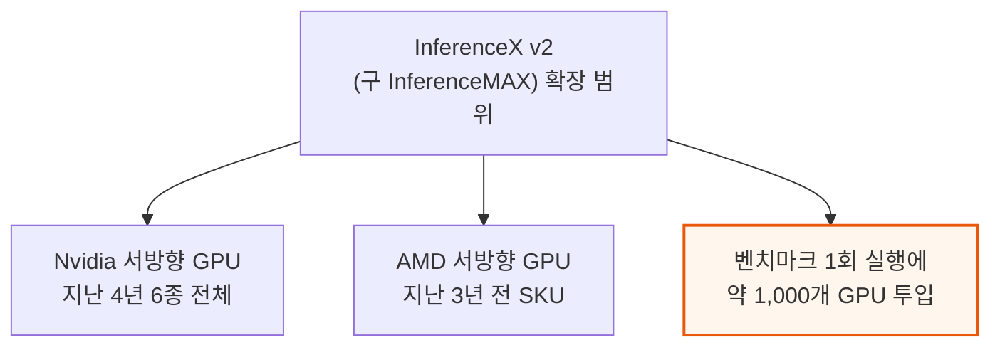

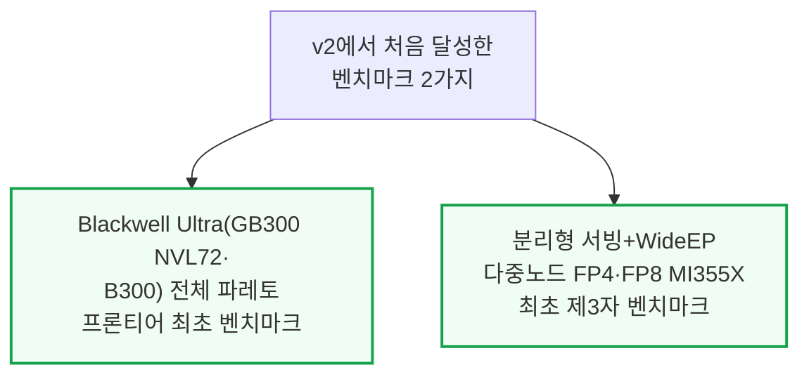

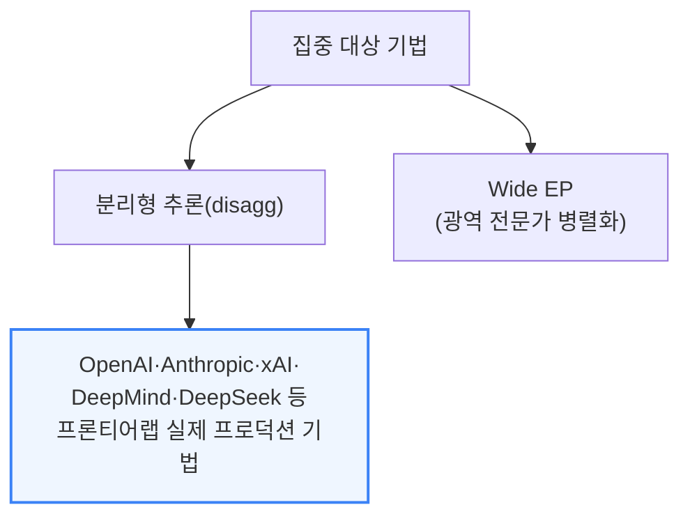

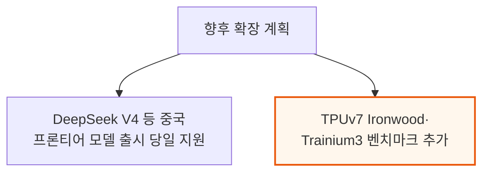

---

## 2. 핵심 관찰 결과 요약

**📌 핵심:**
- FP8 조건에서 **AMD의 MI355X(SGLang, 분리형+WideEP)는 Nvidia B200(SGLang)과 견줄 만한 성능당비용**을 달성 — 다만 Nvidia의 주력 엔진인 TRT-LLM(Dynamo)과 비교하면 여전히 격차가 큼. 단일노드(비분리형) 서빙에서는 AMD SGLang이 오히려 Nvidia SGLang보다 나은 성능당비용을 보이는 경우도 확인
- 그러나 프론티어 랩들이 실제로 쓰는 **"FP4 + 분리형 서빙 + Wide EP" 3종 최적화를 동시에 결합**하면 AMD 성능이 Nvidia와 경쟁이 안 될 정도로 급락 — 개별 최적화는 각각 잘 작동하지만 여러 개를 합치면 성능이 기대에 못 미치는 **조합성(Composability)** 문제가 AMD의 핵심 약점으로 지목됨
- Nvidia는 최신 추론 기법(분리형 프리필+WideEP+FP4)이 모두 걸린 조건에서 SGLang·TRT-LLM 양쪽 엔진 모두, B200·B300은 물론 랙스케일 GB200/GB300 NVL72까지 압도적 우위 — 에너지 효율(토큰당 피코줄) 면에서도 전 워크로드에 걸쳐 Nvidia가 크게 앞섬
- 결론: **GB300 NVL72는 강력한 H100 분리형+WideEP+MTP 기준선 대비 FP8 대 FP4 비교에서 최대 100배**, FP8 대 FP8 비교에서도 최대 65배 성능 우위 — H100 대 GB200 NVL72 비교에서도 상호작용성 75 tok/s/user 기준 최대 55배 격차가 확인돼, 랙스케일 Blackwell이 Hopper 세대를 완전히 압도

---

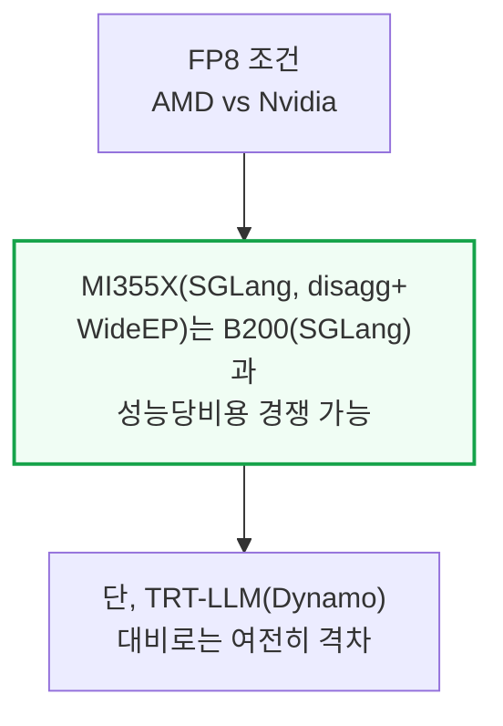

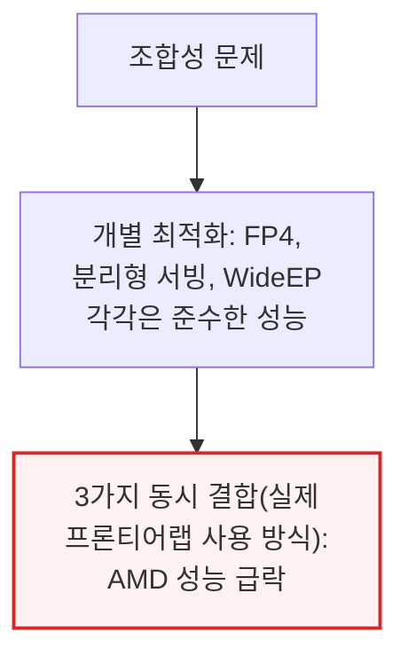

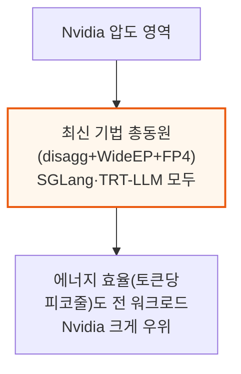

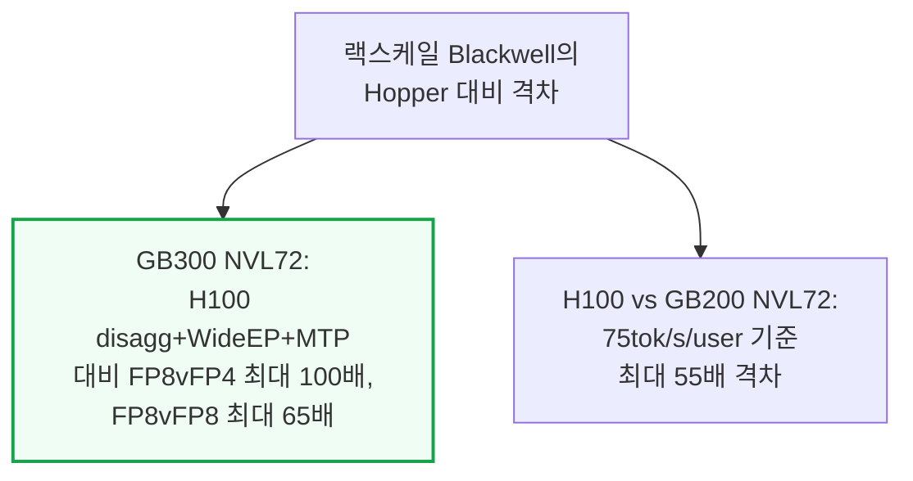

---

## 3. 핵심 개념 정리 - 상호작용성·프리필/디코드·TP·EP·DP

**📌 핵심:**
- **상호작용성(tok/s/user)**은 사용자 한 명이 토큰을 받는 속도(출력 토큰당 시간의 역수), **처리량(tok/s)**은 시스템 전체가 만드는 총 토큰 수 — 요청을 배치로 묶을수록 처리량은 늘지만 요청 하나당 배정되는 연산은 줄어 속도가 느려짐(지하철버스 vs 레이싱카 비유: 버스는 승객 다수에게 비용을 나눠 저렴하지만 정차가 잦고, 레이싱카는 1\~2명에게 빠르지만 훨씬 비쌈)
- 추론은 **프리필**(요청의 첫 순전파, 모든 토큰을 병렬 처리하는 연산 집약 단계, KV캐시를 채움)과 **디코드**(토큰을 하나씩 생성, 매번 KV캐시 전체를 HBM에서 불러오는 메모리 대역폭 집약 단계)로 구성 — 같은 엔진에서 두 단계를 같이 처리하면 프리필이 디코드 배치를 계속 방해해 전체 성능이 떨어짐
- **분리형 프리필(Disaggregated Prefill)**은 프리필과 디코드를 서로 다른 GPU 풀에 배정해 각각 독립적으로 튜닝·확장할 수 있게 하는 기법
- 결론: 모델을 여러 GPU에 나누는 3대 기본 전략 — **TP(텐서 병렬)**는 저배치에서 상호작용성을 극대화하지만 매 계층 all-reduce 통신 필요, **EP(전문가 병렬)**는 MoE의 희소성을 활용해 통신은 저렴(all-to-all)하지만 저배치에서 부하 불균형 발생, **DP(데이터 병렬)**는 모델(또는 어텐션 등 일부)을 복제해 여러 GPU 그룹에 나누는 가장 단순한 방식이지만 대규모에서는 가중치 중복 로딩이 낭비

---

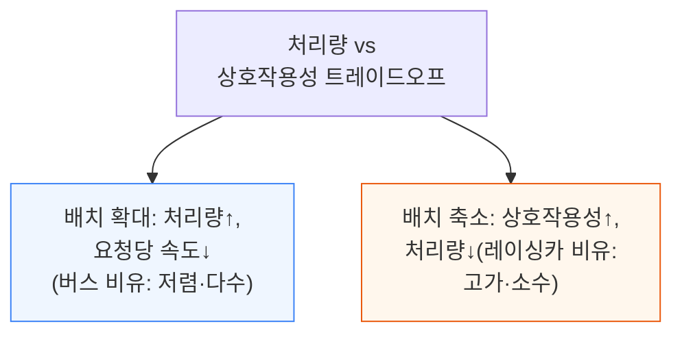

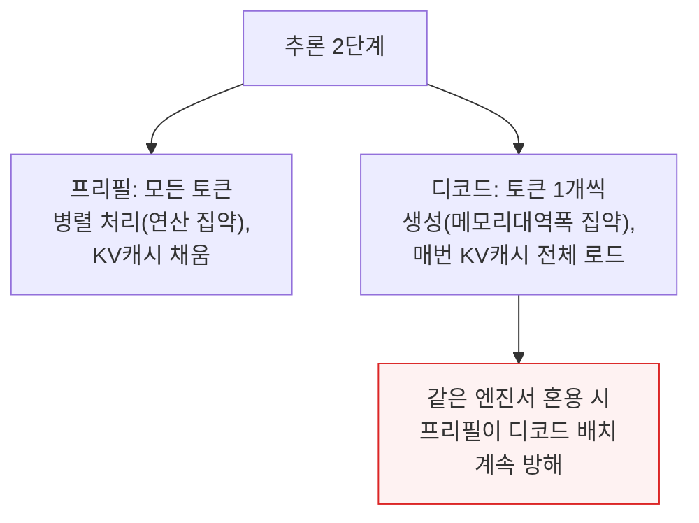

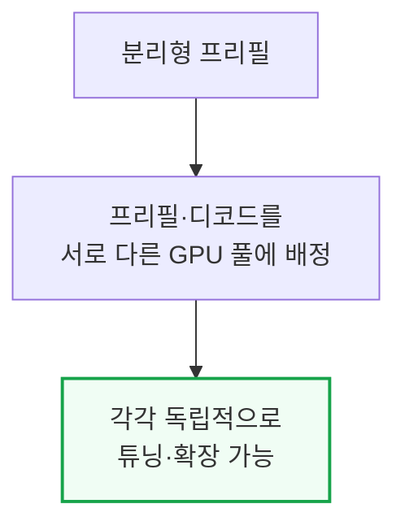

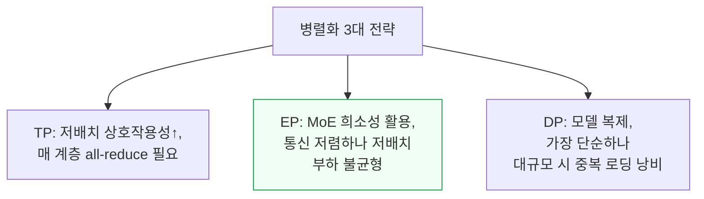

---

## 4. 시간 경과에 따른 소프트웨어 개선 추적

**📌 핵심:**
- InferenceX의 핵심 목적 중 하나는 **소프트웨어 개선 속도를 시각화**하는 것 — 칩은 연 단위로 출시되지만 소프트웨어는 주 단위로 갱신되므로, 최신 레시피를 지속 반영해 재벤치마크
- **AMD의 개선 속도가 가장 극적** — SGLang 기반 DeepSeek R1 FP4는 동일 상호작용성 기준 2개월도 안 되는 기간(2025년 12월\~2026년 1월)에 처리량이 거의 2배로 향상, 이는 AMD가 포크한 SGLang 이미지의 개선 사항을 공식 SGLang 이미지로 업스트림하도록 SemiAnalysis가 압박한 결과이기도 함
- **Nvidia는 상대적으로 안정적** — B200 SGLang은 같은 기간 소폭 개선에 그쳤고, H200 TRT-LLM 단일노드는 4개월간(10월 이후) 성능 변화가 거의 없었는데, 이는 Hopper 지원이 출시 첫날부터 우수해 이미 이론적 피크치에 근접했기 때문(개선 여지가 원래 적음)
- 결론: **GB200 Dynamo TRT-LLM 분리형 서빙**은 한 달 조금 넘는 기간 동안 최대 처리량이 20% 증가(중간 상호작용성 구간의 개선은 Wide EP 커널이 성숙해진 결과로 추정) — **MI355X는 AMD의 신규 통신 라이브러리 MoRI 도입**으로 20\~45 tok/s/user 구간에서 GPU당 처리량이 한 달여 만에 20% 이상 향상

---

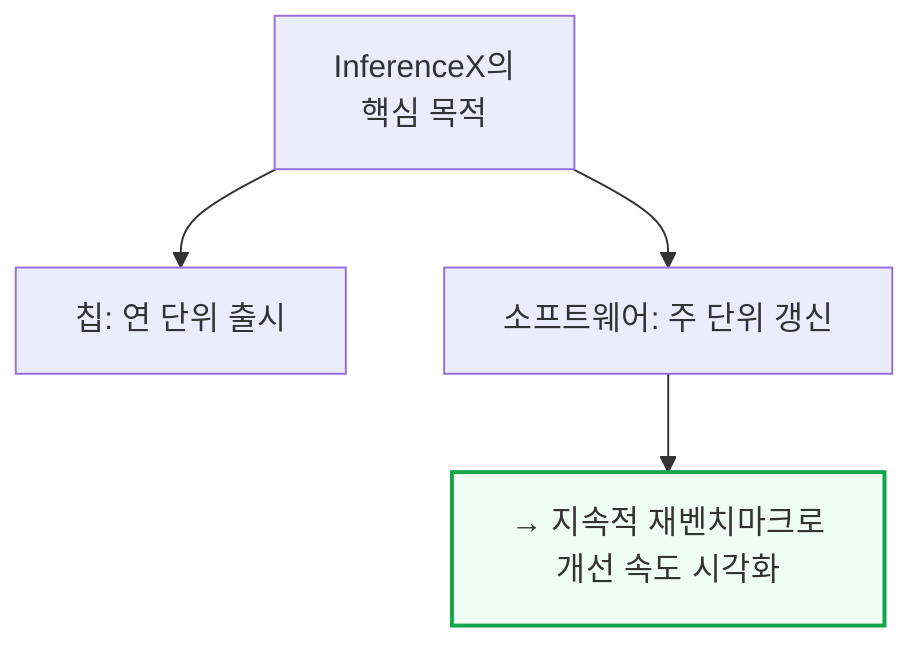

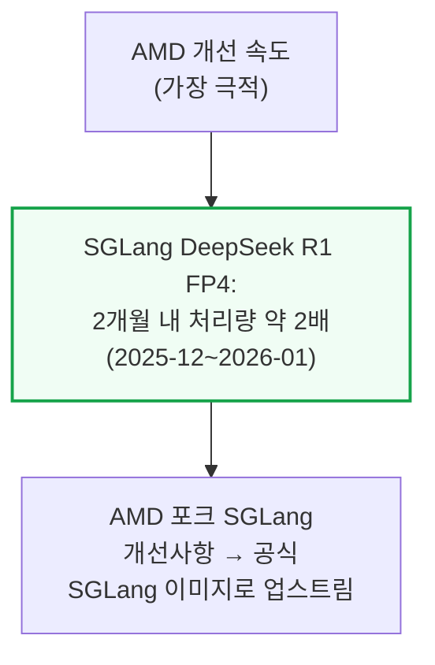

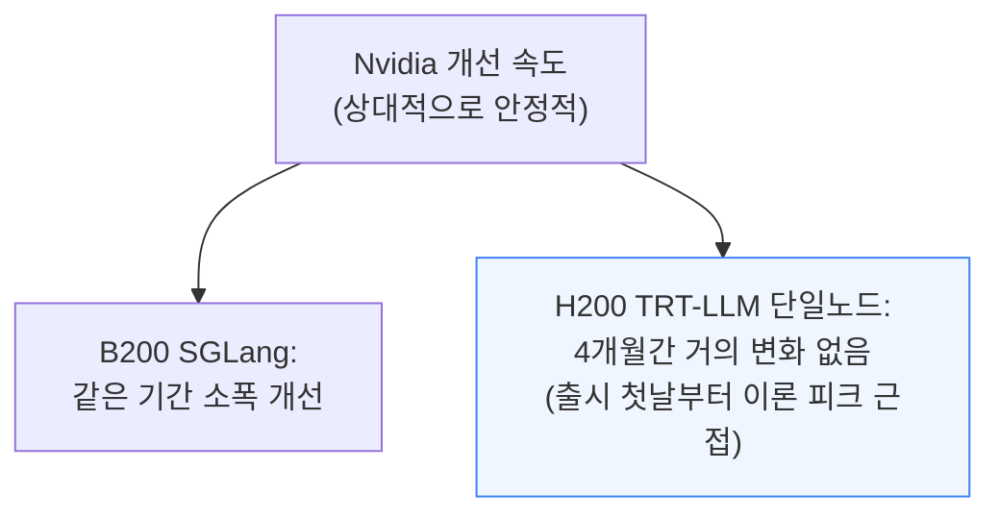

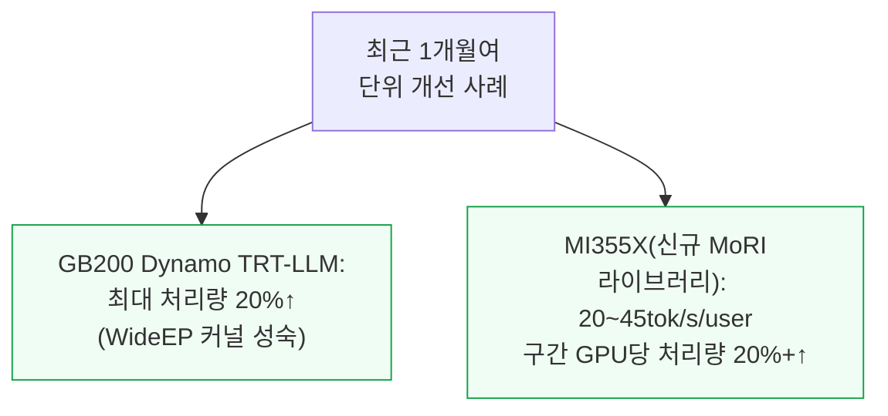

---

## 5. 분리형 서빙 프레임워크와 DeepSeek Disagg+WideEP 심층분석

**📌 핵심:**
- **Nvidia는 Dynamo**를 분리형 추론 프레임워크로 사용 — 다중노드 분산 추론에 특화된 엔진 독립적(agnostic) 프레임워크로, 프리필-디코드 분리·요청 라우팅·KV캐시 오프로딩을 지원하며 SGLang·TRT-LLM을 백엔드로 자유롭게 조합
- **AMD는 SGLang 기반에 두 가지 KV캐시 전송 프레임워크**를 사용 — **MoRI**(AMD의 RDMA·GPU 통합 특화 고성능 통신 인터페이스, 중국 기반 엔지니어링 팀이 처음부터 새로 설계, 기존처럼 Nvidia NCCL을 포크한 RCCL과 다른 접근)와 최근 PyTorch 생태계에 합류한 **Mooncake**(프리필-디코드 분리와 장애 허용 다중노드 기능 지원)
- 거의 모든 상호작용성 구간에서 **분리형 추론이 집계형(단일노드) 추론보다 GPU당 총 토큰 처리량이 높음** — 다만 **MI355X는 저상호작용성·고배치 구간에서만 분리형이 집계형을 능가**(FP4 전반에 걸쳐 나타나는 패턴으로, ROCm 커널 최적화 부족이 원인으로 추정)
- 결론: FP4에서 분리형+WideEP를 결합하면 **이론상 MI355X가 단일노드보다 훨씬 나아야 하지만, 실제로는 고상호작용성 구간에서 오히려 더 나쁜 성능**을 보임 — 여러 최신 최적화를 동시에 조합했을 때 ROCm 소프트웨어 스택의 커널·집단통신 최적화가 따라가지 못하는 조합성 문제의 구체적 사례

---

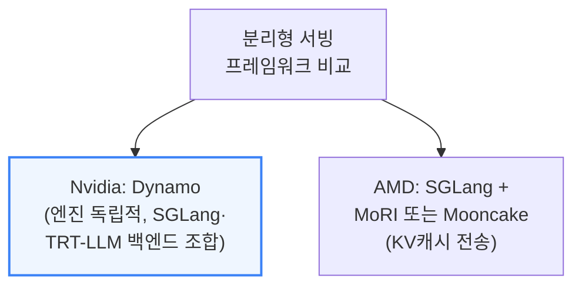

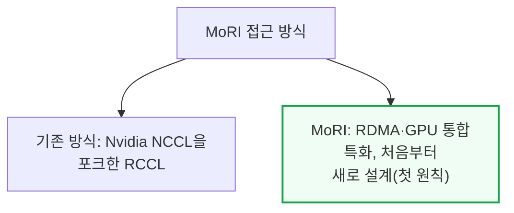

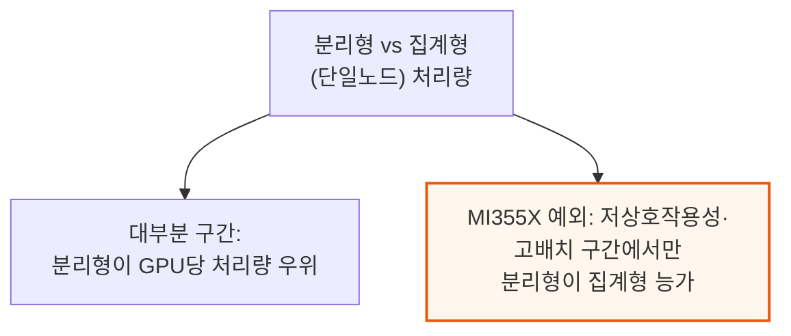

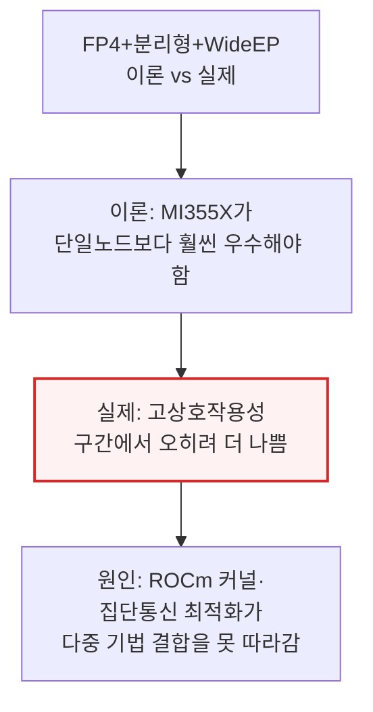

---

## 6. Nvidia TensorRT-LLM과 NVL72의 압도적 성능

**📌 핵심:**
- **TensorRT-LLM은 이미 TogetherAI 등 프로바이더에서 시간당 수십억 토큰**을 서빙하는 검증된 엔진 — GB200·GB300 NVL72에서 특히 강점을 발휘해 고처리량 구간에서 **2배 이상의 성능**을 이끌어내고, MTP를 켜면 칩의 잠재력을 한층 더 끌어냄
- NVL72의 넓은 스케일업 월드사이즈(72 GPU)가 주는 이점은 상호작용성이 낮을 때(고배치) 가장 크게 나타남 — 상호작용성 60 tok/s/user 고정 시 **GB200 NVL72의 GPU당 토큰생성 속도가 B200(8 GPU 스케일업)의 거의 3배**
- 다만 이 격차는 상호작용성이 높아질수록(배치가 작아질수록) 줄어듦 — **130 tok/s/user에서는 GB200 NVL72의 이점이 거의 사라지고, 오히려 백만토큰당 비용은 B200보다 비싸짐**(워크로드가 작아지면 단일 HGX 노드(8 GPU)의 NVLink 도메인 안에 다 들어가버려 NVL72의 대규모 스케일업 이점이 무의미해지기 때문)
- 결론: 랙스케일 아키텍처의 이점은 **모든 상호작용성 구간에서 균일하지 않고, 저상호작용성·고배치 워크로드에서 가장 강력** — 고상호작용성 워크로드에서는 오히려 소형 노드가 비용 효율적일 수 있어, "무조건 큰 랙이 유리하다"는 통념과 다른 결론

---

```mermaid
flowchart TD
    TRT2["TensorRT-LLM 실전 검증"] --> Volume["TogetherAI 등에서<br/>시간당 수십억 토큰 서빙"]
    Volume --> NVL72Boost["GB200·GB300 NVL72에서<br/>고처리량 구간 2배 이상<br/>성능(+MTP로 추가 향상)"]

    style NVL72Boost fill:#f0fdf4,stroke:#16a34a,stroke-width:2px
```

```mermaid
flowchart TD
    WorldSize["NVL72 스케일업<br/>이점의 상호작용성별 변화"] --> Low2["60tok/s/user(저상호작용성,<br/>고배치): GB200이<br/>B200 대비 거의 3배"]
    WorldSize --> High2["130tok/s/user(고상호작용성):<br/>이점 거의 소멸,<br/>오히려 GB200이 더 비쌈"]

    style Low2 fill:#f0fdf4,stroke:#16a34a,stroke-width:2px
    style High2 fill:#fff7ed,stroke:#ea580c,stroke-width:2px
```

```mermaid
flowchart TD
    WhyShrink["격차가 줄어드는 이유"] --> SmallBatch2["고상호작용성 = 소배치<br/>→ 워크로드가 단일<br/>HGX 노드(8GPU) 안에 다 들어감"]
    SmallBatch2 --> Irrelevant["NVL72의 72GPU<br/>스케일업 이점이<br/>무의미해짐"]

    style Irrelevant fill:#fff7ed,stroke:#ea580c,stroke-width:2px
```

```mermaid
flowchart TD
    Lesson2["랙스케일 이점의<br/>비균일성"] --> LowBest["저상호작용성·고배치:<br/>랙스케일이 압도적 유리"]
    Lesson2 --> HighBest["고상호작용성·소배치:<br/>소형 노드가 오히려<br/>비용 효율적일 수 있음"]

    style HighBest fill:#eff6ff,stroke:#3b82f6,stroke-width:2px
```

---

*작성 진행률: 약 40% 완료 (15개 섹션 중 6개 완료)*
*업데이트: 4\~6장(시간 경과에 따른 소프트웨어 개선 추적, 분리형 서빙 프레임워크·DeepSeek 심층분석, TensorRT-LLM·NVL72 압도적 성능) 작성 완료*
