# InferenceMAX™: Open Source Inference Benchmarking

> **출처**: [SemiAnalysis Newsletter](https://newsletter.semianalysis.com/p/inferencemax-open-source-inference)
> **저자**: Kimbo Chen, Dylan Patel, Daniel Nishball
> **발행일**: 2026-02-05

---

## 📑 목차

### 전체 섹션
 1. [개요 - InferenceMAX란 무엇인가](#1-개요---inferencemax란-무엇인가)
 2. [처리량-지연시간 트레이드오프와 파레토 프론티어](#2-처리량-지연시간-트레이드오프와-파레토-프론티어)
 3. [벤치마크 방법론](#3-벤치마크-방법론)
 4. [DeepSeek R1 서빙 전략 상세 - 분리형 서빙, Wide EP, MTP](#4-deepseek-r1-서빙-전략-상세---분리형-서빙-wide-ep-mtp)
 5. [아키텍처와 CI/CD 인프라](#5-아키텍처와-cicd-인프라)
 6. [처리량 vs 지연시간 벤치마크 결과](#6-처리량-vs-지연시간-벤치마크-결과)
 7. [TCO/백만토큰 벤치마크 결과](#7-tco백만토큰-벤치마크-결과)
 8. [MW당 토큰처리량(전력효율) 벤치마크 결과](#8-mw당-토큰처리량전력효율-벤치마크-결과)
 9. [트러블슈팅 - AMD·Nvidia 버그와 CI/CD 인프라 이슈](#9-트러블슈팅---amdnvidia-버그와-cicd-인프라-이슈)
10. [권고사항과 InferenceMAX 다음 단계](#10-권고사항과-inferencemax-다음-단계)
11. [하이퍼스케일러 TCO 상세 비교 - 세대별 서버가와 성능당비용](#11-하이퍼스케일러-tco-상세-비교---세대별-서버가와-성능당비용)

---

## 🔑 용어 정리

본문을 순서대로 읽기 전에 알아두면 좋은 용어들입니다. 자세한 수치와 설명은 본문에서 처음 등장하는 위치에 나옵니다.

- **처리량(Throughput) vs 상호작용성(Interactivity)**: 처리량은 GPU 하나가 초당 처리하는 토큰 수(tok/s/gpu), 상호작용성은 사용자 한 명이 체감하는 토큰 생성 속도(tok/s/user) — 배치를 키우면 처리량은 늘지만 사용자 체감 속도는 떨어지는 근본적 트레이드오프 관계
- **파레토 프론티어(Pareto Frontier)**: 처리량-지연시간 두 축에서 "다른 쪽을 희생하지 않고는 더 나아질 수 없는" 최적점들을 이은 곡선 — 벤치마크 결과를 비교할 때 이 곡선이 왼쪽 위(더 빠르고 더 반응성 좋음)에 있을수록 우수
- **TCO per Million Tokens(백만 토큰당 총소유비용)**: 절대 성능이 아니라 실제 운영비까지 반영한 토큰 하나당 비용 — 이 벤치마크 시리즈가 "진짜 중요한 지표"로 삼는 최종 잣대
- **분리형 서빙(Disaggregated Serving)**: 추론의 두 단계(프리필=입력 처리, 디코드=출력 생성)를 서로 다른 GPU 자원에 나눠 맡기는 방식 — 두 단계가 서로 자원을 놓고 다투지 않아 안정적 응답속도 보장에 유리
- **Wide EP(광역 전문가 병렬화)**: MoE(전문가 혼합) 모델의 전문가 계층을 여러 GPU에 넓게 분산 배치하는 기법 — 메모리 사용량은 줄지만 통신 부담은 늘어남
- **MTP(Multi-Token Prediction, 멀티 토큰 예측)**: 한 번의 순전파로 토큰을 여러 개 동시에 예측하도록 훈련하는 기법 — 품질 손실을 거의 없이 추론 처리량을 크게 끌어올림

---

## 1. 개요 - InferenceMAX란 무엇인가

**📌 핵심:**
- LLM 추론 성능은 **하드웨어**(신형 GPU·XPU 출시마다 연 단위로 계단식 도약)와 **소프트웨어**(SGLang·vLLM·TensorRT-LLM·CUDA·ROCm이 며칠 단위로 지속 개선) 두 축이 함께 결정 — 문제는 특정 시점에 찍은 벤치마크는 소프트웨어가 며칠만 지나도 금세 낡은 정보가 된다는 것
- **InferenceMAX™**는 이 문제를 풀기 위한 오픈소스 자동화 벤치마크 — 매일 밤 수백 개 칩에서 최신 오픈소스 추론 프레임워크·모델 조합을 재실행해 실시간에 가깝게 성능 추이를 추적(대시보드 무료 공개: inferencemax.ai)
- v1 대상 칩은 **GB200 NVL72, B200, MI355X, H200, MI325X, H100, MI300X 7종** — 향후 2개월 내 Google TPU·AWS Trainium까지 추가해 AMD·Nvidia·커스텀 ASIC을 아우르는 최초의 완전 멀티벤더 오픈 벤치마크로 확장 예정
- 결론: 특정 벤더를 편들지 않는 **중립 벤치마크**로 설계돼, 워크로드·상호작용성 구간에 따라 AMD가 우위인 경우와 Nvidia가 우위인 경우가 둘 다 나타남 — OpenAI·Microsoft·PyTorch Foundation·AMD·Nvidia 등 업계 전반이 이례적으로 한목소리로 지지를 표명(경쟁사인 AMD·Nvidia CEO가 동시에 같은 프로젝트를 공개 지지하는 것 자체가 이 벤치마크의 신뢰도를 방증)

---

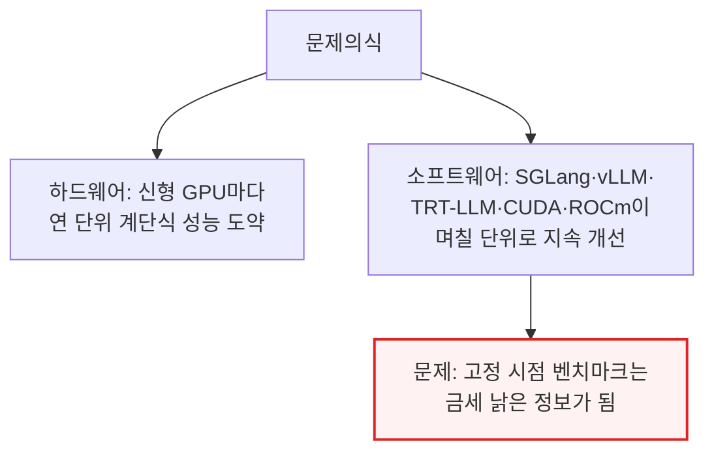

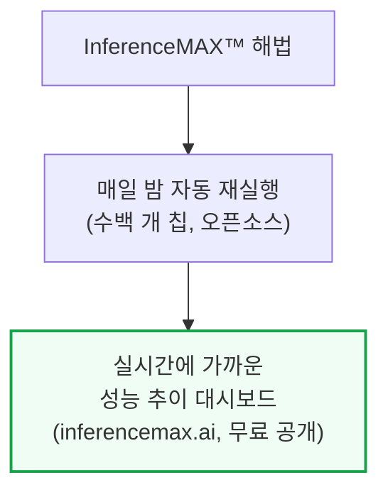

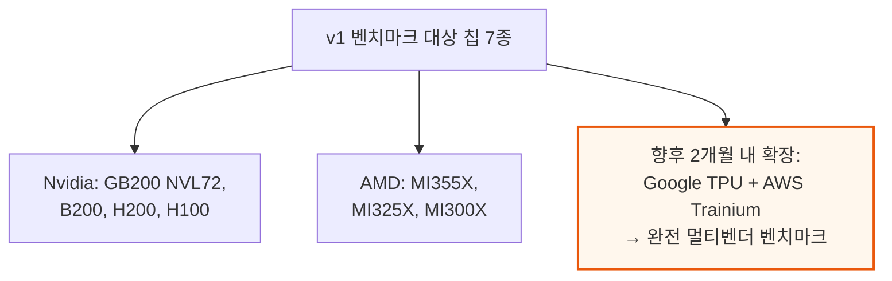

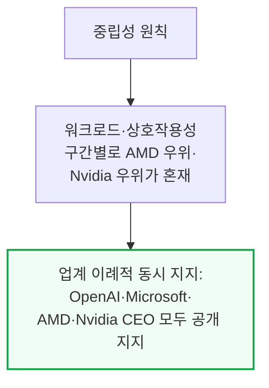

주요 지지자들의 코멘트를 요약하면, Nvidia(Jensen Huang·Ian Buck)는 "GB200 NVL72가 달러당·메가와트당 최고 성능을 낸다"는 점을, AMD(Lisa Su·Anush Elangovan)는 "소프트웨어 개선 속도가 그대로 벤치마크에 반영된다"는 점을 각각 강조합니다. OpenAI·Microsoft·Oracle·CoreWeave·Nebius·TensorWave·Vultr 등 컴퓨트 대형 구매자와 vLLM·PyTorch Foundation 등 오픈소스 진영도 "투명하고 재현 가능한 데이터가 업계 전체의 의사결정을 돕는다"는 공통된 취지로 지지를 표명했습니다.

---

## 2. 처리량-지연시간 트레이드오프와 파레토 프론티어

**📌 핵심:**
- LLM을 대규모로 서빙할 때 근본적인 트레이드오프는 **처리량(GPU당 초당 토큰 수)과 상호작용성(사용자당 초당 토큰 수)** 사이에 있음 — 배치(한 번에 처리하는 요청 수)를 키우면 GPU 활용률은 올라가 처리량은 늘지만, 자원이 더 많은 요청에 나뉘어 개별 사용자 체감 속도(상호작용성)는 떨어짐
- 이 트레이드오프는 시간당 $비용으로 GPU를 소유·임대하는 구조 때문에 **비용과 직결** — 상호작용성이 높아질수록(개별 사용자를 더 빠르게 응대할수록) 시간당 처리 가능한 총 토큰 수가 줄어 백만 토큰당 비용이 오르므로, 높은 반응속도를 요구하는 서비스는 더 비싼 단가를 매겨야 함
- 버스 vs 페라리 비유: 총소유비용은 비슷해도 버스는 수십 명에게 비용을 나눠 저렴하게 태우고, 페라리는 1\~2명에게만 즉각적이고 프리미엄한 서비스를 제공 — LLM 서빙도 동일한 제약을 받음
- 결론: 처리량·지연시간 두 축에서 "다른 쪽을 희생하지 않고는 더 나아질 수 없는" 지점들(**파레토 최적점**)을 이은 선이 **파레토 프론티어**이며, 이 곡선이 왼쪽 위로 이동할수록(더 빠르면서 더 저렴할수록) 해당 하드웨어·소프트웨어 조합이 우수하다는 뜻

---

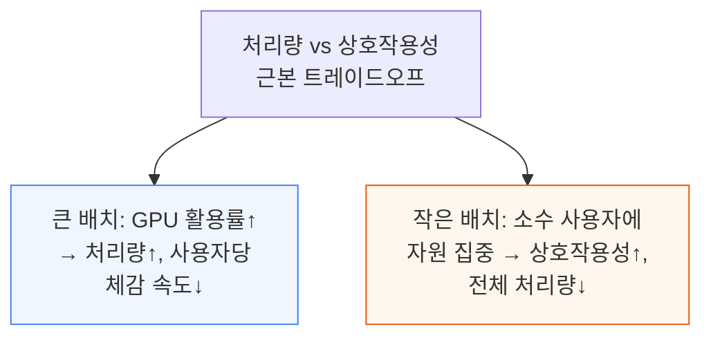

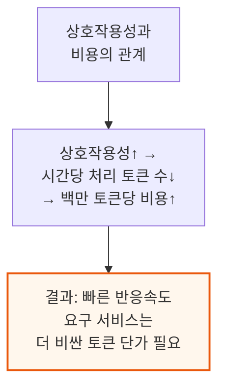

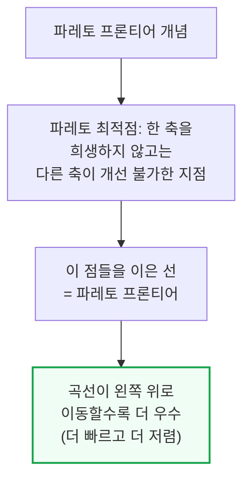

---

## 3. 벤치마크 방법론

**📌 핵심:**
- 벤치마크 서버는 **vLLM·SGLang·TRT-LLM**(모델별로 다르게 사용) 중 하나로 구성하고, 벤치마크 클라이언트는 vLLM 벤치마크 스크립트(vLLM 의존성 제거판)로 요청을 보내 지표를 수집 — 프리픽스 캐싱(입력이 겹치는 요청을 재활용하는 최적화)의 영향을 배제하기 위해 요청을 무작위 시퀀스로 구성
- 입력/출력 길이는 **3가지 시나리오**로 수렴: 채팅(입력 1,024/출력 1,024), 추론(입력 1,024/출력 8,192), 요약(입력 8,192/출력 1,024) — 각 요청의 입력 길이는 지정값의 80\~100% 범위에서 무작위로 변동시켜 실제 요청 패턴을 모사
- 모델 3종 선정 기준: **Llama3 70B**(조밀 기업용 모델 대표), **DeepSeek R1 670B**(연산강도·파라미터 구조가 OpenAI GPT-4o/5 내부 아키텍처와 가장 유사한 MoE 대리 모델), **GPT-OSS 120B**(GPT-5 mini급 소형 MoE 대리 모델) — "SGLang vs vLLM 전쟁"의 재점화를 막기 위해 모델별로 기본 엔진을 사전 지정(DeepSeek는 SGLang, Llama3\~GPT-OSS는 vLLM)
- 결론: **워밍업(사전 예열) 허용 여부를 명확히 정하지 않았던 초기 실수**로 Nvidia SGLang DeepSeek 제출물에만 워밍업이 포함된 사실이 뒤늦게 발견 — AMD·Nvidia·SemiAnalysis 3자 협의 끝에 당분간 워밍업을 금지하고 대신 DeepSeek 벤치마크 길이를 최대 5배 늘려 공정성을 확보(실제 프로덕션에서는 쿠버네티스가 파드를 정상으로 표시하기 전에 워밍업이 이뤄지는 경우가 많아, 이 규칙은 출시 후 재검토 예정)

---

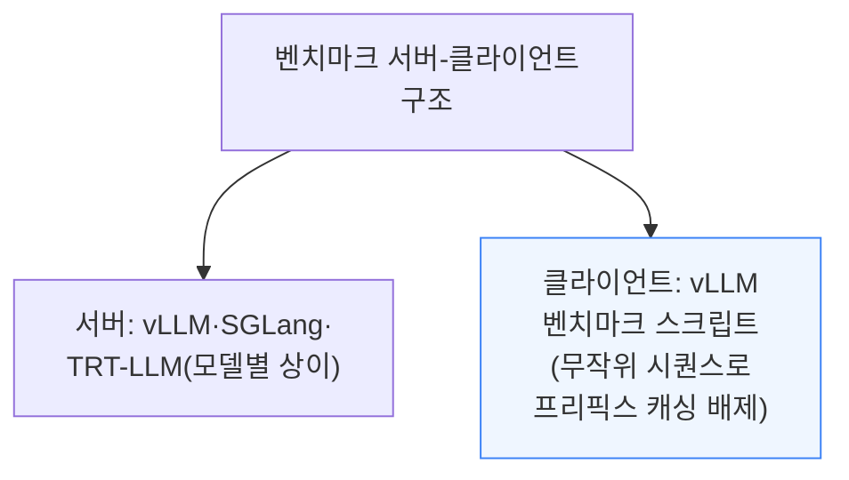

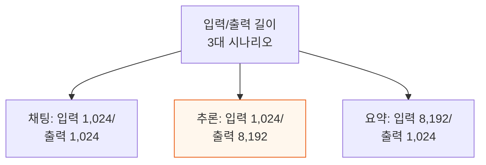

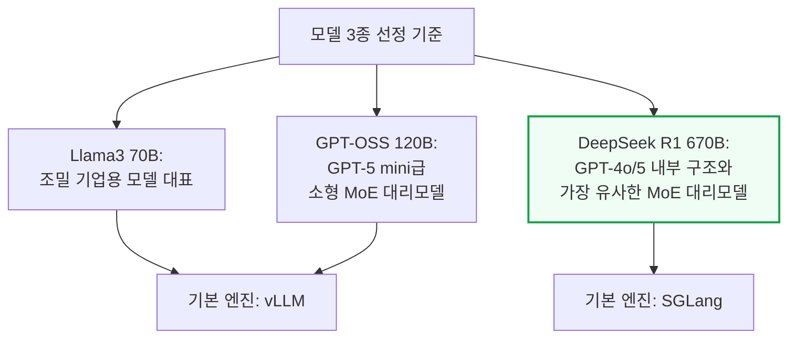

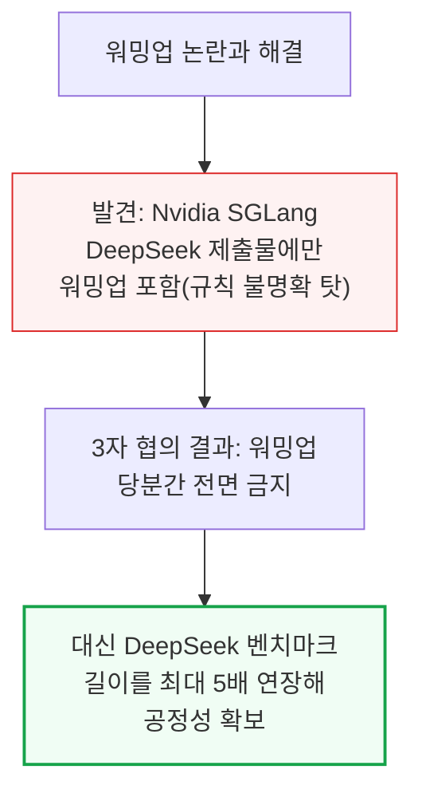

---

## 4. DeepSeek R1 서빙 전략 상세 - 분리형 서빙, Wide EP, MTP

**📌 핵심:**
- **분리형 서빙(Disaggregated Serving)**: 추론의 프리필(입력 처리)과 디코드(출력 생성) 두 단계를 서로 다른 GPU 자원에 나눠 맡겨, 두 단계가 자원을 놓고 다투지 않게 함 — 특히 동시 요청이 많을 때 서비스 품질 보장(SLA)에 유리
- **Wide EP(광역 전문가 병렬화)**는 DeepEP 기술로 구현 — 일반 모드는 프리필 단계 처리량 개선에, 저지연 모드는 디코드 단계 지연시간 단축에 특화된 두 가지 디스패치 방식 제공
- **MTP(멀티 토큰 예측)**: DeepSeek R1이 학습 단계에서부터 추가 모듈로 한 번에 여러 토큰을 예측하도록 훈련 — DeepSeek 측 설명으로는 모델의 "계획 능력"까지 향상시키며, 추론 시에도 품질 손실 거의 없이 처리량을 끌어올림
- 결론: SGLang은 DeepSeek R1 서빙에 텐서 병렬(TP)·데이터 병렬(DP)·전문가 병렬(EP)을 조합 — DeepSeek R1이 쓰는 MLA(멀티 잠재 어텐션)는 KV 헤드가 1개뿐이라 일반적인 TP 분할 시 KV캐시가 중복되는 문제가 있어, 저상호작용성 구간에서는 배치 차원으로 나누는 데이터 병렬 어텐션을 대신 사용해 이 중복을 없앰

---

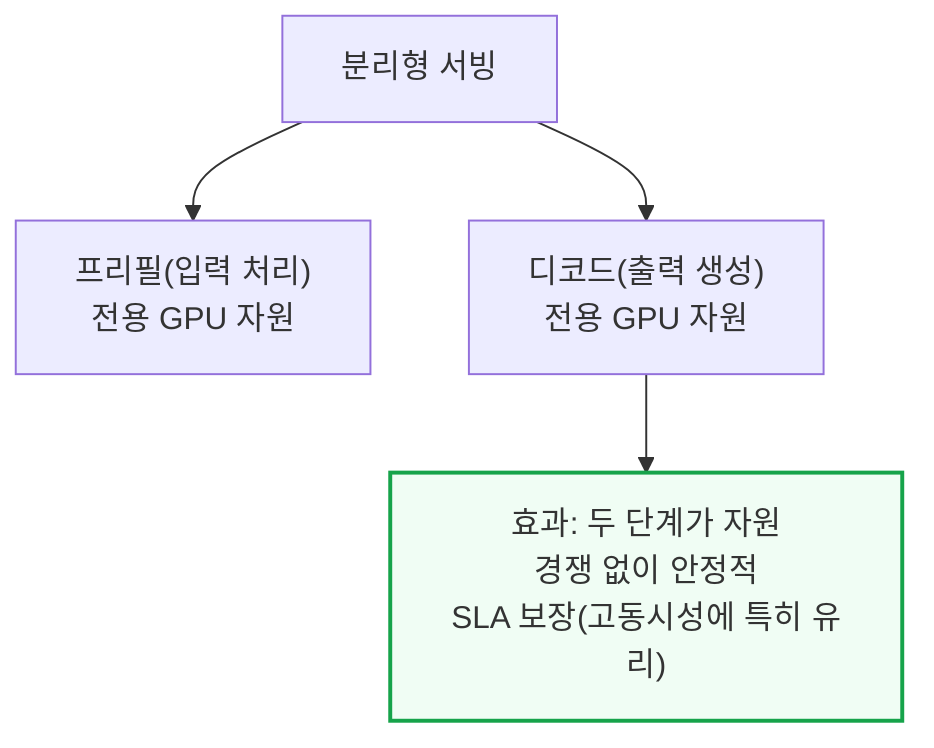

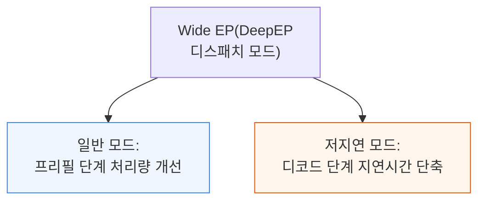

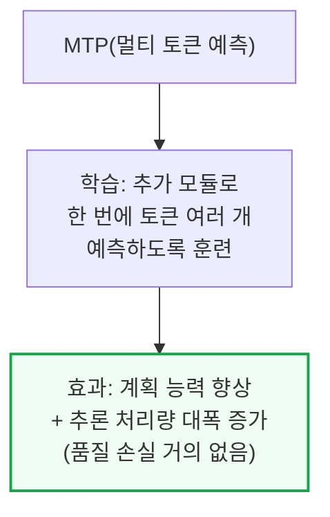

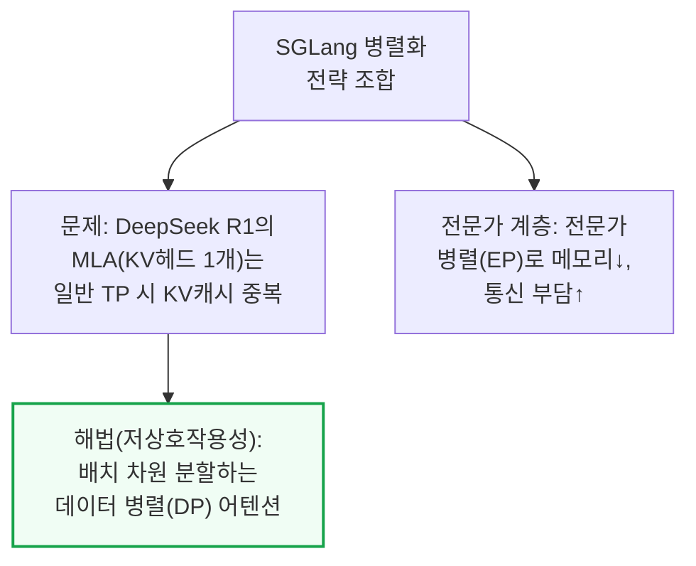

---

## 5. 아키텍처와 CI/CD 인프라

**📌 핵심:**
- InferenceMAX™는 **GitHub Actions**로 벤치마크 실행을 오케스트레이션 — GPU 서버를 셀프호스팅 러너로 등록해두면, 각 벤치마크 설정이 하나의 잡(job)으로 러너에서 실행(Docker 또는 SLURM 사용)
- 병렬화 전략과 최대 동시성(concurrency) 스윕을 파라미터화된 워크플로로 정의하고, 모델·GPU·입출력 길이 조합별로 워크플로를 조립
- 조합 폭발 문제: 모델 3종 × GPU 최대 7종 × 입출력 길이 3종 × 정밀도 2종 × 동시성·병렬화 옵션 약 4×4 = 최악의 경우 **2,016개** 개별 잡 발생
- 결론: GitHub Actions 자체 한계에도 부딪힘 — 워크플로 하나에 잡이 약 1,500개를 넘으면 DAG(작업 흐름도) 렌더링이 10초 만에 타임아웃돼 디버깅이 사실상 불가능해져, 야간 워크플로 하나를 입출력 길이 기준으로 3개로 쪼개 워크플로당 약 500개로 낮춤(추가로 `download-artifacts@v5` 액션에는 아티팩트 1,000개 하드리밋이 있어 이 역시 우회 필요)

---

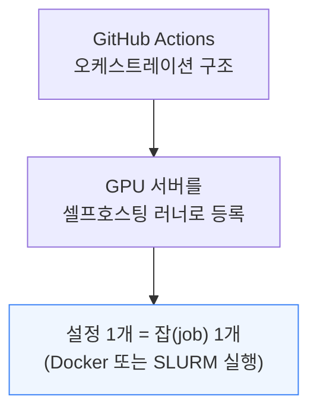

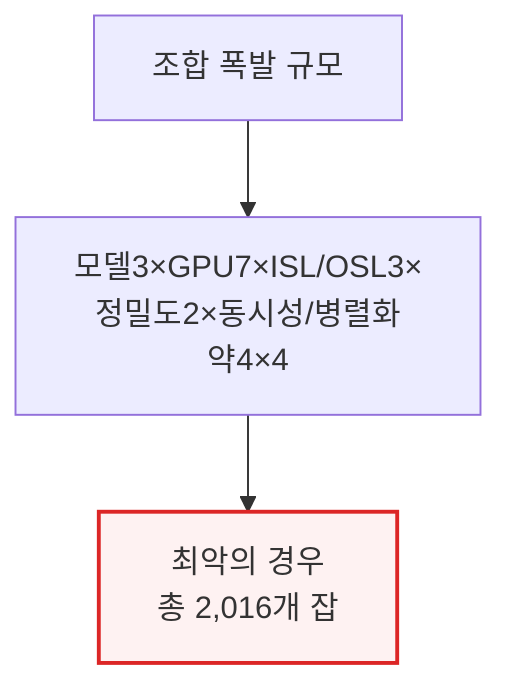

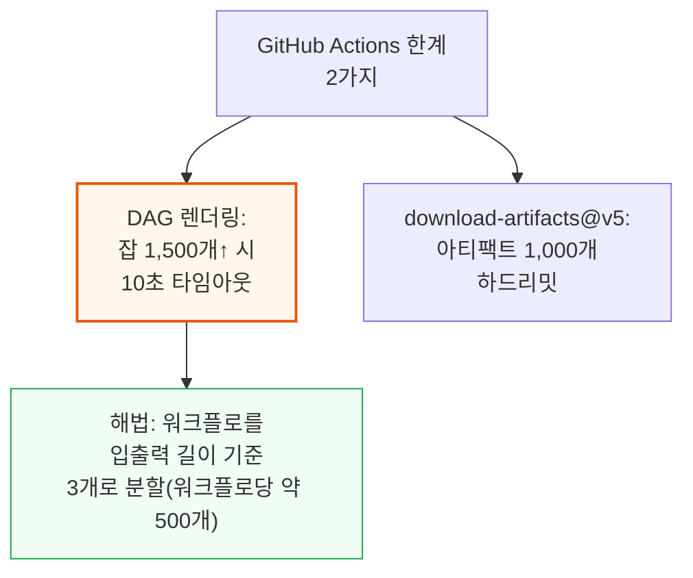

---

## 6. 처리량 vs 지연시간 벤치마크 결과

**📌 핵심:**
- 처리량-지연시간 그래프를 해석할 때는 **실사용 구간**에 주목해야 함 — 예를 들어 초당 5토큰처럼 챗봇에 쓰기엔 너무 느린 구간에서의 격차는 실질적 의미가 거의 없음(TCO 정규화 결과는 7장에서 별도로 다룸)
- 세대 내 비교(Hopper vs CDNA3, Blackwell vs CDNA4)에서 **저상호작용성 구간은 메모리 대역폭·용량이 풍부한 AMD가 강세**, 반면 **FP4처럼 최신 저정밀 포맷·랙스케일 집단연산이 걸린 구간은 Nvidia가 강세** — 두 진영 모두 특정 조건에서 우위를 점하는 혼재된 양상
- DeepSeek 670B MoE 같은 대형 추론에서는 **소프트웨어 성숙도 격차가 하드웨어 스펙 격차보다 크게 작용** — AMD SGLang 스택은 아직 최적화 여지가 많고, Nvidia GB200 NVL72 랙스케일 추론도 Dynamo 팀의 최적화가 아직 일부 구간에만 적용된 상태
- 결론: **MTP(멀티 토큰 예측)**을 켜면 70\~140 tok/s/user 구간에서 동일 상호작용성 기준 처리량이 최대 2\~3배 향상 — 소프트웨어 기법 하나가 세대 간 하드웨어 격차만큼 큰 영향을 줄 수 있음을 보여주는 사례

---

아래 표는 주요 워크로드별 처리량-지연시간 비교 결과를 정리한 것입니다(각 항목은 독립적인 벤치마크 비교이며 인과관계로 이어지지 않음).

| 워크로드 | 비교 대상 | 결과 |
|---|---|---|
| Llama3.3 70B FP8(추론) | H100 vLLM vs MI300X ROCm vLLM | MI300X가 저상호작용성(20\~30 tok/s/user) 구간에서 강세(메모리 대역폭·용량 우위, TP1 기준) |
| GPT-OSS 120B MX4(요약) | H200 vs MI325X | MI325X가 110 tok/s/user 미만에서 우위, 그 이상에서도 경쟁력 유지 |
| Llama 70B FP4(전 워크로드) | B200 vs MI355X | B200이 전 구간 압도 → AMD FP4 커널 최적화 여지 큼 |
| GPT-OSS 120B(TCO 정규화) | B200 vs MI355X | MI355X가 TCO 기준 경쟁력, 실사용 구간(150\~200 tok/s/user)에서 격차 15초 이내 |
| DeepSeek 670B MoE FP8 | H200/B200 SGLang vs MI325X/MI355X SGLang | Nvidia가 동일 처리량 기준 지연시간 약 40% 낮음, AMD SGLang 최적화 여지 큼(ROCm AITER 통합 진행 중) |
| DeepSeek 670B MoE FP4 | GB200 NVL72 TRT-LLM(랙스케일) vs 단일노드 SGLang | GB200 NVL72가 큰 격차로 우위 |
| DeepSeek R1 FP4(MTP 유무) | MTP On vs Off | 70\~140 tok/s/user 구간에서 처리량 최대 2\~3배 향상 |

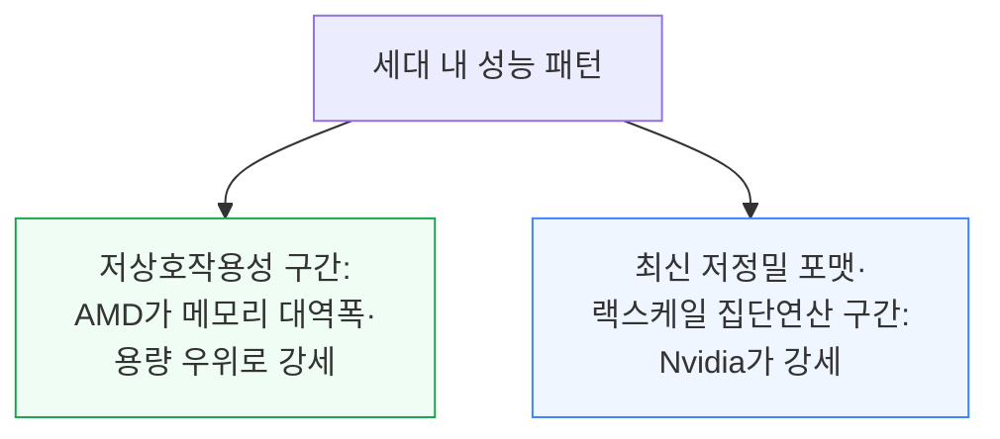

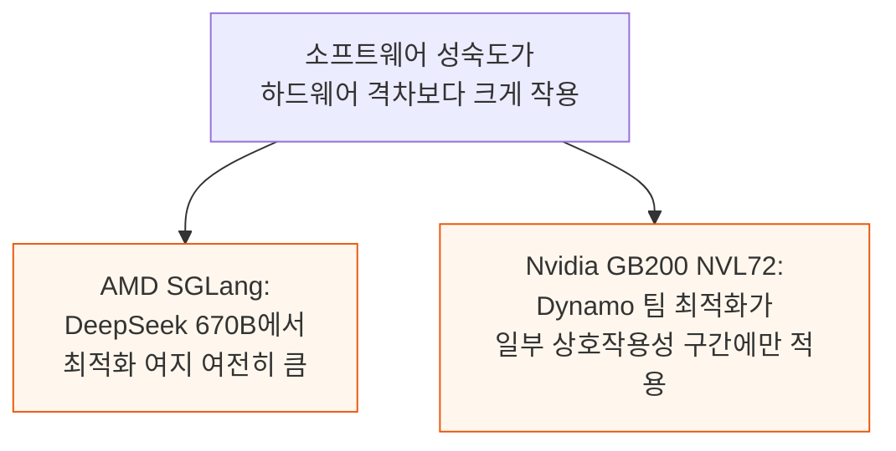

---

*작성 진행률: 약 55% 완료 (11개 섹션 중 6개 완료)*
*업데이트: 4\~6장(DeepSeek R1 서빙 전략, 아키텍처·CI/CD 인프라, 처리량 vs 지연시간 벤치마크 결과) 작성 완료*
