# Vera Rubin – Extreme Co-Design: An Evolution from Grace Blackwell Oberon

> **출처**: [SemiAnalysis Newsletter](https://newsletter.semianalysis.com/p/vera-rubin-extreme-co-design-an-evolution)
> **저자**: Dylan Patel
> **발행일**: 2026-02-26

---

## 📑 목차

### 전체 섹션
 1. [서론: Nvidia의 "익스트림 코디자인" 전략](#1-서론-nvidia의-익스트림-코디자인-전략)
 2. [6개 실리콘 제품: Rubin·Vera·NVLink 6·ConnectX-9·BlueField-4·Spectrum-6](#2-6개-실리콘-제품-rubinveranvlink-6connectx-9bluefield-4spectrum-6)
 3. [Rubin Oberon 랙: NVL72와 CPX 폼팩터](#3-rubin-oberon-랙-nvl72와-cpx-폼팩터)
 4. [컴퓨트 트레이 재설계: 6개 모듈 구조](#4-컴퓨트-트레이-재설계-6개-모듈-구조)
 5. [케이블 없는(Cableless) 설계와 PCB 고도화](#5-케이블-없는cableless-설계와-pcb-고도화)
 6. [컴퓨트 트레이 냉각: 100% 액체 냉각](#6-컴퓨트-트레이-냉각-100-액체-냉각)
 7. [컴퓨트 트레이 전력 공급과 기계 구조](#7-컴퓨트-트레이-전력-공급과-기계-구조)
 8. [랙 레벨 냉각 인프라와 공급망 영향](#8-랙-레벨-냉각-인프라와-공급망-영향)
 9. [랙 레벨 전력 공급 인프라](#9-랙-레벨-전력-공급-인프라)
10. [네트워킹: NVLink 6 스케일업과 스케일아웃](#10-네트워킹-nvlink-6-스케일업과-스케일아웃)
11. [하이퍼스케일러 커스터마이징과 조립 물류](#11-하이퍼스케일러-커스터마이징과-조립-물류)
12. [VR NVL72 TCO 분석: BoM과 전력 예산](#12-vr-nvl72-tco-분석-bom과-전력-예산)
13. [Groq LPU 디코드 랙](#13-groq-lpu-디코드-랙)

---

## 🔑 용어 정리

본문을 순서대로 읽기 전에 알아두면 좋은 용어들입니다. 자세한 수치와 설명은 본문에서 처음 등장하는 위치에 나옵니다.

- **익스트림 코디자인 (Extreme Co-Design)**: GPU 칩 하나만 잘 만드는 게 아니라, 칩·서버·랙·냉각·전력까지 전체 시스템을 하나의 제품처럼 통째로 설계하는 Nvidia의 접근 방식
- **오베론(Oberon) / NVL72**: 서버 한 대가 아니라 랙 전체를 하나의 거대한 연산 장치로 묶는 랙스케일 아키텍처. NVL72는 GPU 72개를 하나의 랙에 담은 구성
- **컴퓨트 트레이 (Compute Tray)**: 랙 안에 서랍처럼 들어가는 서버 유닛. GPU·CPU·네트워크 칩이 실장된 기본 조립 단위
- **케이블리스(Cableless) 설계**: 서버 내부 부품을 전선(케이블) 대신 보드를 바로 맞물리는 커넥터로 연결해, 조립 시간과 고장 지점을 줄이는 설계
- **DLC (칩 직접 액체 냉각)**: 물을 칩 바로 위 구리판으로 흘려보내 직접 식히는 방식. 공기보다 훨씬 많은 열을 빼낼 수 있어 고밀도 랙에 필수
- **CDU (냉각수 분배 장치)**: 서버 내부 냉각 회로와 건물 전체 냉각수 시스템을 연결해주는 장비
- **스케일업 vs 스케일아웃 네트워크**: 스케일업(NVLink)은 한 랙 안의 GPU끼리 초고속으로 묶는 망, 스케일아웃(InfiniBand·Ethernet)은 랙과 랙, 즉 여러 랙에 걸친 대규모 클러스터를 묶는 망
- **CPO (공동 패키징 광학, Co-Packaged Optics)**: 별도 광트랜시버 부품 대신, 광신호 변환 회로를 스위치 칩 옆에 함께 패키징해 전력과 비용을 아끼는 기술

---

## 1. 서론: Nvidia의 "익스트림 코디자인" 전략

**📌 핵심:**
- CES 2026에서 Nvidia는 Rubin 플랫폼의 실리콘 제품 6종(Rubin GPU, Vera CPU, NVLink 6 스위치, ConnectX-9, BlueField-4, Spectrum-6)을 모두 공식 발표
- AMD MI450X Helios, Amazon Trainium 3, Google TPU 등 경쟁사도 서버 한 대가 아니라 **랙 전체를 하나의 연산 장치로 묶는 "랙스케일"** 경쟁에 뛰어든 상황
- Nvidia의 대응은 "익스트림 코디자인" — GPU뿐 아니라 스케일업 스위치·NIC·이더넷 스위치·CPU까지 6종 실리콘 모두에서 업계 최고 수준을 자체 보유한 유일한 업체라는 데서 나오는 경쟁력
- 결론: VR(Vera Rubin) NVL72는 그레이스 블랙웰 대비 훨씬 통합적이고 모듈화된 설계로, 랙 자체가 "하나의 분산 가속기"가 되는 방향으로 진화

---

CES 2026에서 Nvidia는 Rubin 플랫폼 6개 제품을 상세 공개했습니다. VR NVL72는 Nvidia의 랙스케일 오베론 아키텍처 2세대입니다.

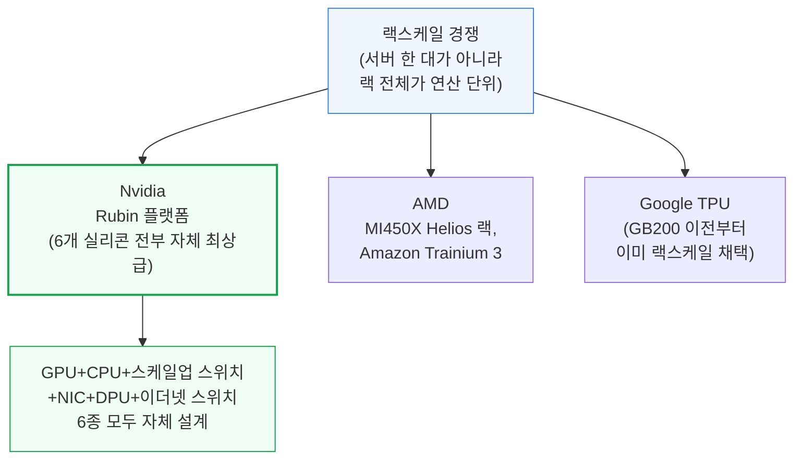

**📌 용어 풀이: 익스트림 코디자인이 갖는 경쟁 우위**
> - Nvidia는 가속기(GPU)뿐 아니라 스케일업 스위치, NIC, 이더넷 스위치, 자체 설계 CPU까지 주요 실리콘 전 영역에서 업계 최고 수준 또는 그에 근접한 제품을 갖춘 유일한 업체
> - 경쟁사는 보통 GPU·가속기 하나만 강할 뿐, 나머지 부품(스위치·NIC 등)은 외부 업체에 의존하거나 상대적으로 약함
> - 랙 하나를 "여러 부품의 조합"이 아니라 "하나의 통합 제품"으로 설계할 수 있다는 점이 근본적 차별점

이 리포트가 다루는 순서는 다음과 같습니다.
- 6개 실리콘 제품의 칩 단위 스펙
- 랙·트레이 설계 변화
- NVLink 6 스케일업/스케일아웃 네트워크
- 하이퍼스케일러 커스터마이징과 조립 물류
- VR NVL72 TCO(총소유비용)

Nvidia는 이날 VR NVL72 부품별 BoM(자재명세서)·전력 예산 모델도 함께 공개해, 어느 공급업체가 500억 달러 규모 Rubin 양산에서 승자·패자가 될지 가늠할 수 있게 했습니다.

---

## 2. 6개 실리콘 제품: Rubin·Vera·NVLink 6·ConnectX-9·BlueField-4·Spectrum-6

**📌 핵심:**
- Rubin GPU는 GB200 대비 밀집 FP4 연산력 3.5배(10→35 PFLOPS), 신형 압축 엔진 활용 시 최대 50 PFLOPS(마케팅상 "5배")까지 가능, HBM4 대역폭은 2.75배(8→22TB/s, 실제 초기 출하는 20TB/s 근접 예상)
- 칩 발열(TDP)은 최대 2,300W(Max-P 옵션)로 Blackwell 최대 1,400W 대비 크게 상승 → 절전형 Max-Q(1,800W) 옵션도 병행 제공
- Vera CPU는 Grace 대비 성능 2배, 코어 72→88개, 메모리 대역폭 2.5배, 최대 용량 3배(1.5TB)로 업그레이드
- 결론: 6개 칩 모두 "대역폭 2배 확장 + 저정밀(FP4/FP8) 연산 집중"이라는 공통된 방향으로 설계됨

---

Rubin의 설계는 Blackwell의 논리적 진화입니다. 3나노 공정으로 전환하고 입출력(I/O)을 별도 칩렛으로 분리했지만, 레티클 크기 다이 2개 + HBM 8스택이라는 기본 구조는 유지합니다.

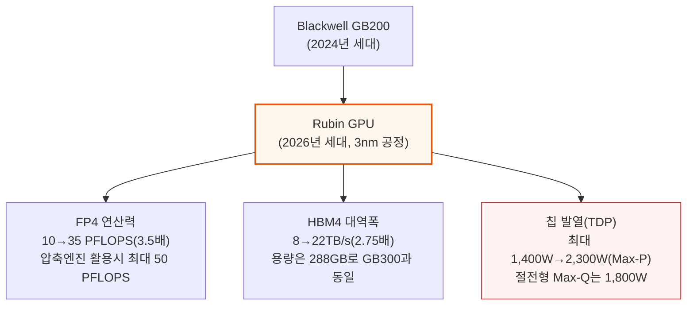

FP4 연산력 3.5배를 달성한 요인은 세 가지입니다.
- SM(연산 코어 묶음) 개수: 160개 → 224개
- SM 내부 텐서 코어 폭: 32,768 FP4 MAC/클록으로 2배
- 클록 속도: 1.90GHz → 2.38GHz(25% 상승)

다만 이 2배 폭 확장은 FP4·FP8에만 적용되고 BF16·TF32는 Blackwell과 동일해, 두 정밀도 성능은 1.6배만 늘었습니다 — 학습·추론 대부분이 FP8·FP4로 옮겨간다는 Nvidia의 판단이 반영된 설계입니다.

HBM4는 스택당 버스 폭이 2배로 늘고 10.8GT/s로 동작해 총 22TB/s 대역폭을 냅니다. 다만 메모리 공급사들이 이 속도(JEDEC 표준보다 높음)를 맞추기 어려워해, 초기 출하는 20TB/s에 조금 못 미칠 가능성이 있습니다.

- Micron은 기술 격차로 사실상 Rubin용 HBM4 공급에서 제외될 것으로 SemiAnalysis는 분석
- 트랜지스터 수는 60% 늘어난 3,360억 개

**📌 용어 풀이: 적응형 압축 엔진과 "50 PFLOPS" 마케팅 수치**
> - 과거 세대(2:4 구조적 희소성)는 값의 절반을 강제로 0으로 만들어 정확도 손실이 컸고, 실제로는 거의 쓰이지 않음
> - Rubin의 신형 3세대 Transformer Engine은 데이터에 실제로 존재하는 0 값을 실시간으로 찾아 압축하는 "적응형 압축" 방식 → 기존 Blackwell용 모델을 그대로 돌려도 자동 적용, 정확도 손실 없음
> - 0이 많은(희소한) 워크로드일수록 마케팅 수치인 50 PFLOPS에 가까워지고, 0이 적으면 그만큼 실제 성능은 낮아짐 — "35 PFLOPS(밀집)"가 보수적 기준, "50 PFLOPS(추론)"는 최선의 경우

Rubin 패키지는 히트스프레더에 강성보강재(stiffener)를 추가하고, 액체금속 열전도물질(TIM2)의 부식을 막기 위해 표면에 금도금 층을 입혔습니다 — Blackwell B200·B300은 히트스프레더 덮개만 있던 것과 차이입니다.

Vera CPU도 Grace 대비 대폭 강화됐습니다. 3나노 레티클 크기 다이로 전환하고, 메모리 컨트롤러·I/O를 칩렛으로 분리했습니다.

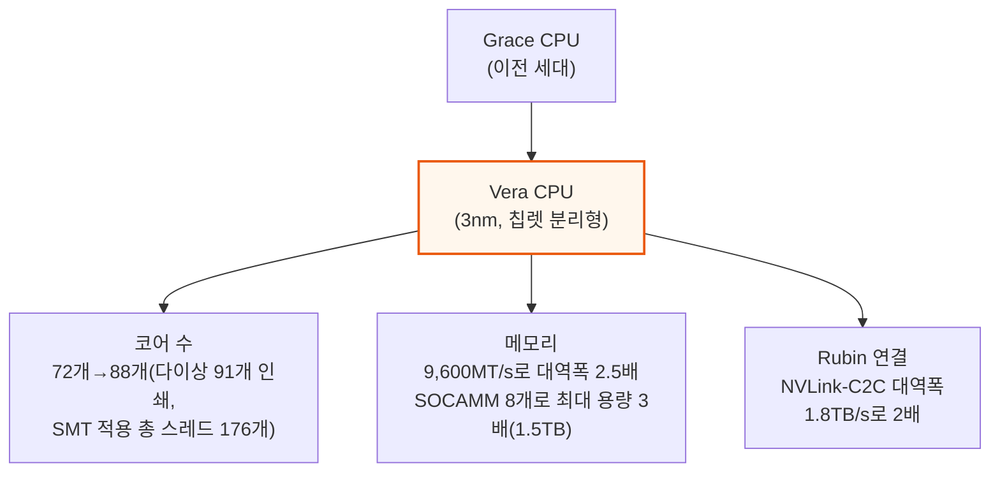

Vera는 Nvidia 자체 ARM CPU 설계('Olympus' 코어) 계열이며, L3 캐시도 40% 늘어난 162MB입니다. PCIe6·CXL3.1도 새로 지원하며, 트랜지스터 수는 2.2배인 2,270억 개로 늘었습니다.

나머지 4종의 실리콘은 모두 "대역폭 2배"라는 공통 목표로 설계됐습니다.

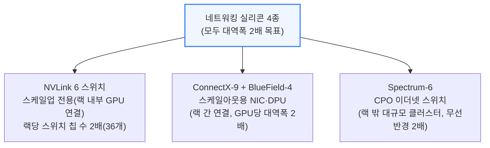

**📌 용어 풀이: 4종 네트워킹 실리콘 상세**
> - **NVLink 6 스위치**: 랙당 칩 수가 36개로 2배 늘었지만 칩 하나의 대역폭(28.8T)은 NVLink 5와 동일 — 포트 수를 절반으로 줄이는 대신 '400G' 양방향 SerDes로 속도를 2배 높여, 단일 모놀리식 다이 구조를 유지
> - **ConnectX-9**: CX-8과 대역폭(800G)·PCIe6 스위치 용량(48레인)은 같지만 InfiniBand뿐 아니라 800G 이더넷도 지원, GPU당 NIC 개수를 2배로 늘려 스케일아웃 대역폭 2배 확보
> - **BlueField-4**: 새로 설계하지 않고 Grace CPU 다이를 재사용해 ConnectX-9 다이와 함께 패키징한 800G DPU. LPDDR5 128GB(BlueField-3 대비 4배 용량) 탑재, 저장장치 컨트롤러 역할도 겸함
> - **Spectrum-6 CPO**: VR NVL72 랙 자체에는 포함되지 않고 랙을 넘어선 대규모 스케일아웃 클러스터용. IO 칩렛 8개 구조는 Spectrum-5와 동일, 512개 SerDes로 102.4T 스위칭. SN6810(1칩)·SN6800(4칩, 409.6T)이 있으나, 실제로는 일반 트랜시버형(SN6600)이 더 널리 쓰일 전망

---

## 3. Rubin Oberon 랙: NVL72와 CPX 폼팩터

**📌 핵심:**
- Rubin은 GB200처럼 저밀도 대안 SKU(NVL36x2)를 따로 두지 않고, **단일 VR NVL72 SKU**로만 출시 → Rubin GPU 패키지 72개, Vera CPU 36개, NVLink 6 스위치 ASIC 36개로 구성
- NVL72라는 이름은 한때 다이 개수 기준으로 "NVL144"라 불렸으나(GPU 패키지당 다이 2개 × 72 = 144), 2025년 말 패키지 개수 기준인 "NVL72"로 최종 확정
- CPX(추론 프리필 전용 가속기)는 애초 VR NVL72 트레이 안에 통합할 계획이었으나 **별도 독립 랙**으로 확정 → 연산 집약적 프리필과 대역폭 집약적 디코드를 물리적으로 분리
- 결론: Blackwell이 SKU를 다양화(NVL72/NVL36x2)해 인프라 격차에 대응했다면, Rubin은 SKU를 단일화하는 대신 CPX라는 별도 특화 랙으로 추론 단계를 세분화하는 방향으로 진화

---

Nvidia GTC 2024에서 GB200이 발표된 이후, AI 서버는 "섀시 하나"가 아니라 "랙 전체"가 기본 설계 단위가 됐습니다.

- Blackwell Oberon은 랙 전력밀도가 100kW를 넘는 첫 대규모 랙스케일 배치
- 많은 데이터센터가 100kW+ 랙을 지원할 인프라를 갖추지 못함 → Nvidia는 고밀도 GB200 NVL72와 저밀도 대안 GB200 NVL36x2 두 SKU를 함께 출시

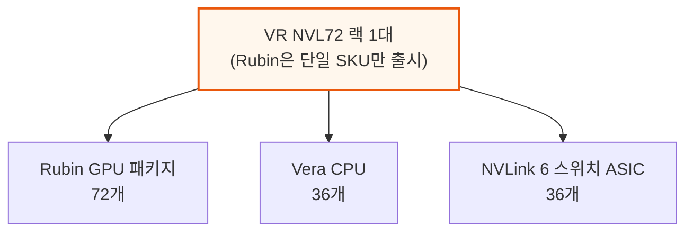

VR NVL72는 한때 "젠슨 매스"(GTC 2025 기준, GPU 개수를 컴퓨트 다이 개수로 정의 — 패키지당 다이 2개 × 72패키지 = 144)에 따라 "VR NVL144"로 불렸으나, CES 2026 직전인 2025년 12월 말 다시 "VR NVL72"(패키지 72개 기준)로 명칭이 확정됐습니다.

### CPX 폼팩터: 통합에서 독립 랙으로

당초 Nvidia는 CPX 가속기를 VR NVL72 랙에 통합할 계획이었지만, 현재는 **독립 랙**으로만 제공하는 쪽으로 방향을 굳혔습니다. Nvidia는 애초 세 가지 구성(일반형, 통합형, 듀얼랙형)을 검토했지만 최종적으로 듀얼랙(독립 랙) 방식을 택했습니다.

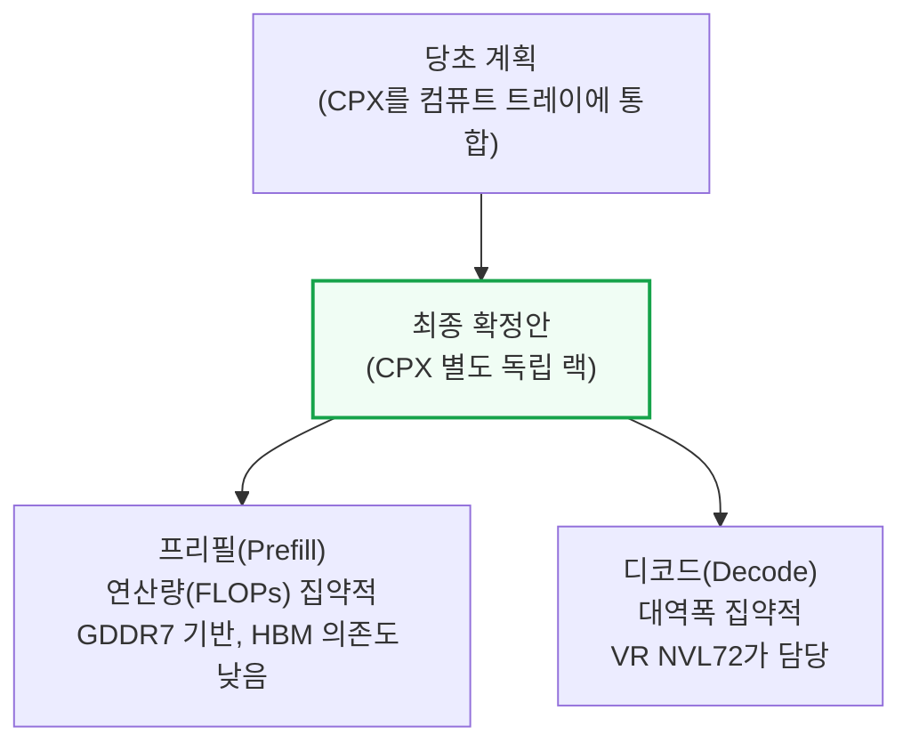

독립 랙 방식의 이점은 다음과 같습니다.
- 하이퍼스케일러가 프리필·디코드 용량을 각각 독립적으로 확장 가능
- 데이터센터 전력 배분 최적화
- 장애 영향 범위 축소 (결국 연산 집약적 프리필 vs 대역폭 집약적 디코드를 아키텍처 차원에서 분리한다는 의미)

CPX는 원래 프리필 최적화 GDDR7 기반 가속기로 설계됐습니다.
- 프리필은 대역폭보다 연산량(FLOPs)이 병목 → HBM의 높은 대역폭이 상대적으로 덜 필요
- GDDR7은 GB당 비용이 낮고 2.5D 패키징도 불필요

**📌 용어 풀이: D램 가격 급등이 CPX 설계에 미친 영향**
> - 최근 D램(범용 메모리) 가격이 급등하며 HBM과의 상대적 비용 격차가 좁혀짐
> - Nvidia는 HBM을 탑재한 CPX 변형이나, HBM3E 등 낮은 스펙 HBM을 쓰는 프리필 전용 Rubin 배치도 함께 검토 중

---

## 4. 컴퓨트 트레이 재설계: 6개 모듈 구조

**📌 핵심:**
- 컴퓨트 트레이 재설계의 핵심 목표는 **케이블 제거** → Jensen에 따르면 트레이 조립 시간이 2시간→5분으로 단축, 6개 모듈이 보드-투-보드 커넥터로 서로 맞물리는 구조
- 6개 모듈(Strata x2, Orchid x4, 미드플레인 x1, 전력공급모듈 x1, BlueField-4 모듈 x1, 시스템관리모듈 x1)이 후면(GPU·CPU)과 전면(네트워크·관리)으로 나뉘고, 미드플레인이 그 사이를 다리처럼 연결
- BlueField-4는 KV 캐시(대화 맥락 저장용 중간 데이터) 전용 3번째 네트워크(ICMS/CMX)의 핵심 실리콘 — GPU HBM·호스트 D램만으로는 감당 못 하는 장문맥 추론 수요에 대응
- 결론: Blackwell 대비 새로 생긴 모듈은 미드플레인 하나뿐이지만, 이 미드플레인 덕분에 트레이 전체를 케이블 없이 조립 가능

---

컴퓨트 트레이 재설계는 조립을 단순화하는 데 초점이 맞춰져 있습니다 — 특히 GB200/300 조립 과정에서 가장 큰 고장 지점이었던 케이블을 없애는 것이 핵심입니다.

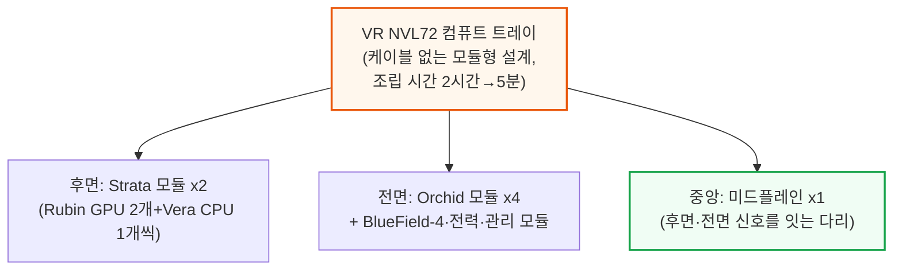

6개 모듈의 역할은 다음과 같습니다.
- **Strata**: GB200/300의 Bianca 보드에 해당. Rubin GPU 2개, Vera CPU 1개 탑재. Vera용 LPDDR5X는 SOCAMM 소켓 8개(192GB·128GB 두 종류, Vera 1개당 최대 1,536GB\~최소 1,024GB)로 장착. CX-9 NIC는 전면으로 빠지고, 하단은 전부 보드-투-보드 커넥터
- **Orchid**: ConnectX-9 NIC 2개, 800G 트랜시버 케이지 2개, E1.S SSD 슬롯 1개. 전면 좌우에 2개씩 쌓여 배치, 미드플레인에서 PCIe6 신호를 CX-9까지 전달
- **미드플레인(Midplane)**: Strata와 전면 모듈 사이의 PCIe 신호를 잇는 다리. 신설된 유일한 모듈
- **BlueField-4 모듈**: 전면 중앙, DPU 역할. 온보드 LPDDR5x 128GB, SSD 512GB, AST2600 BMC 내장
- **전력 공급 모듈**: 50V 전력을 12V로 강압해 전면 모듈에 배분
- **시스템 관리 모듈**: SMM·TPM·DC-SCM 등 보안·관리 기능 담당

**📌 용어 풀이: BlueField-4와 ICMS/CMX(KV 캐시 전용 네트워크)**
> - 장문맥 추론(수백만 토큰급 컨텍스트)과 에이전트 동시 처리가 늘면서, 대화 중간 결과(KV 캐시)를 저장할 공간이 기존 메모리 계층만으로 부족해짐
> - Nvidia는 로컬 SSD(G3 계층)와 공유 스토리지(G4 계층) 사이에 KV 캐시 전용 새 계층(G3.5)을 신설 — 이 계층을 ICMS(추후 "CMX"로 개명 예정)라 부름
> - BlueField-4가 이 3번째 네트워크의 핵심 실리콘 역할 — NVMe-oF·RDMA 트래픽을 처리하며 GPU·호스트 CPU와는 독립적으로 KV 캐시 이동을 관리

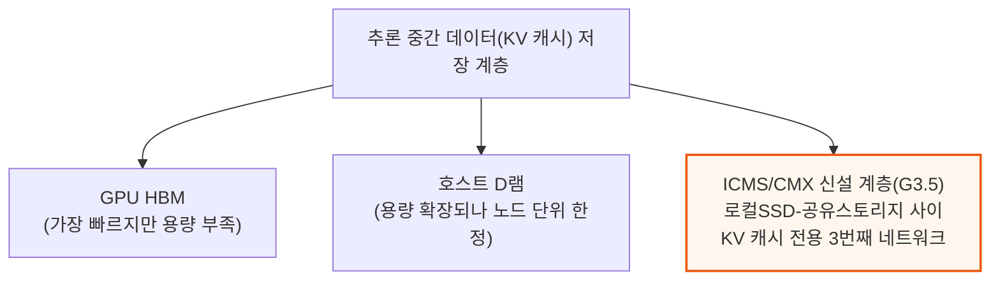

### 컴퓨트 트레이 토폴로지: Blackwell과의 3가지 차이

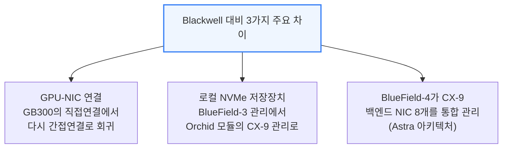

GPU-NIC 연결 방식은 세대마다 달라졌습니다.
- **GB200**: GPU가 Grace CPU와 C2C로 연결되고, Grace가 다시 PCIe5로 ConnectX-7과 통신(간접 연결)
- **GB300**: B300 GPU가 ConnectX-8과 직접 연결되는 경로 추가(2-host NIC, 지연시간 개선)
- **VR NVL72**: 다시 GB200 방식으로 회귀 — Rubin이 ConnectX-9 2개를 감당할 PCIe 대역폭이 부족해, Vera를 거쳐 PCIe6로 연결

로컬 NVMe 저장장치는 이전엔 BlueField-3가 관리했지만, VR NVL72에서는 물리적으로 Orchid 모듈에 위치해 ConnectX-9가 관리합니다.

마지막으로 BlueField-4는 ConnectX-9 백엔드 NIC 8개를 통합 관리(Astra 아키텍처)해 프런트엔드·백엔드 네트워크를 한 번에 관장하지만, 비용이 비싸 대부분 하이퍼스케일러는 자체 DPU로 대체할 전망입니다.

이 미드플레인을 제외하면, VR NVL72 컴퓨트 트레이의 모든 모듈은 형태는 다르지만 GB200/300에도 존재하던 개념입니다. 다만 전면 모듈(딸 모듈)들은 미드플레인에서 전면 I/O 포트까지 신호를 PCB로 전달해야 해 Blackwell 대비 훨씬 길어졌습니다.

---

## 5. 케이블 없는(Cableless) 설계와 PCB 고도화

**📌 핵심:**
- 케이블 없는 설계를 택한 이유는 신뢰성(플라이오버 케이블은 조립 중 쉽게 손상되는 고장 지점)과 공간(고밀도 설계라 케이블 배선 공간 부족) 두 가지
- ConnectX-9를 후면(Strata)에서 전면(Orchid)으로 옮긴 이유는 신호 물리 특성 때문 — 손실이 큰 고속 200G 이더넷 신호는 케이블로 짧게, 손실이 작은 PCIe6(64Gbit/s) 신호는 PCB로 길게 보내는 게 유리
- PCB 소재는 CCL 등급을 M7→M8/M9로, 동박을 HVLP2→HVLP4로 올리고, 고급 PCB 면적도 GB300 대비 약 2.3배로 확대 — 특히 Orchid 보드가 면적 증가분의 주요 원인
- 결론: 조립 효율화로 절감한 비용이 고급 PCB 소재의 추가 비용을 상쇄하고도 남는다는 게 Nvidia의 판단

---

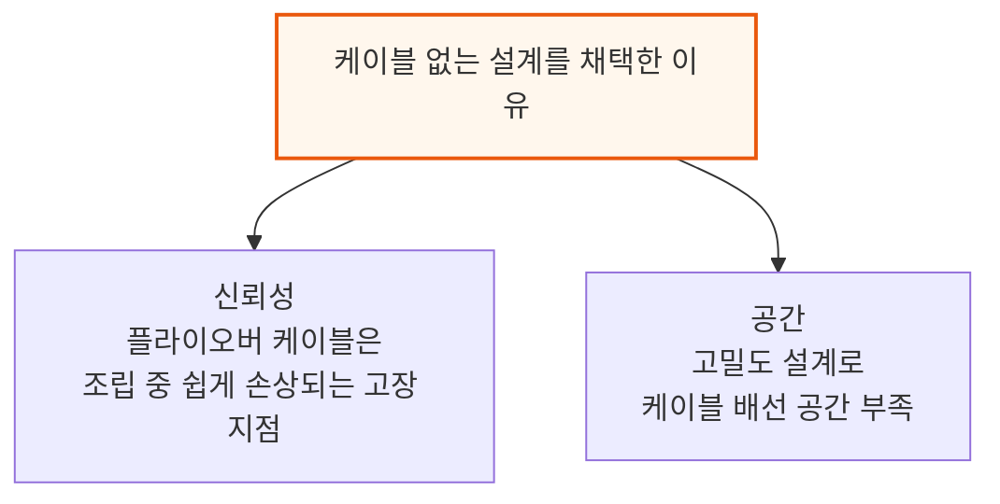

GB200/300에서 가장 값비싼 케이블은 Amphenol의 DensiLink OverPass 케이블 세트로, CX-7/8 NIC와 OSFP 케이지 사이 이더넷 연결을 담당했습니다. 이 케이블은 손상에 매우 취약해 고장 지점이 많았고, MCIO·SlimSAS 등 저가형 PCIe 케이블도 마찬가지 문제가 있었습니다.

- 케이블 없는 설계가 Amphenol에 불리해 보일 수 있지만 실제로는 긍정적 — Strata와 딸 모듈 사이 신호는 여전히 물리적 연결이 필요하며, 이 연결을 Amphenol의 Paladin HD2 보드-투-보드 커넥터가 담당
- 신호는 Strata → Paladin HD2 커넥터 → PCB 미드플레인 → 또 다른 Paladin HD2 커넥터 → 딸 모듈 순으로 전달

### ConnectX-9 재배치: 전면으로 이동

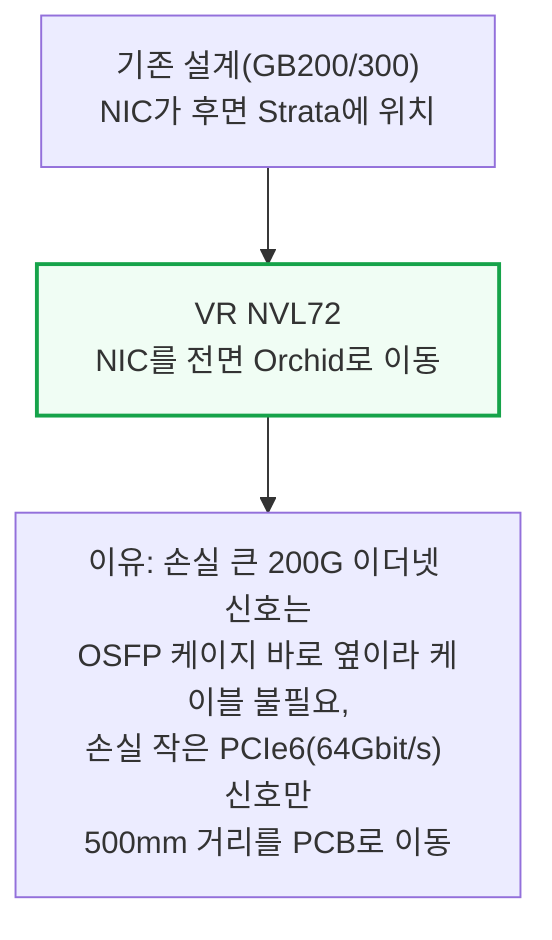

기존에는 GPU/CPU와 NIC 사이 PCIe 신호 거리보다, NIC와 OSFP 케이지 사이 이더넷 신호 거리가 더 짧았습니다.

- 문제: 200G급 이더넷 신호는 PCB만으로 전달하기엔 손실이 너무 커 플라이오버 케이블이 필수
- 전환: NIC를 전면으로 옮긴 지금은 반대로 더 낮은 속도(64Gbit/s)인 PCIe Gen6 신호가 긴 거리를 이동 → PCIe Gen6는 신호 품질 여유가 있어 PCB만으로도 가능

### PCB 신호 손실(삽입손실)의 물리학

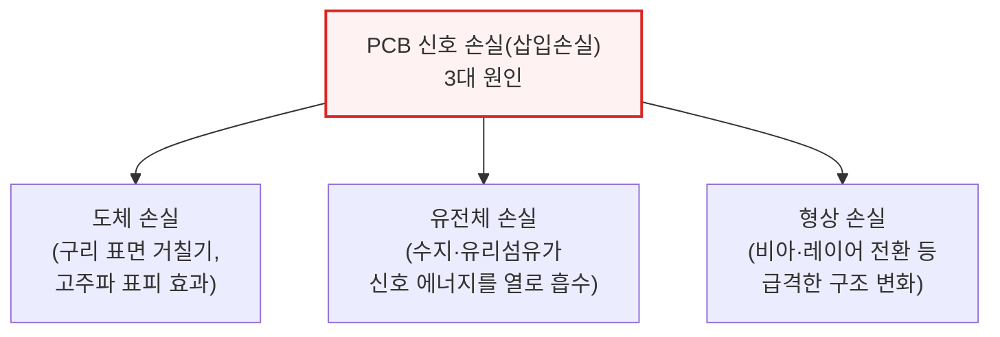

여기에 더해 배선 밀도가 높아지면서 인접 신호선끼리 간섭하는 "크로스토크"도 문제가 됩니다. 전송 주파수가 높을수록 이 세 가지 손실이 커집니다.

- 전통적 서버: PCIe 세대가 올라갈수록 플라이오버 케이블을 늘려 대응
- VR NVL72: 고밀도·조립 복잡성 문제로 반대로 PCB 소재를 고도화 — 조립 효율화로 아낀 비용이 소재 고도화 비용을 상쇄하고 남는다는 판단

### PCB 소재 고도화와 면적 확대

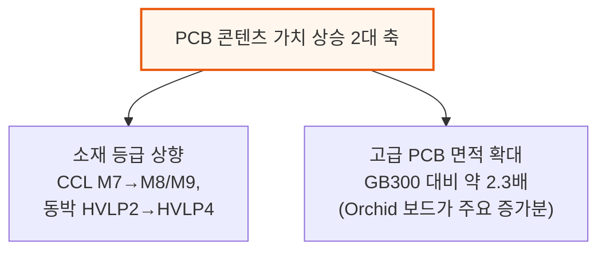

**📌 용어 풀이: 유리섬유 소재 논쟁 — 쿼츠 원단(Q glass)**
> - CCL(적층판) 등급은 유전율(Dk)·손실계수(Df)로 분류하며, 낮을수록 신호 손실이 적음 — 통상 파나소닉 Megtron 시리즈를 업계 기준으로 삼음
> - 쿼츠 원단은 기존 유리섬유보다 유전율이 더 낮고 강도·내열성도 좋지만, 비용이 몇 배 비싸고 PCB 가공 난도가 높아 수율이 나빠짐
> - VR NVL72는 신호 손실에 가장 민감한 Orchid 보드·미드플레인에 쿼츠를 우선 적용했으나, 비용·수율 문제로 Nvidia는 일반 유리섬유로 다시 낮추는 방안도 검토 중(신호 성능 확인이 관건)

---

## 6. 컴퓨트 트레이 냉각: 100% 액체 냉각

**📌 핵심:**
- VR NVL72 컴퓨트 트레이는 **100% 액체 냉각**(GB200/300은 85% 액체+15% 공랭 혼합) → 트레이 내 팬이 완전히 사라짐
- 냉각수는 좌측 후면 UQD로 들어가 내부 매니폴드에서 각 모듈로 분배되고, 우측 후면 UQD로 빠져나가는 구조 — 모듈별 콜드플레이트는 MQD(소형 퀵디스커넥트)로 매니폴드와 연결
- Rubin GPU 콜드플레이트는 "MCCP(마이크로채널 콜드플레이트)"로 업그레이드 — 채널 간격을 150→100마이크론으로 좁혀 표면적·방열 능력을 높이고, 액체금속 TIM2의 부식을 막기 위해 금도금 처리
- 결론: 콜드플레이트 부착 공정도 최종 조립 단계(L10)에서 보드 조립 단계(L6)로 앞당겨져, 모듈만 끼우면 끝나는 수준까지 조립이 단순화됨

---

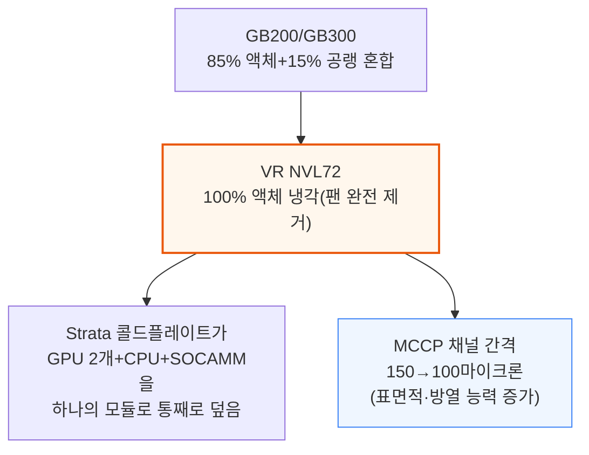

냉각수 흐름은 좌측 후면 UQD로 들어와 내부 매니폴드를 거쳐 각 모듈 콜드플레이트를 식힌 뒤, 우측 후면 UQD로 빠져나갑니다. Rubin GPU와 접촉하는 콜드플레이트 표면에는 금도금 층을 입혀, 액체금속 인듐 TIM2로 인한 구리 부식을 방지합니다.

Orchid 모듈에도 CX-9·E1.S SSD·트랜시버 케이지·VRM을 함께 덮는 콜드플레이트가 붙는데, 2개 모듈이 1U 섀시에 쌓이는 구조라 두께가 0.5U 미만으로 매우 얇습니다.

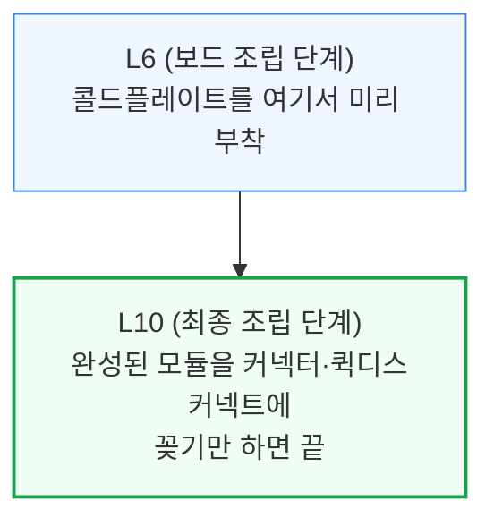

이전에는 콜드플레이트를 L10(최종 조립) 단계에서 부착했지만, 모듈형 설계로 인해 이제는 각 모듈의 PCBA 공정 직후인 L6 단계에서 미리 부착합니다 — 그 결과 L10 조립은 완성된 모듈을 커넥터·퀵디스커넥트에 꽂는 작업으로 단순화됩니다.

---

## 7. 컴퓨트 트레이 전력 공급과 기계 구조

**📌 핵심:**
- 50VDC 전력은 랙 후면 버스바 클립으로 들어와 좌·우 Strata 보드에는 직접, 전면 전력분배보드(PDB)에는 미드플레인 아래 버스바를 거쳐 공급 — Grace Blackwell은 항상 PDB를 거쳤던 것과 차이
- Strata 보드는 전력 4,800W(일반 서버랙 절반 TDP에 해당, Bianca 보드 3,000W 대비 60% 증가)를 감당해야 해 50VDC 직접 공급이 필요 — 96A(50V)가 400A(12V)보다 전력 손실이 17배 낮기 때문(전류의 제곱에 비례하는 손실 특성)
- Vera-Rubin "전력 쏠림(Power Sloshing)" 기능으로 GPU 유휴 시 남는 전력을 CPU가 흡수 — 4,800W 예산을 GPU·CPU가 상황에 따라 유동적으로 나눠 씀
- 결론: 기계 구조도 전면을 3분할(좌우 Orchid, 중앙 BlueField-4·전력·관리)해 미드플레인·매니폴드와 블라인드 메이트(맞춤 삽입) 방식으로 조립

---

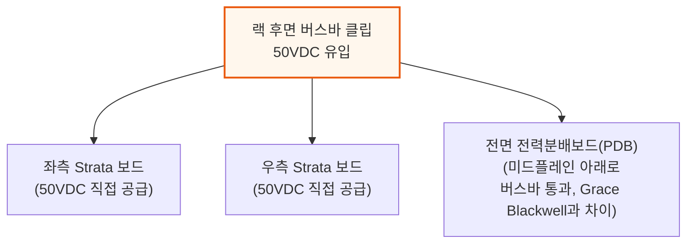

Strata 보드 내부에서는 전압을 다시 두 단계로 낮춥니다.

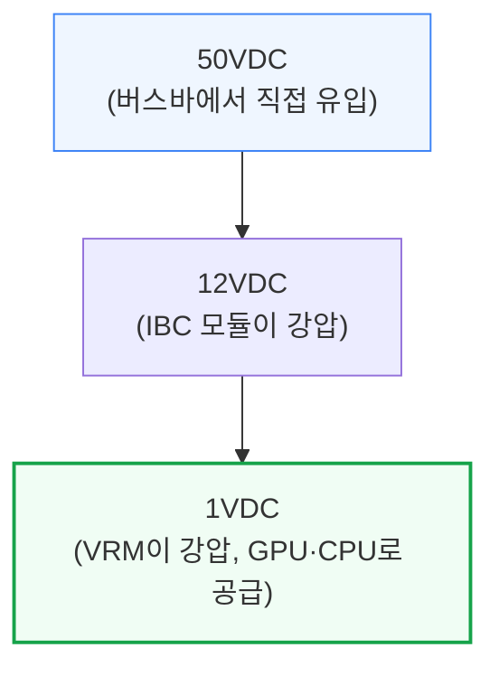

**📌 용어 풀이: 왜 Strata는 50VDC를 직접 받는가**
> - Strata 보드는 4,800W(일반 서버랙 하나가 쓰는 전력의 절반에 맞먹음)를 감당 — Grace Blackwell의 Bianca 보드(3,000W)보다 60% 많음
> - 전력 손실은 전류의 제곱에 비례 → 96A(50V 기준)가 400A(12V 기준)보다 전력 손실이 약 17배 낮음
> - 그래서 Bianca 보드처럼 PDB에서 12VDC를 받는 대신, Strata는 50VDC를 직접 받아 전류를 낮추고 전송 효율을 높임

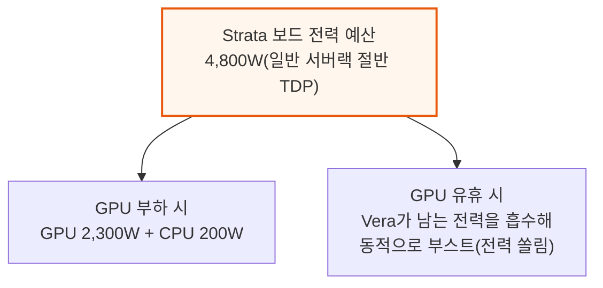

이 "전력 쏠림(Power Sloshing)" 기능은 GB300부터 이어진 것으로, GPU·CPU가 같은 전력 예산을 상황에 맞게 나눠 써 GPU 유휴 시간을 최소화하면서도 과잉 공급을 피할 수 있습니다. 전면 모듈(CX-9·BlueField-4·관리 모듈)은 PDB가 50VDC를 12VDC로 낮춘 뒤 구리 버스바 장치로 공급합니다.

### 기계 구조: 전면 3분할과 블라인드 메이트

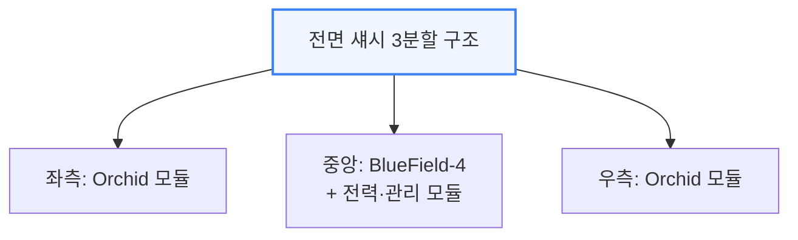

각 모듈은 별도의 소형 금속 섀시를 갖고, 이 기계 구조가 모듈을 미드플레인·내부 매니폴드에 정확히 맞춰 끼우는 "블라인드 메이트" 가이드 역할을 합니다. 미드플레인과 내부 매니폴드는 하나의 모듈로 함께 출하되며, 로딩 메커니즘이 커넥터·MQD에 모듈을 고정하는 힘을 가합니다.

---

## 8. 랙 레벨 냉각 인프라와 공급망 영향

**📌 핵심:**
- Jensen의 "Vera Rubin은 45°C 냉각수로도 기계식 칠러 없이 운영 가능" 발언이 업계에 충격을 줬지만, SemiAnalysis는 Blackwell도 이미 40°C 이상 운영 사례(Supermicro DLC-2)가 있어 기존 추세의 연장으로 평가
- 흡기 온도가 오르면 에너지 효율은 좋아지지만, 배기 상한선(약 65°C)에 가까워져 온도차(ΔT)가 좁아짐 → 같은 열량을 제거하려면 냉각수 유량을 2.0\~2.5배 늘려야 함
- 랙당 발열이 Blackwell 대비 약 2배로 늘며 CDU(냉각수 분배 장치) 1대가 감당하는 랙 수가 줄어드는 압박 → 업계는 랙 대수(10랙/CDU)는 유지하되 CDU 용량을 2MW급에서 3\~6MW급으로 키우는 방향으로 대응할 전망
- 결론: 100% 액체 냉각 전환으로 퀵디스커넥트(QD)·매니폴드·콜드플레이트 공급업체는 콘텐츠 증가 수혜, 물을 많이 쓰는 공랭식 칠러 전문업체는 상대적으로 불리해짐

---

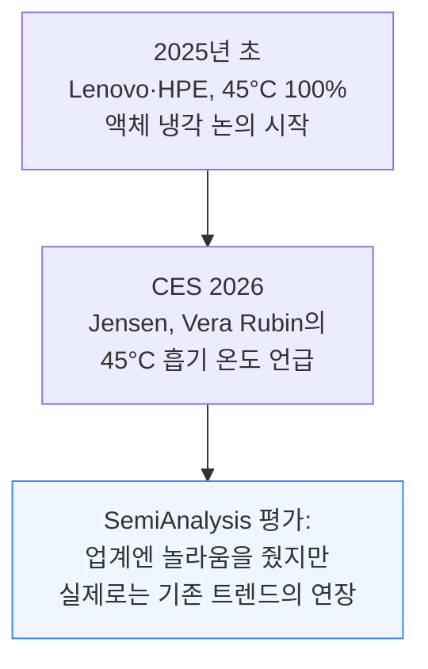

Schneider의 GB300 참조 설계(2025년 9월 발표)는 이미 이중 루프 구조를 씁니다 — 공랭 팬월용 냉수 루프와, 콜드플레이트로 약 40°C 냉각수를 순환시키는 별도 고온 루프를 나눠, CDU가 열을 약 37°C 시설 냉각수 루프로 넘기는 구조입니다.

다만 대다수 운영자는 아직 20\~30°C 냉각수로 설계하며, Blackwell 흡기 온도는 대략 실온 수준·배기는 40\~50°C대입니다.

```mermaid
flowchart TD
    Warm["흡기 온도 상승(예: 45°C)"] --> Good["장점: 칠러 없이<br/>냉각 가능, 에너지 효율 향상"]
    Warm --> Bad["단점: 배기 상한(약 65°C)과<br/>가까워져 온도차(ΔT) 좁아짐<br/>→ 같은 열량 제거에<br/>더 많은 유량 필요"]

    style Warm fill:#fff7ed,stroke:#ea580c,stroke-width:2px
    style Bad fill:#fef2f2,stroke:#dc2626
```

Vera Rubin은 최대 냉각수 회수 온도 65°C까지 지원할 전망입니다.

- 압력 범위: GB200과 동일(최대 운영압 72psig, 최소 파열압 217psig, OCP MGX 규격 부합) 유지 예상
- CDU 냉각 용량을 키우려면 유량을 2.0\~2.5배 확대 필요
- Nvidia는 CDU 압력을 높이지 않고도 유량을 늘려 냉각 성능을 거의 2배로 끌어올렸다고 발표 → 더 큰 퀵디스커넥트(2인치급)와 개선된 매니폴드·배관 예상

### 공급망 영향: CDU 대수 압박과 승자·패자

```mermaid
flowchart TD
    Today["오늘날<br/>CDU 1대가 GB200 랙 약 10대 담당"] --> Heat["VR NVL72는 랙당 발열<br/>약 2배로 상승"]
    Heat --> Result["업계 전망: 랙 대수(10랙/CDU)는<br/>유지하되 CDU 용량을<br/>2MW→3\~6MW급으로 확대"]

    style Heat fill:#fef2f2,stroke:#dc2626
    style Result fill:#f0fdf4,stroke:#16a34a,stroke-width:2px
```

CDU 전문 업체는 Delta가 선두이며 Schneider Electric·Vertiv·nVent가 뒤따르고, 시스템 통합은 Foxconn·Quanta가 주도합니다.

```mermaid
flowchart TD
    Shift["100% 액체 냉각 전환의<br/>공급망 영향"] --> Win["콘텐츠/MW 증가 최대 수혜<br/>QD·매니폴드·골드도금<br/>콜드플레이트·대형 펌프"]
    Shift --> Neutral["CDU 업체<br/>(수혜는 있으나 상대적으로 작음)"]
    Shift --> Lose["칠러리스 전환으로 타격<br/>공랭식 칠러 전문<br/>(Johnson Controls·Carrier·Trane)"]

    style Win fill:#f0fdf4,stroke:#16a34a,stroke-width:2px
    style Lose fill:#fef2f2,stroke:#dc2626,stroke-width:2px
```

**📌 용어 풀이: 칠러리스(Chiller-less) 전환이 남기는 승자·패자**
> - 이미 일부 운영자(Firmus 등)는 AI 최적화 설계에서 기계식 칠러를 아예 뺀 상태 — 다만 워크로드 유연성·이중화·신뢰성을 이유로 칠러를 유지하는 운영자도 많아 급격한 전환은 아님
> - 콘텐츠 비용 추정: 공랭식 칠러 약 $0.5M/MW vs 건식 드라이쿨러·단열 냉각탑 약 $0.2M/MW
> - 수혜 예상: SPX Technologies, BAC, Evapco / 도전 예상: Johnson Controls, Carrier, Trane

---

## 9. 랙 레벨 전력 공급 인프라

**📌 핵심:**
- VR NVL72 랙 TDP는 180\~220kW로, GB200/300의 120\~140kW 대비 크게 상승 — 향후 1MW/랙까지 오를 로드맵에 맞춰 HVDC 전력랙, BBU·CBU(배터리·커패시터 예비 전원), 액체 냉각 버스바, SST(고체상태 변압기) 개발이 이어지는 중
- 참조 설계는 110kW 전력 셸프 4개(N+1 이중화)로 구성 — 3상 415\~480VAC를 받아 50VDC로 낮춰 버스바에 공급, 버스바 정격은 5,000A+(Grace Blackwell 2,900A 대비 대폭 상승)로 액체 냉각이 필수
- 하이퍼스케일 고객은 별도 독립 전력랙을 LVDC 또는 HVDC(800VDC 또는 ±400VDC)로 배치할 수 있으며, 이 경우 DC-DC 셸프로 다시 50VDC까지 낮춰야 함(VR NVL72 컴퓨트 트레이는 여전히 50V만 수용)
- 결론: Meta처럼 스위치랙에 BBU·CBU까지 통합한 "고전력랙"을 별도로 두고 50V 수평 버스바로 GPU랙과 연결하는 방식도 등장

---

```mermaid
flowchart TD
    GB["GB200/GB300<br/>랙당 TDP 120\~140kW"] --> VR["VR NVL72<br/>랙당 TDP 180\~220kW"]

    style VR fill:#fff7ed,stroke:#ea580c,stroke-width:2px
```

```mermaid
flowchart TD
    Grid["3상 415\~480VAC<br/>(100A 배선 2개)"] --> Shelf["110kW 전력 셸프 x4<br/>(N+1 이중화,<br/>셸프당 18.3kW PSU 6개)"]
    Shelf --> Bus["50VDC 버스바<br/>(5,000A+, 액체 냉각 필수)"]

    style Bus fill:#fef2f2,stroke:#dc2626,stroke-width:2px
```

하이퍼스케일 고객은 표준 참조 설계 대신 별도 독립 전력랙을 선택할 수 있습니다.

```mermaid
flowchart TD
    Std["하이퍼스케일 독립 전력랙<br/>배치 방식 2가지"] --> S1["HVDC 전력랙<br/>800VDC(Nvidia 규격) 또는<br/>±400VDC(OCP 규격)<br/>→ DC-DC 셸프로 50VDC 재강압"]
    Std --> S2["Meta식 고전력랙<br/>스위치랙+BBU/CBU를<br/>50V 수평 버스바로 GPU랙과 연결"]

    style Std fill:#eff6ff,stroke:#3b82f6,stroke-width:2px
```

VR NVL72 랙 버스바 자체는 여전히 50V로 동작하고 컴퓨트 트레이도 50V만 수용합니다. 그래서 800VDC 전력랙을 쓰더라도 랙 내부에는 DC-DC 전력 셸프가 그대로 남아 800VDC를 50VDC로 낮춰줍니다.

Meta의 "고전력랙"은 GPU랙에 다 담지 못하는 BBU·CBU 용량을 스위치랙 쪽에 몰아 담아 효율과 피크 셰이빙(순간 전력 완화)을 노리는 방식입니다.

---

*작성 진행률: 약 70% 완료 (1\~9번 섹션 작성 완료)*
*업데이트: 컴퓨트 트레이 전력·기계 구조, 랙 레벨 냉각 인프라·공급망 영향, 랙 레벨 전력 공급 인프라 섹션 작성 완료. 다음: 네트워킹(NVLink 6)*
