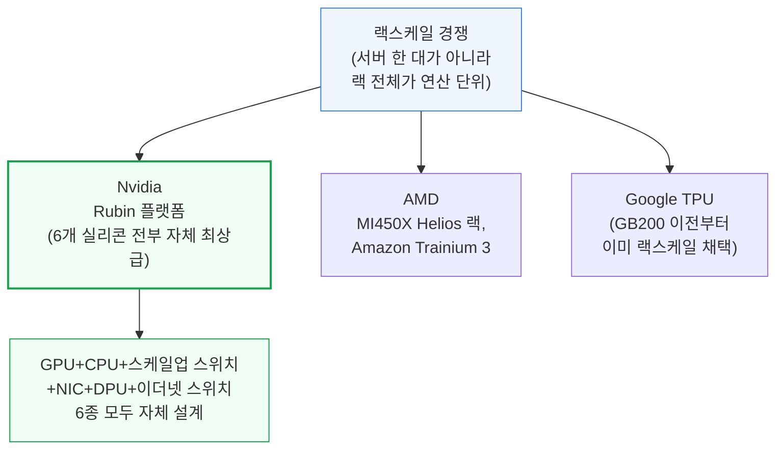
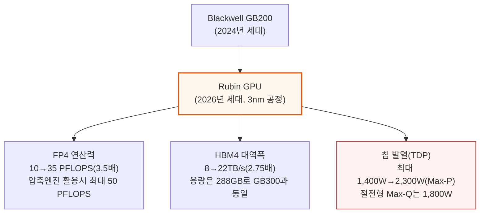
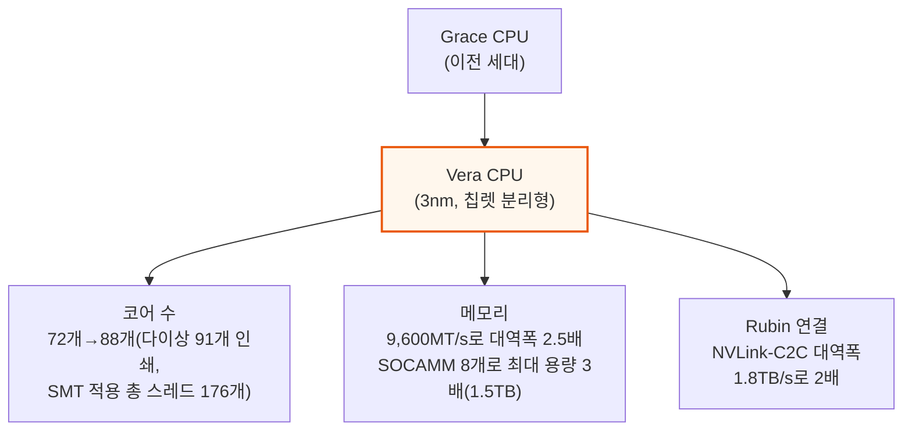
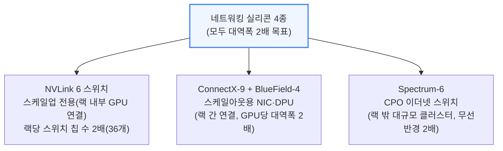
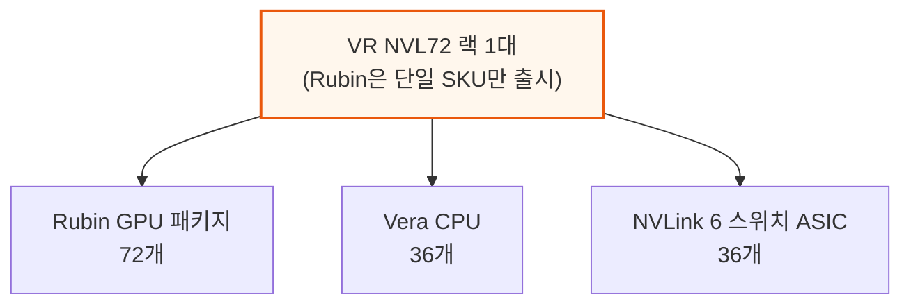
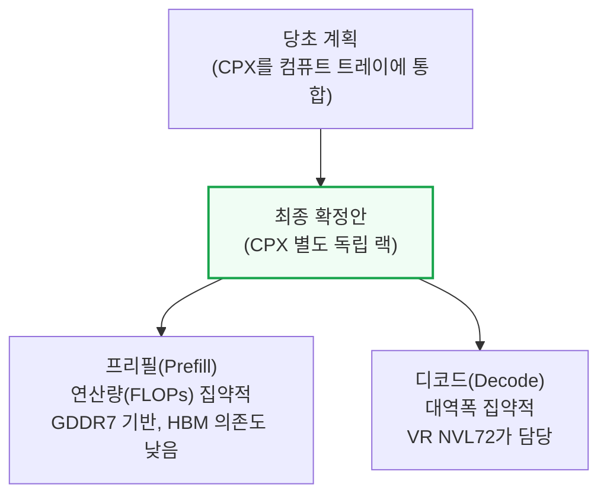

# Vera Rubin – Extreme Co-Design: An Evolution from Grace Blackwell Oberon

> **출처**: [SemiAnalysis Newsletter](https://newsletter.semianalysis.com/p/vera-rubin-extreme-co-design-an-evolution)
> **저자**: Dylan Patel
> **발행일**: 2026-02-26

---

## 📑 목차

### 전체 섹션
 1. [서론: Nvidia의 "익스트림 코디자인" 전략](#1-서론-nvidia의-익스트림-코디자인-전략)
 2. [6개 실리콘 제품: Rubin·Vera·NVLink 6·ConnectX-9·BlueField-4·Spectrum-6](#2-6개-실리콘-제품-rubinveranvlink-6connectx-9bluefield-4spectrum-6)
 3. [Rubin Oberon 랙: NVL72와 CPX 폼팩터](#3-rubin-oberon-랙-nvl72와-cpx-폼팩터)
 4. [컴퓨트 트레이 재설계: 6개 모듈 구조](#4-컴퓨트-트레이-재설계-6개-모듈-구조)
 5. [케이블 없는(Cableless) 설계와 PCB 고도화](#5-케이블-없는cableless-설계와-pcb-고도화)
 6. [컴퓨트 트레이 냉각: 100% 액체 냉각](#6-컴퓨트-트레이-냉각-100-액체-냉각)
 7. [컴퓨트 트레이 전력 공급과 기계 구조](#7-컴퓨트-트레이-전력-공급과-기계-구조)
 8. [랙 레벨 냉각 인프라와 공급망 영향](#8-랙-레벨-냉각-인프라와-공급망-영향)
 9. [랙 레벨 전력 공급 인프라](#9-랙-레벨-전력-공급-인프라)
10. [네트워킹: NVLink 6 스케일업과 스케일아웃](#10-네트워킹-nvlink-6-스케일업과-스케일아웃)
11. [하이퍼스케일러 커스터마이징과 조립 물류](#11-하이퍼스케일러-커스터마이징과-조립-물류)
12. [VR NVL72 TCO 분석: BoM과 전력 예산](#12-vr-nvl72-tco-분석-bom과-전력-예산)
13. [Groq LPU 디코드 랙](#13-groq-lpu-디코드-랙)

---

## 🔑 용어 정리

본문을 순서대로 읽기 전에 알아두면 좋은 용어들입니다. 자세한 수치와 설명은 본문에서 처음 등장하는 위치에 나옵니다.

- **익스트림 코디자인 (Extreme Co-Design)**: GPU 칩 하나만 잘 만드는 게 아니라, 칩·서버·랙·냉각·전력까지 전체 시스템을 하나의 제품처럼 통째로 설계하는 Nvidia의 접근 방식
- **오베론(Oberon) / NVL72**: 서버 한 대가 아니라 랙 전체를 하나의 거대한 연산 장치로 묶는 랙스케일 아키텍처. NVL72는 GPU 72개를 하나의 랙에 담은 구성
- **컴퓨트 트레이 (Compute Tray)**: 랙 안에 서랍처럼 들어가는 서버 유닛. GPU·CPU·네트워크 칩이 실장된 기본 조립 단위
- **케이블리스(Cableless) 설계**: 서버 내부 부품을 전선(케이블) 대신 보드를 바로 맞물리는 커넥터로 연결해, 조립 시간과 고장 지점을 줄이는 설계
- **DLC (칩 직접 액체 냉각)**: 물을 칩 바로 위 구리판으로 흘려보내 직접 식히는 방식. 공기보다 훨씬 많은 열을 빼낼 수 있어 고밀도 랙에 필수
- **CDU (냉각수 분배 장치)**: 서버 내부 냉각 회로와 건물 전체 냉각수 시스템을 연결해주는 장비
- **스케일업 vs 스케일아웃 네트워크**: 스케일업(NVLink)은 한 랙 안의 GPU끼리 초고속으로 묶는 망, 스케일아웃(InfiniBand·Ethernet)은 랙과 랙, 즉 여러 랙에 걸친 대규모 클러스터를 묶는 망
- **CPO (공동 패키징 광학, Co-Packaged Optics)**: 별도 광트랜시버 부품 대신, 광신호 변환 회로를 스위치 칩 옆에 함께 패키징해 전력과 비용을 아끼는 기술

---

## 1. 서론: Nvidia의 "익스트림 코디자인" 전략

**📌 핵심:**
- CES 2026에서 Nvidia는 Rubin 플랫폼의 실리콘 제품 6종(Rubin GPU, Vera CPU, NVLink 6 스위치, ConnectX-9, BlueField-4, Spectrum-6)을 모두 공식 발표
- AMD MI450X Helios, Amazon Trainium 3, Google TPU 등 경쟁사도 서버 한 대가 아니라 **랙 전체를 하나의 연산 장치로 묶는 "랙스케일"** 경쟁에 뛰어든 상황
- Nvidia의 대응은 "익스트림 코디자인" — GPU뿐 아니라 스케일업 스위치·NIC·이더넷 스위치·CPU까지 6종 실리콘 모두에서 업계 최고 수준을 자체 보유한 유일한 업체라는 데서 나오는 경쟁력
- 결론: VR(Vera Rubin) NVL72는 그레이스 블랙웰 대비 훨씬 통합적이고 모듈화된 설계로, 랙 자체가 "하나의 분산 가속기"가 되는 방향으로 진화

---

CES 2026에서 Nvidia는 Rubin 플랫폼 6개 제품을 상세 공개했습니다. VR NVL72는 Nvidia의 랙스케일 오베론 아키텍처 2세대입니다.

**📌 용어 풀이: 익스트림 코디자인이 갖는 경쟁 우위**
> - Nvidia는 가속기(GPU)뿐 아니라 스케일업 스위치, NIC, 이더넷 스위치, 자체 설계 CPU까지 주요 실리콘 전 영역에서 업계 최고 수준 또는 그에 근접한 제품을 갖춘 유일한 업체
> - 경쟁사는 보통 GPU·가속기 하나만 강할 뿐, 나머지 부품(스위치·NIC 등)은 외부 업체에 의존하거나 상대적으로 약함
> - 랙 하나를 "여러 부품의 조합"이 아니라 "하나의 통합 제품"으로 설계할 수 있다는 점이 근본적 차별점

이 리포트가 다루는 순서는 다음과 같습니다.
- 6개 실리콘 제품의 칩 단위 스펙
- 랙·트레이 설계 변화
- NVLink 6 스케일업/스케일아웃 네트워크
- 하이퍼스케일러 커스터마이징과 조립 물류
- VR NVL72 TCO(총소유비용)

Nvidia는 이날 VR NVL72 부품별 BoM(자재명세서)·전력 예산 모델도 함께 공개해, 어느 공급업체가 500억 달러 규모 Rubin 양산에서 승자·패자가 될지 가늠할 수 있게 했습니다.

---

## 2. 6개 실리콘 제품: Rubin·Vera·NVLink 6·ConnectX-9·BlueField-4·Spectrum-6

**📌 핵심:**
- Rubin GPU는 GB200 대비 밀집 FP4 연산력 3.5배(10→35 PFLOPS), 신형 압축 엔진 활용 시 최대 50 PFLOPS(마케팅상 "5배")까지 가능, HBM4 대역폭은 2.75배(8→22TB/s, 실제 초기 출하는 20TB/s 근접 예상)
- 칩 발열(TDP)은 최대 2,300W(Max-P 옵션)로 Blackwell 최대 1,400W 대비 크게 상승 → 절전형 Max-Q(1,800W) 옵션도 병행 제공
- Vera CPU는 Grace 대비 성능 2배, 코어 72→88개, 메모리 대역폭 2.5배, 최대 용량 3배(1.5TB)로 업그레이드
- 결론: 6개 칩 모두 "대역폭 2배 확장 + 저정밀(FP4/FP8) 연산 집중"이라는 공통된 방향으로 설계됨

---

Rubin의 설계는 Blackwell의 논리적 진화입니다. 3나노 공정으로 전환하고 입출력(I/O)을 별도 칩렛으로 분리했지만, 레티클 크기 다이 2개 + HBM 8스택이라는 기본 구조는 유지합니다.

FP4 연산력 3.5배를 달성한 요인은 세 가지입니다.
- SM(연산 코어 묶음) 개수: 160개 → 224개
- SM 내부 텐서 코어 폭: 32,768 FP4 MAC/클록으로 2배
- 클록 속도: 1.90GHz → 2.38GHz(25% 상승)

다만 이 2배 폭 확장은 FP4·FP8에만 적용되고 BF16·TF32는 Blackwell과 동일해, 두 정밀도 성능은 1.6배만 늘었습니다 — 학습·추론 대부분이 FP8·FP4로 옮겨간다는 Nvidia의 판단이 반영된 설계입니다.

HBM4는 스택당 버스 폭이 2배로 늘고 10.8GT/s로 동작해 총 22TB/s 대역폭을 냅니다. 다만 메모리 공급사들이 이 속도(JEDEC 표준보다 높음)를 맞추기 어려워해, 초기 출하는 20TB/s에 조금 못 미칠 가능성이 있습니다.

- Micron은 기술 격차로 사실상 Rubin용 HBM4 공급에서 제외될 것으로 SemiAnalysis는 분석
- 트랜지스터 수는 60% 늘어난 3,360억 개

**📌 용어 풀이: 적응형 압축 엔진과 "50 PFLOPS" 마케팅 수치**
> - 과거 세대(2:4 구조적 희소성)는 값의 절반을 강제로 0으로 만들어 정확도 손실이 컸고, 실제로는 거의 쓰이지 않음
> - Rubin의 신형 3세대 Transformer Engine은 데이터에 실제로 존재하는 0 값을 실시간으로 찾아 압축하는 "적응형 압축" 방식 → 기존 Blackwell용 모델을 그대로 돌려도 자동 적용, 정확도 손실 없음
> - 0이 많은(희소한) 워크로드일수록 마케팅 수치인 50 PFLOPS에 가까워지고, 0이 적으면 그만큼 실제 성능은 낮아짐 — "35 PFLOPS(밀집)"가 보수적 기준, "50 PFLOPS(추론)"는 최선의 경우

Rubin 패키지는 히트스프레더에 강성보강재(stiffener)를 추가하고, 액체금속 열전도물질(TIM2)의 부식을 막기 위해 표면에 금도금 층을 입혔습니다 — Blackwell B200·B300은 히트스프레더 덮개만 있던 것과 차이입니다.

Vera CPU도 Grace 대비 대폭 강화됐습니다. 3나노 레티클 크기 다이로 전환하고, 메모리 컨트롤러·I/O를 칩렛으로 분리했습니다.

Vera는 Nvidia 자체 ARM CPU 설계('Olympus' 코어) 계열이며, L3 캐시도 40% 늘어난 162MB입니다. PCIe6·CXL3.1도 새로 지원하며, 트랜지스터 수는 2.2배인 2,270억 개로 늘었습니다.

나머지 4종의 실리콘은 모두 "대역폭 2배"라는 공통 목표로 설계됐습니다.

**📌 용어 풀이: 4종 네트워킹 실리콘 상세**
> - **NVLink 6 스위치**: 랙당 칩 수가 36개로 2배 늘었지만 칩 하나의 대역폭(28.8T)은 NVLink 5와 동일 — 포트 수를 절반으로 줄이는 대신 '400G' 양방향 SerDes로 속도를 2배 높여, 단일 모놀리식 다이 구조를 유지
> - **ConnectX-9**: CX-8과 대역폭(800G)·PCIe6 스위치 용량(48레인)은 같지만 InfiniBand뿐 아니라 800G 이더넷도 지원, GPU당 NIC 개수를 2배로 늘려 스케일아웃 대역폭 2배 확보
> - **BlueField-4**: 새로 설계하지 않고 Grace CPU 다이를 재사용해 ConnectX-9 다이와 함께 패키징한 800G DPU. LPDDR5 128GB(BlueField-3 대비 4배 용량) 탑재, 저장장치 컨트롤러 역할도 겸함
> - **Spectrum-6 CPO**: VR NVL72 랙 자체에는 포함되지 않고 랙을 넘어선 대규모 스케일아웃 클러스터용. IO 칩렛 8개 구조는 Spectrum-5와 동일, 512개 SerDes로 102.4T 스위칭. SN6810(1칩)·SN6800(4칩, 409.6T)이 있으나, 실제로는 일반 트랜시버형(SN6600)이 더 널리 쓰일 전망

---

## 3. Rubin Oberon 랙: NVL72와 CPX 폼팩터

**📌 핵심:**
- Rubin은 GB200처럼 저밀도 대안 SKU(NVL36x2)를 따로 두지 않고, **단일 VR NVL72 SKU**로만 출시 → Rubin GPU 패키지 72개, Vera CPU 36개, NVLink 6 스위치 ASIC 36개로 구성
- NVL72라는 이름은 한때 다이 개수 기준으로 "NVL144"라 불렸으나(GPU 패키지당 다이 2개 × 72 = 144), 2025년 말 패키지 개수 기준인 "NVL72"로 최종 확정
- CPX(추론 프리필 전용 가속기)는 애초 VR NVL72 트레이 안에 통합할 계획이었으나 **별도 독립 랙**으로 확정 → 연산 집약적 프리필과 대역폭 집약적 디코드를 물리적으로 분리
- 결론: Blackwell이 SKU를 다양화(NVL72/NVL36x2)해 인프라 격차에 대응했다면, Rubin은 SKU를 단일화하는 대신 CPX라는 별도 특화 랙으로 추론 단계를 세분화하는 방향으로 진화

---

Nvidia GTC 2024에서 GB200이 발표된 이후, AI 서버는 "섀시 하나"가 아니라 "랙 전체"가 기본 설계 단위가 됐습니다.

- Blackwell Oberon은 랙 전력밀도가 100kW를 넘는 첫 대규모 랙스케일 배치
- 많은 데이터센터가 100kW+ 랙을 지원할 인프라를 갖추지 못함 → Nvidia는 고밀도 GB200 NVL72와 저밀도 대안 GB200 NVL36x2 두 SKU를 함께 출시

VR NVL72는 한때 "젠슨 매스"(GTC 2025 기준, GPU 개수를 컴퓨트 다이 개수로 정의 — 패키지당 다이 2개 × 72패키지 = 144)에 따라 "VR NVL144"로 불렸으나, CES 2026 직전인 2025년 12월 말 다시 "VR NVL72"(패키지 72개 기준)로 명칭이 확정됐습니다.

### CPX 폼팩터: 통합에서 독립 랙으로

당초 Nvidia는 CPX 가속기를 VR NVL72 랙에 통합할 계획이었지만, 현재는 **독립 랙**으로만 제공하는 쪽으로 방향을 굳혔습니다. Nvidia는 애초 세 가지 구성(일반형, 통합형, 듀얼랙형)을 검토했지만 최종적으로 듀얼랙(독립 랙) 방식을 택했습니다.

독립 랙 방식의 이점은 다음과 같습니다.
- 하이퍼스케일러가 프리필·디코드 용량을 각각 독립적으로 확장 가능
- 데이터센터 전력 배분 최적화
- 장애 영향 범위 축소 (결국 연산 집약적 프리필 vs 대역폭 집약적 디코드를 아키텍처 차원에서 분리한다는 의미)

CPX는 원래 프리필 최적화 GDDR7 기반 가속기로 설계됐습니다.
- 프리필은 대역폭보다 연산량(FLOPs)이 병목 → HBM의 높은 대역폭이 상대적으로 덜 필요
- GDDR7은 GB당 비용이 낮고 2.5D 패키징도 불필요

**📌 용어 풀이: D램 가격 급등이 CPX 설계에 미친 영향**
> - 최근 D램(범용 메모리) 가격이 급등하며 HBM과의 상대적 비용 격차가 좁혀짐
> - Nvidia는 HBM을 탑재한 CPX 변형이나, HBM3E 등 낮은 스펙 HBM을 쓰는 프리필 전용 Rubin 배치도 함께 검토 중

---

*작성 진행률: 약 25% 완료 (1\~3번 섹션 작성 완료)*
*업데이트: 서론, 6개 실리콘 제품, Rubin Oberon 랙(NVL72·CPX) 섹션 작성 완료. 다음: 컴퓨트 트레이 재설계*
