# The Great AI Silicon Shortage

> **출처**: [SemiAnalysis Newsletter](https://newsletter.semianalysis.com/p/the-great-ai-silicon-shortage)
> **저자**: Dylan Patel
> **발행일**: 2026-03-13

---

## 📑 목차

### 전체 섹션
1. [서론: 컴퓨트 부족 사태](#1-서론-컴퓨트-부족-사태)
2. [TSMC N3 웨이퍼 부족](#2-tsmc-n3-웨이퍼-부족)
3. [숫자로 보는 N3 수요](#3-숫자로-보는-n3-수요)
4. [TSMC의 공급 상황](#4-tsmc의-공급-상황)
5. [스마트폰이 완화 밸브가 될까](#5-스마트폰이-완화-밸브가-될까)
6. [메모리, 다음 최대 병목](#6-메모리-다음-최대-병목)
7. [CoWoS(첨단 패키징) - 타이트하지만 완화 중](#7-cowos첨단-패키징---타이트하지만-완화-중)
8. [전력 제약에서 가속기 제약으로](#8-전력-제약에서-가속기-제약으로)
9. [공급망 장악력이 핵심 - 가장 준비된 Nvidia](#9-공급망-장악력이-핵심---가장-준비된-nvidia)

---

## 🔑 용어 정리

본문을 순서대로 읽기 전에 알아두면 좋은 용어들입니다. 자세한 수치와 설명은 본문에서 처음 등장하는 위치에 나옵니다.

- **N3 (TSMC 3나노 공정)**: TSMC의 최선단 양산 공정 중 하나로, 현재 대부분의 AI 가속기·스마트폰 칩이 이 공정으로 만들어짐 — 이 공정을 만들 수 있는 공장(팹) 자체가 병목
- **웨이퍼(Wafer)**: 반도체 칩을 찍어내는 원형 실리콘 원판 — 팹의 생산 능력은 "웨이퍼를 한 달에 몇 장 투입할 수 있는가"로 측정
- **CoWoS (첨단 패키징)**: GPU 다이와 HBM 메모리를 하나의 패키지로 정밀하게 붙이는 TSMC의 조립 공정 — 웨이퍼 생산(전공정) 다음 단계
- **HBM (고대역폭 메모리)**: GPU 옆에 쌓아 올려 붙이는 고속 메모리 — 같은 용량의 일반 D램(DDR)보다 훨씬 많은 웨이퍼를 필요로 함
- **XPU**: GPU·TPU·자체설계 AI 가속기(ASIC)를 통칭하는 표현
- **뉴클라우드(Neocloud)**: 하이퍼스케일러가 아닌 중소형 GPU 임대 전문 클라우드 업체
- **전공정(Front-end) vs 후공정(Back-end)**: 전공정은 웨이퍼에 회로를 새기는 단계(TSMC N3 등), 후공정은 완성된 다이를 자르고 포장·조립하는 단계(CoWoS 등)
- **핀 속도(Pin Speed)**: 메모리 칩의 연결 단자(핀) 하나가 초당 처리하는 데이터량(Gb/s) — 속도를 높일수록 양산 수율 확보가 어려워짐

---

## 1. 서론: 컴퓨트 부족 사태

**📌 핵심:**
- 토큰(AI가 생성하는 단어 단위) 수요가 폭증 중 — Anthropic은 코딩 에이전트 Claude Code 흥행에 힘입어 2월 한 달 동안만 연환산매출(ARR)이 60억 달러 증가했고, 컴퓨트만 더 있었다면 더 늘릴 수 있었다고 밝힘
- 지난 몇 년간 대규모 AI 인프라를 지었는데도 쓸 수 있는 컴퓨트는 여전히 부족 — 2세대나 지난 구형 칩 Hopper조차 온디맨드(즉시 대여) 가격이 계속 상승 중이고, SemiAnalysis가 접촉한 모든 뉴클라우드(중소형 GPU 임대 업체)의 소형 클러스터까지 이미 전부 선점됨
- 이런 공급 부족 때문에 하이퍼스케일러들의 2026년 자본지출(설비투자) 전망치가 일제히 큰 폭으로 상향 — Google이 가장 극단적 사례로, 데이터센터·서버 투자를 중심으로 기존 전망 대비 거의 2배로 상향
- 결론: 과거엔 CoWoS(첨단 패키징) 부족, 데이터센터 전력 부족이 병목이었지만, 지금은 칩 자체를 만드는 실리콘(반도체) 생산 능력이 병목인 "실리콘 부족 시대"로 완전히 진입

---

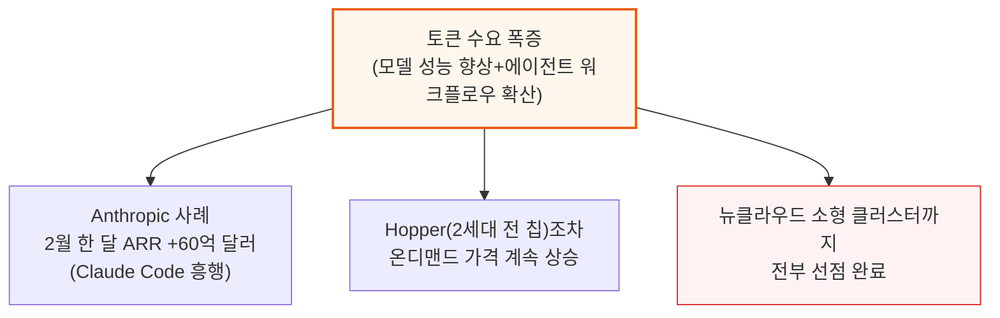

이런 공급난은 하이퍼스케일러의 2026년 자본지출 컨센서스를 큰 폭으로 밀어올렸습니다. Google은 데이터센터·서버 투자 중심으로 기존 전망 대비 거의 2배로 상향됐습니다.

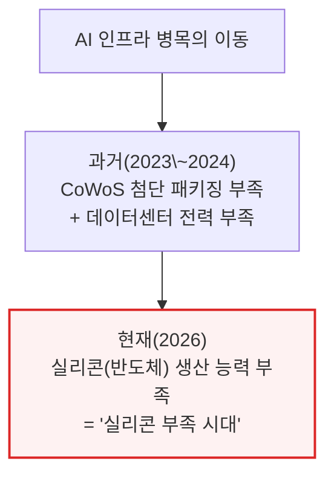

---

## 2. TSMC N3 웨이퍼 부족

**📌 핵심:**
- TSMC의 최선단 공정 N3는 2023년 양산을 시작했지만, 처음엔 주로 스마트폰·PC 수요가 견인 — 첫 버전 "N3B"는 수율 문제와 밀도 개선 대비 높은 비용으로 부진했고, EUV 노광 층수를 줄여 비용을 낮춘 "N3E"가 나오면서 본격 확산
- 2026년 들어 Nvidia·AMD·Google·AWS·Meta 등 주요 AI 가속기가 일제히 N3로 전환하면서, 스마트폰·PC 위주였던 N3 수요 구조가 AI 중심으로 완전히 뒤바뀜 → 이후 N2(2나노) 공정으로 넘어가기 전까지 AI가 N3 수요의 대부분을 차지할 전망
- GPU·가속기 칩뿐 아니라 주변 실리콘까지 N3로 몰림 — Vera CPU 전량 N3P 사용, NVLink 6 스위치·Tomahawk 6·Spectrum 6 같은 네트워킹 칩도 N3 기반이며, Rubin의 GPU당 1.6Tbps 네트워크 대역폭은 3나노 200G 광학 DSP 채택의 신호탄
- 결론: 이 수요 쏠림과 AI 컴퓨트 수요 증가가 겹치며 N3 웨이퍼 수요가 급격히 늘었는데, TSMC의 실제 공장 증설 속도(자본지출은 2025년에야 과거 최고치를 넘김)가 이를 못 따라가 수요 충격이 발생

---

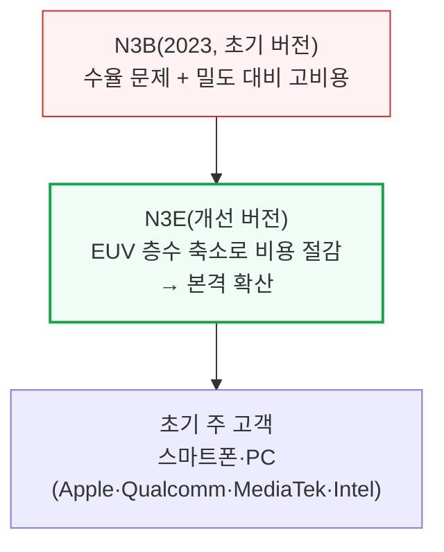

2026년부터는 이 구도가 완전히 바뀝니다. 거의 모든 주요 AI 가속기 업체가 N3로 몰려듭니다.

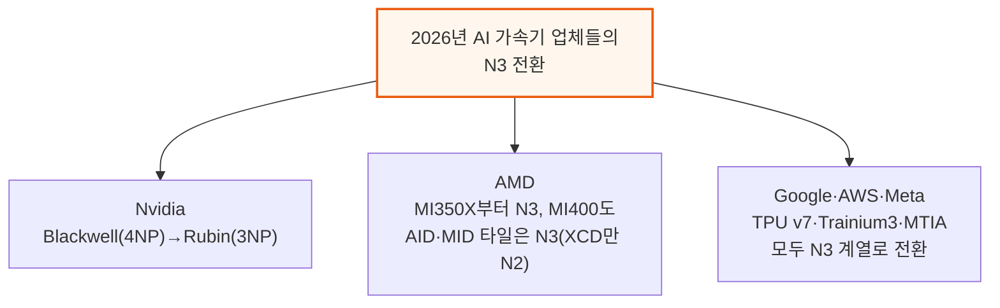

칩뿐 아니라 주변 실리콘도 N3로 몰립니다.

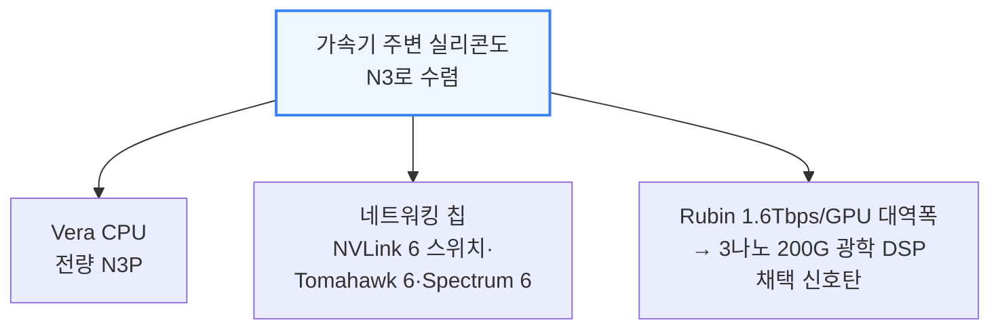

**📌 용어 풀이: 왜 TSMC는 증설 속도를 못 따라잡았나**
> - 역대 최대 규모의 AI 인프라 구축은 2022년 말 이미 시작됐지만, TSMC의 연간 설비투자(자본지출)는 2025년에 와서야 과거 최고치를 넘어섬 — 그만큼 공급망 전체가 수요 급증 속도를 과소평가했다는 뜻
> - TSMC는 올해(2026년) 작년 기록도 다시 경신할 예정 — 고객 수요가 자사 생산능력을 얼마나 크게 초과하는지 뒤늦게 파악했기 때문

TSMC는 경쟁사 Intel·Samsung 대비 기술 우위가 뚜렷하지만, 고객이 충분한 웨이퍼 물량 자체를 확보하지 못하면 그 우위는 의미가 줄어듭니다. 이 때문에 고객들이 파운드리 다변화를 모색하기 시작했습니다.

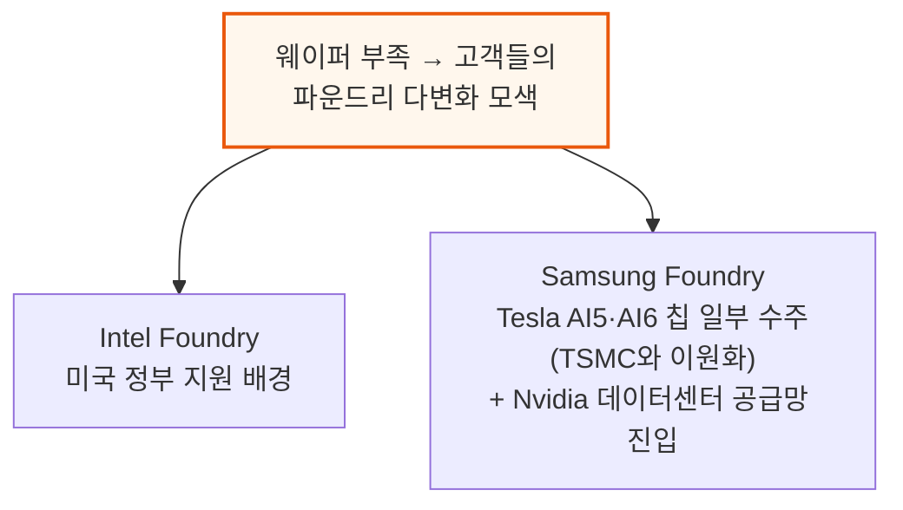

---

## 3. 숫자로 보는 N3 수요

**📌 핵심:**
- 올해(2026년) N3 웨이퍼 수요 중 AI 관련(가속기·호스트 CPU·네트워킹) 비중이 60%에 육박, 나머지 40%는 스마트폰·PC — 이 정도만으로도 N3 생산능력 전체를 다 채워, TSMC가 추가로 여유 물량을 만들 방법이 없음
- 2027년에는 이 쏠림이 더 심해져 AI 비중이 86%까지 상승, 스마트폰·PC 물량을 사실상 밀어냄 — 스마트폰 로드맵이 N2로 넘어가는 계획도 있지만, N3 공급난 자체가 이 전환을 앞당기는 요인
- N3에 계속 남는 제품 라인은 수요를 완전히 채우지 못할 가능성이 큼 — TSMC는 사실상 "누구에게 웨이퍼를 배정할지"를 정하는 킹메이커 역할을 하게 됨
- 결론: AI 가속기는 다이 크기가 크고 패키징이 복잡해 판매단가(ASP)가 높고, 이미 포화된 스마트폰·PC 시장보다 성장 여력도 훨씬 크다는 점에서 TSMC는 AI 고객에게 명확한 우선순위를 부여 — 물량을 확보 못 한 다른 업체는 기존 제품 수명 연장이나 N2 조기 전환을 강요받는 처지

---

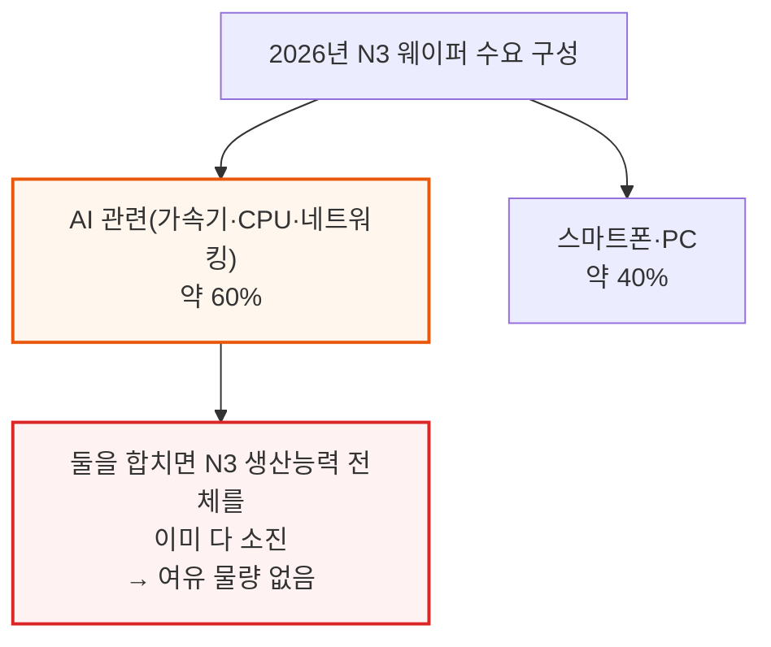

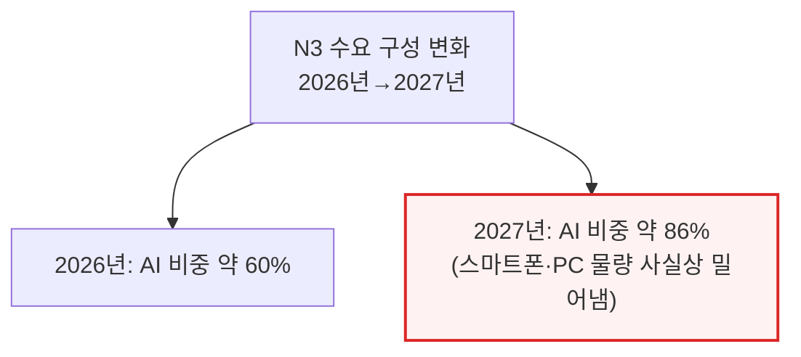

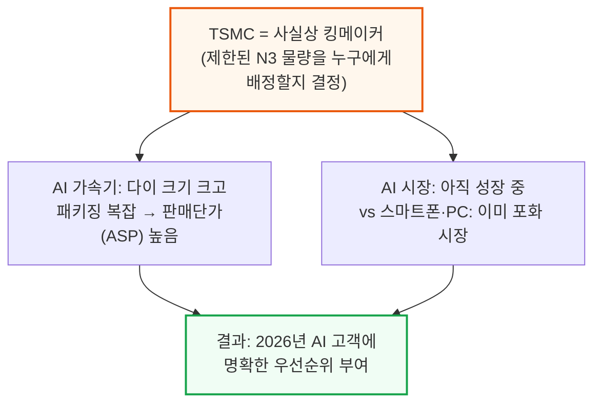

물량을 확보하지 못한 다른 분야 고객은 기존 제품 수명을 늘리거나, 아예 N2 공정으로 조기 전환하는 것 외에 대안이 많지 않습니다.

---

## 4. TSMC의 공급 상황

**📌 핵심:**
- 수요가 공급을 크게 앞서면서 TSMC는 명목 생산능력(팹 설계상 최대치)을 넘어서까지 웨이퍼를 뽑아내고 있음 — 2026년 하반기 N3 실효 가동률이 100%를 넘어설 전망
- TSMC는 일부 공정 단계를 다른 팹으로 옮겨 N3 여유 물량을 짜내고 있지만, 근본적 한계는 클린룸(반도체 장비를 설치할 수 있는 초정밀 공간) 면적 — 장비를 설치하기 전에 사용 가능한 팹 면적부터 새로 지어야 함
- 향후 2년간 TSMC는 수요를 완전히 충족할 만큼 생산능력을 늘릴 수 없음 → 신규 고객이 물량을 더 받으려면, 기존 고객이 이미 확보한 물량을 일부 내줘야 하는 "제로섬" 상황이 벌어질 가능성
- 결론: 클린룸 건설이라는 물리적 병목 때문에, 웨이퍼 공급 부족은 TSMC의 의지만으로 단기간에 풀리지 않는 구조적 제약

---

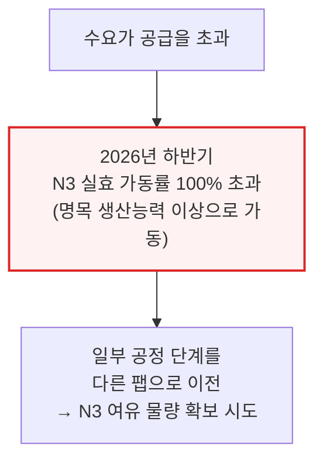

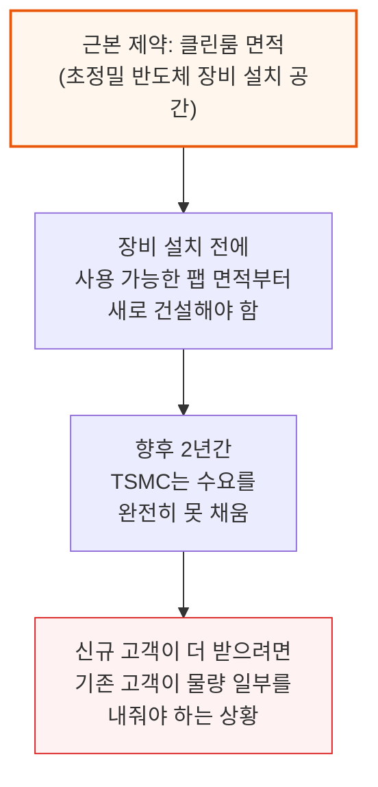

---

## 5. 스마트폰이 완화 밸브가 될까

**📌 핵심:**
- 스마트폰은 올해 N3 웨이퍼 수요 2위 항목이자, 수요가 꺾일 가능성이 가장 큰 부문 — Apple·MediaTek·Qualcomm 등은 이미 올해 스마트폰 출하량이 한 자릿수 초반만 성장한다는 전제로 공급망에 주문을 넣어둔 상태
- 그런데 메모리 가격 급등이 스마트폰 부품원가(BOM)를 밀어올려 소비자 판매가(ASP) 상승으로 이어지는 중 → 스마트폰 수요가 한 자릿수가 아니라 두 자릿수 감소로 하향 조정될 조짐이 이미 나타남
- 스마트폰 수요가 꺾이면 그만큼 N3 웨이퍼 물량이 AI 가속기로 넘어갈 수 있음 — 2026년 전체 스마트폰 N3 웨이퍼 투입량(43.7만 장) 중 5%만 재배정해도 Rubin GPU 약 10만 개 또는 TPU v7 약 30만 개를 추가 생산 가능, 25%를 재배정하면 Rubin GPU 약 70만 개 또는 TPU v7 약 150만 개까지 늘어남
- 결론: 다만 웨이퍼(전공정)는 AI 가속기 생산의 한 조각일 뿐 — 메모리(HBM)와 첨단 패키징(CoWoS) 물량이 함께 받쳐줘야 실제 출하로 이어짐

---

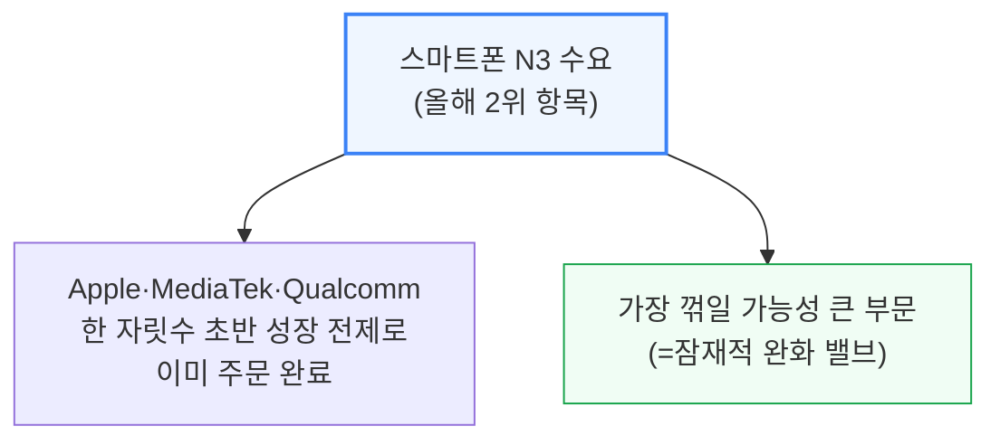

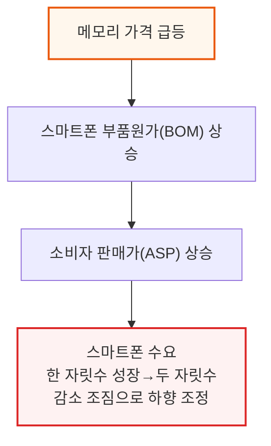

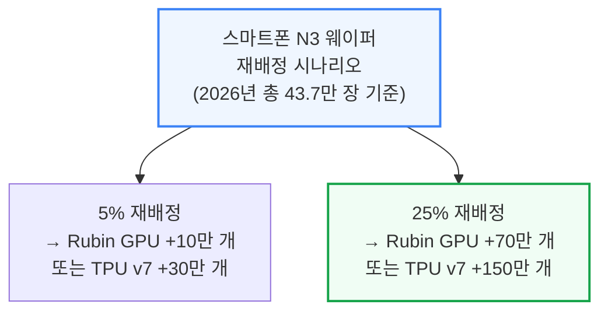

다만 이는 웨이퍼(전공정) 물량만 고려한 상한선입니다. 실제 AI 가속기 완성품 출하는 HBM 메모리와 CoWoS 첨단 패키징 물량이 함께 받쳐줘야 가능합니다.

---

## 6. 메모리, 다음 최대 병목

**📌 핵심:**
- HBM(고대역폭 메모리)은 같은 비트(데이터 용량) 기준으로 일반 D램(DDR)보다 약 3배 많은 웨이퍼를 필요로 하는데, 이 격차가 올해 HBM4로 넘어가며 거의 4배까지, 내년 HBM4E에서는 그보다 더 커질 전망 → D램 전체 생산능력이 늘어도 늘어난 물량 대부분이 HBM에 흡수돼 일반 D램(커모디티 D램)을 밀어냄
- 가속기 1개당 HBM 탑재량 자체도 급증 — Nvidia는 Blackwell→Blackwell Ultra·Rubin에서 HBM 용량 50% 증가, Rubin Ultra는 여기서 다시 약 4배 증가, TPU v8AX·Trainium3도 8단 적층에서 12단 적층으로, AMD MI350→MI400도 50% 증가
- 동시에 HBM4 핀 속도(칩 하나의 데이터 전송 속도) 목표가 초당 11기가비트(11Gb/s)까지 올라가는데, 이 속도를 양산 수율 손실 없이 달성하기가 어려움 — SK하이닉스·삼성은 비교적 순조롭지만 Micron은 뒤처지는 상황
- 결론: 서버용 일반 D램 수요도 함께 급증 중(예: Vera CPU 1개당 D램 용량이 Grace 대비 3배인 1,536GB) — HBM과 서버 D램이 동시에 커모디티 D램 공급을 양쪽에서 압박하는 구조

---

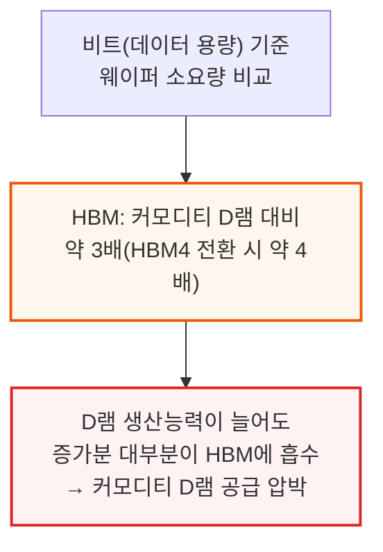

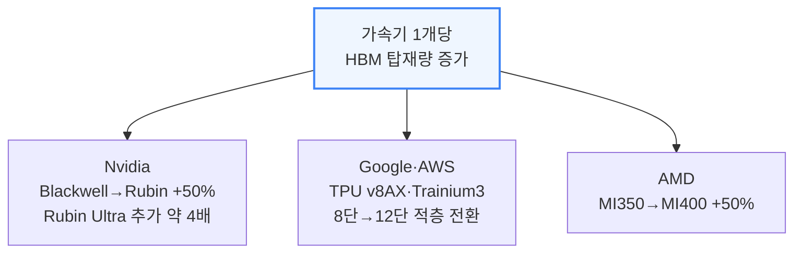

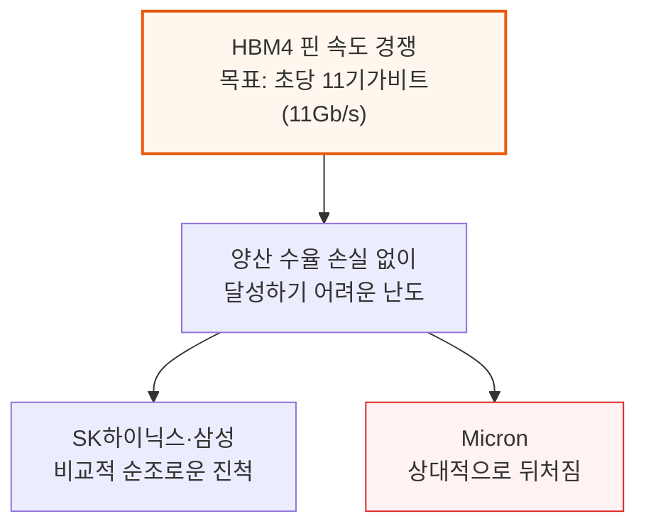

서버용 일반 D램 수요도 동시에 강해지고 있습니다.

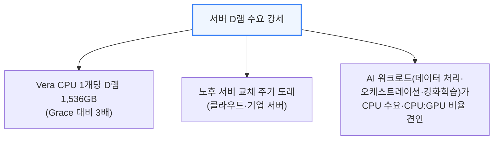

**📌 용어 풀이: HBM과 D램 사이 "마진 역전"이 공급을 더 조이는 이유**
> - 과거엔 HBM 마진이 일반 D램보다 훨씬 높아, 메모리 업체가 HBM 생산에 웨이퍼를 더 배정할 확실한 이유가 있었음
> - 그런데 최근 일반 D램(DDR) 가격이 급등하면서 DDR 마진이 기존 HBM 계약 마진에 근접하거나 넘어서는 역전 현상이 발생(적어도 2026년 기준)
> - 이 때문에 메모리 업체가 HBM 웨이퍼를 추가로 늘리게 하려면 고객이 기존 계약가보다 더 높은 가격을 지불해야 하며, 이 조정은 2027년 HBM 가격 협상에서 본격적으로 드러날 전망 — 반대로 HBM 쪽으로 물량이 더 쏠리면 일반 D램 공급은 더 타이트해지는 악순환

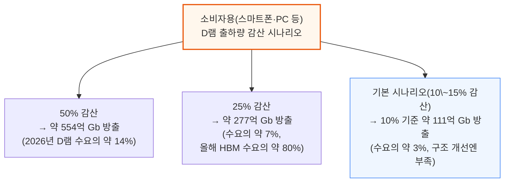

SemiAnalysis의 기본 시나리오는 소비자용 출하량이 10\~15% 감소하는 수준으로, 이 정도 방출량으로는 전반적인 수급 구조를 바꾸기엔 부족하다고 평가합니다. 삼성 등 주요 메모리 업체는 이미 이 정도의 소비자 수요 약세를 재고 계획에 반영해둔 것으로 파악됩니다.

---

*작성 진행률: 약 67% 완료*
*업데이트: 4\~6장(TSMC 공급 상황, 스마트폰 완화 밸브, 메모리 병목) 작성 완료*
