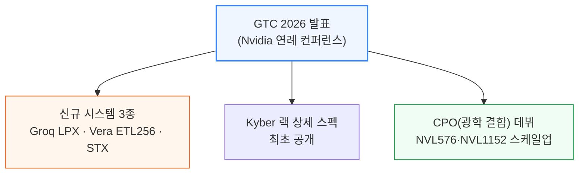
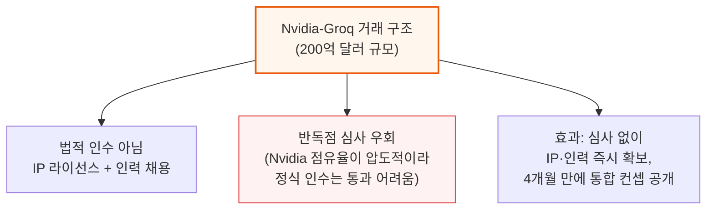
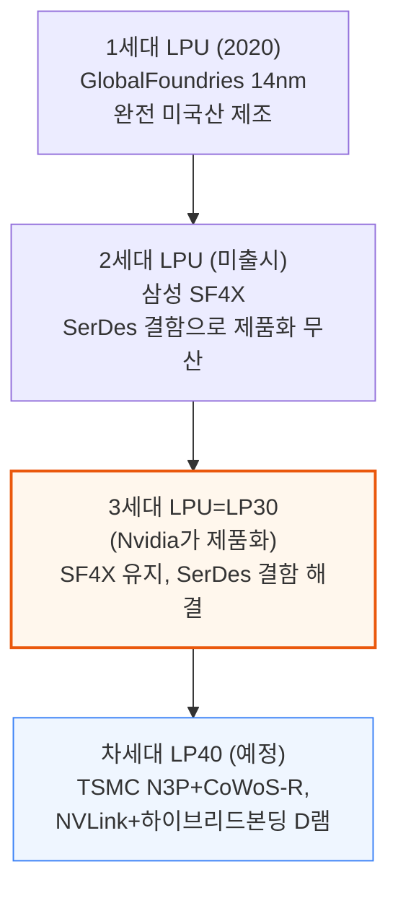
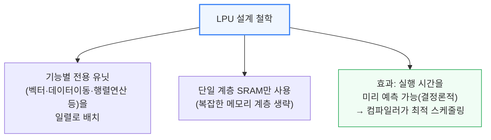
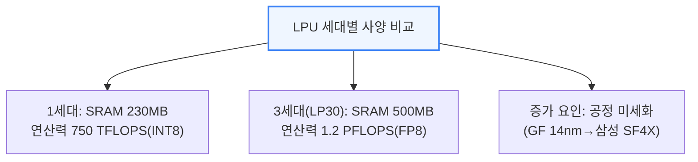
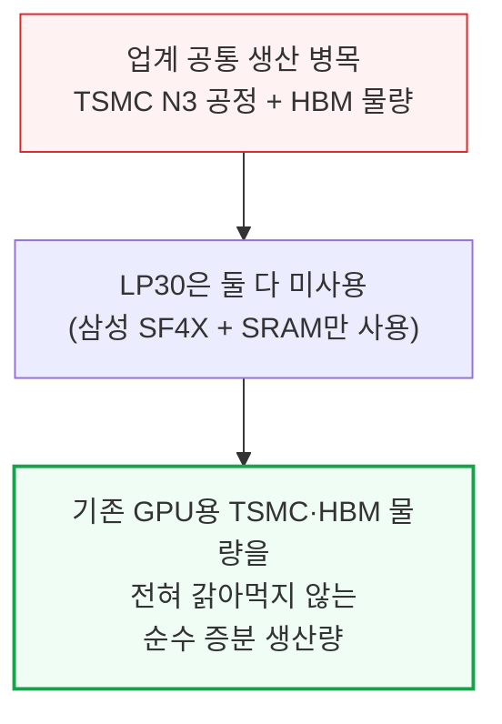
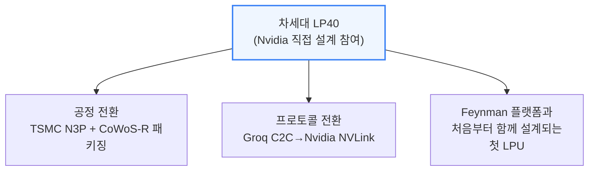

# GTC 2026 – The Inference Kingdom Expands

> **출처**: [SemiAnalysis Newsletter](https://newsletter.semianalysis.com/p/nvidia-the-inference-kingdom-expands)
> **저자**: Dylan Patel
> **발행일**: 2026-03-24

---

## 📑 목차

### 전체 섹션
 1. [서론: GTC 2026과 Nvidia의 추론 전략 확장](#1-서론-gtc-2026과-nvidia의-추론-전략-확장)
 2. [Groq LPU 인수 배경과 전략적 의미](#2-groq-lpu-인수-배경과-전략적-의미)
 3. [LPU 아키텍처와 3세대 칩(LP30)](#3-lpu-아키텍처와-3세대-칩lp30)
 4. [SRAM 메모리 계층과 GPU+LPU 결합 전략](#4-sram-메모리-계층과-gpulpu-결합-전략)
 5. [Attention-FFN 분리(AFD) 기술](#5-attention-ffn-분리afd-기술)
 6. [추측 디코딩(Speculative Decoding) 가속](#6-추측-디코딩speculative-decoding-가속)
 7. [LPX 랙 시스템과 컴퓨트 트레이](#7-lpx-랙-시스템과-컴퓨트-트레이)
 8. [LPU 네트워크: 스케일업 3단계 구조](#8-lpu-네트워크-스케일업-3단계-구조)
 9. [Nvidia의 CPO(공동 패키징 광학) 로드맵](#9-nvidia의-cpo공동-패키징-광학-로드맵)
10. [Oberon·Kyber 랙 업데이트와 대형 월드사이즈](#10-oberonkyber-랙-업데이트와-대형-월드사이즈)
11. [CMX와 STX: 컨텍스트 메모리·스토리지 플랫폼](#11-cmx와-stx-컨텍스트-메모리스토리지-플랫폼)
12. [Feynman NVL1152 네트워킹 토폴로지](#12-feynman-nvl1152-네트워킹-토폴로지)
13. [GTC 2026 공급망 영향](#13-gtc-2026-공급망-영향)

---

## 🔑 용어 정리

본문을 순서대로 읽기 전에 알아두면 좋은 용어들입니다. 자세한 수치와 설명은 본문에서 처음 등장하는 위치에 나옵니다.

- **LPU (Groq의 초저지연 추론 칩)**: 여러 범용 코어를 쓰는 GPU와 달리, 특정 연산 전용 유닛들을 일렬로 배치해 데이터가 정해진 순서대로만 흐르게 만든 칩 — 응답 속도(지연시간)에 특화
- **AFD (Attention-FFN 분리, Attention FFN Disaggregation)**: 추론 계산을 "주의(Attention)" 연산과 "전문가(FFN)" 연산으로 나눠, 서로 다른 성격의 칩(GPU·LPU)에 각각 맡기는 기법
- **스케일업 vs 스케일아웃**: 스케일업은 랙 한 대 안의 칩끼리 초고속으로 묶는 연결, 스케일아웃은 랙과 랙을 묶어 더 큰 클러스터를 만드는 연결
- **CPO (공동 패키징 광학, Co-Packaged Optics)**: 별도 광트랜시버 부품 대신 광신호 변환 회로를 칩 옆에 함께 패키징해, 랙과 랙 사이 장거리 연결의 전력·비용을 아끼는 기술
- **Oberon·Kyber (Nvidia 랙 아키텍처)**: Oberon은 현재 NVL72 세대에 쓰이는 랙 형태, Kyber는 GPU를 더 촘촘히 담아 랙 하나에 더 많은 칩(NVL144 이상)을 넣는 차세대 랙 형태
- **CMX (컨텍스트 메모리 저장소, 옛 이름 ICMS)**: 대화 중간 결과(KV 캐시)를 GPU 메모리·서버 메모리 다음 단계로 저장해두는 전용 스토리지 계층
- **KV 캐시**: 모델이 이전에 계산한 결과를 다시 계산하지 않도록 저장해두는 임시 데이터 — 대화가 길어질수록(문맥이 길수록) 커짐
- **MoE (전문가 혼합, Mixture-of-Experts)**: 모델 하나를 여러 개의 작은 "전문가" 모듈로 쪼개, 입력마다 그중 일부만 골라 계산하는 구조

---

## 1. 서론: GTC 2026과 Nvidia의 추론 전략 확장

**📌 핵심:**
- GTC 2026에서 Nvidia는 완전히 새로운 시스템 3종(Groq LPX, Vera ETL256, STX)을 처음 공개하고, 기존 Kyber 랙의 상세 스펙도 최초로 공개
- 지금까지 랙 내부 연결(스케일업)은 전선(구리)만 썼지만, 이번에 처음으로 광신호 직결 부품인 CPO를 랙과 랙 사이(NVL576·NVL1152급 초대형 클러스터) 연결에 투입하기 시작
- Groq의 초저지연 칩(LPU)을 결합한 추론 전용 신제품까지 더해, Nvidia는 학습(모델을 만드는 단계)뿐 아니라 추론(만든 모델을 서비스하는 단계) 하드웨어까지 장악하려는 전략을 구체화
- 결론: 이번 GTC는 Nvidia가 "GPU 제조사"에서 "추론 인프라 전체를 설계하는 회사"로 전환하고 있음을 보여주는 이벤트

---

이 리포트가 다루는 순서는 다음과 같습니다.
- Groq LPU 인수 배경과 LP30 칩, GPU와의 결합 기법(AFD·추측 디코딩)
- LPX 랙 시스템과 네트워크 구조
- Nvidia의 CPO 로드맵과 Oberon·Kyber 랙의 대형 월드사이즈(NVL288·NVL576·NVL1152) 확장
- CMX·STX 스토리지 플랫폼
- Feynman 세대 네트워킹 토폴로지와 공급망 영향

---

## 2. Groq LPU 인수 배경과 전략적 의미

**📌 핵심:**
- Nvidia는 Groq를 법적으로 인수(Acquisition)하지 않고, IP 라이선스와 핵심 인력 채용 형태로 200억 달러를 지불 → 효과는 "사실상 인수"지만 반독점 심사를 건너뛸 수 있는 구조
- Nvidia는 AI 가속기 시장 점유율이 압도적이라, 정식 인수였다면 반독점 심사 통과가 어려웠을 것 → 라이선스 방식으로 심사 자체를 우회하고 거래 완료 절차도 단축
- 계약 발표 후 4개월 만에 Nvidia는 벌써 Vera Rubin 추론 스택에 Groq 시스템을 통합한 컨셉을 공개할 정도로 초고속으로 통합을 진행
- 결론: Groq의 저지연 칩만 단독으로 팔면 대량 서비스에는 비경제적이지만, 빠른 응답 속도에 프리미엄을 지불하는 시장이 있다는 게 이 결합의 핵심 전제

---

**📌 용어 풀이: 왜 LPU 단독으로는 경제성이 없는가**
> - Groq의 독립형 LPU 시스템은 토큰(모델이 생성하는 단어 단위)당 서비스 비용이 GPU보다 비싸 대량 서비스에는 부적합
> - 다만 응답 속도가 매우 빨라, "빠른 응답"에 웃돈을 지불할 의향이 있는 고가치 시장(예: 실시간 대화형 서비스)에서는 큰 프리미엄을 받을 수 있음
> - 이 전제가 바로 "분산 디코드(Disaggregated Decode)" 구조의 근거 — LPU를 독립 제품이 아니라 GPU 클러스터의 특정 구간(디코드 단계)에만 투입하는 방식

---

## 3. LPU 아키텍처와 3세대 칩(LP30)

**📌 핵심:**
- Groq의 LPU는 범용 코어 여러 개를 쓰는 일반 칩과 달리, 기능별 전용 유닛("슬라이스")을 한 줄로 배치해 데이터가 정해진 순서로만 흐르게 만든 구조 → 실행 시간을 예측 가능(결정론적)하게 만들어 지연시간을 최소화
- 1세대(2020년)는 미국 GlobalFoundries 14나노 공정으로 제작해 "완전 미국산" 강점을 내세웠지만, 2세대(삼성 SF4X)는 고속 신호 연결(SerDes) 결함으로 끝내 제품화되지 못함
- 3세대 칩(LP30)이 바로 Nvidia가 이번에 제품화하는 버전 — 결함이던 SerDes 문제를 해결하고 SRAM 용량을 230MB→500MB, 연산력을 750TFLOPS(정수 8비트)→1.2PFLOPS(부동소수점 8비트)로 확대
- 결론: 다음 세대 LP40부터는 Nvidia가 직접 설계에 참여해 TSMC 3나노급 공정과 자체 NVLink 프로토콜을 적용, Feynman 플랫폼과 완전히 함께 설계될 예정

---

LPU가 지연시간을 줄이는 근본 원리는 "결정론적 실행"에 있습니다. 일반 칩은 여러 계층의 메모리(캐시 등)를 오가며 데이터를 찾는 과정에서 대기 시간이 들쑥날쑥하지만, LPU는 아래와 같이 미리 정해둔 경로로만 데이터가 흐릅니다.

**📌 용어 풀이: 결정론적 실행과 고대역 SRAM**
> - 컴퓨터 칩이 "결정론적"이라는 것은, 같은 연산을 몇 번을 돌려도 실행 시간이 항상 똑같다는 뜻 — 일반 칩은 캐시 적중 여부 등에 따라 실행 시간이 매번 달라짐
> - LPU는 데이터를 저장하는 곳을 SRAM(빠르지만 용량이 작고 비싼 메모리) 한 계층으로 단순화해, 컴파일러가 명령어 순서를 미리 정확히 계산해둘 수 있게 함
> - 이 예측 가능성과 SRAM의 높은 대역폭이 합쳐져, LPU가 짧고 정확한 응답 속도를 낼 수 있는 두 가지 핵심 요인

칩 사양은 세대를 거치며 아래처럼 발전했습니다.

LP30은 레티클(노광 장비가 한 번에 새길 수 있는 최대 면적) 크기에 가까운 단일 다이로, 별도의 첨단 패키징이 필요 없습니다. 다만 연산력(1.2PFLOPS)은 Nvidia GPU에 비하면 극히 일부에 불과해, LPU 단독으로는 대규모 연산을 감당할 수 없습니다.

삼성 SF4X 공정을 쓰는 또 다른 이점은 TSMC N3 공정처럼 생산 능력이 꽉 차 있지 않다는 점입니다. TSMC N3와 HBM(고대역폭 메모리)은 현재 업계 전체의 생산 병목입니다.

Nvidia는 LP30의 소규모 개선판인 LP35도 함께 발표했습니다. SF4 공정은 그대로 유지하면서 NVFP4(저정밀 수치 포맷)만 새로 지원하는 수준입니다.

다음 세대인 LP40부터는 Nvidia가 설계에 직접 참여합니다.

온칩 메모리를 늘리기 위해 하이브리드 본딩 D램(SRAM과 거의 비슷한 속도를 내면서 용량은 훨씬 큰 메모리)을 도입할 계획이며, 이 D램은 SK하이닉스가 공급합니다.

---

*작성 진행률: 약 23% 완료*
*업데이트: 헤더·목차·용어 정리, 1\~3장(서론, Groq 인수 배경, LPU 아키텍처·LP30) 작성 완료*
