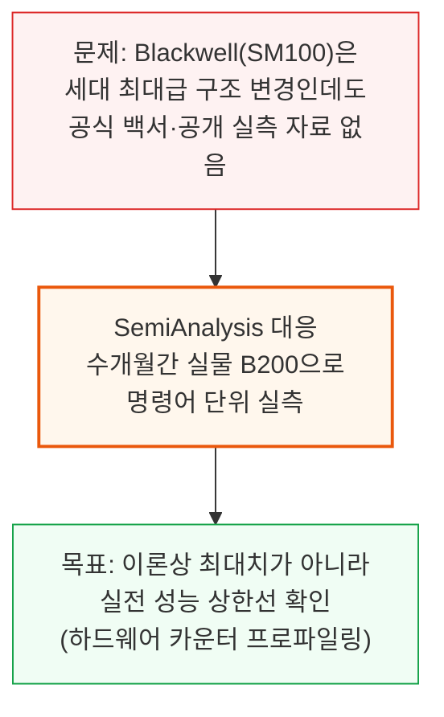
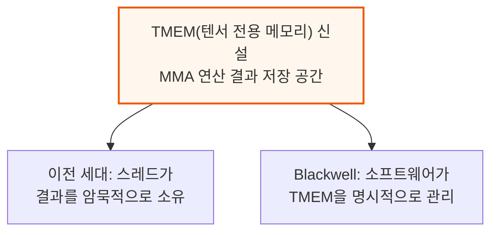
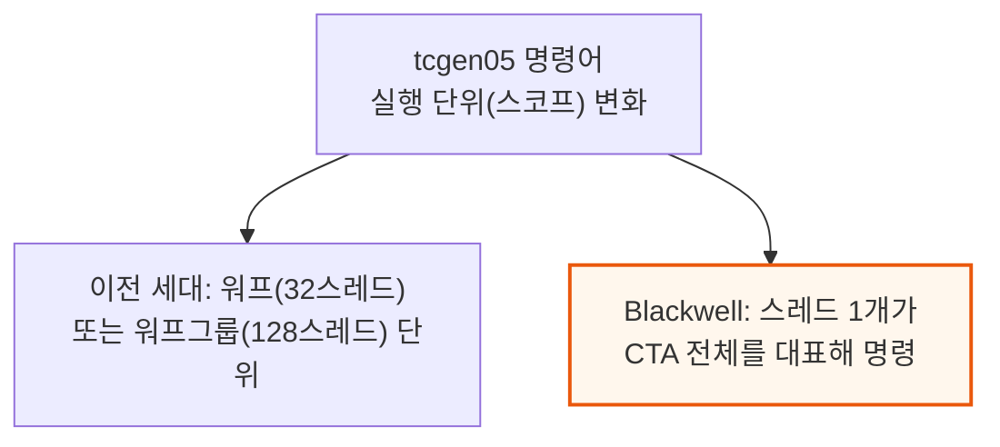
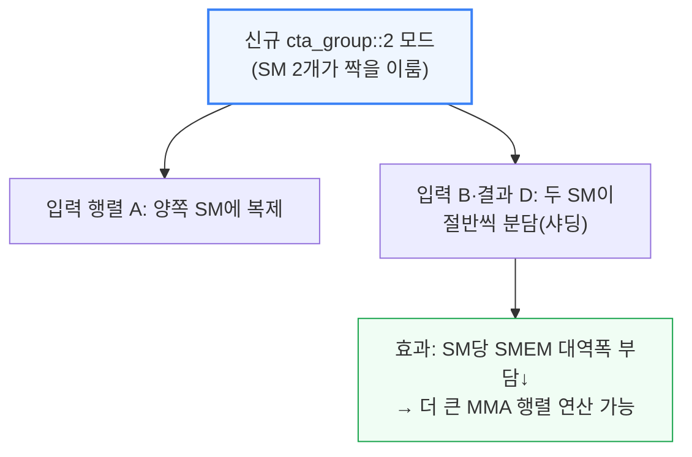
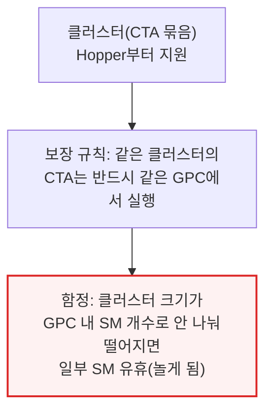
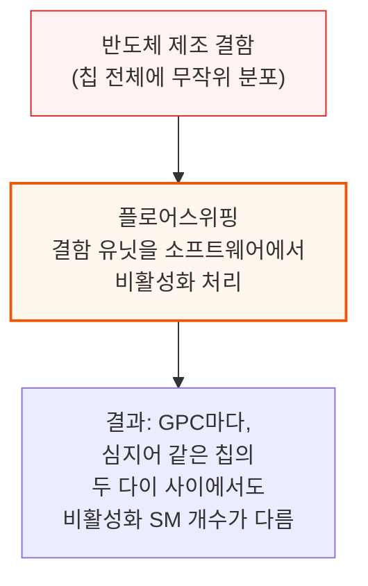
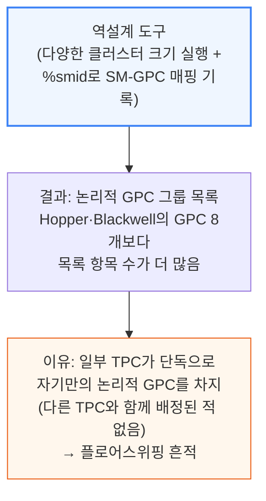

# Dissecting Nvidia Blackwell - Tensor Cores, PTX Instructions, SASS, Floorsweep, Yield

> **출처**: [SemiAnalysis Newsletter](https://newsletter.semianalysis.com/p/dissecting-nvidia-blackwell-tensor)
> **저자**: Kimbo Chen
> **발행일**: 2026-04-01

---

## 📑 목차

### 전체 섹션
 1. [서론: Blackwell 마이크로벤치마킹의 목적과 방법](#1-서론-blackwell-마이크로벤치마킹의-목적과-방법)
 2. [Blackwell 아키텍처 주요 변경점](#2-blackwell-아키텍처-주요-변경점)
 3. [클러스터·GPC·플로어스위핑](#3-클러스터gpc플로어스위핑)
 4. [논리적 GPC vs 물리적 GPC 배치](#4-논리적-gpc-vs-물리적-gpc-배치)
 5. [메모리 서브시스템과 비동기 복사(LDGSTS)](#5-메모리-서브시스템과-비동기-복사ldgsts)
 6. [TMA(텐서 메모리 가속기)](#6-tma텐서-메모리-가속기)
 7. [비동기 복사 vs TMA 비교와 TMA 멀티캐스트](#7-비동기-복사-vs-tma-비교와-tma-멀티캐스트)
 8. [DSMEM vs SMEM](#8-dsmem-vs-smem)
 9. [5세대 텐서 코어 MMA: 처리량 분석](#9-5세대-텐서-코어-mma-처리량-분석)
10. [MMA 지연시간과 In-flight 명령어 수에 따른 처리량](#10-mma-지연시간과-in-flight-명령어-수에-따른-처리량)
11. [실전 사례: CUTLASS GEMM 커널 벤치마크](#11-실전-사례-cutlass-gemm-커널-벤치마크)
12. [칩 플로어플랜과 향후 계획](#12-칩-플로어플랜과-향후-계획)

---

## 🔑 용어 정리

본문을 순서대로 읽기 전에 알아두면 좋은 용어들입니다. 자세한 수치와 설명은 본문에서 처음 등장하는 위치에 나옵니다.

- **마이크로벤치마킹 (Microbenchmarking)**: 칩 제조사가 발표하는 이론상 최대 성능(스펙) 대신, 실제 명령어 하나하나를 반복 실행해 "실전에서 실제로 낼 수 있는 성능 상한선"을 직접 측정하는 방법
- **GPC (Graphics Processing Cluster)**: GPU 내부를 여러 구역으로 나눈 최상위 묶음 — SM(연산 코어) 여러 개가 GPC 하나에 속하며, 같은 클러스터로 실행되는 작업은 반드시 같은 GPC 안에 배정됨
- **플로어스위핑 (Floorsweeping)**: 반도체 제조 과정에서 생기는 불량 회로 일부를 소프트웨어에서 아예 안 보이게 비활성화해, 결함이 있어도 칩을 정상 제품으로 출하할 수 있게 하는 기법
- **MMA 명령어 (Matrix Multiply-Accumulate)**: "D = A×B+C" 형태의 행렬 곱셈+누적을 한 번에 처리하는 텐서 코어의 핵심 명령어 — AI 모델 연산 대부분이 이 명령어의 반복 실행
- **TMA (Tensor Memory Accelerator, 텐서 메모리 가속기)**: 대용량 데이터를 메모리 사이에서 자동으로 옮겨주는 전용 하드웨어 — 스레드 하나만 명령을 내리면 나머지 스레드는 다른 일을 할 수 있음
- **SMEM·DSMEM (공유 메모리·분산 공유 메모리)**: SMEM은 GPU 연산 블록 하나가 쓰는 초고속 내장 메모리, DSMEM은 여러 연산 블록이 클러스터로 묶였을 때 서로의 SMEM까지 넘볼 수 있게 확장한 것
- **CUTLASS**: Nvidia가 공개한 오픈소스 라이브러리로, 행렬 곱셈(GEMM) 커널을 세대별 GPU에 맞게 최적화해 짤 수 있게 해주는 도구 — 실제 AI 학습·추론 소프트웨어 다수가 이 라이브러리를 기반으로 함

---

## 1. 서론: Blackwell 마이크로벤치마킹의 목적과 방법

**📌 핵심:**
- Nvidia의 데이터센터용 Blackwell GPU(코드명 SM100)는 최근 세대 중 가장 큰 폭의 구조 변경을 담았는데도, 지금까지 공식 백서도 없고 PTX·SASS(GPU 명령어 체계) 수준의 공개 실측 자료도 없었음
- SemiAnalysis는 앞서 발표한 "텐서 코어 진화" 리포트에 이어, 수개월간 Blackwell 실물 장비를 직접 뜯어 명령어 단위로 성능을 측정 — 목표는 제조사가 발표하는 이론상 최대치가 아니라 "실전에서 실제로 낼 수 있는 성능 상한선"을 확인하는 것
- 특히 FlashInfer 같은 실제 딥러닝 라이브러리가 쓰는 비동기 메모리 복사 설정을 그대로 재현해 벤치마크하여, 순수 이론 스펙이 아니라 실무 커널 개발에 바로 쓸 수 있는 기준치를 제공
- 결론: 이 리포트는 Blackwell을 실제로 사용하는 AI 시스템 엔지니어·커널 개발자를 위한 "실측 매뉴얼"이며, 벤치마크 코드 전체를 오픈소스로 공개

---

이 리포트가 다루는 범위는 다음과 같습니다.
- Blackwell 아키텍처의 주요 신규 기능(텐서 전용 메모리, tcgen05 명령어 등)
- 클러스터·GPC 구조와 제조 결함을 숨기는 플로어스위핑
- 메모리 이동 명령어(비동기 복사, TMA)와 행렬곱 명령어(MMA)의 실측 처리량·지연시간
- CUTLASS 라이브러리를 이용한 실전 GEMM(행렬곱) 커널 사례와 칩 물리 배치

벤치마크는 Nebius·Verda가 제공한 B200 노드(하드웨어 성능 카운터가 정상 활성화된 장비)에서 NCU(Nsight Compute) 프로파일링 도구로 진행했습니다. 코드는 GitHub에 전체 공개했으며, Hopper 아키텍처 실측 선행 연구와 tcgen05 관련 커뮤니티 자료를 참고해 벤치마크를 설계했습니다.

---

## 2. Blackwell 아키텍처 주요 변경점

**📌 핵심:**
- Blackwell은 MMA(행렬곱+누적) 연산 결과를 담아두는 전용 메모리 공간(TMEM)을 신설 — 이전 세대는 스레드가 결과를 암묵적으로 소유했지만, Blackwell부터는 소프트웨어가 TMEM을 명시적으로 관리해야 함
- `tcgen05` 계열 명령어는 스레드 하나가 CTA(협력 스레드 블록) 전체를 대표해 실행 — 이전 세대(워프 32개 또는 워프그룹 128개 단위)보다 관리 단위가 더 커짐
- 신규 `cta_group::2` 모드는 SM 2개가 짝을 지어 하나의 MMA 연산을 나눠 수행(입력 행렬 A는 복제, B·D는 절반씩 분담) — SM당 필요한 SMEM 대역폭을 줄이면서 더 큰 행렬 연산을 가능하게 함
- 결론: sub-byte(1바이트 미만) 데이터 타입의 마이크로스케일링 지원, 동적 작업 스케줄링을 위한 CLC(Cluster Launch Control), 커널 실행 지연을 줄이는 PDL(Programmatic Dependent Launch)까지 더해 Blackwell은 메모리 관리·명령어 스코프·데이터 타입 세 축 모두에서 구조를 바꿈

---

**📌 용어 풀이: CTA·클러스터와 그 밖의 신규 기능**
> - CTA(협력 스레드 배열, Cooperative Thread Array)는 GPU에서 함께 실행되는 스레드 묶음의 기본 단위 — 이후 3장에서 다루는 "클러스터"는 CTA 여러 개를 묶은 상위 단위
> - sub-byte 데이터 타입 마이크로스케일링: 1바이트보다 작은 초저정밀 숫자 형식도 정확도 손실을 줄이는 보정(스케일링) 기법과 함께 하드웨어가 직접 지원
> - CLC(클러스터 실행 제어): 커널이 끝까지 CTA 개수를 고정하지 않고, 실행 도중 동적으로 작업을 배분할 수 있게 하는 하드웨어 기능(후속 리포트에서 상세 예정)
> - PDL(프로그래밍적 종속 실행): Hopper부터 도입된 기능으로, 연속으로 실행되는 커널 사이의 준비 시간(지연)을 겹쳐서 숨기는 방식(후속 리포트에서 상세 예정)

---

## 3. 클러스터·GPC·플로어스위핑

**📌 핵심:**
- 클러스터는 Hopper부터 지원하는 기능으로, CTA 여러 개를 논리적으로 묶어 커널마다 모양·크기를 정할 수 있게 함 — 같은 클러스터에 속한 CTA는 반드시 같은 GPC 안에서 실행되도록 보장됨
- 문제는 클러스터 크기가 GPC 안의 SM 개수로 딱 나눠떨어지지 않으면 일부 SM이 놀게 된다는 점 — 문서화가 부실해 이를 모르는 개발자는 SM 개수만큼 CTA를 실행해도 일부가 밀려서(직렬화되어) 실행되는 함정에 빠짐
- GPC마다, 심지어 같은 칩의 두 다이(die) 사이에서도 비활성화(플로어스위핑)된 SM 개수가 다름 — 제조 결함이 칩 전체에 무작위로 분포하기 때문에 Nvidia는 결함 있는 유닛을 소프트웨어에 균일하게 노출시키는 설계를 씀
- 결론: SM100(Blackwell)부터는 "선호 클러스터 크기"와 "대체 클러스터 크기"를 함께 지정할 수 있어, 대체 크기를 1이나 2로 설정하면 결함으로 남은 SM까지 낭비 없이 모두 활용 가능

---

이 함정은 실제로 커널 개발자에게 자주 발생합니다. 예를 들어 "1 CTA당 SM 1개"를 쓰는 지속형(persistent) CTA 커널을, 문서화가 부실한 GPC 구조를 모른 채 SM 총개수만큼 실행하면 일부 CTA가 밀려 직렬 처리됩니다.

SemiAnalysis는 Claude를 활용해 SM-GPC 매핑을 역설계하는 도구를 직접 제작했습니다. 다양한 크기의 클러스터를 실행시키고, PTX의 `%smid`(SM 고유번호 조회) 명령으로 어떤 SM들이 같은 GPC에 함께 배정되는지 기록하는 방식입니다.

**📌 용어 풀이: 왜 "단독 TPC"가 플로어스위핑의 증거인가**
> - TPC(Texture Processing Cluster)는 GPC 안에서 SM을 몇 개씩 묶은 중간 단위 — 정상적인 칩이라면 TPC들이 여러 개씩 짝을 지어 함께 스케줄링됨
> - 그런데 역설계 결과 일부 TPC는 다른 TPC와 전혀 함께 묶이지 않고 "혼자만의 그룹"으로 나타남 — 원래 짝이었던 TPC가 제조 결함으로 비활성화(플로어스위핑)되어, 남은 TPC 혼자 논리적 GPC 자리를 차지하고 있다는 뜻
> - 이 흔적 덕분에 공개 문서 없이도 실측만으로 칩 내부의 결함 분포를 간접적으로 추정할 수 있음

SM100(Blackwell)은 이 수량 불일치 문제에 대한 해법을 제공합니다. 커널을 "선호 클러스터 크기"와 "대체(fallback) 클러스터 크기" 두 가지로 함께 실행할 수 있는데, GPU 전체를 낭비 없이 쓰려면 대체 크기를 1이나 2로 설정하는 것이 일반적입니다.

---

*작성 진행률: 약 25% 완료*
*업데이트: 헤더·목차·용어 정리, 1\~3장(서론, 아키텍처 변경점, 클러스터·GPC·플로어스위핑) 작성 완료*
