# Dissecting Nvidia Blackwell - Tensor Cores, PTX Instructions, SASS, Floorsweep, Yield

> **출처**: [SemiAnalysis Newsletter](https://newsletter.semianalysis.com/p/dissecting-nvidia-blackwell-tensor)
> **저자**: Kimbo Chen
> **발행일**: 2026-04-01

---

## 📑 목차

### 전체 섹션
 1. [서론: Blackwell 마이크로벤치마킹의 목적과 방법](#1-서론-blackwell-마이크로벤치마킹의-목적과-방법)
 2. [Blackwell 아키텍처 주요 변경점](#2-blackwell-아키텍처-주요-변경점)
 3. [클러스터·GPC·플로어스위핑](#3-클러스터gpc플로어스위핑)
 4. [논리적 GPC vs 물리적 GPC 배치](#4-논리적-gpc-vs-물리적-gpc-배치)
 5. [메모리 서브시스템과 비동기 복사(LDGSTS)](#5-메모리-서브시스템과-비동기-복사ldgsts)
 6. [TMA(텐서 메모리 가속기)](#6-tma텐서-메모리-가속기)
 7. [비동기 복사 vs TMA 비교와 TMA 멀티캐스트](#7-비동기-복사-vs-tma-비교와-tma-멀티캐스트)
 8. [DSMEM vs SMEM](#8-dsmem-vs-smem)
 9. [5세대 텐서 코어 MMA: 처리량 분석](#9-5세대-텐서-코어-mma-처리량-분석)
10. [MMA 지연시간과 In-flight 명령어 수에 따른 처리량](#10-mma-지연시간과-in-flight-명령어-수에-따른-처리량)
11. [실전 사례: CUTLASS GEMM 커널 벤치마크](#11-실전-사례-cutlass-gemm-커널-벤치마크)
12. [칩 플로어플랜과 향후 계획](#12-칩-플로어플랜과-향후-계획)

---

## 🔑 용어 정리

본문을 순서대로 읽기 전에 알아두면 좋은 용어들입니다. 자세한 수치와 설명은 본문에서 처음 등장하는 위치에 나옵니다.

- **마이크로벤치마킹 (Microbenchmarking)**: 칩 제조사가 발표하는 이론상 최대 성능(스펙) 대신, 실제 명령어 하나하나를 반복 실행해 "실전에서 실제로 낼 수 있는 성능 상한선"을 직접 측정하는 방법
- **GPC (Graphics Processing Cluster)**: GPU 내부를 여러 구역으로 나눈 최상위 묶음 — SM(연산 코어) 여러 개가 GPC 하나에 속하며, 같은 클러스터로 실행되는 작업은 반드시 같은 GPC 안에 배정됨
- **플로어스위핑 (Floorsweeping)**: 반도체 제조 과정에서 생기는 불량 회로 일부를 소프트웨어에서 아예 안 보이게 비활성화해, 결함이 있어도 칩을 정상 제품으로 출하할 수 있게 하는 기법
- **MMA 명령어 (Matrix Multiply-Accumulate)**: "D = A×B+C" 형태의 행렬 곱셈+누적을 한 번에 처리하는 텐서 코어의 핵심 명령어 — AI 모델 연산 대부분이 이 명령어의 반복 실행
- **TMA (Tensor Memory Accelerator, 텐서 메모리 가속기)**: 대용량 데이터를 메모리 사이에서 자동으로 옮겨주는 전용 하드웨어 — 스레드 하나만 명령을 내리면 나머지 스레드는 다른 일을 할 수 있음
- **SMEM·DSMEM (공유 메모리·분산 공유 메모리)**: SMEM은 GPU 연산 블록 하나가 쓰는 초고속 내장 메모리, DSMEM은 여러 연산 블록이 클러스터로 묶였을 때 서로의 SMEM까지 넘볼 수 있게 확장한 것
- **CUTLASS**: Nvidia가 공개한 오픈소스 라이브러리로, 행렬 곱셈(GEMM) 커널을 세대별 GPU에 맞게 최적화해 짤 수 있게 해주는 도구 — 실제 AI 학습·추론 소프트웨어 다수가 이 라이브러리를 기반으로 함

---

## 1. 서론: Blackwell 마이크로벤치마킹의 목적과 방법

**📌 핵심:**
- Nvidia의 데이터센터용 Blackwell GPU(코드명 SM100)는 최근 세대 중 가장 큰 폭의 구조 변경을 담았는데도, 지금까지 공식 백서도 없고 PTX·SASS(GPU 명령어 체계) 수준의 공개 실측 자료도 없었음
- SemiAnalysis는 앞서 발표한 "텐서 코어 진화" 리포트에 이어, 수개월간 Blackwell 실물 장비를 직접 뜯어 명령어 단위로 성능을 측정 — 목표는 제조사가 발표하는 이론상 최대치가 아니라 "실전에서 실제로 낼 수 있는 성능 상한선"을 확인하는 것
- 특히 FlashInfer 같은 실제 딥러닝 라이브러리가 쓰는 비동기 메모리 복사 설정을 그대로 재현해 벤치마크하여, 순수 이론 스펙이 아니라 실무 커널 개발에 바로 쓸 수 있는 기준치를 제공
- 결론: 이 리포트는 Blackwell을 실제로 사용하는 AI 시스템 엔지니어·커널 개발자를 위한 "실측 매뉴얼"이며, 벤치마크 코드 전체를 오픈소스로 공개

---

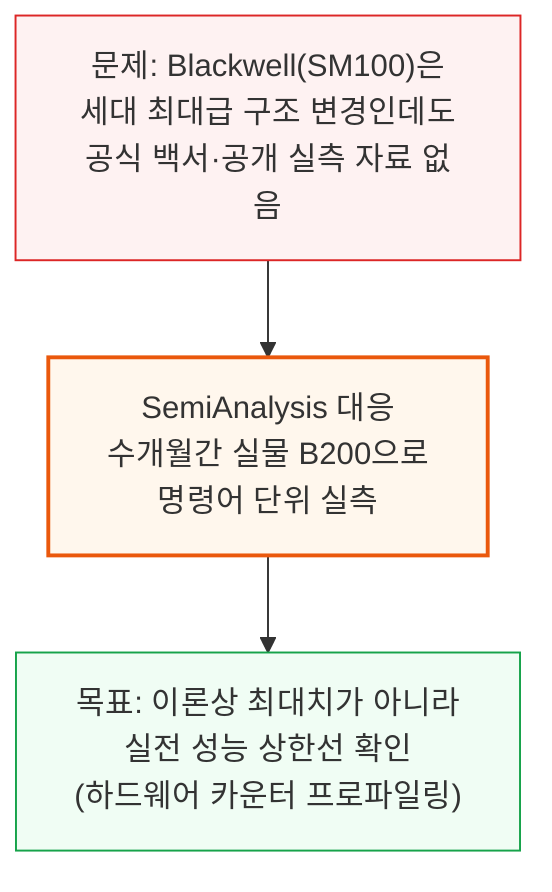

이 리포트가 다루는 범위는 다음과 같습니다.
- Blackwell 아키텍처의 주요 신규 기능(텐서 전용 메모리, tcgen05 명령어 등)
- 클러스터·GPC 구조와 제조 결함을 숨기는 플로어스위핑
- 메모리 이동 명령어(비동기 복사, TMA)와 행렬곱 명령어(MMA)의 실측 처리량·지연시간
- CUTLASS 라이브러리를 이용한 실전 GEMM(행렬곱) 커널 사례와 칩 물리 배치

벤치마크는 Nebius·Verda가 제공한 B200 노드(하드웨어 성능 카운터가 정상 활성화된 장비)에서 NCU(Nsight Compute) 프로파일링 도구로 진행했습니다. 코드는 GitHub에 전체 공개했으며, Hopper 아키텍처 실측 선행 연구와 tcgen05 관련 커뮤니티 자료를 참고해 벤치마크를 설계했습니다.

---

## 2. Blackwell 아키텍처 주요 변경점

**📌 핵심:**
- Blackwell은 MMA(행렬곱+누적) 연산 결과를 담아두는 전용 메모리 공간(TMEM)을 신설 — 이전 세대는 스레드가 결과를 암묵적으로 소유했지만, Blackwell부터는 소프트웨어가 TMEM을 명시적으로 관리해야 함
- `tcgen05` 계열 명령어는 스레드 하나가 CTA(협력 스레드 블록) 전체를 대표해 실행 — 이전 세대(워프 32개 또는 워프그룹 128개 단위)보다 관리 단위가 더 커짐
- 신규 `cta_group::2` 모드는 SM 2개가 짝을 지어 하나의 MMA 연산을 나눠 수행(입력 행렬 A는 복제, B·D는 절반씩 분담) — SM당 필요한 SMEM 대역폭을 줄이면서 더 큰 행렬 연산을 가능하게 함
- 결론: sub-byte(1바이트 미만) 데이터 타입의 마이크로스케일링 지원, 동적 작업 스케줄링을 위한 CLC(Cluster Launch Control), 커널 실행 지연을 줄이는 PDL(Programmatic Dependent Launch)까지 더해 Blackwell은 메모리 관리·명령어 스코프·데이터 타입 세 축 모두에서 구조를 바꿈

---

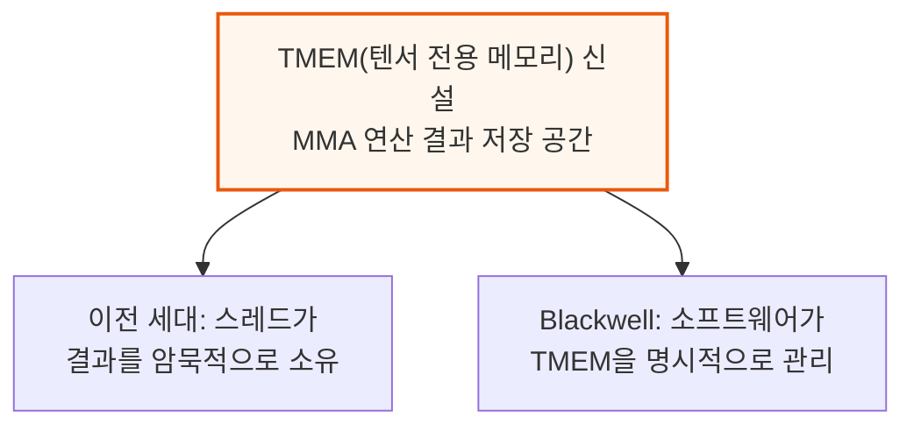

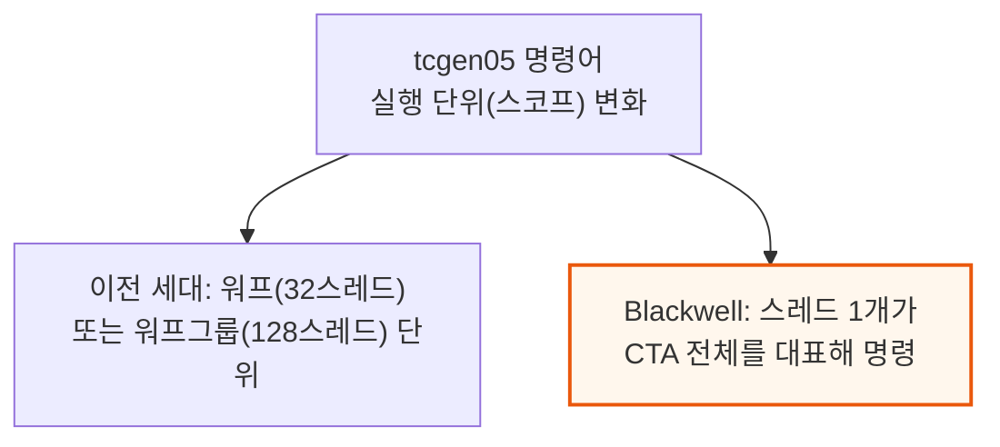

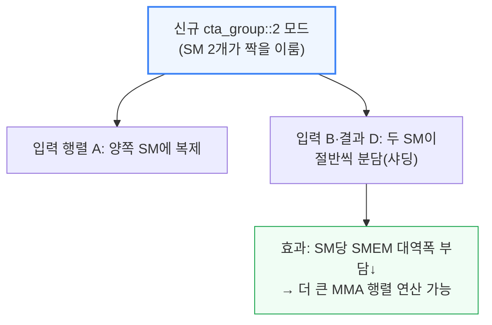

**📌 용어 풀이: CTA·클러스터와 그 밖의 신규 기능**
> - CTA(협력 스레드 배열, Cooperative Thread Array)는 GPU에서 함께 실행되는 스레드 묶음의 기본 단위 — 이후 3장에서 다루는 "클러스터"는 CTA 여러 개를 묶은 상위 단위
> - sub-byte 데이터 타입 마이크로스케일링: 1바이트보다 작은 초저정밀 숫자 형식도 정확도 손실을 줄이는 보정(스케일링) 기법과 함께 하드웨어가 직접 지원
> - CLC(클러스터 실행 제어): 커널이 끝까지 CTA 개수를 고정하지 않고, 실행 도중 동적으로 작업을 배분할 수 있게 하는 하드웨어 기능(후속 리포트에서 상세 예정)
> - PDL(프로그래밍적 종속 실행): Hopper부터 도입된 기능으로, 연속으로 실행되는 커널 사이의 준비 시간(지연)을 겹쳐서 숨기는 방식(후속 리포트에서 상세 예정)

---

## 3. 클러스터·GPC·플로어스위핑

**📌 핵심:**
- 클러스터는 Hopper부터 지원하는 기능으로, CTA 여러 개를 논리적으로 묶어 커널마다 모양·크기를 정할 수 있게 함 — 같은 클러스터에 속한 CTA는 반드시 같은 GPC 안에서 실행되도록 보장됨
- 문제는 클러스터 크기가 GPC 안의 SM 개수로 딱 나눠떨어지지 않으면 일부 SM이 놀게 된다는 점 — 문서화가 부실해 이를 모르는 개발자는 SM 개수만큼 CTA를 실행해도 일부가 밀려서(직렬화되어) 실행되는 함정에 빠짐
- GPC마다, 심지어 같은 칩의 두 다이(die) 사이에서도 비활성화(플로어스위핑)된 SM 개수가 다름 — 제조 결함이 칩 전체에 무작위로 분포하기 때문에 Nvidia는 결함 있는 유닛을 소프트웨어에 균일하게 노출시키는 설계를 씀
- 결론: SM100(Blackwell)부터는 "선호 클러스터 크기"와 "대체 클러스터 크기"를 함께 지정할 수 있어, 대체 크기를 1이나 2로 설정하면 결함으로 남은 SM까지 낭비 없이 모두 활용 가능

---

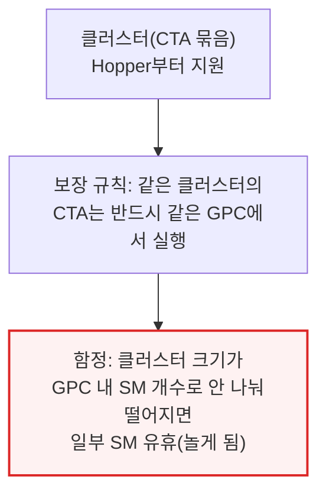

이 함정은 실제로 커널 개발자에게 자주 발생합니다. 예를 들어 "1 CTA당 SM 1개"를 쓰는 지속형(persistent) CTA 커널을, 문서화가 부실한 GPC 구조를 모른 채 SM 총개수만큼 실행하면 일부 CTA가 밀려 직렬 처리됩니다.

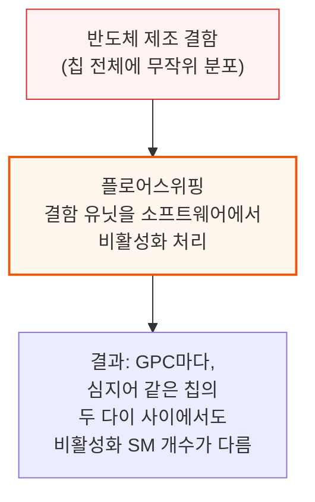

SemiAnalysis는 Claude를 활용해 SM-GPC 매핑을 역설계하는 도구를 직접 제작했습니다. 다양한 크기의 클러스터를 실행시키고, PTX의 `%smid`(SM 고유번호 조회) 명령으로 어떤 SM들이 같은 GPC에 함께 배정되는지 기록하는 방식입니다.

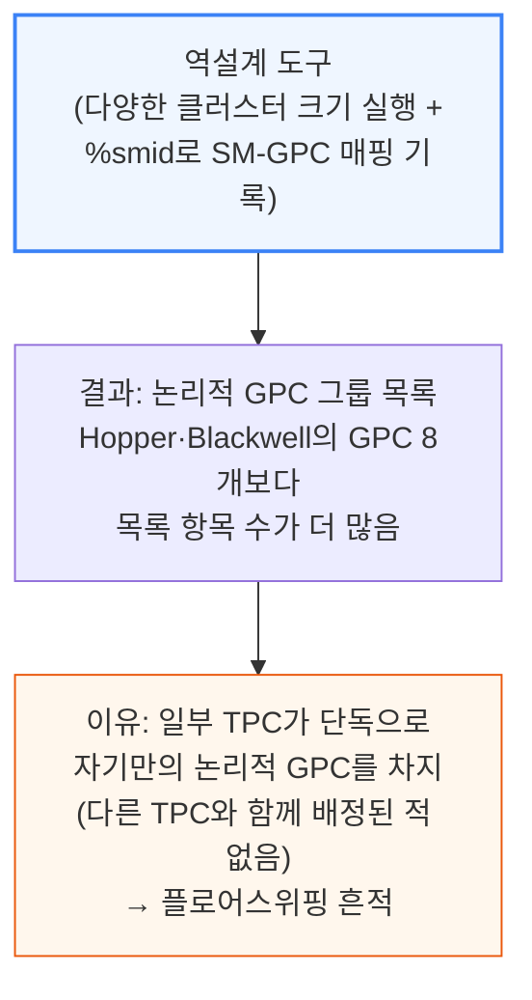

**📌 용어 풀이: 왜 "단독 TPC"가 플로어스위핑의 증거인가**
> - TPC(Texture Processing Cluster)는 GPC 안에서 SM을 몇 개씩 묶은 중간 단위 — 정상적인 칩이라면 TPC들이 여러 개씩 짝을 지어 함께 스케줄링됨
> - 그런데 역설계 결과 일부 TPC는 다른 TPC와 전혀 함께 묶이지 않고 "혼자만의 그룹"으로 나타남 — 원래 짝이었던 TPC가 제조 결함으로 비활성화(플로어스위핑)되어, 남은 TPC 혼자 논리적 GPC 자리를 차지하고 있다는 뜻
> - 이 흔적 덕분에 공개 문서 없이도 실측만으로 칩 내부의 결함 분포를 간접적으로 추정할 수 있음

SM100(Blackwell)은 이 수량 불일치 문제에 대한 해법을 제공합니다. 커널을 "선호 클러스터 크기"와 "대체(fallback) 클러스터 크기" 두 가지로 함께 실행할 수 있는데, GPU 전체를 낭비 없이 쓰려면 대체 크기를 1이나 2로 설정하는 것이 일반적입니다.

---

## 4. 논리적 GPC vs 물리적 GPC 배치

**📌 핵심:**
- 3장에서 밝힌 GPC 그룹은 "소프트웨어가 보는" 논리적 배치일 뿐, 실제로 GPC 하나(물리 SM 20개) 중 어느 SM이 살아있는지·그 GPC가 두 다이 중 어디에 물리적으로 위치하는지는 알려주지 않음
- 같은 논리 구성으로 보이는 B200 칩 두 대라도, 실제로 어느 물리 SM이 켜져 있는지는 다를 수 있어 겉보기엔 똑같은 GPU 사이에서도 성능이 미세하게 달라지는 원인이 될 수 있음
- SemiAnalysis는 모든 SM이 L2 캐시를 가득 채우는 포인터 체이싱(순차 참조) 배열을 훑게 하고, SM끼리 서로 다른 SM의 접근 지연시간을 측정해 "SM-SM 거리 행렬"을 만듦 — 평균 지연시간 300사이클 이상 차이 나는 두 SM 그룹이 뚜렷이 갈려, 이 경계가 곧 두 다이 사이의 경계(다이-투-다이 연결 구간)로 확인됨
- 결론: 3장에서 찾은 "단독 TPC"들이 이 거리 측정에서 서로 가깝게 붙어 있고 특정 다이의 GPC0과 일치하는 경향을 보여, 다이 A는 SM 39개(10+10+10+9), 다이 B는 SM 35개(9+9+9+5\~8, 5+3 추정)로 나뉜 것으로 추정 — 다이 간 지연시간 페널티는 약 300사이클

---

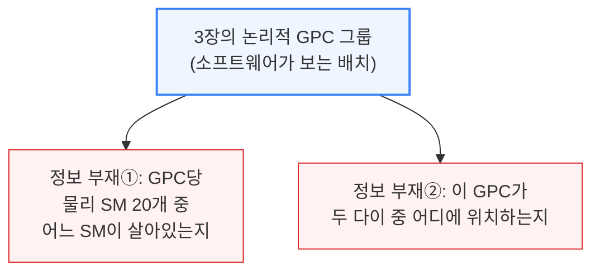

논리적으로 같은 구성(같은 개수의 SM이 각 GPC에 배정)으로 보이는 B200 칩 두 대라도, 실제로 어느 물리 SM이 살아있는지는 다를 수 있습니다. 이는 겉보기엔 동일한 GPU 사이에서도 성능 편차(비결정성)가 생기는 잠재 원인입니다.

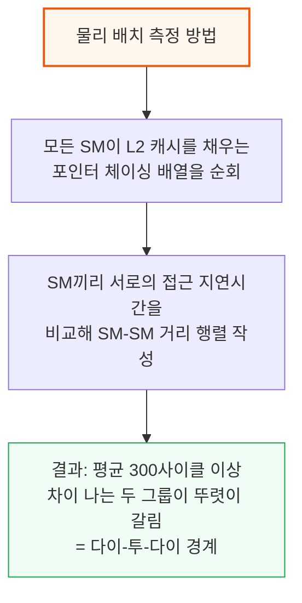

**📌 용어 풀이: 왜 다이-투-다이 경계가 300사이클 차이로 드러나는가**
> - B200 칩은 물리적으로 다이(die) 2개를 하나의 패키지로 묶은 구조 — 같은 다이 안의 SM끼리는 가깝지만, 다른 다이에 있는 SM으로 데이터가 넘어가려면 다이 사이를 잇는 별도 연결 구간을 거쳐야 함
> - 이 다이 간 연결 구간에서 추가 지연이 발생하는데, 실측 결과 그 페널티가 약 300사이클로 확인됨 — 이 숫자 차이를 기준으로 어떤 SM들이 같은 다이에 있는지 나눠볼 수 있음

이 거리 측정 결과를 3장의 논리적 GPC 그룹과 겹쳐보면, "단독 TPC"들이 서로 가깝게 붙어 있고 특정 다이의 GPC0과 상관관계를 보입니다. 이를 근거로 SM 배치를 다음과 같이 추정할 수 있습니다(어디까지나 실측 기반 추정치).

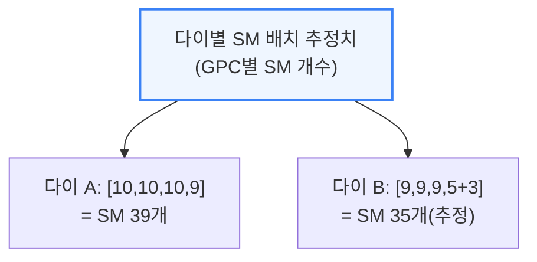

---

## 5. 메모리 서브시스템과 비동기 복사(LDGSTS)

**📌 핵심:**
- 메모리 서브시스템은 GPU 안에서 연산 유닛 사이로 데이터를 옮기는 하드웨어 전체를 뜻함 — 이번 리포트는 그중 비동기 복사(LDGSTS)와 TMA 두 가지 방식을 집중 실측
- 비동기 복사(PTX `cp.async`, SASS `LDGSTS`)는 Ampere 세대부터 지원하며, 데이터를 전역 메모리에서 공유 메모리(SMEM)로 논블로킹 방식으로 옮겨 연산과 겹쳐 실행 가능 — 레지스터를 거치지 않고 SMEM에 바로 써서 레지스터 부담도 줄임
- 실제 FlashInfer MHA(멀티헤드 어텐션) 커널 설정을 재현해 벤치마크한 결과, "16바이트 단위 로드"가 같은 전송량(bytes-in-flight) 기준으로 처리량이 근소하게 더 높고 실행 자원도 덜 씀 — 예를 들어 32KiB 전송 시 8바이트 로드는 4단계(스테이지)가 필요하지만 16바이트 로드는 2단계로 충분
- 결론: LDGSTS 처리량은 32KiB 전송 시점에 약 6.6TB/s로 포화되며, 지연시간은 기본 약 600나노초에서 8KiB 전송을 넘어서면 거의 2배로 뛰는데, 이는 대량 전송을 위해 스레드를 많이 동원할수록 메모리 입출력(MIO) 대기가 늘어나기 때문

---

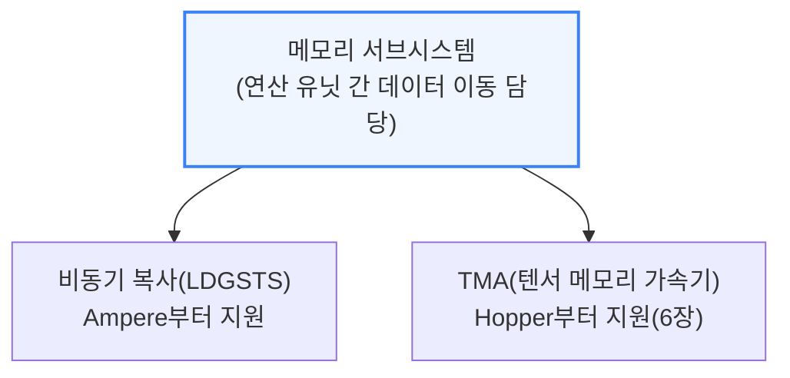

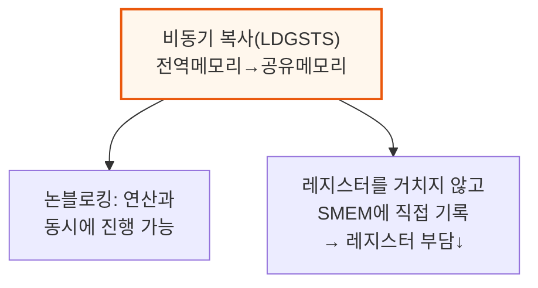

FlashInfer의 멀티헤드 어텐션(MHA) 커널이 쓰는 설정(SM당 CTA 1\~4개, 스테이지 1\~4단계, CTA당 스레드 64\~256개, 로드 크기 4\~16바이트)을 그대로 재현해 전송량 대비 처리량을 측정했습니다.

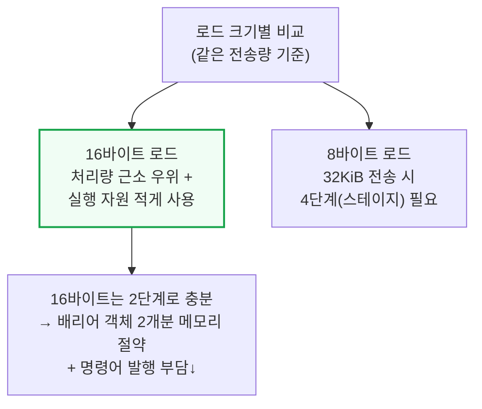

LDGSTS 처리량은 32KiB 전송 시점에 약 6.6TB/s에서 포화됩니다. MLA(멀티잠재어텐션) 커널 설정(스테이지 4\~16단계)도 함께 측정한 결과, 스테이지 수를 늘릴수록 더 높은 전송량에서 처리량이 오르고, CTA당 스레드 수를 늘리는 것은 모든 설정에서 예외 없이 성능을 높였습니다.

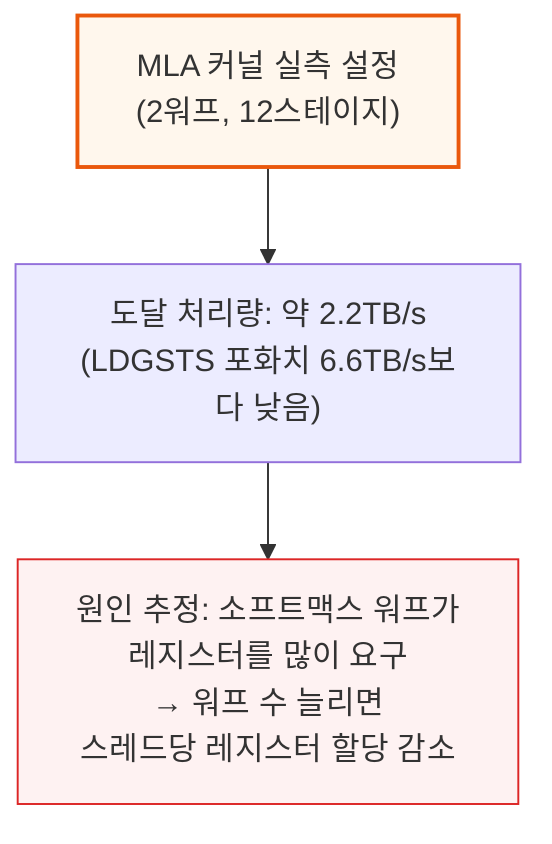

지연시간은 기본 약 600나노초에서 시작해 8KiB 전송을 넘어서면 거의 2배로 증가합니다. 높은 전송량을 내려면 스레드를 대량 동원해야 하는데, 그만큼 메모리 입출력(MIO) 대기로 정지하는 워프가 늘어나기 때문입니다.

**📌 용어 풀이: 스테이지(Stage)와 MIO 스로틀**
> - 스테이지는 데이터를 미리 읽어와 두는 파이프라인 단계 수 — 스테이지가 많을수록 미리 읽어둔 데이터가 많아 연산 대기 시간을 더 잘 숨길 수 있지만, 그만큼 SMEM(공유 메모리) 공간을 더 씀
> - MIO(Memory Input/Output) 스로틀은 메모리 요청이 몰려 하드웨어가 처리를 못 따라가 워프 실행을 일시 정지시키는 현상 — 스레드를 많이 동원할수록 이 정지 빈도가 늘어 지연시간이 증가

---

## 6. TMA(텐서 메모리 가속기)

**📌 핵심:**
- TMA(PTX `cp.async.bulk.tensor`, SASS `UTMALDG`)는 Hopper 세대에 도입된 대용량 데이터 전용 복사 엔진 — 스레드 1개만 주소 계산·메모리 스와즐링·범위 초과 처리를 맡기면, 나머지 스레드는 다른 연산을 계속할 수 있음
- FlashInfer 어텐션 커널 설정(SM당 CTA 1개, CTA당 스레드 128개=4워프, 2차원 텐서 박스 크기를 32×8에서 128×128까지 확대)을 재현해 2차원 텐서 복사(`cp.async.bulk.tensor.2d`) 기준으로 벤치마크
- 실측 결과 TMA는 LDGSTS보다 최대 처리량에 도달하는 시점이 훨씬 늦음 — 즉 적은 양을 옮길 때는 LDGSTS가 유리하고, TMA는 큰 덩어리를 옮길 때 진가를 발휘하는 구조(7장에서 직접 비교)
- 결론: TMA는 "적은 스레드로 큰 덩어리를 규칙적으로 옮기는" 용도에 최적화된 반면, LDGSTS는 "많은 스레드가 작은 단위를 유연하게 옮기는" 용도에 강함 — 이 역할 분담이 실제 커널 설계에서 두 명령어를 함께 쓰는 이유

---

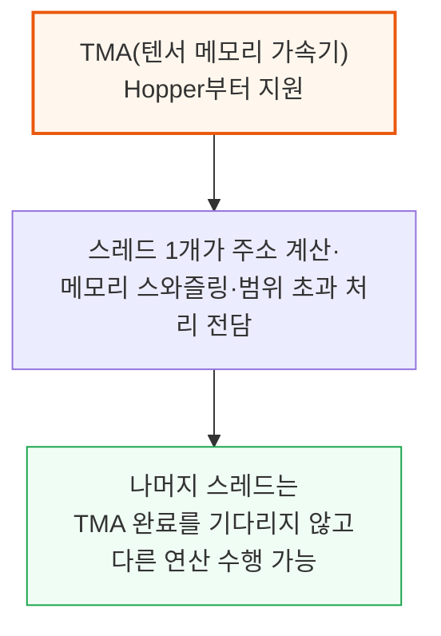

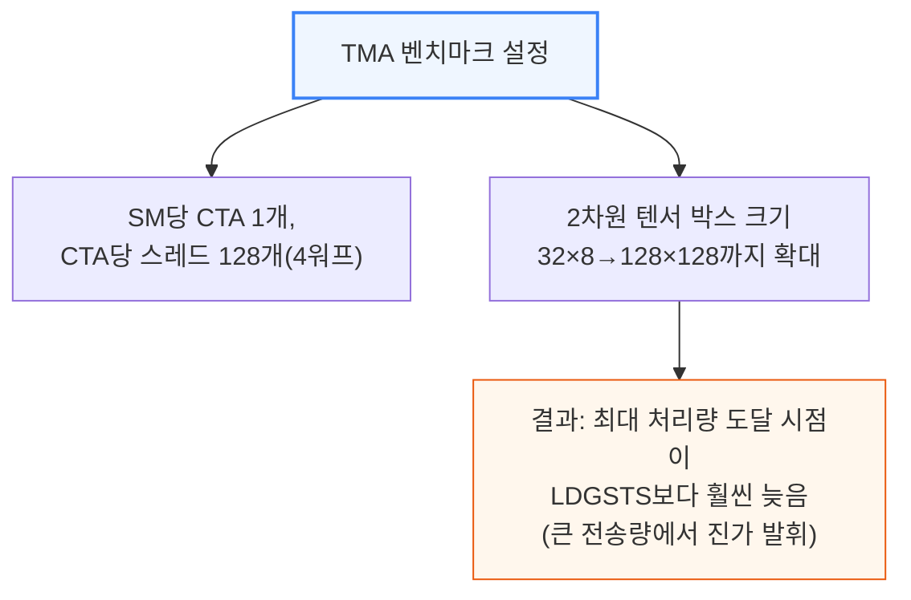

---

---

## 7. 비동기 복사 vs TMA 비교와 TMA 멀티캐스트

**📌 핵심:**
- 두 방식은 성격이 다름 — TMA는 규칙적인 패턴의 큰 덩어리 전송에 강하지만 지연시간이 높고, 비동기 복사(LDGSTS)는 불규칙한 접근 패턴을 다룰 수 있지만 전송 크기에 제한이 있음
- 실측 결과 32바이트 미만 전송에서는 비동기 복사가 근소하게 앞서지만, 그 이상에서는 TMA가 따라잡아 128KiB까지 계속 확장됨 — 지연시간은 12KiB 이전에는 비동기 복사가 낮지만, 그 이상에서 TMA 지연시간이 크게 증가
- 실제 Blackwell 커널에서도 이 역할 분담이 그대로 나타남 — MLA(멀티잠재어텐션)는 동적 페이지 로딩에 비동기 복사를, MHA(멀티헤드어텐션)는 TMA만 사용
- 결론: TMA는 "멀티캐스트"(한 번의 로드로 여러 SM에 동시 전달) 기능까지 지원해 GEMM 계열 패턴(예: SwiGLU의 듀얼-GEMM)에서 HBM 접근과 L2 트래픽을 크게 줄이는데, 명시적 멀티캐스트뿐 아니라 하드웨어가 암묵적으로도 유사한 효과를 냄

---

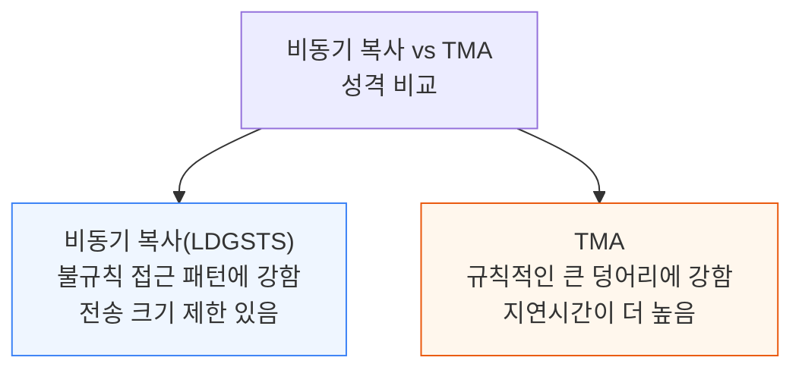

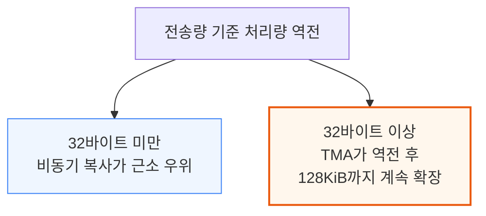

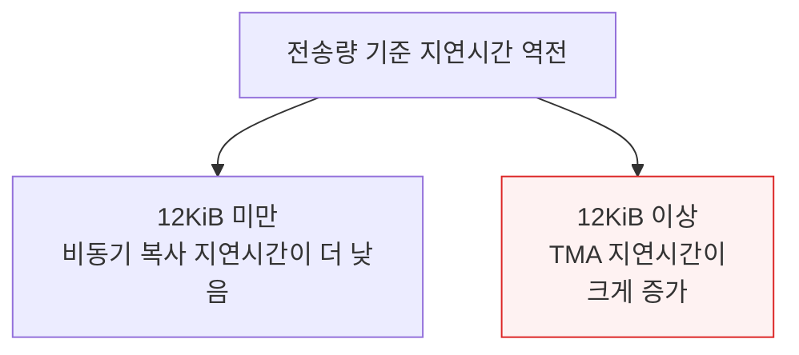

실제 Blackwell 커널도 이 역할 분담을 그대로 따릅니다. MLA 커널은 동적 페이지 로딩에 비동기 복사를 쓰고, MHA 커널은 TMA만 사용합니다(대부분 TRT-LLM이 기여한 FlashInfer 커널).

Hopper 세대와 유사하게 4차원 TMA로 페이지 인덱스를 마지막 차원에 두고, 필요할 때 `TensorMap` 객체를 인덱싱하는 방식으로 추정됩니다.

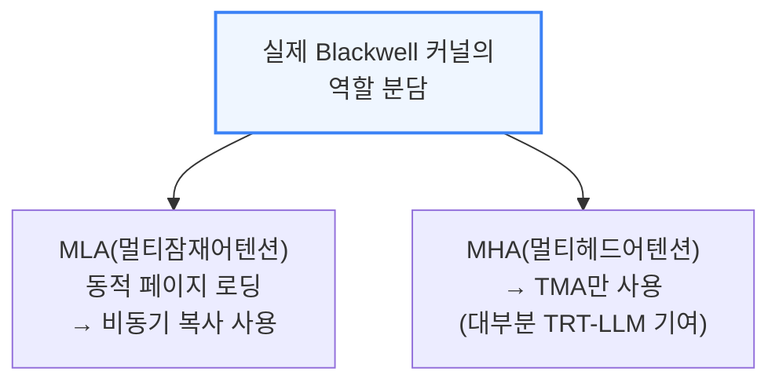

### TMA 멀티캐스트

TMA는 한 번의 로드로 CTA 마스크에 지정된 여러 SM의 공유 메모리에 동시에 데이터를 전달하는 "멀티캐스트" 모드를 지원합니다. 서로 다른 출력 타일을 계산하는 SM들이 같은 입력 타일을 공유하는 GEMM(행렬곱) 패턴에서 자주 쓰이며, 예를 들어 입력 행렬 하나를 공유하는 듀얼-GEMM 구조인 SwiGLU(활성화 함수) 커널에 유용합니다.

```mermaid
flowchart TD
    Multicast["TMA 멀티캐스트<br/>(1회 로드→여러 SM 동시 전달)"] --> Use["활용 사례: GEMM 패턴<br/>(예: SwiGLU 듀얼-GEMM,<br/>입력 행렬 1개를 여러 SM이 공유)"]
    Multicast --> Benefit["효과: HBM 접근↓<br/>+ L2 트래픽↓<br/>(공유 데이터 요청을 하나로 병합)"]

    style Multicast fill:#fff7ed,stroke:#ea580c,stroke-width:2px
    style Benefit fill:#f0fdf4,stroke:#16a34a
```

멀티캐스트 요청을 실제로 처리하는 하드웨어 유닛은 L2 요청 병합기(L2 Request Coalescer, LRC)입니다. 이 유닛이 명시적 멀티캐스트 요청뿐 아니라, 여러 CTA가 각자 독립적으로 같은 데이터를 요청하는 경우까지도 일부 자동으로 병합해줍니다.

```mermaid
flowchart TD
    Test["멀티캐스트 효과 검증<br/>(3가지 경우 비교)"] --> Case1["기준: SM마다<br/>서로 다른 데이터 로드"]
    Test --> Case2["명시적 멀티캐스트<br/>CTA 1개가 클러스터 전체에<br/>멀티캐스트 로드 발행"]
    Test --> Case3["암묵적 멀티캐스트<br/>모든 CTA가 각자<br/>같은 데이터에 TMA 로드 발행"]

    style Case2 fill:#f0fdf4,stroke:#16a34a
    style Case3 fill:#fff7ed,stroke:#ea580c
```

명시적 멀티캐스트는 L2 트래픽을 이론적 이상치("1/클러스터 크기" 만큼의 L2 바이트/SMEM 바이트)까지 완벽히 줄입니다. 암묵적 멀티캐스트도 SMEM 채움 처리량 자체는 명시적 방식과 거의 동일하지만, L2 요청 병합기가 완벽하지는 않아 전송량이 늘어날수록(특히 64바이트 전송 이상부터) L2 트래픽이 명시적 방식보다 조금씩 더 많아집니다.

**📌 용어 풀이: L2 요청 병합기(LRC)가 하는 일**
> - L2 요청 병합기는 L2 캐시로 들어오는 요청들을 미리 살펴보고, 같은 데이터를 요청하는 것들을 하나로 합쳐서 L2에 전달하는 하드웨어 유닛
> - 프로그래머가 명시적으로 멀티캐스트를 요청하지 않아도, 여러 CTA가 우연히 같은 데이터를 각자 요청하면 이 유닛이 어느 정도 자동으로 중복을 줄여줌 — 다만 완벽하지 않아 전송량이 클수록 명시적 멀티캐스트 대비 효율이 떨어짐

---

## 8. DSMEM vs SMEM

**📌 핵심:**
- DSMEM(분산 공유 메모리)은 Hopper부터 지원하는 기능으로, 클러스터 안의 CTA들이 서로의 공유 메모리(SMEM)에 접근할 수 있게 해줌 — CTA 간 리덕션(값 합산 등) 연산에 유용
- 실측 결과 DSMEM으로 다른 CTA의 메모리를 읽는 처리량은 SM 로컬 SMEM의 128바이트/사이클보다 뚜렷이 낮음 — DSMEM 로드는 전역 메모리 로드처럼 패킷 단위로 처리되어, 로컬 SMEM의 뱅크 충돌 회피 패턴이 아니라 GMEM(전역 메모리)에 가까운 연속 접근 패턴을 써야 함
- 실측 중 발견한 함정: 로컬 SMEM에서 128바이트/사이클 최대 처리량을 내려면 `ld.shared`를 `::cluster` 옵션 없이 써야 함 — `ld.shared::cluster`를 쓰면 컴파일러가 일반 `LD` 명령어를 내보내 로컬 SMEM 최대 처리량에 도달하지 못함
- 결론: DSMEM에서 더 높은 처리량을 내려면 `ld.shared::cluster` 대신 한 번에 더 많은 데이터를 옮기는 `cp.async.bulk`(PTX)/`UBLKCP`(SASS) 명령어로 전환해야 함

---

```mermaid
flowchart TD
    DSMEM["DSMEM(분산 공유 메모리)<br/>Hopper부터 지원"] --> D1["클러스터 내 CTA들이<br/>서로의 SMEM에 접근 가능"]
    D1 --> D2["활용: CTA 간 리덕션<br/>(값 합산 등)"]
    DSMEM --> D3["처리량: 로컬 SMEM의<br/>128바이트/사이클보다<br/>뚜렷이 낮음"]

    style DSMEM fill:#eff6ff,stroke:#3b82f6,stroke-width:2px
    style D3 fill:#fef2f2,stroke:#dc2626
```

```mermaid
flowchart TD
    AccessPattern["접근 패턴 차이"] --> Local["로컬 SMEM: 뱅크 충돌을<br/>피하는 인터리브 접근 패턴"]
    AccessPattern --> Remote["DSMEM(원격): 전역 메모리처럼<br/>패킷 단위, 연속 접근 패턴 필요"]

    style Local fill:#eff6ff,stroke:#3b82f6
    style Remote fill:#fff7ed,stroke:#ea580c
```

**📌 용어 풀이: 실측 중 발견한 `ld.shared::cluster` 함정**
> - 로컬 SMEM에서 최대 128바이트/사이클을 내려면 `ld.shared` 명령어를 `::cluster` 옵션 없이 써야 함 — 이 옵션을 붙이면 컴파일러가 특화된 `LDS` 대신 일반적인 `LD` 명령어를 내보내, 로컬 SMEM 최대 처리량에 도달하지 못함
> - `ld.shared::cluster`로 원격(DSMEM) 접근 처리량을 더 끌어올리려 시도했지만 한계가 있었고, 결국 한 번에 더 큰 데이터를 옮기는 `cp.async.bulk`(PTX)/`UBLKCP`(SASS)로 전환해서야 DSMEM에서 조금 더 높은 처리량을 얻을 수 있었음
> - 이 사례는 PTX 문법이 비슷해 보여도 실제 컴파일 결과(SASS 명령어)가 달라 성능이 크게 갈릴 수 있음을 보여주는 실증 사례

---

## 9. 5세대 텐서 코어 MMA: 처리량 분석

**📌 핵심:**
- MMA(행렬곱+누적)는 텐서 코어의 핵심 연산 명령어로, Hopper에서 Blackwell으로 갈수록 성능이 행렬 모양(shape)에 점점 더 민감해짐 — Blackwell 신규 2SM MMA(`cta_group::2`)는 CTA 쌍이 SM 2개에 걸쳐 하나의 MMA를 협력 수행(입력 A는 복제, B·D는 절반씩 분담)해 더 큰 행렬 연산을 가능케 함
- 실측 결과 UMMA(Blackwell 5세대 MMA 명령어)는 거의 모든 데이터 포맷·SM 구성에서 이론상 최대치에 가까운 처리량을 냄 — 1SM MMA는 M=64일 때 이론치의 최대 50%(연산 경로 절반만 활용), M=128일 때는 거의 100%
- 2SM MMA는 M=128·N=64에서 90%, 다른 N 크기에서는 거의 100%에 도달하며, M=256(SM당 M=128과 동일해 연산 경로 전체 활용)은 모든 설정에서 거의 100% 유지 — 데이터 타입 비트 폭이 같으면 포맷이 달라도 처리량이 동일하고, 마이크로스케일링 포맷의 오버헤드도 사실상 없음
- 결론: 입력 행렬을 SMEM(공유메모리)·TMEM(텐서전용메모리)에 어떻게 배치하는지(SS vs TS 레이아웃)에 따라 작은 N 크기에서 처리량 격차가 발생 — N이 128 미만이면 SS 레이아웃은 SMEM 대역폭에 발목 잡혀 TS 레이아웃보다 처리량이 낮음

---

```mermaid
flowchart TD
    MMA_["MMA(행렬곱+누적)<br/>텐서 코어 핵심 명령어"] --> Shape["Hopper→Blackwell<br/>성능이 행렬 모양(shape)에<br/>점점 더 민감해짐"]
    Shape --> TwoSM["Blackwell 2SM MMA<br/>(cta_group::2)<br/>CTA 쌍이 SM 2개로 협력 수행"]

    style MMA_ fill:#eff6ff,stroke:#3b82f6,stroke-width:2px
    style TwoSM fill:#fff7ed,stroke:#ea580c,stroke-width:2px
```

```mermaid
flowchart TD
    Peak["UMMA 실측 처리량<br/>(이론상 최대치 대비)"] --> P1["1SM MMA, M=64<br/>최대 50%(연산 경로 절반만 활용)"]
    Peak --> P2["1SM MMA, M=128<br/>거의 100%"]
    Peak --> P3["2SM MMA, M=256<br/>모든 설정에서 거의 100%<br/>(SM당 M=128, 경로 전체 활용)"]

    style P1 fill:#fef2f2,stroke:#dc2626
    style P3 fill:#f0fdf4,stroke:#16a34a,stroke-width:2px
```

2SM MMA는 M=128일 때 N=64에서 90% 피크, 그 밖의 N 크기에서는 거의 100%에 도달합니다. M128N64는 TMEM·L2·SMEM 등 다른 하드웨어 유닛에 발목 잡힌 것으로 추정됩니다. 데이터 타입 비트 폭이 같으면 포맷이 달라도 처리량은 동일했고, 마이크로스케일링 포맷의 오버헤드도 사실상 없었습니다.

```mermaid
flowchart TD
    Layout["MMA 입력 레이아웃 2종"] --> SS["SS: A·B 모두 SMEM에 저장"]
    Layout --> TS["TS: A는 TMEM, B는 SMEM에 저장"]
    SS --> Compare2["M=128 기준 비교:<br/>TS는 거의 피크 도달<br/>SS는 작은 N에서 저조,<br/>N=128에서 따라잡음"]

    style SS fill:#fff7ed,stroke:#ea580c
    style TS fill:#eff6ff,stroke:#3b82f6
```

**📌 용어 풀이: SS 레이아웃이 작은 N에서 느린 이유(SMEM 대역폭 병목)**
> - FP16 기준 M=128, N=64, K=16 예시로 계산하면, A행렬 4,096바이트+B행렬 2,048바이트를 옮기는 데 SMEM 대역폭(128바이트/사이클)으로는 48사이클이 걸리지만, 실제 연산(26만 2,144 FLOPs)은 32사이클이면 끝남
> - 즉 데이터를 옮기는 시간(48사이클)이 계산하는 시간(32사이클)보다 길어 "메모리 대역폭이 병목"인 상태 — N이 128에 도달해야 비로소 계산 시간이 옮기는 시간을 넘어서 "연산이 병목"인 상태로 전환됨
> - 같은 원리가 다른 데이터 타입에도 적용되며, FP8 1SM MMA 전체 형태의 처리량-연산량 그래프(루프라인)를 그려보면 N<256 구간은 명확히 메모리 병목 영역(기울기 약 128바이트/사이클=SMEM 대역폭)으로 나타남

2SM MMA는 1SM 대비 연산 자원 2배를 쓸 때 정확히 2배의 처리량을 내는 "완벽한 약한 스케일링"을 모든 포맷·형태에서 달성합니다.

특히 SS 레이아웃의 작은 형태에서는 2배를 넘는 속도 향상까지 나타나는데, SS가 N<128에서 SMEM 대역폭에 발목 잡힌 상태였던 것을 2SM 구조가 B행렬을 두 SM에 나눠 분담해 완화하기 때문입니다.

```mermaid
flowchart TD
    Scaling["2SM MMA 스케일링 효과"] --> Perfect["일반: 연산자원 2배→<br/>처리량 정확히 2배<br/>(완벽한 약한 스케일링)"]
    Scaling --> Over["SS 레이아웃 소형 N:<br/>2배 초과 속도 향상<br/>(SMEM 병목을 2SM이 분담해 완화)"]

    style Perfect fill:#f0fdf4,stroke:#16a34a,stroke-width:2px
    style Over fill:#fff7ed,stroke:#ea580c
```

---

*작성 진행률: 약 75% 완료*
*업데이트: 7\~9장(비동기 복사 vs TMA 비교·멀티캐스트, DSMEM vs SMEM, MMA 처리량 분석) 작성 완료*
