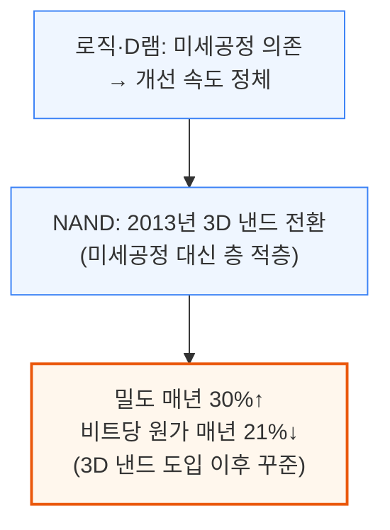
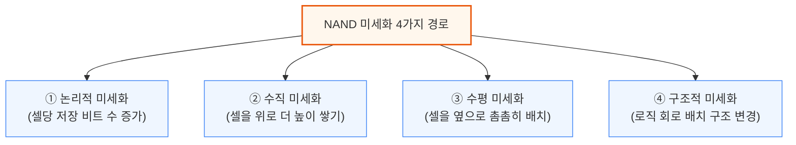
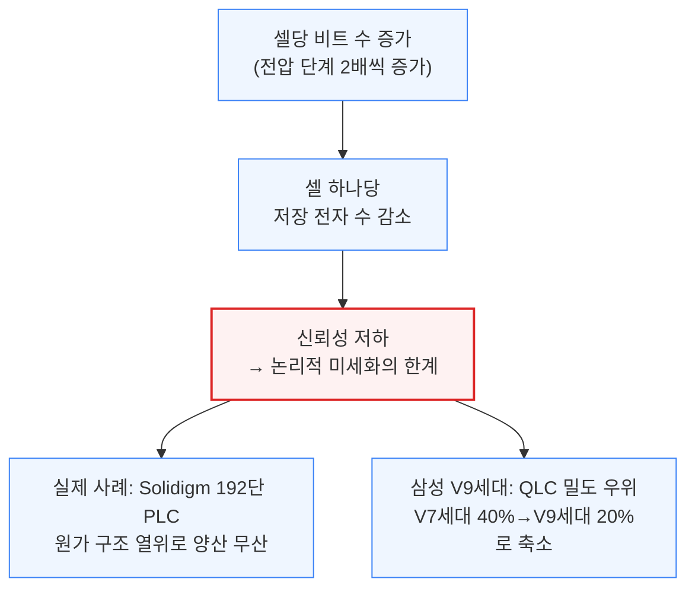
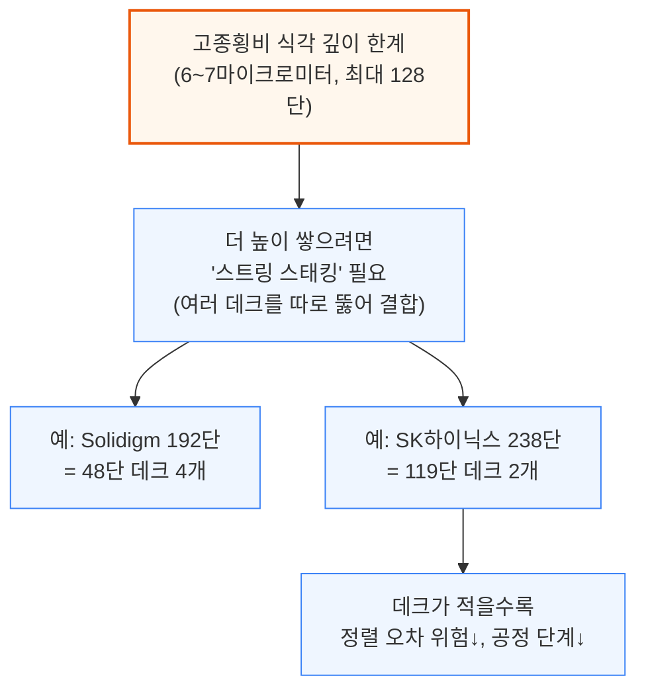
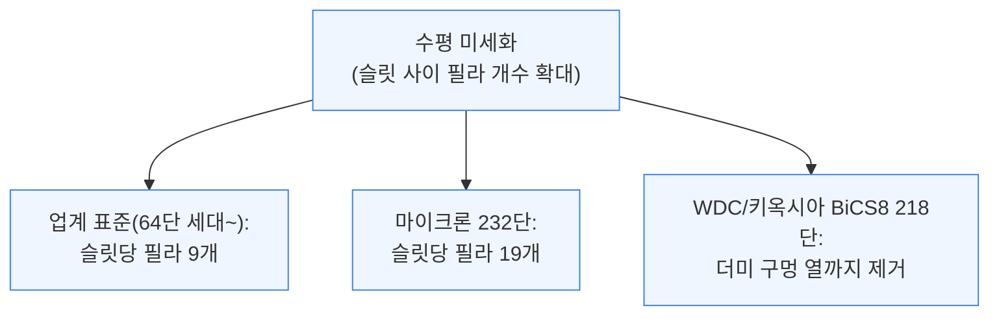
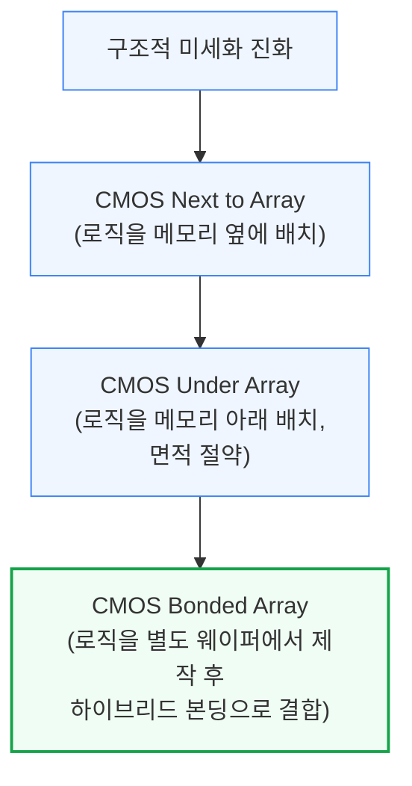
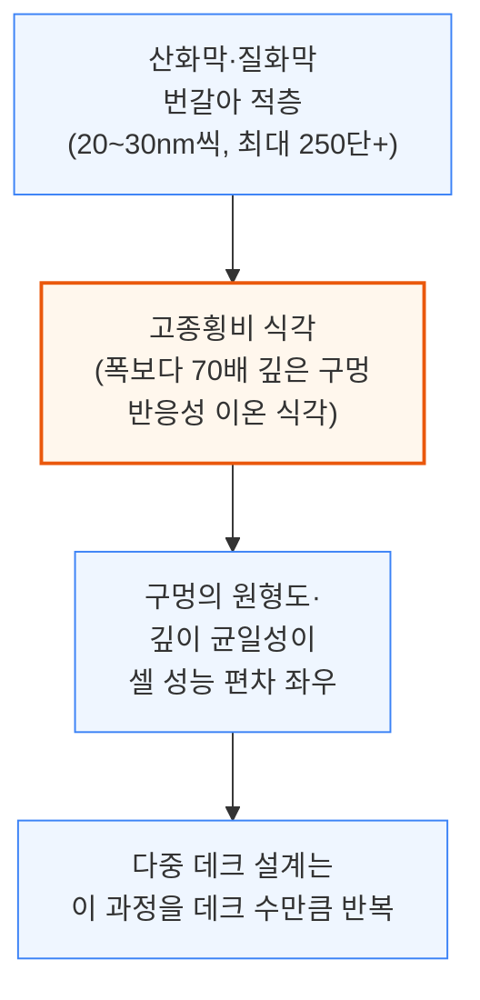
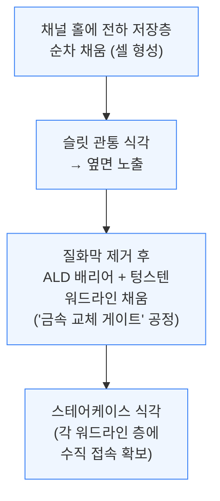

# NAND Flash Monopoly Broken? Tokyo Electron Moly Dep + Cryo Etch Takes On Lam Research For The Future Of NAND

> **출처**: [https://newsletter.semianalysis.com/p/nand-flash-monopoly-broken-tokyo](https://newsletter.semianalysis.com/p/nand-flash-monopoly-broken-tokyo)
> **저자**: [[Dylan Patel]]
> **발행일**: 2023-07-17

📑 목차
 1. [서론: NAND만 살아남은 무어의 법칙](#1-서론-nand만-살아남은-무어의-법칙)
 2. [NAND 미세화의 4가지 경로](#2-nand-미세화의-4가지-경로)
 3. [3D 낸드 제조 공정 흐름](#3-3d-낸드-제조-공정-흐름)
 4. [NAND 시장 현황: 공급 과잉에서 다가오는 공급 부족으로](#4-nand-시장-현황-공급-과잉에서-다가오는-공급-부족으로)
 5. [고종횡비 식각 전쟁: 초저온 식각이 램리서치에 도전](#5-고종횡비-식각-전쟁-초저온-식각이-램리서치에-도전)
 6. [몰리브덴 증착: 차세대 워드라인 소재 전쟁](#6-몰리브덴-증착-차세대-워드라인-소재-전쟁)
 7. [결론: 10억 달러 규모의 점유율 이동](#7-결론-10억-달러-규모의-점유율-이동)
 8. [키옥시아와 웨스턴디지털의 합병](#8-키옥시아와-웨스턴디지털의-합병)

🔑 용어 정리
- **3D 낸드 (3D NAND)**: 메모리 셀을 평면에 늘어놓는 대신 수직으로 층층이 쌓아올려, 미세공정 없이도 저장 용량을 늘리는 낸드플래시 구조.
- **고종횡비 식각 (High Aspect Ratio Etch)**: 폭은 아주 좁은데 깊이는 그 수십 배에 달하는 구멍을 뚫는 정밀 화학 식각 공정 — 3D 낸드에서 층수를 늘릴수록 이 구멍도 더 깊이 뚫어야 함.
- **초저온 식각 (Cryo Etch)**: 식각 장비의 웨이퍼 받침대를 영하 수십도까지 얼려서 진행하는 차세대 식각 방식 — 구멍을 더 빠르고 곧게 뚫을 수 있음.
- **워드라인 (Word Line)**: 낸드 셀 하나하나에 전압을 걸어 데이터를 읽고 쓰게 하는 금속 배선층 — 층수만큼 워드라인도 늘어남.
- **웨이퍼 팹 장비 (WFE, Wafer Fab Equipment)**: 반도체 공장이 웨이퍼를 가공하는 데 쓰는 장비 전체를 가리키는 업계 용어이자, 장비업체 매출 규모를 재는 기준 지표.
- **몰리브덴 (Moly) 배선 소재**: 현재 워드라인을 채우는 텅스텐을 대체할 후보 금속 — 배선이 가늘어져도 저항이 덜 커져 신호 손실이 적음.
- **비트당 원가 (Cost per Bit)**: 저장 용량 1비트를 만드는 데 드는 제조원가 — NAND 업계가 서로의 기술 경쟁력을 비교하는 핵심 잣대.
- **하이브리드 본딩 (Hybrid Bonding)**: 로직 회로와 메모리 셀을 각각 다른 웨이퍼에서 만든 뒤 하나로 붙이는 결합 기술 — 두 공정을 동시에 진행할 수 있어 생산 속도가 빨라짐.

---

## 1. 서론: NAND만 살아남은 무어의 법칙

**📌 핵심:**
- 로직 반도체와 D램은 미세공정 개선 속도가 느려지며 무어의 법칙이 사실상 정체된 반면, NAND 플래시만은 2013년 도입된 **3D 낸드** 구조 덕분에 매년 급격한 원가 하락을 이어가고 있음
- 비결은 미세공정(리소그래피) 의존을 버리고 **층을 계속 더 쌓는 방식**으로 전환한 것 — 그 결과 3D 낸드 도입 이후 밀도가 매년 30%씩, 비트당 원가는 매년 21%씩 꾸준히 떨어짐
- 마이크론은 앞으로 NAND 비트당 원가 하락률이 기존 21%에서 **10%대 초중반**으로 둔화될 것으로 전망(D램은 한 자릿수 후반에 그침) — 낸드의 원가 우위는 여전하지만 예전만큼 가파르지는 않음
- 결론: 2018\~2022년 NAND 장비 투자액은 매년 약 150억 달러로 일정했는데도 총 생산능력은 매년 30% 넘게 늘었음(장비를 더 사서가 아니라 제조 효율이 좋아져서) — 이 리포트는 이 효율 개선의 핵심 무대인 증착·식각 공정에서 도쿄일렉트론(TEL)이 램리서치의 아성을 어떻게 흔드는지를 다룸

---

로직 반도체와 D램은 회로 선폭을 줄이는 미세공정 개선이 느려지며 사실상 정체 상태에 이르렀지만, NAND 플래시는 다른 길을 걸었습니다. 2013년 상용화된 **3D 낸드** 구조로 전환하면서, 미세공정이 아니라 셀을 위로 쌓는 방식으로 밀도를 계속 늘려온 것입니다.

이 원가 하락 속도는 앞으로 둔화될 전망입니다. 마이크론은 NAND 비트당 원가 하락률이 기존 매년 21%에서 앞으로는 10%대 초중반으로 낮아질 것으로 보는 반면, D램은 원래도 한 자릿수 후반 하락에 그쳐 낸드보다 미세화가 훨씬 어렵다고 평가합니다.

이런 원가 개선이 가능했던 이유는 밀도를 늘리면서도 공정 단계 수를 크게 늘리지 않았기 때문입니다. 3D 낸드에서 가장 중요한 단계는 얇은 막을 쌓는 **증착**과, 그 막을 뚫고 내려가는 **고종횡비 식각**입니다. 필름을 교대로 증착한 뒤 몇 종류의 식각으로 셀을 분리하고 외부와 연결하는 것이 대략적인 제조 흐름이며, 램리서치는 이 중에서도 가장 핵심인 고종횡비 식각 분야의 오랜 선두주자입니다.

2018\~2022년 사이 NAND 팹의 장비 구매액은 매년 약 150억 달러로 거의 일정했는데도, 총 생산능력은 매년 30% 넘게 늘었습니다. 이는 장비를 더 사서가 아니라 제조 효율 자체가 좋아졌기 때문입니다. 다만 앞으로 같은 속도로 생산능력을 늘리려면 장비 혁신이 없는 한 투자액도 비례해서 커져야 하는데(투자 강도 상승), 지금은 반도체 다운턴으로 NAND가 공급 과잉 상태라 대형 투자가 미뤄지고 있어 오히려 1.5년 뒤 공급 부족의 씨앗이 되고 있습니다.

이 리포트는 NAND 시장 현황, 공정 기술의 미세화 경로, 제조 공정, 가격 동향, 현재의 공급 과잉과 다가올 공급 부족, 2023\~2025년 NAND 장비 투자 전망, 웨스턴디지털·키옥시아의 앞날, YMTC와 제재 위반 의혹, 고종횡비 식각 시장 심층 분석, 3D D램 가능성, 다가오는 증착 소재 대전환, 그리고 램리서치에서 도쿄일렉트론(TEL)으로 **10억 달러 이상의 매출이 옮겨갈 수 있는** 시장 점유율 이동을 다룹니다.

---

## 2. NAND 미세화의 4가지 경로

**📌 핵심:**
- NAND 용량을 늘리는 방법은 ① 셀당 저장 비트 수를 늘리는 **논리적 미세화**, ② 셀을 수직으로 더 높이 쌓는 **수직 미세화**, ③ 셀을 옆으로 더 촘촘히 배치하는 **수평 미세화**, ④ 회로 배치 구조를 바꾸는 **구조적 미세화** 4가지뿐
- 논리적 미세화(셀당 비트 수 증가)는 이미 한계 근접 — 비트를 늘릴수록 셀 하나가 저장하는 전자 수가 줄어 신뢰성이 나빠짐(예: Solidigm의 192단 PLC는 원가 구조가 나빠 양산 무산, 삼성 V9 세대는 QLC의 밀도 우위가 40%에서 20%로 축소)
- 수직 미세화(층수 늘리기)는 지난 10년간 밀도 향상의 주력이었지만, 현재 고종횡비 식각 장비로는 6\~7마이크로미터가 깊이 한계 — 이를 넘으려면 여러 층 덩어리(데크)를 따로 뚫어 붙이는 '스트링 스태킹'이 필요한데, 데크가 많을수록 정렬 오차 위험도 커짐
- 결론: 수평 미세화(구멍 간격 좁히기)와 구조적 미세화(로직 회로를 메모리 아래 또는 별도 웨이퍼에 배치)는 밀도 향상 폭이 작지만 비용은 거의 늘리지 않는 보완 수단 — 결국 남은 것은 식각 장비 자체의 깊이 한계를 뚫는 기술 혁신뿐이며, 이것이 도쿄일렉트론이 램리서치의 사업을 가져갈 수 있는 이유

---

NAND 저장 용량을 웨이퍼 한 장에서 최대한 끌어내는 방법은 크게 4가지뿐입니다. 아래는 각 방법의 원리와 한계입니다.

**① 논리적 미세화**는 셀 하나가 저장하는 비트 수를 늘리는 방법입니다. 비트 하나를 추가할 때마다 셀이 구분해야 하는 전압 단계 수는 2배씩 늘어납니다(1비트=2단계, 2비트=4단계, 3비트=8단계, 4비트=16단계, 5비트=32단계). 회로를 더 뚫지 않고도 용량을 늘리는 '공짜 미세화'처럼 보이지만, 문제는 전압 단계가 늘어날수록 셀 하나에 저장되는 전자 수가 줄어들어 오차와 열화에 훨씬 취약해진다는 점입니다.

이런 이유로 마이크론과 SK하이닉스는 셀당 3비트(TLC)가 장기적으로 가장 원가 효율적인 방식이라고 보고 있습니다.

**② 수직 미세화**는 지난 10년간 밀도 향상을 이끈 주력 방식이지만, 현재 고종횡비 식각 장비의 깊이 한계(6\~7마이크로미터, 셀 하나 두께 약 40나노미터)에 부딪혀 최대 128단까지만 한 번에 뚫을 수 있습니다. 이를 넘어서려면 여러 층 덩어리를 따로 뚫은 뒤 위아래로 붙이는 '스트링 스태킹'이 필요합니다.

데크 수를 줄이는 유일한 방법은 셀 하나의 두께를 더 얇게 만들거나, 식각 장비 자체의 깊이 한계를 늘리는 것뿐입니다. 바로 이 지점이 도쿄일렉트론(TEL)이 램리서치의 사업을 가져갈 수 있는 이유이며, 뒤에서 다룰 증착 소재 변화도 이에 못지않은 파급력을 가질 것으로 봅니다.

**③ 수평 미세화**는 셀 구멍을 더 촘촘하게 배치하거나, 셀 구획을 나누는 슬릿의 면적 손실을 줄이는 방식입니다. 구멍 자체를 더 좁히는 방법은 이미 한계에 도달했지만, 슬릿 사이에 들어가는 구멍(필라) 개수를 늘려 면적 효율을 높이는 방식은 아직 여지가 있습니다.

수평 미세화가 주는 밀도 향상 폭은 수직 미세화보다 작지만, 장비 투자를 추가로 늘리지 않고도 원가를 선형적으로 낮출 수 있다는 장점이 있습니다.

**④ 구조적 미세화**는 로직 회로(CMOS)를 어디에 배치하느냐를 바꾸는 방식입니다. 초기에는 로직 회로를 메모리 배열 옆에 뒀다가(CMOS Next to Array), 이후 메모리 배열 아래에 두어 면적을 절약했고(CMOS Under Array), 최근에는 로직을 아예 별도 웨이퍼에서 만든 뒤 메모리 웨이퍼와 하이브리드 본딩으로 붙이는 방식(CMOS Bonded Array)까지 등장했습니다.

로직과 메모리를 별도 웨이퍼에서 동시에 만들면 공정 복잡도와 소요 시간이 줄어 본딩 비용 증가를 상쇄할 수 있습니다. YMTC가 64단 Xtacking 1.0에서 1.0마이크로미터 간격의 하이브리드 본딩으로 이 방식을 선도했고, WDC/키옥시아의 BiCS8 218단도 하이브리드 본딩을 채택할 예정입니다.

이 4가지 경로 중 대부분은 이미 한계에 근접했습니다. 그동안 밀도 향상의 주역이었던 수직 미세화조차 현재 장비로는 더 이상 밀어붙이기 어려운 상황입니다.

---

## 3. 3D 낸드 제조 공정 흐름

**📌 핵심:**
- 3D 낸드 제조는 산화막과 질화막을 20\~30나노미터씩 번갈아 쌓은 뒤(이론상 최대 250단 이상, 높이 약 7마이크로미터), 그 위에 폭보다 70배나 깊은 구멍을 뚫는 **고종횡비 식각**으로 시작
- 구멍을 뚫은 뒤에는 전하를 가두는 층을 채워 셀을 만들고, 다시 슬릿을 뚫어 질화막을 제거한 자리에 텅스텐 워드라인을 채우는 '금속 교체 게이트' 공정을 거침
- 여러 층 덩어리(데크)로 나눠 만드는 설계는 이 전체 과정(적층→구멍 뚫기→셀 형성→금속 채우기)을 데크 수만큼 반복해야 함
- 결론: 결국 3D 낸드의 밀도와 성능은 고종횡비 식각과 증착 기술의 한계에 좌우되며, 구멍을 뚫는 시간(비트당 공정 시간)이 늘어날수록 과거처럼 빠른 원가 하락을 기대하기 어려워짐

---

3D 낸드 한 층 한 층은 아래 순서로 만들어집니다. 먼저 산화막과 질화막을 20\~30나노미터 두께로 번갈아 쌓고(이론상 250단 이상, 높이 약 7마이크로미터까지 가능), 그 위에 두꺼운 하드마스크를 얹어 고종횡비 식각을 준비합니다.

구멍이 뚫리면 그 안에 전하를 가두는 여러 층을 순서대로 채워 실제 저장 셀을 만듭니다(층을 채울수록 구멍이 점점 좁아짐). 이어서 슬릿을 층 전체를 관통해 뚫어 옆면을 노출시키고, 이 통로를 통해 질화막을 제거한 뒤 그 자리에 원자층증착(ALD)으로 배리어를 입히고 텅스텐 워드라인을 채워 넣습니다. 마지막으로 배열 양옆에는 계단(스테어케이스) 구조를 식각해 각 워드라인 층에 수직으로 접속할 수 있게 만듭니다.

이 위에 비트라인과 금속 배선을 올려 워드라인 드라이버 등 주변 회로(CMOS)와 연결하면 하나의 3D 낸드 칩이 완성됩니다. 이처럼 3D 낸드는 처음부터 끝까지 고종횡비 식각과 증착 기술에 절대적으로 의존합니다.

앞서 설명했듯 가장 큰 병목은 채널 홀을 뚫는 시간입니다. 이 시간이 늘어날수록 비트당 공정 시간(=비트당 원가)의 하락 속도는 과거 추세보다 느려질 수밖에 없으며, 바로 이 지점이 이 리포트가 집중하는 주제입니다.

---

*작성 진행률: 약 40% 완료 (1~3장 작성)*
*업데이트: 서론, NAND 미세화 4가지 경로, 3D 낸드 제조 공정 흐름 작성 완료*
