# EMIB-T Roadmap, Custom HBM, HBM4 Packaging Challenges, Microfluidic Cooling, Photonic Interconnects, and More

> **출처**: [SemiAnalysis Newsletter](https://newsletter.semianalysis.com/p/ectc2026)
> **저자**: Afzal Ahmad, DC, Gerald Wong, Dylan Patel
> **발행일**: 2026-02-05

---

## 📑 목차

### 전체 섹션
 1. [ECTC 2026 총정리 개요](#1-ectc-2026-총정리-개요)
 2. [인텔 EMIB-T 로드맵 - 브릿지 패키징의 다음 세대](#2-인텔-emib-t-로드맵---브릿지-패키징의-다음-세대)
 3. [마벨 커스텀 HBM - 표준을 버리고 얻는 것](#3-마벨-커스텀-hbm---표준을-버리고-얻는-것)
 4. [삼성 HBM 인터포저 - 배선 복잡도와 커패시터 배치](#4-삼성-hbm-인터포저---배선-복잡도와-커패시터-배치)
 5. [삼성 HBM 하이브리드 본딩 열특성](#5-삼성-hbm-하이브리드-본딩-열특성)
 6. [마이크로플루이딕 냉각 - TSMC와 마이크로소프트](#6-마이크로플루이딕-냉각---tsmc와-마이크로소프트)
 7. [마벨 광학 인터커넥트 - OMIB와 포토닉 패브릭](#7-마벨-광학-인터커넥트---omib와-포토닉-패브릭)
 8. [Lightmatter Passage M1000 - 멀티 레티클 포토닉 인터포저](#8-lightmatter-passage-m1000---멀티-레티클-포토닉-인터포저)
 9. [하이브리드 본딩 경쟁 - 저온·미세피치 접근법](#9-하이브리드-본딩-경쟁---저온미세피치-접근법)
10. [인터포저 대안 - 원형 웨이퍼 한계 우회](#10-인터포저-대안---원형-웨이퍼-한계-우회)
11. [열계면 소재(TIM) - 액체금속과 다이아몬드 접합](#11-열계면-소재tim---액체금속과-다이아몬드-접합)
12. [유리 기판 - SeWaRe 균열과의 싸움](#12-유리-기판---seware-균열과의-싸움)
13. [RDL 스케일링 - 서브마이크론 시대로](#13-rdl-스케일링---서브마이크론-시대로)
14. [적층 메모리 - 삼성의 TSV 없는 VCS 구조](#14-적층-메모리---삼성의-tsv-없는-vcs-구조)

---

## 🔑 용어 정리

본문을 순서대로 읽기 전에 알아두면 좋은 용어들입니다. 자세한 수치와 설명은 본문에서 처음 등장하는 위치에 나옵니다.

- **EMIB-T (Embedded Multi-die Interconnect Bridge with TSV)**: 인텔의 실리콘 브릿지 패키징 기술 — 패키지 전체를 덮는 판 대신, 필요한 자리에만 작은 실리콘 조각(브릿지)을 파묻어 옆 칩들을 초고속으로 연결
- **인터포저 (Interposer)**: 여러 칩(다이)을 패키지 안에서 이어주는 중간 배선판 — 브릿지가 필요한 부분에만 있는 국소 부품이라면, 인터포저는 패키지 전체를 덮는 배선판
- **커스텀 HBM (Custom HBM)**: 업계 표준(JEDEC) 규격 대신 메모리와 가속기 사이 연결 방식을 특정 회사에 맞춰 새로 설계한 HBM — 호환성을 포기하는 대신 전력·성능·면적을 더 아낄 수 있음
- **하이브리드 본딩 (Hybrid Bonding)**: 범프(금속 돌기) 없이 구리 면과 면을 직접 맞붙여 칩을 쌓는 차세대 적층 기술 — 더 촘촘하게 연결할 수 있지만 표면이 완벽히 평평하고 깨끗해야 함
- **마이크로플루이딕 냉각 (Microfluidic Cooling, 칩 내장형 물길 냉각)**: 냉각수를 칩 표면(또는 칩 내부에 새긴 미세 통로)에 직접 흘려보내는 냉각 방식 — 기존 냉각판보다 열원에 훨씬 가까이 접근해 더 많은 열을 뽑아냄
- **CPO (Co-Packaged Optics, 광학엔진 동일패키지 통합)와 포토닉 인터포저**: 빛으로 데이터를 주고받는 광통신 부품을 반도체 패키지 안에 함께 넣는 기술 — 전기 신호보다 멀리, 적은 전력으로 데이터 전송
- **RDL (Redistribution Layer, 재배선층)**: 칩의 원래 배선 위치를 패키지의 다른 위치로 옮겨주는 얇은 배선층 — 여러 칩을 하나의 패키지에 모을 때 배선을 다시 그려주는 역할
- **TIM (Thermal Interface Material, 열계면 소재)**: 칩과 방열판 사이의 미세한 틈을 메워 열이 잘 전달되게 하는 물질 — 틈에 남는 공기(단열재 역할)를 없애는 것이 목적

---

## 1. ECTC 2026 총정리 개요

**📌 핵심:**
- 트랜지스터 미세화 속도가 둔화되며 반도체 성능을 끌어올리는 주된 방법이 **첨단 패키징**으로 넘어갔는데, 이제는 AI 가속기가 너무 커지고 연결 속도 요구도 높아져 **패키지 자체가 한계**에 부딪히기 시작
- 원형 실리콘 인터포저는 패키지 크기·웨이퍼 활용률을 제약하고, HBM4E는 입출력 핀 수를 2배로 늘리며 속도까지 높이고, 수 킬로와트급 패키지는 기존 냉각 방식을 압도
- ECTC(반도체 패키징 최대 학회) 2026은 실제 상용 제품과 맞닿은 발표가 유독 많았음: 인텔은 EMIB-T 구조·로드맵을, 마벨은 커스텀 HBM으로 인터페이스 로직을 가속기 밖으로 빼내는 방법을, TSMC·마이크로소프트는 냉각수를 실리콘에 직접 주입하는 기술을, 마벨·Lightmatter는 광학 인터커넥트를 패키지에 통합하는 방법을 각각 공개
- 결론: 이 문서는 향후 수년간 AI 가속기 패키지를 좌우할 ECTC 2026의 핵심 기술 14개 주제를 정리함

---

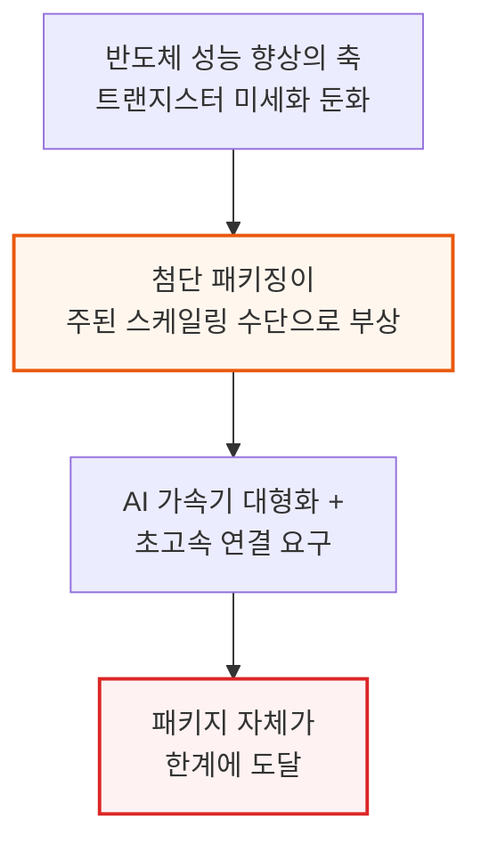

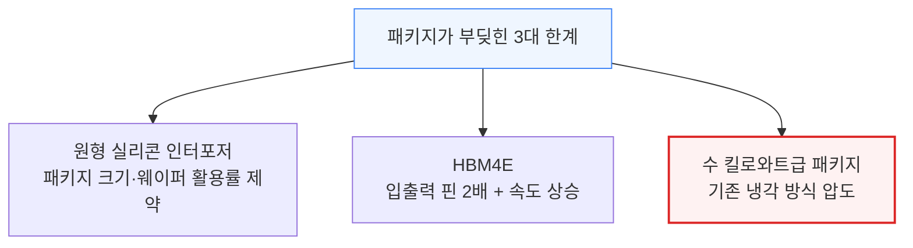

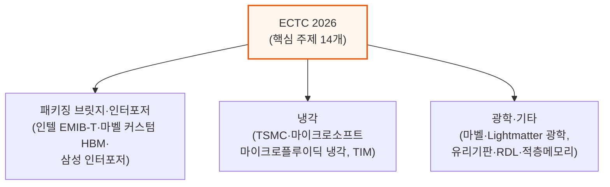

이번 ECTC는 인텔이 최다 발표(12건)를 낸 학회였고, 삼성이 11건으로 뒤를 이었습니다. 반면 TSMC는 단 3건에 그쳤는데, 이는 발표량이 적다기보다 상용화 임박 기술 위주로 선별 공개했기 때문으로 보입니다.

---

## 2. 인텔 EMIB-T 로드맵 - 브릿지 패키징의 다음 세대

**📌 핵심:**
- 인텔은 ECTC 최다 발표 기업(12건)이었고 핵심은 **EMIB-T** — TSV(관통전극)를 더한 차세대 EMIB로, 구글 TPU v9에 쓰일 것으로 예상되며 대형 AI 가속기 패키지에서 TSMC CoWoS의 가장 유력한 대안으로 꼽힘
- 범프(연결 돌기) 간격을 기존 45µm에서 **36/35µm로 축소**(범프 밀도 +65%)했고, 240×240mm(약 67레티클) 대형 패키지 시험차량까지 검증했으나 부스 샘플에서 **심각한 휨(warpage)**이 관찰됨
- 브릿지에 TSV를 추가해 전력을 브릿지로 직접 전달하는 방식으로 **DC 전압강하를 68\~80% 감소**시켰고, MIM 커패시터로 전력분배망(PDN) AC 임피던스를 **82% 이상 개선**
- 결론: EMIB-T는 12Gb/s 이상 HBM4E 신호 품질(등화기 적용 시 아이 폭 약 72.5%)까지 확보하며 격차를 좁히고 있지만, TSMC는 이미 커패시터 내장·전압조정기 통합·액티브 LSI를 양산 중이라 인텔은 여전히 추격 중

---

### 범프 피치 축소와 대형 패키지 검증

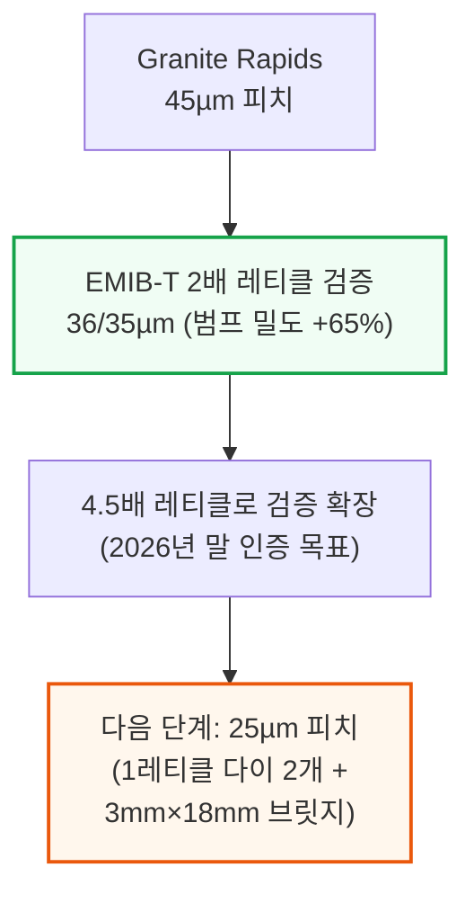

Granite Rapids-AP는 70mm×105mm(약 9레티클)의 대형 패키지였는데, EMIB-T는 이보다 훨씬 촘촘한 피치를 검증하고 있습니다. 다만 피치를 더 줄이면 새로운 문제가 생깁니다.

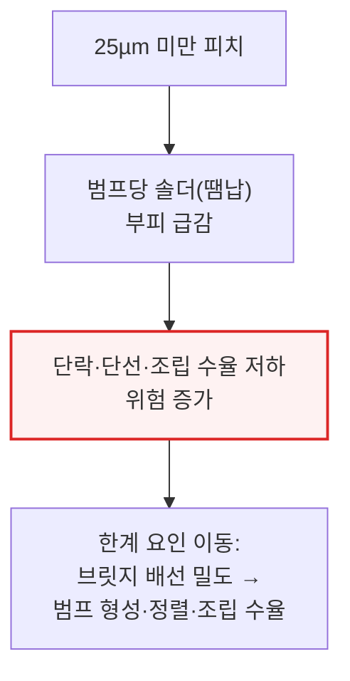

### 대형 패키지의 벽 - 쿼터패널과 휨(Warpage)

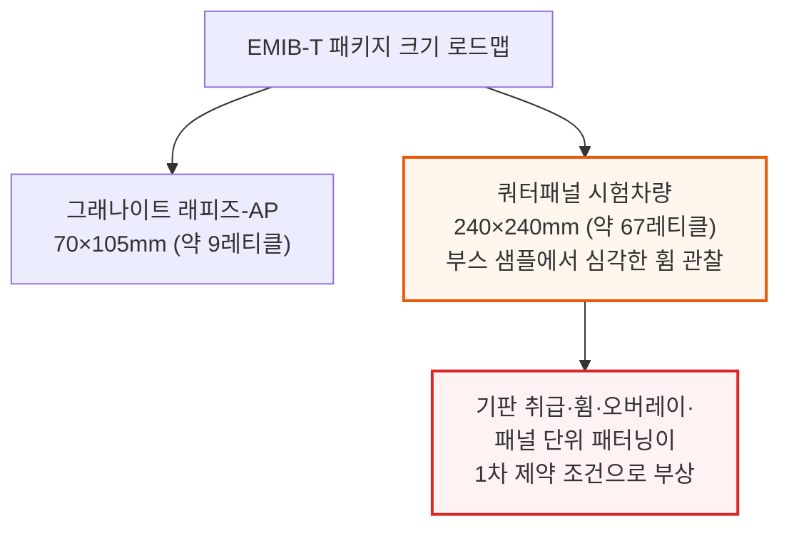

인텔은 전체 패널 크기까지도 가능하다고 밝혔지만, 실제로는 쿼터패널을 현실적 목표로 제시했습니다. 이 정도 크기에서는 첨단 리소그래피 기법으로 오버레이(패턴 정렬 정밀도)를 유지하는 방안도 함께 검토 중입니다.

### 브릿지 내부 구조 - TSV로 전력을 직접 전달

EMIB-T는 단순한 수동 배선 브릿지가 아닙니다. TSV, 추가 금속층, 전력망(Power Mesh), MIM 커패시터층까지 더해 브릿지 하나가 고밀도 신호와 수직 전력 전달을 동시에 감당합니다. 인텔이 공개한 단면에는 10개 금속층(그중 4개가 배선 전용층)과 M1\~M2 사이 MIM 커패시터가 포함돼 있습니다.

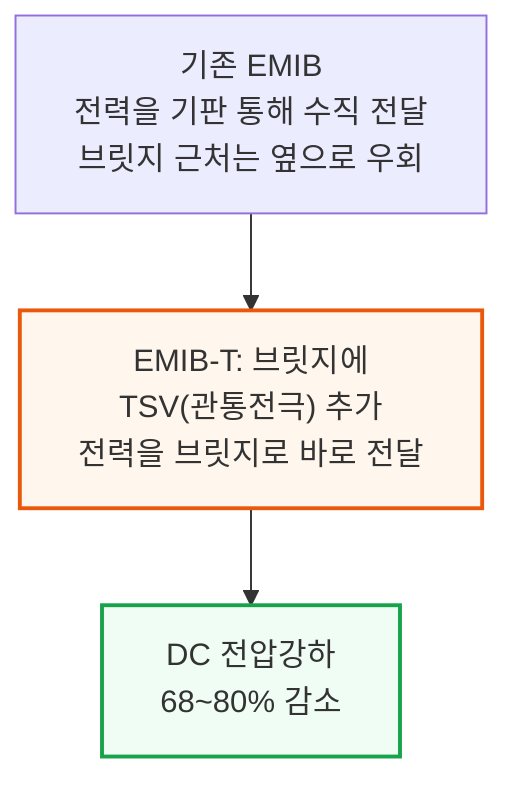

### HBM4E가 어려운 이유 - 신호와 전력의 동시 확장

HBM4E는 인터커넥트가 신호밀도와 전력전달을 동시에 확장해야 하는 난제를 안고 있습니다. HBM4는 HBM3 대비 핀 수가 2배로 늘고, PHY에는 VDDQ·VDDQL 같은 전력레일이 추가로 필요한데, 이 레일들이 배선 면적을 잠식해 남은 공간의 신호밀도를 더 끌어올립니다.

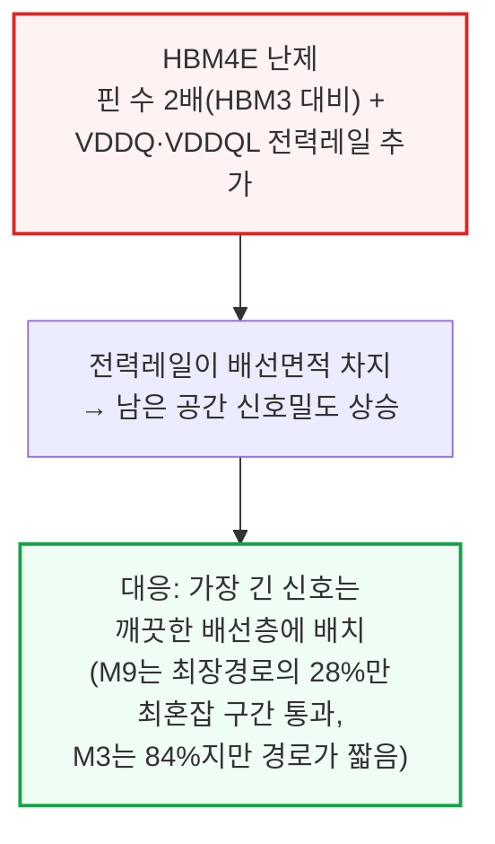

### MIM 커패시터와 신호 품질 - 실측 결과

전력전달은 브릿지 안으로도 이동하고 있습니다. EMIB-M이 도입한 M1\~M2 사이 MIM 커패시터를 EMIB-T가 계승해, 커패시턴스 밀도 500 fF/µm²(인텔 18A급과 비슷한 수준)를 달성했습니다.

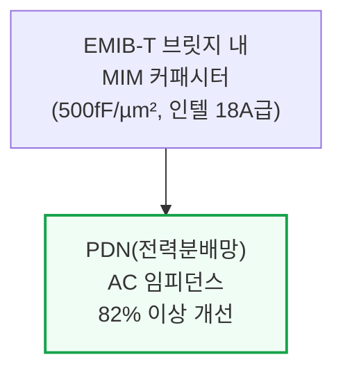

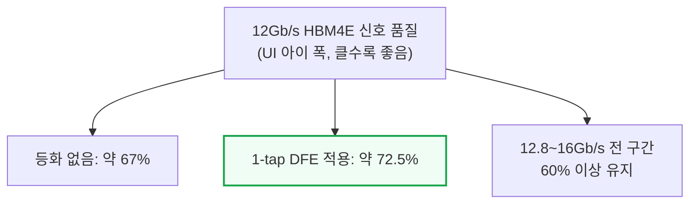

**📌 용어 풀이: DFE(결정귀환등화기)와 UI 아이 폭**
> - **DFE (Decision Feedback Equalizer)**: 신호가 패키지 배선을 지나며 이전 비트의 잔상이 다음 비트를 방해하는 간섭을 수신단에서 계산해 제거하는 회로
> - **UI 아이 폭 (Unit Interval Eye Width)**: 한 비트를 정확히 읽을 수 있는 시간 여유의 비율 — 클수록 신호를 오판독할 위험이 적음

### 향후 로드맵과 TSMC 대비 격차

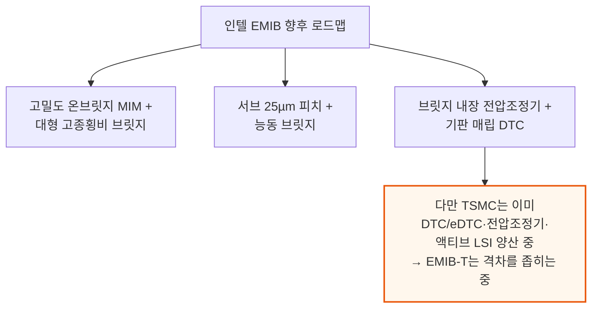

인텔은 기판 코어에 매립하는 딥트렌치 커패시터(DTC)와 베이스 다이 아래 매립하는 2.5 µF/mm² 이상의 eMIM-T 커패시터 개념도 공개했지만, 아직 실제 출하 제품에는 적용되지 않았습니다.

---

## 3. 마벨 커스텀 HBM - 표준을 버리고 얻는 것

**📌 핵심:**
- 표준 HBM은 JEDEC 규격에 따라 메모리와 가속기 사이 인터페이스가 고정돼 어떤 메모리사 제품과도 호환되지만, 패키지가 커지고 HBM 속도가 오를수록 전력·성능·면적 최적화가 어려워짐
- 마벨 커스텀 HBM은 D램 코어는 그대로 두고 **베이스 다이만 첨단 로직 공정으로 재설계** — HBM 컨트롤러·관리기능·커스텀 로직·확장 인터페이스까지 베이스 다이로 옮겨, 가속기 칩에서 HBM 관련 회로가 차지하는 면적을 **약 60% 절감**
- 예시 설계는 1024채널×32Gb/s로 **4.1TB/s**를 구현(2048비트 JEDEC HBM4(E) 16Gb/s와 동급 대역폭)하면서도, 인터포저 배선 길이를 6.5mm에서 **1.5mm로 단축**해 배선층 9개·2/2µm 배선폭을 그대로 유지
- 결론: 엔비디아 Feynman도 커스텀 HBM을 채택할 예정(현재 루빈 GPU 다이 면적의 약 16%가 HBM 관련 회로)이며, 확장 인터페이스로 LPDDR 등 추가 메모리를 붙일 수 있어 AMD MI450·MI500의 LPDDR 지원 전략과도 맞닿아 있음

---

### JEDEC 표준의 트레이드오프

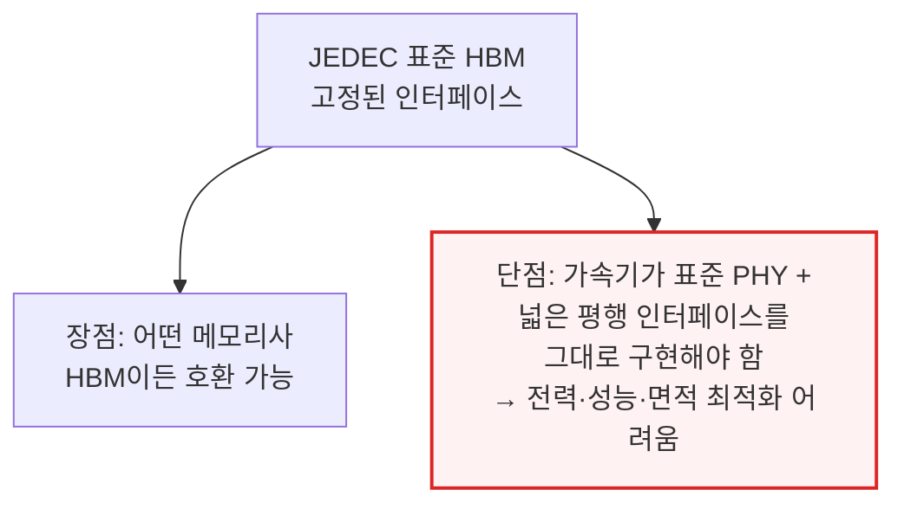

마벨은 2024년 Industry Analyst Day에서 커스텀 HBM을 처음 언급했고, Hot Chips 2025에서 베이스 다이 플로어플랜을, 이번 ECTC에서야 패키지 레벨 세부 설계를 공개했습니다.

### 커스텀 HBM 구조 - 베이스 다이로의 이전

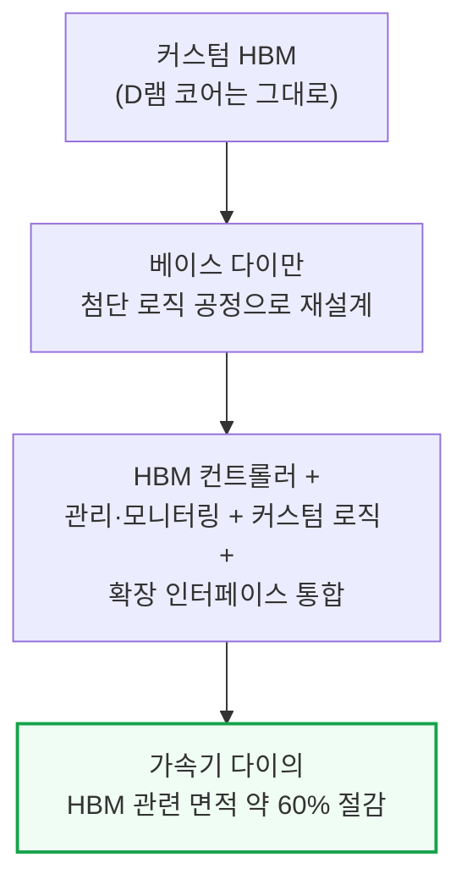

### 성능·배선 개선 실측치

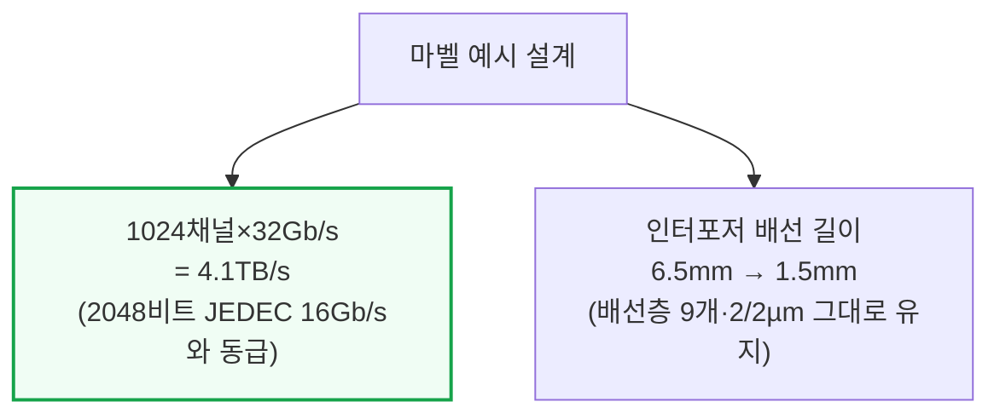

이 예시는 실리콘 대신 유기물 재배선층(RDL) 인터포저를 사용해 패키징 비용을 낮췄습니다. 유기 RDL은 CoWoS-S 실리콘 인터포저나 CoWoS-L·EMIB-T의 실리콘 브릿지보다 배선폭이 훨씬 굵어 레이아웃이 까다로운데, 마벨은 구간별 맞춤 차폐·배선 패턴으로 대역폭 밀도를 높이면서 신호 간섭을 제어했습니다.

### 확장 인터페이스와 업계 파급 효과

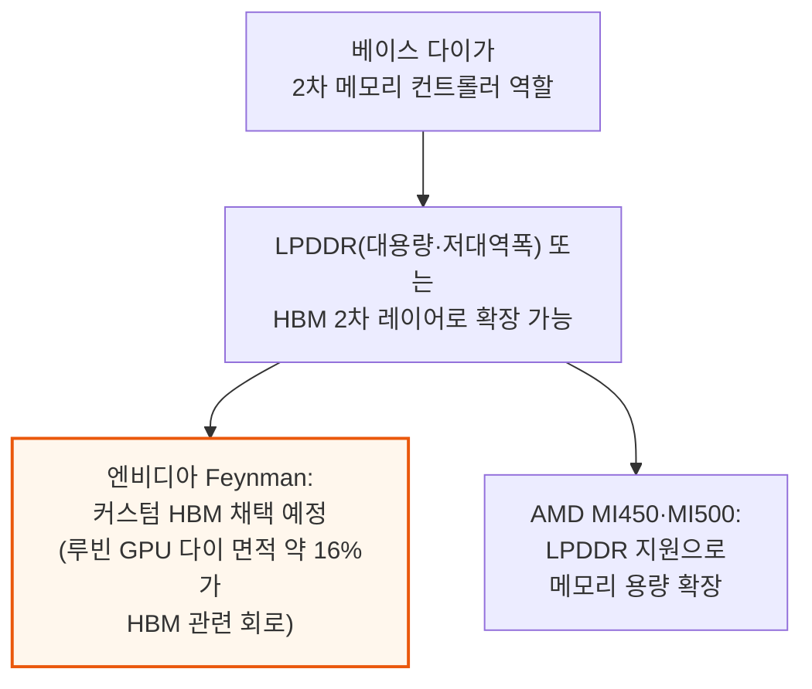

이런 확장 인터페이스는 모든 메모리 트래픽을 제한된 다이 가장자리로만 몰아넣지 않고, 베이스 다이가 2차 메모리 컨트롤러 역할을 하며 외부 I/O에 쓸 다이 가장자리 공간을 아끼면서도 용량을 늘릴 길을 열어줍니다.

---

*작성 진행률: 약 21% 완료*
*업데이트: 헤더·목차·용어 정리 및 1\~3장(개요, 인텔 EMIB-T, 마벨 커스텀 HBM) 작성 완료*
