# ISSCC 2026 Roundup: NVIDIA & Broadcom CPO, HBM4 & LPDDR6, TSMC Active LSI, Logic-Based SRAM, UCIe-S and More

> **출처**: [https://newsletter.semianalysis.com/p/isscc-2026-nvidia-and-broadcom-cpo](https://newsletter.semianalysis.com/p/isscc-2026-nvidia-and-broadcom-cpo)
> **저자**: Dylan Patel
> **발행일**: 2026-04-16

📑 목차
 1. [ISSCC 2026 총정리 개요](#1-isscc-2026-총정리-개요)
 2. [삼성 HBM4 (Paper 15.6)](#2-삼성-hbm4-paper-156)
 3. [삼성 LPDDR6과 SF2 PHY (Paper 15.8, 37.3)](#3-삼성-lpddr6과-sf2-phy-paper-158-373)
 4. [SK하이닉스 1c LPDDR6과 GDDR7 (Paper 15.7, 15.9)](#4-sk하이닉스-1c-lpddr6과-gddr7-paper-157-159)
 5. [삼성 4F² COP D램 (Paper 15.10)](#5-삼성-4f²-cop-d램-paper-1510)
 6. [샌디스크·키오시아 BiCS10 낸드 (Paper 15.1)](#6-샌디스크키오시아-bics10-낸드-paper-151)
 7. [미디어텍 xBIT 로직 기반 비트셀 (Paper 15.2)](#7-미디어텍-xbit-로직-기반-비트셀-paper-152)
 8. [TSMC N16 MRAM (Paper 15.4)](#8-tsmc-n16-mram-paper-154)
 9. [엔비디아 DWDM과 CPO 스케일업 (Paper 23.1)](#9-엔비디아-dwdm과-cpo-스케일업-paper-231)
10. [마벨 코히런트-라이트 트랜시버 (Paper 23.2)](#10-마벨-코히런트-라이트-트랜시버-paper-232)
11. [브로드컴 6.4T 광학 엔진 (Paper 23.4)](#11-브로드컴-64t-광학-엔진-paper-234)
12. [인텔 UCIe-S 다이간 인터커넥트 (Paper 8.1)](#12-인텔-ucie-s-다이간-인터커넥트-paper-81)
13. [TSMC 액티브 LSI (Paper 8.2)](#13-tsmc-액티브-lsi-paper-82)
14. [마이크로소프트 D2D 인터커넥트 (Paper 8.3)](#14-마이크로소프트-d2d-인터커넥트-paper-83)
15. [미디어텍 디멘시티 9500 (Paper 10.2)](#15-미디어텍-디멘시티-9500-paper-102)
16. [인텔 18A-on-인텔3 하이브리드 본딩 (Paper 10.6)](#16-인텔-18a-on-인텔3-하이브리드-본딩-paper-106)
17. [AMD MI355X (Paper 2.1)](#17-amd-mi355x-paper-21)
18. [리벨리온스 Rebel100 (Paper 2.2)](#18-리벨리온스-rebel100-paper-22)
19. [마이크로소프트 마이아 200 (Paper 17.4)](#19-마이크로소프트-마이아-200-paper-174)
20. [삼성 SF2 온도 센서 (Paper 21.5)](#20-삼성-sf2-온도-센서-paper-215)

🔑 용어 정리
- **HBM4 (5세대 고대역폭 메모리)**: DRAM을 여러 층 쌓아 GPU 옆에 붙이는 AI 전용 메모리의 최신 세대 — 이번 세대부터 맨 아래층(베이스 다이)을 DRAM 공정이 아니라 로직(연산칩) 공정으로 만드는 것이 핵심 변화
- **LPDDR6**: 스마트폰 등 모바일 기기에 쓰는 저전력 DRAM의 차세대 표준 — 속도를 크게 높이면서도 배터리 소모를 줄이는 데 초점
- **GDDR7**: 게임용 그래픽카드에 주로 쓰이는 고속 메모리 — HBM보다 저렴하지만 용량과 밀도는 더 낮음
- **CPO (Co-Packaged Optics, 광학엔진 동일패키지 통합)**: 빛(광신호)으로 데이터를 주고받는 광통신 부품을 반도체 칩과 한 패키지 안에 붙여, 전기 신호보다 더 멀리, 더 적은 전력으로 데이터를 보내는 기술
- **하이브리드 본딩 (Hybrid Bonding)**: 칩과 칩을 쌓을 때 금속 돌기(범프) 없이 구리 면끼리 직접 붙이는 차세대 적층 기술 — 더 촘촘하게 쌓을 수 있지만 수율 확보가 어려움
- **UCIe-S (Universal Chiplet Interconnect Express - Standard)**: 서로 다른 회사가 만든 칩(다이)들을 하나의 패키지 안에서 표준화된 방식으로 연결하는 업계 공통 규격
- **D2D 인터커넥트 (Die-to-Die Interconnect, 다이간 인터커넥트)**: 한 패키지 안에 여러 개로 쪼갠 칩(다이)들이 서로 데이터를 주고받는 통로 — AI 가속기가 칩 하나로 안 만들고 여러 조각으로 쪼개면서 이 통로의 성능이 전체 칩 성능을 좌우하게 됨
- **MRAM (Magnetic RAM, 자기저항 메모리)**: 전원이 꺼져도 데이터가 남아있는 비휘발성 메모리 — 자동차·산업용처럼 안정성이 최우선인 곳에 주로 사용

---

## 1. ISSCC 2026 총정리 개요

**📌 핵심:**
- 매년 열리는 3대 반도체 학회(IEDM, VLSI, ISSCC) 중 마지막인 ISSCC 2026은 회로·측정 데이터 중심 발표가 특징이며, 올해는 유독 실제 산업 트렌드와 직결된 논문이 많았음
- 메모리(HBM4·LPDDR6·GDDR7·낸드·SRAM·MRAM), 인터커넥트(광통신 CPO + 다이간 전기 연결), 프로세서(모바일·서버·AI 가속기) 세 축으로 총 20개 발표를 정리
- 결론: 이번 학회는 "칩 하나를 어떻게 더 빠르게 만드나"보다 "여러 칩·여러 층을 어떻게 더 촘촘하고 저전력으로 연결하나"에 초점이 쏠려 있었음

---

ISSCC(International Solid-State Circuits Conference)는 매년 열리는 3대 반도체 학회 중 회로·집적 설계 비중이 가장 크고, 거의 모든 발표에 회로도와 실측 데이터가 함께 제시됩니다. 예년에는 산업 영향력이 들쭉날쭉했지만, 올해는 HBM4·LPDDR6·GDDR7·낸드부터 광학엔진 동일패키지 통합(CPO), 다이간 고속 연결, 미디어텍·AMD·엔비디아·마이크로소프트의 최신 프로세서까지 시장 흐름과 직결된 논문이 대거 발표됐습니다.

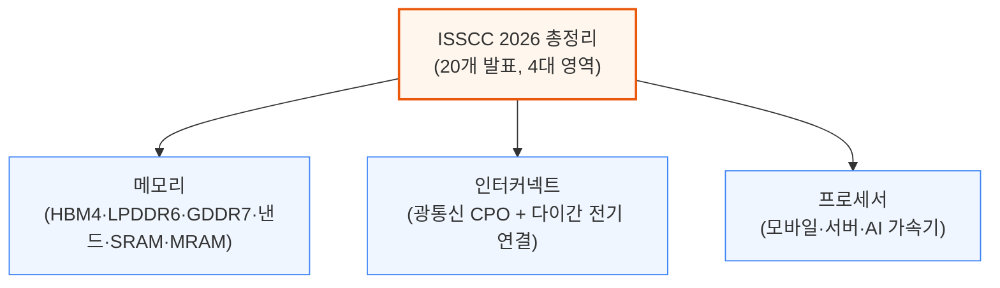

---

## 2. 삼성 HBM4 (Paper 15.6)

**📌 핵심:**
- 삼성전자는 3대 메모리 기업 중 유일하게 HBM4 기술 논문을 공개, 6세대 10나노급(1c) D램 코어 + SF4 로직 공정 베이스 다이로 **36GB, 12층 적층, 2048개 입출력 핀, 3.3TB/s 대역폭**을 시연
- 베이스 다이(HBM 스택 맨 아래 중계칩)를 D램 공정 대신 로직(연산칩) 공정으로 만든 것이 HBM3E 대비 가장 큰 구조 변화 — 전력 전압(VDDQ)이 1.1V에서 0.75V로 **32% 감소**
- 다만 1c D램 공정 자체는 2025년 한 해 수율이 **약 50%**에 그쳐 아직 불안정했고, SK하이닉스 대비 신뢰성·안정성은 여전히 뒤처짐
- 결론: 삼성 HBM4는 JEDEC 표준(핀당 6.4Gb/s, 약 2TB/s) 대비 **2배 이상의 핀 속도(13Gb/s, 3.3TB/s)**를 달성해 기술 격차를 좁히고 있으나, 수율·마진 리스크는 아직 해소되지 않음

---

HBM4에서 가장 큰 구조 변화는 코어 D램 다이와 베이스 다이의 공정을 분리한 것입니다. 이전 세대까지는 코어 다이와 베이스 다이 모두 같은 D램 공정으로 만들었지만, HBM4부터는 베이스 다이만 첨단 로직 공정(SF4)으로 제작합니다.

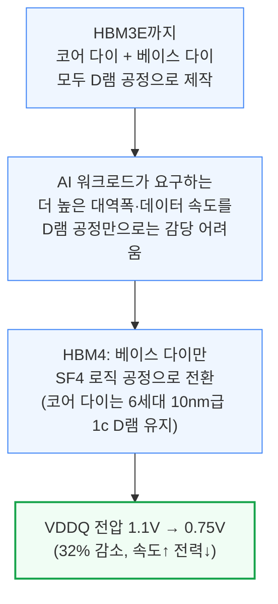

로직 공정 베이스 다이는 트랜지스터를 더 촘촘히 넣을 수 있고 배선층도 더 많이 쌓을 수 있어, D램 공정 베이스 다이보다 면적 효율이 좋습니다. 3대 메모리 기업의 베이스 다이 공정 선택은 서로 다릅니다.

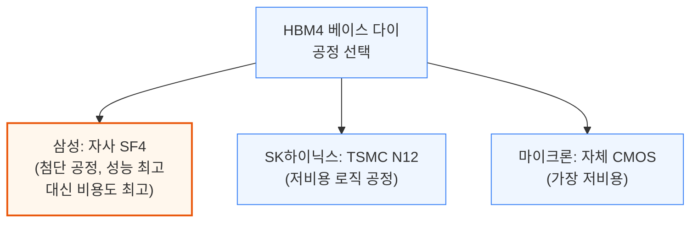

삼성은 코어 다이 TSV(층간 관통전극) 수를 4배로 늘리고, 적층 편차를 보정하는 적응형 바디 바이어스(ABB) 제어를 더해 최대 13Gb/s의 핀 속도를 달성했습니다. 또 하나의 난제는 tCCDR(서로 다른 스택ID 간 연속 읽기 명령 사이 최소 간격)로, 층수·채널 수가 16개에서 32개로 늘수록 층간 타이밍 편차가 누적돼 이 값이 나빠집니다.

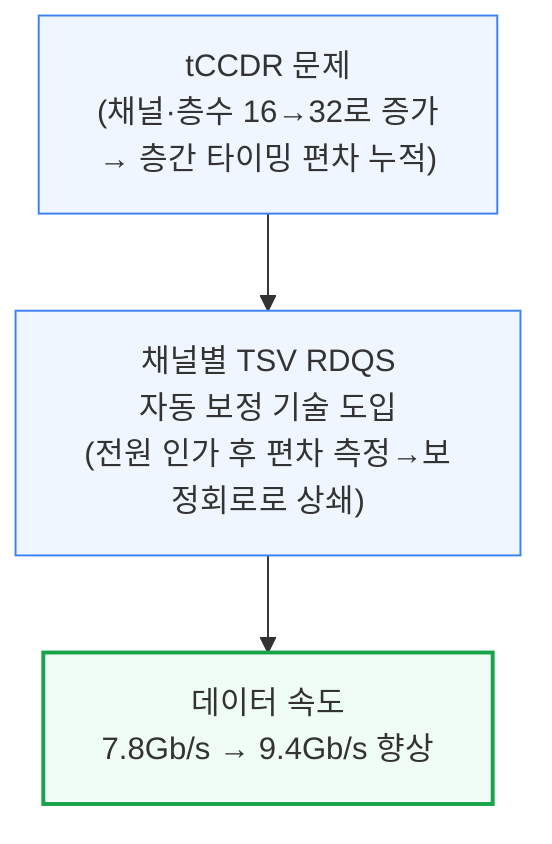

로직 베이스 다이 전환의 또 다른 성과는 PMBIST(프로그래머블 메모리 자체 테스트)입니다. HBM3E는 베이스 다이가 D램 공정이라 전력·면적 제약 때문에 정해진 소수의 테스트 패턴만 돌릴 수 있었지만, HBM4는 실제 시스템이 보내는 것과 동일한 JEDEC 명령 전체를 임의 시점에 풀 스피드로 실행할 수 있어 양산 수율 개선에 직접 도움이 됩니다.

**📌 용어 풀이: tCCDR과 TSV 타이밍 편차**
> - **tCCDR**: 서로 다른 스택ID(칩 내 논리적 구획)에서 연속으로 읽기 명령을 처리할 때 필요한 최소 대기시간 — 이 값이 짧을수록 병렬 접근 성능이 좋음
> - **타이밍 편차의 원인**: 여러 층을 쌓다 보면 층마다 제조 편차, TSV(관통전극)를 타고 가는 신호의 전달 속도 차이, 채널별 국소 편차가 겹쳐서 층·채널 간 신호 도착 시각이 조금씩 어긋남
> - **쉬운 비유**: 12층 건물의 각 층에서 엘리베이터가 1층에 도착하는 시간이 층마다 미묘하게 다른데, 이 편차를 자동으로 재고 보정해 모든 층이 동시에 도착한 것처럼 맞추는 것과 비슷

삼성 HBM4는 JEDEC 공식 표준(JESD270-4, 핀당 최대 6.4Gb/s, 약 2TB/s)을 2배 이상 웃도는 핀당 13Gb/s, 3.3TB/s 대역폭을 시연했습니다. VDDC/VDDQ를 1.05V/0.75V로 낮춰도 11.8Gb/s를 유지합니다. 다만 1c 전공정 자체가 까다로워 2025년 한 해 수율이 약 50%에 머물렀고(1b 노드를 건너뛰고 1a에서 바로 1c로 전환한 영향), 삼성 HBM은 역사적으로 SK하이닉스보다 마진이 낮았던 만큼 이 수율 리스크가 HBM4 마진에도 부담으로 작용할 수 있습니다.

---

## 3. 삼성 LPDDR6과 SF2 PHY (Paper 15.8, 37.3)

**📌 핵심:**
- 삼성과 SK하이닉스가 나란히 LPDDR6을 공개, 삼성은 다이 하나를 **2개 서브채널**로 나누고 안 쓰는 서브채널을 꺼서 전력을 아끼는 **효율 모드**를 채택 — 다만 이 구조 때문에 다이 면적의 약 5%를 주변회로가 추가로 차지
- 신호 방식은 GDDR7과 달리 PAM3가 아닌 **와이드 NRZ**(서브채널당 12개 핀, 버스트 길이 24)를 사용, 대역폭 계산 시 오류정정(ECC)·전력절감용 비트(DBI) 32개를 제외해야 함(예: 12.8Gb/s → 실효 34.1GB/s)
- 전력 도메인을 세분화해 **읽기 전력 27% 감소, 쓰기 전력 22% 감소**를 달성했고, SF2 공정으로 만든 별도 PHY 칩은 효율 모드에서 읽기 39%·쓰기 29% 절감, 클럭게이팅까지 더하면 최대 약 50% 절감
- 결론: 삼성 LPDDR6은 12.8~14.4Gb/s 구간에서 동작하지만 밀도(0.360Gb/mm²)가 기존 LPDDR5X 1b 공정(0.447Gb/mm²)보다 낮아, 아직 성숙하지 않은 1b 공정에서 만든 시제품으로 추정됨

---

LPDDR6은 다이 하나를 2개의 서브채널로 나누고, 각 서브채널에 16개 뱅크를 배치하는 구조입니다. 평소에는 두 서브채널을 모두 쓰는 일반 모드로 동작하지만, 절전이 필요할 때는 보조 서브채널의 전원을 끄고 주 서브채널이 32개 뱅크를 전부 제어하는 효율 모드로 전환할 수 있습니다. 다만 이 경우 보조 서브채널 접근 시 지연시간이 늘어나는 손해가 있습니다.

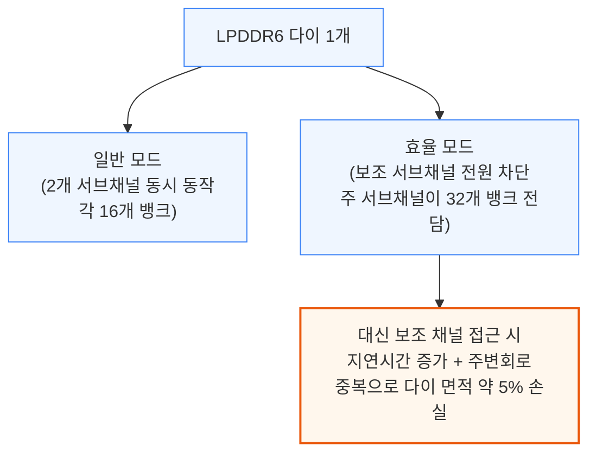

신호 방식은 GDDR7의 PAM3(한 신호에 여러 값을 실어 보내는 방식)와 달리, LPDDR6은 일반 NRZ(신호를 0/1 두 값으로만 보내는 가장 단순한 방식)로는 여유(eye margin)가 부족해 서브채널당 12개 핀, 버스트 길이 24를 쓰는 "와이드 NRZ"를 사용합니다.

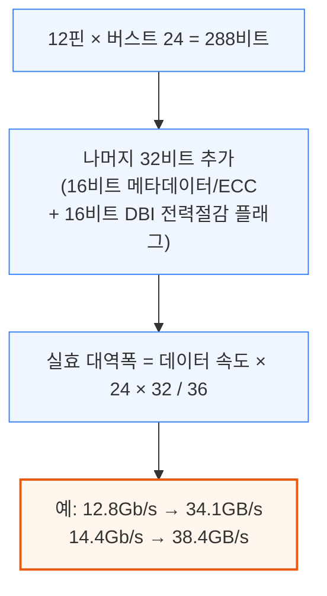

**📌 용어 풀이: DBI (Data Bus Inversion, 데이터 버스 반전)**
> - **의미**: 한 번에 보낼 신호 중 절반 이상이 0→1 또는 1→0으로 바뀔 것 같으면, 차라리 전체 비트를 반전시켜 보내고 반전 여부만 플래그 1비트로 알려주는 절전 기법
> - **효과**: 한 번에 스위칭하는 신호 수를 버스 폭의 절반 이하로 제한해 전력 소모와 신호 잡음을 줄임
> - **쉬운 비유**: 편지에서 대부분 문장이 반대말이면, 원문 대신 "전부 반대로 읽으세요"라는 메모 한 줄만 보내는 것과 비슷

삼성은 저전력 상태(3.2Gb/s 이하로 대기 상태에 있을 때가 대부분)에 쓰는 전압 도메인을 세밀하게 나눠, 읽기 전력을 27%, 쓰기 전력을 22% 줄였습니다. 배선을 물리적으로 가깝게 재배치하는 RDL(재배선층) 기법도 함께 적용해 고주파에서 필수적인 타이밍 여유를 확보했습니다. 이 시제품은 0.97V에서 12.8Gb/s, 1.025V에서 최대 14.4Gb/s를 기록했지만, 16Gb 다이 기준 밀도가 0.360Gb/mm²로 기존 LPDDR5X 1b 공정(0.447Gb/mm²)보다 낮고 오히려 구형 1a 공정(0.341Gb/mm²)에 가까워, 아직 성숙 전인 1b 공정 시제품으로 추정됩니다.

별도로 공개된 SF2 공정 PHY(Paper 37.3)는 LPDDR6 인터페이스 전용 칩으로, 최대 14.4Gb/s를 지원하며 배선 폭 2.32mm·면적 0.695mm²에 대역폭 밀도 16.6Gb/s/mm(배선 1mm당) 및 55.3Gb/s/mm²(면적 1mm²당)를 달성했습니다.

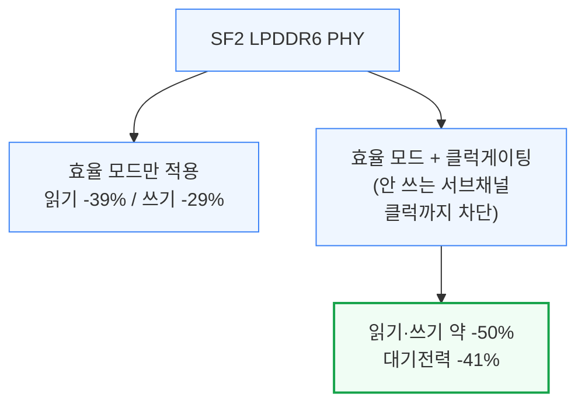

---

## 4. SK하이닉스 1c LPDDR6과 GDDR7 (Paper 15.7, 15.9)

**📌 핵심:**
- SK하이닉스는 처음으로 1c D램 공정 기반 **LPDDR6과 GDDR7**을 동시 공개 — LPDDR6은 최대 14.4Gb/s로 기존 LPDDR5X 최고속 대비 **35% 빠름**
- LPDDR6 저전압 구간(0.95V)에서는 10.9Gb/s로 삼성(0.97V에서 12.8Gb/s)보다 낮아, 같은 신뢰성을 유지하려면 더 높은 전압이 필요한 것으로 추정 — 저전압 전력효율은 삼성이 앞섬
- GDDR7은 1.2V에서 **48Gb/s**까지 clocking, 저전압(1.05V/0.9V)에서도 30.3Gb/s로 RTX 5080에 탑재된 기존 30Gb/s 메모리보다 빠름 — 밀도는 0.412Gb/mm²로 이전 1b(0.309)·1z(0.192) 대비 크게 향상
- 결론: GDDR7은 LPDDR5X 대비 밀도가 약 70%에 그치는 대신 훨씬 빠른 속도가 강점이라 게임용 GPU에 주로 쓰이며, 엔비디아가 계획했던 GDDR7 128GB 탑재 Rubin CPX는 2026년 로드맵에서 사실상 빠지고 HBM 기반 라인업으로 무게중심이 이동

---

SK하이닉스는 이번 학회에서 처음으로 1c D램 공정 제품을 LPDDR6과 GDDR7 두 형태로 공개했습니다. LPDDR6은 최대 14.4Gb/s로 기존 최고속 LPDDR5X보다 35% 빠르면서 전력은 더 낮습니다. 다만 낮은 전압에서는 삼성보다 전력효율이 떨어지는 것으로 보입니다.

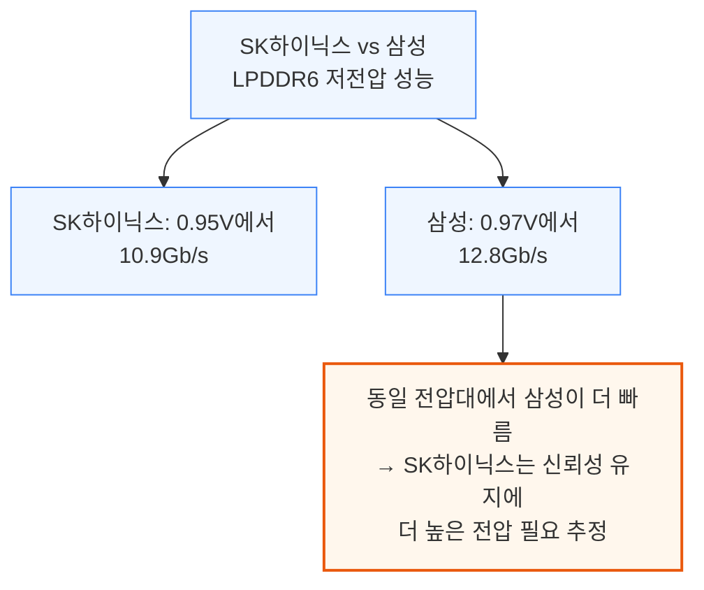

두 제품 모두 일반 모드와 효율 모드를 지원합니다. 효율 모드는 단일 서브채널로 12.8Gb/s에서 동작하며, 대기전류는 12.7%, 동작전류는 18.9% 낮습니다.

같은 1c 공정의 GDDR7은 훨씬 큰 폭의 성능 향상을 보였습니다. 1.2V/1.2V에서 48Gb/s, 저전압(1.05V/0.9V)에서도 30.3Gb/s로 RTX 5080에 쓰인 기존 30Gb/s 메모리를 앞섭니다.

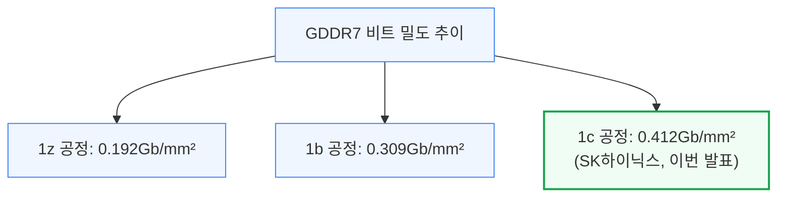

GDDR7이 LPDDR5X보다 속도는 훨씬 빠르지만 밀도는 약 70% 수준에 그치는 이유는, 고속 신호(PAM3 및 클럭당 4개 심볼을 보내는 QDR 방식)를 처리하기 위한 주변회로가 훨씬 넓은 면적을 차지해 실제 메모리 셀 배열의 비중이 줄어들기 때문입니다. 이 때문에 GDDR7은 HBM보다 저렴하지만 용량·밀도가 낮은 게임용 GPU 시장에 주로 쓰이며, 엔비디아가 2025년 발표했던 GDDR7 128GB 탑재 Rubin CPX 대형 컨텍스트 AI 프로세서는 2026년 로드맵에서 사실상 사라지고 HBM 기반 Groq LPX 계열로 무게중심이 옮겨갔습니다.

---

## 5. 삼성 4F² COP D램 (Paper 15.10)

**📌 핵심:**
- 삼성은 SK하이닉스가 VLSI 2025에서 공개한 4F² 구조(PUC)와 동일한 개념의 **COP(Cell-on-Peripheral) D램**을 공개 — 이름만 다를 뿐 셀 웨이퍼와 주변회로 웨이퍼를 하이브리드 본딩으로 붙이는 같은 구조
- 셀 배열 밑에 주변회로를 넣는 "샌드위치" 구조로 주변회로 면적을 **17.0%에서 2.7%로 축소**, 다이 크기를 직접 줄이는 효과
- D램은 낸드보다 웨이퍼 간 연결 개수가 한 자릿수 더 많고 훨씬 촘촘한 간격이 필요해, 서브워드라인 드라이버 신호를 **75% 줄이고** 컬럼 선택 배선도 **절반으로 축소**하는 별도 최적화 필요
- 결론: 부유체 효과(플로팅 바디)로 인한 누설전류·리텐션 저하가 아직 과제로 남아있지만, 4F² 하이브리드 본딩 D램은 2020년대 후반 1d 이후 세대에 등장할 것으로 전망

---

D램 셀 면적을 줄이는 스케일링은 이미 한계에 다다랐다는 점을 이전 리포트에서 다룬 바 있습니다. VLSI 2025에서 SK하이닉스가 4F² PUC(Peri-Under-Cell) 구조를 처음 공개했고, 이번 ISSCC에서 삼성이 같은 개념을 COP(Cell-on-Peripheral)라는 이름으로 공개했습니다.

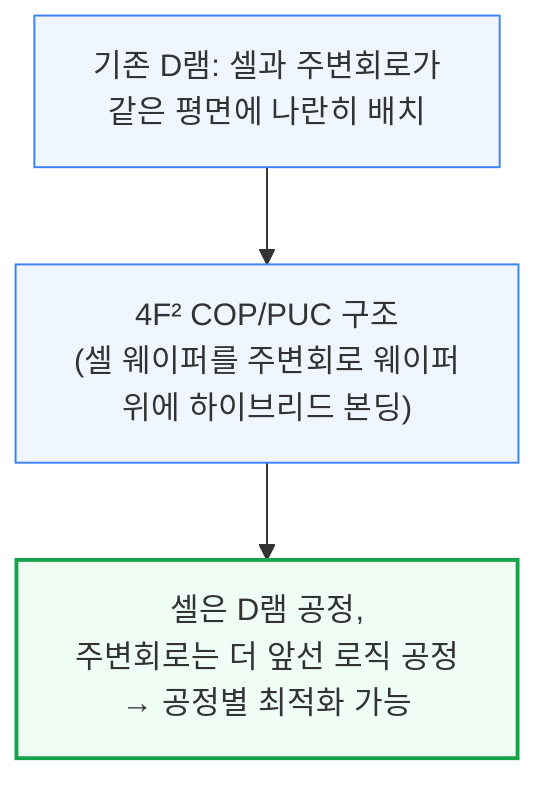

D램의 웨이퍼 간 연결(하이브리드 본딩 접점) 개수는 낸드보다 한 자릿수 더 많고 훨씬 촘촘한 간격을 요구합니다. 삼성은 이를 줄이기 위해 두 가지 방법을 적용했습니다.

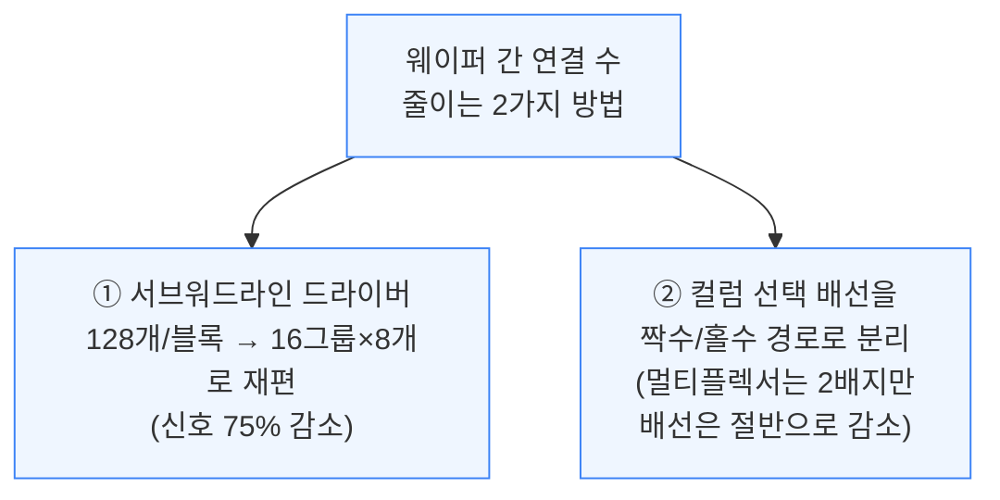

주변회로를 셀 배열 바로 아래 배치하는 "샌드위치" 구조를 적용해, 주변회로가 차지하는 면적 비중을 17.0%에서 2.7%로 크게 줄였습니다. 기존 D램은 비트라인당 셀 개수를 늘릴수록 칩 면적이 크게 늘었지만, 이 수직 구조에서는 주변회로가 전부 셀 아래에 있어 면적 증가가 거의 없습니다.

이미 낸드에서는 하이브리드 본딩이 쓰이고 있지만 삼성은 아직 낸드용 하이브리드 본딩조차 대량 양산 단계는 아니며, D램 COP는 부유체 효과(플로팅 바디로 인한 누설전류 증가·데이터 유지시간 감소)라는 별도 과제가 남아있어, 2020년대 후반 1d 이후 세대에나 본격 도입될 것으로 전망됩니다.

**📌 용어 풀이: 4F², 부유체 효과**
> - **4F² (4 Feature-squared)**: 셀 하나가 차지하는 최소 면적 단위를 이론적 한계에 가깝게 줄인 D램 셀 구조 — 수직형 채널 트랜지스터(VCT)와 그 위에 커패시터를 얹는 방식
> - **부유체 효과 (Floating Body Effect)**: 트랜지스터의 몸체(바디) 부분이 전기적으로 붕 떠 있어 전하가 새거나 예상치 못하게 쌓이는 현상 — 데이터가 저절로 사라지거나(리텐션 저하) 누설전류가 늘어나는 부작용을 일으킴

---

## 6. 샌디스크·키오시아 BiCS10 낸드 (Paper 15.1)

**📌 핵심:**
- 샌디스크·키오시아는 **332층, 3덱(deck)** 구조의 BiCS10 낸드로 **37.6Gb/mm²**를 기록, 종전 1위였던 SK하이닉스 321층 V9(28.8Gb/mm²)를 제치고 낸드 비트 밀도 신기록 경신
- 비슷한 층수·구조(6플레인, 3덱)인데도 SK하이닉스보다 **밀도가 30% 높은** 것은 6플레인 배치 방식의 차이(1×6 vs 2×3) 때문 — 샌디스크·키오시아의 1×6 방식이 면적을 2.1% 더 아낌
- 다이를 더 많이 쌓을수록 선택 안 된 다이의 대기전류가 늘어나는 문제를 다이 게이팅(선택 안 된 다이의 데이터 경로 전체 차단)으로 해결, 대기전류를 **100분의 1 수준**으로 감소
- 결론: 밀도 경쟁에서 SK하이닉스가 TLC·QLC 모든 구성에서 뒤처지는 추세가 재확인됐으며, 낸드 적층 경쟁은 층수뿐 아니라 플레인 배치·전력망 설계 최적화로 승부처가 이동

---

BiCS10은 332층, 3덱 구조로 QLC(셀당 4비트) 기준 37.6Gb/mm²의 비트 밀도를 기록해, SK하이닉스의 321층 V9(28.8Gb/mm², 30% 낮음)를 제치고 신기록을 세웠습니다. TLC(셀당 3비트) 기준으로도 29 대 21Gb/mm²로 격차가 벌어집니다.

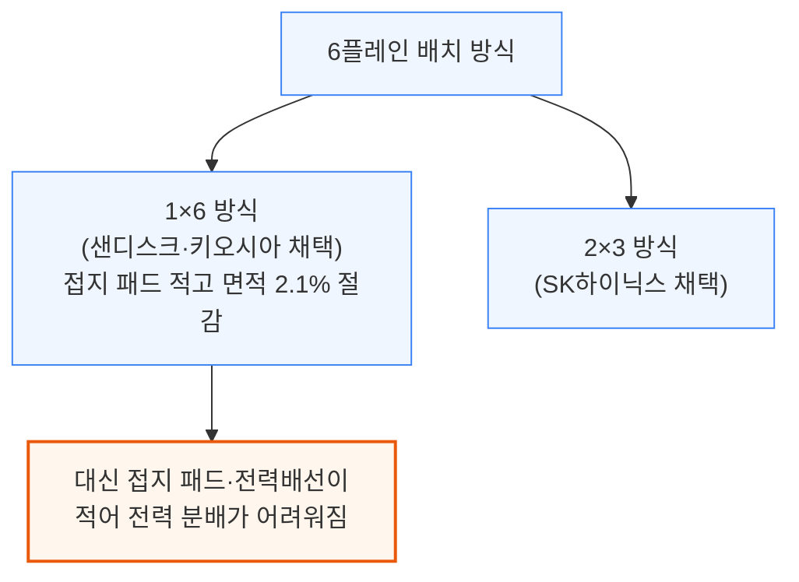

1×6 방식의 전력 분배 약점은 CBA(Cell Bonded Array, 셀과 CMOS 웨이퍼를 따로 만들어 붙이는 구조)의 이점을 살려 별도 최상단 금속층을 하나 더 추가하는 방식으로 해결했습니다.

낸드는 저장 밀도를 높이려면 다이를 더 많이 쌓아야 하는데, 다이를 많이 쌓을수록 선택되지 않은 대기 중인 다이들의 누설전류가 실제로 동작 중인 다이의 전류에 근접할 만큼 커지는 문제가 있습니다. 샌디스크는 선택 안 된 다이의 데이터 경로 전체를 차단하는 게이팅 시스템으로 대기전류를 100분의 1 수준까지 낮췄습니다.

---

## 7. 미디어텍 xBIT 로직 기반 비트셀 (Paper 15.2)

**📌 핵심:**
- SRAM(칩 내부 초고속 메모리) 셀 크기는 이미 스케일링 한계에 도달 — 로직 면적은 N5→N2에서 40% 줄었는데 8T(트랜지스터 8개) SRAM 셀은 겨우 18%, 6T 셀은 단 2%만 줄어듦
- 미디어텍은 NMOS·PMOS 개수를 4:6(또는 6:4)으로 불균형하게 배치한 **10트랜지스터 xBIT 셀**을 개발해 기존 파운드리 표준 8T 셀 대비 **밀도 22~63% 향상**
- 읽기·쓰기 평균 전력을 30% 이상, 누설전류를 0.5V에서 29% 줄였고, 0.9V에서는 기존 8T와 성능이 비슷, 0.5V에서는 16% 느리지만 병목이 되지 않는 수준
- 결론: SRAM 셀 자체 스케일링이 막힌 상황에서, 셀 구조를 로직 회로처럼 재설계해 밀도·전력을 함께 개선하는 것이 차세대 온칩 메모리의 새로운 접근법으로 부상

---

로직 공정이 미세화될수록 SRAM 셀은 상대적으로 덜 작아지는 현상이 심해지고 있습니다. N5에서 N2로 넘어가며 로직 면적은 40% 줄었지만, 8T 고전류 SRAM 셀은 18%, 6T 고전류 셀은 단 2%만 줄었습니다. N3E의 고밀도 셀은 오히려 N3B보다 퇴보해 N5 수준으로 되돌아갔다는 점도 이미 알려진 문제입니다.

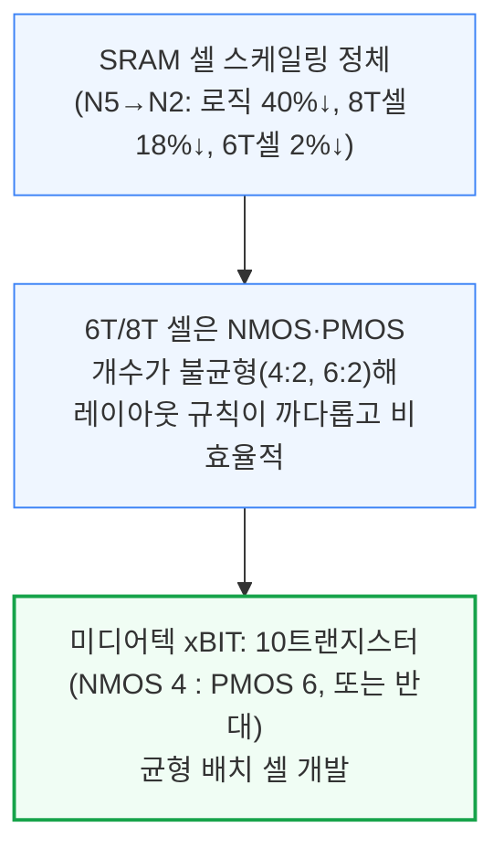

xBIT 두 가지 변형을 짝지으면 트랜지스터 20개짜리 직사각형 블록 하나에 2비트를 저장할 수 있습니다. 파운드리 표준 8T 셀과 비교하면 다음과 같은 성과를 냈습니다.

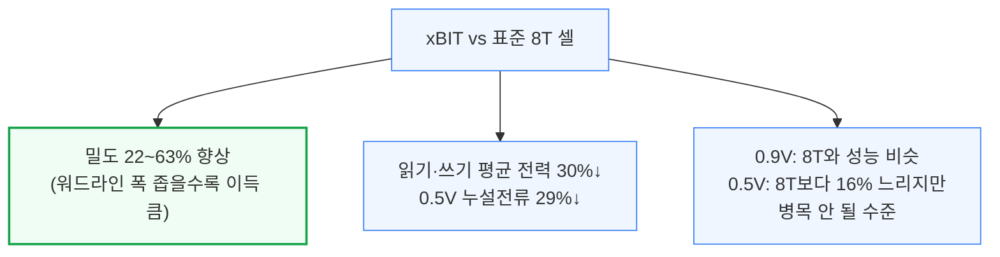

미디어텍은 xBIT가 100MHz(0.35V)에서 4GHz(0.95V)까지 넓은 전압-주파수 구간에서 동작함을 시연했습니다. SRAM 스케일링 문제와 그 요인에 대해서는 별도 심층 리포트에서 다룰 예정이라고 밝혔습니다.

---

## 8. TSMC N16 MRAM (Paper 15.4)

**📌 핵심:**
- TSMC는 자동차·산업·엣지용 비휘발성 임베디드 메모리(eNVM)로 MRAM을 포지셔닝, N16 공정에서 **읽기와 쓰기를 동시에 처리하는 듀얼포트** 구조로 무선 펌웨어 업데이트(OTA) 중에도 읽기 중단 없이 동작
- 비트셀 면적을 25% 축소(0.033㎛² → 0.0249㎛²)해 등용량 기준 매크로 밀도를 16.0Mb/mm²로 높였고, 읽기 속도도 6ns에서 5.5ns로 개선
- 자동차 신뢰성 기준을 충족: 100만 회 내구 사이클 후에도 하드 에러율 0.01ppm 미만, 영하 40도\~150도에서 20년 데이터 보존 통과
- 결론: 삼성도 8LPP 공정 eMRAM을 발표했지만, TSMC가 더 저렴한 N16 공정에서 더 필요한 기능(듀얼포트)과 더 나은 성능을 모두 갖춰 임베디드 비휘발성 메모리 시장에서 유리한 위치 확보, 차세대 "Flash-Plus" 버전도 준비 중

---

TSMC는 2023년 ISSCC에서 처음 선보인 STT-MRAM(스핀 방향으로 데이터를 저장하는 자기저항 메모리)을 N16 공정에서 개선해 재공개했습니다. 이번 버전의 핵심은 읽기와 쓰기를 동시에 처리할 수 있는 듀얼포트 구조로, 자동차의 무선 펌웨어 업데이트(OTA)처럼 펌웨어를 쓰는 도중에도 시스템이 읽기를 멈출 수 없는 상황에 필수적입니다.

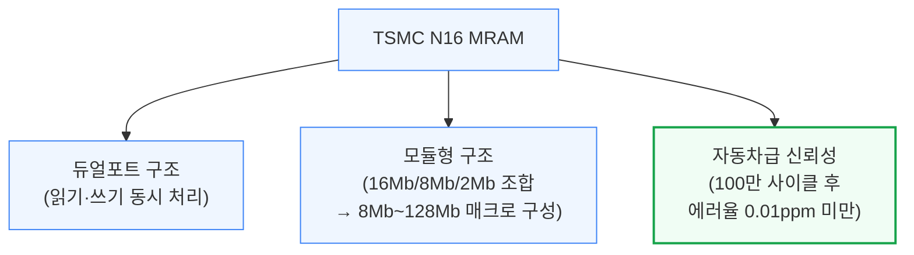

인터리빙 읽기(여러 모듈을 독립된 클럭으로 번갈아 접근)를 적용해 200MHz에서 51.2Gb/s 처리량을 냈고, 84Mb 매크로 기준 0.8V·영하 40도\~150도 전 구간에서 7.5ns 읽기 접근 시간을 기록했습니다. 이전 세대 대비 비트셀 면적을 25%(0.033㎛² → 0.0249㎛²) 줄여 등용량 기준 매크로 밀도가 16.0Mb/mm²로 늘었고, 읽기 속도도 6ns에서 5.5ns로 개선됐습니다.

신뢰성 측면에서는 100만 회 내구 사이클 후에도 영하 40도에서 하드 에러율이 0.01ppm 미만이었고, 150도에서 읽기 방해(read disturb) 오류율은 사실상 무시할 수 있는 수준(10⁻²²ppm 미만)이었습니다. 168Mb 테스트 칩은 리플로우 공정을 통과하고 150도에서 20년 데이터 보존 조건도 만족해, 까다로운 자동차 신뢰성 기준을 충족했습니다.

삼성도 8LPP 공정 기반 eMRAM을 같은 학회에서 발표했지만, TSMC 쪽이 더 저렴한 N16 공정에서 필요한 기능(듀얼포트)과 더 나은 성능을 모두 갖춰 더 유리한 위치에 있습니다. TSMC는 비트셀을 25% 더 줄이고 내구성을 100배 높인 차세대 "Flash-Plus" 버전도 준비 중입니다.

---

## 9. 엔비디아 DWDM과 CPO 스케일업 (Paper 23.1)

**📌 핵심:**
- 엔비디아는 스케일아웃(서버 랙 밖 연결)용으로 200G/레인 PAM4 방식의 COUPE 광학엔진을 이미 양산 중이지만, 스케일업(GPU 간 초근접 연결)용으로는 ISSCC에서 **32Gb/s 파장 8개를 파장분할다중화(DWDM)로 묶는** 새 방식을 제안
- 2026년 3월 AMD·브로드컴·메타·마이크로소프트·엔비디아·OpenAI가 결성한 광학 컴퓨트 인터커넥트 컨소시엄(OCI MSA)은 스케일업에 **DWDM**, 스케일아웃에 기존 **PAM4 방식**을 각각 쓰기로 정리 — 두 접근이 상충이 아니라 용도 분담이었음이 확인됨
- CPO(광학엔진 동일패키지 통합)의 최종 형태는 광학엔진을 인터포저에 직접 통합하는 방식으로, 배선 면적당 대역폭·연결 규모(라딕스)·에너지 효율을 모두 크게 개선하지만 패키징 기술이 아직 부족해 상용화까지 수년 소요 전망
- 결론: 클럭포워딩(별도 파장으로 클럭 신호를 함께 보내 수신단 회로를 단순화하는 기법)으로 SerDes 회로를 간소화하는 등, CPO 표준은 이제 "어떤 신호 방식을 쓸지"에서 "어떻게 패키지에 통합할지"로 경쟁의 축이 이동

---

광신호 방식의 선택은 스케일업 CPO(광학엔진 동일패키지 통합)가 언제 상용화되느냐를 좌우합니다. 엔비디아는 스케일아웃(서버 랙 간 연결)에는 이미 200G/레인 PAM4 방식의 COUPE 광학엔진을 양산 중이지만, ISSCC에서는 스케일업(GPU-GPU 초근접 연결)에 쓸 32Gb/s 파장 8개를 묶는 DWDM(파장분할다중화) 방식을 제안했습니다. 9번째 파장은 클럭 신호 전달 전용(절반 속도인 16Gb/s)으로 씁니다.

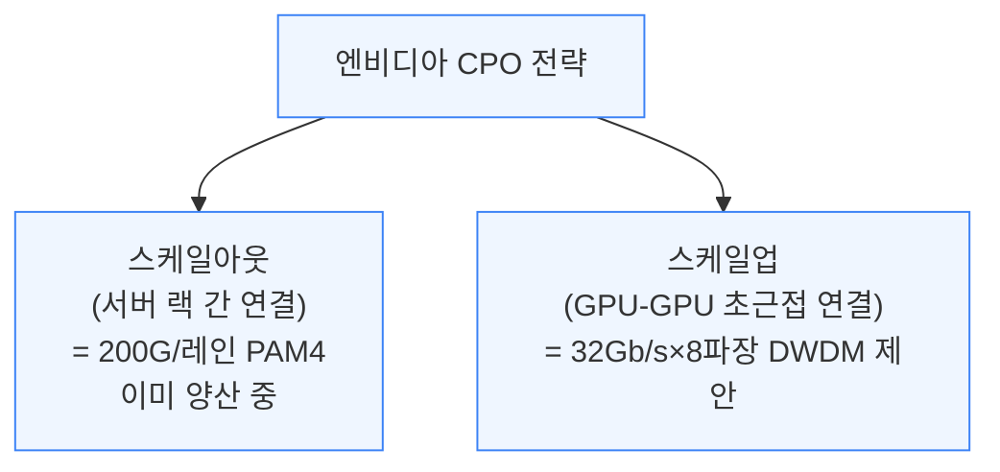

클럭포워딩은 별도 파장으로 클럭 신호를 함께 보내, 수신단에서 클럭·데이터 복원(CDR) 회로를 없애 SerDes(신호 변환 회로)를 단순화하고 에너지·배선 효율을 높이는 기법입니다. 2026년 3월, AMD·브로드컴·메타·마이크로소프트·엔비디아·OpenAI가 결성한 광학 컴퓨트 인터커넥트 컨소시엄(OCI MSA)은 200Gb/s 양방향 링크(각 방향에 50G NRZ 파장 4개, 같은 광섬유로 양방향 전송)를 표준으로 정했는데, 클럭 전용 파장은 따로 두지 않고 모든 파장을 데이터 전송에만 씁니다.

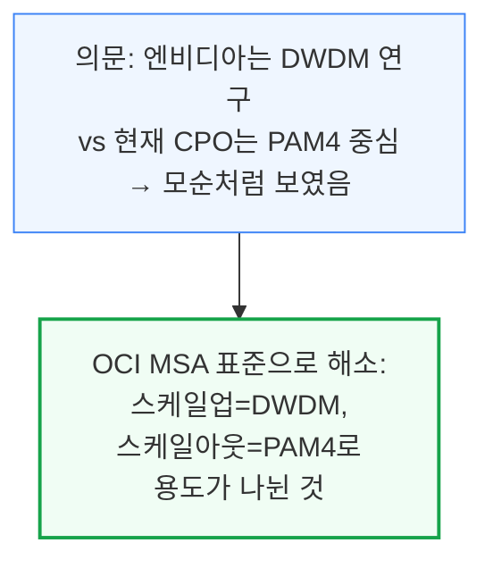

OCI MSA는 광학엔진을 패키지에 통합하는 방식도 3단계로 제시했습니다. 기판을 통해 통합하는 방식(OBO), 인터포저에 통합하는 방식 등으로, 통합 수준이 깊어질수록 배선 면적당 대역폭과 연결 규모(라딕스), 에너지 효율이 모두 좋아집니다.

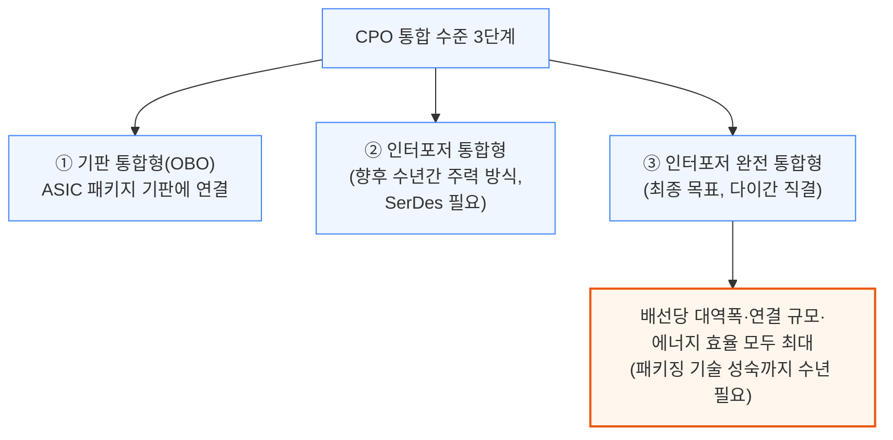

---

## 10. 마벨 코히런트-라이트 트랜시버 (Paper 23.2)

**📌 핵심:**
- 기존 광통신 트랜시버는 도달 거리가 10km 미만인 반면, 코히런트(위상까지 변조하는 고급 광통신) 트랜시버는 훨씬 멀리 가지만 복잡하고 비싸고 전력 소모가 큼 — 마벨은 두 방식 사이 **중간 지점**을 겨냥한 800G "코히런트-라이트" 트랜시버 공개
- 일반 코히런트가 쓰는 C밴드 파장은 장거리 전송에 유리하지만 분산이 커서 무거운 신호처리(DSP)가 필요 — 코히런트-라이트는 데이터센터 캠퍼스 정도 거리(수십km)에서는 분산이 거의 없는 **O밴드** 파장을 대신 사용해 DSP 부담을 최소화
- 편광을 X·Y축으로 나눈 이중편파 변조로 400G 채널당 8비트(32개 성상점) × 62.5GBd 신호 속도 = 약 400G 대역폭을 구현, 소비전력은 실리콘 포토닉스를 제외하고 **비트당 3.72pJ**로 기존 완전 코히런트 트랜시버의 절반
- 결론: 40km 광섬유 구간에서 지연시간 300ns 미만을 달성해, 빌딩 간 거리가 수십km에 불과한 데이터센터 캠퍼스 연결에 최적화된 새로운 중간 등급 광통신 표준으로 자리잡을 전망

---

전통적인 다이렉트 디텍션 트랜시버는 도달 거리가 10km 미만으로 짧고, 코히런트 트랜시버는 훨씬 멀리 가지만 복잡성·전력·비용이 모두 큽니다. 마벨의 코히런트-라이트는 이 둘 사이 중간 지점을 겨냥해, 데이터센터 캠퍼스처럼 빌딩 간 거리가 수십km에 불과한 연결에 최적화됐습니다.

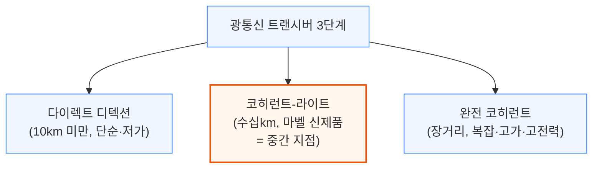

완전 코히런트는 저손실 특성의 C밴드 파장을 쓰지만, 장거리에서는 분산(신호가 퍼지는 현상)이 커서 무거운 DSP 처리가 필요합니다. 데이터센터 캠퍼스 정도의 짧은 거리에는 이런 장거리용 성능이 과할 때가 많습니다. 코히런트-라이트는 대신 짧은 거리에서 분산이 거의 없는 O밴드 파장을 사용해 DSP 부담을 최소화합니다.

이 트랜시버는 400G 채널 2개로 구성된 DSP 기반 착탈식 모듈이며, 채널마다 X·Y축 이중편파 변조를 씁니다. 채널당 8비트(32개 성상점) 변조에 62.5GBd 신호 속도를 곱하면 약 400G 대역폭이 나옵니다.

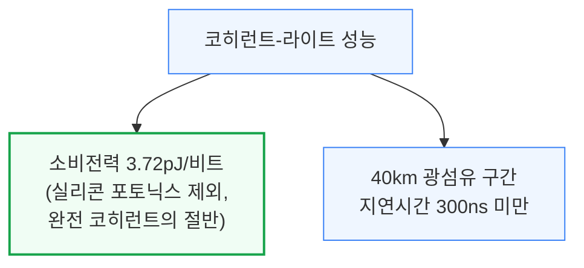

이런 변조 방식 자체는 업계에 새로운 것은 아니지만, 이번 발표로 데이터센터 캠퍼스처럼 더 짧은 링크 구간에도 정식으로 도입되는 계기가 마련됐습니다.

---

## 11. 브로드컴 6.4T 광학 엔진 (Paper 23.4)

**📌 핵심:**
- 브로드컴은 64개 레인(레인당 약 100G, PAM4 변조)으로 구성된 **6.4T 광학엔진(OE)**을 Tomahawk 5 51.2T CPO 시스템에서 실증 — 하나의 CPO 패키지에 6.4T 광학엔진 8개가 들어감
- 각 광학엔진은 광신호를 만드는 PIC(광집적회로)와 이를 제어하는 EIC(전기집적회로)로 구성되며, TSMC N7 공정으로 제작
- 엔비디아가 COUPE 방식을 쓰는 것과 달리, 이번 세대 광학엔진은 **팬아웃 웨이퍼레벨 패키징** 방식을 사용 — 브로드컴도 향후 세대에는 COUPE로 전환할 예정이나 구형 제품군은 기존 공급망을 유지
- 결론: 51.2T급 스위치가 상용 CPO 시스템으로 실제 동작함을 보여준 사례로, 차세대 COUPE 전환 전까지 과도기적 공급망을 통해서도 초대형 스위치 대역폭을 구현할 수 있음을 입증

---

브로드컴은 64개 레인(레인당 약 100G, PAM4 변조)으로 구성된 6.4T 광학엔진을 Tomahawk 5 51.2T CPO 스위치 시스템에서 시연했습니다. 하나의 CPO 패키지에는 이런 6.4T 광학엔진이 8개 들어가며, 각 엔진은 광신호를 만드는 PIC(광집적회로)와 이를 제어하는 EIC(전기집적회로)를 TSMC N7 공정으로 함께 구성합니다.

```mermaid
flowchart TD
    BC["브로드컴 Tomahawk 5<br/>51.2T CPO 스위치"] --> OE["6.4T 광학엔진 × 8개"]
    OE --> Lane["레인 64개<br/>(레인당 약 100G, PAM4)"]
    OE --> Pack["팬아웃 웨이퍼레벨<br/>패키징 방식 사용<br/>(엔비디아 COUPE와 다른 방식)"]

    classDef default fill:#eff6ff,stroke:#3b82f6,stroke-width:1px;
```

엔비디아가 COUPE 패키징 방식을 채택한 것과 달리, 이번 세대 광학엔진은 팬아웃 웨이퍼레벨 패키징을 사용합니다. 브로드컴도 향후 COUPE로 전환할 예정이지만, 이번처럼 이전 세대 제품은 기존 공급망 파트너를 그대로 활용합니다. 이 시연은 51.2T급 스위치가 상용 CPO 시스템에서 실제로 작동함을 보여준 사례로, COUPE 전환 이전에도 과도기적 공급망으로 초대형 스위치 대역폭을 구현할 수 있음을 입증했습니다.

---

## 12. 인텔 UCIe-S 다이간 인터커넥트 (Paper 8.1)

**📌 핵심:**
- 인텔은 22나노 공정에 만든 UCIe-S(업계 표준 다이간 연결 규격) 호환 인터커넥트로 16개 레인에서 레인당 **최대 48Gb/s**(표준), 자체 프로토콜로는 **56Gb/s**까지 달성 — 일반 기판(유기 패키지)에서 최대 30mm 거리 지원
- VLSI 2025에서 케이던스가 N3E(첨단 공정) 기반으로 시연한 UCIe-S보다, 인텔은 **더 오래된 22나노 공정**임에도 데이터 속도·채널 길이·배선당 대역폭에서 앞섰고, 에너지 효율에서만 뒤처짐
- 이 인터커넥트는 차세대 인텔 다이아몬드 래피즈 제온 서버 CPU의 프로토타입으로 추정 — 인텔3 공정으로 옮기면 효율이 훨씬 좋아질 전망이며, 기존 EMIB 첨단 패키징을 대체해 표준 기판으로도 다이 간 장거리 배선을 연결할 후보로 거론
- 결론: 오래된 공정으로도 최신 공정 경쟁자를 능가하는 결과는 다이간 연결 성능이 공정 미세화보다 회로 설계 최적화에 더 좌우될 수 있음을 시사

---

인텔이 공개한 UCIe-S(칩렛 간 표준 연결 규격) 호환 다이간(D2D) 인터페이스는 16개 레인에서 표준 프로토콜 기준 레인당 최대 48Gb/s, 자체 프로토콜로는 56Gb/s까지 도달합니다. 일반 유기 기판에서 최대 30mm 거리까지 지원하며, 흥미롭게도 22나노라는 오래된 공정으로 제작됐습니다.

```mermaid
flowchart TD
    Compare["UCIe-S 다이간 인터커넥트 비교"] --> Cadence["케이던스(VLSI 2025)<br/>N3E 첨단 공정"]
    Compare --> Intel["인텔(ISSCC 2026)<br/>22나노 구형 공정"]
    Intel --> Win["데이터 속도·채널 길이·<br/>배선당 대역폭 모두 앞섬<br/>(에너지 효율만 열세)"]

    classDef default fill:#eff6ff,stroke:#3b82f6,stroke-width:1px;
    classDef success fill:#f0fdf4,stroke:#16a34a,stroke-width:2px;
    class Win success;
```

이 인터커넥트는 차세대 인텔 다이아몬드 래피즈 제온 서버 CPU의 프로토타입으로 추정됩니다. 다이아몬드 래피즈는 IMH 다이 2개와 CBB 다이 4개로 구성되는데, CBB 다이에서 양쪽 IMH 다이까지 배선이 길게 이어져야 해, 이 인터커넥트가 표준 패키지 기판만으로 다이들을 연결해 기존 EMIB(첨단 패키징 기술) 없이도 다이 간 장거리 배선을 대체할 후보로 거론됩니다. 22나노 시험칩보다 실제 인텔3 공정으로 옮기면 효율이 훨씬 좋아질 것으로 예상됩니다.

---

## 13. TSMC 액티브 LSI (Paper 8.2)

**📌 핵심:**
- TSMC 첨단 패키징 사업부는 기존 CoWoS-L·EMIB 대비 신호 품질을 높이고 상위 다이의 PHY·SerDes 회로 부담을 줄이는 **액티브 LSI(aLSI)**를 공개 — 신호 품질 개선 덕에 범프 간격을 45㎛에서 **38.8㎛로 축소**, PHY 깊이도 1043㎛에서 850㎛로 줄여 그만큼 연산·메모리·입출력에 면적을 재배분 가능
- '액티브'라는 이름은 브릿지 다이 내부의 수동 배선을 **능동 트랜지스터 회로(ETT, 엣지 트리거 트랜시버)**로 대체했기 때문 — 신호를 증폭해 장거리에서도 품질을 유지하면서, 추가 에너지 비용은 비트당 겨우 0.07pJ에 불과
- 실증 패키지는 AMD MI450 GPU 설계와 흡사한 구성(SoC 다이 2개 + IO 다이 2개, HBM4 스택 12개)으로 확인됐으며, 총 소비전력은 0.75V에서 비트당 0.36pJ(이 중 ETT가 0.07pJ)
- 결론: AI 가속기가 점점 더 좁은 다이 면적을 두고 연산·메모리·연결 회로가 경쟁하는 상황에서, 신호 조절 회로를 상위 다이에서 브릿지 다이로 옮기는 aLSI 같은 접근이 차세대 다이간 연결의 표준 방향으로 자리잡을 전망

---

TSMC의 액티브 LSI(aLSI)는 기존 CoWoS-L·EMIB 방식보다 신호 품질(시그널 인티그리티)을 높여, 상위 다이(SoC)의 PHY·SerDes 회로 부담을 줄이는 것이 핵심입니다. 실증 칩은 32Gb/s UCIe 유사 방식 트랜시버를 사용했으며, 신호 품질이 좋아진 덕에 범프(연결 접점) 간격을 45㎛에서 38.8㎛로 줄이고 배선 격자를 맨해튼 그리드로 바꿔 PHY 깊이를 1043㎛에서 850㎛로 축소했습니다. 이렇게 아낀 면적은 연산·메모리·입출력에 재배분하거나 다이 크기 자체를 줄이는 데 쓸 수 있습니다.

```mermaid
flowchart TD
    Old["기존 CoWoS-L/EMIB<br/>(수동 배선 브릿지 다이)"] --> Problem["장거리 신호 품질 저하<br/>→ 상위 다이가 PHY·SerDes를<br/>크게 만들어 보완해야 함"]
    Problem --> aLSI["TSMC 액티브 LSI(aLSI)<br/>브릿지 다이에 능동 회로(ETT) 추가<br/>→ 신호를 브릿지에서 증폭"]
    aLSI --> Result["범프 간격 45→38.8㎛<br/>PHY 깊이 1043→850㎛<br/>절약 면적을 연산·메모리에 재배분"]

    classDef default fill:#eff6ff,stroke:#3b82f6,stroke-width:1px;
    classDef success fill:#f0fdf4,stroke:#16a34a,stroke-width:2px;
    class Result success;
```

'액티브'라는 이름의 유래인 ETT(Edge-Triggered Transceiver, 엣지 트리거 트랜시버)는 드라이버, AC 커플링 커패시터(Cac), 양·음 피드백을 모두 쓰는 증폭기로 구성됩니다. 신호가 Cac를 통과할 때 전환 지점(엣지)에서 피크가 생기고, 이를 듀얼루프 증폭기가 감지해 전압을 안정시킵니다. 이 능동 회로를 추가해도 에너지 비용은 비트당 0.07pJ만 늘어나, 적층된 다이에서 발열 부담을 최소화합니다.

```mermaid
flowchart TD
    Test["TSMC aLSI 실증 패키지"] --> Struct["SoC 다이 2개 + IO 다이 2개<br/>+ HBM4 스택 12개<br/>(AMD MI450 GPU와 유사한 구성)"]
    Struct --> Share["HBM4 스택 2개가<br/>액티브 LSI 1개를 공유"]
    Struct --> Power["총 소비전력 0.36pJ/비트<br/>(0.75V, 이 중 ETT가 0.07pJ)"]

    classDef default fill:#eff6ff,stroke:#3b82f6,stroke-width:1px;
```

또한 브릿지 다이 전면부에 임베디드 딥트렌치 커패시터(eDTC)를 통합해 PHY·D2D 컨트롤러로 가는 전력 공급을 개선했습니다. 테스트 방식도 3단계로 나눠, 다이 자체 검증(KGD), 스택 기능 검증(KGS), 전체 조립 후 종합 검증(KGP)을 순서대로 거치며, KGD·KGP 단계 모두에서 0.75V·32Gb/s, 0.95V·38.4Gb/s를 기록했습니다. 다른 다이간 연결 방식과 비교해도 배선당 대역폭·에너지 효율 모두 우수한 결과를 냈습니다.

**📌 용어 풀이: 브릿지 다이와 범프 피치**
> - **브릿지 다이**: 두 개의 큰 칩(다이) 사이에 끼워 넣어 배선을 정리하고 신호를 전달하는 작은 중계용 칩
> - **범프 피치 (Bump Pitch)**: 칩과 칩, 혹은 칩과 기판을 연결하는 미세한 금속 돌기(범프) 사이의 간격 — 좁을수록 같은 면적에 더 많은 배선을 넣을 수 있음

---

## 14. 마이크로소프트 D2D 인터커넥트 (Paper 8.3)

**📌 핵심:**
- 마이크로소프트는 다이 2개와 D2D(다이간) 노드 2쌍으로 구성된 시험용 인터커넥트를 공개, 클럭게이팅·크로스토크(신호 간섭)까지 실제와 동일하게 재현한 전력망·배선을 함께 구현
- TSMC N3P 공정에서 배선 폭 532㎛·PHY 깊이 1350㎛로 제작, **20Gb/s(0.65V)와 24Gb/s(0.75V)** 두 속도에서 테스트
- 시스템 전체 전력(아날로그+디지털)과 아날로그 전력만 따로 측정해 공개 — 24Gb/s에서 시스템 전력 0.33pJ/비트, 아날로그 전력 0.226pJ/비트 (대부분의 경쟁사는 아날로그 전력만 발표)
- 결론: 이 인터커넥트는 마이크로소프트 코발트 200 CPU에 탑재된 것으로 추정되는 컴퓨트 칩렛 2개 간 고대역폭 연결과 사실상 동일한 것으로 파악됨

---

마이크로소프트가 공개한 D2D(다이간) 인터커넥트 시험용 칩은 다이 2개와 D2D 노드 2쌍으로 구성되며, 클럭게이팅과 크로스토크(신호 간섭)까지 실제 환경과 동일하게 재현한 전력망·배선을 포함합니다. TSMC N3P 공정으로 제작됐고, 배선 폭 532㎛·PHY 깊이 1350㎛ 규모입니다.

```mermaid
flowchart TD
    MS["마이크로소프트 D2D<br/>시험용 인터커넥트"] --> Spec["TSMC N3P 공정<br/>배선 폭 532㎛, 깊이 1350㎛"]
    MS --> Rate["두 속도로 테스트<br/>20Gb/s(0.65V) / 24Gb/s(0.75V)"]

    classDef default fill:#eff6ff,stroke:#3b82f6,stroke-width:1px;
```

마이크로소프트는 시스템 전체 전력(아날로그+디지털 회로 포함)과 아날로그 회로만의 전력, 두 수치를 함께 공개했습니다. 대부분의 경쟁사는 아날로그 전력만 발표하는 관행과 비교됩니다.

```mermaid
flowchart TD
    Power["전력 측정 결과"] --> R24["24Gb/s: 시스템 0.33pJ/b<br/>아날로그만 0.226pJ/b"]
    Power --> R20["20Gb/s: 시스템 0.25pJ/b<br/>아날로그만 0.17pJ/b"]
    Power --> Idle["대기 상태: 0.05pJ/b"]

    classDef default fill:#eff6ff,stroke:#3b82f6,stroke-width:1px;
```

이 인터커넥트는 TSMC 액티브 LSI와 동일한 선행 연구를 비교 대상으로 삼았으며, 이전 리포트에서 다룬 마이크로소프트 코발트 200 CPU의 컴퓨트 칩렛 2개를 잇는 고대역폭 연결과 사실상 같은 것으로 파악됩니다.

---

## 15. 미디어텍 디멘시티 9500 (Paper 10.2)

**📌 핵심:**
- 매년 모바일 CPU의 다른 측면을 공개해온 미디어텍은 올해 **부스트 성능과 발열 관리**에 초점, TSMC N3E/N3P의 두 가지 컨택트 게이트 피치(CGP, 트랜지스터 간격) 옵션 중 더 넓은 **54nm CGP**를 고성능 코어(C1 Ultra)에 채택
- 대부분의 칩이 다이 면적을 더 줄일 수 있는 좁은 48nm CGP를 쓰는 것과 달리, 미디어텍은 넓은 54nm CGP로 누설전류·라우팅·제조 문제를 피하고 전력효율을 높여 **동일 누설전류에서 성능 4.6% 향상**(또는 동일 성능에서 전력 3% 절감)을 달성
- 사용하지 않는 노화 여유분(에이징 버짓)을 활용하고 열 오버슛을 줄이는 동적 최적화로 부스트 클럭을 **4.21GHz에서 4.4GHz로** 상향
- 결론: 최신 공정이라고 항상 더 좁은 트랜지스터 간격이 정답은 아니며, 용도(고성능 코어 vs 저전력 코어)에 맞춰 공정 옵션을 다르게 선택하는 것이 실제 성능에 더 크게 기여할 수 있음을 보여준 사례

---

TSMC의 N3E·N3P 공정은 컨택트 게이트 피치(CGP, 트랜지스터 사이의 최소 간격) 옵션을 48nm와 54nm 두 가지로 제공합니다. 대부분의 칩은 셀 크기를 줄여 다이를 더 작게 만들 수 있는 좁은 48nm를 쓰지만, 이 경우 누설전류·배선·제조 난이도 문제가 함께 따라옵니다.

```mermaid
flowchart TD
    CGP["TSMC N3E/N3P<br/>CGP(트랜지스터 간격) 옵션"] --> Narrow["48nm(좁음)<br/>대부분 칩이 채택<br/>다이 축소에 유리, 누설전류 문제"]
    CGP --> Wide["54nm(넓음)<br/>미디어텍 C1 Ultra 코어 채택<br/>전력효율 우선"]
    Wide --> Gain["동일 누설전류에서<br/>성능 4.6% 향상<br/>(또는 동일 성능에서 전력 3%↓)"]

    classDef default fill:#eff6ff,stroke:#3b82f6,stroke-width:1px;
    classDef success fill:#f0fdf4,stroke:#16a34a,stroke-width:2px;
    class Gain success;
```

미디어텍은 사용하지 않는 노화 여유분(에이징 버짓, 칩이 노후화에 대비해 남겨둔 성능 마진)을 활용하고 열 오버슛(순간적인 과열)을 줄이는 동적 최적화로 부스트 클럭을 4.21GHz에서 4.4GHz로 끌어올렸습니다. 최신 공정이라도 항상 더 좁은 트랜지스터 간격이 정답은 아니며, 고성능 코어처럼 발열·전력이 중요한 용도에는 넓은 CGP를 선택하는 것이 오히려 유리할 수 있음을 보여준 사례입니다.

---

## 16. 인텔 18A-on-인텔3 하이브리드 본딩 (Paper 10.6)

**📌 핵심:**
- 인텔은 첫 하이브리드 본딩 칩 **M3DProc**를 공개 — 인텔3 공정 하단 다이와 18A 공정 상단 다이를 **9마이크로미터 간격의 Foveros Direct** 방식으로 접합, 각 다이에 메시 타일 56개(코어·DNN 가속기 타일)를 배치
- 3D 메시 구조(14×4×2)가 지연시간을 줄이고 처리량을 거의 **40% 향상**시켰으며, 다이 간 데이터 전송 시 하이브리드 본딩 인터커넥트(HBI)로 인한 효율 손실은 무시할 수준
- 3D 대역폭은 **875GB/s**로, 같은 패키징 계열인 클리어워터 포레스트(CWF, L2·L3 캐시만 분리한 구조)의 컴퓨트 다이당 210GB/s보다 훨씬 높음 — M3DProc는 56개 수직 연결로 이를 분산해 연결당 15.6GB/s를 훨씬 작은 면적으로 구현
- 결론: M3DProc는 클리어워터 포레스트보다 더 넓은 범위(코어+가속기 타일 전체)를 수직으로 통합해, 하이브리드 본딩이 캐시 분리를 넘어 연산 코어 자체의 3차원 적층으로 확장될 수 있음을 실증

---

인텔이 공개한 M3DProc는 인텔의 첫 하이브리드 본딩(범프 없이 구리 면끼리 직접 접합) 칩입니다. 인텔3 공정으로 만든 하단 다이와 18A 공정으로 만든 상단 다이를 9마이크로미터 간격의 Foveros Direct 방식으로 접합했으며, 각 다이에는 코어·DNN 가속기 타일을 포함해 메시 타일 56개가 배치됩니다.

```mermaid
flowchart TD
    M3D["M3DProc<br/>(인텔 첫 하이브리드 본딩 칩)"] --> Bottom["하단 다이: 인텔3 공정<br/>메시 타일 56개"]
    M3D --> Top["상단 다이: 18A 공정<br/>메시 타일 56개"]
    Top --> Bond["9㎛ 간격<br/>Foveros Direct 접합<br/>(SRAM 양쪽 다이 공유)"]

    classDef default fill:#eff6ff,stroke:#3b82f6,stroke-width:1px;
```

타일들은 14×4×2 형태의 3D 메시로 배치되며, 이 구조 덕분에 지연시간이 줄고 처리량이 거의 40% 늘었습니다. 인텔은 2D(하단 다이 내부 56개 타일 간 이동)와 3D(양쪽 다이에 걸친 인접 타일 28개 간 이동)의 에너지 효율도 비교했는데, 하이브리드 본딩 인터커넥트(HBI)로 인한 효율 손실은 무시할 수 있는 수준이었습니다.

```mermaid
flowchart TD
    Compare["3D 대역폭 비교"] --> M3DP["M3DProc: 875GB/s<br/>(56개 수직 연결, 연결당 15.6GB/s)"]
    Compare --> CWF["클리어워터 포레스트(CWF)<br/>컴퓨트 다이당 210GB/s<br/>(L2/L3 캐시만 분리, 6클러스터×35GB/s)"]

    classDef default fill:#eff6ff,stroke:#3b82f6,stroke-width:1px;
    classDef success fill:#f0fdf4,stroke:#16a34a,stroke-width:2px;
    class M3DP success;
```

패키징 방식은 클리어워터 포레스트(CWF)와 유사합니다. CWF는 인텔3 베이스 다이 위에 18A 컴퓨트 다이를 9㎛ Foveros Direct로 접합하지만, CPU 코어 클러스터의 L2 캐시만 L3에서 분리하는 데 그칩니다. 반면 M3DProc는 코어·가속기 타일 전체를 수직으로 통합해, 하이브리드 본딩이 캐시 분리를 넘어 연산 코어 자체의 3차원 적층으로 확장될 수 있음을 보여줍니다.

---

## 17. AMD MI355X (Paper 2.1)

**📌 핵심:**
- AMD는 MI300X 대비 MI355X에서 CU(연산 유닛)당 행렬 연산 처리량을 **2배**로 늘리면서도 전체 면적과 CU 개수는 거의 그대로 유지 — 핵심은 N5에서 **N3P 공정**으로 전환한 것과 자체 설계 표준 셀 적용
- N3P가 제공하는 금속배선층 2개 추가로 배선·셀 활용도가 개선됐고, EPYC 베르가모(Zen 4c)에 썼던 것과 같은 조밀 배치 알고리즘도 적용
- FP16·FP8·MXFP4 등 다양한 데이터 형식을 계산할 때 회로를 공유(저비용·저최적화)할지 형식별로 별도 회로(고성능·고면적)를 둘지의 트레이드오프에서 절충안을 최적화하는 데 공을 들임
- 결론: IO 다이를 4개에서 **2개로 통합**해 다이간 배선 면적을 절약하고 지연시간을 줄였으며, 절약한 전력을 연산 다이에 재배분 — 배선 자체도 새로 설계해 인터커넥트 전력을 약 **20% 절감**

---

AMD는 CU(연산 유닛)당 행렬 연산 처리량을 MI300X 대비 2배로 늘리면서도, 전체 면적과 CU 개수는 거의 그대로 유지했습니다. 핵심 동력은 N5에서 N3P로의 공정 전환과 AMD 자체 설계 표준 셀입니다.

```mermaid
flowchart TD
    MI355["MI355X vs MI300X<br/>CU당 행렬 연산 2배"] --> Node["N5 → N3P 공정 전환<br/>(금속배선층 2개 추가)"]
    MI355 --> Cell["AMD 자체 표준 셀 설계<br/>+ 조밀 배치 알고리즘<br/>(EPYC 베르가모 Zen 4c와 동일 기법)"]

    classDef default fill:#eff6ff,stroke:#3b82f6,stroke-width:1px;
    classDef success fill:#f0fdf4,stroke:#16a34a,stroke-width:2px;
    class Node success;
```

FP16·FP8·MXFP4 등 다양한 데이터 형식을 계산할 때는 모든 형식이 같은 회로를 공유하게 하면 형식별 최적화가 부족해 전력 손해를 보고, 반대로 형식마다 완전히 별도 회로를 두면 면적이 크게 늘어나는 트레이드오프가 있습니다. AMD는 이 중간 지점을 찾는 데 공을 들였고, N3P 공정 자체의 성능 향상 외에도 순수 설계 개선만으로 동일 전력 기준 주파수를 5% 높였습니다.

MI300X는 IO 다이 4개로 구성됐지만, MI355X는 이를 2개로 통합했습니다.

```mermaid
flowchart TD
    IOD["IO 다이 통합"] --> Old["MI300X: IO 다이 4개"]
    IOD --> New["MI355X: IO 다이 2개"]
    New --> Benefit["다이간 배선 면적 절약<br/>+ 지연시간 감소<br/>+ HBM 인터커넥트 폭 확대로 효율 개선"]
    Benefit --> Realloc["절약한 전력을<br/>연산 다이 성능으로 재배분"]

    classDef default fill:#eff6ff,stroke:#3b82f6,stroke-width:1px;
    classDef success fill:#f0fdf4,stroke:#16a34a,stroke-width:2px;
    class Realloc success;
```

큰 단일 다이 안에서는 어느 두 지점을 연결하든 다양한 배선 경로가 존재하는데, AMD는 배선 자체를 새로 설계해 인터커넥트 전력 소모를 약 20% 줄였습니다.

---

## 18. 리벨리온스 Rebel100 (Paper 2.2)

**📌 핵심:**
- 한국 스타트업 리벨리온스는 AI 가속기 **Rebel100**의 아키텍처를 최초 공개 — 대부분의 경쟁사가 TSMC를 쓰는 것과 달리 **삼성 파운드리 SF4X 공정**을 선택, 엔비디아·AMD·브로드컴 등이 TSMC 물량을 대거 선점한 상황에서 유연성을 확보
- 첨단 패키징은 삼성의 **I-CubeS 인터포저** 기술을 사용(Hot Chips 2025 자료에는 TSMC CoWoS-S로 잘못 표기됐던 것을 이번에 정정) — I-CubeS는 지금까지 주요 AI 가속기에 채택된 적 없는 기술로, 삼성이 HBM 공급과 묶어 채택을 유도했을 가능성 존재
- 연산 다이 4개 + HBM3E 스택 4개 구성, 각 다이는 UCIe-A 인터페이스 3개 중 2개만 16Gb/s로 사용 중이며 나머지 1개는 향후 이더넷 기반 스케일업용 IO·메모리 칩렛 확장에 쓰일 예정(IO 칩렛은 2026년 1분기 테이프아웃 예정)
- 결론: I-CubeS 채택 사례가 eSilicon·바이두·엔비디아(2023년 H200 일부 물량)·리벨리온스·Preferred Networks(예정) 등 총 5곳에 불과했던 만큼, 리벨리온스의 채택은 삼성이 이 기술로 시장에 진입하려는 시도로도 해석 가능

---

리벨리온스는 한국의 AI 가속기 스타트업으로, 이번 학회에서 신제품 Rebel100의 아키텍처를 처음 공개했습니다. 대부분의 AI 가속기가 TSMC에서 생산되는 것과 달리, 리벨리온스는 삼성 파운드리의 SF4X 공정을 선택했습니다. 엔비디아·AMD·브로드컴 등이 TSMC 첨단 공정 물량 대부분을 가져가는 상황에서, 삼성 파운드리는 상대적으로 유연한 공급 옵션을 제공합니다.

```mermaid
flowchart TD
    Rebel["리벨리온스 Rebel100"] --> Foundry["삼성 파운드리 SF4X 공정<br/>(TSMC 물량 경쟁 회피)"]
    Rebel --> Pack["삼성 I-CubeS 인터포저<br/>(Hot Chips 2025의 CoWoS-S 표기는 오류)"]
    Pack --> Rare["I-CubeS 채택 사례<br/>총 5곳뿐<br/>(eSilicon·바이두·엔비디아 일부·<br/>리벨리온스·Preferred Networks 예정)"]

    classDef default fill:#eff6ff,stroke:#3b82f6,stroke-width:1px;
    classDef highlight fill:#fff7ed,stroke:#ea580c,stroke-width:2px;
    class Rare highlight;
```

삼성이 SF4X 파운드리 공정에 I-CubeS 패키징까지 묶어 파격적인 할인을 제공했거나, HBM 공급 조건으로 I-CubeS 채택을 유도했을 가능성이 있습니다. I-CubeS는 지금까지 어떤 주요 AI 가속기에도 채택된 적이 없어, 이번 채택이 삼성의 시장 진입 시도로도 해석됩니다.

Rebel100은 연산 다이 4개와 HBM3E 스택 4개로 구성됩니다. 각 다이는 UCIe-A 인터페이스 3개를 갖지만 실제로는 2개만 16Gb/s로 가동 중이며, 나머지 1개는 이더넷 기반 스케일업 확장용 IO·메모리 칩렛을 위해 남겨뒀습니다.

```mermaid
flowchart TD
    Config["Rebel100 구성"] --> Compute["연산 다이 4개<br/>+ HBM3E 스택 4개"]
    Config --> UCIe["UCIe-A 인터페이스<br/>다이당 3개 중 2개만 가동(16Gb/s)"]
    UCIe --> Future["나머지 1개는<br/>향후 IO·메모리 칩렛 확장용<br/>(IO 칩렛 2026년 1분기 테이프아웃 예정)"]

    classDef default fill:#eff6ff,stroke:#3b82f6,stroke-width:1px;
```

전력 품질을 높이기 위해 각 HBM3E 스택 옆에 실리콘 커패시터를 추가로 통합했습니다.

---

*작성 진행률: 약 90% 완료 (1~18장 작성)*
*업데이트: 인텔 18A 하이브리드 본딩, AMD MI355X, 리벨리온스 Rebel100 섹션 작성*
