# ISSCC 2026 Roundup: NVIDIA & Broadcom CPO, HBM4 & LPDDR6, TSMC Active LSI, Logic-Based SRAM, UCIe-S and More

> **출처**: [https://newsletter.semianalysis.com/p/isscc-2026-nvidia-and-broadcom-cpo](https://newsletter.semianalysis.com/p/isscc-2026-nvidia-and-broadcom-cpo)
> **저자**: Dylan Patel
> **발행일**: 2026-04-16

📑 목차
 1. [ISSCC 2026 총정리 개요](#1-isscc-2026-총정리-개요)
 2. [삼성 HBM4 (Paper 15.6)](#2-삼성-hbm4-paper-156)
 3. [삼성 LPDDR6과 SF2 PHY (Paper 15.8, 37.3)](#3-삼성-lpddr6과-sf2-phy-paper-158-373)
 4. [SK하이닉스 1c LPDDR6과 GDDR7 (Paper 15.7, 15.9)](#4-sk하이닉스-1c-lpddr6과-gddr7-paper-157-159)
 5. [삼성 4F² COP D램 (Paper 15.10)](#5-삼성-4f²-cop-d램-paper-1510)
 6. [샌디스크·키오시아 BiCS10 낸드 (Paper 15.1)](#6-샌디스크키오시아-bics10-낸드-paper-151)
 7. [미디어텍 xBIT 로직 기반 비트셀 (Paper 15.2)](#7-미디어텍-xbit-로직-기반-비트셀-paper-152)
 8. [TSMC N16 MRAM (Paper 15.4)](#8-tsmc-n16-mram-paper-154)
 9. [엔비디아 DWDM과 CPO 스케일업 (Paper 23.1)](#9-엔비디아-dwdm과-cpo-스케일업-paper-231)
10. [마벨 코히런트-라이트 트랜시버 (Paper 23.2)](#10-마벨-코히런트-라이트-트랜시버-paper-232)
11. [브로드컴 6.4T 광학 엔진 (Paper 23.4)](#11-브로드컴-64t-광학-엔진-paper-234)
12. [인텔 UCIe-S 다이간 인터커넥트 (Paper 8.1)](#12-인텔-ucie-s-다이간-인터커넥트-paper-81)
13. [TSMC 액티브 LSI (Paper 8.2)](#13-tsmc-액티브-lsi-paper-82)
14. [마이크로소프트 D2D 인터커넥트 (Paper 8.3)](#14-마이크로소프트-d2d-인터커넥트-paper-83)
15. [미디어텍 디멘시티 9500 (Paper 10.2)](#15-미디어텍-디멘시티-9500-paper-102)
16. [인텔 18A-on-인텔3 하이브리드 본딩 (Paper 10.6)](#16-인텔-18a-on-인텔3-하이브리드-본딩-paper-106)
17. [AMD MI355X (Paper 2.1)](#17-amd-mi355x-paper-21)
18. [리벨리온스 Rebel100 (Paper 2.2)](#18-리벨리온스-rebel100-paper-22)
19. [마이크로소프트 마이아 200 (Paper 17.4)](#19-마이크로소프트-마이아-200-paper-174)
20. [삼성 SF2 온도 센서 (Paper 21.5)](#20-삼성-sf2-온도-센서-paper-215)

🔑 용어 정리
- **HBM4 (5세대 고대역폭 메모리)**: DRAM을 여러 층 쌓아 GPU 옆에 붙이는 AI 전용 메모리의 최신 세대 — 이번 세대부터 맨 아래층(베이스 다이)을 DRAM 공정이 아니라 로직(연산칩) 공정으로 만드는 것이 핵심 변화
- **LPDDR6**: 스마트폰 등 모바일 기기에 쓰는 저전력 DRAM의 차세대 표준 — 속도를 크게 높이면서도 배터리 소모를 줄이는 데 초점
- **GDDR7**: 게임용 그래픽카드에 주로 쓰이는 고속 메모리 — HBM보다 저렴하지만 용량과 밀도는 더 낮음
- **CPO (Co-Packaged Optics, 광학엔진 동일패키지 통합)**: 빛(광신호)으로 데이터를 주고받는 광통신 부품을 반도체 칩과 한 패키지 안에 붙여, 전기 신호보다 더 멀리, 더 적은 전력으로 데이터를 보내는 기술
- **하이브리드 본딩 (Hybrid Bonding)**: 칩과 칩을 쌓을 때 금속 돌기(범프) 없이 구리 면끼리 직접 붙이는 차세대 적층 기술 — 더 촘촘하게 쌓을 수 있지만 수율 확보가 어려움
- **UCIe-S (Universal Chiplet Interconnect Express - Standard)**: 서로 다른 회사가 만든 칩(다이)들을 하나의 패키지 안에서 표준화된 방식으로 연결하는 업계 공통 규격
- **D2D 인터커넥트 (Die-to-Die Interconnect, 다이간 인터커넥트)**: 한 패키지 안에 여러 개로 쪼갠 칩(다이)들이 서로 데이터를 주고받는 통로 — AI 가속기가 칩 하나로 안 만들고 여러 조각으로 쪼개면서 이 통로의 성능이 전체 칩 성능을 좌우하게 됨
- **MRAM (Magnetic RAM, 자기저항 메모리)**: 전원이 꺼져도 데이터가 남아있는 비휘발성 메모리 — 자동차·산업용처럼 안정성이 최우선인 곳에 주로 사용

---

## 1. ISSCC 2026 총정리 개요

**📌 핵심:**
- 매년 열리는 3대 반도체 학회(IEDM, VLSI, ISSCC) 중 마지막인 ISSCC 2026은 회로·측정 데이터 중심 발표가 특징이며, 올해는 유독 실제 산업 트렌드와 직결된 논문이 많았음
- 메모리(HBM4·LPDDR6·GDDR7·낸드·SRAM·MRAM), 인터커넥트(광통신 CPO + 다이간 전기 연결), 프로세서(모바일·서버·AI 가속기) 세 축으로 총 20개 발표를 정리
- 결론: 이번 학회는 "칩 하나를 어떻게 더 빠르게 만드나"보다 "여러 칩·여러 층을 어떻게 더 촘촘하고 저전력으로 연결하나"에 초점이 쏠려 있었음

---

ISSCC(International Solid-State Circuits Conference)는 매년 열리는 3대 반도체 학회 중 회로·집적 설계 비중이 가장 크고, 거의 모든 발표에 회로도와 실측 데이터가 함께 제시됩니다. 예년에는 산업 영향력이 들쭉날쭉했지만, 올해는 HBM4·LPDDR6·GDDR7·낸드부터 광학엔진 동일패키지 통합(CPO), 다이간 고속 연결, 미디어텍·AMD·엔비디아·마이크로소프트의 최신 프로세서까지 시장 흐름과 직결된 논문이 대거 발표됐습니다.

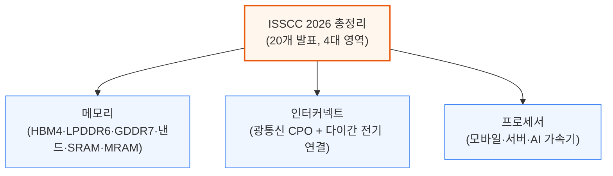

---

## 2. 삼성 HBM4 (Paper 15.6)

**📌 핵심:**
- 삼성전자는 3대 메모리 기업 중 유일하게 HBM4 기술 논문을 공개, 6세대 10나노급(1c) D램 코어 + SF4 로직 공정 베이스 다이로 **36GB, 12층 적층, 2048개 입출력 핀, 3.3TB/s 대역폭**을 시연
- 베이스 다이(HBM 스택 맨 아래 중계칩)를 D램 공정 대신 로직(연산칩) 공정으로 만든 것이 HBM3E 대비 가장 큰 구조 변화 — 전력 전압(VDDQ)이 1.1V에서 0.75V로 **32% 감소**
- 다만 1c D램 공정 자체는 2025년 한 해 수율이 **약 50%**에 그쳐 아직 불안정했고, SK하이닉스 대비 신뢰성·안정성은 여전히 뒤처짐
- 결론: 삼성 HBM4는 JEDEC 표준(핀당 6.4Gb/s, 약 2TB/s) 대비 **2배 이상의 핀 속도(13Gb/s, 3.3TB/s)**를 달성해 기술 격차를 좁히고 있으나, 수율·마진 리스크는 아직 해소되지 않음

---

HBM4에서 가장 큰 구조 변화는 코어 D램 다이와 베이스 다이의 공정을 분리한 것입니다. 이전 세대까지는 코어 다이와 베이스 다이 모두 같은 D램 공정으로 만들었지만, HBM4부터는 베이스 다이만 첨단 로직 공정(SF4)으로 제작합니다.

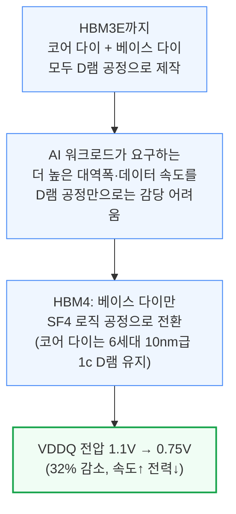

로직 공정 베이스 다이는 트랜지스터를 더 촘촘히 넣을 수 있고 배선층도 더 많이 쌓을 수 있어, D램 공정 베이스 다이보다 면적 효율이 좋습니다. 3대 메모리 기업의 베이스 다이 공정 선택은 서로 다릅니다.

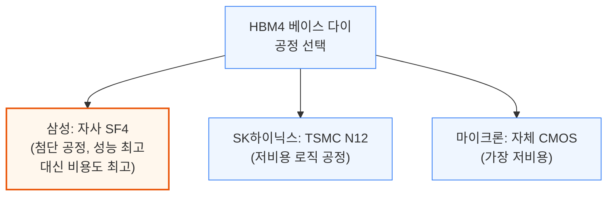

삼성은 코어 다이 TSV(층간 관통전극) 수를 4배로 늘리고, 적층 편차를 보정하는 적응형 바디 바이어스(ABB) 제어를 더해 최대 13Gb/s의 핀 속도를 달성했습니다. 또 하나의 난제는 tCCDR(서로 다른 스택ID 간 연속 읽기 명령 사이 최소 간격)로, 층수·채널 수가 16개에서 32개로 늘수록 층간 타이밍 편차가 누적돼 이 값이 나빠집니다.

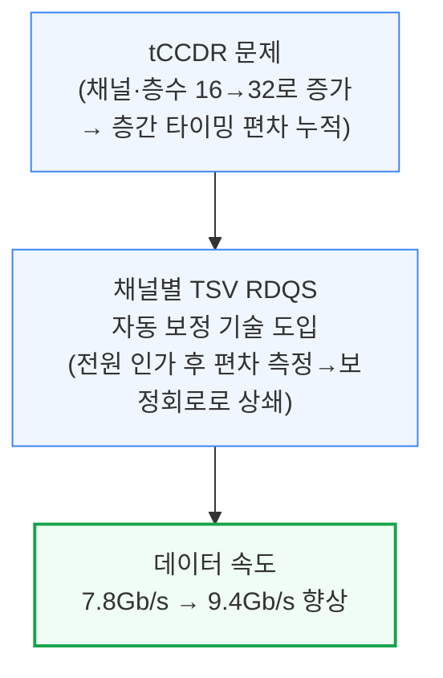

로직 베이스 다이 전환의 또 다른 성과는 PMBIST(프로그래머블 메모리 자체 테스트)입니다. HBM3E는 베이스 다이가 D램 공정이라 전력·면적 제약 때문에 정해진 소수의 테스트 패턴만 돌릴 수 있었지만, HBM4는 실제 시스템이 보내는 것과 동일한 JEDEC 명령 전체를 임의 시점에 풀 스피드로 실행할 수 있어 양산 수율 개선에 직접 도움이 됩니다.

**📌 용어 풀이: tCCDR과 TSV 타이밍 편차**
> - **tCCDR**: 서로 다른 스택ID(칩 내 논리적 구획)에서 연속으로 읽기 명령을 처리할 때 필요한 최소 대기시간 — 이 값이 짧을수록 병렬 접근 성능이 좋음
> - **타이밍 편차의 원인**: 여러 층을 쌓다 보면 층마다 제조 편차, TSV(관통전극)를 타고 가는 신호의 전달 속도 차이, 채널별 국소 편차가 겹쳐서 층·채널 간 신호 도착 시각이 조금씩 어긋남
> - **쉬운 비유**: 12층 건물의 각 층에서 엘리베이터가 1층에 도착하는 시간이 층마다 미묘하게 다른데, 이 편차를 자동으로 재고 보정해 모든 층이 동시에 도착한 것처럼 맞추는 것과 비슷

삼성 HBM4는 JEDEC 공식 표준(JESD270-4, 핀당 최대 6.4Gb/s, 약 2TB/s)을 2배 이상 웃도는 핀당 13Gb/s, 3.3TB/s 대역폭을 시연했습니다. VDDC/VDDQ를 1.05V/0.75V로 낮춰도 11.8Gb/s를 유지합니다. 다만 1c 전공정 자체가 까다로워 2025년 한 해 수율이 약 50%에 머물렀고(1b 노드를 건너뛰고 1a에서 바로 1c로 전환한 영향), 삼성 HBM은 역사적으로 SK하이닉스보다 마진이 낮았던 만큼 이 수율 리스크가 HBM4 마진에도 부담으로 작용할 수 있습니다.

---

## 3. 삼성 LPDDR6과 SF2 PHY (Paper 15.8, 37.3)

**📌 핵심:**
- 삼성과 SK하이닉스가 나란히 LPDDR6을 공개, 삼성은 다이 하나를 **2개 서브채널**로 나누고 안 쓰는 서브채널을 꺼서 전력을 아끼는 **효율 모드**를 채택 — 다만 이 구조 때문에 다이 면적의 약 5%를 주변회로가 추가로 차지
- 신호 방식은 GDDR7과 달리 PAM3가 아닌 **와이드 NRZ**(서브채널당 12개 핀, 버스트 길이 24)를 사용, 대역폭 계산 시 오류정정(ECC)·전력절감용 비트(DBI) 32개를 제외해야 함(예: 12.8Gb/s → 실효 34.1GB/s)
- 전력 도메인을 세분화해 **읽기 전력 27% 감소, 쓰기 전력 22% 감소**를 달성했고, SF2 공정으로 만든 별도 PHY 칩은 효율 모드에서 읽기 39%·쓰기 29% 절감, 클럭게이팅까지 더하면 최대 약 50% 절감
- 결론: 삼성 LPDDR6은 12.8~14.4Gb/s 구간에서 동작하지만 밀도(0.360Gb/mm²)가 기존 LPDDR5X 1b 공정(0.447Gb/mm²)보다 낮아, 아직 성숙하지 않은 1b 공정에서 만든 시제품으로 추정됨

---

LPDDR6은 다이 하나를 2개의 서브채널로 나누고, 각 서브채널에 16개 뱅크를 배치하는 구조입니다. 평소에는 두 서브채널을 모두 쓰는 일반 모드로 동작하지만, 절전이 필요할 때는 보조 서브채널의 전원을 끄고 주 서브채널이 32개 뱅크를 전부 제어하는 효율 모드로 전환할 수 있습니다. 다만 이 경우 보조 서브채널 접근 시 지연시간이 늘어나는 손해가 있습니다.

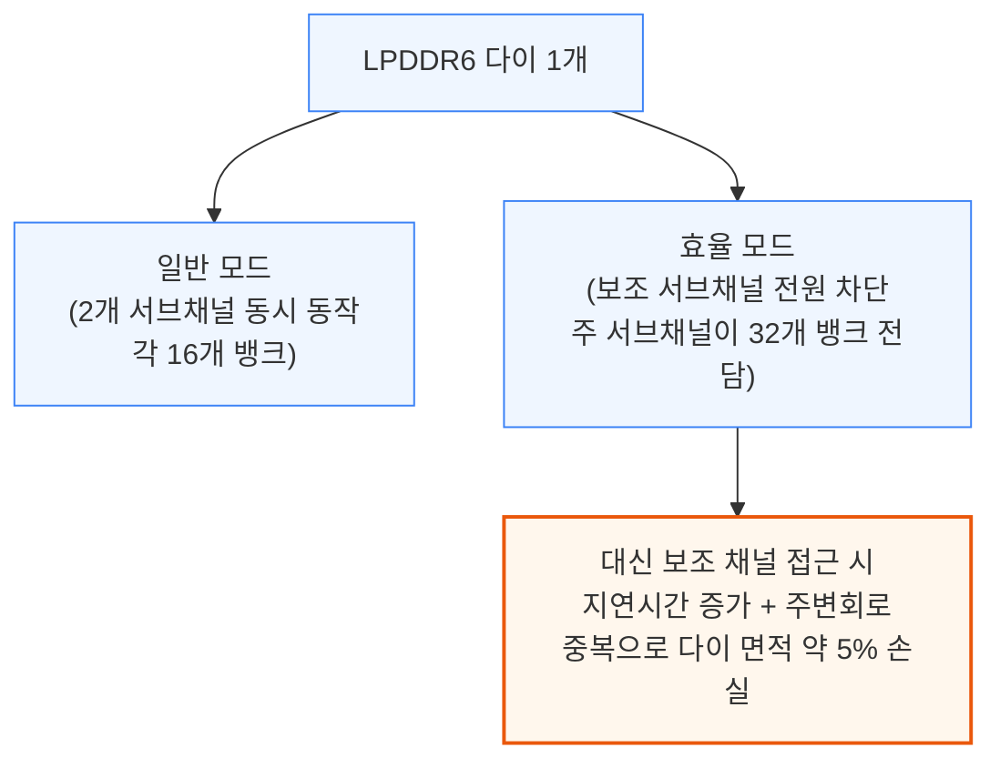

신호 방식은 GDDR7의 PAM3(한 신호에 여러 값을 실어 보내는 방식)와 달리, LPDDR6은 일반 NRZ(신호를 0/1 두 값으로만 보내는 가장 단순한 방식)로는 여유(eye margin)가 부족해 서브채널당 12개 핀, 버스트 길이 24를 쓰는 "와이드 NRZ"를 사용합니다.

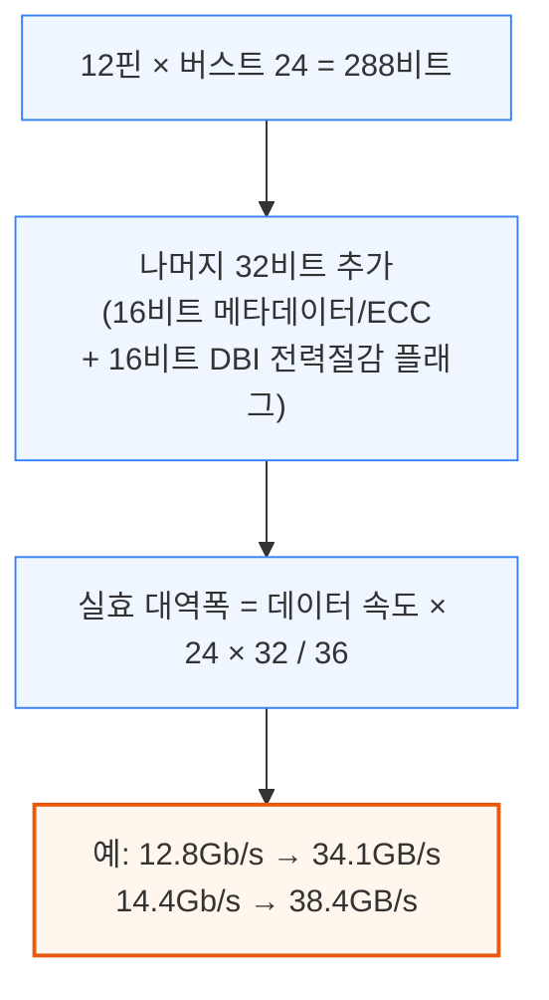

**📌 용어 풀이: DBI (Data Bus Inversion, 데이터 버스 반전)**
> - **의미**: 한 번에 보낼 신호 중 절반 이상이 0→1 또는 1→0으로 바뀔 것 같으면, 차라리 전체 비트를 반전시켜 보내고 반전 여부만 플래그 1비트로 알려주는 절전 기법
> - **효과**: 한 번에 스위칭하는 신호 수를 버스 폭의 절반 이하로 제한해 전력 소모와 신호 잡음을 줄임
> - **쉬운 비유**: 편지에서 대부분 문장이 반대말이면, 원문 대신 "전부 반대로 읽으세요"라는 메모 한 줄만 보내는 것과 비슷

삼성은 저전력 상태(3.2Gb/s 이하로 대기 상태에 있을 때가 대부분)에 쓰는 전압 도메인을 세밀하게 나눠, 읽기 전력을 27%, 쓰기 전력을 22% 줄였습니다. 배선을 물리적으로 가깝게 재배치하는 RDL(재배선층) 기법도 함께 적용해 고주파에서 필수적인 타이밍 여유를 확보했습니다. 이 시제품은 0.97V에서 12.8Gb/s, 1.025V에서 최대 14.4Gb/s를 기록했지만, 16Gb 다이 기준 밀도가 0.360Gb/mm²로 기존 LPDDR5X 1b 공정(0.447Gb/mm²)보다 낮고 오히려 구형 1a 공정(0.341Gb/mm²)에 가까워, 아직 성숙 전인 1b 공정 시제품으로 추정됩니다.

별도로 공개된 SF2 공정 PHY(Paper 37.3)는 LPDDR6 인터페이스 전용 칩으로, 최대 14.4Gb/s를 지원하며 배선 폭 2.32mm·면적 0.695mm²에 대역폭 밀도 16.6Gb/s/mm(배선 1mm당) 및 55.3Gb/s/mm²(면적 1mm²당)를 달성했습니다.

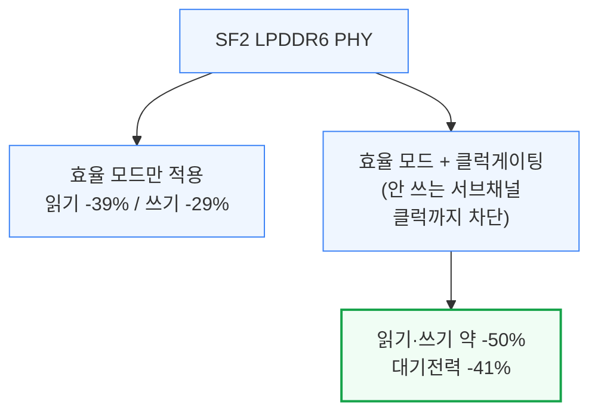

---

## 4. SK하이닉스 1c LPDDR6과 GDDR7 (Paper 15.7, 15.9)

**📌 핵심:**
- SK하이닉스는 처음으로 1c D램 공정 기반 **LPDDR6과 GDDR7**을 동시 공개 — LPDDR6은 최대 14.4Gb/s로 기존 LPDDR5X 최고속 대비 **35% 빠름**
- LPDDR6 저전압 구간(0.95V)에서는 10.9Gb/s로 삼성(0.97V에서 12.8Gb/s)보다 낮아, 같은 신뢰성을 유지하려면 더 높은 전압이 필요한 것으로 추정 — 저전압 전력효율은 삼성이 앞섬
- GDDR7은 1.2V에서 **48Gb/s**까지 clocking, 저전압(1.05V/0.9V)에서도 30.3Gb/s로 RTX 5080에 탑재된 기존 30Gb/s 메모리보다 빠름 — 밀도는 0.412Gb/mm²로 이전 1b(0.309)·1z(0.192) 대비 크게 향상
- 결론: GDDR7은 LPDDR5X 대비 밀도가 약 70%에 그치는 대신 훨씬 빠른 속도가 강점이라 게임용 GPU에 주로 쓰이며, 엔비디아가 계획했던 GDDR7 128GB 탑재 Rubin CPX는 2026년 로드맵에서 사실상 빠지고 HBM 기반 라인업으로 무게중심이 이동

---

SK하이닉스는 이번 학회에서 처음으로 1c D램 공정 제품을 LPDDR6과 GDDR7 두 형태로 공개했습니다. LPDDR6은 최대 14.4Gb/s로 기존 최고속 LPDDR5X보다 35% 빠르면서 전력은 더 낮습니다. 다만 낮은 전압에서는 삼성보다 전력효율이 떨어지는 것으로 보입니다.

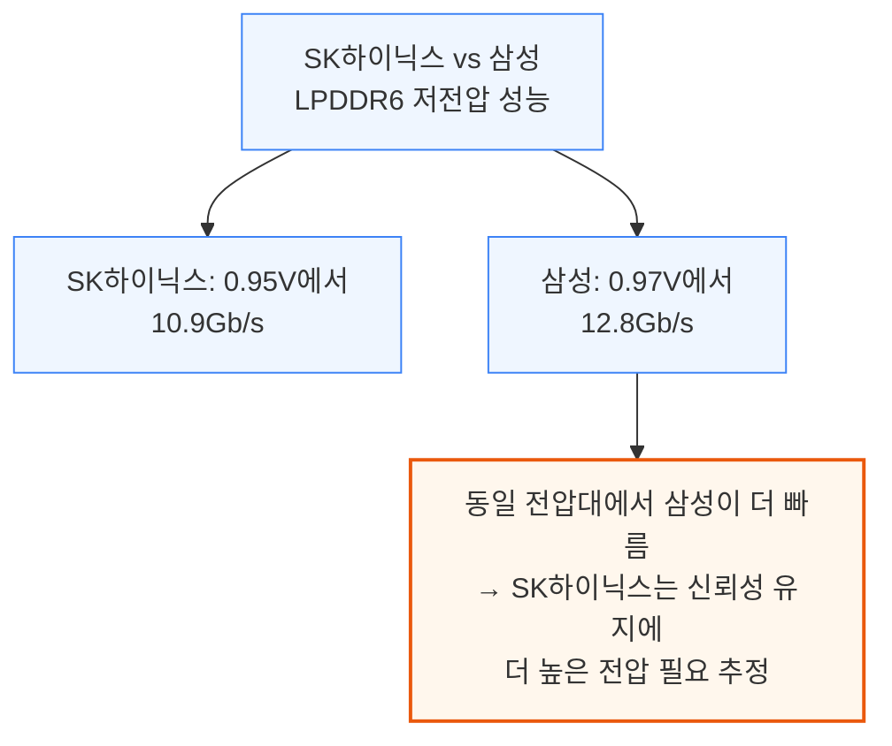

두 제품 모두 일반 모드와 효율 모드를 지원합니다. 효율 모드는 단일 서브채널로 12.8Gb/s에서 동작하며, 대기전류는 12.7%, 동작전류는 18.9% 낮습니다.

같은 1c 공정의 GDDR7은 훨씬 큰 폭의 성능 향상을 보였습니다. 1.2V/1.2V에서 48Gb/s, 저전압(1.05V/0.9V)에서도 30.3Gb/s로 RTX 5080에 쓰인 기존 30Gb/s 메모리를 앞섭니다.

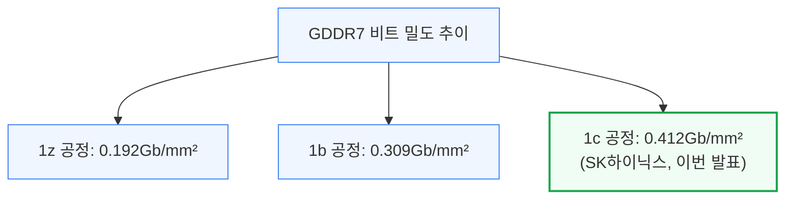

GDDR7이 LPDDR5X보다 속도는 훨씬 빠르지만 밀도는 약 70% 수준에 그치는 이유는, 고속 신호(PAM3 및 클럭당 4개 심볼을 보내는 QDR 방식)를 처리하기 위한 주변회로가 훨씬 넓은 면적을 차지해 실제 메모리 셀 배열의 비중이 줄어들기 때문입니다. 이 때문에 GDDR7은 HBM보다 저렴하지만 용량·밀도가 낮은 게임용 GPU 시장에 주로 쓰이며, 엔비디아가 2025년 발표했던 GDDR7 128GB 탑재 Rubin CPX 대형 컨텍스트 AI 프로세서는 2026년 로드맵에서 사실상 사라지고 HBM 기반 Groq LPX 계열로 무게중심이 옮겨갔습니다.

---

## 5. 삼성 4F² COP D램 (Paper 15.10)

**📌 핵심:**
- 삼성은 SK하이닉스가 VLSI 2025에서 공개한 4F² 구조(PUC)와 동일한 개념의 **COP(Cell-on-Peripheral) D램**을 공개 — 이름만 다를 뿐 셀 웨이퍼와 주변회로 웨이퍼를 하이브리드 본딩으로 붙이는 같은 구조
- 셀 배열 밑에 주변회로를 넣는 "샌드위치" 구조로 주변회로 면적을 **17.0%에서 2.7%로 축소**, 다이 크기를 직접 줄이는 효과
- D램은 낸드보다 웨이퍼 간 연결 개수가 한 자릿수 더 많고 훨씬 촘촘한 간격이 필요해, 서브워드라인 드라이버 신호를 **75% 줄이고** 컬럼 선택 배선도 **절반으로 축소**하는 별도 최적화 필요
- 결론: 부유체 효과(플로팅 바디)로 인한 누설전류·리텐션 저하가 아직 과제로 남아있지만, 4F² 하이브리드 본딩 D램은 2020년대 후반 1d 이후 세대에 등장할 것으로 전망

---

D램 셀 면적을 줄이는 스케일링은 이미 한계에 다다랐다는 점을 이전 리포트에서 다룬 바 있습니다. VLSI 2025에서 SK하이닉스가 4F² PUC(Peri-Under-Cell) 구조를 처음 공개했고, 이번 ISSCC에서 삼성이 같은 개념을 COP(Cell-on-Peripheral)라는 이름으로 공개했습니다.

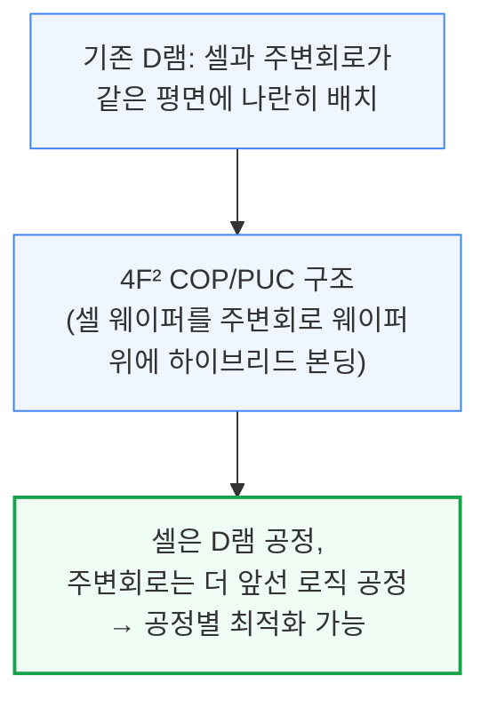

D램의 웨이퍼 간 연결(하이브리드 본딩 접점) 개수는 낸드보다 한 자릿수 더 많고 훨씬 촘촘한 간격을 요구합니다. 삼성은 이를 줄이기 위해 두 가지 방법을 적용했습니다.

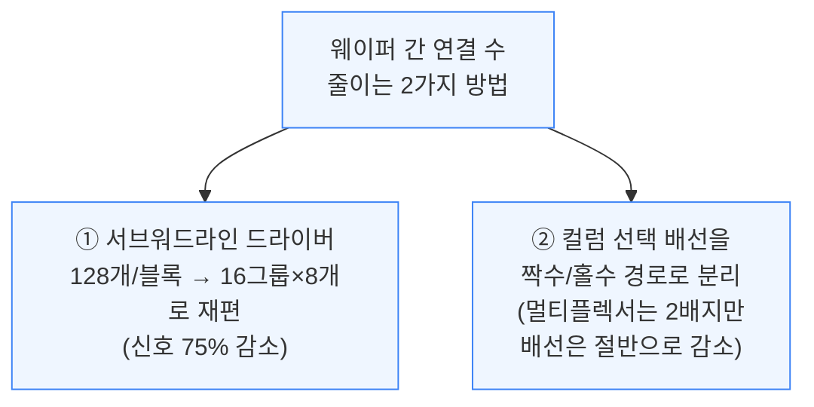

주변회로를 셀 배열 바로 아래 배치하는 "샌드위치" 구조를 적용해, 주변회로가 차지하는 면적 비중을 17.0%에서 2.7%로 크게 줄였습니다. 기존 D램은 비트라인당 셀 개수를 늘릴수록 칩 면적이 크게 늘었지만, 이 수직 구조에서는 주변회로가 전부 셀 아래에 있어 면적 증가가 거의 없습니다.

이미 낸드에서는 하이브리드 본딩이 쓰이고 있지만 삼성은 아직 낸드용 하이브리드 본딩조차 대량 양산 단계는 아니며, D램 COP는 부유체 효과(플로팅 바디로 인한 누설전류 증가·데이터 유지시간 감소)라는 별도 과제가 남아있어, 2020년대 후반 1d 이후 세대에나 본격 도입될 것으로 전망됩니다.

**📌 용어 풀이: 4F², 부유체 효과**
> - **4F² (4 Feature-squared)**: 셀 하나가 차지하는 최소 면적 단위를 이론적 한계에 가깝게 줄인 D램 셀 구조 — 수직형 채널 트랜지스터(VCT)와 그 위에 커패시터를 얹는 방식
> - **부유체 효과 (Floating Body Effect)**: 트랜지스터의 몸체(바디) 부분이 전기적으로 붕 떠 있어 전하가 새거나 예상치 못하게 쌓이는 현상 — 데이터가 저절로 사라지거나(리텐션 저하) 누설전류가 늘어나는 부작용을 일으킴

---

## 6. 샌디스크·키오시아 BiCS10 낸드 (Paper 15.1)

**📌 핵심:**
- 샌디스크·키오시아는 **332층, 3덱(deck)** 구조의 BiCS10 낸드로 **37.6Gb/mm²**를 기록, 종전 1위였던 SK하이닉스 321층 V9(28.8Gb/mm²)를 제치고 낸드 비트 밀도 신기록 경신
- 비슷한 층수·구조(6플레인, 3덱)인데도 SK하이닉스보다 **밀도가 30% 높은** 것은 6플레인 배치 방식의 차이(1×6 vs 2×3) 때문 — 샌디스크·키오시아의 1×6 방식이 면적을 2.1% 더 아낌
- 다이를 더 많이 쌓을수록 선택 안 된 다이의 대기전류가 늘어나는 문제를 다이 게이팅(선택 안 된 다이의 데이터 경로 전체 차단)으로 해결, 대기전류를 **100분의 1 수준**으로 감소
- 결론: 밀도 경쟁에서 SK하이닉스가 TLC·QLC 모든 구성에서 뒤처지는 추세가 재확인됐으며, 낸드 적층 경쟁은 층수뿐 아니라 플레인 배치·전력망 설계 최적화로 승부처가 이동

---

BiCS10은 332층, 3덱 구조로 QLC(셀당 4비트) 기준 37.6Gb/mm²의 비트 밀도를 기록해, SK하이닉스의 321층 V9(28.8Gb/mm², 30% 낮음)를 제치고 신기록을 세웠습니다. TLC(셀당 3비트) 기준으로도 29 대 21Gb/mm²로 격차가 벌어집니다.

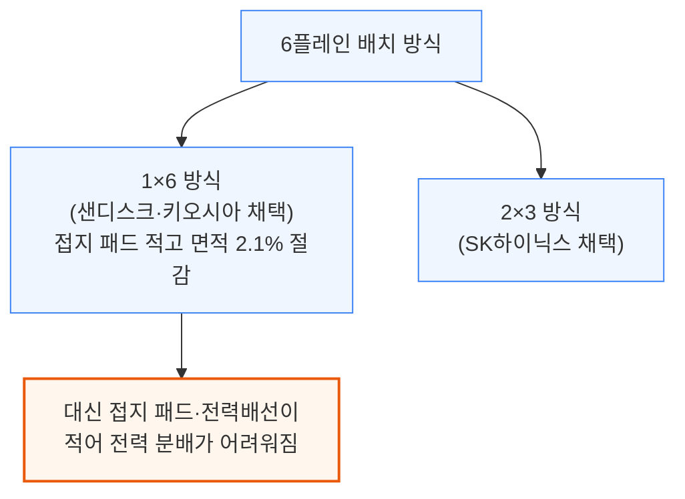

1×6 방식의 전력 분배 약점은 CBA(Cell Bonded Array, 셀과 CMOS 웨이퍼를 따로 만들어 붙이는 구조)의 이점을 살려 별도 최상단 금속층을 하나 더 추가하는 방식으로 해결했습니다.

낸드는 저장 밀도를 높이려면 다이를 더 많이 쌓아야 하는데, 다이를 많이 쌓을수록 선택되지 않은 대기 중인 다이들의 누설전류가 실제로 동작 중인 다이의 전류에 근접할 만큼 커지는 문제가 있습니다. 샌디스크는 선택 안 된 다이의 데이터 경로 전체를 차단하는 게이팅 시스템으로 대기전류를 100분의 1 수준까지 낮췄습니다.

---

*작성 진행률: 약 35% 완료 (1~6장 작성)*
*업데이트: SK하이닉스 LPDDR6·GDDR7, 삼성 4F² COP D램, BiCS10 낸드 섹션 작성*
