# China's CXMT Is Set to Challenge DRAM Incumbents

> **출처**: [https://newsletter.semianalysis.com/p/chinas-cxmt-is-set-to-challenge-dram](https://newsletter.semianalysis.com/p/chinas-cxmt-is-set-to-challenge-dram)
> **저자**: Dylan Patel
> **발행일**: 2026-06-23

📑 목차
 1. [실리콘밸리 귀환자: 주이밍과 창신메모리의 태동](#1-실리콘밸리-귀환자-주이밍과-창신메모리의-태동)
 2. [키몬다의 유산: DRAM 기술과 인재의 계승](#2-키몬다의-유산-dram-기술과-인재의-계승)
 3. [국가 벤처자본의 인내: 허페이시의 10년 베팅](#3-국가-벤처자본의-인내-허페이시의-10년-베팅)
 4. [슈퍼사이클 속의 IPO: 매출과 마진의 폭발적 성장](#4-슈퍼사이클-속의-ipo-매출과-마진의-폭발적-성장)
 5. [웨이퍼 생산능력과 HBM 배분 전략](#5-웨이퍼-생산능력과-hbm-배분-전략)
 6. [IPO 지분구조가 드러내는 것](#6-ipo-지분구조가-드러내는-것)
 7. [수출규제 하의 장비 생태계: 국산화 vs 해외 의존](#7-수출규제-하의-장비-생태계-국산화-vs-해외-의존)
 8. [구조적으로 HBM 부족에 몰릴 중국](#8-구조적으로-hbm-부족에-몰릴-중국)

🔑 용어 정리
- **CXMT (ChangXin Memory Technologies, 창신메모리)**: 중국 최대 DRAM 제조사로, 이 리포트 시점에 상하이 증시(커촹반) 상장을 추진 중인 기업.
- **키몬다 (Qimonda)**: 2009년 파산한 독일 DRAM 기업 — CXMT가 특허와 기술 문서를 물려받은 원천.
- **국가 벤처자본 (State-Venture Capital)**: 정해진 회수 기한 없이 국가·지방정부가 장기간 손실을 감수하며 투자를 지속하는 중국식 산업 육성 자금.
- **슈퍼사이클 (Supercycle)**: 메모리 가격이 장기간에 걸쳐 구조적으로 급등하는 국면.
- **kwspm (분당 천 장 웨이퍼)**: 한 달에 투입 가능한 웨이퍼 수량을 천 장 단위로 나타낸 생산능력 지표.
- **WFE (Wafer Fab Equipment, 웨이퍼 팹 장비)**: 웨이퍼를 가공하는 데 필요한 노광·식각·증착 등 반도체 제조 장비 전체.
- **TSV (Through-Silicon Via, 실리콘관통전극)**: HBM을 층층이 쌓을 때 위아래 칩을 수직으로 연결하는 미세한 통로.
- **HBM (High Bandwidth Memory, 고대역폭 메모리)**: 여러 DRAM 칩을 수직으로 쌓아 데이터 전송 속도를 크게 높인 AI 전용 메모리.

---

SemiAnalysis는 2024년 말 AI 추론·에이전트 워크로드가 촉발한 메모리 부족을 업계 최초로 지목한 이래, 메모리와 중국 컴퓨팅에 관한 심층 리포트를 여러 차례 발행해왔습니다.

CXMT가 수개월 내 IPO를 앞두고 있는 지금, 이 회사만 따로 떼어 심층 분석할 시점이 됐다고 판단했습니다. CXMT는 중국 역사상 최대 규모 반도체 IPO가 될 가능성이 높습니다. 또한 중국 대표 메모리 제조사가 삼성전자·SK하이닉스·마이크론과 정면으로 더 치열하게 경쟁하게 될 분기점이기도 합니다.

2016년 설립된 CXMT는 현재 중국 내 선두 DRAM 기업으로 성장했고, 그 역사에는 기술 이전, 인재 유입, 그리고 국가 벤처자본의 인내라는 세 갈래 흐름이 얽혀 있습니다.

---

## 1. 실리콘밸리 귀환자: 주이밍과 창신메모리의 태동

**📌 핵심:**
- CXMT 창업자 주이밍(Zhu Yiming)은 칭화대 물리학·미국 대학원(전기공학)·실리콘밸리 경력을 거쳐 2005년 귀국, SRAM 특허와 10만 달러 시드머니로 기가디바이스(GigaDevice)를 창업해 세계 상위권 NOR 플래시 기업으로 키움
- 하지만 NOR 플래시 시장은 DRAM·NAND보다 훨씬 작아, 주이밍은 2016년 더 큰 시장인 DRAM에 도전장을 내밀고 허페이시와 함께 "506 프로젝트"(현 CXMT)를 시작
- 문제는 DRAM이 팹리스로는 할 수 없는 사업이라는 점 — 2016년 당시 삼성전자·SK하이닉스·마이크론 3사가 40년치 특허와 자본으로 시장을 완전히 장악했고, 주이밍의 SRAM 특허·NOR 사업은 DRAM 셀 구조도, 공정도, 특허 방어막도 제공하지 못함
- 결론: 자체 기술이 전무했던 CXMT는 핵심 기술을 통째로 외부에서 들여와야 했고, 그 원천은 2009년에 파산한 독일의 한 DRAM 기업이었음

---

CXMT 창업자 주이밍은 1994년 칭화대에서 물리학 학사를 마치고 미국 스토니브룩 대학교에서 전기공학 대학원 과정을 밟았습니다. 이후 실리콘밸리에서 일하며 2001년 무렵 모시스(MoSys)의 프로젝트 리더가 됐습니다.

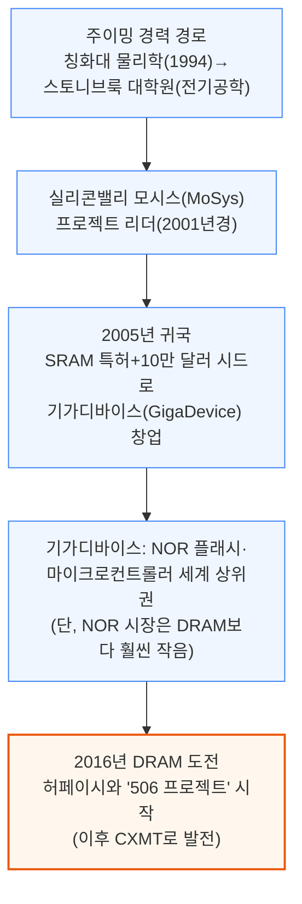

문제는 DRAM이 팹리스(설계만 하고 생산은 위탁하는 방식)로는 버틸 수 없는 사업이라는 점입니다. 막대한 자본과 특허, 자체 생산 라인을 요구하는데, 2016년 당시 이미 삼성전자·SK하이닉스·마이크론 3사가 40년치 특허와 자본으로 시장을 완전히 장악하고 있었습니다.

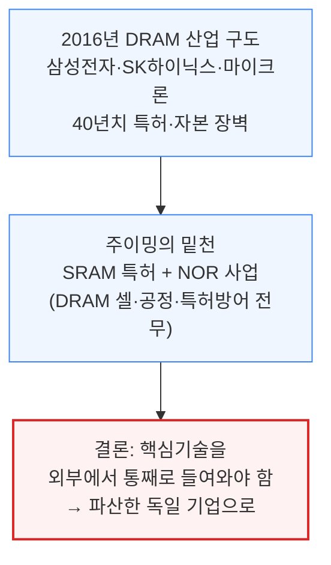

---

## 2. 키몬다의 유산: DRAM 기술과 인재의 계승

**📌 핵심:**
- CXMT DRAM 사업의 기술적 토대는 2009년 파산한 독일 **키몬다(Qimonda)**의 특허·기술문서 — 폴라리스가 2015년 인수한 특허 약 7,000건을 2019년 CXMT가 라이선스로 받았고, 회사는 키몬다 기술문서 약 2.8TB를 확보했다고 밝힘
- 핵심 계승 기술은 **매몰 워드라인(BWL)** 셀 구조 — 게이트를 표면이 아닌 비트라인 아래에 매립해 셀 면적을 6F²로 줄이고(기존 8F²), 채널 길이는 유지해 누설전류를 억제하며, 오늘날 3사 모두가 쓰는 "매몰 워드라인+적층 커패시터" 구조의 원형
- 다만 진짜 자산은 문서가 아니라 사람 — 키몬다 독일 본사 출신 쿠스터스(24년 경력 부사장, 적층 커패시터 개발 총괄), 미국 마이크론·샌디스크 출신 핑얼쉬안, 한국·대만에서 영입한 인력이 "어떤 설계를 남기고 버릴지", "실험실 성공을 양산으로 옮기는 법"이라는 암묵지를 전수
- 결론: 특허는 언젠가 만료되는 유한 자산이지만, CXMT가 G4→G5→HBM으로 계속 나아갈 수 있는 원동력은 이렇게 축적된 인재 역량 — 다만 CXMT가 흑자를 낸 것은 창업 후 거의 10년이 지나서였음

---

키몬다는 지멘스에서 출발한 인피니언의 자회사로, 2008년 금융위기와 메모리 다운사이클 여파로 2009년 1월 파산하기 전까지 유럽 최대 DRAM 기업이었습니다. 삼성-SK하이닉스-마이크론 삼각 구도 바깥에서 나온 특허·셀 구조를 갖춘 드문 대안이었습니다.

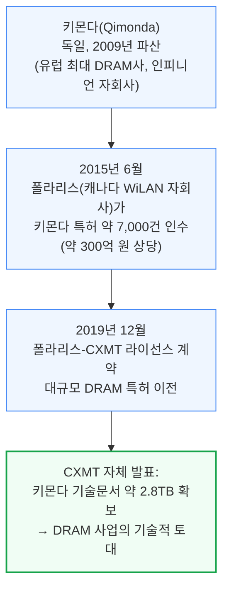

CXMT가 물려받아 10나노급까지 발전시킨 핵심 기술이 46나노급 매몰 워드라인(BWL, Buried Wordline) 셀입니다.

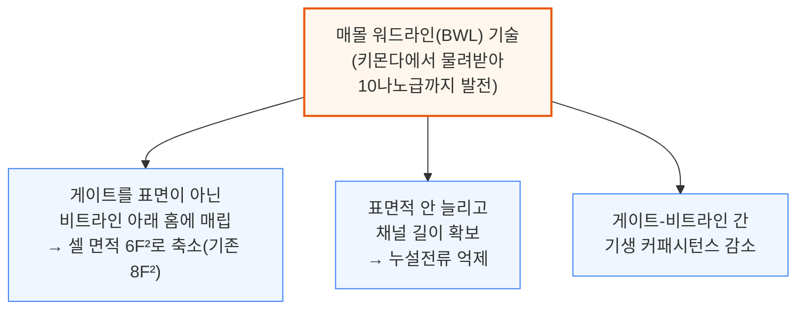

매몰 워드라인과 적층 커패시터를 결합한 구조는 오늘날 삼성전자·SK하이닉스·마이크론 3사 모두가 쓰는 표준 아키텍처입니다. 하지만 키몬다에서 CXMT로 넘어온 것 중 특허·문서보다 더 오래가는 자산은 사람입니다.

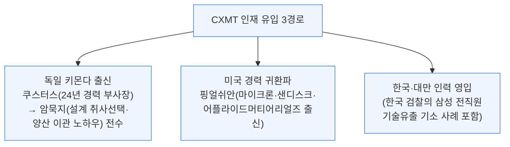

키몬다의 시안(Xi'an) 연구소는 400\~500명 규모로 독일 밖 최대 거점이었는데, 파산 후 칭화유니그룹이 통째로 인수했지만 개별 인재들은 여러 갈래로 흩어져 CXMT에도 흘러들었습니다.

쿠스터스는 지멘스·인피니언·키몬다에서 24년간 기술·선행개발 부사장을 지냈고, 그가 이끌던 적층 커패시터 개발 라인이 바로 CXMT가 채택한 구조입니다. EE타임즈는 그를 CXMT의 "숨은 비장의 카드"라 불렀습니다.

핑얼쉬안은 키몬다가 아닌 미국 마이크론·샌디스크·어플라이드머티어리얼즈 경력을 통해 공정·소재 전문성을 보탰습니다.

키몬다의 특허는 언젠가 만료되는 유한 자산이었지만, CXMT가 G4에서 G5로, 다시 HBM으로 계속 나아갈 수 있는 원동력은 이렇게 축적된 국내 인재 역량입니다. 다만 CXMT가 흑자를 내기까지는 거의 10년이 걸렸습니다 — 그 오랜 적자를 누가 견뎌냈는지가 다음 질문입니다.

---

## 3. 국가 벤처자본의 인내: 허페이시의 10년 베팅

**📌 핵심:**
- CXMT의 성공은 중국 중앙·지방정부 지원과 떼어놓고 설명하기 어려움 — 허페이시는 BOE(디스플레이)·니오(전기차)에 썼던 것과 같은 "지분 투자로 앵커기업을 키우고 주변 공급망을 끌어들이는" 전략을 CXMT에도 그대로 적용
- CXMT 공장 주변 허페이 공항단지에는 패키징·테스트(페이턴·신펑, 신펑은 매출 99% 이상이 CXMT向), 온사이트 벌크가스(광강), 웨이퍼 재생·성형장비(즈웨이반도체·원이테크놀로지) 업체가 밀집해 지역 공급망 클러스터를 형성
- 허페이 국가 벤처자본은 민간 벤처캐피털과 달리 정해진 회수 시한이 없어, CXMT가 2025년 첫 흑자를 낼 때까지 누적 적자 약 366.5억 위안(10년 가까이)을 감내 — "506 프로젝트" 1단계 자금(180억 위안)의 80%(144억 위안)를 허페이 국가 벤처자본이 댔고, IPO 시점에도 지분을 팔지 않고 합산 30% 이상을 유지
- 결론: 키몬다(기술 토대)·인재(실행력)·허페이 정부(자본과 인내, 지역 공급망) 세 갈래 중 하나만으로는 DRAM 제조사가 나올 수 없었고, 셋이 합쳐져야 비로소 CXMT가 완성됨

---

CXMT의 성공에서 중앙·지방정부 지원의 역할을 빼놓을 수 없습니다. 허페이시는 지난 20년간 BOE(세계 최대 디스플레이 패널 제조사)와 니오(전기차 제조사)를 키워낸 "국가 벤처자본" 전략의 대표 사례이며, 앵커기업에 대규모 지분을 확보한 뒤 주변 공급망을 끌어들이는 방식을 2016년부터 CXMT에도 그대로 적용했습니다.

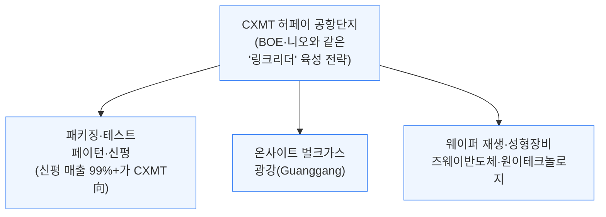

민간 벤처캐피털은 투자자에게 정해진 시한 내 회수를 약속해야 하지만, 허페이시의 국가 벤처자본은 그런 시계가 없었습니다. CXMT가 2025년 첫 연간 흑자를 낼 때까지도 거의 10년간 누적 적자가 약 366.5억 위안에 달했지만 자금 지원을 이어갔습니다.

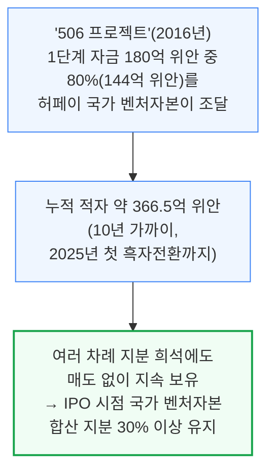

세 갈래를 합쳐보면 CXMT의 첫 10년은 하나의 이야기로 정리됩니다. 키몬다는 기술 토대를, 쿠스터스·핑얼쉬안 같은 인재는 실행력을, 허페이 정부는 자본과 인내와 지역 공급망을 각각 제공했습니다.

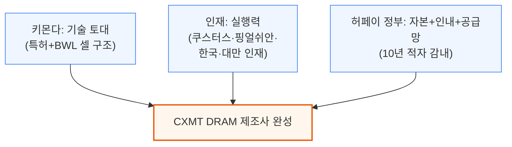

셋 중 하나만으로는 DRAM 제조사가 나올 수 없었을 것입니다. 다음 섹션에서는 CXMT의 재무 실적, 기술, 장비 생태계를 다룹니다.

---

## 4. 슈퍼사이클 속의 IPO: 매출과 마진의 폭발적 성장

**📌 핵심:**
- CXMT는 2025년 12월 상하이거래소 커촹반(STAR Market) 상장 신청이 접수됐고 2026년 5월 27일 증권감독관리위원회(CSRC) 등록 절차까지 진행 — 중국 역대 최대급 반도체 IPO가 될 전망
- 2025년 매출은 전년비 156% 급증한 약 86억 달러(2024년 33억 달러, 2023년 12억 달러)로 처음 순이익 10억 달러 흑자 전환, 2026년 1분기엔 매출 73억 달러(전년비 약 700%↑)·영업이익률 약 70%까지 치솟아 연간 매출 500억 달러 돌파 가능성까지 제시
- 하지만 이 폭발적 실적은 점유율 확대가 아니라 **가격(ASP) 급등**이 견인 — 2026년 1분기 비트 출하량은 전분기 대비 11%만 늘었는데 평균판매단가는 57% 뛰었고(2025년 3\~4분기엔 각각 63%·68% 상승), 비트 기준 점유율은 2025년 9%에서 2027년 12%로 완만하게만 증가할 전망
- 결론: 그럼에도 CXMT의 매출총이익률(37.8%)은 아직 삼성전자(39.4%)·마이크론(39.8%)에 근접했을 뿐 SK하이닉스(60.4%, HBM 비중 高)엔 크게 못 미치며, DDR5 비트당 원가도 3사 대비 30% 이상 높아 — 마진 개선은 기술 경쟁력이 아니라 순전히 가격 상승이 만든 결과

---

CXMT는 2025년 12월 상하이거래소가 커촹반(STAR Market) 상장 신청을 접수하며 공식적으로 IPO 절차에 들어갔고, 2026년 5월 27일 증권감독관리위원회(CSRC) 등록을 제출해 최종 심사 단계에 있습니다. 전 세계 거의 모든 지표에서 CXMT는 이미 세계 4위 DRAM 기업이며, 그 격차를 계속 좁혀가고 있습니다.

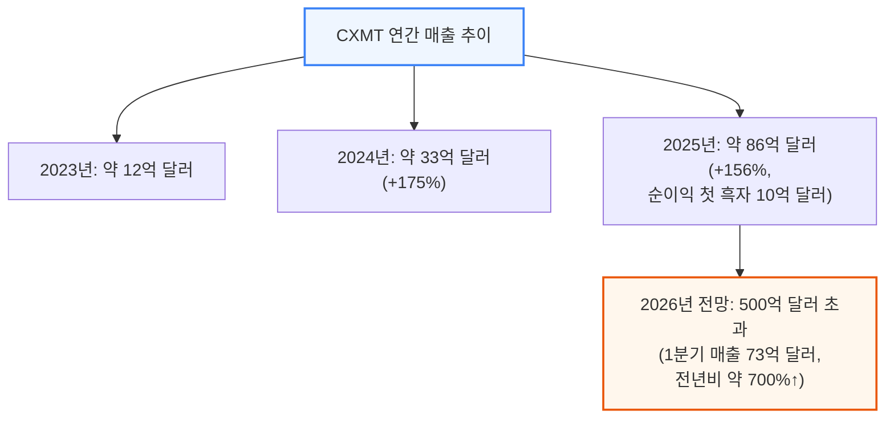

이렇게 빠르게 성장해도 CXMT는 여전히 3대 선두업체와 규모 격차가 큽니다.

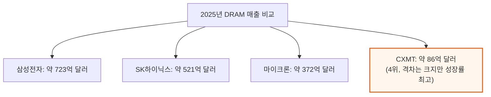

중요한 것은 이 급성장의 원인입니다. CXMT의 비트 출하량은 크게 늘지 않았는데 판매 단가만 폭등했습니다.

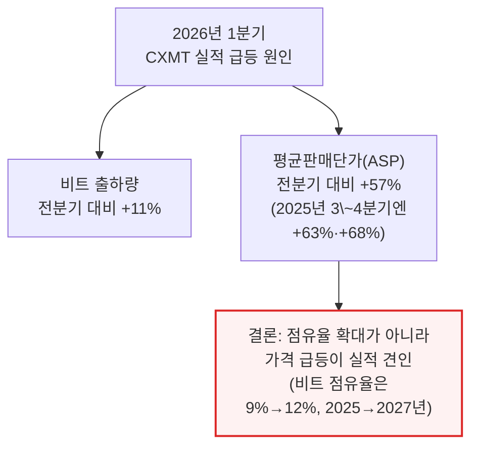

**📌 용어 풀이: ASP (Average Selling Price, 평균판매단가)**
> - **의미**: 판매한 제품 전체의 평균 가격 — 같은 물량을 팔아도 단가가 오르면 매출이 늘어남
> - **쉬운 비유**: 같은 개수의 사과를 팔아도 개당 가격이 오르면 총 매출이 느는 것과 같은 원리로, CXMT 실적 급증은 "더 많이 팔아서"가 아니라 "더 비싸게 팔아서"에 가까움

이런 가격 급등은 CXMT만의 현상이 아닙니다. 지난해 발행한 "메모리 마니아" 리포트에서 짚었듯 DRAM은 40년 만의 공급 부족 국면에 들어섰고, DRAM 가격은 올해 다시 두 배가 될 것으로 전망됩니다.

CXMT의 판매 단가는 삼성전자·SK하이닉스·마이크론보다 5\~10%밖에 낮지 않아, "중국산 메모리는 항상 훨씬 싸다"는 통념과 다릅니다. 다만 서버 DRAM·HBM 비중이 높은 선두업체들이 유리한 제품 믹스 덕에 이 격차는 앞으로 점차 벌어질 전망입니다.

마진 측면에서 CXMT는 아직 갈 길이 멉니다.

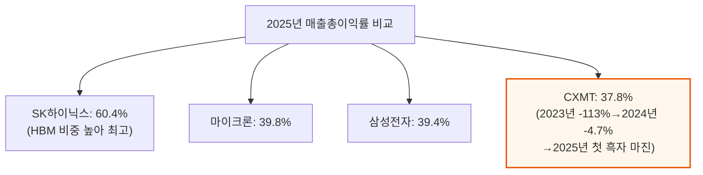

2026년 1분기 영업이익률은 CXMT 70%, SK하이닉스 73%, 삼성전자 81%, 마이크론 84% 순입니다. CXMT의 마진 개선은 첨단 HBM보다 마진이 좋아진 범용 DRAM(LPDDR·DDR)에 매출이 거의 전부 쏠려 있어서인데, DDR5 비트당 제조원가는 3사 대비 30% 이상 높습니다.

다만 DDR5 가격 자체가 워낙 강세라 CXMT 매출총이익률도 70%를 넘겼습니다 — 즉 마진 개선은 경쟁력 향상이 아니라 순전히 가격 상승이 만든 결과입니다.

---

## 5. 웨이퍼 생산능력과 HBM 배분 전략

**📌 핵심:**
- CXMT 웨이퍼 생산능력은 2026년 말 약 350kwspm(마이크론 약 385kwspm에 근접, 세계 3위 도전)까지 늘고, 2027년 말 420kwspm(글로벌 점유율 17%)·2028년 말 500kwspm까지 확대될 전망 — 다만 대규모 증설(연 70\~85kwspm)에도 DRAM은 올해 한 자릿수 후반%, 내년엔 10%대 중반까지 공급 부족이 심화될 전망
- CXMT 웨이퍼의 HBM 배분 비중은 2025년 말 전체 265kwspm 중 단 5kwspm(약 2%)에 불과 — 범용 DRAM이 HBM보다 마진이 좋고 웨이퍼당 비트 생산량도 3배 이상 많아, 중국 정부의 AI 반도체 자립 압박이 없다면 HBM보다 범용 DRAM을 우선하는 게 CXMT 입장에서 합리적 선택
- 그럼에도 정부 압박으로 HBM 배분은 2026년 30kwspm, 2027년 55kwspm, 2028년 100kwspm까지 늘어 세계 HBM 웨이퍼 점유율이 1%(2025년)에서 12%(2028년)까지 오를 전망 — 다만 기술 성숙도는 아직 낮아 HBM3 8단(8-hi) 종합 수율이 전공정 35%×후공정 70%로 약 25%에 그침
- 결론: 미국의 대중 HBM 수출 규제로 정식 경로의 HBM 반입은 막혀 있지만, 제3국을 경유한 재수출·밀수, 부분조립 모듈 반입 후 HBM 탈부착·재조립 같은 우회 유통이 여전히 존재해 규제의 실효성에는 한계가 있음

---

CXMT는 2026년 말 웨이퍼 생산능력 약 350kwspm까지 성장해 마이크론(약 385kwspm)에 근접하며, 순수 웨이퍼 생산능력 기준으로는 세계 3위에 도전할 전망입니다.

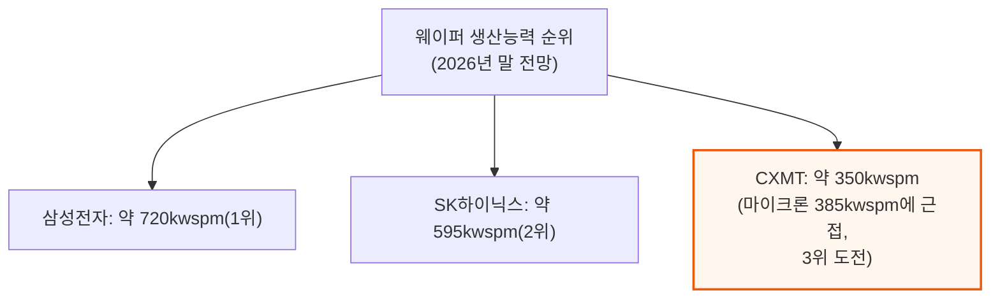

2027년에는 상하이 1단계 초기 가동과 허페이·베이징 완전 가동이 겹치며 CXMT 생산능력이 연말 기준 약 420kwspm(세계 DRAM 생산능력의 약 17%, 2025년 13%에서 상승)까지 커질 전망입니다.

2028년 말에는 500kwspm(세계 점유율 약 17%)에 이를 것으로 봅니다. 비트 출하 기준 점유율도 2025년 9%에서 2027년 12%로 오릅니다.

CXMT의 연간 웨이퍼 순증 규모도 꾸준합니다.

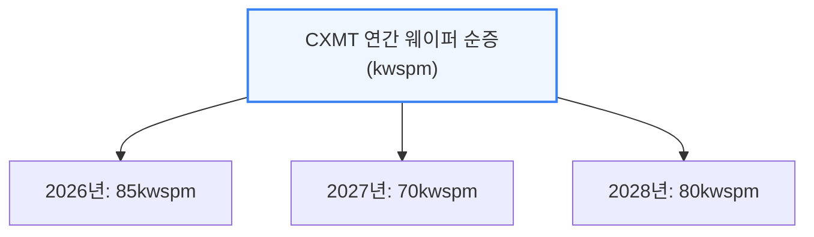

같은 기간 선두 3사도 증설 속도를 높이고 있어, CXMT의 증설만으로 시장을 흔들 정도는 아닙니다.

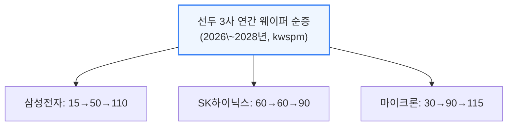

이런 대규모 증설에도 불구하고 가동률이 90%대 후반에 달할 것으로 가정해도 DRAM은 올해 한 자릿수 후반% 부족, 내년엔 10%대 중반까지 부족이 확대될 전망입니다. 팹 건설 기간이 워낙 길어 CXMT가 갑자기 증설 속도를 무리하게 높여 이 우호적인 가격 환경을 깨뜨릴 가능성은 낮습니다.

CXMT 웨이퍼 중 HBM에 배분된 비중은 아직 미미합니다.

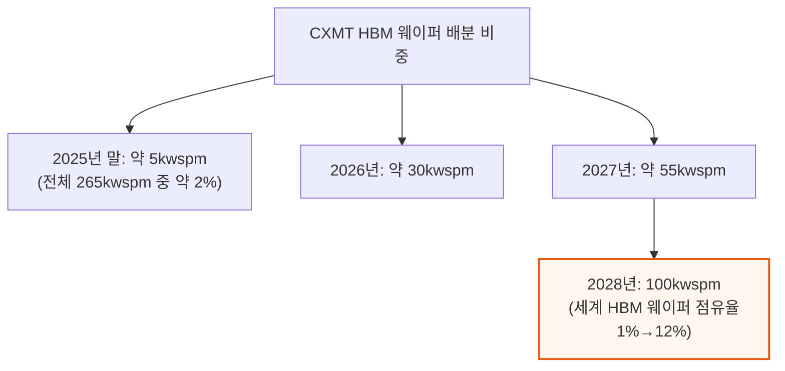

CXMT가 HBM보다 범용 DRAM에 웨이퍼를 우선 배분하는 것은 현재로선 합리적 선택입니다.

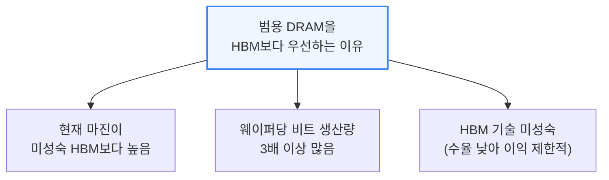

기술 성숙도 측면에서 CXMT는 HBM3 8단(8-hi) 안정화조차 아직 어려움을 겪고 있고 12단은 더 어렵습니다. 전공정(칩 자체) 웨이퍼 소트 수율은 G4(1z급) 범용 DRAM 대비 HBM용 다이가 다이 크기도 크고 셀 요구 성능도 높아 훨씬 낮습니다.

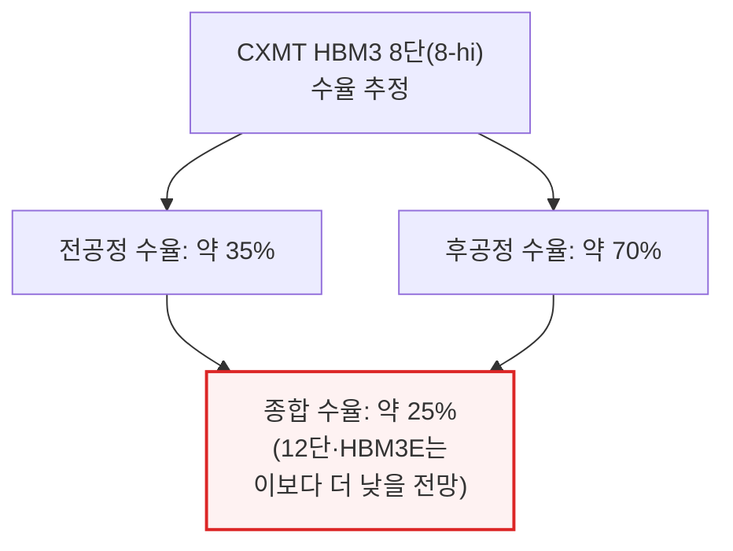

적층(다이 스태킹)도 큰 걸림돌입니다 — 열 스트레스, 다이 균열, 휘어짐, 접합 불량이 8단에서 12단, HBM3E로 갈수록 심해집니다. 이는 CXMT만의 문제가 아니라 선두업체들도 12단 이상에서 똑같이 겪는 난제입니다.

Rubin Ultra가 16단이 아닌 12단 HBM4E를 쓰는 이유 중 하나도 16단이 웨이퍼 손실을 더 키우기 때문입니다. 고객 수요와 주류 가속기의 세대 전환을 감안하면 CXMT가 HBM3를 건너뛰고 곧바로 HBM3E 8단·12단으로 갈 가능성도 있습니다.

이런 낮은 수율 때문에 화웨이·캄브리콘 등 일부 중국 AI 반도체 업체만 CXMT의 HBM을 채택할 것으로 보이며, 그마저도 채택 규모가 크지 않을 전망입니다. 중국 내 AI 반도체 업체들은 여전히 해외산 HBM3·HBM3E를 구할 수만 있다면 그쪽을 선호합니다.

미국의 대중 HBM 수출 규제는 정식 경로를 막아뒀지만 완전히 차단하지는 못했습니다.

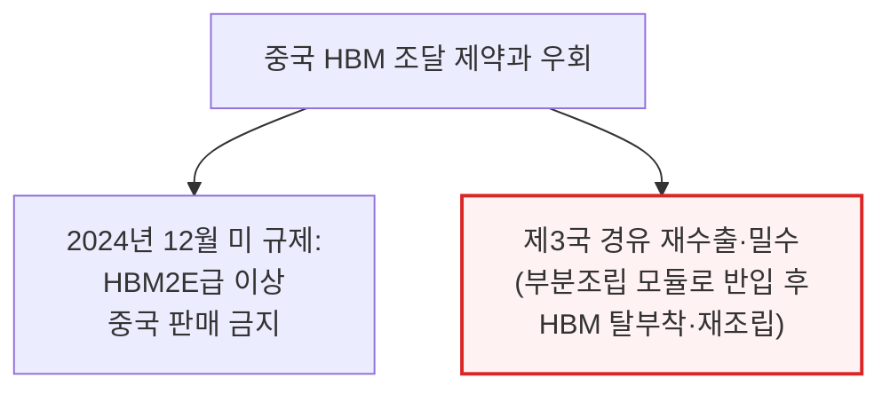

일부 중국 기업은 제3국의 대리점이나 협력사를 거쳐 여전히 HBM3를 확보하고 있으며, 완제품 GPU·ASIC으로 분류되지 않는 부분조립 모듈 형태로 반입한 뒤 HBM을 떼어내 중국산 GPU·ASIC에 재조립하는 사례도 보고되고 있습니다.

---

## 6. IPO 지분구조가 드러내는 것

**📌 핵심:**
- 2025년 연결 순이익 71.4억 위안 중 모회사(공모 주주) 귀속분은 18.7억 위안(26%)뿐 — CXMT가 자회사 지분은 30%대만 보유하면서도 일치행동 계약으로 의결권 73\~75%를 확보해 연결 대상에 포함시킨 결과, 공모 주주가 실제 받는 몫보다 약 4배 부풀려진 실적이 표시됨
- 이번 IPO는 296억 위안(약 41억 달러)을 조달하며 지분 10\~15%를 신규 발행 — 15% 희석 시 주당 2.78위안으로 2025년 6월 사모 가격(2.63위안)과 거의 차이가 없어, 1분기 매출 73억 달러·순이익 48억 달러라는 실적에 비해 지나치게 저평가된 산정가
- 조달금 295억 위안 중 69.5%(205억 위안)는 웨이퍼 생산라인·DRAM 기술 고도화, 30.5%(90억 위안)는 차세대 DRAM 연구에 배정되며 HBM 전용 프로젝트는 명시적으로 배정되지 않음
- 결론: 알리바바는 CXMT의 앵커 고객이자 지분 약 4% 보유자이며 시장 신뢰를 보증하는 역할까지 겸해, 한국 선두업체들이 자국 내에서 갖지 못했던 "내수 수요가 사실상 보장된" 구조를 CXMT에 제공

---

CXMT는 중국 역대 최대급 반도체 IPO 후보지만, 헤드라인 재무 수치보다 지분구조가 더 중요합니다. 2025년 연결 순이익은 71.4억 위안이지만 실제 모회사(공모 주주) 귀속분은 18.7억 위안, 즉 26%에 불과합니다.

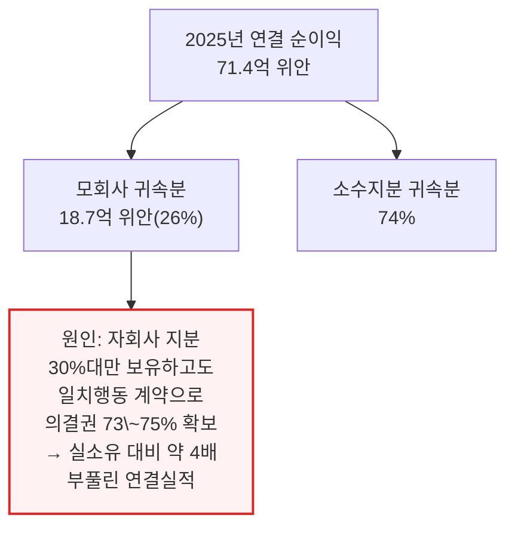

CXMT는 창신신차오 지분 30.68%, 창신지뎬베이징 지분 31.72%만 갖고 있으면서도 장기 일치행동 약정을 통해 각각 의결권 73.01%·75.32%를 확보해 두 회사를 연결 대상에 포함시킵니다.

프로스펙터스는 이를 근거로 "지배주주 없음·실질 지배자 없음"이라 선언하지만, 실제로는 일치행동 계약을 통한 다수결 지배가 이뤄지고 있습니다. 국가집적회로펀드 2기, 허페이시, 안후이성 등 국가 벤처자본 지분이 상장 후에도 30% 이상을 유지합니다.

이런 구조는 수출규제·해외투자자 우려가 집중되는 시점에 중국 정부와의 연결고리를 관리하려는 설계로 보입니다.

이번 IPO 조달 규모는 헤드라인보다 훨씬 저평가된 산정가를 내포하고 있습니다.

```mermaid
flowchart TD
    Raise["IPO 조달 296억 위안<br/>(약 41억 달러), 지분 10\~15% 발행"] --> P10["10% 희석: 주당 4.41위안"]
    Raise --> P15["15% 희석: 주당 2.78위안<br/>(2025년 6월 사모가<br/>2.63위안과 거의 차이 없음)"]
    P15 --> Cheap["2.78위안 기준 시총 197억 위안<br/>(약 270억 달러)<br/>= 연환산 상반기 순이익의 1.8배<br/>→ 명백한 저평가"]

    style Cheap fill:#fef2f2,stroke:#dc2626,stroke-width:2px
```

1분기 매출 73억 달러·순이익 48억 달러라는 실적을 감안하면, 이 산정가는 주당 가치 상승분이 거의 없는 셈입니다. 조달금 사용처도 현재 우선순위를 그대로 반영합니다.

```mermaid
flowchart TD
    Alloc["IPO 조달금 295억 위안 사용처"] --> Wafer["69.5%(205억 위안)<br/>웨이퍼 생산라인·<br/>DRAM 기술 고도화"]
    Alloc --> RnD["30.5%(90억 위안)<br/>차세대 DRAM 연구"]
    Alloc --> NoHBM["HBM 전용 프로젝트<br/>명시적 배정 없음"]

    style NoHBM fill:#fff7ed,stroke:#ea580c,stroke-width:2px
```

실적 변동성도 눈여겨볼 대목입니다. 2025년 12월 신고서에서는 2025년 모회사 손실을 6\~16억 위안으로 안내했지만, 5개월 뒤 최종 프로스펙터스에는 18.7억 위안 흑자로 뒤집혔습니다 — 연결 순이익은 애초 예상 상단의 두 배를 넘어섰습니다. 이는 메모리 슈퍼사이클이 밸류에이션을 얼마나 빠르게 흔드는지 보여줍니다.

마지막으로 알리바바의 위치가 CXMT의 수요 기반을 이해하는 핵심입니다.

```mermaid
flowchart TD
    Ali["알리바바의 3중 역할"] --> Customer["앵커 고객<br/>(클라우드 서버 DRAM<br/>대량 구매처)"]
    Ali --> Holder["지분 보유자<br/>(약 4% 지분)"]
    Ali --> Endorser["시장 신뢰 보증<br/>(기가디바이스 1.8%와 함께)"]
    Holder --> Guarantee["결론: 한국 선두업체가<br/>자국 내에서 갖지 못한<br/>내수 수요 보장 효과"]

    style Guarantee fill:#f0fdf4,stroke:#16a34a,stroke-width:2px
```

---

## 7. 수출규제 하의 장비 생태계: 국산화 vs 해외 의존

**📌 핵심:**
- 2019년 ASML EUV 수출금지를 시작으로 2022년 10월(18나노 이하 DRAM용 장비 통제, CXMT의 G4·G5를 직격)→2023년 10월(노드 무관 장비·부품·서비스 통제 확대)→2024년 12월(HBM 수출 금지+장비 24종·SW 3종 추가, 140개 기관 등재)까지 규제가 단계적으로 좁혀짐
- EUV를 못 쓰는 CXMT는 DUV 다중패터닝(SADP·SAQP)으로 우회해야 해 마스크·식각·증착 횟수가 늘고 공정시간이 길어지며 비트당 원가가 상승 — 삼성전자·SK하이닉스는 이미 1a\~1c 공정에 EUV를 쓰고 1d 이후로 확대 예정이라 격차는 구조적
- 8개 주요 공정 단계(산화·확산, 포토리소그래피, 식각, 증착, 이온주입, 금속화, CMP·세정, 검사·계측·테스트, 후공정 TSV·TCB)에서 국산 장비사(나우라·AMEC·화천 등)가 서서히 자리를 잡고 있지만, 포토리소그래피와 이온주입은 여전히 해외 의존도가 가장 높은 영역
- 결론: HBM용 TSV(실리콘관통전극) 장비는 나우라와 AMEC이 경쟁하며 국산화를 이끌고 있고, 정책적으로는 AMEC이 CXMT의 TSV 물량을 더 많이 가져가고 나우라는 로직·인터포저 분야(SMIC 등)에서 입지를 다지는 역할 분담이 진행 중

---

베이징이 공급망 자립을 밀어붙이면서 중국 반도체 장비·소재 산업은 구조적 성장기에 들어섰습니다. 이는 YMTC·SMIC뿐 아니라 CXMT의 생산능력 확장과 공급망 국산화율 상승이 함께 견인하고 있습니다. 미국의 잇단 수출규제는 이 흐름을 오히려 가속하고 있습니다.

```mermaid
flowchart TD
    T2019["2019년<br/>ASML EUV 수출금지<br/>→ 선단공정 노광 원천봉쇄"] --> T2022["2022년 10월 BIS 규제<br/>18나노 하프피치 이하<br/>DRAM용 장비 전면 통제<br/>(G4·G5 직격)"]
    T2022 --> T2023["2023년 10월 규제<br/>노드 무관 장비 통제 확대,<br/>부품·서비스·환적까지 봉쇄"]
    T2023 --> T2024["2024년 12월 규제<br/>HBM 수출 금지+장비 24종·<br/>SW 3종 추가, 140개 기관 등재"]

    style T2024 fill:#fef2f2,stroke:#dc2626,stroke-width:2px
```

EUV 접근이 막힌 CXMT는 DUV 다중패터닝으로 우회해야 하는데, 이는 공정 단계마다 비용을 늘립니다.

```mermaid
flowchart TD
    NoEUV["EUV 접근 불가<br/>(2019년부터)"] --> DUV["DUV+SADP·SAQP<br/>다중패터닝으로 대체"]
    DUV --> Cost["마스크·식각·증착 횟수 급증<br/>→ 공정시간 길어지고<br/>비트당 원가 상승"]

    style Cost fill:#fff7ed,stroke:#ea580c,stroke-width:2px
```

삼성전자·SK하이닉스는 이미 1a\~1c 공정 핵심 레이어에 EUV를 쓰고 있고 1d 이후로 적용을 넓힐 예정입니다. CXMT는 3D DRAM 같은 대안적 스케일링 접근이나 국산 첨단 노광장비가 나오지 않는 한 이 격차를 근본적으로 좁히기 어렵습니다.

8개 주요 공정 단계별로 CXMT가 쓰는 국산·해외 장비를 정리하면 다음과 같습니다. 성격이 다른 8개 공정을 국산/해외 두 축으로만 순수 분류하는 표라 다이어그램보다 표가 더 명확합니다.

| 공정 단계 | 국산 장비사 | 해외 장비사(제재 전 설치 기반) |
|---|---|---|
| 산화·확산 | 나우라(NAURA) | — |
| RTP(급속열처리) | 매트슨(모회사 이타운이 CXMT 고객사로 공시) | 코쿠사이·도쿄일렉트론(TEL) |
| 포토리소그래피 | SMEE(격차 큼) | ASML(DUV만 허용, EUV 금지) |
| 식각 | AMEC·베스트(이탕, 14나노 이하) | 램리서치·TEL·어플라이드머티어리얼즈 |
| 증착 | 피오텍·나우라, 한국 주성엔지니어링(ALD) | 어플라이드머티어리얼즈(CVD/ALD/PVD) |
| 이온주입 | CETC·킹스톤·나우라(초기 단계) | Axcelis·어플라이드머티어리얼즈(Varian) |
| 금속화 | ACM리서치(구리 도금) | 램리서치(ECP)·어플라이드머티어리얼즈(PVD) |
| CMP·세정 | 화천(Hwatsing)·ACM리서치·SCREEN(가능성) | 어플라이드머티어리얼즈·EBARA·램리서치·TEL |
| 검사·계측·테스트 | 스카이버스·징스(CXMT 직접 연관 불명확) | 넥스틴·미래산업·박시스템즈·KLA·어드밴테스트·테라다인 |
| 후공정 TSV·TCB | 국산 경쟁력 아직 미흡 | 한미반도체·ASMPT·한화세미텍 |

이온주입과 포토리소그래피는 국산화가 가장 뒤처진 영역이고, 식각·증착·CMP는 국산업체가 점차 자리를 잡아가는 영역입니다. HBM에 필수적인 TSV(실리콘관통전극) 장비 국산화는 특히 전략적 의미가 큽니다.

```mermaid
flowchart TD
    TSV["HBM용 TSV 장비 국산화 경쟁"] --> NAURA2["나우라(NAURA)<br/>식각·PVD·ALD·어닐링·<br/>구리도금까지 전 공정 커버"]
    TSV --> AMEC2["AMEC<br/>고종횡비 식각 특화<br/>(DRAM 어레이+TSV 미세피치)"]
    NAURA2 --> Split["정책적 역할분담:<br/>AMEC은 CXMT TSV 물량 확대,<br/>나우라는 로직·인터포저<br/>(SMIC 등) 강화"]
    AMEC2 --> Split

    style Split fill:#f0fdf4,stroke:#16a34a,stroke-width:2px
```

후공정 세부 단계는 화천(웨이퍼 박막화·연마), ACM(구리 도금·TSV 세정), 피오텍(PECVD)이 나눠 맡고 있지만, 핵심 TSV 공정(딥실리콘 식각, PVD, 구리 전착)과 임시본딩·재배선(EVG·SUSS MicroTec), 코트·현상·식각(TEL)은 여전히 해외 장비사가 지배적입니다.

---

## 8. 구조적으로 HBM 부족에 몰릴 중국

**📌 핵심:**
- 미국·중국 모두 컴퓨팅 능력을 공격적으로 확충하는 가운데, 메모리(특히 HBM)는 중국 AI 컴퓨팅 확장의 핵심 병목이라는 지난 2년간의 판단이 오히려 강화됨 — 내부적으로는 CXMT의 HBM 진척이 여전히 제한적, 외부적으로는 미국 수출규제·해외 재고 감소·3사 공급 타이트화까지 겹쳐 향후 18개월간 제약이 더 심화될 전망
- 반면 범용 DRAM에서는 중국의 진전이 뚜렷 — CXMT의 DDR5·LPDDR5 제품이 스마트폰·웨어러블 등 소비자 제품에 점점 더 많이 채택되고, 해외 PC·가전 브랜드의 인증도 진행 중이며, 서버 DDR5 비중도 20%대 초반에서 30% 이상으로 늘어 알리바바·바이트댄스·텐센트 등과 3년 이상 장기공급계약(LTA)을 협상 중
- 결론: HBM에서는 3사의 우위가 당분간 견고하지만, 범용 DRAM 경쟁 압박은 이미 중국 내에서 현실화됐고 향후 글로벌 시장으로 확산될 가능성이 있음 — 중국 WFE(웨이퍼 팹 장비) 기술이 계속 향상되면 장비 조달이 CXMT DRAM 경쟁력의 발목을 잡는 요인도 장기적으로는 완화될 수 있음

---

미국과 중국 모두 컴퓨팅 능력을 공격적으로 확충하면서, 메모리 특히 HBM은 여전히 중국 AI 컴퓨팅 확장의 핵심 병목입니다. 지난 2년간 여러 차례 짚었던 이 판단은 최신 데이터로 오히려 더 강해졌습니다.

```mermaid
flowchart TD
    Constraint2["중국 HBM 공급 제약<br/>심화 요인"] --> Internal["내부: CXMT HBM 진척<br/>여전히 제한적<br/>(HBM3·HBM3E 목표뿐,<br/>규모화 미흡)"]
    Constraint2 --> External["외부: 미국 수출규제+<br/>해외 재고 감소+<br/>3사 공급 타이트화"]
    Internal --> Worse["향후 18개월간<br/>제약 심화 전망<br/>(기술 도약·규제 변화<br/>없는 한)"]
    External --> Worse

    style Worse fill:#fef2f2,stroke:#dc2626,stroke-width:2px
```

선두 가속기 업체들조차 3사의 HBM 공급에 발이 묶여 데이터센터 확장 속도가 제약받는 만큼, 이는 중국에도 그대로 적용되는 구조적 병목입니다.

반면 범용 DRAM에서는 상황이 다릅니다. CXMT는 웨이퍼 생산능력·비트 출하량 기준으로 서서히 점유율을 넓히고 있고, 이는 제품 단에서도 뚜렷이 나타납니다.

```mermaid
flowchart TD
    Commodity["범용 DRAM에서<br/>CXMT의 진전"] --> Consumer["DDR5·LPDDR5<br/>소비자 제품 채택 확대<br/>(스마트폰·웨어러블 등)"]
    Commodity --> Server["서버 DDR5 비중 확대<br/>(20%대 초반→30%+,<br/>알리바바·바이트댄스·<br/>텐센트 수요)"]
    Server --> LTA["국내 CSP와<br/>3년+ 장기공급계약(LTA)<br/>협상 중"]

    style LTA fill:#f0fdf4,stroke:#16a34a,stroke-width:2px
```

CXMT 제품은 이미 일부 승인을 받았거나 심사 중인 해외 PC·가전 브랜드도 있는데, 이는 제품 성숙도 향상과 극심한 DRAM 공급 부족 환경이 함께 작용한 결과입니다. 다만 CXMT의 시장 존재감은 여전히 중국 내에 집중돼 있습니다.

장기적으로는 이 구도가 서서히 변할 수 있습니다.

```mermaid
flowchart TD
    LongTerm["장기 경쟁 구도 전망"] --> HBMGap["HBM: 3사 우위<br/>당분간 견고"]
    LongTerm --> DRAMPress["범용 DRAM:<br/>중국 내 경쟁압박 이미 현실화<br/>→ 글로벌 확산 가능성"]
    LongTerm --> WFEImprove["중국 WFE 기술 향상 시<br/>CXMT DRAM 경쟁력의<br/>장비 제약 완화 가능"]

    style DRAMPress fill:#fff7ed,stroke:#ea580c,stroke-width:2px
```

CXMT는 완만하지만 꾸준히 경쟁력을 키우고 있습니다. HBM에서는 3사가 당분간 편안한 우위를 지키겠지만, 범용 DRAM에서의 경쟁 압박은 이미 중국 시장에서 체감되고 있고 결국 전 세계로 확산될 가능성이 있습니다.

---

*작성 진행률: 100% 완료*
*업데이트: 6\~8섹션(IPO 지분구조·수출규제 장비 생태계·구조적 HBM 부족) 작성 완료 — 전체 8개 섹션 번역 마무리*
