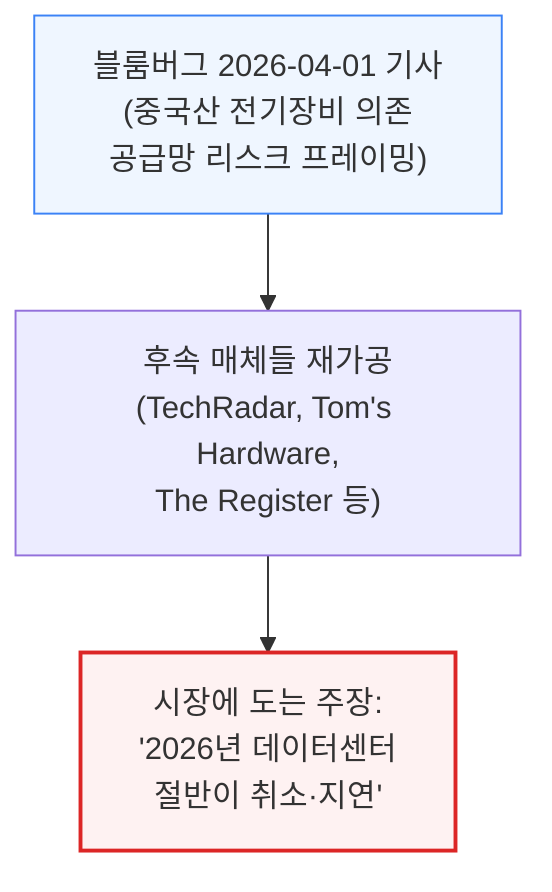
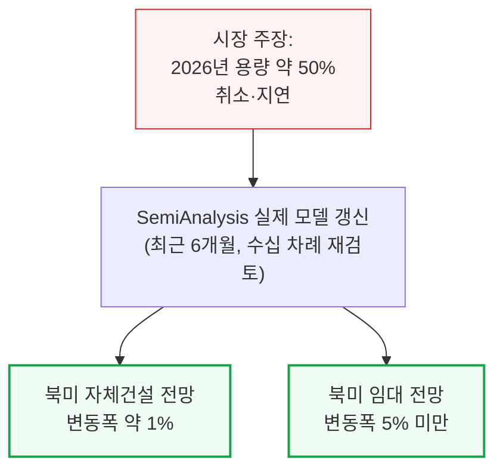
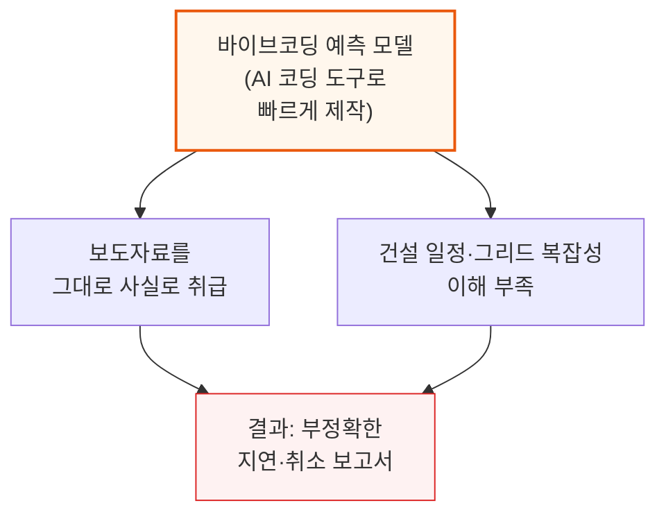
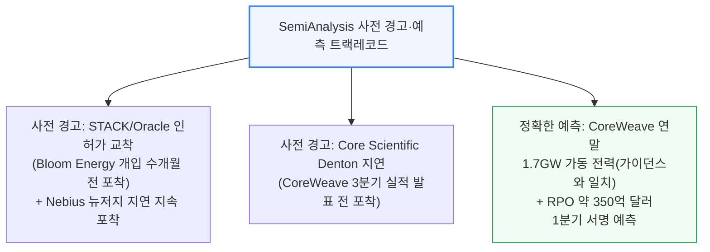
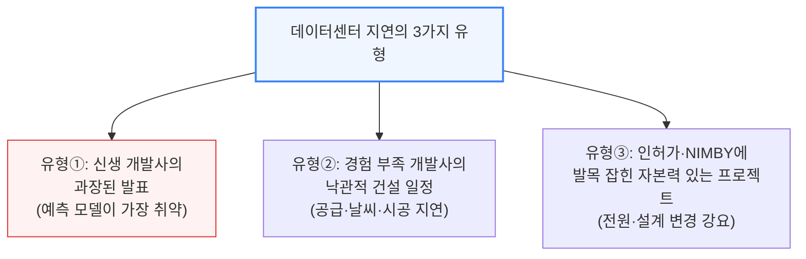
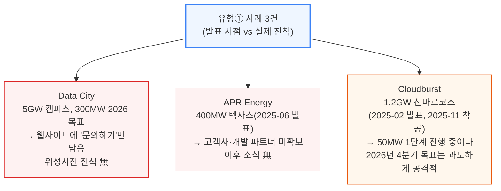

# Stop Saying Half of 2026 US Datacenter Capacity Is Canceled

> **출처**: [SemiAnalysis Newsletter](https://newsletter.semianalysis.com/p/stop-saying-half-of-2026-us-datacenter)
> **저자**: Dylan Patel
> **발행일**: 2026-06-19

---

## 📑 목차

### 전체 섹션
 1. [서론: "절반이 취소됐다"는 주장의 출처](#1-서론-절반이-취소됐다는-주장의-출처)
 2. [데이터센터 지연의 3가지 유형](#2-데이터센터-지연의-3가지-유형)
 3. [유형 1: 신생 개발사의 과장된 발표](#3-유형-1-신생-개발사의-과장된-발표)
 4. [유형 2: 경험 부족 개발사의 낙관적 건설 일정](#4-유형-2-경험-부족-개발사의-낙관적-건설-일정)
 5. [유형 3: 인허가와 지역 반대에 발목 잡힌 프로젝트](#5-유형-3-인허가와-지역-반대에-발목-잡힌-프로젝트)
 6. [공포를 부추기는 3가지 노이즈](#6-공포를-부추기는-3가지-노이즈)
 7. [SemiAnalysis 2026년 전망이 흔들리지 않는 이유](#7-semianalysis-2026년-전망이-흔들리지-않는-이유)
 8. [초기 단계 프로젝트는 구조적 공급 과잉](#8-초기-단계-프로젝트는-구조적-공급-과잉)
 9. [선두 운영사의 제약 돌파 플레이북](#9-선두-운영사의-제약-돌파-플레이북)
10. [SemiAnalysis가 다르게 조사하는 방법](#10-semianalysis가-다르게-조사하는-방법)
11. [장비 공급사 우려도 근거가 약하다](#11-장비-공급사-우려도-근거가-약하다)
12. [2026년 하반기 주목할 변곡점](#12-2026년-하반기-주목할-변곡점)
13. [TeraWulf 주력 사이트의 지연 가능성](#13-terawulf-주력-사이트의-지연-가능성)

---

## 🔑 용어 정리

본문을 순서대로 읽기 전에 알아두면 좋은 용어들입니다. 자세한 수치와 설명은 본문에서 처음 등장하는 위치에 나옵니다.

- **바이브코딩(Vibe-coding) 예측 모델**: 개발자가 세부 로직을 하나하나 검증하지 않고 AI 코딩 도구(Claude Code 등)에게 대략적인 지시만 내려 빠르게 결과물을 뽑아내는 방식 — 데이터센터 예측에 쓰이면 보도자료 속 발표 용량을 검증 없이 그대로 확정치로 입력하는 문제가 생김
- **RPO (Remaining Performance Obligation, 잔여 계약이행 금액)**: 기업이 이미 계약을 맺었지만 아직 매출로 인식하지 못한 미래 수주 잔액 — 데이터센터·클라우드 기업의 향후 성장 체력을 가늠하는 지표로 쓰임
- **BTM (Behind-the-Meter, 계량기 뒤편 자가발전)**: 전력망에 연결하지 않고 부지 안에 발전기·터빈·연료전지를 직접 지어 전기를 공급하는 방식 — 그리드 연결 대기를 건너뛸 수 있음
- **인터커넥션 대기열 (Interconnection Queue, 그리드 연결 대기열)**: 발전·수요 설비가 전력망에 연결되기 전 통과해야 하는 심사·승인 절차의 대기 줄 — 신청 건수가 실제 그리드 용량을 훨씬 초과해 심사만 몇 년씩 걸림
- **모라토리엄 (Moratorium, 인허가 동결)**: 지자체·주 정부가 환경·에너지·경제 영향을 검토할 시간을 벌기 위해 신규 건설 인허가를 일시적으로 중단시키는 입법 조치
- **NIMBY (Not In My Backyard, 님비)**: "우리 동네에는 안 된다"는 지역 주민의 반대 운동 — 데이터센터의 소음·전력·수자원 사용에 대한 우려로 인허가 절차를 늦추거나 무산시킴
- **MEP (Mechanical, Electrical, Plumbing, 기계·전기·배관 설비 공사)**: 건물 골조(셸)가 다 올라간 뒤 냉각기·배전반·배관 등 실제 가동에 필요한 설비를 설치하는 공정 — 골조보다 훨씬 오래 걸리는 경우가 많아 완공 지연의 주요 원인이 됨

---

## 1. 서론: "절반이 취소됐다"는 주장의 출처

**📌 핵심:**
- 2026년 미국 데이터센터 용량의 절반이 지연·취소된다는 주장이 금융·소셜 미디어에 널리 퍼짐 — 출처는 블룸버그의 2026년 4월 1일 기사로, 원래는 "중국산 전기 장비 의존"이라는 공급망 리스크를 다뤘을 뿐인데 후속 매체들이 "절반 취소"로 자극적으로 재가공
- SemiAnalysis는 지난 6개월간 데이터센터 모델을 수십 차례 갱신했지만, 2026년 말 기준 북미 자체건설(Hyperscaler Self-build) 전망은 약 1%, 임대(Colocation) 전망은 5% 미만만 움직임 — "절반이 취소"라는 주장과 정면으로 배치
- 이 괴리의 원인은 근거 없이 급증한 바이브코딩(감으로 대충 코딩) 데이터센터 예측 모델 — Claude Code 같은 AI 코딩 도구로 보도자료를 그대로 사실로 취급해 만든 모델들이 줄줄이 등장했고, 전부 틀렸음
- 결론: SemiAnalysis는 한 주에 17만 달러 이상을 Claude Code에 직접 쓰는 헤비유저로서 이 도구가 어디서 틀리는지 정확히 알고 있으며, 이 리포트는 진짜 지연 사례와 가짜 공포 사례를 구분해 보여줌

---

**📌 용어 풀이: 왜 SemiAnalysis 모델은 다른가**
> - Claude Code를 포함한 AI 코딩 도구 자체가 문제가 아니라, "GW급 발표를 검증 없이 확정치로 넣는" 사용 방식이 문제 — SemiAnalysis도 Claude Code를 적극 활용하지만, 실측 위성사진과 지역 인허가 서류로 매 발표를 교차검증
> - 아래는 그 트랙레코드 중 일부입니다.

실제 지연·취소는 분명히 존재합니다. 다만 그 원인과 규모를 정확히 짚어내려면, 먼저 지연이 발생하는 유형부터 구분해야 합니다.

---

## 2. 데이터센터 지연의 3가지 유형

**📌 핵심:**
- SemiAnalysis는 데이터센터 지연을 3가지 유형으로 나눠 분석 — ① 신생 개발사의 과장된 발표 ② 경험 부족 개발사의 낙관적 건설 일정 ③ 인허가·지역 반대(NIMBY)에 발목 잡힌 자본력 있는 프로젝트
- 유형별로 원인과 대응이 다름: 유형①은 예측 단계에서 걸러내야 하고, 유형②는 건설 실무 지식으로 미리 반영하며, 유형③은 개별 인허가 절차를 계속 추적해야 함
- 바이브코딩 예측 모델이 가장 취약한 지점은 유형①(발표를 곧이곧대로 믿는 것) — SemiAnalysis는 발표 단계 프로젝트를 애초에 낮은 확률로 처리해 최종 모델에서 걸러냄
- 결론: 아래 3개 장에서 각 유형의 실제 사례를 하나씩 짚음

---

---

## 3. 유형 1: 신생 개발사의 과장된 발표

**📌 핵심:**
- 신규 진입자는 초기 단계 프로젝트인데도 GW급 규모와 공격적인 완공 일정을 발표해 주목을 끄는 경우가 많음 — 실제로는 부지 매입부터 데이터센터 완공까지 보통 4년 이상 걸림
- 무명 개발사가 2025년에 "2026년 가동"을 발표하면 경고 신호로 봐야 함 — 실제 사례 3건(Data City, APR Energy, Cloudburst) 모두 발표 시점에 위성사진상 물리적 진척이 거의 없었음
- Data City(5GW 캠퍼스, 300MW 2026년 목표)는 발표 후 "문의하기" 버튼만 남은 웹사이트로 방치됐고, APR Energy(400MW 텍사스, 2025년 6월 발표)는 아직 고객사도 없이 개발 파트너를 찾는 중이었음
- 결론: Cloudburst(1.2GW, 텍사스 산마르코스)처럼 실제 착공(2025년 11월)해 진척 중인 프로젝트도, 최초 발표(2025년 2월)의 "2026년 3분기 가동" 목표는 인허가도 안 끝난 상태에서 나온 비현실적 일정 — 바이브코딩 모델은 이런 초기 발표를 그대로 "지연된 2026년 용량"으로 잘못 집계

---

Cloudburst는 2026년 4월 지역 카운티로부터 100억 달러 이상 규모 프로젝트 승인을 받아내는 등 실제로 진척을 내고 있는 개발사입니다. 다만 셸(건물 골조) 착공조차 시작되지 않은 실시간 위성사진 기준으로는, 2026년 4분기 50MW 가동 목표가 여전히 무리한 일정입니다.

**📌 용어 풀이: 왜 "부지 매입 후 4년"이 기준선인가**
> - 데이터센터 하나가 완공되려면 부지 확보 → 전원 확보(그리드 연결 또는 자가발전) → 인허가 승인 → 장비 발주(변압기 등은 리드타임 1년 이상) → 셸 시공 → MEP(설비) 공사·시운전까지 순차적으로 거쳐야 함
> - 이 전체 사이클이 통상 4년 이상 걸리기 때문에, 2025년에 발표된 신규 프로젝트가 2026년 가동을 약속하면 이 사이클 대부분을 건너뛴 셈 — 검증되지 않은 발표라는 신호

---

*작성 진행률: 약 23% 완료 (13개 섹션 중 3개 작성)*
*업데이트: 헤더·목차·용어 정리 및 1\~3장(서론, 지연의 3가지 유형, 유형1 신생 개발사 사례) 작성 완료*
