# Claude Code is the Inflection Point

> **출처**: [https://newsletter.semianalysis.com/p/claude-code-is-the-inflection-point](https://newsletter.semianalysis.com/p/claude-code-is-the-inflection-point)
> **저자**: Doug O'Laughlin
> **발행일**: 2026-02-06

📑 목차
 1. [서론: AI가 소프트웨어 개발을 흡수하다](#1-서론-ai가-소프트웨어-개발을-흡수하다)
 2. [에이전틱 미래와 Claude Code의 위치](#2-에이전틱-미래와-claude-code의-위치)
 3. [Claude Code란 무엇인가](#3-claude-code란-무엇인가)
 4. [코딩을 넘어: 정보 노동 전체가 타겟](#4-코딩을-넘어-정보-노동-전체가-타겟)
 5. [도입 제약: 과업 지평선(Task Horizon)](#5-도입-제약-과업-지평선task-horizon)
 6. [지능 가격의 붕괴](#6-지능-가격의-붕괴)
 7. [경쟁 구도: 마이크로소프트의 딜레마](#7-경쟁-구도-마이크로소프트의-딜레마)
 8. [앤트로픽이 이기는 이유: 토큰 효율성](#8-앤트로픽이-이기는-이유-토큰-효율성)
 9. [프리트레인이 여전히 중요한가](#9-프리트레인이-여전히-중요한가)
10. [세미애널리시스의 바이브 코딩 사례와 결론](#10-세미애널리시스의-바이브-코딩-사례와-결론)

🔑 용어 정리
- **에이전틱 AI (Agentic AI)**: 질문에 답만 하는 챗봇과 달리, 목표를 주면 스스로 계획을 세우고 여러 단계를 실행해 결과물까지 만들어내는 AI
- **Claude Code**: 코드 편집기 플러그인이 아니라 터미널(명령줄)에서 동작하는 AI 에이전트 — 컴퓨터 환경을 읽고 계획을 세운 뒤 실제로 실행까지 하는 도구
- **과업 지평선 (Task Horizon)**: AI 에이전트가 실패 없이 혼자 처리할 수 있는 작업의 최대 소요 시간 — 이 시간이 길어질수록 맡길 수 있는 일의 범위가 커짐
- **바이브 코딩 (Vibe Coding)**: 사람이 코드를 직접 짜지 않고, AI에게 원하는 결과를 말로 설명해 대신 작성하게 하는 개발 방식
- **프리트레인 (Pretrain)**: 모델을 처음부터 대규모 데이터로 새로 학습시키는 과정 — 기존 모델을 미세조정하는 것과 달리 근본적인 능력 자체를 바꿈
- **토큰 효율성 (Token Efficiency)**: 같은 작업을 더 적은 토큰(AI가 처리하는 텍스트 단위)으로 끝낼 수 있는 능력 — 토큰을 아낄수록 오차가 덜 쌓여 긴 작업도 끝까지 해낼 확률이 높아짐
- **MCP (Model Context Protocol)**: AI 에이전트가 외부 도구·데이터·다른 에이전트와 표준화된 방식으로 연결되도록 만든 프로토콜
- **Cowork**: 앤트로픽이 내놓은 "일반 컴퓨터 작업용 Claude Code" — 터미널 대신 데스크톱 환경에서 파일 정리, 보고서 작성 등 사무 작업을 대신 처리하는 에이전트

---

## 1. 서론: AI가 소프트웨어 개발을 흡수하다

**📌 핵심:**
- GitHub 공개 커밋의 **4%**를 지금 Claude Code가 작성 중이며, 이 추세라면 **2026년 말까지 일일 커밋의 20% 이상**을 차지할 전망
- SemiAnalysis는 Tokenomics 모델로 앤트로픽의 매출·설비투자가 AWS·구글클라우드·애저 등 클라우드 파트너와 Trainium2/3·TPU·GPU 공급망에 미치는 영향을 정량화
- 앤트로픽은 향후 3년간 오픈AI만큼의 전력(연산 인프라)을 확보할 궤도에 있으며, 연산력 확대는 매출 증가로 직결돼 분기별 신규 매출(ARR) 증가폭에서 이미 오픈AI를 추월
- 결론: 오픈AI가 데이터센터 건설 지연을 겪는 동안(코어위브 2025년 3분기 실적 프리뷰에서 설비투자 미스를 미리 지적한 바 있음), 앤트로픽은 연산력 격차를 매출 우위로 전환 중

---

자매 매체 Fabricated Knowledge는 소프트웨어를 인터넷 부상기의 지상파 TV에 비유하며, Claude Code의 부상을 D램과 낸드의 관계처럼 소프트웨어 위에 놓이는 새로운 지능 계층이라고 평가합니다.

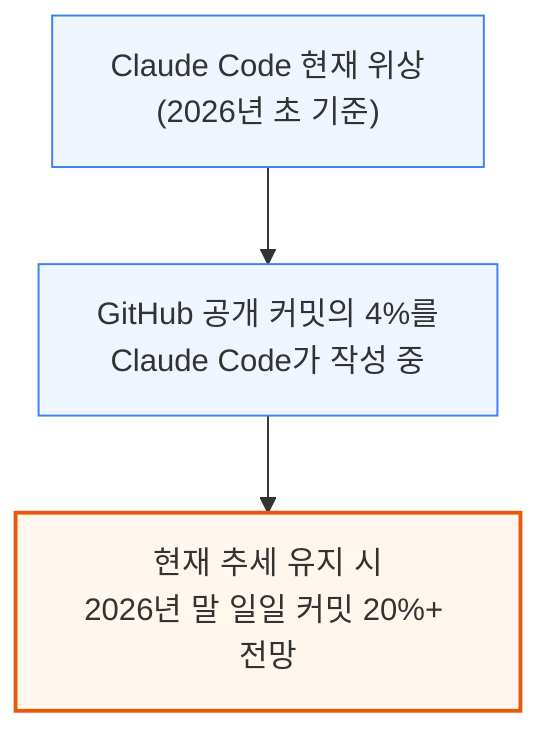

연산력 확대가 곧바로 매출 증가로 이어진다는 논리로, SemiAnalysis Tokenomics 모델은 앤트로픽과 오픈AI의 매출 궤적을 직접 비교합니다.

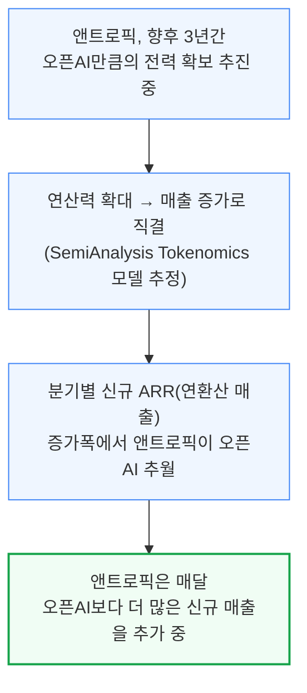

오픈AI는 여러 데이터센터 건설 지연을 겪고 있는데, SemiAnalysis는 이를 코어위브 2025년 3분기 실적 프리뷰에서 설비투자 미스로 이미 몇 달 앞서 지적한 바 있습니다. 앤트로픽의 성장은 결국 연산력(컴퓨트) 자체에 의해 제약될 것으로 보입니다.

---

## 2. 에이전틱 미래와 Claude Code의 위치

**📌 핵심:**
- 에이전트는 사람이 AI와 상호작용하는 주된 방식이 될 전망이며, Claude Code는 반대로 에이전트가 사람과 상호작용하는 방식까지 보여주는 사례
- AI의 미래는 토큰을 원가에 파는 것이 아니라 토큰을 **조율(오케스트레이션)**하는 것 — 이는 인터넷 초기 TCP/IP가 그 자체로는 가치가 작았지만, 그 위에 쌓인 애플리케이션이 수조 달러 가치를 만든 것과 같은 구조
- GPT-3(스케일링 증명) → 스테이블 디퓨전(이미지 생성 증명) → ChatGPT(지능 수요 증명) → 딥시크·o1(효율·성능 증명)을 거쳐, Claude Code는 모델 출력을 에이전트로 조직화하는 새로운 돌파구로 평가
- 결론: 2023년 초 ChatGPT 모먼트에 맞먹거나 능가하는 또 다른 변곡점에 AI 업계가 도달

---

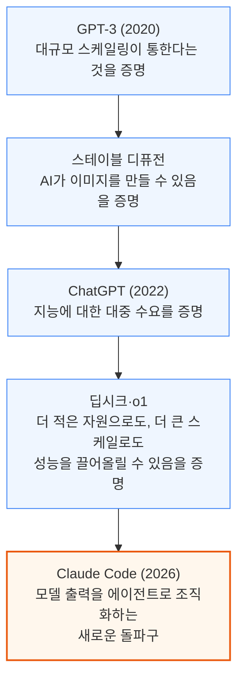

스튜디오 지브리풍 이미지처럼 화제가 된 순간들은 확산의 지점일 뿐이고, Claude Code는 에이전틱 계층 자체의 새로운 돌파구라는 게 저자의 시각입니다. 이 흐름을 인터넷 프로토콜 역사에 빗대면 다음과 같습니다.

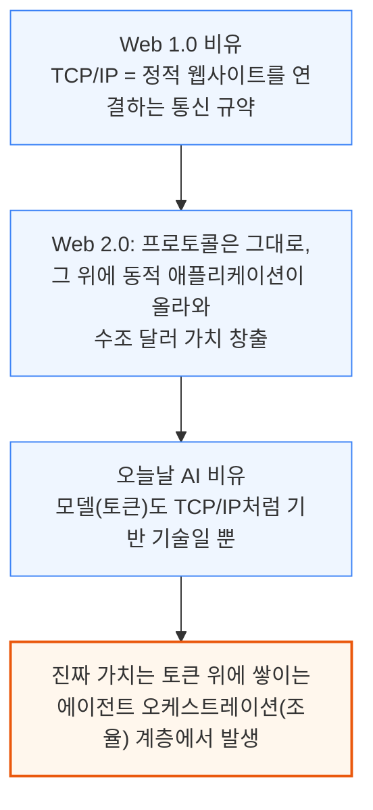

---

## 3. Claude Code란 무엇인가

**📌 핵심:**
- Claude Code는 Cursor 같은 IDE(코드 편집기)나 챗봇 사이드바가 아니라, 터미널에서 코드베이스를 읽고 다단계 작업을 계획한 뒤 직접 실행하는 CLI(명령줄) 도구 — 사실상 컴퓨터 전체를 다루는 "Claude Computer"에 가까움
- Node.js 창시자 Ryan Dahl은 "사람이 코드를 직접 짜는 시대는 끝났다"고, Claude Code 개발자 Boris Cherny는 "우리 코드의 거의 100%가 Claude Code + Opus 4.5로 작성된다"고 언급
- SemiAnalysis 내부에서도 데이터센터 모델팀(주간 수백 건 문서 검토), AI 공급망팀(수천 줄 BOM 검수), 메모리 모델팀(실시간 시황 전망)이 이미 Claude Code로 업무를 처리 중
- 결론: 경쟁의 축이 모델 벤치마크 순위에서, 도구·메모리·서브에이전트·검증 루프를 조율해 만들어내는 최종 결과물 자체로 이동 중

---

Claude Code는 목표와 결과물을 자연어로 설명하면, 스프레드시트·코드베이스·웹페이지 링크 등을 입력받아 계획을 세우고 검증한 뒤 실행까지 완료합니다.

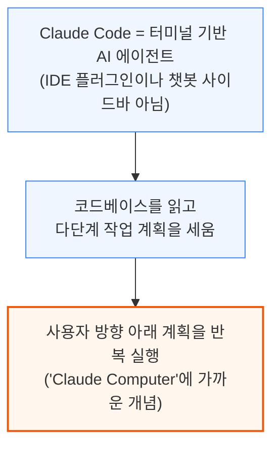

유명 엔지니어들도 이미 바이브 코딩으로 넘어가고 있습니다.

- **Andrej Karpathy** (바이브 코딩 용어를 1년 전 처음 사용): "손으로 코드 짜는 능력이 서서히 퇴화하고 있음을 느낀다 — 코드를 생성하는 능력과 읽어내는 능력은 뇌에서 서로 다른 영역"
- **Malte Ubl** (Vercel CTO): "이제 내 새로운 주 업무는 AI가 뭘 잘못했는지 알려주는 것"
- **Ryan Dahl** (Node.js 창시자): "사람이 코드를 직접 짜는 시대는 끝났다"
- **David Heinemeier Hansson** (Ruby on Rails 창시자): 손으로 코드를 짜는 것을 "이제 곧 사라질 특권"이라 표현하며 향수를 느낌
- **Boris Cherny** (Claude Code 개발자): "우리 코드의 거의 100%가 Claude Code + Opus 4.5로 작성된다"
- **Linus Torvalds**도 바이브 코딩에 동참 (AudioNoise 프로젝트)

SemiAnalysis 내부에서도 업무 성격에 따라 Claude Code를 다르게 활용합니다.

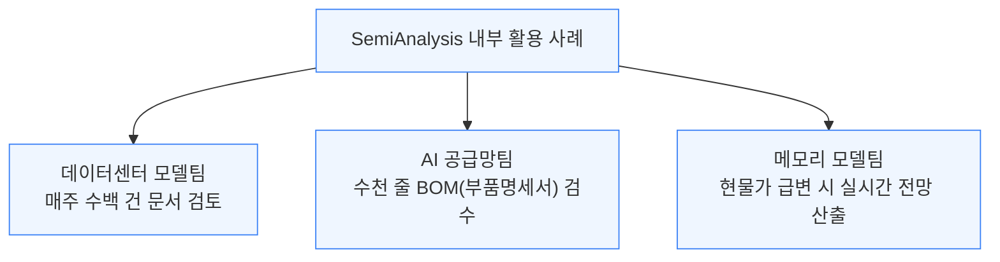

기술 스태프는 InferenceMAX 대시보드를 운영하며 9종의 시스템·클러스터에서 매일 밤 최신 소프트웨어 레시피를 자동 실행합니다. 산업모델 분석가들은 스프레드시트를 입력하면 Claude Code가 트렌드를 짚어내는 다이어그램·분석을 생성하는 식으로 활용합니다.

이제 코더는 코드를 직접 짜기보다 작업을 대신 요청하는 쪽으로 옮겨가고 있으며, 경쟁의 축도 달라지고 있습니다.

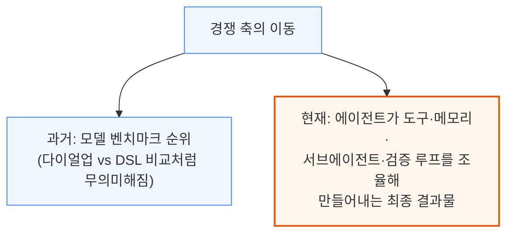

Opus 4.5는 이 모든 것을 가능케 하는 엔진이며, 선형 벤치마크에서 중요했던 지표가 장기 과업(long horizon)을 수행하는 에이전트에는 그다지 중요하지 않을 수 있다는 점은 8장에서 자세히 다룹니다.

---

## 4. 코딩을 넘어: 정보 노동 전체가 타겟

**📌 핵심:**
- 코딩은 자동화의 최종 목적지가 아니라 첫 교두보 — 전 세계 정보 노동자는 10억 명 이상(전체 노동인구 36억 명의 약 1/3, 국제노동기구 ILO 기준)이고, 잠재 시장은 **15조 달러 규모** 정보 노동 경제 전체
- 거의 모든 정보 노동은 READ(비정형 정보 수집) → THINK(도메인 지식 적용) → WRITE(정형 결과물 작성) → VERIFY(기준 대조 검증)라는 동일한 워크플로우를 공유하며, Claude Code가 소프트웨어에서 이미 증명한 패턴
- 고객지원·소프트웨어 개발 같은 틈새 시장에서 시작해 금융서비스·법률·컨설팅 등 주류 산업으로 에이전트 AI의 총유효시장(TAM)이 확장되는 중
- 결론: 에이전트가 소프트웨어를 먹어치울 수 있다면, 남는 노동 시장은 생각보다 많지 않음

---

2020년대 초 소프트웨어 엔지니어링 붐 때만 해도 프로그래머는 가장 수요가 높은 직군이었지만, 이제 코딩은 정보 노동 자동화의 첫 사례일 뿐입니다.

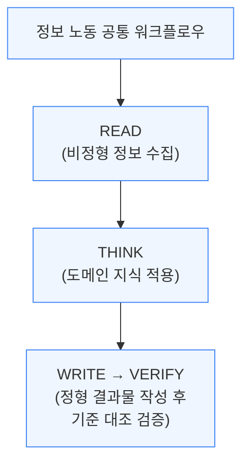

이 워크플로우는 연구를 포함한 대다수 정보 노동자의 업무와 겹칩니다. 맥킨지·모르도르 인텔리전스·그랜드뷰리서치·프리시던스리서치 등 여러 시장조사기관의 전망을 종합하면, 에이전트 AI의 잠재 시장은 LLM 자체보다 훨씬 큰 정보 노동 경제 전체로 확장됩니다.

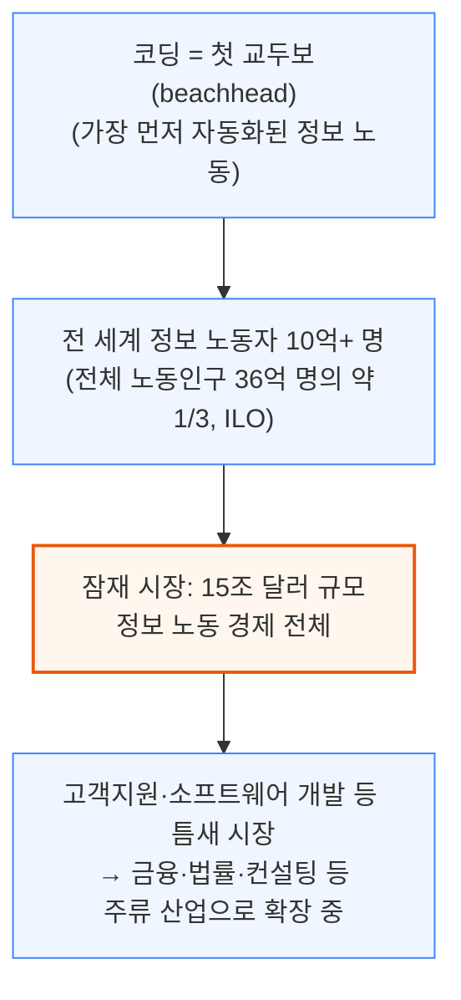

이는 SemiAnalysis Tokenomics 모델이 추가 킬러 유스케이스와 TAM을 계속 추적하는 핵심 이유이기도 합니다.

---

## 5. 도입 제약: 과업 지평선(Task Horizon)

**📌 핵심:**
- 에이전트가 실패 없이 혼자 작업할 수 있는 시간(과업 지평선)이 METR 측정 기준 **4\~7개월마다 2배**로 늘고 있으며, 2024\~2025년엔 그 주기가 약 4개월로 가속
- 지평선이 늘어날 때마다 자동화 가능한 범위가 커짐: 30분 → 코드 스니펫 자동완성, 4.8시간 → 모듈 하나 통째 리팩터링, 며칠 단위 → 감사(audit) 업무 전체 자동화
- 앤트로픽은 2026년 1월 12일 "일반 컴퓨터 작업용 Claude Code"인 **Cowork**를 출시 — 엔지니어 4명이 10일 만에 개발했고, 코드 대부분을 Claude Code 스스로 작성
- 결론: Stack Overflow 2025 설문에서 코더의 84%가 AI를 쓰지만 코딩 에이전트 사용은 31%뿐이라, 코딩보다 넓은 정보 노동 전반의 AI 확산은 이제 막 시작하는 단계

---

작업 지평선이 길어질수록 자동화 가능한 파이의 크기가 커집니다.

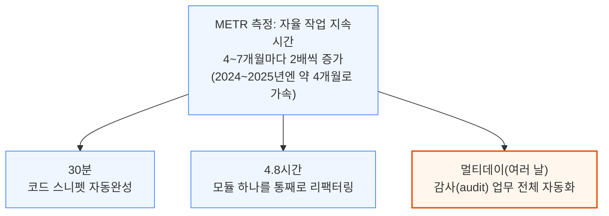

앤트로픽도 이 흐름을 명확히 인식하고 있습니다. Cowork는 터미널 대신 데스크톱에서 동작하는 Claude Code로, 영수증을 스프레드시트로 정리하거나 내용 기준으로 파일을 자동 분류하고, 흩어진 메모에서 보고서를 작성합니다.

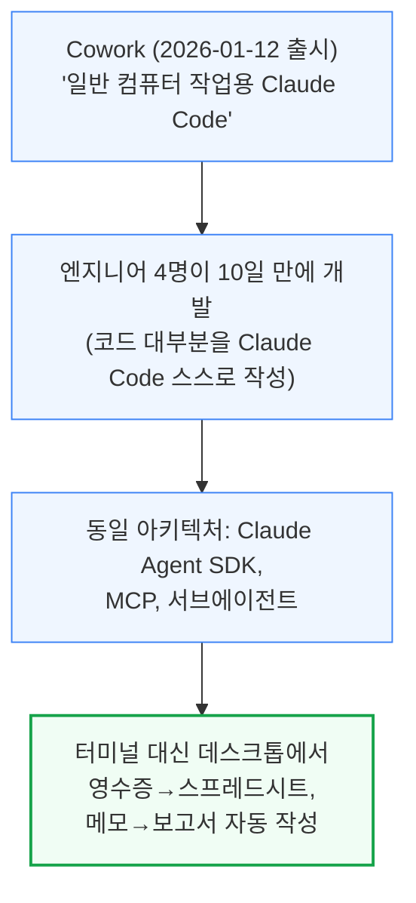

예를 들어 매출 목표 관련 자료가 필요할 때, 에이전트가 UI나 API에서 정보를 직접 추출해 보고서까지 대신 만들어주는 방식입니다. 완벽하지는 않지만 대부분의 사람보다 더 빠르게 정보를 처리·종합·정리할 수 있고, 환각(hallucination) 위험은 있으나 사람이 이끄는 기존 프로세스에도 이미 오류가 존재한다는 점은 동일합니다. 정보가 쓸 만한 수준의 정확도로 처리돼 다음 단계로 넘어가기만 해도, 일할 수 있는 노동의 총량 자체가 크게 늘어납니다.

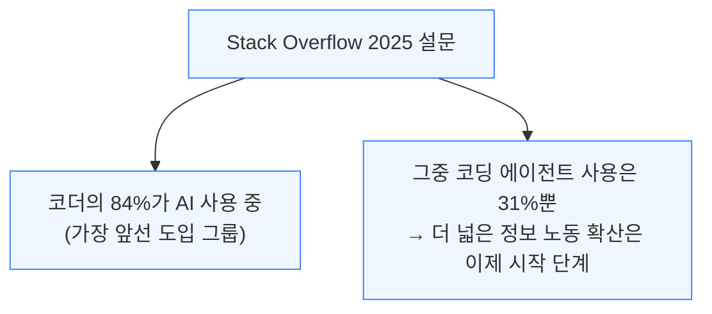

코딩 에이전트가 순식간에 퍼진 것처럼, 더 넓은 정보 노동에서도 AI 도입은 빠르게 확산될 전망입니다.

---

## 6. 지능 가격의 붕괴

**📌 핵심:**
- Claude Pro/ChatGPT 월 **$20**, Claude Max 월 **$200**인데, 미국 지식노동자 완전부담 비용은 하루 **$350\~500** — 에이전트가 업무 일부만 대신해도 일 $6\~7 수준이면 **ROI 10\~30배**(지능 개선 효과는 별도)
- 액센츄어는 전문인력 **3만 명**에게 Claude 교육을 진행하는 역대 최대 규모 배포 계약을 체결(금융서비스·생명과학·헬스케어·공공부문 대상), 오픈AI도 엔터프라이즈 전용 "Frontier"로 맞대응
- SaaS의 3대 해자(데이터 전환비용·워크플로우 락인·통합 복잡성)가 에이전트에 의해 동시에 침식 — 매출총이익률 75%인 SaaS의 마진 자체가 AI의 첫 공략 대상
- 결론: 사람이 버튼을 눌러 정보를 모으고 다른 형식(이메일·차트·엑셀·프레젠테이션)으로 바꾸는 모든 업무가 자동화 위험에 노출되며, 이는 마이크로소프트 같은 좌석당 과금 소프트웨어 기업에 특히 큰 위협

---

소프트웨어 엔지니어링은 늘 정보 노동의 최고봉이었지만, 이제 코더와 도구의 관계가 뒤집혔습니다. 지능의 품질뿐 아니라 원가도 극적으로 떨어졌기 때문입니다.

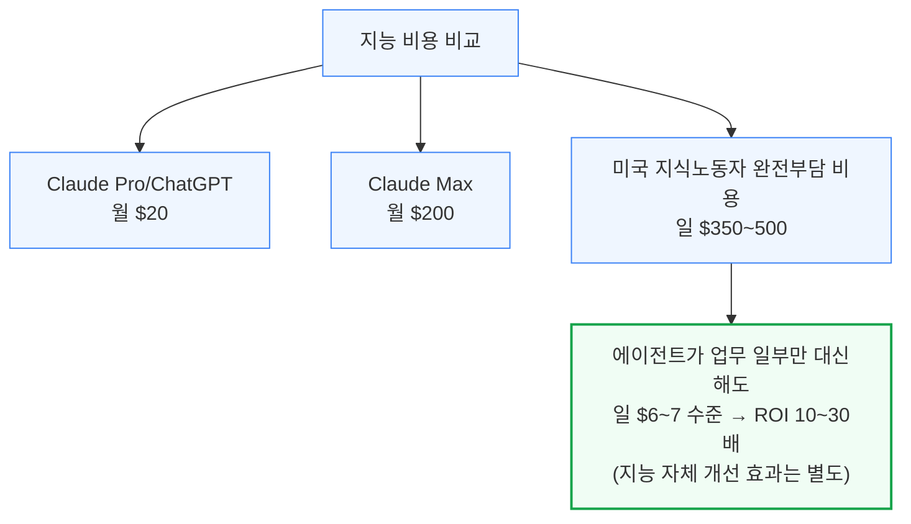

기업도 이미 움직이고 있습니다.

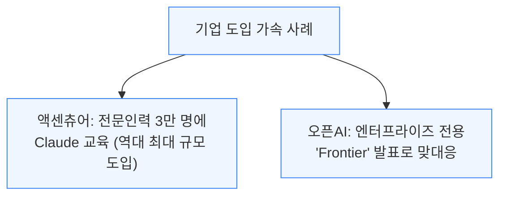

SaaS는 워크플로우를 코드로 굳힌 것에 불과하며, 그동안 지켜온 3대 해자가 에이전트에 의해 동시에 흔들리고 있습니다.

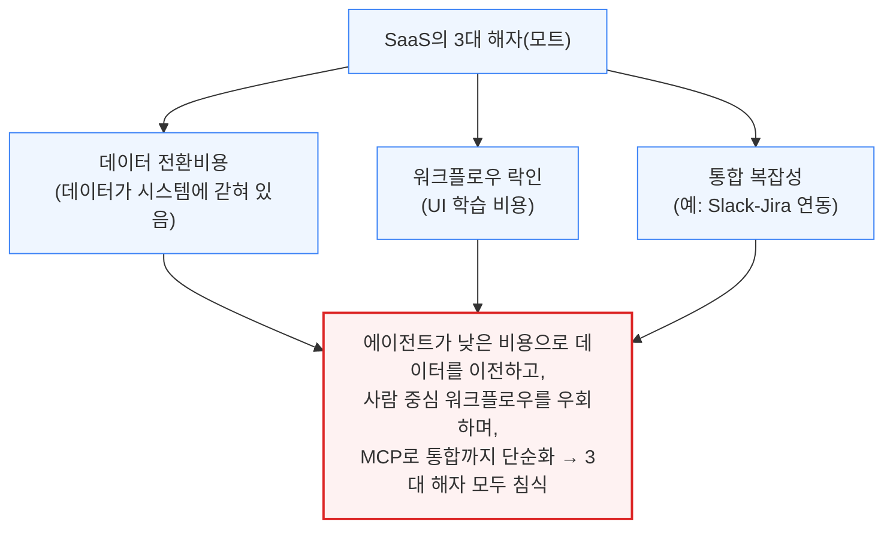

예를 들어 에이전트가 Postgres 데이터베이스를 직접 조회해 차트를 만들고 담당자에게 이메일로 보내면, 기존 CRM SaaS가 하던 워크플로우를 UI 학습이나 소프트웨어 업데이트 없이 대체할 수 있습니다. BI·데이터 입력, ITSM 1\~2차 티켓 처리, 백오피스 정산 업무가 이미 자동화 대상에 오르고 있으며, 이는 소프트웨어 업계에서 가장 신성했던 해자들의 문을 두드리는 중입니다.

사람이 버튼을 눌러 정보를 모으고 다른 매체(이메일·차트·엑셀·프레젠테이션)로 바꾸는 모든 업무는 큰 위험에 노출돼 있습니다. LLM은 이런 형태의 데이터 변환에 특히 강하며, 이는 마이크로소프트 같은 세계 최대 기업 중 하나에 큰 위협이 됩니다.

---

## 7. 경쟁 구도: 마이크로소프트의 딜레마

**📌 핵심:**
- 비용 붕괴가 가장 먼저 무너뜨리는 대상은 좌석당 과금(Seat-based) 소프트웨어 — 대표 사례가 마이크로소프트 Office 365이며, 세일즈포스·태블로·피그마 등 사람 중심 UX 소프트웨어 전반이 같은 위험에 노출
- 마이크로소프트는 두 사업 사이에 낀 처지: 공개 시장 투자자가 원하는 애저(Azure) 성장은 GPU를 오픈AI·앤트로픽 등에 임대해야 커지고, 자사 Copilot·Office 365 수성은 그 GPU를 자체 AI 인재에게 우선 배분해야 함
- Claude for Excel은 사실상 마이크로소프트의 Copilot for Excel이 해야 했을 역할을 외부 업체가 대신 해낸 사례 — 애저를 키울수록 자사 생산성 소프트웨어를 위협하는 "성문 앞 야만인"에게 문을 더 열어주는 역설
- 결론: 사티아 나델라 CEO가 일상 경영 대신 사실상 "마이크로소프트 AI 제품 매니저" 역할까지 직접 맡고 나선 것은, 단일 제품의 성패가 회사 전체의 명운을 좌우할 수 있다는 방증

---

비용 붕괴는 좌석당(seat-based) 과금 소프트웨어 모델부터 무너뜨리고 있으며, 그 정의에 가장 가까운 회사가 마이크로소프트입니다.

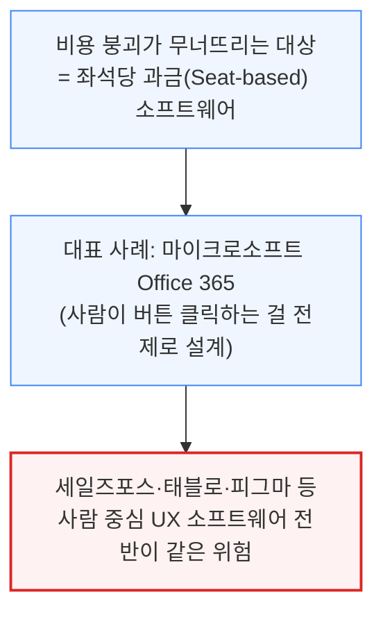

에이전트가 리드 데이터를 알아서 조회해준다면 세일즈포스 같은 폼·워크플로우 래퍼를 표준화할 이유가 줄어듭니다. 마이크로소프트는 정확히 이 오래된 패러다임의 중심에 있으면서 동시에 그 파괴자들에게 GPU를 임대하는 처지입니다.

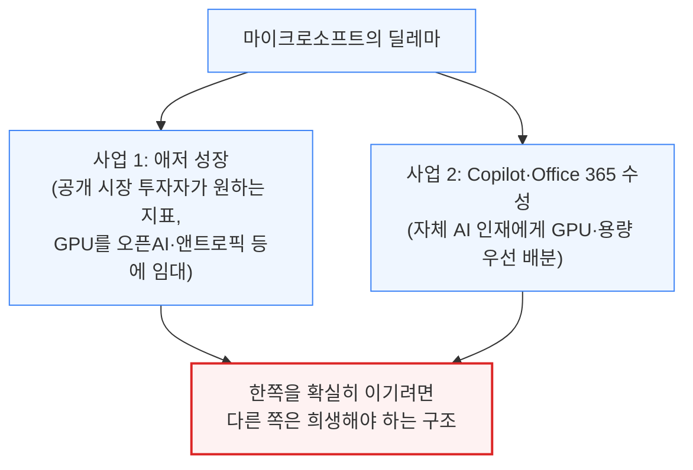

최근 실적발표에서 마이크로소프트 경영진은 다음과 같이 언급했습니다.

- "GPU·용량 상당 부분을 최근 채용한 AI 인재들에게 배분 중이며, 남는 부분이 애저 수요 증가분을 감당한다"
- "장기적 결정을 내리는 중 — 먼저 M365 Copilot과 GitHub Copilot 등 자사 제품 사용 증가를 해결하고, 그다음 장기 R\&D·제품 혁신에 투자한다"

Claude for Excel은 사실상 마이크로소프트의 Copilot for Excel이 해야 했을 역할을 외부 업체가 자사 첫 제품에 먼저 구현한 사례입니다. 마이크로소프트의 현금은 여전히 대부분 Office에서 나오지만, 기업가치(terminal value)의 핵심은 애저 매출 성장에 있어 애저를 키울수록 자사 생산성 소프트웨어를 위협하는 상대에게 문을 더 열어주는 역설에 놓여 있습니다.

- 마이크로소프트의 핵심 AI 파트너인 오픈AI 역시 Claude Code발 엔터프라이즈 잠식 앞에서 신속히 대응하지 못하면, 에이전트(솔루션) 기업이 아니라 토큰만 파는 인프라 기업으로 전락할 위험
- GitHub Copilot과 Office Copilot은 1년의 선행 기간에도 제품으로서 별다른 진전을 보이지 못함
- 사티아 나델라 CEO가 일상 경영 대신 사실상 "마이크로소프트 AI 제품 매니저" 역할까지 직접 맡고 나선 것은, 이 사안이 회사 전체의 명운을 좌우한다는 방증

---

## 8. 앤트로픽이 이기는 이유: 토큰 효율성

**📌 핵심:**
- 벤치마크만 보면 GPT-5.2 High가 SWE-bench에서 동률, MMLU-pro·AIME 2025에서는 오히려 우위인데도 모두가 Opus에 열광하는 역설 — 답은 **토큰 효율성**, 즉 같은 작업을 훨씬 적은 토큰으로 끝내는 능력
- 단일 컨텍스트 윈도우에서 90% 성능이 필요한 작업을 여러 단계에 걸쳐 반복하면, 작은 오차율도 스텝 수가 늘수록 복리처럼 누적돼 최종 실패 확률이 사실상 100%로 수렴 — 토큰을 적게 쓸수록 이 누적 오차가 줄어듦
- 신형 Sonnet 5는 더 작은 모델 크기와 더 큰 컨텍스트 윈도우로 Opus 4.5와 비슷한 성능을 구현할 것으로 알려졌으며, 오픈AI는 대응을 위해 새 프리트레인이 필요하지만 출시까지 "몇 달"이 걸릴 전망
- 결론: 2025년의 "1강 구도"가 2026년엔 3파전으로 재편 — 이미지 모델 소비자 시장은 제미나이가 챗GPT의 자리를 차지했고, 엔터프라이즈·에이전트 시장은 앤트로픽이 주도

---

벤치마크 점수가 비슷하거나 오히려 GPT가 앞서는데도 Claude Code가 압도하는 이유는 토큰 효율성에 있습니다.

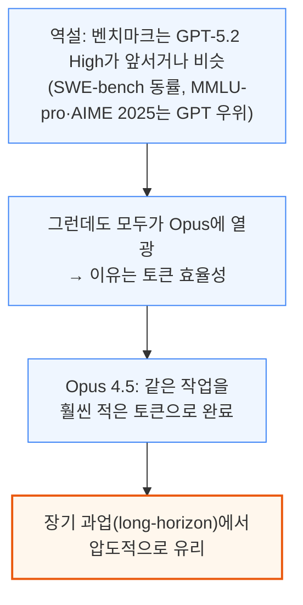

챗GPT는 컨텍스트 윈도우가 훨씬 크지만, 작업당 필요한 토큰 수가 한 자릿수 더 많아 장기 계획을 오히려 무너뜨립니다. 앤트로픽은 토큰을 최대한 많이 쓰는 대신 신호 대 잡음비가 가장 깨끗한 방향을 의도적으로 택했다는 게 저자의 해석입니다. 이는 여러 컨텍스트 윈도우에 걸친 계획에서 특히 중요한데, 누적 오차가 조금만 있어도 장기 과업은 결국 실패하기 때문입니다.

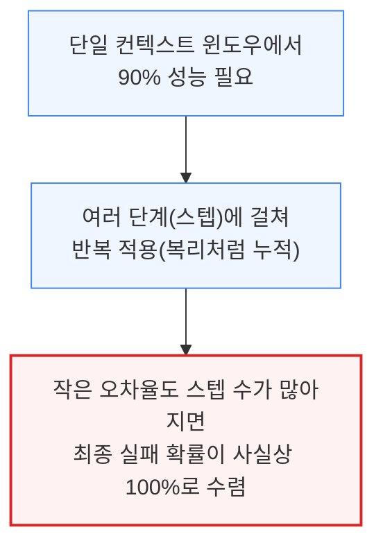

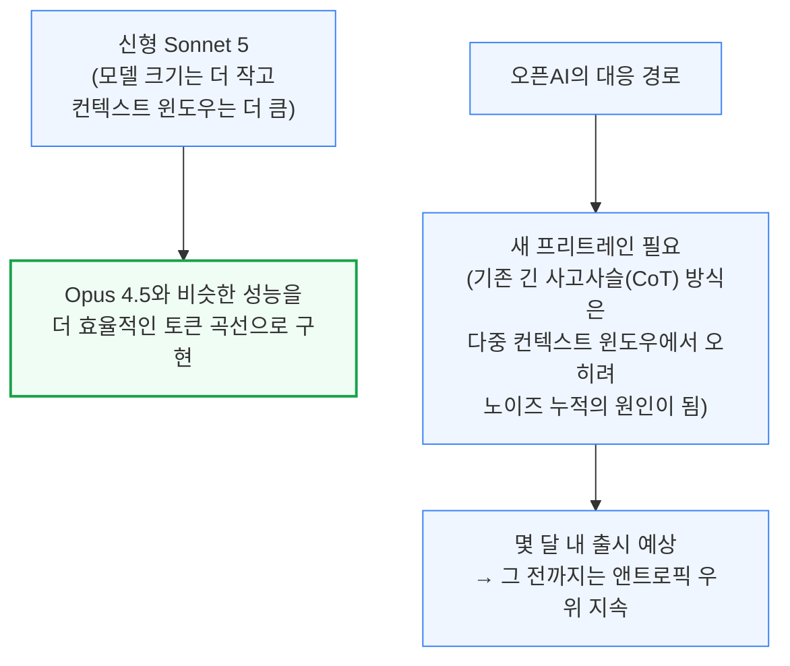

- npm 다운로드 데이터 기준, 오픈AI 코덱스의 실제 도입률은 표면 지표보다 낮음 — VSCode 설치 수는 코덱스가 앞서지만, 깃허브에 개발자가 수백만 명 있는 만큼 설치 수만으로는 실사용을 가늠하기 어려움
- 2025년 "1강 구도"였던 경쟁이 2026년엔 3파전으로: 이미지 모델 소비자 시장은 제미나이가 챗GPT의 자리를 차지, 엔터프라이즈·에이전트 시장은 앤트로픽이 주도

---

## 9. 프리트레인이 여전히 중요한가

**📌 핵심:**
- 문샷 AI의 Kimi 2.5는 벤치마크 성능이 아니라 에이전트 오케스트레이션(조율) 계층 자체를 비공개로 지킬 만큼, 이제 경쟁의 핵심이 모델 대 모델 성능 비교가 아니라 "에이전트들이 함께 무엇을 해내는가"로 이동했음을 보여주는 사례
- Kimi의 PARL(병렬 에이전트 강화학습)은 여러 에이전트를 병렬로 동작시켜 자체 벤치마크에서 Opus 4.5보다 높은 성능을 낸다고 주장 — 에이전트 오케스트레이션이 지난해의 사고사슬(CoT)을 잇는 새로운 성능 축으로 부상
- 다만 앤트로픽 자체 연구에 따르면 추론·행동에 쓰는 시간이 길어질수록 모델이 점점 앞뒤가 안 맞아지는(비일관적이 되는) 현상이 확인돼, 무한정한 에이전트 확장에는 제동이 걸림 — 한 컨텍스트 윈도우 안의 일관성이 에이전트를 몇 개까지 병렬로 늘릴 수 있는지를 좌우
- 결론: 앤트로픽은 연산량(FLOPs)과 전력(MW)에만 성장이 제약되며, 곧 있을 약 3,500억 달러 규모 밸류에이션은 이 기가와트(GW)급 전력 확보 경쟁에 투입될 자금으로 전망 — 다만 오픈AI도 새 프리트레인으로 선두를 되찾을 차례가 남아있어 올해 경쟁 구도는 작년보다 훨씬 유동적

---

TCP/IP 비유를 에이전트에 적용하면, 더 나은 패킷(모델)보다 더 잘 조율된 기능이 중요해질 수 있다는 질문이 나옵니다. Kimi 2.5가 이를 보여주는 사례입니다.

```mermaid
flowchart TD
    A["질문: 프리트레인이 여전히 중요한가"] --> B["Kimi 2.5(문샷 AI) 사례<br/>= 벤치마크 성능이 아니라<br/>에이전트 오케스트레이션 자체를 비공개로 지킴"]
    B --> C["PARL(병렬 에이전트 강화학습)<br/>= 여러 에이전트를 병렬 동작시켜<br/>Opus 4.5보다 높은 성능 (자체 벤치마크)"]
    C --> D["에이전트 오케스트레이션이<br/>새로운 '사고사슬(CoT)'로 부상"]

    classDef default fill:#eff6ff,stroke:#3b82f6,stroke-width:1px;
    classDef highlight fill:#fff7ed,stroke:#ea580c,stroke-width:2px;
    class D highlight;
```

앤트로픽과 제미나이가 작년 초반 RL·사고사슬 변곡점을 충분히 활용하지 못했던 것처럼, 오픈AI도 이번 에이전틱 변곡점에서는 다소 뒤처진 모습입니다. 다만 무한정 에이전트를 늘릴 수 있는 것은 아닙니다.

```mermaid
flowchart TD
    A["앤트로픽 연구 결과<br/>(추론·행동에 쓰는 시간이 길어질수록<br/>모델이 점점 더 앞뒤가 안 맞아짐)"] --> B["추론 토큰이든 에이전트 행동이든<br/>옵티마이저 스텝이든 동일하게 나타나는 현상"]
    B --> C["결론: 한 컨텍스트 윈도우 안에서의<br/>일관성(코히어런스)이 에이전트를<br/>몇 개까지 병렬로 늘릴 수 있는지를 좌우"]

    classDef default fill:#eff6ff,stroke:#3b82f6,stroke-width:1px;
    classDef danger fill:#fef2f2,stroke:#dc2626,stroke-width:2px;
    class C danger;
```

앤트로픽은 능력 자체보다 연산량(FLOPs)과 전력(MW)에 의해서만 성장이 제약될 뿐이라는 게 저자의 시각입니다. 곧 있을 약 3,500억 달러 규모 밸류에이션은 이 기가와트(GW)급 전력 확보 경쟁에 투입될 자금으로 전망됩니다. 다만 오픈AI도 새 프리트레인으로 선두를 되찾을 차례가 남아 있어, 올해 경쟁 구도는 작년보다 훨씬 유동적입니다.

---

*작성 진행률: 약 90% 완료*
*업데이트: 7~9장(마이크로소프트의 딜레마, 앤트로픽 토큰 효율성, 프리트레인 논쟁) 작성 완료*
