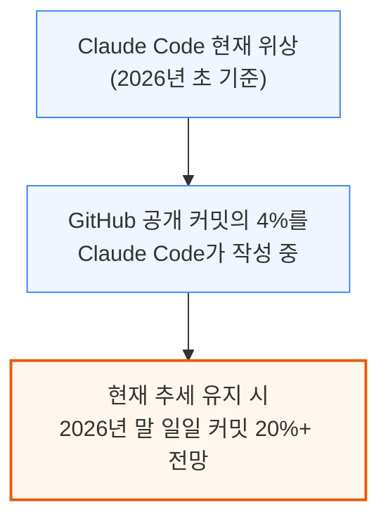
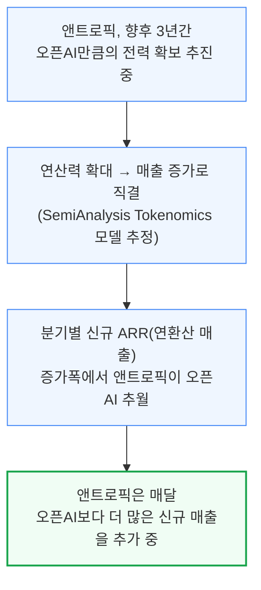
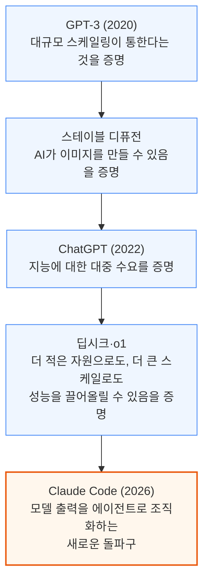
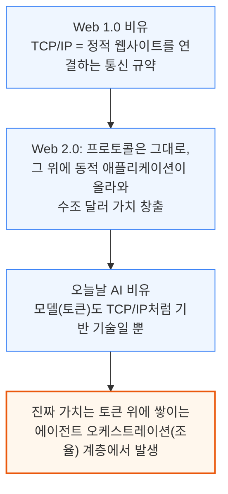
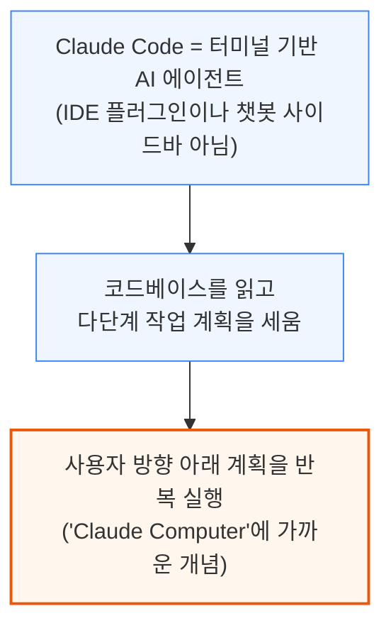
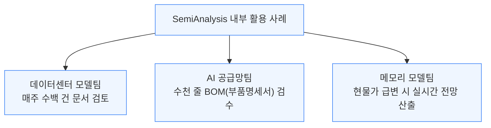
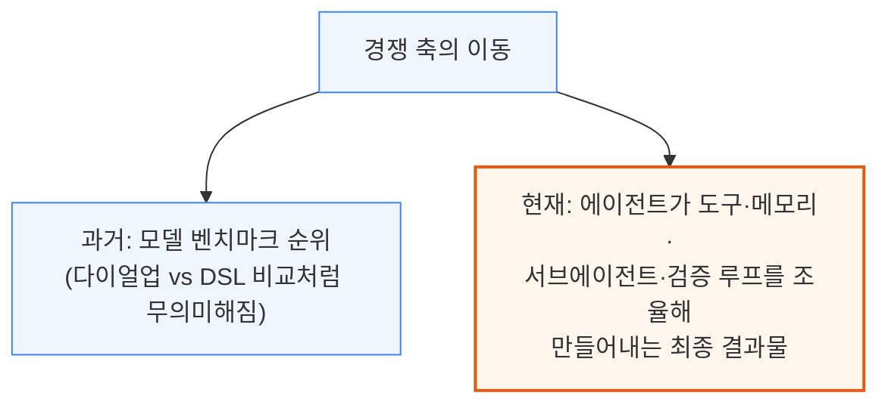

# Claude Code is the Inflection Point

> **출처**: [https://newsletter.semianalysis.com/p/claude-code-is-the-inflection-point](https://newsletter.semianalysis.com/p/claude-code-is-the-inflection-point)
> **저자**: Doug O'Laughlin
> **발행일**: 2026-02-06

📑 목차
 1. [서론: AI가 소프트웨어 개발을 흡수하다](#1-서론-ai가-소프트웨어-개발을-흡수하다)
 2. [에이전틱 미래와 Claude Code의 위치](#2-에이전틱-미래와-claude-code의-위치)
 3. [Claude Code란 무엇인가](#3-claude-code란-무엇인가)
 4. [코딩을 넘어: 정보 노동 전체가 타겟](#4-코딩을-넘어-정보-노동-전체가-타겟)
 5. [도입 제약: 과업 지평선(Task Horizon)](#5-도입-제약-과업-지평선task-horizon)
 6. [지능 가격의 붕괴](#6-지능-가격의-붕괴)
 7. [경쟁 구도: 마이크로소프트의 딜레마](#7-경쟁-구도-마이크로소프트의-딜레마)
 8. [앤트로픽이 이기는 이유: 토큰 효율성](#8-앤트로픽이-이기는-이유-토큰-효율성)
 9. [프리트레인이 여전히 중요한가](#9-프리트레인이-여전히-중요한가)
10. [세미애널리시스의 바이브 코딩 사례와 결론](#10-세미애널리시스의-바이브-코딩-사례와-결론)

🔑 용어 정리
- **에이전틱 AI (Agentic AI)**: 질문에 답만 하는 챗봇과 달리, 목표를 주면 스스로 계획을 세우고 여러 단계를 실행해 결과물까지 만들어내는 AI
- **Claude Code**: 코드 편집기 플러그인이 아니라 터미널(명령줄)에서 동작하는 AI 에이전트 — 컴퓨터 환경을 읽고 계획을 세운 뒤 실제로 실행까지 하는 도구
- **과업 지평선 (Task Horizon)**: AI 에이전트가 실패 없이 혼자 처리할 수 있는 작업의 최대 소요 시간 — 이 시간이 길어질수록 맡길 수 있는 일의 범위가 커짐
- **바이브 코딩 (Vibe Coding)**: 사람이 코드를 직접 짜지 않고, AI에게 원하는 결과를 말로 설명해 대신 작성하게 하는 개발 방식
- **프리트레인 (Pretrain)**: 모델을 처음부터 대규모 데이터로 새로 학습시키는 과정 — 기존 모델을 미세조정하는 것과 달리 근본적인 능력 자체를 바꿈
- **토큰 효율성 (Token Efficiency)**: 같은 작업을 더 적은 토큰(AI가 처리하는 텍스트 단위)으로 끝낼 수 있는 능력 — 토큰을 아낄수록 오차가 덜 쌓여 긴 작업도 끝까지 해낼 확률이 높아짐
- **MCP (Model Context Protocol)**: AI 에이전트가 외부 도구·데이터·다른 에이전트와 표준화된 방식으로 연결되도록 만든 프로토콜
- **Cowork**: 앤트로픽이 내놓은 "일반 컴퓨터 작업용 Claude Code" — 터미널 대신 데스크톱 환경에서 파일 정리, 보고서 작성 등 사무 작업을 대신 처리하는 에이전트

---

## 1. 서론: AI가 소프트웨어 개발을 흡수하다

**📌 핵심:**
- GitHub 공개 커밋의 **4%**를 지금 Claude Code가 작성 중이며, 이 추세라면 **2026년 말까지 일일 커밋의 20% 이상**을 차지할 전망
- SemiAnalysis는 Tokenomics 모델로 앤트로픽의 매출·설비투자가 AWS·구글클라우드·애저 등 클라우드 파트너와 Trainium2/3·TPU·GPU 공급망에 미치는 영향을 정량화
- 앤트로픽은 향후 3년간 오픈AI만큼의 전력(연산 인프라)을 확보할 궤도에 있으며, 연산력 확대는 매출 증가로 직결돼 분기별 신규 매출(ARR) 증가폭에서 이미 오픈AI를 추월
- 결론: 오픈AI가 데이터센터 건설 지연을 겪는 동안(코어위브 2025년 3분기 실적 프리뷰에서 설비투자 미스를 미리 지적한 바 있음), 앤트로픽은 연산력 격차를 매출 우위로 전환 중

---

자매 매체 Fabricated Knowledge는 소프트웨어를 인터넷 부상기의 지상파 TV에 비유하며, Claude Code의 부상을 D램과 낸드의 관계처럼 소프트웨어 위에 놓이는 새로운 지능 계층이라고 평가합니다.

연산력 확대가 곧바로 매출 증가로 이어진다는 논리로, SemiAnalysis Tokenomics 모델은 앤트로픽과 오픈AI의 매출 궤적을 직접 비교합니다.

오픈AI는 여러 데이터센터 건설 지연을 겪고 있는데, SemiAnalysis는 이를 코어위브 2025년 3분기 실적 프리뷰에서 설비투자 미스로 이미 몇 달 앞서 지적한 바 있습니다. 앤트로픽의 성장은 결국 연산력(컴퓨트) 자체에 의해 제약될 것으로 보입니다.

---

## 2. 에이전틱 미래와 Claude Code의 위치

**📌 핵심:**
- 에이전트는 사람이 AI와 상호작용하는 주된 방식이 될 전망이며, Claude Code는 반대로 에이전트가 사람과 상호작용하는 방식까지 보여주는 사례
- AI의 미래는 토큰을 원가에 파는 것이 아니라 토큰을 **조율(오케스트레이션)**하는 것 — 이는 인터넷 초기 TCP/IP가 그 자체로는 가치가 작았지만, 그 위에 쌓인 애플리케이션이 수조 달러 가치를 만든 것과 같은 구조
- GPT-3(스케일링 증명) → 스테이블 디퓨전(이미지 생성 증명) → ChatGPT(지능 수요 증명) → 딥시크·o1(효율·성능 증명)을 거쳐, Claude Code는 모델 출력을 에이전트로 조직화하는 새로운 돌파구로 평가
- 결론: 2023년 초 ChatGPT 모먼트에 맞먹거나 능가하는 또 다른 변곡점에 AI 업계가 도달

---

스튜디오 지브리풍 이미지처럼 화제가 된 순간들은 확산의 지점일 뿐이고, Claude Code는 에이전틱 계층 자체의 새로운 돌파구라는 게 저자의 시각입니다. 이 흐름을 인터넷 프로토콜 역사에 빗대면 다음과 같습니다.

---

## 3. Claude Code란 무엇인가

**📌 핵심:**
- Claude Code는 Cursor 같은 IDE(코드 편집기)나 챗봇 사이드바가 아니라, 터미널에서 코드베이스를 읽고 다단계 작업을 계획한 뒤 직접 실행하는 CLI(명령줄) 도구 — 사실상 컴퓨터 전체를 다루는 "Claude Computer"에 가까움
- Node.js 창시자 Ryan Dahl은 "사람이 코드를 직접 짜는 시대는 끝났다"고, Claude Code 개발자 Boris Cherny는 "우리 코드의 거의 100%가 Claude Code + Opus 4.5로 작성된다"고 언급
- SemiAnalysis 내부에서도 데이터센터 모델팀(주간 수백 건 문서 검토), AI 공급망팀(수천 줄 BOM 검수), 메모리 모델팀(실시간 시황 전망)이 이미 Claude Code로 업무를 처리 중
- 결론: 경쟁의 축이 모델 벤치마크 순위에서, 도구·메모리·서브에이전트·검증 루프를 조율해 만들어내는 최종 결과물 자체로 이동 중

---

Claude Code는 목표와 결과물을 자연어로 설명하면, 스프레드시트·코드베이스·웹페이지 링크 등을 입력받아 계획을 세우고 검증한 뒤 실행까지 완료합니다.

유명 엔지니어들도 이미 바이브 코딩으로 넘어가고 있습니다.

- **Andrej Karpathy** (바이브 코딩 용어를 1년 전 처음 사용): "손으로 코드 짜는 능력이 서서히 퇴화하고 있음을 느낀다 — 코드를 생성하는 능력과 읽어내는 능력은 뇌에서 서로 다른 영역"
- **Malte Ubl** (Vercel CTO): "이제 내 새로운 주 업무는 AI가 뭘 잘못했는지 알려주는 것"
- **Ryan Dahl** (Node.js 창시자): "사람이 코드를 직접 짜는 시대는 끝났다"
- **David Heinemeier Hansson** (Ruby on Rails 창시자): 손으로 코드를 짜는 것을 "이제 곧 사라질 특권"이라 표현하며 향수를 느낌
- **Boris Cherny** (Claude Code 개발자): "우리 코드의 거의 100%가 Claude Code + Opus 4.5로 작성된다"
- **Linus Torvalds**도 바이브 코딩에 동참 (AudioNoise 프로젝트)

SemiAnalysis 내부에서도 업무 성격에 따라 Claude Code를 다르게 활용합니다.

기술 스태프는 InferenceMAX 대시보드를 운영하며 9종의 시스템·클러스터에서 매일 밤 최신 소프트웨어 레시피를 자동 실행합니다. 산업모델 분석가들은 스프레드시트를 입력하면 Claude Code가 트렌드를 짚어내는 다이어그램·분석을 생성하는 식으로 활용합니다.

이제 코더는 코드를 직접 짜기보다 작업을 대신 요청하는 쪽으로 옮겨가고 있으며, 경쟁의 축도 달라지고 있습니다.

Opus 4.5는 이 모든 것을 가능케 하는 엔진이며, 선형 벤치마크에서 중요했던 지표가 장기 과업(long horizon)을 수행하는 에이전트에는 그다지 중요하지 않을 수 있다는 점은 8장에서 자세히 다룹니다.

---

*작성 진행률: 약 30% 완료*
*업데이트: 1~3장(서론, 에이전틱 미래, Claude Code란 무엇인가) 작성 완료*
