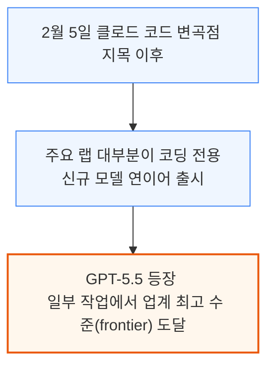
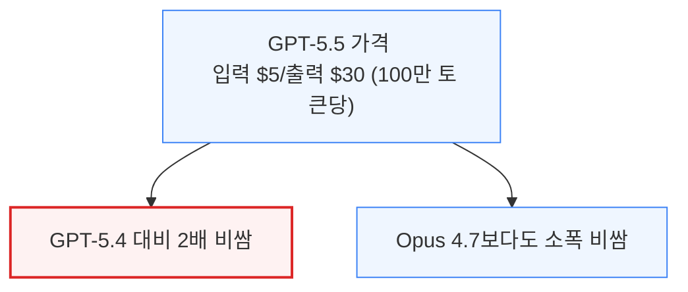
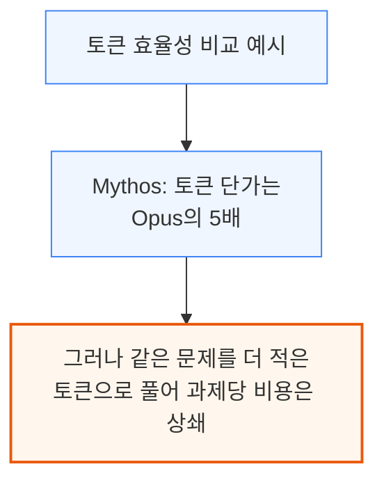
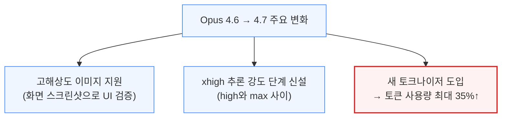
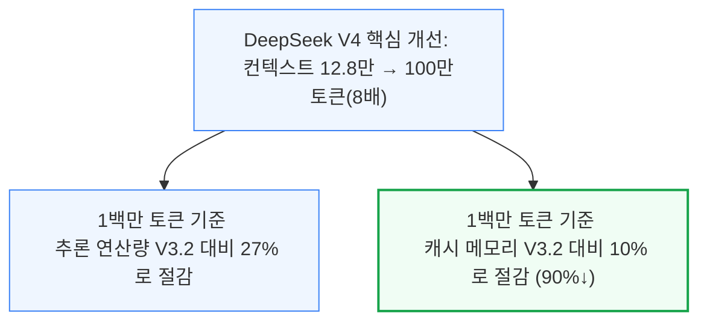

# The Coding Assistant Breakdown: More Tokens Please

> **출처**: [https://newsletter.semianalysis.com/p/the-coding-assistant-breakdown-more](https://newsletter.semianalysis.com/p/the-coding-assistant-breakdown-more)
> **저자**: [[Dylan Patel]]
> **발행일**: 2026-04-25

📑 목차
1. [서론: 코딩 에이전트 전쟁이 다시 뜨거워지다](#1-서론-코딩-에이전트-전쟁이-다시-뜨거워지다)
2. [신규 모델 총정리: GPT-5.5, Opus 4.7, DeepSeek V4](#2-신규-모델-총정리-gpt-55-opus-47-deepseek-v4)
3. [실사용 체감: 코덱스 vs 클로드 코드](#3-실사용-체감-코덱스-vs-클로드-코드)
4. [벤치마크 해부학: MMLU에서 SWE-bench, GDPval까지](#4-벤치마크-해부학-mmlu에서-swe-bench-gdpval까지)
5. [OpenAI의 벤치마크 취사선택, 무엇을 숨겼나](#5-openai의-벤치마크-취사선택-무엇을-숨겼나)
6. [하네스가 다르면 벤치마크 비교도 무의미하다](#6-하네스가-다르면-벤치마크-비교도-무의미하다)
7. [코딩 에이전트 전쟁, 최종 승자는 누구인가](#7-코딩-에이전트-전쟁-최종-승자는-누구인가)

🔑 용어 정리
- **하네스 (Harness)**: 모델 자체가 아니라, 모델이 코드를 읽고 도구를 쓰고 답을 내놓게 감싸는 프로그램(코덱스 CLI, 클로드 코드 등) — 같은 모델도 하네스가 다르면 실제 체감 성능이 크게 달라짐
- **벤치마크 (Benchmark)**: "과제 + 채점 방식 + 하네스" 세 요소로 구성된 AI 성능 측정 도구 — 이 셋을 모두 뜯어봐야 그 점수가 실제 실력을 재는지 알 수 있음
- **MMLU**: 57개 과목 객관식 문제로 AI의 일반 지식을 재는 초창기 대표 벤치마크 — 채점이 쉬워 널리 쓰였지만 2023년에 이미 사실상 만점에 가까워져 변별력을 잃음
- **SWE-bench**: 실제 오픈소스 코드 저장소의 버그 수정 이력을 바탕으로 AI의 코딩 실력을 재는 벤치마크 — 문제 출제 과정에 사람 검수가 없어 부정확한 채점 사례가 많았던 것으로 드러남
- **GDPval**: 금융분석가·간호사 등 44개 실제 직업의 업무를 그대로 흉내 내 AI의 "돈 되는 일" 수행 능력을 재는 벤치마크
- **코덱스 (Codex) / 클로드 코드 (Claude Code)**: 각각 OpenAI, Anthropic이 만든 코딩 전용 AI 하네스 — 이 문서 전체를 관통하는 두 회사의 실제 제품 이름
- **토큰당 비용 vs 과제당 비용**: 모델 하나가 답을 뽑는 데 쓰는 글자 조각(토큰) 1개당 가격이 아니라, 문제 하나를 실제로 풀기까지 드는 총비용 — 토큰 단가가 비싸도 더 적은 토큰으로 풀면 과제당 비용은 오히려 저렴할 수 있음
- **MoE (Mixture of Experts, 혼합 전문가 구조)**: 모델 전체 크기(총 파라미터) 중 질문 하나를 처리할 때 실제로 켜지는 부분(활성 파라미터)만 계산에 쓰는 구조 — 총 크기는 커도 연산량은 활성 파라미터만큼만 듦

---

## 1. 서론: 코딩 에이전트 전쟁이 다시 뜨거워지다

**📌 핵심:**
- SemiAnalysis가 2월 5일 "클로드 코드 변곡점"을 지목한 이후, 두 달 남짓 사이 OpenAI·Anthropic·DeepSeek·중국 랩들까지 한꺼번에 신규 코딩 모델을 쏟아냄
- 그 중 GPT-5.5는 일부 작업에서 다른 모든 모델보다 **확연히 더 나은** 수준(frontier, 업계 최고 수준)에 도달했다고 평가 — 작년 11월 Opus 4.5 출시 이후 6개월간 OpenAI 모델이 업무용 1순위(daily driver)가 되지 못했던 것과는 큰 변화
- 결론: 이 문서는 GPT-5.5·Opus 4.7·DeepSeek V4 세 모델을 실사용 기준으로 비교하고, 벤치마크를 믿어도 되는 경우와 안 되는 경우를 가른 뒤, 코딩 에이전트 시장의 승자를 전망

---

지난 2월 5일 클로드 코드 변곡점을 지목한 이후 모델 출시가 쏟아졌습니다. Opus, Mythos, Codex, Gemini, DeepSeek, Kimi, Qwen, GLM, MiniMax, Composer, Muse Spark 등입니다.

작년 11월 Opus 4.5 출시 이후 6개월 동안 OpenAI의 코딩 모델은 대부분 지표에서 세계 최고 수준이 아니었고, Opus가 SemiAnalysis의 주력 도구였습니다. GPT-5.5는 이제 일상 업무에 통합됐습니다.

---

## 2. 신규 모델 총정리: GPT-5.5, Opus 4.7, DeepSeek V4

**📌 핵심:**
- **GPT-5.5**: OpenAI의 새 사전학습("Spud") 첫 공개 모델, 입력 100만 토큰당 $5·출력 100만 토큰당 $30로 직전 버전(GPT-5.4) 대비 **가격 2배**, Opus 4.7보다도 소폭 비쌈 — 벤치마크 점수는 오르면서 사용 토큰 수는 줄어드는 "토큰 효율화"를 내세움
- **Opus 4.7**: Opus 4.6의 자리를 그대로 대체하는 소폭 개선판, 다만 새 토크나이저(글자를 토큰으로 쪼개는 방식) 도입으로 토큰 사용량이 최대 **35% 증가**(=사실상 가격 35% 인상) — 게다가 3월\~4월 사이 몇 주씩 이어진 버그 3건을 뒤늦게 시인
- **DeepSeek V4**: 문맥 처리 범위(컨텍스트)를 12만8천 토큰에서 **100만 토큰**으로 8배 확장, 그 대가로 추론 연산량은 27%, 캐시 메모리는 10%까지 절감(캐시 메모리 **90% 감소**) — 다만 총 성능은 폐쇄형 최상위 모델에 여전히 못 미침
- 결론: 세 모델 모두 "더 적은 토큰으로 더 잘 푼다"는 토큰 효율 경쟁에 들어섰고, 정작 실제 청구되는 가격은 모델별로 최대 2배까지 벌어짐

---

### GPT-5.5: 첫 신규 사전학습, 그러나 가격은 2배

GPT-5.5는 "Spud"라는 코드명의 새 사전학습을 기반으로 한 첫 공개 모델입니다. NVIDIA와 OpenAI가 "10만 대 GB200 NVL72 클러스터에서 학습"이라 표현했지만, 실제로는 이 규모의 사전학습이 아니라 후속 강화학습(RL) 단계만 이 규모로 진행됐습니다.

우선순위(priority) 등급은 표준가의 2.5배로, 응답속도를 초당 50토큰 이상으로 99% 보장하는 명확한 서비스 수준 약속(SLA)입니다. 반면 패스트 모드(fast mode)는 "속도 2.5배, 가격 6배"처럼 느슨한 약속만 합니다. 별도로 세레브라스(Cerebras) 하드웨어에서 도는 경량화 모델 GPT-5.3-Codex-Spark도 있으나, 이는 속도만 다른 게 아니라 모델 자체가 더 작고 단순화된 버전입니다.

GPT-5.5 Pro는 과학 연구용 장시간 추론에 특화된 모델로, 벤치마크 BrowseComp·FrontierMath에서 최고 점수를 받았고 가격은 GPT-5.4 Pro와 같은 $30/$180입니다. 표준·Pro 모델 모두 추론 강도를 xhigh·high·medium·low·비추론 5단계로 선택할 수 있어, 강도가 높을수록 답은 좋아지지만 토큰을 더 쓰고 응답도 느려집니다.

OpenAI는 GPT-5.5가 GPT-5.4보다 벤치마크 점수는 높으면서 사용 토큰은 더 적다는 "토큰 효율성"을 강조했습니다. SemiAnalysis는 **토큰당 비용이 아니라 과제당 비용**이 모델 가격 경쟁력을 가르는 진짜 기준이라고 봅니다.

### Opus 4.7: 소폭 개선이지만 토큰 사용량 35% 증가

Opus 4.6을 그대로 대체하는 Opus 4.7은 벤치마크 점수가 소폭 오른 무난한 개선판으로, 아직 패스트 모드가 없어 팀 내에서도 마지못해 채택하는 분위기입니다. 체감 변화는 원본 성능보다는 기능 추가에서 두드러졌습니다.

새 토크나이저는 더 세밀하게 텍스트를 쪼개 성능은 좋아지지만, 그 대가로 같은 작업에도 토큰을 최대 35% 더 씁니다. 토큰당 단가가 그대로면 이는 사실상 **가격 35% 인상**입니다. 또한 4.7은 기본적으로 도구 호출 횟수를 줄이고 추론에 더 의존하는데, Anthropic은 이를 보완하려면 추론 강도를 xhigh나 max로 올리라고 권장합니다 — 결국 "토큰을 아꼈다"는 주장과 반대로 사용자가 직접 강도를 높여 토큰을 더 쓰게 되는 상황입니다.

4월 23일, Opus 4.7 출시 일주일 뒤 Anthropic은 3월\~4월 사이 발견된 버그 3건(각각 3/4\~4/7, 3/26\~4/10, 4/16\~4/20 기간 동안 방치)을 시인하는 사후분석을 공개했습니다. 클로드 코드 사용자 대부분이 영향을 받은 것으로, 모델이 만든 버그를 모델이 방치한 셈입니다.

### DeepSeek V4: 컨텍스트 100만 토큰, 캐시 메모리 90% 절감

DeepSeek V4는 R1으로 시장에 충격을 줬던 지난해와 달리 이번엔 시장을 흔들지 못했지만, 가중치·기술보고서·라이브러리(DeepEP, DeepGEMM, FlashMLA)를 모두 오픈소스로 공개했습니다. V4-Pro(총 1.6조·활성 490억 파라미터)와 V4-Flash(총 2,840억·활성 130억 파라미터) 2종이며, 이전 V3(총 6,710억·활성 370억)와 비교해 Pro는 상향, Flash는 하향 조정입니다.

압축 희소 어텐션(CSA)·초압축 어텐션(HCA)·다양체 제약 하이퍼커넥션(mHC) 등 신기술이 이 장문맥 처리 개선의 핵심입니다. 다만 벤치마크에서 V4 Pro는 최상위 모델과 대등하게 겨루면서도 중국어 글쓰기 등 일부 영역에서는 Opus 4.7에 여전히 뒤졌고, H200 GPU 1개당 처리량도 초당 약 150토큰으로 V3(초당 1,300\~2,300토큰)보다 크게 느립니다(신모델 최적화 초기 단계). 종합적으로 DeepSeek는 최상위 폐쇄형 모델을 대체할 수준은 아니지만, 가장 저렴한 대안으로 자리매김할 전망입니다.

---

*작성 진행률: 약 30% 완료*
*업데이트: 1\~2장(서론, 신규 모델 총정리) 작성 완료*
