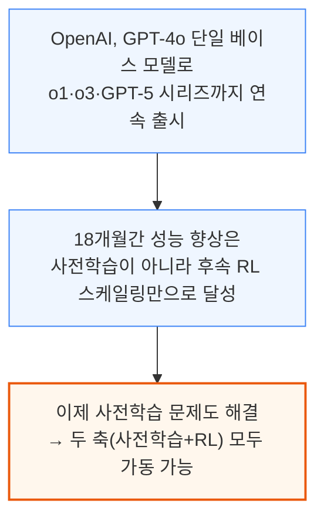
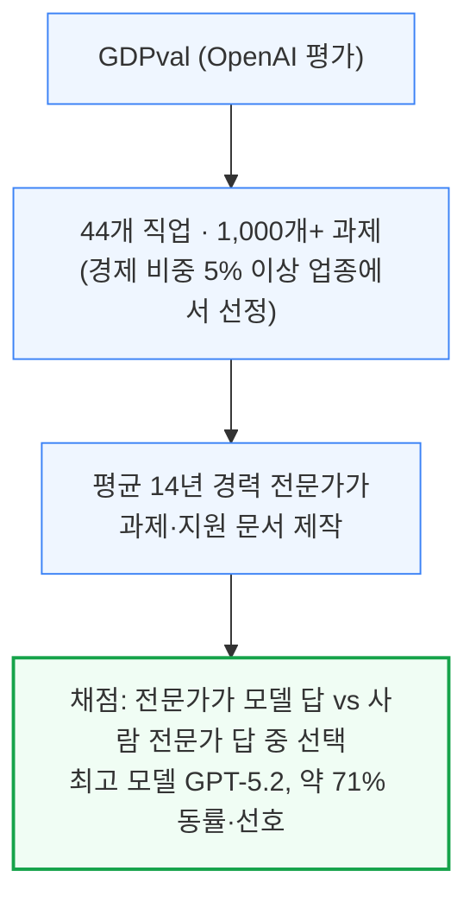
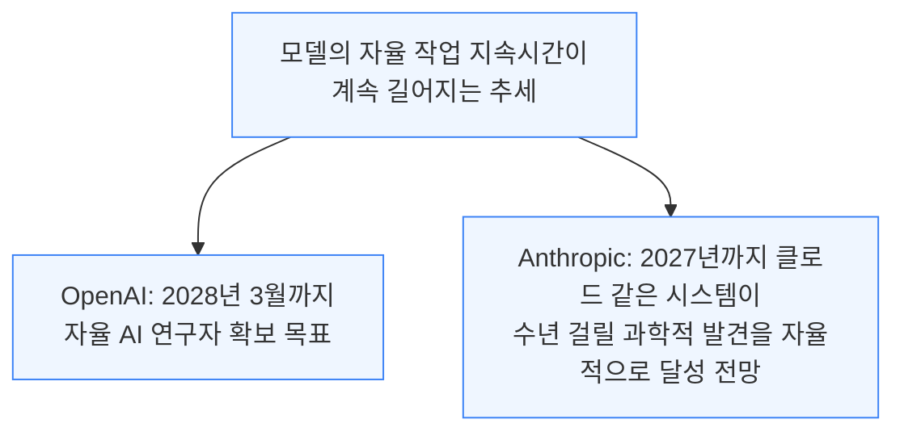
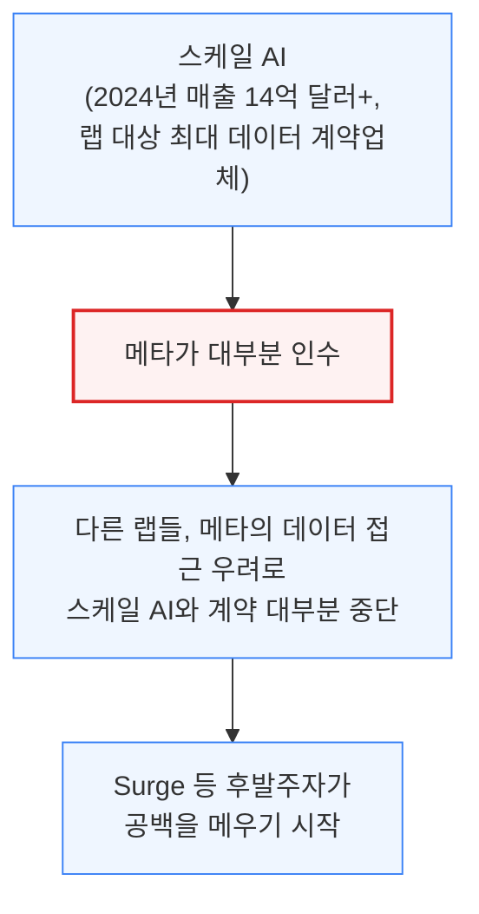
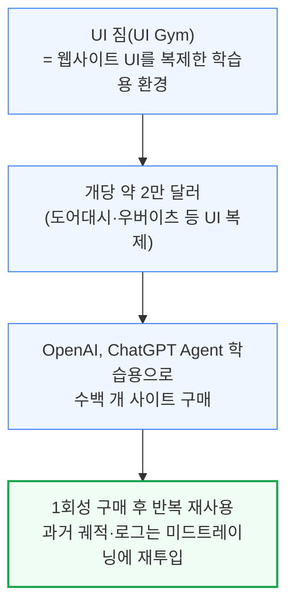
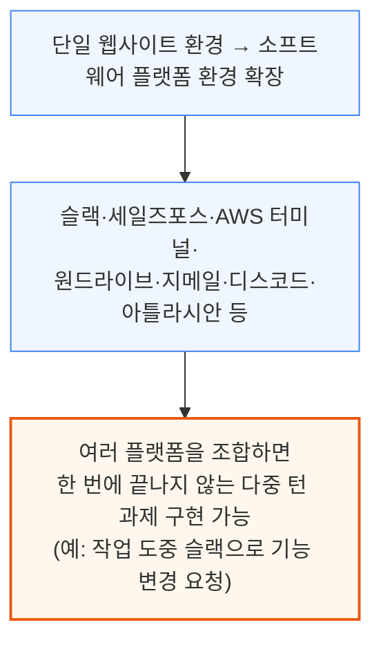
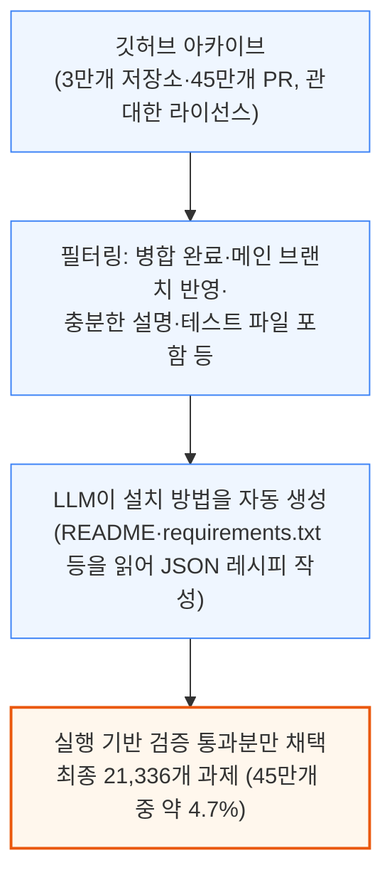
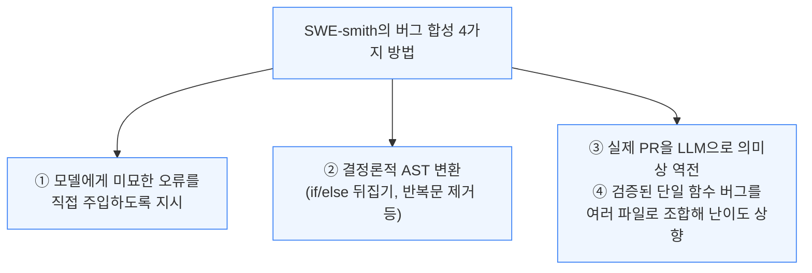
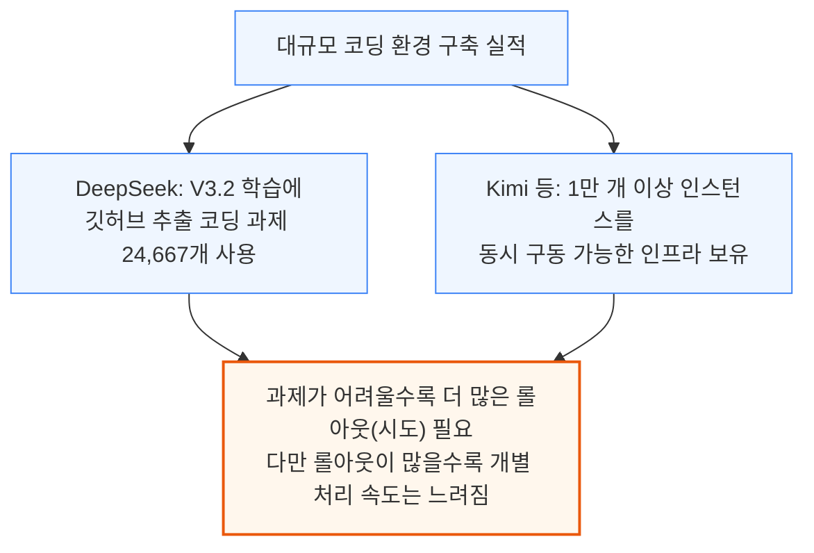

# RL Environments and RL for Science: Data Foundries and Multi-Agent Architectures

> **출처**: [https://newsletter.semianalysis.com/p/rl-environments-and-rl-for-science](https://newsletter.semianalysis.com/p/rl-environments-and-rl-for-science)
> **저자**: [[Dylan Patel]]
> **발행일**: 2026-01-07

📑 목차
 1. [서론: 왜 RL 스케일링이 결정적인가](#1-서론-왜-rl-스케일링이-결정적인가)
 2. [스케일 AI의 몰락과 RL 환경 골드러시](#2-스케일-ai의-몰락과-rl-환경-골드러시)
 3. [코딩 환경은 어떻게 만들어지는가](#3-코딩-환경은-어떻게-만들어지는가)
 4. [데이터 파운드리와 전문 계약자](#4-데이터-파운드리와-전문-계약자)
 5. [랩별 구매 패턴: 앤트로픽·OpenAI·구글 딥마인드](#5-랩별-구매-패턴-앤트로픽openai구글-딥마인드)
 6. [AI 자동화는 당연한 결과가 아니다](#6-ai-자동화는-당연한-결과가-아니다)
 7. [에이전트 접근 차단과 플랫폼 정치](#7-에이전트-접근-차단과-플랫폼-정치)
 8. [RL as a Service: 기업용 RL 대행 시장](#8-rl-as-a-service-기업용-rl-대행-시장)
 9. [과학을 위한 RL: 피어리오딕 랩스와 미드트레이닝](#9-과학을-위한-rl-피어리오딕-랩스와-미드트레이닝)
10. [RL이 습식 실험실을 만나다: 제약 데이터 경쟁](#10-rl이-습식-실험실을-만나다-제약-데이터-경쟁)
11. [생물학 RL이 어려운 이유: 희소 보상과 롤아웃 병목](#11-생물학-rl이-어려운-이유-희소-보상과-롤아웃-병목)
12. [멀티 에이전트 아키텍처: 다음 스케일링 축](#12-멀티-에이전트-아키텍처-다음-스케일링-축)

🔑 용어 정리
- **RL 환경 (RL Environment)**: AI 모델에게 과제를 실제로 수행해보게 하고 그 결과에 따라 보상을 주는 시뮬레이션·소프트웨어 공간 — 강화학습(RL)의 "교재이자 시험장" 역할
- **데이터 파운드리 (Data Foundry)**: AI 랩을 대신해 학습용 과제·전문가 채점·RL 환경을 만들어 공급하는 외주 전문 업체
- **GDPval**: OpenAI가 만든 평가로, 44개 실제 직업의 업무를 전문가 결과물과 비교해 AI가 실제 업무에 얼마나 쓸모 있는지 재는 방식
- **미드트레이닝 (Mid-training)**: 사전학습과 강화학습(RL) 사이에 끼워 넣는 추가 학습 단계 — 최신 지식을 주입하거나 RL을 더 잘 받아들이도록 모델을 예열하는 역할
- **습식 실험실 (Wet Lab)**: 시험관·시약·로봇 장비로 실제 화학·생물 실험을 수행하는 물리적 실험실 (컴퓨터 시뮬레이션과 대비되는 개념)
- **롤아웃 (Rollout)**: 모델이 과제를 처음부터 끝까지 한 번 실제로 수행해보는 시행 단위 — RL은 이 시행을 여러 번 반복하며 보상이 높은 방향으로 모델을 조정
- **RL as a Service**: 기업이 자체 데이터·업무를 가지고 와 AI 모델을 자기 업무에 맞게 강화학습(RL)해주는 대행 서비스
- **멀티 에이전트 아키텍처 (Multi-Agent Architecture)**: 하나의 모델이 아니라 여러 AI 모델(에이전트)이 역할을 나눠 협업하며 하나의 문제를 함께 풀도록 짜는 구조

---

## 1. 서론: 왜 RL 스케일링이 결정적인가

**📌 핵심:**
- OpenAI는 o1·o3·GPT-5 시리즈까지 **같은 베이스 모델(GPT-4o)**을 계속 사용했는데도 18개월간 성능이 계속 향상 — 사전학습이 아니라 후속 학습 단계인 **강화학습(RL) 확대만으로** 이뤄낸 성과, 이제는 사전학습 문제도 해결해 두 축 모두 가동 가능
- OpenAI의 실제 업무 능력 평가 **GDPval**에서 최고 모델 GPT-5.2가 전문가 결과물과 **71% 비율로 동률·선호**됨 — 44개 직업·1,000개 이상 과제, 평균 14년 경력 전문가가 문제 제작
- OpenAI는 **2028년 3월까지 자율 AI 연구자** 확보를, Anthropic은 **2027년까지 클로드가 수년 걸릴 과학적 발견을 자율적으로** 해내는 것을 목표로 제시
- 결론: RL 스케일링은 사전학습처럼 인터넷 전체를 학습 재료로 쓸 수 없어 과제·환경을 하나하나 직접 만들어야 하며, 이 노동집약적 작업이 이번 문서의 핵심 주제인 "RL 환경 산업"을 만들어냄

---

지난해 6월 SemiAnalysis는 "RL 스케일링이 AI 능력 향상의 핵심 경로"라는 주장을 폈고, 이후 수개월간 이 주장이 사실로 확인됐습니다. OpenAI가 가장 뚜렷한 사례입니다.

Anthropic·xAI, 특히 Google은 사전학습 확대에서도 상당한 성과를 얻어, 사전학습이 끝난 기술은 아닙니다. 다만 RL 확대는 사전학습과 근본적으로 다른 난제를 안고 있습니다. 사전학습은 인터넷 전체가 학습 재료였지만, RL은 모델이 풀어야 할 과제 자체를 하나하나 새로 만들어야 합니다. 수학 문제(채점이 쉬움)에서 시작해 의료·금융 모델링 같은 전문 분야로 확장 중이며, 이를 위해 모델을 점점 더 특화된 "환경(environment)"에 투입합니다.

과제·데이터를 모으는 방법은 수작업 제작 또는 실사용자의 고품질 데이터 큐레이션 두 가지이며, 후자 덕분에 Windsurf·Cursor 같은 회사도 대형 랩만큼의 자원 없이 자체 경쟁력 있는 모델을 후속학습(post-train)할 수 있습니다.

이런 후속학습은 코딩 같은 능력뿐 아니라 엑셀·파워포인트 같은 일상 도구에서의 "실용성" 자체를 끌어올립니다. OpenAI는 이 실용성·능력 향상을 재기 위해 GDPval이라는 평가를 만들었습니다.

과제 예시로는 가상 인물의 세금 신고서 작성, 리조트 자문역으로서의 슬라이드 제작, 주어진 영상 소재로 광고 만들기 등이 있습니다. GDPval은 추상적 지능이 아니라 실제 업무 효용을 재는 방향으로 평가 트렌드가 이동하고 있음을 보여주는 대표 사례입니다 — 기존 평가 대부분이 수학 지식이나 박사급 과학 문제를 객관식으로 채점했던 것과 대비됩니다.

이런 흐름의 배경에는 모델이 점점 더 오래 자율적으로 작업할 수 있다는 공통된 관찰이 있습니다. AI 기업들은 이 능력이 결국 모델 스스로 다음 버전을 만드는 데 일조할 것으로 기대합니다.

다만 이 여정에는 방대한 데이터·과제 큐레이션이 필요합니다. 예를 들어 컴퓨터 사용 환경은 인터넷상의 기존 웹사이트를 복제하는 등 상당한 소프트웨어 엔지니어링 노동을 요구해, 랩들은 이 작업 상당 부분을 외주화해왔습니다.

---

## 2. 스케일 AI의 몰락과 RL 환경 골드러시

**📌 핵심:**
- 스케일 AI는 한때 랩들의 최대 데이터 계약업체(2024년 매출 **14억 달러 이상**)였으나 **메타에 대부분 인수**된 뒤, 다른 랩들이 메타의 데이터 접근을 우려해 계약을 대부분 중단 — Surge 등 후발주자가 그 공백을 메우는 중
- "골드러시엔 삽을 팔아라"처럼 RL 스케일링 붐에선 RL 환경을 파는 스타트업이 **35개 이상** 등장 — 웹사이트를 복제하는 "UI 짐(UI Gym)"은 사이트당 약 **2만 달러**, OpenAI는 ChatGPT Agent 학습용으로 **수백 개** 구매
- 더 정교한 환경(슬랙·세일즈포스·지메일·아틀라시안 등)은 여러 플랫폼을 조합해 한 번에 끝나지 않는 **다중 턴(multi-turn)** 과제까지 구현 가능
- 결론: 환경은 1회성 구매 후 재사용되며, 과거 실행 기록(궤적·로그)은 이후 미드트레이닝 단계에 재투입돼 계속 가치를 만들어냄

---

스케일 AI는 모든 랩으로부터 상당한 지출을 받으며 2024년 매출 14억 달러 이상을 기록한, 역사적으로 최대 규모의 데이터 계약업체였습니다.

인수 이후 스케일 AI 인력 일부는 메타 슈퍼인텔리전스 그룹에 리더십·안전성·평가팀 위주로 합류했고, 조직 자체는 평가 제작과 일부 데이터 계약을 유지하지만 예전만큼 랩 전반에 서비스하지는 않습니다. 이 공백을 채우려 나선 것이 바로 RL 환경 스타트업들입니다.

골드러시 때는 삽을 팔듯, RL 스케일링 붐에서는 RL 환경 자체를 파는 것이 사업이 됐습니다. 이 목표만으로 35개 이상의 회사가 등장했습니다.

일부 업체는 단순 웹사이트를 넘어 슬랙·세일즈포스·AWS 터미널·마이크로소프트 원드라이브·지메일·디스코드·아틀라시안처럼 더 정교한 소프트웨어 플랫폼 환경으로 확장했습니다.

이런 환경을 만드는 회사로는 Habitat, DeepTune, Fleet, Vmax, Turing, Mechanize, Preference Model, Bespoke Labs, Veris.ai 등이 있으며, 대부분 직원 20명 미만의 시드 단계 스타트업으로 고객 1\~3곳에 집중합니다. 대부분은 비공개 독점 계약으로 랩에 환경을 제공하지만, Prime Intellect는 자사 환경을 오픈소스로 공개하고 "Environments Hub"를 통해 RL 환경의 원스톱 허브를 지향합니다.

**📌 용어 풀이: HUD의 환경 툴링 구조**
> - HUD는 게임·브라우저·구글 시트 등 어떤 소프트웨어든 도커 컨테이너로 감싸 확장 가능한 RL 환경으로 만드는 툴링을 제공
> - 컨테이너는 두 층으로 구성: ① 실제 감싸인 소프트웨어(환경 백엔드) ② 그 위에서 에이전트의 도구 호출(예: `click(x,y)`)을 실제 동작으로 변환해주는 MCP 서버
> - 각 과제는 프롬프트·설정 조건·성공 기준으로 구성되며, 성공 여부가 보상 신호로 반환됨. 모든 도구 호출과 관찰 결과는 텔레메트리로 기록돼 디버깅과 이후 학습 단계에 재활용

---

## 3. 코딩 환경은 어떻게 만들어지는가

**📌 핵심:**
- 코딩 환경 수요가 워낙 높아 "비공개 깃허브 저장소 하나의 가치" 때문에 망한 스타트업이 인수되는 경우까지 있다고 추정 — SWE-rebench가 실제 제작 과정을 보여주는 대표 사례
- 깃허브 아카이브(3만개 저장소·45만개 PR)에서 시작해 엄격한 필터링(병합·설명 충실도·테스트 포함 여부 등)을 거쳐 최종 **2만1,336개** 과제만 채택 — 45만개 중 약 4.7%만 살아남는 낮은 수율
- SWE-smith는 부족한 수율을 보완하기 위해 **인위적으로 버그를 합성**(미묘한 오류 주입, AST 변환, PR 역전, 다중 파일 조합)하는 4가지 방법을 사용 — 실제 PR 채굴과 합성 생성은 상호 배타적이지 않고 함께 쓰이는 것으로 추정
- 결론: DeepSeek는 V3.2 학습에 2만4,667개 코딩 과제를 사용했고, Kimi 등은 1만 개 이상의 인스턴스를 동시 구동할 수 있는 인프라를 갖춤 — 과제가 어려울수록 더 많은 시도(롤아웃)가 필요하지만, 그만큼 각 시도는 느려지는 트레이드오프 존재

---

코딩 환경은 가장 수요가 높은 영역입니다. SWE-rebench는 수천 개의 파이썬 과제를 깃허브에서 자동으로 모아 환경이 실제로 어떻게 구축되는지 보여주는 대표 사례이며, 랩들도 비슷한 자동화 파이프라인을 쓸 것으로 추정됩니다.

과제 하나가 유효하려면 패치 적용 전에는 최소 한 개 테스트가 실패하고, 패치 적용 후에는 그 테스트가 통과하며, 기존에 통과하던 테스트는 계속 통과해야 합니다. 이렇게 엄격한 기준 탓에 수율이 낮으며, SWE-smith는 이를 보완하기 위해 버그를 인위적으로 합성합니다.

PR 채굴은 실제 개발 이력에서 나온 현실적인 버그 패턴을 담고, 합성 생성은 코드베이스 전체에 걸친 물량과 다양성을 제공합니다. 비공개 저장소에 접근 가능한 랩이라면 두 파이프라인을 함께 돌려 PR을 먼저 채굴한 뒤 합성 버그로 보강하는 방식이 유력한 실제 구축법으로 추정됩니다.

---

*작성 진행률: 약 25% 완료 (1~3장 작성)*
*업데이트: 서론, 스케일 AI 몰락과 RL 환경 골드러시, 코딩 환경 제작 과정까지 작성*
