# Unitree's Impossible Trajectory Is Still Overlooked

> **출처**: [SemiAnalysis Newsletter](https://newsletter.semianalysis.com/p/chinas-unitree-will-dominate-global)
> **저자**: Reyk Knuhtsen, Niko Ciminelli, Jacob Rintamaki
> **발행일**: 2026-02-05

---

## 📑 목차

### 전체 섹션
 1. [서론: 두 번째 중국 하드웨어 거인의 탄생](#1-서론-두-번째-중국-하드웨어-거인의-탄생)
 2. [BYD 전략 - 부품 하나를 장악해 시장을 창조하는 법](#2-byd-전략---부품-하나를-장악해-시장을-창조하는-법)
 3. [DJI 플레이북 - 연구자·취미 시장으로 부트스트랩](#3-dji-플레이북---연구자취미-시장으로-부트스트랩)
 4. [Unitree, 초기 DJI를 재현하다](#4-unitree-초기-dji를-재현하다)
 5. [QDD 액추에이터 - 저렴함과 발열의 트레이드오프](#5-qdd-액추에이터---저렴함과-발열의-트레이드오프)
 6. [2년 만의 반전 - QDD가 기대를 뛰어넘다](#6-2년-만의-반전---qdd가-기대를-뛰어넘다)
 7. [실제 노동을 향해 - 배포 경제성 문턱을 넘다](#7-실제-노동을-향해---배포-경제성-문턱을-넘다)
 8. [중국 제조 생태계의 경쟁력](#8-중국-제조-생태계의-경쟁력)
 9. [결론 - Unitree는 어디까지 갈 것인가](#9-결론---unitree는-어디까지-갈-것인가)
10. [로봇 손과 핸드메이커 경쟁](#10-로봇-손과-핸드메이커-경쟁)
11. [Unitree 공급망 재편 - 누가 밀려나고 누가 득을 보나](#11-unitree-공급망-재편---누가-밀려나고-누가-득을-보나)

---

## 🔑 용어 정리

본문을 순서대로 읽기 전에 알아두면 좋은 용어들입니다. 자세한 수치와 설명은 본문에서 처음 등장하는 위치에 나옵니다.

- **QDD (Quasi-Direct-Drive, 준직접구동)**: 브러시리스 모터에 감속비가 낮은(20:1 이하) 저렴한 유성기어박스를 결합한 로봇 관절 구동 방식 — 기어박스가 힘을 크게 증폭하지 않는 대신 모터 자체가 강한 힘을 내야 함
- **액추에이터 (Actuator)**: 로봇의 팔다리를 움직이는 관절 구동 장치 — 모터와 기어박스가 한 몸에 결합된 부품으로, 휴머노이드 원가에서 가장 비싼 부분
- **BoM (Bill of Materials, 부품 명세서)**: 로봇 한 대를 만드는 데 들어가는 모든 부품과 원가를 항목별로 정리한 목록 — 원가 구조를 파악하는 기본 단위
- **스트레인웨이브 기어 (Strainwave/Harmonic Drive)**: 정밀도는 높지만 제작이 어렵고 비싼 전통적 감속기어 방식 — QDD의 경쟁 방식
- **페이로드 (Payload)**: 로봇이 팔로 들어 올리거나 옮길 수 있는 짐의 무게
- **텔레오퍼레이션 (Teleoperation)**: 로봇이 스스로 판단하지 않고 사람이 원격으로 직접 조종하는 방식 — 완전 자율 이전 단계
- **수직계열화 (Verticalization/In-housing)**: 부품을 외부 업체에서 사 오지 않고 직접 만들어 원가와 품질을 통제하는 전략

---

## 1. 서론: 두 번째 중국 하드웨어 거인의 탄생

**📌 핵심:**
- Unitree는 3년 전만 해도 쿼드러페드(4족보행 로봇) 전문 업체였으나, 작년에 휴머노이드 시장까지 장악했고, 올해는 G1 휴머노이드가 실제 현장 배치 단계로 진입 — 서구의 직접 경쟁자인 H2를 포함해 신형 3종이 출시 예정
- 테슬라가 2022년 휴머노이드를 처음 공개한 이후에도 서구 업체들은 여전히 시제품 단계인 반면, Unitree는 곧 10,000번째 로봇을 출하할 것으로 알려짐
- Unitree는 매출이 전년 대비 3배로 늘고 있고 일부 제품군 매출총이익률이 60%에 달하는데도, G1 사전세금 가격을 12\~18개월 만에 5만 달러대에서 2만 7,300달러로 낮췄고 그 가격에서도 매출총이익률 67%를 유지 — 일부 거래는 이미 2만 달러 미만까지 내려간 것으로 파악됨
- 결론: "신뢰성이 낮고 오락용에 불과하다"는 평판에도 불구하고, Unitree의 원가 구조 자체가 최대 경쟁우위 — 이 글은 Unitree가 BYD·DJI의 전략을 그대로 재현하며 새 시장을 열고 삼키는 과정을 추적함

---

### Unitree의 3년 궤적 - 쿼드러페드에서 IPO까지

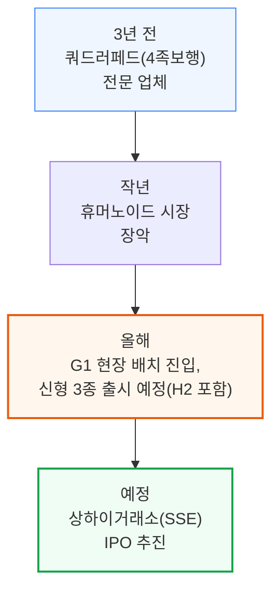

Unitree는 곧 누적 출하 10,000번째 로봇을 내놓을 것으로 알려졌습니다. 테슬라가 2022년 휴머노이드를 처음 공개했지만, 서구 업체들은 여전히 초기 시제품 단계에 머물러 있습니다.

### 원가 구조 - 최대 무기가 된 가격 인하

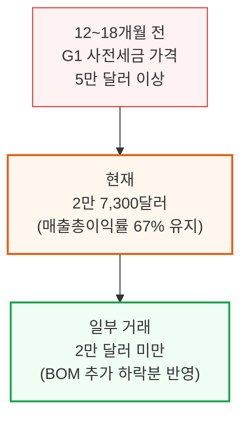

이 정도로 가격을 낮추면서도 매출총이익률을 지키는 구조는, 매출 전년 대비 3배 성장·일부 제품군 60% 매출총이익률·연간 약 3억 달러 AI R&D 투자 계획과 함께 저자들이 이 글에서 풀어내는 핵심 퍼즐입니다.

📌 용어 풀이: 왜 "가격을 깎았는데 마진은 그대로"인가
> - 일반적으로 가격을 낮추면 이익률도 같이 떨어지지만, Unitree는 원가 자체를 더 빠르게 낮춰서 가격 인하 속도를 따라잡음
> - 이 원가 하락의 원천이 바로 이 문서가 추적하는 "BYD·DJI 전략의 재현"(2\~4장)

---

## 2. BYD 전략 - 부품 하나를 장악해 시장을 창조하는 법

**📌 핵심:**
- BYD의 성숙한 성공 공식은 3단계 — ① BOM(부품 명세서)에서 가장 비싸고 어려운 부품(배터리 셀)을 직접 소유 ② 그 소유권으로 아무도 못 따라오는 원가 우위를 누적 ③ 공급망을 수직계열화하며 새 시장을 창조. Unitree는 이 공식을 액추에이터에 그대로 적용 중
- BYD는 1994년 배터리 셀 제조사로 출발해 거의 10년을 다듬은 뒤 2011년에야 EV(전기차)에 진출 — 진출 당시 중국 전체 신차 판매 중 EV 비중은 0.04%(연간 8,159대)에 불과해 시장 자체가 없었으나 BYD가 직접 만들어냄
- 2021년 팩당 에너지밀도를 50% 끌어올린 "블레이드 배터리"로 LFP(리튬인산철) 배터리의 약점(낮은 밀도)을 해결하자, 테슬라도 모델3·Y를 LFP로 전환하고 포드도 CATL의 LFP 기술을 라이선스 — 그 결과 BYD 출하량이 2020년 18만 9,000대에서 2021년 60만 대로 급증
- 결론: 2025년 BYD는 세계 1위 EV 생산업체이자 테슬라를 제친 1위 BEV(순수전기차) 생산업체로 등극, 씨걸(Seagull) 모델 등은 부품 75% 이상 자체 생산해 원가 구조가 사실상 넘볼 수 없는 수준 — 이 압박으로 폭스바겐은 독일 공장 최초 폐쇄, 미국은 중국산 EV 관세를 100%까지 인상

---

### BYD 전략의 선순환 구조

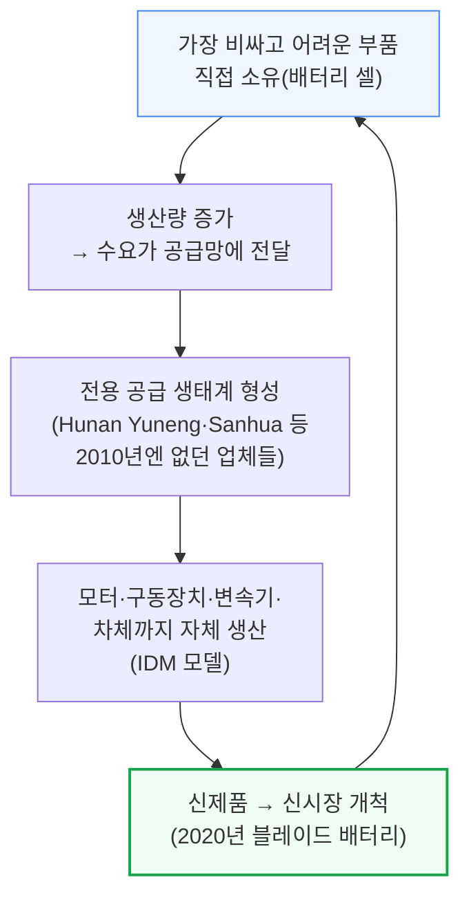

### BYD 타임라인 - 니치 플레이어에서 세계 1위까지

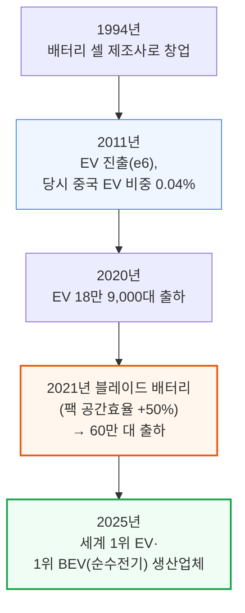

📌 용어 풀이: 블레이드 배터리가 왜 게임 체인저였나
> - LFP(리튬인산철) 배터리는 저렴하고 안전하지만 에너지 밀도가 낮아, 충전소를 자주 오가는 지게차·버스에는 맞아도 장거리를 다니는 승용 전기차에는 부적합하다고 여겨졌음
> - 블레이드 배터리는 팩 포장 형태를 바꿔 같은 무게에서 공간효율을 50% 높여, LFP의 크기는 그대로 두고 주행거리만 늘려 승용 전기차에서도 쓸 수 있는 문턱을 넘김

BYD는 씨걸(Seagull) 모델 기준 부품의 75% 이상을 자체 생산해 원가 구조가 사실상 따라잡기 어려운 수준에 도달했습니다. 2023년형 씨걸은 약 1만 1,000달러였고, 최신 모델은 중국 내수 기준 8,000달러 미만까지 내려갔습니다.
BYD는 여기서 그치지 않고 2023년 화유코발트(Huayou Cobalt)와 정제 합작사를 세우고 브라질 "리튬 밸리"의 리튬 채굴권까지 확보하며 공급망을 원자재 단계까지 수직계열화했습니다.

### 하류 파급 효과 - 유럽 완성차의 대응

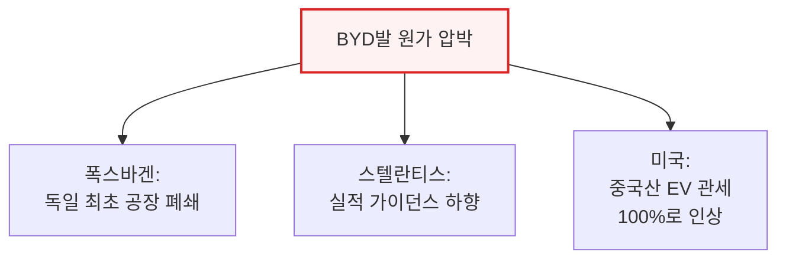

BYD는 이제 자체 화물선까지 보유해 세계에서 가장 저렴하면서도 우수한 전기차를 직접 실어 나르는 단계까지 왔습니다.

---

## 3. DJI 플레이북 - 연구자·취미 시장으로 부트스트랩

**📌 핵심:**
- DJI는 BYD와 다른 공식을 개척 — 연구자·취미 시장을 발판(비치헤드) 삼아 미완성 제품으로 시작. 2013년 "쓸 만한 소비자용 드론"이라는 카테고리 자체가 없었고, 당시 대안은 1만 9,995달러짜리 전문가용 드론이거나 부품 1,200달러+수십 시간 조립(자주 추락)뿐
- DJI Phantom 1(2013년 1월, 679달러)은 카메라·짐벌(흔들림 보정)도 없고 비행시간 10분에 불과했지만 DIY 대비 절반 가격에 조립 부담이 없어, DJI 매출이 2011년 400만 달러에서 2013년 1억 3,000만 달러로 급증
- 스마트폰 붐 덕에 GPS 부품 가격이 800달러→14달러(2003\~2013년), 조종기가 2,000달러→400달러(2006\~2011년)로 폭락하며 드론 부품 공급사가 3,000개 이상으로 늘어난 생태계 효과를 DJI가 그대로 흡수
- 결론: DJI는 세대마다 새 시장을 열었음(Phantom 1: 취미/연구 → Phantom 2 Vision+: 짐벌 내장으로 소상공인 시장 → Phantom 4: 기업 시장) — 2016\~17년 DJI는 세계 소비자 드론 시장의 약 70%를 장악했고, 경쟁사(3DR, GoPro Karma, Parrot)는 시장에서 퇴출

---

### 2013년 드론 선택지 - DJI Phantom 1의 가격 파괴

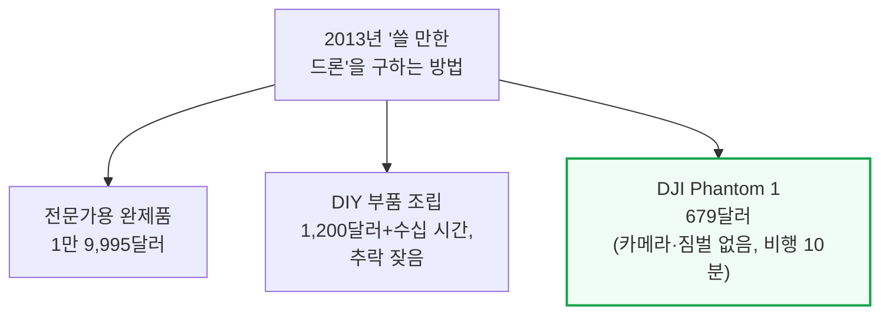

### DJI 부품 생태계 폭발 - 스마트폰 붐의 낙수효과

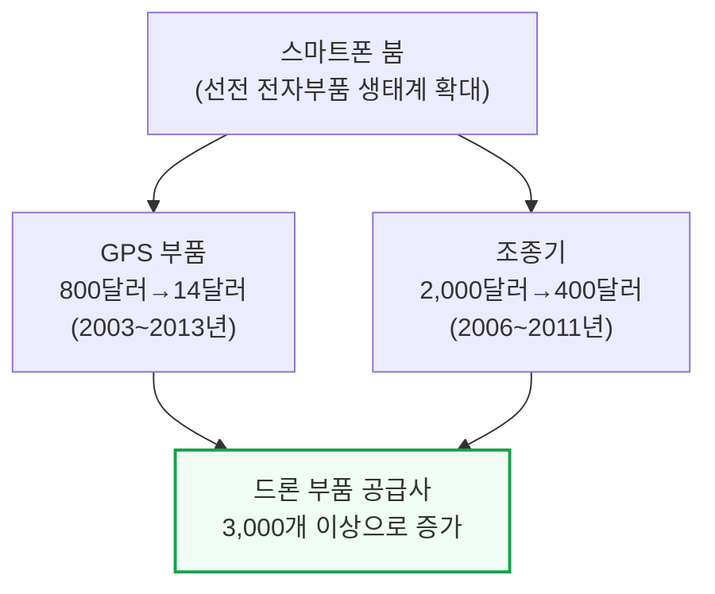

DJI는 가장 비싸고 기술적으로 어려운 부품인 비행 컨트롤러부터 자체 생산으로 내재화했습니다. 2014년까지도 3자 공급사들은 수천 대 단위로 사도 200\~400달러를 받았습니다. 이후 짐벌·모터·ESC(전자변속기)도 순차적으로 내재화했습니다.
DJI 매출은 Phantom 1 출시 이후 2011년 400만 달러에서 2013년 1억 3,000만 달러로 뛰었고, 이 초기 현금흐름이 이후 세대의 R&D를 뒷받침하는 플라이휠이 됐습니다.

### 세대별 시장 개척 - Phantom 1부터 4까지

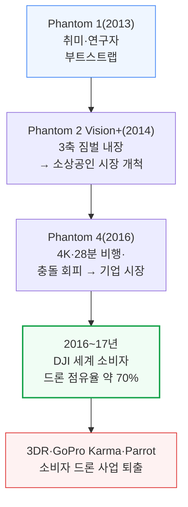

Phantom 2 Vision+ 이전에는 방송용 안정 항공촬영을 하려면 헬리콥터나 할리우드 촬영팀이 필요했지만, 짐벌이 기체에 내장되자 부동산 매물 촬영·웨딩 영상·지역 뉴스·농업 측량 같은 새 시장이 소상공인 규모에서 열렸습니다.
2016\~17년 전 세계 드론 출하량은 640만 대, 매출 19억 달러 규모로 커졌는데, 이전에는 거의 존재하지 않던 시장이었습니다. 3DR CEO는 이 시기 DJI가 1년도 안 되는 기간에 가격을 최대 70%까지 깎았다고 추정했습니다.
이 문서에서는 이 공식을 앞으로 "DJI 전략"이라 부릅니다 — 핵심 부품 하나를 소유하고, 발판이 될 사용자층을 확보하고, 생태계에 올라타고, 세대마다 다음 시장을 여는 것입니다.

---

## 4. Unitree, 초기 DJI를 재현하다

**📌 핵심:**
- Unitree는 "DJI 전략"의 실제 사례 — 병목 부품(액추에이터)을 소유하고, 기꺼이 지불할 사용자층(대학 연구실)을 발판 삼아, 생태계에 올라타며 세대마다 새 시장을 열고 있음
- 2016년 DJI 출신 왕싱싱이 석사 논문용 저가 쿼드러페드 XDog를 개발한 뒤 창업 — 액추에이터(휴머노이드 BOM의 50\~70%를 차지하는 최고가 부품)를 핵심 개선 대상으로 선택. 라이카고(2018, 4만 5,000달러) → A1(2020, 1만 5,000달러) → Go1(2021, 2,700\~8,500달러) → Go2(현재, 1,600\~2,800달러)로 6년 만에 진입가가 94\~96% 하락
- 이 쿼드러페드 물량 덕에 액추에이터·제어·공급망·생산 공정에서 실전 경험을 쌓았고, 2024년 H1(약 9만 달러)은 사실상 "두 발로 선 쿼드러페드"에 불과했지만(무릎 구부정, 어색한 걸음), 이어진 G1이 진짜 전환점이 됨
- 결론: G1(2024년 중반, 3만\~5만 달러)은 최초로 "그냥 사서 쓸 수 있는" 휴머노이드가 되며 학계 시장을 폭발시켰고, 엔비디아·애플·메타가 각각 수백 대씩 구매 — 그러나 초기 G1·H1은 실제로는 성능이 떨어져(모터 과열) 실사용이 어려웠음

---

### Unitree 쿼드러페드 가격 - 6년 만의 94\~96% 하락

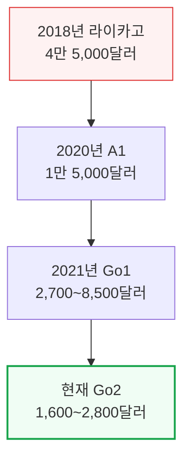

이 6년간의 실전 물량이 액추에이터·제어·공급망·생산 공정 노하우로 축적되며, 2024년 약 9만 달러짜리 H1은 사실상 새로운 제품이 아니라 쿼드러페드 노하우를 직립시킨 결과물이었습니다. 관계자들에 따르면 H1은 사실상 "두 발로 선 쿼드러페드"였다고 합니다(구부정한 무릎, 어색한 걸음걸이).

### G1의 등장 - 2024년 최초의 '그냥 살 수 있는' 휴머노이드

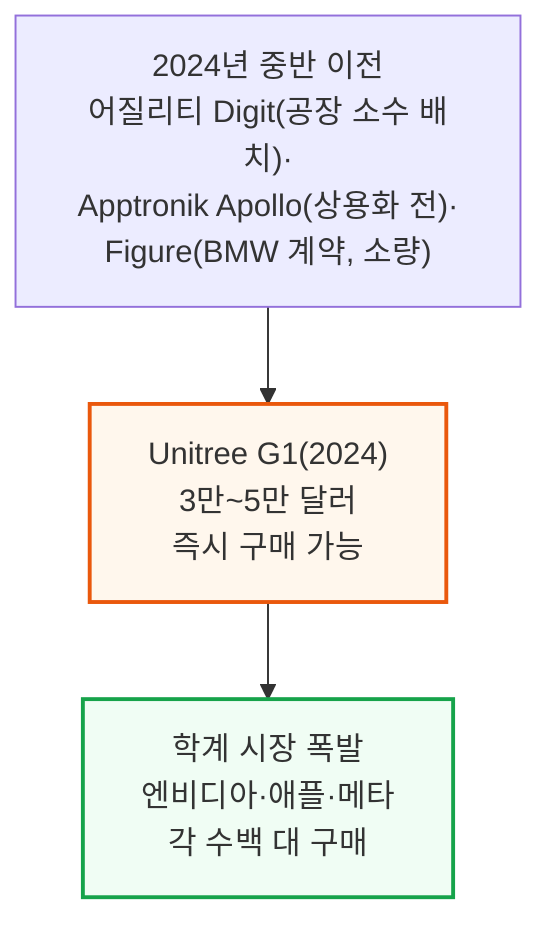

당시 테슬라는 옵티머스를 외부에 전혀 출하하지 않았고, 중국 내 UBTech·Fourier·AGIBot도 이 정도로 저렴하거나 물량이 있지 않았습니다. Unitree는 이렇게 휴머노이드 AI 연구의 대표 플랫폼이 됐습니다.

### 생태계 우위 - DJI·BYD 공급망을 그대로 물려받다

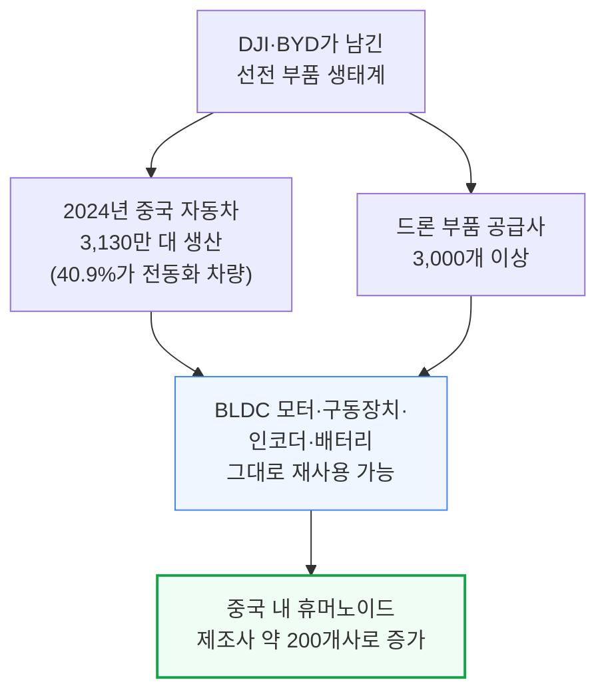

이 모든 것은 Unitree가 액추에이터를 완성도 있게 다듬겠다는 결정에서 출발했습니다. 그러나 초기 세대 액추에이터는 제대로 작동하지 않았습니다.

---

## 5. QDD 액추에이터 - 저렴함과 발열의 트레이드오프

**📌 핵심:**
- DJI·BYD는 제품이 "작동할 때" 시장을 열었지만, H1과 초기 G1은 그렇지 못했음 — G1은 팔을 쭉 뻗은 채 2kg(탄산음료 2리터병 정도)을 몇 초밖에 못 버텼고, 팔을 굽힌 자세로 2\~3kg을 2\~3분 버틴 뒤 30분간 냉각, 실제 작업 재개까지 1시간이 걸림
- 원인은 Unitree의 핵심 선택인 QDD(준직접구동) — 기존 방식은 "작은 모터+큰 기어박스"로 힘을 30\~200배 증폭(산업용 로봇팔 방식)하지만, QDD는 반대로 "큰 모터+작은 기어박스"(감속비 20:1 이하)를 사용해 모터 자체가 훨씬 강한 힘을 내야 함
- 보스턴 다이내믹스의 초기 로봇은 부피가 큰 유압 액추에이터를, 오늘날 다수 업체는 고감속비 스트레인웨이브(하모닉드라이브) 방식을 쓰지만, 2018년 MIT 미니치타가 QDD를 대중화하며 "값싸고 단순한 대안"으로 주목받음
- 결론: QDD는 모터가 토크 부담을 직접 지므로 전류를 많이 끌어써 발열이 심하고 신뢰성이 떨어질 것이라는 우려가 초기 비판의 핵심이었음 — Unitree는 그럼에도 QDD에 베팅

---

### 두 가지 액추에이터 설계 - 기어박스 vs 모터가 힘을 낸다

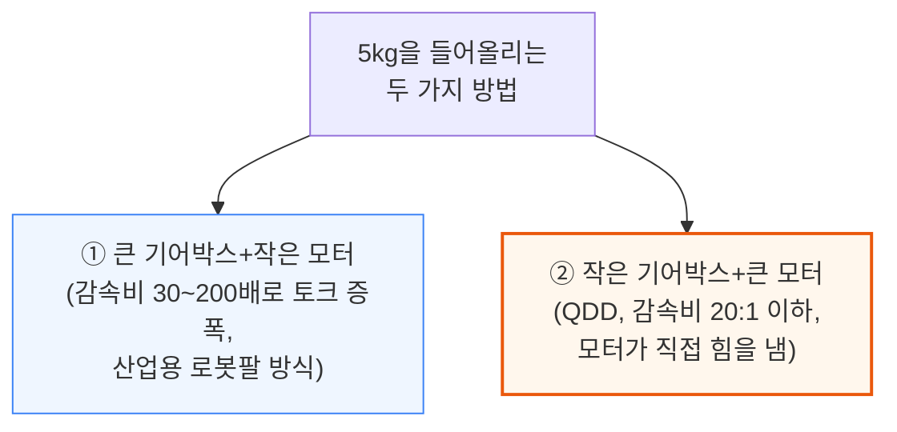

QDD는 충돌 같은 외력에 유연하게 반응하고 동작 범위가 빠르다는 장점이 있지만, 모터가 토크 부담을 직접 지는 만큼 전류를 많이 끌어써 발열이 심하고 신뢰성이 떨어질 것이라는 우려를 낳았습니다.

### 초기 G1의 실제 성능 - 실사용이 어려웠던 이유

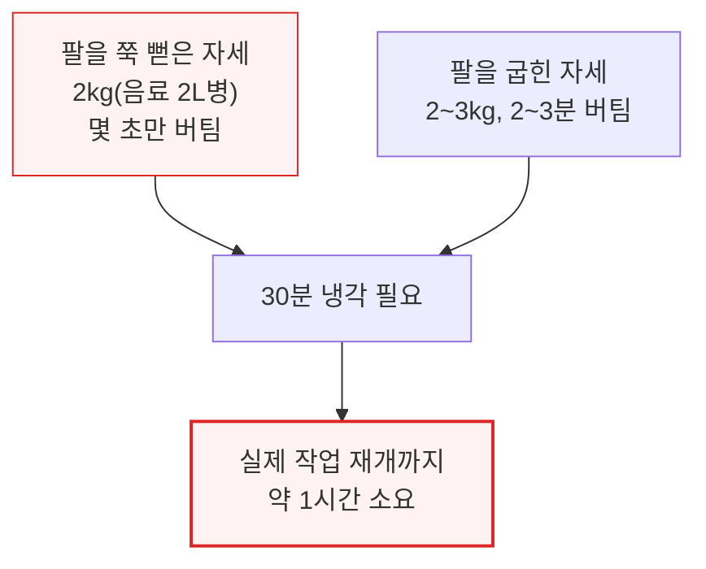

5분 일하고 나머지 1시간을 식히는 로봇은 생산적이라 할 수 없었습니다. 2018년 MIT 미니치타가 QDD(준직접구동)를 대중화하며 "저렴하고 단순한 대안이 실전에서 통할 수 있는가"라는 질문을 던졌고, Unitree는 이 질문에 "그렇다"고 베팅했습니다.

---

## 6. 2년 만의 반전 - QDD가 기대를 뛰어넘다

**📌 핵심:**
- 발열은 전류의 제곱에 비례(P=I²R) — Unitree는 전류(코깅 토크·토크 리플 감소를 위한 자석·슬롯 재설계)와 저항(구리선을 더 두껍고 촘촘하게 감는 "저구리소모 코일") 양쪽을 모두 줄여 발열을 낮췄고, 2025년 10월 골반 부위에 능동 냉각을 추가하는 등 계속 개선 중
- QDD는 스트레인웨이브 대비 효율이 95\~98%(스트레인웨이브는 85\~90%)로 높고 최대 80% 저렴 — 저감속비 유성기어박스는 표준 장비로 가공 가능해 공급사가 많은 반면, 스트레인웨이브(하모닉드라이브 등)는 약 13단계의 정밀 공정이 필요해 하모닉드라이브가 수십 년에 걸쳐 완성한 노하우를 리더드라이브 같은 후발주자도 20년 넘게 따라잡지 못함
- QDD 덕분에 신규 액추에이터 설계를 몇 주 안에 샘플로 만들 수 있음(서구 업체는 공급망 이관 단계가 많아 3개월 이상 소요) — 그 결과 원가 절감뿐 아니라 아무도 눈치채지 못한 골반 냉각 적용 같은 빠른 반복 개선이 가능
- 결론: 개선된 G1은 팔을 굽힌 자세로 5kg을 10\~15분간 버팀(기존 대비 페이로드 2배, 지속시간 5배 증가), 팔을 쭉 뻗은 자세로도 5kg(볼링공 정도)을 약 1분간 버틸 수 있어 인간도 힘든 수준까지 도달

---

### 발열을 낮추는 두 가지 레버 - 전류와 저항

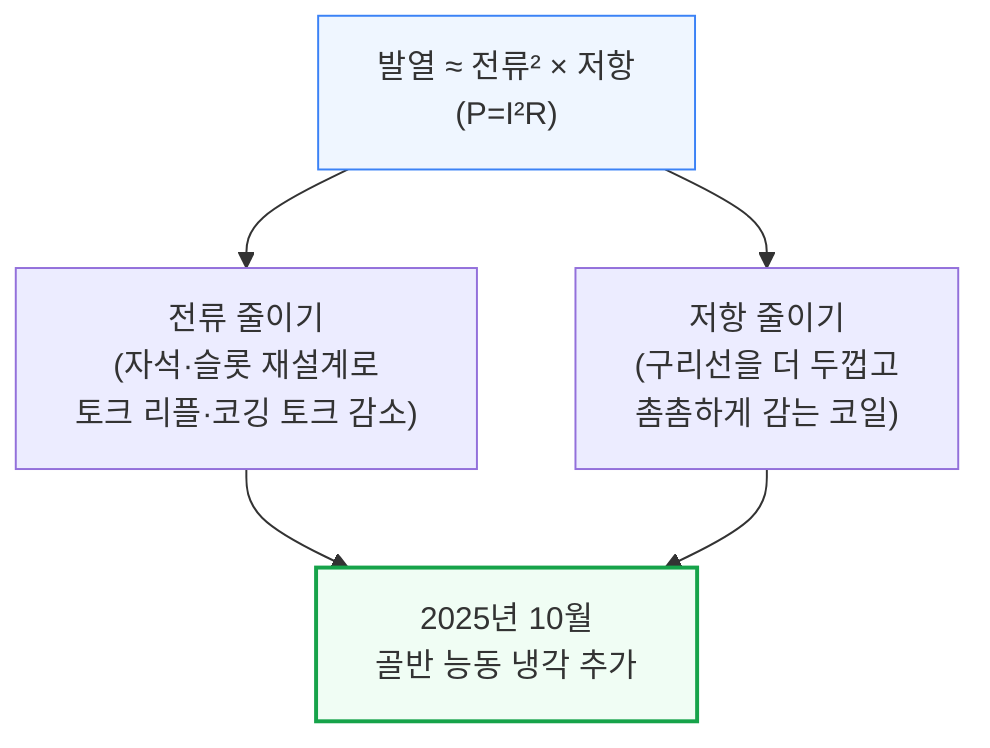

📌 용어 풀이: 토크 리플·코깅 토크가 발열로 이어지는 이유
> - 자전거 바퀴가 살짝 찌그러져 있으면 페달을 밟을 때마다 순간적으로 더 힘을 줘야 하는 것처럼, 모터 회전자의 자력이 고르지 않으면 매 회전마다 저항이 생겨 여분의 전류를 끌어쓰게 되고 그 전류가 그대로 열로 바뀜
> - 자석·슬롯의 모양을 다듬거나 비스듬히 배치해 이 저항을 매끄럽게 만들면, 같은 전류로 더 많은 토크를 뽑아내고 발열도 줄일 수 있음

### QDD vs 스트레인웨이브 - 효율·비용·생산성 비교

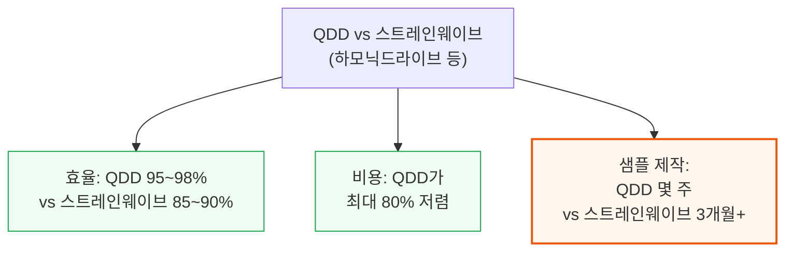

스트레인웨이브 기어는 금속 결정을 여러 시간 열처리해 "휘어지도록" 만든 뒤 미크론 단위로 정밀 가공하는 약 13단계 공정이 필요해, 하모닉드라이브가 수십 년에 걸쳐 완성한 이 공정을 리더드라이브 같은 후발주자도 20년 넘게 따라잡지 못하고 있습니다.
반면 QDD의 저감속비 유성기어박스는 표준 장비로 가공 가능해 공급사가 많고, Unitree는 신규 액추에이터 설계를 몇 주 안에 샘플화할 수 있습니다(서구 휴머노이드 업체는 공급망 이관 단계가 많아 3개월 이상 소요).

### 페이로드·지속시간 개선 - 2년간의 실질적 도약

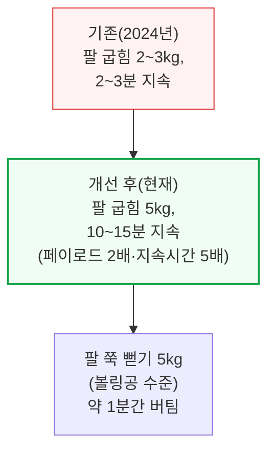

이 정도 페이로드는 사람에게도 상당한 운동량에 해당합니다. 그렇다면 Unitree는 "쓸모 있는" 휴머노이드에 얼마나 가까워졌을까요?

---

*작성 진행률: 약 55% 완료 (1\~6장)*
