# AI Datacenter Energy Dilemma - Race for AI Datacenter Space

> **출처**: [SemiAnalysis Newsletter](https://newsletter.semianalysis.com/p/ai-datacenter-energy-dilemma-race)
> **저자**: Dylan Patel
> **발행일**: 2024-03-14

---

## 📑 목차

### 전체 섹션
 1. [서론: AI 데이터센터 전력 수요를 둘러싼 논쟁](#1-서론-ai-데이터센터-전력-수요를-둘러싼-논쟁)
 2. [진짜 AI 강대국이란 무엇인가](#2-진짜-ai-강대국이란-무엇인가)
 3. [학습과 추론이 요구하는 것](#3-학습과-추론이-요구하는-것)
 4. [데이터센터 전력 계산법: Critical IT Power와 PUE](#4-데이터센터-전력-계산법-critical-it-power와-pue)
 5. [데이터센터 레이아웃과 전력 밀도 제약](#5-데이터센터-레이아웃과-전력-밀도-제약)
 6. [AI 수요 vs 현재 데이터센터 용량](#6-ai-수요-vs-현재-데이터센터-용량)
 7. [AI 학습과 추론의 탄소 및 전력 비용](#7-ai-학습과-추론의-탄소-및-전력-비용)
 8. [진짜 AI 강대국의 3가지 조건](#8-진짜-ai-강대국의-3가지-조건)
 9. [국가별 전기요금, 전원 믹스, 탄소집약도 비교](#9-국가별-전기요금-전원-믹스-탄소집약도-비교)
10. [데이터센터 자본지출과 병목: 변압기, 발전기, 전력망](#10-데이터센터-자본지출과-병목-변압기-발전기-전력망)
11. [지속가능성과 재생에너지 PPA](#11-지속가능성과-재생에너지-ppa)
12. [태양광과 선벨트 지리경제학](#12-태양광과-선벨트-지리경제학)
13. [결론: 진짜 AI 강대국은 미국](#13-결론-진짜-ai-강대국은-미국)

---

## 🔑 용어 정리

본문을 순서대로 읽기 전에 알아두면 좋은 용어들입니다. 자세한 수치와 설명은 본문에서 처음 등장하는 위치에 나옵니다.

- **Critical IT Power**: 데이터센터에서 냉각·조명 등을 뺀, 서버가 실제로 쓰는 순수 전력
- **PUE (전력 사용 효율)**: 데이터센터 전체가 쓰는 전력이, IT 장비만 쓰는 전력의 몇 배인지 나타내는 효율 지표. 낮을수록 좋음
- **가동률 (Utilization Rate)**: IT 장비가 최대 설계 전력 대비 실제로 얼마나 전력을 쓰는지 나타내는 비율
- **TDP (열설계전력)**: 칩이 낼 수 있는 최대 발열·소비전력의 설계 기준값
- **PPA (전력 구매 계약)**: 기업이 재생에너지 발전소로부터 장기간 전력(또는 그 경제적 가치)을 사기로 약속하는 계약
- **Virtual PPA (가상 전력 구매 계약)**: 실제 전기를 직접 받는 대신, 재무적으로만 재생에너지 가격으로 정산받는 방식의 PPA
- **Location-based / Market-based 배출 회계**: 전자는 그 지역 전력망의 실제 배출계수를 그대로 쓰고, 후자는 재생에너지 구매 실적을 배출량에서 빼주는, 서로 다른 두 가지 탄소 배출 계산 방식
- **Scope 1/2/3 배출**: 기업 배출량을 직접 배출(1), 구매한 에너지 사용으로 인한 배출(2), 공급망 전체에서 발생하는 간접 배출(3)로 나누는 국제 분류 체계
- **내재 배출량 (Embodied Emissions)**: 칩이나 장비를 만들고 운반하는 과정에서 이미 발생한 탄소 배출량
- **LDES (장기 에너지 저장)**: 며칠 이상 전력을 저장했다가 필요할 때 꺼내 쓰는 대용량 에너지 저장 기술
- **PVOUT**: 태양광 패널이 특정 지역에서 1년간 실제로 생산하는 전력량을 나타내는 지표
- **GHI (수평면 전일사량)**: 태양광 패널이 받는 햇빛의 총량을 나타내는 기초 측정값
- **설비 이용률 (Capacity Factor)**: 태양광 설비가 이론적 최대 발전량 대비 실제로 얼마나 발전했는지 나타내는 비율
- **LCOE (균등화 발전 비용)**: 발전소를 짓고 운영하는 전체 비용을 총발전량으로 나눈, 전력 1kWh당 실제 원가
- **선벨트 (Sunbelt)**: 일조량이 풍부한 미국 남서부·남부 지역대

---

## 1. 서론: AI 데이터센터 전력 수요를 둘러싼 논쟁

**📌 핵심:**
- AI 컴퓨팅은 6개월마다 10배씩 늘고 있다는 일론 머스크의 주장과 달리, 실제로는 분기당 50~60% 성장(6개월이면 약 2.3~2.6배) 중 → "곧 GPU를 켤 전기 자체가 없어질 것"이라는 위기감은 과장됨
- 비관론 진영은 2030년 전세계 발전량의 **24%**(7,933 TWh, 미국 전체 가구 수 1억 3천만 채의 약 5.6배가 쓰는 전력 규모)를 데이터센터가 먹어치울 것이라 주장하지만, 이는 AI 이전 시대 자료를 재활용한 낡은 추정
- SemiAnalysis는 북미 3,500개 이상 데이터센터의 실측 데이터와 칩 출하량 모델을 결합해 **2030년 4.5%**(비관론의 약 5분의 1 수준)로 전망
- 결론: 전력 위기는 실재하지만 "지구가 통째로 데이터센터가 된다"는 식의 공포 마케팅과는 다른, 훨씬 더 구체적이고 관리 가능한 문제

---

AI 클러스터 수요 급증으로 데이터센터 용량에 대한 관심이 폭발하고 있습니다. 전력망, 발전 용량, 환경에 대한 부담이 극심해지는 가운데, "얼마나 더 필요한가", "어디에 지어지는가", "무엇이 병목이 되는가", "얼마나 많은 초기 투자가 필요한가" 같은 질문이 쏟아지고 있습니다.

일론 머스크는 한 컨퍼런스에서 이렇게 말했습니다.

> "AI 컴퓨팅은 6개월마다 10배씩 늘어나는 것처럼 보인다... 다음 병목은 변압기가 될 것이고, 그다음은 아예 전기를 구하지 못하는 상황이 될 것이다."

### 머스크의 "6개월마다 10배" 주장, 실측 데이터로 검증하면

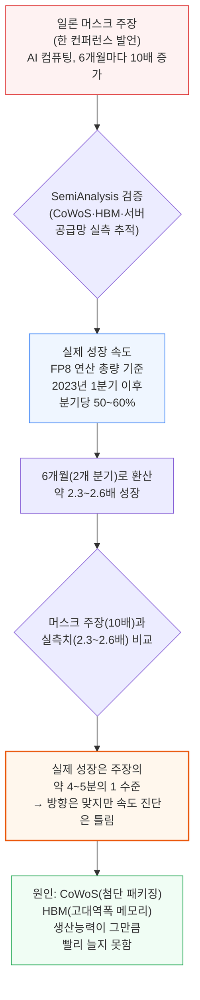

물리적 인프라(전력망, 발전 용량)가 병목이 될 것이라는 머스크의 방향 진단은 맞지만, 속도 진단은 실측 데이터와 크게 어긋납니다.

### 두 개의 극단적 추정과 SemiAnalysis의 접근

데이터센터 전력 수요를 둘러싼 추정치들은 극과 극을 오갑니다.

| 추정 주체 | 전망 내용 | 근거의 문제 |
|---|---|---|
| IEA (국제에너지기구, 2024 Electricity 보고서) | 2026년 AI 데이터센터 전력 수요 90 TWh (≈10GW의 Critical IT Power, H100 약 730만 개 분량, 미국 가정 약 830만 채의 연간 전력 소비량과 맞먹음) | 실제보다 **과소평가** — SemiAnalysis는 Nvidia 한 회사만으로도 2021~2024년 누적 출하량이 H100 500만 개 이상에 해당하는 전력 수요를 만들고, 2025년 초 이미 10GW를 넘어설 것으로 추정 |
| 일부 비관론 진영 (가속컴퓨팅 이전 시대의 낡은 논문 재인용) | 2030년 전세계 발전량의 **24%**(7,933 TWh, 미국 전체 가구 수 1억 3천만 채의 약 5.6배가 연간 쓰는 전력 규모) | AI 가속기가 널리 쓰이기 전, 인터넷 트래픽 증가율 등 추정하기 매우 어려운 변수들의 조합에 기반한 하향식(top-down) 계산 — 맥킨지 등도 근거 없는 연평균 성장률(CAGR)에 그래픽만 입힌 수준 |
| **SemiAnalysis 자체 추정** | 2030년 전세계 발전량의 **4.5%** (비관론 대비 약 1/5 수준) | 북미 3,500개 이상의 임대·초대형(hyperscale) 데이터센터를 실측 추적 + AI 가속기 칩 출하량 모델을 결합 + 위성사진으로 개별 클러스터 건설 진행 상황까지 확인(예: 싱가포르 바로 북쪽 말레이시아 조호르바루의 최대 1,000MW 개발 파이프라인) |

**📌 용어 풀이: Critical IT Power**
> - 데이터센터에서 서버·네트워크 장비가 실제로 쓰는 전력만을 가리키는 말 (냉각·조명·전력 손실 등은 제외)
> - 뒤에 나올 4장에서 이 개념이 실제 계산에 어떻게 쓰이는지 자세히 다룸
> - 단위는 보통 MW(메가와트) 또는 GW(기가와트)

이 낙관도 비관도 아닌 중간 지점을 실증적으로 확인하는 것이 이 리포트의 목적입니다. AI 붐이 데이터센터 전력 소비 증가 속도를 확실히 끌어올리는 것은 맞지만, "지구 전력의 4분의 1을 AI가 먹어치운다"는 종말론적 시나리오와는 거리가 멉니다.

---

## 2. 진짜 AI 강대국이란 무엇인가

**📌 핵심:**
- 전세계 데이터센터의 전력 수요 증가 속도가 연 12~15%에서 연 25%로 가속 → 2023년 490억 와트(49GW)에서 2026년 960억 와트(96GW)로 거의 2배 증가, 이 중 약 400억 와트(40GW)가 AI 몫
- 실제로는 이 증가가 매끄럽게 이뤄지지 않고, 조만간 실질적인 "전력 품귀 현상"이 벌어질 전망
- 값싸고 안정적인 전력 + 탄소 배출 목표를 동시에 지키면서 전력망을 빠르게 늘릴 수 있는 나라는 많지 않음 → 반도체 수출 규제까지 겹쳐, AI 데이터센터를 유치할 수 있는 국가는 소수로 좁혀짐
- 결론: 미국처럼 유연하게 대응 가능한 곳과, 유럽처럼 지정학·규제에 발이 묶인 곳으로 나라별 명암이 갈림

---

전세계 데이터센터의 Critical IT Power(서버가 실제 쓰는 전력) 수요 증가와, 이 급증을 감당하는 데 필요한 조건, 그리고 그 조건 충족 여부에 따라 나라별 명암이 갈리는 과정을 하나의 흐름으로 정리하면 다음과 같습니다.

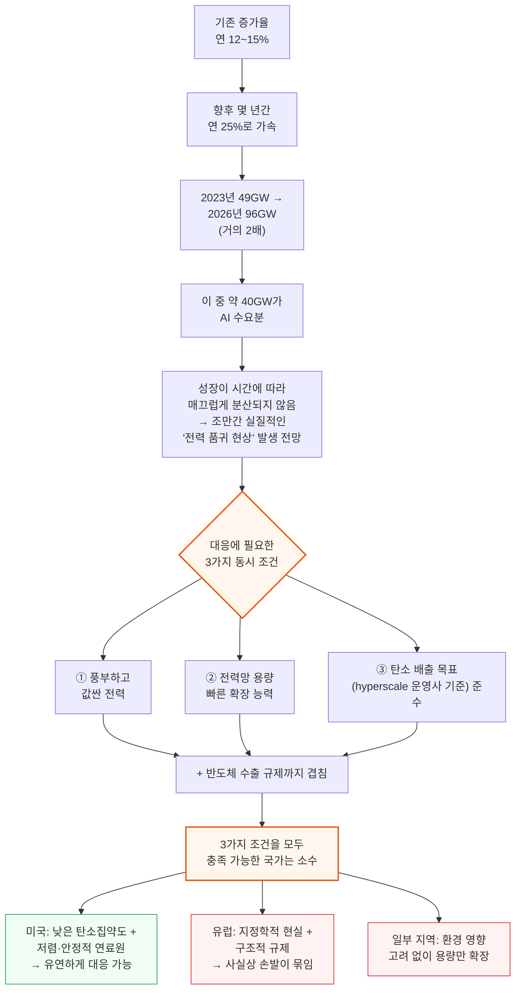

어떤 나라가 실제로 이 세 가지 조건을 충족해 "진짜 AI 강대국"이 될 수 있는지는 8장과 9장에서 국가별로 자세히 비교합니다.

---

## 3. 학습과 추론이 요구하는 것

**📌 핵심:**
- AI 학습(training)은 몇 주~몇 달씩 돌아가고 응답 속도에 둔감해서, 세계 어디에 지어도 상관없음 → 오직 "전기가 싸고 충분한가"만 중요
- 반면 일반 서버(CPU/스토리지)는 1kW급인데, AI 서버는 이미 서버 1대당 10kW를 넘어섬(10배 이상) → 같은 부지라도 훨씬 많은 전력이 필요
- 추론(inference)은 장기적으로 학습보다 훨씬 큰 물량이지만, 여러 지역에 분산 배치가 가능하다는 점이 학습과 다름
- 결론: 학습은 "전기가 싼 곳이면 어디든 OK", 추론은 "물량은 크지만 분산 가능"이라는 서로 다른 입지 전략이 필요

---

AI 학습 작업량은 기존 데이터센터에 흔히 있던 하드웨어 워크로드와 요구사항이 상당히 다릅니다. 두 가지 차이가 입지 전략을 결정합니다.

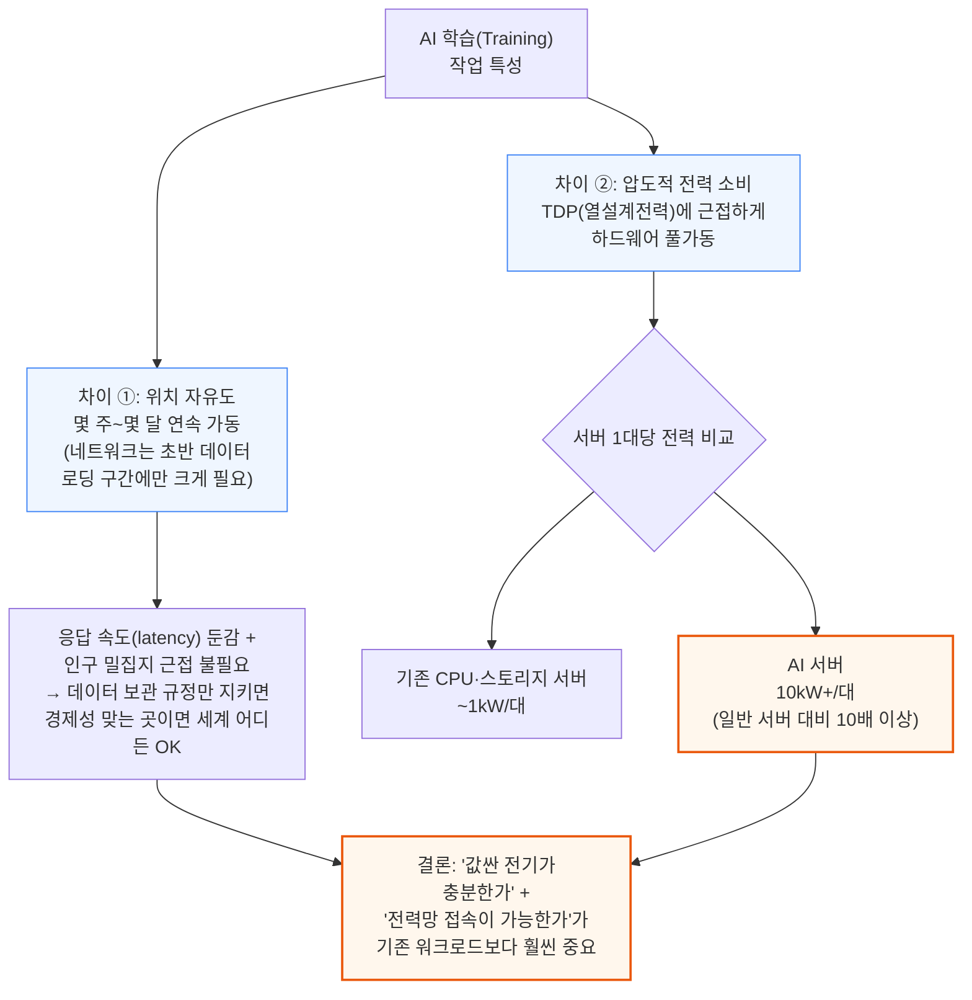

참고로 이런 특징 중 일부는 쓸모없는 암호화폐 채굴과도 비슷하지만, 채굴은 단일 부지 100MW 이상의 규모의 경제 효과가 없다는 차이가 있습니다.

추론(inference)은 장기적으로 학습보다 더 큰 작업량이 되지만, 성격이 다릅니다. 칩이 중앙 한 곳에 모여 있을 필요가 없고, 대신 물량 자체가 압도적으로 많아집니다.

| 구분 | 학습 (Training) | 추론 (Inference) |
|---|---|---|
| 운영 기간 | 몇 주~몇 달 연속 가동 | 상시 서비스 |
| 응답 속도 민감도 | 낮음 (둔감) | 높음 (사용자 대기시간 직결) |
| 입지 제약 | 거의 없음 (전기만 싸고 충분하면 OK) | 사용자와 가까워야 유리 → 분산 배치 |
| 전력 요구 | 서버당 10kW+ (일반 서버 대비 10배 이상) | 학습과 유사한 하드웨어지만 대수가 훨씬 많음 |
| 장기 물량 | 상대적으로 작음 | 장기적으로 학습보다 훨씬 큼 |

---

## 4. 데이터센터 전력 계산법: Critical IT Power와 PUE

**📌 핵심:**
- GPU 1개가 실제로 쓰는 전력은 GPU 자체(700W)뿐 아니라 CPU·메모리·네트워크 장비 몫까지 더해 **1,389W**(GPU 단독 대비 2배)로 계산해야 함
- 여기에 "얼마나 실제로 쓰는가"(가동률 80%)와 "냉각 등 부가 전력이 얼마나 더 붙는가"(PUE 1.25배)를 곱해야 실제 전기요금 청구서에 찍히는 숫자가 나옴
- 실제 사례: GPU 20,480개 클러스터는 서버 쪽 요구량 28.4MW → 가동률·PUE를 반영한 실제 전력망 사용량도 28~29MW → 연간 전기요금 **2,070만 달러**(미국 평균 요금 기준)
- 결론: "GPU가 몇 개 필요하다"는 숫자만으로는 전기요금도, 필요한 데이터센터 규모도 알 수 없음 — 반드시 가동률과 PUE까지 곱해야 진짜 숫자가 나옴

---

### GPU 1개가 실제로 쓰는 전력은 스펙표보다 훨씬 크다

AI 가속기는 (MFU 같은 연산 효율이 아니라) 전력 사용 측면에서 상당히 높은 가동률을 보입니다. GPU 1개의 스펙표 숫자(TDP)에서 실제 클러스터 단위 전력(EAP)까지, 무엇이 얼마나 더해지는지는 다음과 같습니다.

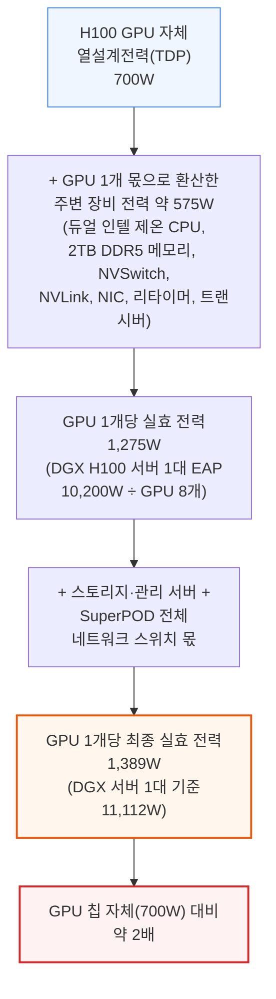

**📌 용어 풀이: TDP와 실효 전력(EAP)의 차이**
> - **TDP (열설계전력)**: 칩 제조사가 발표하는, 칩 하나가 낼 수 있는 설계상 최대 발열·소비전력. H100은 700W
> - **EAP (Expected Average Power, 평균 소비전력)**: 실제 서버 한 대가 정상 가동 시 평균적으로 쓰는 전력. GPU뿐 아니라 CPU·메모리·네트워크 장비까지 다 포함
> - **왜 차이가 큰가?**: 스펙표의 TDP만 보고 전력을 계산하면 실제 필요량을 절반 가까이 과소평가하게 됨 — 반드시 서버·클러스터 단위의 실효 전력으로 계산해야 함

### Critical IT Power → 가동률 → PUE, 세 단계 계산 체인

전력을 계산할 때는 세 단계를 순서대로 거쳐야 실제 전기요금 청구서에 가까운 숫자가 나옵니다. 아래는 GPU 20,480개(대형 학습 클러스터급)를 예로 든 계산 흐름입니다.

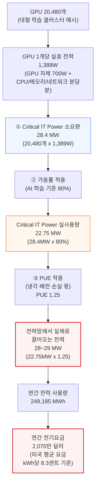

**① Critical IT Power 소요량**: 배치할 IT 장비(서버·네트워크)가 이론상 최대로 쓸 수 있는 전력의 합. 위 예시에서는 GPU 20,480개 × 1,389W = 28.4MW입니다. 이 수치가 곧 "데이터센터에 사야 하거나 지어야 할 전력 용량"의 기준이 됩니다.

**② 가동률 (Utilization Rate)**: IT 장비는 실제로 늘 100%로 돌지 않고, 하루 24시간 내내 똑같은 부하로 돌지도 않습니다. 이 비율을 반영해야 실제 사용량이 나옵니다. AI 학습은 가동률이 80%로 매우 높은 편입니다(예시에서는 22.75MW).

**③ PUE (Power Usage Effectiveness, 전력 사용 효율)**: IT 장비 전력 외에 냉각, 배전 손실, 조명 등 부가 전력까지 포함한 데이터센터 전체 효율 지표입니다.

**📌 용어 풀이: PUE**
> - 계산법: (데이터센터 전체가 쓰는 전력) ÷ (IT 장비만 쓰는 전력)
> - PUE 1.25 = IT 장비가 1W 쓸 때마다 냉각 등에 0.25W를 추가로 씀
> - PUE 1.0은 냉각·조명에 전력을 전혀 안 쓰는 "완벽한" 데이터센터를 뜻하지만 현실에는 없음
> - 일반 임대(colocation) 데이터센터: PUE 1.5~1.6 / 대부분의 초대형 시설: PUE 1.4 미만 / Google 등 전용 설계 시설: PUE 1.10 이하 / AI 데이터센터 목표: PUE 1.3 미만
> - 업계 평균 PUE는 2010년 2.20에서 2022년 약 1.55로 낮아짐 — 이 개선만으로도 데이터센터 전력 소비 폭증을 상당 부분 억제한 최대 요인 중 하나
> - 함정: PUE는 "서버 내부 냉각(팬)"까지 IT 장비 전력으로 잡기 때문에 다소 왜곡된 지표지만, 업계 표준이라 그대로 사용

위 예시에서는 22.75MW × 1.25 = 28.4MW로, 전력망에서 실제로 끌어오는 전력이 28~29MW가 됩니다. 흥미롭게도 이 숫자는 처음의 "Critical IT Power 소요량"(28.4MW)과 거의 같은데, 이는 이 예시에서 가동률 할인(×0.8)과 PUE 할증(×1.25)이 공교롭게 서로 상쇄되었기 때문입니다(0.8 × 1.25 = 1.0). 가동률이나 PUE 값이 달라지면 이 우연의 일치는 깨집니다.

이 28~29MW를 연간으로 환산하면 249,185 메가와트시(MWh)이며, 미국 평균 전기요금(kWh당 8.3센트) 기준으로 연간 **2,070만 달러**의 전기요금이 발생합니다. GPU 대수만 알아서는 이 숫자가 절대 나오지 않고, 반드시 ①Critical IT Power → ②가동률 → ③PUE 세 단계를 순서대로 곱해야 실제 비용에 도달합니다.

---

## 5. 데이터센터 레이아웃과 전력 밀도 제약

**📌 핵심:**
- 일반 임대(colocation) 데이터센터는 랙 하나당 약 12kW까지만 지원 → DGX H100 서버 1대(10.2kW)는 겨우 들어가지만, 랙을 가득 채우면(4대=40.8kW) 3배 이상 부족
- 그래서 랙에 서버 2~3대만 넣고 옆 랙·통로를 통째로 비워서, 비어있는 자리의 전력 할당분을 끌어와 밀도를 12kW→24kW로 2배 늘리는 임시방편을 씀
- Meta는 하이퍼스케일러 중 가장 낮은 전력 밀도로 설계된 건물을 갖고 있었음 → 이미 건설 중이던 프로젝트를 멈추고 AI 전용 설계로 재검토(rescope)하는 결정을 내림
- 결론: 기존 건물을 개조하기보다 새로 짓는 편이 훨씬 쉬움 — 여유 공간이 없으면 발전기·배전반·냉각 배관을 추가로 넣을 자리 자체가 없기 때문

---

### 랙당 전력 한계와 임시방편

DGX H100 서버는 10.2kW의 IT 전력을 요구하는데, 대부분의 임대(colocation) 데이터센터는 랙 하나당 여전히 약 **12kW**까지만 지원합니다. 초대형(hyperscale) 데이터센터는 이보다 더 높은 용량을 제공할 수 있습니다.

랙 하나에 서버 4대(총 40.8kW)를 가득 채우면 12kW 한도보다 3배 넘게 초과하기 때문에, 전력·냉각이 제한된 곳에서는 랙 하나에 서버를 2~3대만 배치하고, 대신 옆 통로나 줄 전체를 비워둡니다. 비어 있는 랙에 원래 배정됐어야 할 전력 할당분을 끌어와 실질적인 전력 밀도를 12kW에서 24kW로 2배 늘리는 방식입니다. 이 방식은 냉각 용량 초과 문제도 함께 해결해 줍니다.

AI 워크로드를 염두에 두고 설계된 최신 데이터센터에서는 공기 흐름을 늘리는 전용 장비를 써서 공랭식만으로도 랙당 **30~40kW 이상**(일반 임대 데이터센터의 12kW 대비 2.5~3.3배)까지 밀도를 높일 수 있습니다. 앞으로 칩에 직접 물을 흘려보내는 냉각 방식(direct-to-chip 물 냉각)이 도입되면 팬 전력이 사라지면서 랙당 전력을 약 10% 줄이고, PUE도 0.2~0.3 낮출 수 있는 잠재력이 있습니다. 다만 이미 PUE가 1.25 안팎까지 내려온 상황이라, 이번이 PUE 개선에서 얻을 수 있는 마지막 큰 폭의 개선이 될 전망입니다.

### 네트워크 거리 제약: 왜 GPU를 서로 가깝게 붙여야 하나

또 다른 중요한 제약은 네트워킹입니다. GPU 간 거리가 멀어질수록 어떤 장비가 더 필요해지고 비용이 어떻게 뛰는지는 다음과 같습니다.

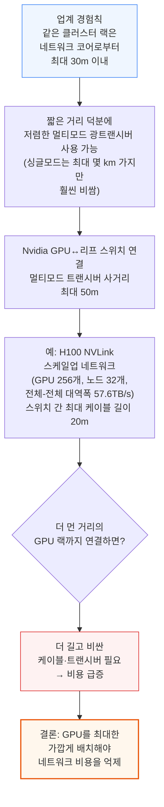

### 공간 비용은 사실 큰 문제가 아니다

랙당 전력 밀도를 높이려는 것은 네트워킹·연산 효율·컴퓨팅당 비용을 고려한 선택이지, 데이터센터 부지 자체의 비용 때문이 아닙니다. 비용 구성을 따라가 보면 공간이 왜 작은 변수인지 알 수 있습니다.

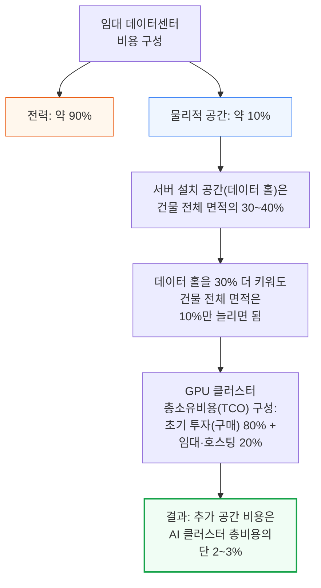

대부분의 기존 임대 데이터센터는 랙당 20kW 이상의 밀도를 감당할 준비가 안 되어 있습니다. 2024년에는 칩 생산 제약이 상당히 풀리겠지만, 일부 초대형 시설·임대 사업자는 AI 대응이 늦어 데이터센터 자체의 용량 부족과 전력 밀도 불일치(기존 임대 시설의 12~15kW 한도가 AI 슈퍼클러스터가 요구하는 밀도의 걸림돌이 되는 상황)라는 이중의 병목에 부딪히게 됩니다.

### Meta가 건설 중이던 건물을 철거·재설계한 이유

랙 뒷문 열교환기(RDHx)나 칩에 직접 물을 흘리는 냉각 방식은 신축 데이터센터에 넣으면 전력 밀도 문제를 해결할 수 있습니다. 문제는 이런 설비를 새 시설에 처음부터 설계해 넣는 것보다, 기존 시설을 개조(retrofit)하는 게 훨씬 어렵다는 점입니다.

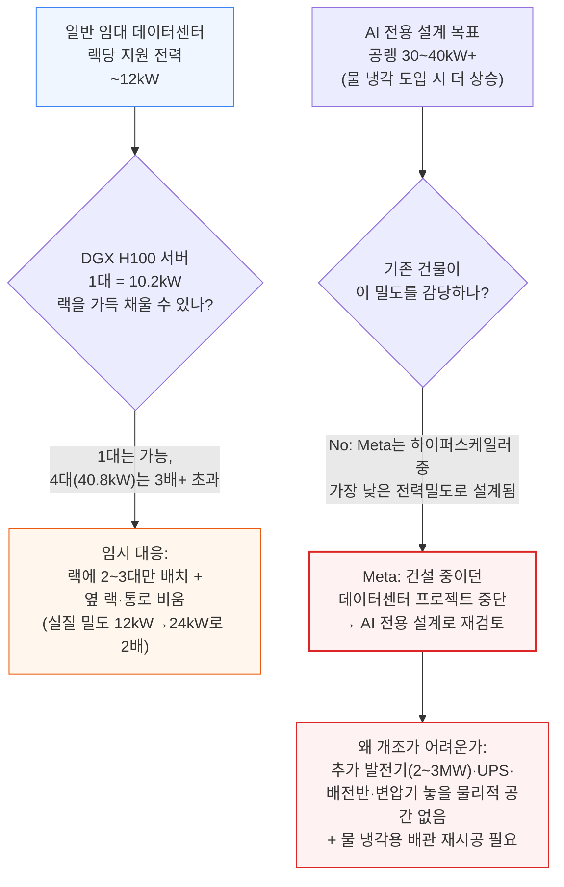

이를 깨달은 Meta는 계획 중이던 데이터센터 프로젝트(덴마크 오덴세 확장 등)를 중단하고, AI 워크로드에 맞춰 처음부터 다시 설계(rescope)하는 쪽을 택했습니다. Meta는 하이퍼스케일러 중 전력 밀도 측면에서 가장 뒤처진 설계를 갖고 있었지만, 문제를 인지하자 매우 빠르게 방향을 틀었습니다.

기존 시설을 개조하는 데는 비용과 시간이 많이 들고, 경우에 따라서는 물리적으로 불가능하기도 합니다. 2~3MW급 발전기, 무정전 전원 공급 장치(UPS), 배전반, 추가 변압기를 놓을 여유 공간이 건물 안에 없을 수 있고, 칩에 직접 물을 공급하는 냉각 방식에 필요한 냉각수 분배 장치(CDU) 배관을 다시 까는 일도 결코 쉬운 작업이 아닙니다.

---

## 6. AI 수요 vs 현재 데이터센터 용량

**📌 핵심:**
- 전세계 데이터센터 전력 수요는 2023년 49GW에서 2026년 96GW로 2배 가까이 증가하고, 이 성장의 90%가 AI에서 나옴
- 미국은 위성사진으로 확인되는 AI 클러스터 대부분이 몰려 있는 지역 → 미국만 따로 보면 필요한 전력 용량이 2023~2027년 사이 **3배**로 뛸 전망
- Nvidia 한 회사의 2024년 GPU 출하량(300만 개 이상 전망)만으로도 필요한 데이터센터 용량이 4,200MW → 이는 현재 전세계 데이터센터 총용량의 약 10%에 해당(단 1년치 출하량 기준)
- 결론: OpenAI·Meta·CoreWeave·Microsoft는 빠르게 움직이는 반면, Amazon은 AI 대응이 가장 늦어 근시일 내 실제 배치 물량에서 뒤처짐

---

### 전체 그림: 49GW에서 96GW로, 그리고 미국 집중

AI 가속기 칩의 출하량 예측과 예상 전력 사양을 결합하면, 앞으로 몇 년간 필요한 AI 데이터센터 Critical IT Power(서버가 실제 쓰는 전력) 수요를 계산할 수 있습니다. 이는 순수하게 칩 수요만 반영한 숫자이고, 실제 물리적 데이터센터 건설 상황이 이 수요를 어디서 얼마나 흡수해야 하는지는 다음과 같습니다.

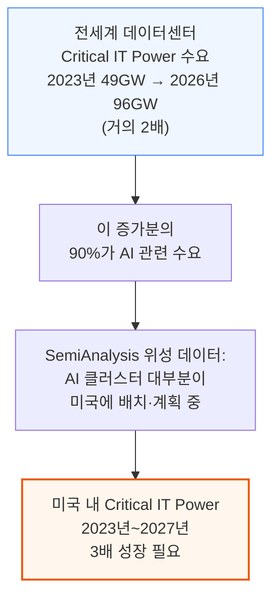

### 주요 사업자별 움직임

| 사업자 | 현황 |
|---|---|
| OpenAI | 단일 최대 규모의 다중 사이트 학습 클러스터에 GPU 수십만 개 배치 계획 → 수백 MW급 Critical IT Power 필요. 발전기·냉각탑 등 물리적 인프라 건설 현황으로 클러스터 규모를 상당히 정확하게 추적 가능 |
| Meta | 연말까지 H100 환산 65만 개 규모의 설치 기반(installed base) 확보 계획 언급 |
| CoreWeave | 텍사스 플레이노 시설에 16억 달러 투자 계획 → Critical IT Power 최대 50MW 건설, GPU 3만~4만 개 설치 예상. 회사 전체로는 250MW(H100 환산 18만 개 규모) 데이터센터 확보 경로 확보, 단일 부지 수백 MW 규모 계획도 진행 중 |
| Microsoft | AI 붐 이전부터 가장 큰 데이터센터 파이프라인 보유 → AI 붐 이후 임대 가능한 공간을 닥치는 대로 확보하며 건설도 공격적으로 확대 |
| Amazon(AWS) | 원자력 발전 연계 데이터센터(1,000MW 규모) 보도자료를 냈지만, 하이퍼스케일러 중 AI 대응이 가장 늦어 근시일 내 실제 배치 물량에서는 명백히 뒤처짐 |
| Google | Microsoft/OpenAI와 함께 기가와트(GW)급 이상의 초대형 학습 클러스터 계획 진행 중 |

AWS는 원자력 발전과 연계된 1,000MW 규모의 데이터센터 캠퍼스를 6억 5,000만 달러에 인수했습니다. 다만 근시일 내 가동 가능한 것은 48MW 용량의 첫 번째 건물뿐이며, 이 정도 규모의 캠퍼스가 약속된 1,000MW까지 완전히 가동되려면 수년이 걸릴 것으로 예상됩니다.

### 공급 측면: Nvidia 한 회사의 출하량만으로도

증권가 컨센서스 추정치인 2024년 Nvidia GPU 출하량만으로도 필요한 데이터센터 용량이 어느 정도인지, 그리고 이 추정치가 왜 오히려 보수적인지는 다음과 같습니다.

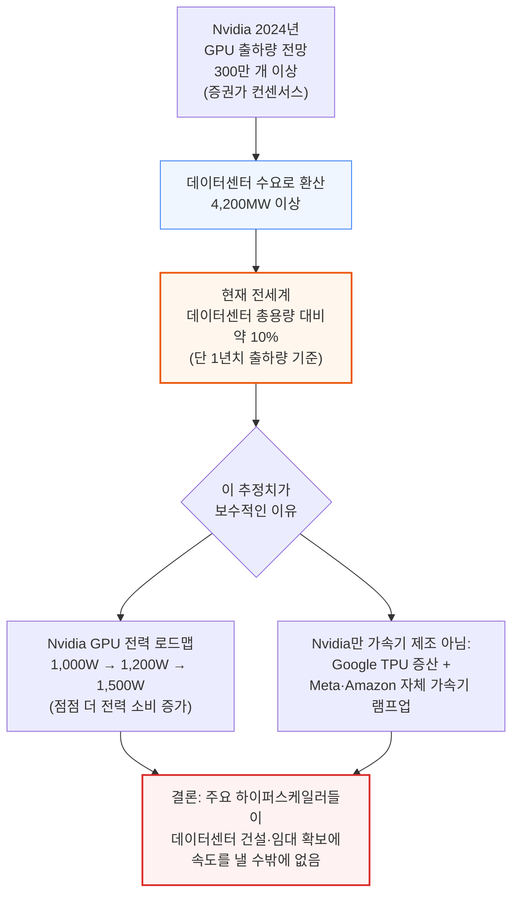

---

## 7. AI 학습과 추론의 탄소 및 전력 비용

**📌 핵심:**
- BLOOM(1,750억 파라미터) 모델을 학습한 프랑스는 원자력 비중이 60%라 전력망 탄소집약도가 kWh당 0.057kg CO2e로, 미국 평균(0.387kg, 프랑스의 약 6.8배)보다 훨씬 깨끗함 → 같은 학습을 어디서 하느냐에 따라 탄소 배출이 크게 달라짐
- 칩·서버를 만들 때 이미 발생한 "내재 배출량"이 전체 학습 탄소 배출의 8~10%를 차지 (A100 1개당 150kg, 8-GPU 서버 1대당 2,500kg CO2e)
- GPT-3 학습 1회의 탄소 배출은 588.9톤(승용차 128대의 연간 배출량과 동일)이지만, 구글 한 회사의 2022년 총배출량(804만 5,800톤)은 이 배출량의 **약 1만 3,663배** → GPT-3 학습 탄소를 문제 삼는 것은 비행기를 매달 타면서 페트병 재활용을 걱정하는 격
- 결론: 개별 모델 학습의 탄소 발자국은 아직 미미하지만, GPT-4급 이상으로 연산량이 몇 자릿수 뛰면 상황이 달라짐 — 추론까지 합치면 누적 배출량은 계속 커짐

---

### 학습 탄소 배출을 실증적으로 추정하기

AI 산업이 배출하는 탄소를 이해하려면, 인기 모델을 학습시키는 데 필요한 전력부터 알아야 합니다. 논문 "Estimating the Carbon Footprint of BLOOM, a 175B Parameter Language Model"은 프랑스 CNRS 산하 IDRIS의 Jean Zay 컴퓨터 클러스터에서 BLOOM 모델을 학습시킬 때의 전력 사용량을 분석했습니다. 이 논문은 AI 칩의 TDP(열설계전력)가 스토리지·네트워킹 등을 포함한 클러스터 전체 전력 사용, 나아가 전력망에서 실제로 끌어오는 전력까지 어떻게 이어지는지 실증적으로 보여줍니다. 또 다른 논문 "Carbon Emissions and Large Neural Network Training"은 다른 여러 모델의 학습 시간·구성·전력 소비를 다룹니다. 학습에 필요한 전력은 모델·학습 알고리즘의 효율(모델 연산 활용률, MFU), 네트워킹과 서버 자체의 전력 효율에 따라 달라지지만, 두 논문의 결과는 좋은 눈대중 기준을 제공합니다.

**📌 용어 풀이: 탄소 배출량 계산법과 내재 배출량**
> - 계산법: 총 전력 소비량(kWh) × 그 전력망의 탄소집약도(kg CO2e/kWh)
> - 프랑스(BLOOM 학습 위치): 전력의 60%가 원자력 → 탄소집약도 kWh당 0.057kg CO2e
> - 미국 평균: kWh당 0.387kg CO2e (프랑스의 약 6.8배) — 같은 학습을 미국 평균 전력망에서 돌리면 탄소 배출이 6.8배로 뛴다는 뜻
> - **내재 배출량(Embodied Emissions)**: 칩·장비를 만들고 운반하는 과정에서 이미 발생한 탄소. A100 GPU 1개당 약 150kg CO2e, GPU 8개짜리 서버 1대당 약 2,500kg CO2e로 추정되며, 전체 학습 탄소 배출의 8~10%를 차지

### GPT-3 학습 탄소 배출을 맥락 속에서 보기

이런 학습 실행에서 발생하는 탄소 배출은 결코 작지 않습니다 — GPT-3 학습 1회는 588.9메트릭톤의 CO2e를 배출했는데, 이는 승용차 128대의 연간 배출량과 맞먹습니다. 다만 이 숫자를 걱정하는 것은, 페트병을 열심히 재활용하면서 몇 달에 한 번씩 비행기를 타는 것과 비슷한, 사실상 의미 없는 도덕적 제스처에 가깝습니다.

반대로, 최종 모델을 확정하기까지는 여러 차례의 시행착오 학습이 있었을 것이라는 점도 감안해야 합니다. 2022년 한 해에만 구글은 데이터센터를 포함한 자사 시설에서 총 804만 5,800메트릭톤의 CO2e를 배출했습니다(재생에너지 상쇄 반영 전 기준). GPT-3 학습 1회(588.9톤)와 비교하면 구글의 연간 총배출량은 이보다 약 **1만 3,663배** 큽니다. 즉 GPT-3 자체는 전세계 탄소 배출에 유의미한 영향을 주지 않지만, GPT-4의 연산량이 GPT-3보다 몇 자릿수 크고, 현재 OpenAI가 진행 중인 학습이 GPT-4보다 또 한 자릿수 이상 크다는 점을 고려하면, 앞으로 몇 년 안에 학습 탄소 배출 규모가 무시할 수 없는 수준으로 커질 것입니다.

### 추론의 전력·탄소 비용

추론(inference) 쪽 경제성은 SemiAnalysis의 "GPU Cloud Economics"와 "Groq Inference Tokenomics" 리포트에서 자세히 다뤘습니다. GPU 8개짜리 일반적인 H100 서버 1대는 월 약 2,450kg의 CO2e를 배출하고, 10,200W의 IT 전력을 필요로 하며, kWh당 8.7센트 기준으로 월 648달러의 전기요금이 발생합니다.

이렇게 서버 1대 단위로 보면 작아 보이는 숫자도, 앞서 6장에서 본 것처럼 전세계에 배치되는 서버 대수가 수십만~수백만 대 단위로 늘어나면 누적 탄소·전력 비용은 결코 무시할 수 없는 규모가 됩니다.

---

## 8. 진짜 AI 강대국의 3가지 조건

**📌 핵심:**
- AI 데이터센터 산업이 대규모로 성장하려면 나라마다 3가지 조건이 동시에 필요: (1) 값싼 전기 (2) 안정적인 에너지 공급망 (3) 탄소집약도가 낮은 전원 믹스
- 추론 수요는 시간이 갈수록 계속 누적되므로, 전기값이 싼 것만으로는 부족하고 "지속적으로 저렴하게 유지될 수 있는가"가 중요
- 지정학·기후 리스크로 인한 에너지 가격 급등을 막으려면 연료 공급의 안정성과, 필요시 빠르게 발전 용량을 늘릴 수 있는 능력이 필수
- 결론: 이 3가지 조건을 모두 충족하는 나라만 "진짜 AI 강대국" 후보가 될 수 있음 → 다음 장에서 국가별로 하나씩 검증

---

AI 데이터센터 산업이 이만큼 커지려면 다음 세 가지가 필요합니다.

1. **값싼 전기**: 지속적으로 소비되는 막대한 전력량을 감안하면, 특히 시간이 갈수록 물량이 계속 쌓이는 추론 수요를 고려할 때 전기요금이 저렴해야 함
2. **안정적인 에너지 공급망**: 지정학적 사건이나 기상 이변에도 흔들리지 않는 연료 공급, 그리고 필요할 때 빠르게 연료 생산과 발전 용량을 늘릴 수 있는 능력. 이 안정성이 있어야 전기값 급등 위험을 줄일 수 있음
3. **낮은 탄소집약도의 전원 믹스**: 전체 전원 구성의 탄소집약도가 낮고, 경제성 있는 수준으로 재생에너지를 대량으로 세울 수 있는 여건

이 세 조건을 모두 충족할 수 있는 나라와 지역이 "진짜 AI 강대국(Real AI Superpower)" 후보입니다. 다음 장에서는 미국·일본·대만·한국·싱가포르·중국·유럽·중동을 이 세 조건에 비추어 하나씩 비교합니다.

---

## 9. 국가별 전기요금, 전원 믹스, 탄소집약도 비교

**📌 핵심:**
- 미국은 전기요금(kWh당 8.3센트)이 세계 최저 수준이면서, 셰일가스 혁명 덕분에 천연가스를 자급자족 → 지정학 리스크와 가격 급등 위험이 모두 낮음
- 일본·대만·한국·싱가포르는 연료 90% 이상을 수입에 의존해 전기요금이 미국보다 최대 3배 가까이 비쌈(싱가포르 kWh당 23센트) → 대만·한국은 국영 전력회사가 조 단위 적자를 내면서까지 요금을 인위적으로 낮춰주는 상황
- 중국은 전기요금은 싸지만(kWh당 9.2센트) 석탄 비중이 61%로 높아 탄소 배출 부담이 크고, 미국의 반도체 수출 규제까지 겹쳐 AI 인프라 확장이 원천적으로 제약됨
- 결론: 유럽은 전기요금이 미국의 거의 3배(아일랜드 21.1센트)에 에너지 수입 의존도까지 높아 "세 조건" 중 어느 것도 충족하지 못하는 최약체 지역

---

여러 국가·지역을 3가지 조건(값싼 전기, 공급 안정성, 낮은 탄소집약도)에 비추어 비교하면 다음과 같습니다.

| 국가·지역 | 산업용 전기요금 (kWh당) | 전원 믹스 특징 | 탄소·공급 이슈 |
|---|---|---|---|
| 미국 | 8.3센트 (세계 최저 수준) | 천연가스 약 40%, 석탄 20%(2012년 37%→2030년 8% 전망) | 셰일가스로 자급자족, 20년치 확인 매장량(2015년 대비 2배, 2021년만 +32%) → 지정학 리스크 최소 |
| 일본 | 15.2센트 (미국 대비 82% 비쌈) | 천연가스 35%, 석탄 34%, 수력 7%, 원자력 5% | 연료 90% 이상 수입 |
| 대만·한국 | 10~12센트 (실제로는 3~4센트 보조금 반영된 가격) | 천연가스 수입 의존 | 한국전력 2022년 240억 달러 적자, 대만전력 kWh당 4센트 손실 판매 |
| 싱가포르 | 23센트 (조사 대상 중 최고) | 천연가스 90% | 데이터센터가 전국 전력의 10% 이상 소비 → 신규 데이터센터 건설 모라토리엄(2023년 7월 해제, 80MW만 신규 승인) |
| 중국 | 9.2센트 (낮은 편) | 석탄 61% | 재생에너지 설치량은 세계 1위지만 실제 발전 비중은 13.5%(2022)에 불과, 반도체 수출 규제로 AI 확장 제약 |
| 유럽(EU 평균) | 18센트 (영국 23.5센트, 아일랜드 21.1센트 — 미국의 거의 3배) | 천연가스 35~45% | 원자력 급감(독일 2007~2021년 75%↓), 가스 90% 이상 수입(중동·러시아) |
| 중동(UAE·사우디) | 세계 최저 수준 | 태양광 잠재력 매우 높음 | UAE 115MW(2022)→330MW(2026, 약 3배), 사우디 67MW→530MW 계획(약 8배) |

### 미국: 셰일가스가 만든 압도적 우위

미국은 평균 전기요금 kWh당 8.3센트로 세계에서 가장 낮은 축에 속합니다. 2000년대 초 셰일가스 혁명 이후 천연가스 생산이 급증해 미국은 세계 최대 천연가스 생산국이 되었고, 미국 전력 생산의 거의 40%가 천연가스로 채워집니다. 미국이 천연가스를 자급자족한다는 사실은 가격의 지정학적 안정성을 더해주고, 가스전이 전국에 넓게 분포한다는 점은 공급망의 견고함을 더해줍니다. 20년치 확인 매장량 역시 2015년 대비 2배, 2021년 한 해에만 32% 늘어나는 등 계속 증가하고 있어 장기 공급 안정성도 높습니다.

미국은 석탄 비중도 2012년 37%에서 2022년 20%로 낮췄고, 2030년에는 8%까지 낮아질 전망입니다. 이는 인도(75%), 중국(61%), 일본(34%, 2022년 기준)보다 훨씬 낮은 수준입니다. 석탄 발전의 탄소집약도(kWh당 1.025kg CO2e)는 천연가스(kWh당 0.443kg CO2e)의 **2배 이상**이기 때문에, 이 차이는 매우 중요합니다. 미국 내 데이터센터는 이 덕분에 야간·기저부하(baseload) 전력을 훨씬 깨끗한 연료 믹스로 공급받을 수 있습니다.

### 동아시아: 수입 의존이 만든 고비용 구조

동아시아와 서유럽은 각각 전세계 데이터센터 용량의 약 15%, 18%를 차지합니다. 미국이 천연가스를 자급자족하는 것과 달리, 일본·대만·싱가포르·한국은 가스·석탄 수요의 90% 이상을 수입에 의존합니다.

일본의 전원 믹스는 이런 수입 연료 위주로, 천연가스 35%, 석탄 34%, 수력 7%, 원자력 5%로 구성됩니다. 그 결과 2022년 평균 산업용 전기요금은 kWh당 15.2센트로, 미국(8.3센트) 대비 **82% 비쌉니다**. 대만과 한국도 천연가스 수입에 의존하는 비슷한 전원 믹스를 갖고 있고, 전기요금은 kWh당 약 10~12센트 수준이지만, 이는 이미 3~4센트의 실질 보조금이 반영된 가격입니다. 국영 전력회사들이 막대한 손실을 감수하며 요금을 낮게 유지하고 있는데, 한국전력은 2022년 240억 달러의 적자를 냈고, 대만전력은 판매 kWh당 4센트씩 손실을 보고 있습니다.

동남아에서는 싱가포르가 또 다른 데이터센터 허브입니다. 전력 생산의 90%를 수입 천연가스에 의존해 2022년 전기요금이 kWh당 23센트로 조사 대상 중 가장 높았습니다. 싱가포르가 보유한 Critical IT Power 900MW는 자국 발전 용량 대비 상당히 큰 규모로, 전국 전력 생산량의 10% 이상을 데이터센터가 소비합니다. 이 때문에 신규 데이터센터 건설에 4년간 모라토리엄(건설 중단 조치)이 있었고, 2023년 7월 해제되면서도 단 80MW의 신규 용량만 승인되었습니다. 이 제약이 싱가포르 바로 북쪽, 말레이시아 조호르바루에 최대 1,000MW 규모의 개발 파이프라인을 만들어냈으며, 그 상당 부분은 본토 중국 모기업과 거리를 두고 "국제화"를 꾀하는 중국계 기업들이 주도하고 있습니다. 인도네시아도 상당한 파이프라인을 갖고 있습니다.

### 중국: 값싼 전기, 하지만 더러운 전원 믹스와 수출 규제

중국의 산업용 전기요금은 kWh당 9.2센트로 다른 신흥국들과 마찬가지로 낮은 편이지만, 발전의 61%를 석탄에 의존하는 매우 더러운 전원 믹스를 갖고 있습니다. 탄소 배출 관점에서 상당한 약점이며, 중국이 재생에너지 설치 측면에서 세계를 압도적으로 선도함에도 불구하고 신규 석탄 발전소는 여전히 계속 승인되고 있습니다. 순배출제로(net-zero) 목표를 가진 하이퍼스케일러나 AI 기업이라면 석탄의 탄소집약도(kWh당 1.025kg CO2e, 천연가스의 2배 이상)를 감안할 때 이 목표 달성이 상당히 험난할 것입니다.

중국은 석탄 발전 원료는 대부분 자급하지만, 그 밖의 에너지원 대부분은 수입에 의존합니다. 석유·LNG 수입의 70% 이상이 말라카 해협을 거쳐 운송되는데, 이런 지정학적 취약점을 **말라카 딜레마(Malacca Dilemma)**라고 부릅니다. 전략적인 이유로 중국은 천연가스 쪽으로 방향을 크게 틀 수 없고, 기저부하 발전을 늘리려면 석탄과 원자력에 계속 의존할 수밖에 없습니다. 중국이 재생에너지 설치 용량 증설에서는 세계를 이끌고 있지만, 기존의 방대한 화석연료 발전소 기반과 석탄 발전 증설이 계속되는 탓에, 2022년 기준 실제 발전량 중 재생에너지 비중은 13.5%에 불과합니다.

여기에 더해 미국 산업안보국(BIS)의 반도체 수출 규제가 있습니다. 중국이 AI 칩을 거의 전혀 확보하지 못하도록 하는 것이 이 규제의 목적이며, Nvidia는 규제 변화에 맞춰 계속 사양을 조정한 H20 등의 칩으로 대응하고 있지만, 이는 규제가 없었다면 중국이 수입했을 AI 칩의 35~40%에는 여전히 크게 못 미치는 수준입니다. 결과적으로 중국은 발전 설비를 가장 잘 짓는 나라이고 조건만 맞으면 기가와트급 데이터센터 건설을 주도할 역량이 있지만, 이 수출 규제 때문에 그럴 수 없는 상황입니다.

### 유럽: 지정학과 규제에 발이 묶인 곳

서유럽의 전력 생산량은 지난 5년간 누적 5% 감소했습니다. 원인 중 하나는 원자력 발전이 정치적으로 받아들여지지 않게 되면서 급감한 것으로, 예를 들어 독일은 2007년부터 2021년 사이 원자력 발전량이 75% 줄었습니다. "환경"에 대한 강한 관심으로 석탄 같은 더러운 연료원도 같은 기간 크게 줄었지만, 세계에서 가장 깨끗한 전원인 원자력의 빈자리를 일부는 석탄과 천연가스가 대신 채우는 역설도 벌어졌습니다. 재생에너지가 유럽 전원 믹스에서 늘고 있지만 충분히 빠르지 않아, 많은 유럽 국가들이 천연가스 쪽으로 방향을 틀 수밖에 없었고, 이제 천연가스는 주요 서유럽 국가 전원 믹스의 35~45%를 차지합니다.

이런 에너지 상황 때문에 2022년 EU 평균 산업용 전기요금은 kWh당 18센트에 달했고, 영국은 23.5센트, 데이터센터 강자인 아일랜드는 21.1센트로 미국의 거의 3배입니다. 아시아와 마찬가지로 유럽도 가스의 90% 이상을 LNG 형태로 수입하는데, 주로 중동에서 들여오고(전쟁 중임에도 러시아산도 여전히 일부 있음) 데이터센터뿐 아니라 산업 기반 전체가 지정학적 위험에 노출되어 있습니다 — 우크라이나 전쟁 발발 초기를 떠올려보면 익숙한 이야기입니다. 이런 정치적·지정학적 현실을 감안하면, AI 데이터센터 붐을 감당할 만큼 대규모 발전 용량을 유럽에 추가하는 것은 매우 어려운 일입니다.

여기에 더해 유럽은 데이터센터·제조업에 이미 적용되고 있는 각종 규제와 제약으로 인해 신규 건설 자체에 알레르기 반응을 보입니다. 소규모 프로젝트와 파이프라인은 진행 중이지만(지정학적 필요성을 어느 정도 인식한 프랑스가 그나마 적극적), 유럽에서 기가와트급 클러스터를 지으려는 계획은 어디에도 없습니다. SemiAnalysis 추정으로 유럽은 전세계에 배치된 AI 가속기 연산능력의 4% 미만을 차지합니다.

전기요금 격차는 결코 사소하지 않습니다 — AI 클러스터 규모를 감안하면 어디에 짓느냐에 따라 수억 달러 단위의 비용 차이가 발생합니다. 유럽이나 아시아에 AI 데이터센터를 지으면 미국 대비 전력 비용이 쉽게 2~3배로 뛰고, 숙련 인력 부족으로 건설 비용도 더 비쌉니다.

### 중동: 낮은 전기요금과 태양광 잠재력의 신흥 강자

중동은 데이터센터 건설 경쟁에 뛰어들고 있는 또 다른 지역으로, 세계 최저 수준의 전기요금과 매우 높은 태양광 발전 잠재력 등 "진짜 AI 강대국" 조건 중 일부에서 높은 점수를 받습니다. UAE는 Critical IT Power를 2022년 115MW에서 2026년 330MW로 거의 3배 늘릴 전망이며 강력한 파이프라인을 갖고 있습니다.

사우디아라비아는 이미 H100 3,000개 소규모 구매로 첫발을 뗐고(자체 연구기관용, 자체 대규모언어모델 개발 계획도 있음), Microsoft도 카타르(2022년 가동)에 이어 사우디아라비아에 데이터센터를 세울 계획을 발표했습니다. 사우디아라비아는 현재 Critical IT Power 67MW로 UAE에 다소 뒤처져 있지만, 향후 몇 년 안에 UAE를 앞질러 530MW(현재의 약 8배)에 도달할 계획입니다.

한편 이제 막 스텔스 모드를 벗어난 AI 스타트업 Omniva는 쿠웨이트 왕실 인사의 상당한 자금 지원을 받아 중동에 저비용 AI 데이터센터를 짓겠다는 목표를 갖고 있으며, 전직 AWS·Meta·Microsoft 인력을 핵심 인재로 두고 있습니다. 실제 현장에서 가장 두드러진 움직임과 인상적인 인재 이력을 갖고 있지만, 전직 직원이 문서를 유출하고 전직 직원 8명을 영입했다는 이유로 Meta로부터 소송을 당한 상태이기도 합니다.

---

## 10. 데이터센터 자본지출과 병목: 변압기, 발전기, 전력망

**📌 핵심:**
- 대형 변압기는 맞춤 제작이라 리드타임(주문부터 납품까지 걸리는 시간)이 12~24개월에 달함 → 데이터센터를 짓기 한참 전부터 미리 주문해야 함
- 전력망 접속 대기 물량은 2022년 기준 1,350GW(전년 대비 40% 증가)까지 쌓였고, 일부 지역은 대기 시간이 5년에 달함 → 미국 정부가 290억 달러 지원 법안과 규제 개혁으로 대응 중이지만 효과는 미지수
- 개혁이 충분히 빠르지 않으면 데이터센터 사업자들은 원자력 등 자체 발전으로 전력망 자체를 우회하는 길을 택할 수 있음 → 최악의 경우 GPU 수백만 개가 전원조차 공급받지 못하는 상황도 배제할 수 없음
- 결론: 데이터센터 설비투자는 2023년 490억 달러에서 2026년 1,670억 달러로 3.4배 성장할 전망이며, 이 중 40~45%가 전력 설비에 들어감

---

### 변압기와 발전기: 오래된 기술이 만드는 새로운 병목

전력 관련 대형 설비가 가장 자주 언급되는 잠재적 병목입니다. 변압기는 원래 하나하나 맞춤 제작되는 장비라, 평상시에도 리드타임이 12~24개월에 달합니다. 전력망이 110kV나 220kV급 초고압으로 접속을 요구하는 경우, 사업자는 사실상 이를 11kV나 22kV급 중압으로 낮추는 변전소 하나를 통째로 새로 지어야 하고, 다시 데이터 홀 공급용으로 480V까지 낮추는 변압기 뱅크를 또 지어야 해서 리드타임이 특히 길어집니다. 변압기는 근본적으로 구리와 원자재 덩어리이고, 지난 50년간 기술 자체는 거의 바뀌지 않았기 때문에, 생산을 늘리는 것은 결국 인력·교대 근무·신규 생산시설 확충의 문제입니다. 발전기도 리드타임이 비슷하지만 변압기만큼 특수한 기술은 아니라서, 다양한 공급사의 신규 생산시설을 통해 공급을 늘리는 대응이 상대적으로 쉽습니다.

### 전력망 접속 적체: 더 풀기 어려운 병목

전력망 제약은 극복하기가 더 까다로울 수 있습니다. 전력망 송전 인프라 개선은 지역 인구통계와 경제 성장을 감안해 보통 5~10년 주기로 계획되기 때문에, 데이터센터 건설 급증에 그만큼 빠르게 대응할 수 없습니다. 이 문제는 수년째 곪아 왔지만 최근 들어 훨씬 심해졌습니다 — 미국 전체 전력망 접속 대기 물량은 2022년 한 해 동안 전년 대비 40% 늘어 총 1,350GW(발전 설비 기준)까지 쌓였고, 일부 시장은 접속 대기 시간이 2022년 기준 최대 5년에 달합니다.

특히 태양광 프로젝트의 적체가 심한데, 미국에서 가장 빠르게 늘고 있는 발전원이기 때문입니다. 배터리 저장, 풍력, 천연가스 등 다른 발전원도 영향을 받고 있습니다.

이 문제를 풀기 위한 조치도 있었습니다. 2022년 인플레이션 감축법(IRA, 2022년 미국에서 통과된 기후·에너지 관련 대규모 재정 지원 법안)에는 전력망 개선을 위한 290억 달러 지원이 포함됐고, 2023년 8월에는 미국 연방에너지규제위원회(FERC, 전력망을 규제하는 연방 기관)가 접속 승인 절차 개혁을 승인했습니다 — 프로젝트를 일괄(batch) 단위로 심사하고, 신속한 심사 기한을 정하며, 접속 신청서 양식을 단순화·통합하는 내용입니다.

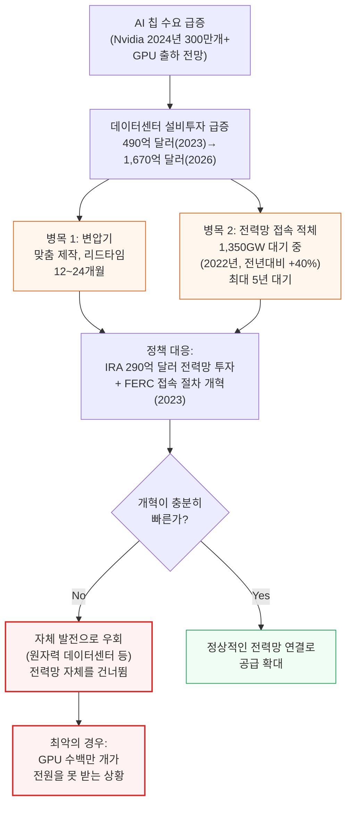

이런 개혁이 실질적인 성과를 내지 못하면, 데이터센터 사업자들은 곧 전력망 자체를 우회하는 자체 발전 프로젝트(원자력 연계 데이터센터가 더 늘어날 수도 있음)에 의존하게 될 수 있습니다. 최악의 경우, 송전망 자체가 AI 컴퓨팅 공급의 병목이 되어 수백만 개의 AI 가속기 칩이 전원을 공급받지 못한 채 방치될 수도 있습니다.

### 데이터센터 설비투자 전망과 항목별 비중

이런 제약이 모두 해결된다는 전제 하에, GPU 등 가속기 출하량 자체만으로도 데이터센터 설비(장비) 지출은 크게 늘어날 것입니다. 데이터센터 설비투자(서버·네트워크 같은 IT 장비는 제외한 시설 부분만)는 2023년 490억 달러에서 2026년 **1,670억 달러**로, 약 **3.4배** 성장할 것으로 추정됩니다.

| 항목 | 설비투자 비중 | 주요 구성 요소 |
|---|---|---|
| 전력 설비 | 40~45% | 변압기, 중압 배전반, 발전기, UPS, 배전반, 전력 분배 장치 |
| 냉각 설비 | 약 30% | 실내 냉각 장치(CRAH), 칠러, 냉각탑, 냉각수 분배 장치(CDU) |
| 기타 설비 | 나머지 | 건물 관리 시스템(BMS), 화재 진압 시스템, IT 인클로저, 각종 센서·부속 설비 |

이는 가속기 출하량 모델을 기반으로 한 연간 추정치이며, 실제 설비투자는 데이터센터 건설이 훨씬 "덩어리(lumpy)"로 이루어진다는 특성 때문에 이보다 들쭉날쭉할 수 있습니다. 미국의 전력망 접속 적체는 이미 상당한 걸림돌이 되고 있습니다 — 천연가스 공급은 풍부하고 태양광 프로젝트 확충도 결국 자본의 문제일 뿐이지만, 지역·광역 전력 배전망 자체가 급증하는 전력 접속 수요를 감당할 준비가 되어 있지 않습니다.

---

## 11. 지속가능성과 재생에너지 PPA

**📌 핵심:**
- Meta는 재생에너지 장기구매계약(PPA)으로 2022년 배출량을 1,230만 톤 줄여, PPA가 없었다면 2,080만 톤이었을 배출량을 850만 톤으로 낮춤(약 59% 감소) → 하지만 이는 회계상의 "재생에너지 100%"일 뿐, 데이터센터가 실제로 밤에도 태양광 전기만 쓰는 것은 아님
- 태양광·풍력은 24시간 발전하지 않는데 데이터센터는 24시간 똑같은 전력을 씀 → 아무리 재생에너지를 많이 사도 데이터센터의 실제 탄소집약도는 전력망 평균 대비 50~60% 수준까지만 낮아짐
- 구글의 오리건 데이터센터는 수력 80% 지역 전력을 써서 89%까지 상시 무탄소 전력(CFE)을 달성(탄소집약도 미국 평균의 약 5분의 1) → 이런 최상급 사례조차 100%에는 못 미침
- 결론: "재생에너지 100%"라는 기업 발표와 "실제로 밤낮 없이 무탄소 전력만 쓴다"는 것 사이에는 여전히 큰 간극이 있으며, 이를 메울 대용량 에너지 저장 기술(LDES)은 아직 상용화 전 단계

---

### 데이터센터가 이미 지역 전력망에 주는 부담

데이터센터는 이미 지역 전력망에 실질적인 영향을 주고 있습니다. 예를 들어 싱가포르에서는 데이터센터 전력 소비가 전국 발전량의 8%에 도달하자 아예 신규 건설을 금지한 전례가 있습니다(9장 참고). 데이터센터는 수자원에도 부담을 주고 상당한 탄소를 배출합니다 — SemiAnalysis 추정으로 미국 내 모든 데이터센터는 2026년까지 누적 1억 5,500만 메트릭톤의 CO2를 배출할 전망이며, 이는 승용차 3,370만 대의 연간 배출량과 맞먹습니다.

### Meta 사례: "재생에너지 100%"의 실체

전력 인프라와 탄소 배출에 대한 영향은 이미 막대하며, 거의 모든 하이퍼스케일러가 순배출제로(net-zero) 목표를 내걸고 데이터센터를 100% 재생에너지로 운영하겠다고 밝히는 이유입니다.

Meta는 데이터센터 지속가능성 노력의 대표적인 사례로, 2017년 대비 운영 배출량을 97% 줄였고 2020년부터 운영 배출을 순배출제로로 유지하고 있다고 밝혔습니다. 다만 이 발표를 제대로 이해하려면 배경 설명이 필요합니다.

**📌 용어 풀이: Scope 1/2/3 배출과 PPA의 실제 효과**
> - **Scope 1**: 회사 시설에서 직접 배출하는 탄소 (예: 자체 발전기 가동)
> - **Scope 2**: 구매한 전력을 쓰면서 간접적으로 발생하는 탄소
> - **Scope 3**: 회사가 소비하는 제품·서비스의 생산·운송 과정 전체에서 발생하는 간접 배출 (공급망 전체, 예: 칩 제조 시 발생한 내재 배출량)
> - Meta의 "-97%"는 Scope 1·2(직접 배출 + 구매 전력 배출)에 대한 이야기이며, Scope 3(공급망 전체 배출)는 대부분 기업이 여전히 상당량 배출 중 — 공급망 전체를 개선하려면 시간이 오래 걸림
> - Meta는 재생에너지 PPA로 2022년 배출량을 1,230만 톤 줄여 총배출량을 850만 톤으로 낮춤 → PPA가 없었다면 배출량은 2,080만 톤이었을 것 (PPA 덕분에 약 **59% 감소**)
> - Meta는 이 몇 년 사이 전력 소비량 7.2테라와트시(TWh)를 "100% 재생에너지"로 전환했다고 발표(상당한 성과)

데이터센터는 Meta의 에너지 사용에서 가장 큰 비중을 차지하며, 이 부문 배출은 Scope 1·2에 해당합니다. 다만 여기에는 몇 가지 명백한 현실적 한계가 있습니다. 데이터센터는 보통 24시간 내내 거의 일정한 전력을 소비하는 반면, 데이터센터의 주요 재생에너지원인 태양광은 당연히 24시간 발전하지 않습니다. 게다가 부지·개발 계획 제약으로 재생에너지 발전소가 데이터센터 바로 옆에 지어지는 경우는 거의 없습니다. 풍력과 수력이 흔한 대안이지만, 풍력 역시 24시간 일정하게 발전하지 않고, 수력은 24시간 발전하긴 해도 용량을 빠르게(혹은 아예) 늘리기 어렵습니다.

기업들이 재생에너지 구매의 대부분을 확보하는 방식은 전력 구매 계약(PPA)이며, 그중에서도 가장 흔한 형태가 **가상 전력 구매 계약(Virtual PPA)**입니다.

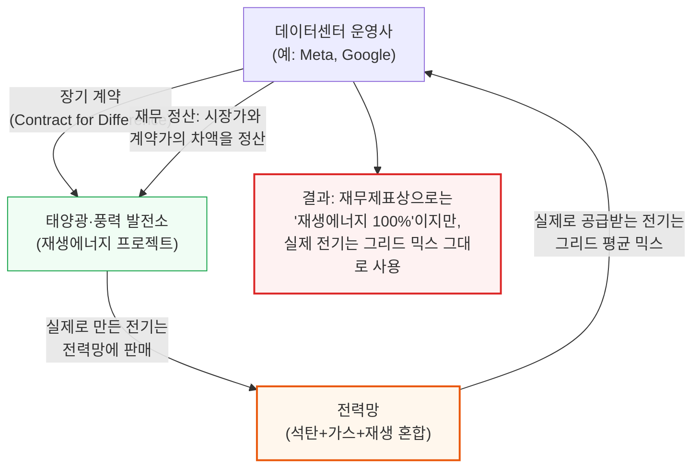

**📌 용어 풀이: Virtual PPA (가상 전력 구매 계약)**
> - 기업(구매자)이 재생에너지 프로젝트(태양광·풍력)에 자금을 대지만, 그 발전소가 만든 전기를 직접 받아 쓰지는 않음
> - 대신 발전소는 만든 전기를 그냥 전력망에 팔고, 구매자는 평소처럼 전력망에서 전기를 사서 씀
> - 그 대신 "차액 정산 계약(Contract for Difference)"으로, 시장 가격과 계약 가격의 차이를 정산해서, 결과적으로 구매자는 재생에너지 프로젝트에서 직접 산 것과 같은 경제적 효과를 얻음
> - 핵심: 전기 자체는 그리드에서 오지만, 재무적으로는 재생에너지를 "산 것"으로 계산됨

전력망에 재생에너지 공급을 늘리는 것 자체는 바람직하지만, 데이터센터가 실제로 소비하는 전자는 여전히 석탄·천연가스를 포함한 혼합 전원에서 옵니다. 이런 이유로 기업들은 투명성을 위해 배출량을 두 가지 방식으로 함께 보고해야 합니다.

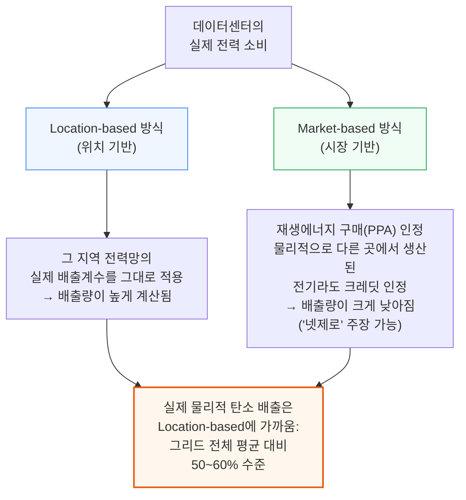

**📌 용어 풀이: Location-based vs Market-based**
> - **Location-based(위치 기반)**: 회사가 실제로 전기를 물리적으로 공급받는 지역 전력망(또는 계통 운영기관)의 실제 온실가스 배출계수를 그대로 적용
> - **Market-based(시장 기반)**: 그 전기가 물리적으로 어디서 왔는지와 무관하게, 재생에너지를 경제적으로 구매한 실적을 인정해 배출량에서 차감
> - 둘 다 진실의 한 측면이며, 그래서 국제 기준은 두 방식을 함께 보고하도록 요구

이렇게 그리드 전체에 재생에너지가 아무리 많이 추가돼도, 데이터센터 하나를 새로 짓는 것은 야간이나 재생에너지 발전이 낮은 날씨 조건에서 필요한 화석연료 기저부하 발전 수요를 늘리는 결과를 피할 수 없습니다. 데이터센터는 하루 종일 전력 소비가 일정하고, 전력 가격이 치솟을 때 소비를 줄이는 것도 자본 집약적 특성 때문에 주택·상업·산업용 수요자보다 훨씬 어렵습니다(비탄력적 수요자). 결과적으로 그리드 전체에 재생에너지를 아무리 추가해도, 데이터센터 자체의 탄소집약도는 전력을 100% 그리드에서만 조달할 때 대비 **50~60% 수준**까지만 낮아집니다.

### 24/7 무탄소 전력(CFE)이라는 궁극의 목표

이 딜레마는 주요 하이퍼스케일러들도 인지하고 있습니다. Microsoft는 장기적으로 소비 전력의 100%, 그것도 100%의 시간 동안 무탄소 전원에서 공급받는 것을 목표로 한다고 밝혔습니다. Google은 2023 환경보고서에서 사상 처음으로 **64%의 상시 무탄소 전력(24/7 CFE)** 수치를 공개했습니다.

최고 사례는 오리건입니다 — Google은 이곳에서 Bonneville Power Administration(전력의 80%를 수력에서 조달)으로부터 전력의 89%를 CFE 형태로 공급받으며, 탄소 배출률은 kWh당 0.075kg CO2e로 미국 평균(kWh당 0.387kg CO2e)보다 **약 80% 낮습니다**. 반대로 어려운 지역은 대부분의 동아시아 국가로, 상당한 전력을 수입 천연가스 등 화석연료에 의존합니다.

**📌 용어 풀이: LDES (장기 에너지 저장)**
> - 24시간 저렴하고 안정적인 재생에너지 공급은, 빠르게 확장할 수 없는 기존 수력을 빼면 현재로서는 불가능함 — 재생에너지 생산 시점과 소비 시점을 대규모·저비용으로 이어줄 에너지 저장 기술이 아직 없기 때문
> - 리튬이온 배터리는 아직 너무 비싸고 공급도 빠듯하며, 배터리 제조 자체의 내재 배출량 문제도 있음
> - 재생에너지+저장으로 전력의 90%를 충당하려 하면, 저장 수준이 낮은 재생에너지 시스템 대비 균등화 발전 비용(LCOE)이 2배로 뛸 수 있음
> - **LDES(Long Duration Energy Storage, 장기 에너지 저장)**가 이론적 해법으로 꼽히지만, 하나로 통일된 표준 기술이 없어 업계 컨센서스가 없고, 실제 대규모 상용화까지는 수년, 어쩌면 수십 년이 걸릴 전망
> - **양수발전(Pumped-hydro)**: 총소유비용 측면에서 유력한 후보. 1,000~2,000MW 규모의 전력 용량을 한 번에 제공할 수 있지만, 10억 달러 이상의 선투자와 최대 10년의 계획·인허가·건설 기간이 필요하고, 물 부족 우려·저수지 조성에 따른 지형 변화로 환경단체의 반대에도 부딪힘

비용 효율적인 에너지 저장 기술이 준비되기 전까지는, AI 데이터센터 수요를 충족하는 데 여전히 상당 부분 화석연료 기반의 기저부하·야간 발전에 의존할 수밖에 없는 것이 현재의 냉정한 현실입니다.

---

## 12. 태양광과 선벨트 지리경제학

**📌 핵심:**
- 미국은 남서부(애리조나·유타·뉴멕시코)의 낮은 위도와 적은 강수량 덕분에 태양광 발전량(PVOUT)이 연간 최대 2,000kWh/kWp까지 나와, 전세계 데이터센터 입지 중에서도 최상급 태양광 여건을 갖춤
- 캘리포니아 CAISO 지역의 태양광 PPA 가격은 kWh당 3.25센트로, 미국 산업용 평균 요금(8.32센트)보다 **61% 저렴** → 이 덕분에 워크로드가 인구 밀집지 대신 "전기가 싼 곳"을 따라가는 180도 전환이 일어남
- 중국은 태양광 제조업 세계 1위로 균등화 발전 비용(LCOE)이 세계 최저 수준(kWh당 5.8센트)이지만, 좋은 일조량은 인구가 적은 서북부에 몰려 있어 송전 손실·비용이라는 별도 대가를 치러야 함
- 결론: 데이터센터 입지 논리가 "사람 가까운 곳"에서 "전기가 싸고 햇빛이 좋은 곳"으로 바뀌면서, 미국 선벨트가 AI 데이터센터의 새로운 최적 입지로 떠오름

---

### 태양광이 데이터센터 재생에너지의 주력이 된 이유

지속가능성 측면에서도 미국은 여러 경쟁국 대비 유리한 입지에 있습니다. 태양광은 확장성, 상대적으로 빠른 배치 속도, 풍력 대비 안정적인 발전량 덕분에 미국 내 데이터센터 재생에너지 PPA를 주도합니다. 하이퍼스케일러들의 순배출제로 목표(적어도 시장 기반 기준으로는)를 고려하면, AI 데이터센터 붐을 뒷받침할 태양광을 대량으로 배치하는 것은 사실상 정해진 수순입니다.

**📌 용어 풀이: PVOUT, GHI, 설비 이용률**
> - **GHI(수평면 전일사량)**: 태양광 패널이 특정 기간 동안 받는 직접·확산 일사량의 총합 (단위: kWh/m²) — 계절별 일조시간·강수 패턴을 반영
> - **PVOUT**: 태양광 발전 시스템이 이론상 최대 발전 용량 대비 실제로 얼마나 발전하는지를 나타내는 지표 (단위: kWh/kWp) — 예를 들어 1kWp 용량의 태양광 시스템이 풀가동 시 1시간에 1kWh를 생산하므로, 1년 내내 풀가동이면 이론상 8,760kWh가 나오지만, 지구가 평평하지 않고 해가 항상 정중앙에 있지 않으며 구름·강수까지 있어 실제로는 이보다 훨씬 낮음
> - **설비 이용률(Capacity Factor)**: PVOUT을 이론상 최대치(8,760kWh)로 나눈 비율. 미국 평균 PVOUT 1,591kWh/kWp는 설비 이용률로 환산하면 18.2%

지역별로 태양광 발전 여건은 상당히 다릅니다.

| 지역 | PVOUT (kWh/kWp/년) | 비고 |
|---|---|---|
| 미국 평균 | 1,591 | 설비 이용률 18.2% |
| 미국 남서부(애리조나·유타·뉴멕시코) | 1,900~2,000 (세계 최상급) | 낮은 위도 + 적은 강수량 |
| 유럽(스페인 제외) | 1,201 | 프랑스 남부도 시카고와 같은 위도 — 위도가 높아 태양광 여건이 평범 |
| 일본·싱가포르·말레이시아·인도네시아 | 1,200 이상 | 대형 프로젝트 다수 진행 중 |
| 중국 연안(인구 밀집 지역) | 1,100 미만 | 산업·인구가 몰린 지역은 일조량이 평범 |
| 중국 내몽골 등 서북부 | 1,700 이상 (연안 대비 55%+ 많음) | 장거리 초고압 송전선 필요 → 송전 손실·비용 추가 |
| 인도 마하라슈트라 | 1,566 | 균등화 발전 비용(LCOE) kWh당 6.9센트로 계산 |

### 미국 선벨트: 워크로드가 전기를 따라가는 시대

미국은 남서부(애리조나·유타·뉴멕시코 등)의 낮은 위도와 적은 강수량 덕분에 PVOUT이 1,900~2,000kWh/kWp에 달해 결정적인 우위를 갖습니다. 대규모 AI 데이터센터 프로젝트는 앞으로 전기값이 싸고 태양광 여건이 좋은 이런 주·지역을 적극적으로 찾아 나설 전망입니다. 이는 사실상 입지 논리의 180도 전환입니다 — 과거에는 버지니아 북부처럼 응답 속도(latency)에 민감한 워크로드를 따라 전력망이 지어졌지만, 이제는 워크로드(특히 학습)가 반대로 전기를 찾아 이동합니다. 캘리포니아처럼 전기요금이 kWh당 12~15센트에 달하는 곳과는 정반대의 흐름입니다.

이 때문에 미국 남서부에는 이미 수많은 데이터센터와 태양광 PPA 프로젝트가 몰려 있습니다. 캘리포니아를 포함한 서부 일부 지역의 전력망을 관리하는 CAISO(California Independent System Operator) 네트워크 기준, 2022년 평균 태양광 PPA 가격은 kWh당 3.25센트로, 미국 산업용 평균 전기요금(8.32센트) 대비 **61% 저렴**합니다. 이는 시장 기반 회계상 순배출제로를 달성하는 매우 경제적인 방법이기도 합니다.

### 중국과 인도: 세계 최저 LCOE, 하지만 지리적 제약

중국은 태양광 발전 설비(PV 시스템) 제조에서 세계를 선도하며, 2018년 기준 균등화 발전 비용(LCOE, 발전소를 짓고 운영하는 전체 비용을 총발전량으로 나눈 kWh당 실제 원가)이 kWh당 5.8센트로 세계 최저 수준을 기록했습니다 — 미국 뉴멕시코주 프로젝트보다 30% 낮은 수준입니다. 중국은 풍력·태양광 설치 용량 면에서도 세계를 선도해, 2022년 말 기준 태양광 278GW·풍력 310GW의 가동 용량을 보유하고 있습니다(같은 시점 미국은 태양광 72GW·풍력 141GW에 그침). 중국은 여기에 455GW를 추가로 늘리는 캠페인을 진행 중이며, 14차 5개년 계획이 끝나는 2025년까지 풍력·태양광 합계 1,371GW를 목표로 합니다.

다만 중국의 태양광 잠재력은 인구가 몰린 연안·공업 지역(PVOUT 1,100 미만으로 평범)과, 사람이 거의 없는 서북부(내몽골 등, PVOUT 1,700 이상으로 매우 우수)로 뚜렷이 갈립니다. 서북부에 대규모 용량을 추가하려면 이 전력을 연안·중부의 인구 밀집지로 실어 나를 초고압 송전선을 계속 건설·보강·유지해야 하고, 이 과정에서 송전 손실과 관련 인프라 비용이라는 별도의 대가가 따릅니다. 실제로 2022년 중국 전체 발전 설비 용량(2,564GW)의 23%에 해당하는 588GW가 풍력·태양광이었지만, 발전 특성상 변동성이 커서 실제 발전량 기준으로는 8,848TWh 중 13.5%(1,190TWh)에 그쳤습니다. 2025년까지 풍력·태양광 발전량이 2배로 늘어도 석탄은 여전히 중국 연료 믹스의 50% 이상을 차지할 전망입니다.

인도 역시 흥미로운 후보입니다. 전기요금(kWh당 11센트 수준)이 세계적으로 낮은 편이고 석탄 의존도가 높다는 점(75%, 중국의 61%보다도 더 더러움)은 중국과 비슷하지만, 태양광 발전 여건은 중국보다 유리합니다 — 인구 밀집 대도시 인근을 포함해 전국 대부분 지역에서 PVOUT이 1,400kWh/kWp를 넘고, 마하라슈트라주는 1,566kWh/kWp로 균등화 발전 비용이 kWh당 6.9센트에 불과해 중국 내몽골 프로젝트보다 약간 높은 수준입니다. 하이퍼스케일러들은 특히 추론 수요 확대를 염두에 두고, 이런 지리적 이점을 안고서라도 인도 시장 공략에 나설 가능성이 큽니다.

### 싱가포르의 우회로: 인도네시아 태양광 수입

9장에서 다룬 신규 건설 모라토리엄에 갇힌 싱가포르는 인도네시아 리아우 제도로부터 태양광 2GW를 수입하는 계획을 추진 중입니다. 총 5개 프로젝트에서 11GWp(기가와트피크) 규모의 태양광 발전 용량을 확보하고, 21GWh 규모의 배터리 에너지 저장 설비까지 결합해 이 2GW를 24시간 안정적으로 공급하는 것이 목표입니다. 이는 2022년 기준 12.7GW인 싱가포르의 기존 전체 발전 용량에 상당한 보탬이 되며, 성공한다면 화석연료 의존도가 높은 싱가포르의 상황을 바꾸고 24시간 재생에너지를 활용한 추가 데이터센터 용량 확보의 길을 열어줄 잠재력이 있습니다.

---

## 13. 결론: 진짜 AI 강대국은 미국

**📌 핵심:**
- 값싸고 안정적인 전기, 자급 가능한 연료 공급망, 상대적으로 깨끗한 전원 믹스라는 3가지 조건을 모두 충족하는 나라는 사실상 미국뿐
- 이 결과 AI 데이터센터 배치의 **70% 이상**이 중기적으로 미국에 집중될 전망 → 전세계 데이터센터 공급망 전반에 막대한 수요가 몰림
- 미국 내 Critical IT Power 수요는 2023년 23GW에서 2026년 52GW로 **2.3배** 성장하며, 데이터센터가 미국 전체 발전량에서 차지하는 비중도 4.5%에서 2026년 약 10%로 뛸 전망
- 결론: 전력이 곧 AI 패권의 새로운 병목이며, 이 병목을 가장 잘 풀어낼 수 있는 나라가 미국이라는 것이 이 리포트의 핵심 결론

---

지금까지 살펴본 여러 이유(9장의 국가별 전기요금·전원 믹스 비교, 10장의 설비·전력망 병목, 12장의 태양광 지리경제학)를 종합하면, 중기적으로 AI 데이터센터 배치의 **70% 이상**이 미국에 집중될 것으로 SemiAnalysis는 전망합니다. 이는 전세계 데이터센터 공급망의 모든 구성 요소(변압기, 발전기, 냉각 설비, 배전 장비 등)에 막대한 수요를 만들어냅니다.

AI 붐은 미국 내 총 Critical IT Power 수요를 2023년 23GW에서 2026년 **52GW**까지 끌어올릴 것으로 보이며(약 2.3배 성장), 이는 데이터센터가 미국 전체 발전량에서 차지하는 비중을 4.5%에서 2026년 약 **10%**로 크게 끌어올리는 결과로 이어집니다.

이 리포트 전체를 관통하는 메시지는 다음과 같습니다.

1. AI 데이터센터 전력 위기는 "지구가 데이터센터로 뒤덮인다"는 식의 과장된 시나리오가 아니라, 값싼 전기·안정적 공급망·깨끗한 전원 믹스라는 구체적 조건을 누가 충족하느냐의 문제
2. 이 조건들을 모두 갖춘 나라는 사실상 미국뿐이며, 일본·대만·한국·싱가포르는 수입 연료 의존으로 인한 고비용, 중국은 석탄 의존도와 반도체 수출 규제, 유럽은 지정학적 리스크와 규제로 인해 각각 발목이 잡혀 있음
3. 그 결과 전력이 곧 AI 패권 경쟁에서 GPU 자체 못지않게 중요한, 어쩌면 더 중요한 병목이 되고 있으며, 이 병목을 가장 잘 풀어낼 수 있는 나라가 다음 세대 AI 인프라 경쟁의 승자가 될 전망

---

*작성 진행률: 100% 완료*
*업데이트: 전체 13개 섹션 완료*
